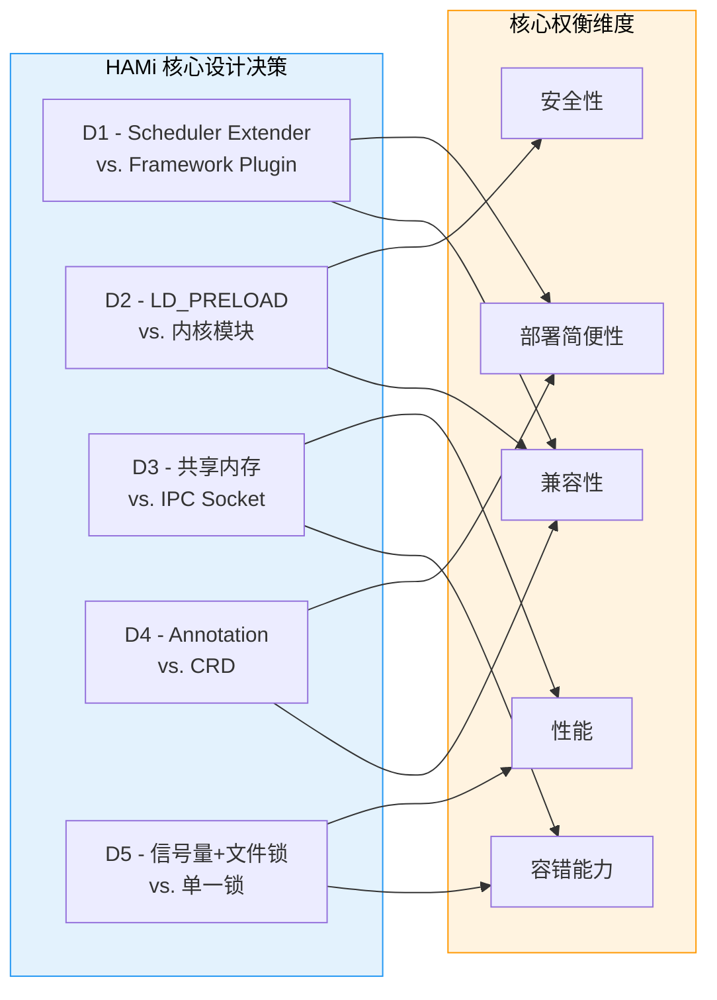
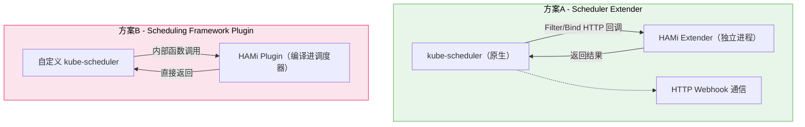
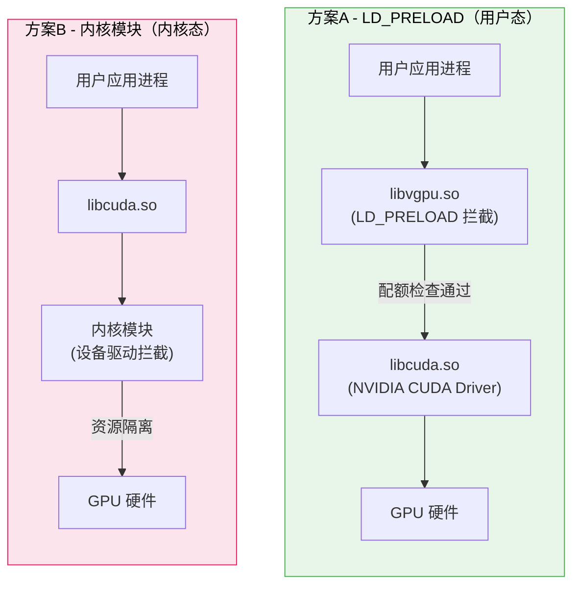
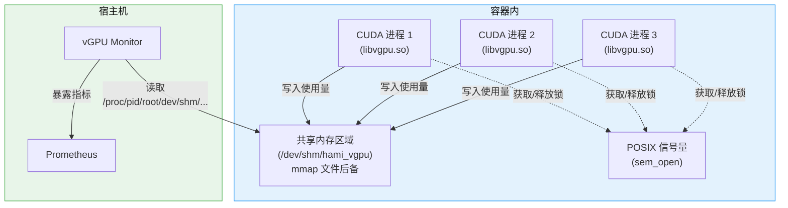
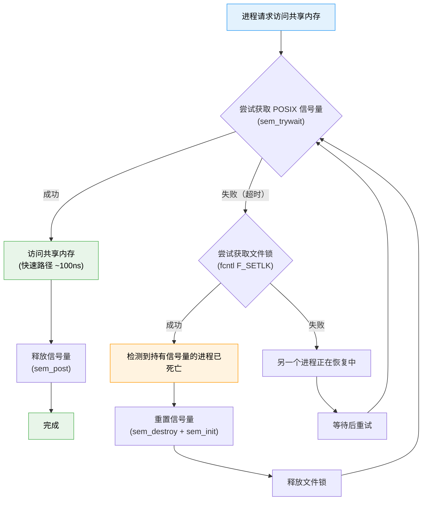
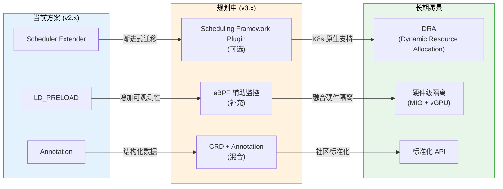

<p align="center">
  
  
</p>

> 本文档深入分析 HAMi 项目中的关键架构设计决策，探讨每个选择背后的技术考量、方案对比与权衡取舍，帮助开发者理解"为什么这样设计"以及在扩展时需要注意的约束条件。

---

## 1. 设计决策总览

HAMi 在架构设计过程中面临多个关键抉择，以下表格汇总了五个最重要的设计决策及其核心权衡：

| 编号 | 设计决策 | 选择方案 | 替代方案 | 核心权衡 |
|:----:|---------|---------|---------|---------|
| D1 | 调度扩展机制 | Scheduler Extender | Scheduling Framework Plugin | 部署简便性 vs. 调度性能 |
| D2 | GPU 拦截方式 | LD_PRELOAD 用户态拦截 | 内核模块 | 安全性与兼容性 vs. 不可绕过性 |
| D3 | 多进程协调 | 共享内存 (POSIX shm) | Unix Socket / gRPC | 性能与容错 vs. 实现复杂度 |
| D4 | 设备分配传递 | Pod Annotation | Custom Resource (CRD) | 实现简洁性 vs. 类型安全 |
| D5 | 共享区域锁机制 | 信号量 + 文件锁 | 仅信号量 / 仅文件锁 | 性能 + 容错 vs. 实现复杂度 |



---

## 2. D1 - 为什么选择 Scheduler Extender 而非 Scheduling Framework Plugin

### 2.1 背景

Kubernetes 提供两种调度扩展机制：

- **Scheduler Extender**: 通过 HTTP Webhook 扩展默认调度器，支持自定义 Filter、Score、Bind 等调度阶段
- **Scheduling Framework Plugin**: 原生的调度框架插件，编译进调度器二进制中，提供更多扩展点和更好的性能

### 2.2 方案对比



| 维度 | Scheduler Extender | Scheduling Framework Plugin |
|------|-------------------|---------------------------|
| **部署方式** | 独立 Deployment，不影响原生调度器 | 需要替换 kube-scheduler 二进制 |
| **K8s 版本兼容** | v1.18+ 全版本支持 | 需与 K8s 版本严格匹配 |
| **调度性能** | HTTP 网络开销（~1-5ms） | 进程内调用，无网络开销 |
| **扩展点** | Filter, Score, Bind | Filter, Score, Reserve, Permit, Bind 等 20+ 扩展点 |
| **升级维护** | 独立升级，不影响集群调度 | 需随 K8s 版本同步升级 |
| **故障隔离** | Extender 崩溃不影响原生调度 | 插件崩溃导致调度器不可用 |
| **多调度器冲突** | 可能与其他 Extender 冲突 | 框架内统一调度，无冲突 |

### 2.3 选择理由

HAMi 选择 Scheduler Extender 的核心考量：

1. **部署简便性**: 用户无需替换或重新编译 kube-scheduler，只需部署一个额外的 Deployment 即可获得 GPU 感知调度能力。这极大降低了采用门槛，尤其对于托管 Kubernetes 服务（如 EKS、AKS、GKE）至关重要
2. **广泛兼容性**: 支持 v1.18 到 v1.30 的所有 Kubernetes 版本，用户无需担心版本匹配问题
3. **故障隔离**: Extender 进程崩溃时，kube-scheduler 会回退到不使用 Extender 的默认行为，不会导致整个调度系统瘫痪
4. **独立升级**: HAMi 版本升级不需要重启或替换 kube-scheduler，降低运维风险

### 2.4 权衡与已知限制

- **性能开销**: 每次调度请求需要通过 HTTP 与 Extender 通信，引入 1-5ms 的网络延迟。在大规模调度场景（>1000 Pod/min）下可能成为瓶颈
- **单点调度**: Extender 的 Bind 阶段会获取节点锁，同一时刻仅能处理一个 Pod 的设备绑定，这在高并发场景下限制了调度吞吐量
- **有限扩展点**: 相比 Scheduling Framework 的 20+ 扩展点，Extender 仅支持 Filter、Score、Bind 三个阶段，无法在 Reserve 和 Permit 等阶段注入逻辑

### 2.5 未来演进

HAMi 社区正在评估向 Scheduling Framework Plugin 迁移的可行性。计划采用渐进式迁移策略，先保持 Extender 兼容性，同时提供可选的 Framework Plugin 实现，让用户根据自身场景选择：

| 场景 | 推荐方案 |
|------|---------|
| 托管 K8s 服务（无法替换调度器） | Scheduler Extender |
| 自建集群，追求调度性能 | Scheduling Framework Plugin（规划中） |
| 需要与 Volcano 集成 | Volcano Plugin |

---

## 3. D2 - 为什么选择 LD_PRELOAD 而非内核模块

### 3.1 背景

GPU 资源隔离需要在某个层面拦截应用对 GPU 的访问请求。两种主流方案：

- **LD_PRELOAD（用户态）**: 通过 Linux 动态链接器在进程加载时优先加载自定义共享库，拦截 CUDA API 调用
- **内核模块（内核态）**: 在 Linux 内核中实现设备驱动级别的资源隔离

### 3.2 方案对比



| 维度 | LD_PRELOAD | 内核模块 |
|------|-----------|---------|
| **安全性** | 用户态运行，崩溃不影响系统 | 内核态运行，bug 可能导致系统 panic |
| **内核兼容性** | 无内核依赖，任意 Linux 内核均可 | 需要为每个内核版本编译/适配 |
| **部署复杂度** | 仅需挂载 .so 文件并设置环境变量 | 需要 root 权限加载内核模块 |
| **可绕过性** | 可以被绕过（清除 LD_PRELOAD 环境变量） | 不可绕过（内核层强制执行） |
| **性能开销** | 极小（仅在 CUDA API 调用时有额外函数调用） | 最小（内核中直接拦截） |
| **调试难度** | 用户态工具（gdb、strace）可直接调试 | 需要内核调试工具（kgdb、ftrace） |
| **NVIDIA 驱动兼容** | 与 NVIDIA 闭源驱动无冲突 | 可能与 NVIDIA 内核模块冲突 |

### 3.3 选择理由

HAMi 选择 LD_PRELOAD 的核心考量：

1. **无内核修改**: 不需要在宿主机上安装任何内核模块，避免了与 NVIDIA 闭源驱动的兼容性问题。这对于容器化环境尤为重要，因为容器通常不应该修改宿主机内核
2. **跨内核版本兼容**: libvgpu.so 是标准的 ELF 共享库，可在任意支持 LD_PRELOAD 的 Linux 系统上运行，无需为不同内核版本编译不同的模块
3. **用户态安全**: libvgpu.so 在用户态运行，即使存在 bug 也仅影响当前容器进程，不会导致宿主机内核崩溃
4. **部署简洁**: 只需通过 Device Plugin 将 libvgpu.so 挂载到容器，并设置 `LD_PRELOAD` 环境变量即可生效。无需 root 权限，无需重启节点

### 3.4 权衡与已知限制

- **可绕过性**: 恶意用户如果能够在容器内修改环境变量（`unset LD_PRELOAD`），可以绕过资源限制。但在标准 Kubernetes 部署中，容器的环境变量由 Device Plugin 设置，普通用户无法修改
- **API 覆盖范围**: 需要逐一拦截所有相关的 CUDA API。如果 NVIDIA 新增了 API 或修改了 API 行为，libvgpu.so 需要相应更新
- **性能微开销**: 每次 CUDA API 调用会增加一次函数跳转和条件检查，但相比 GPU 计算本身的耗时，该开销可忽略不计（< 1us）

### 3.5 安全加固措施

尽管 LD_PRELOAD 方案存在理论上的可绕过性，HAMi 通过以下措施进行加固：

1. **vGPU Monitor 监控**: Monitor 组件通过共享内存独立监控 GPU 使用量，如果检测到异常超额使用，会上报告警
2. **NVML 拦截**: 同时拦截 NVML API，使容器内的 `nvidia-smi` 也展示受限后的资源信息
3. **容器安全上下文**: 建议配置 Pod SecurityContext 限制容器权限，防止用户修改环境变量

---

## 4. D3 - 为什么选择共享内存进行多进程协调

### 4.1 背景

一个容器内可能运行多个 CUDA 进程（如多个 worker 进程、PyTorch DataParallel 等），这些进程需要协调共享同一块 GPU 的资源配额。同时，宿主机上的 vGPU Monitor 也需要读取容器内各进程的 GPU 使用数据。

### 4.2 方案对比

| 维度 | 共享内存 (mmap) | Unix Socket | gRPC / HTTP |
|------|----------------|-------------|-------------|
| **通信延迟** | ~100ns（直接内存访问） | ~10us（系统调用） | ~100us（网络栈） |
| **进程崩溃恢复** | 数据持久化在文件中 | 连接断开需重建 | 连接断开需重建 |
| **实现复杂度** | 中等（需处理同步） | 低（标准 socket API） | 较高（序列化/反序列化） |
| **Monitor 可读性** | 直接读取共享文件 | 需要作为客户端连接 | 需要作为客户端连接 |
| **无守护进程** | 无需常驻进程 | 需要 server 进程 | 需要 server 进程 |

### 4.3 选择理由

1. **极低延迟**: CUDA API 调用频率极高（每秒数千到数百万次），共享内存的 ~100ns 访问延迟远低于其他 IPC 方案。对 cudaMalloc / cudaLaunchKernel 等热路径上的性能至关重要
2. **文件后备持久性**: 使用 `mmap` 映射文件后备的共享内存区域，即使某个 CUDA 进程崩溃，其他进程仍能通过映射文件读取到最后的状态数据
3. **无守护进程**: 不需要在容器内运行额外的守护进程来协调资源。每个 CUDA 进程直接通过 mmap 访问共享区域，简化了部署架构
4. **Monitor 友好**: vGPU Monitor 可以从宿主机直接读取容器的共享内存文件（通过 `/proc/<pid>/root/` 路径），无需与容器内进程建立连接

### 4.4 共享内存架构



### 4.5 权衡与已知限制

- **同步复杂度**: 多进程并发访问共享内存需要仔细的同步机制。HAMi-core 使用 POSIX 信号量 + 文件锁的双层锁方案（详见 D5）
- **数据结构版本**: 共享内存的数据结构需要保持向前兼容。HAMi-core 在共享区域头部包含版本号，用于检测不兼容的情况
- **容器隔离考量**: 共享内存文件位于容器的 tmpfs（/dev/shm）中，受容器的 shmSize 限制。默认的 64MB 限制对 HAMi 场景绰绰有余

---

## 5. D4 - 为什么使用 Annotation 传递设备分配信息而非 CRD

### 5.1 背景

Scheduler Extender 在 Bind 阶段确定设备分配方案后，需要将分配结果传递给 Device Plugin。HAMi 选择将设备分配信息编码后写入 Pod Annotation，而非使用 Custom Resource Definition (CRD)。

### 5.2 方案对比

| 维度 | Pod Annotation | Custom Resource (CRD) |
|------|---------------|----------------------|
| **部署依赖** | 无额外依赖 | 需要安装 CRD |
| **数据模型** | 字符串键值对 | 强类型 schema |
| **验证能力** | 无内置验证 | OpenAPI schema 验证 |
| **查询能力** | 仅能通过 Pod 查询 | 支持独立查询、List/Watch |
| **原子性** | 与 Pod 生命周期绑定 | 独立生命周期，需手动清理 |
| **性能** | 无额外 API 调用 | 需要额外的 CR 创建/查询 |
| **实现复杂度** | 编码/解码字符串 | 定义 CRD + Controller |

### 5.3 数据流对比

```mermaid
flowchart TD
    subgraph annotation_flow["方案A - Annotation"]
        SA1["Scheduler Bind"]
        SA2["写入 Pod Annotation
hami.io/vgpu-devices-allocated"]
        SA3["Device Plugin Allocate"]
        SA4["读取 Pod Annotation"]
        SA1 --> SA2
        SA2 --> SA3
        SA3 --> SA4
    end

    subgraph crd_flow["方案B - CRD"]
        SC1["Scheduler Bind"]
        SC2["创建 DeviceAllocation CR"]
        SC3["Device Plugin Allocate"]
        SC4["查询 DeviceAllocation CR"]
        SC5["清理 CR（Pod 删除时）"]
        SC1 --> SC2
        SC2 --> SC3
        SC3 --> SC4
        SC4 -.-> SC5
    end

    style annotation_flow fill:#e8f5e9,stroke:#4caf50,color:#000
    style crd_flow fill:#fce4ec,stroke:#e91e63,color:#000
```



### 5.4 选择理由

1. **零依赖部署**: 使用 Annotation 无需安装任何 CRD，降低了用户的部署门槛。尤其对于权限受限的环境（无法创建 CRD），Annotation 方案是唯一选择
2. **生命周期绑定**: 设备分配信息与 Pod 的生命周期天然绑定。Pod 被删除时，Annotation 自动清除，无需额外的 GC（垃圾收集）逻辑
3. **原子性**: 设备分配信息作为 Pod 的一部分被原子性地写入，不存在 Pod 和 CR 之间的一致性问题
4. **性能**: Device Plugin 的 Allocate 回调中直接读取 Pod Annotation，无需额外的 API 调用查询 CR

### 5.5 Annotation 编码格式

HAMi 将设备分配信息编码为 JSON 字符串存储在 Annotation 中：

```json
{
  "hami.io/vgpu-devices-allocated": "[{\"idx\":0,\"uuid\":\"GPU-xxxx\",\"type\":\"NVIDIA\",\"usedmem\":4096,\"usedcores\":50}]"
}
```

### 5.6 权衡与已知限制

- **无类型验证**: Annotation 是纯字符串，缺乏 CRD 的 OpenAPI schema 验证。编码/解码错误只能在运行时发现
- **大小限制**: 单个 Annotation 的值最大为 256KB。对于请求大量设备的极端场景，JSON 编码的分配信息可能接近此限制
- **查询不便**: 无法像 CRD 一样对设备分配进行独立的 List/Watch，调试时需要逐个查询 Pod 的 Annotation
- **字符串编码**: 多层 JSON 嵌套在 YAML 中（字符串内的 JSON），可读性和可调试性不佳

---

## 6. D5 - 为什么采用信号量 + 文件锁双层锁机制

### 6.1 背景

HAMi-core 的共享内存区域需要线程安全的并发访问控制。单纯使用一种锁机制无法同时满足性能和容错两方面的需求。

### 6.2 方案对比

| 锁机制 | 性能 | 死进程检测 | 实现复杂度 |
|--------|------|-----------|-----------|
| 仅 POSIX 信号量 | 极高（~100ns） | 无法检测（信号量不释放导致死锁） | 低 |
| 仅文件锁 (fcntl/flock) | 较高（~1us） | 自动释放（进程退出时内核回收） | 低 |
| 信号量 + 文件锁 | 极高（正常路径）+ 容错恢复 | 文件锁检测 + 信号量重置 | 中等 |

### 6.3 双层锁机制详解



### 6.4 选择理由

1. **信号量 - 快速路径**: 正常操作时使用 POSIX 信号量进行同步，获取/释放的开销约为 100ns，对 CUDA API 的热路径几乎无感知影响。绝大多数（>99.99%）的操作都走这条快速路径
2. **文件锁 - 恢复路径**: 当进程异常退出（SIGKILL、OOM Kill 等）而未释放信号量时，使用文件锁进行死锁检测和恢复。Linux 内核会在进程退出时自动释放 fcntl 文件锁，因此可以通过尝试获取文件锁来判断持有信号量的进程是否仍然存活
3. **双层保障**: 信号量提供高性能，文件锁提供容错，两者互补，确保系统在各种异常情况下都能正常运行

### 6.5 容错场景分析

| 场景 | 信号量状态 | 文件锁状态 | 恢复行为 |
|------|-----------|-----------|---------|
| 正常操作 | 获取/释放正常 | 不使用 | 无需恢复 |
| 进程正常退出 | 正常释放 | 不使用 | 无需恢复 |
| 进程异常退出（持有信号量） | 未释放（死锁） | 内核自动释放 | 其他进程通过文件锁检测后重置信号量 |
| 进程异常退出（不持有信号量） | 无影响 | 无影响 | 无需恢复 |
| 恢复进程也崩溃 | 仍未释放 | 内核再次释放 | 下一个进程继续恢复流程 |

### 6.6 权衡与已知限制

- **实现复杂度**: 双层锁机制的实现和测试比单一锁方案复杂。需要仔细处理信号量重置的边界条件，确保不会误杀正在使用信号量的正常进程
- **恢复延迟**: 死锁检测和信号量重置需要几毫秒的时间。在进程频繁崩溃的极端场景下，恢复过程可能影响其他进程的正常操作
- **文件锁跨容器限制**: 文件锁的语义基于进程而非容器。在某些容器运行时配置下（共享 PID 命名空间），可能需要额外注意文件锁的行为

---

## 7. 设计决策演进路线

HAMi 的架构设计并非一成不变，随着 Kubernetes 生态和用户需求的演进，部分设计决策可能在未来版本中调整：



| 演进方向 | 驱动因素 | 预计时间线 |
|---------|---------|-----------|
| Scheduling Framework Plugin | K8s 社区推荐，性能提升 | v3.0 |
| eBPF 辅助监控 | 无侵入性能监控 | v3.x |
| Dynamic Resource Allocation (DRA) | K8s 1.31+ 原生设备管理 API | 长期 |

---

## 8. 下一步

- [代码结构解析](./02-code-organization/) -- 了解这些设计决策在代码中的具体实现
- [开发环境搭建](./01-development-setup/) -- 搭建开发环境，开始贡献代码
- [调度器深度解析](../03-scheduler/) -- 深入理解 Scheduler Extender 的实现细节
- [HAMi-core 拦截层](../06-hami-core/) -- 深入理解 LD_PRELOAD 拦截机制

---

<p align="center">
  <sub>HAMi Technical Documentation - Contributing Guide - Design Decisions</sub>
</p>
