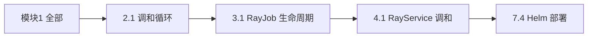
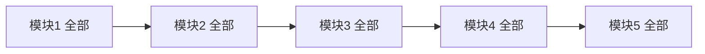
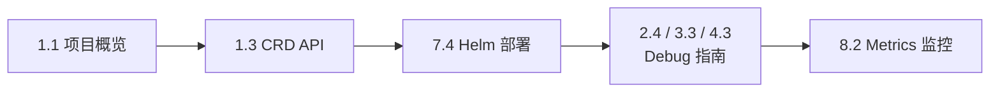

<p align="center">
  
  
  
</p>

> 本指南帮助不同技术背景和目标的读者，找到最适合自己的文档阅读路径。无论您是初次接触 KubeRay 的新手，还是希望深入源码的贡献者，都能在这里找到系统的学习路线。

---

## 阅读路径建议

### 初学者路线

适合刚接触 KubeRay 的读者，建立整体认知后快速上手。



**推荐文章**：
1. [KubeRay 是什么](../01-architecture-overview/01-what-is-kuberay.md)
2. [系统架构全景](../01-architecture-overview/02-overall-architecture.md)
3. [CRD 类型体系与 API 设计](../01-architecture-overview/03-crd-api-design.md)
4. [调和循环核心流程](../02-raycluster-controller/01-reconciliation-loop.md)
5. [RayJob 生命周期管理](../03-rayjob-controller/01-rayjob-lifecycle.md)
6. [RayService 调和核心流程](../04-rayservice-controller/01-rayservice-reconciliation.md)
7. [Helm Chart 部署指南](../07-peripheral-components/04-helm-charts.md)

### 开发者路线

适合希望深入理解控制器实现的开发者。



### 运维者路线

适合负责 KubeRay 部署和运维的工程师。



### 高级开发者路线

适合希望参与 KubeRay 开发或扩展的高级开发者。


### 全量阅读路线

按推荐顺序通读所有文档。

```
模块1 → 模块2 → 模块5 → 模块3 → 模块4 → 模块6 → 模块7 → 模块8
```

---

## 文档规范

本文档系列遵循以下编写规范：

- 每篇文档开头包含 shields.io 徽章、前置知识说明、本文目标
- 代码引用标注准确的文件路径和行号
- 使用 Mermaid 图表辅助说明（flowchart / sequence diagram / state diagram）
- 文档间通过 Markdown 链接互相引用
- 每篇文档结尾包含"延伸阅读"和"下一篇"导航

---

## 基于版本

| 组件 | 版本 |
|------|------|
| KubeRay | master 分支 (2026-02) |
| Go | 1.25 |
| controller-runtime | v0.22.4 |
| Kubernetes | 1.32+ |
| Ray | 2.52.0 |

---

## 贡献与反馈

如果您发现文档中的错误或有改进建议，欢迎通过以下方式反馈：

- [KubeRay GitHub Issues](https://github.com/ray-project/kuberay/issues)
- [KubeRay Slack Channel](https://ray-distributed.slack.com/)

---

*本文档系列由 AI 辅助生成，基于 KubeRay 源码分析编写。*

*Illustrations by [Storyset](https://storyset.com/)*
