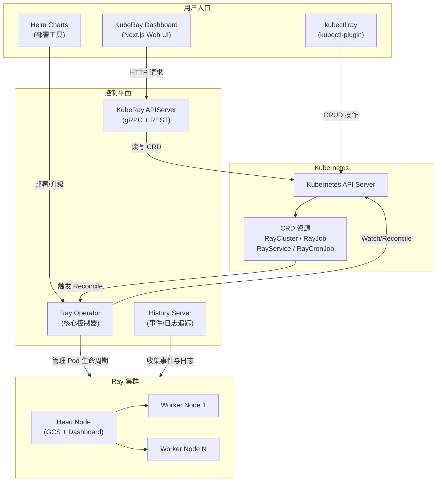
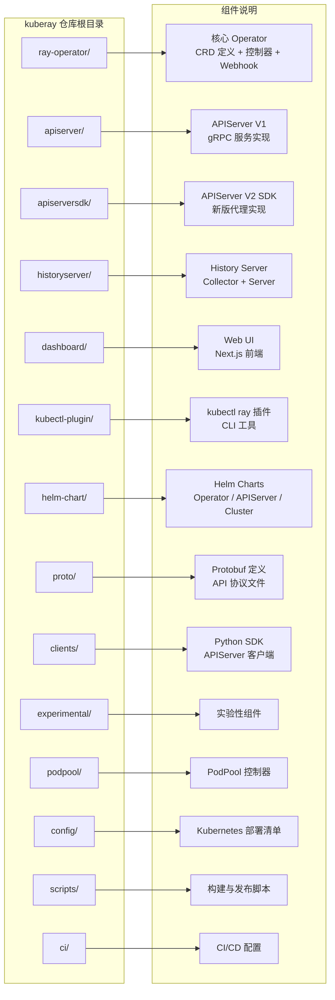

<p align="center">
  
</p>

> 本文是 KubeRay 深度剖析系列的第一篇，将从整体视角介绍 KubeRay 的定位、生态组件、CRD 设计以及项目目录结构，为后续各模块的深入分析建立全局认知。

---

## 目录

- [前置知识](#前置知识)
- [什么是 Ray](#什么是-ray)
- [为什么需要 KubeRay](#为什么需要-kuberay)
- [KubeRay 生态组件全景](#kuberay-生态组件全景)
- [四大 CRD 资源详解](#四大-crd-资源详解)
- [项目目录结构导航](#项目目录结构导航)
- [开发者快速上手路径](#开发者快速上手路径)
- [延伸阅读](#延伸阅读)
- [下一篇](#下一篇)

---

## 前置知识

在阅读本文之前，建议你具备以下基础知识：

| 领域 | 建议掌握程度 | 参考资料 |
|------|-------------|---------|
| Kubernetes 基础 | 了解 Pod、Service、Deployment、CRD 等核心概念 | [Kubernetes 官方文档](https://kubernetes.io/docs/) |
| Go 语言 | 能阅读 Go 代码，了解 interface、goroutine 等特性 | [Go Tour](https://go.dev/tour/) |
| Operator 模式 | 了解 Controller-Runtime 和 Reconcile Loop 的基本原理 | [Operator SDK 文档](https://sdk.operatorframework.io/) |
| Ray 框架 | 了解 Ray 的基本使用场景（分布式计算、Serve、Train） | [Ray 官方文档](https://docs.ray.io/) |

---

## 什么是 Ray

[Ray](https://github.com/ray-project/ray) 是由 UC Berkeley RISELab 开源的通用分布式计算框架。它的核心设计理念是**让开发者用最少的代码改动，将单机 Python 程序扩展为分布式应用**。

Ray 的核心架构由以下几层组成：

| 层级 | 说明 | 典型组件 |
|------|------|---------|
| **Ray Core** | 底层分布式运行时，提供 Task、Actor、Object Store 等原语 | GCS（Global Control Service）、Raylet、Object Store |
| **Ray AI Libraries** | 面向 AI/ML 场景的高阶库 | Ray Train、Ray Tune、Ray Data、Ray Serve |
| **Ray Cluster** | 集群管理层，负责节点调度与自动扩缩容 | Autoscaler、Head Node、Worker Node |

一个典型的 Ray 集群包含：

- **Head Node**：运行 GCS（全局控制服务）、Dashboard、Autoscaler，是集群的控制平面
- **Worker Node**：执行实际的 Task 和 Actor，可动态扩缩

Ray 在单机或云环境中已经非常成熟，但当它运行在 Kubernetes 上时，就出现了一系列需要解决的问题。

---

## 为什么需要 KubeRay

Ray 本身提供了集群启动脚本和 Autoscaler，但这些机制**并不是为 Kubernetes 原生设计的**。将 Ray 直接部署到 Kubernetes 上会面临以下挑战：

### 核心痛点

| 痛点 | 问题描述 | KubeRay 的解决方式 |
|------|---------|-------------------|
| **生命周期管理** | 手动管理 Head/Worker Pod 的创建、删除、重启，容易出错 | Operator 自动管理 Pod 生命周期，声明式配置 |
| **自动扩缩容** | Ray Autoscaler 需要与 K8s API 交互创建/删除 Pod，权限和实现复杂 | Operator 内置 Autoscaler 集成，自动响应 Ray 的扩缩需求 |
| **作业提交** | 需要手动等待集群就绪后再提交作业，缺少声明式的 Job 管理 | RayJob CRD 自动编排集群创建与作业提交 |
| **服务升级** | Ray Serve 在线服务升级时难以保证零停机 | RayService CRD 提供蓝绿部署和渐进式升级策略 |
| **容错恢复** | GCS 故障会导致集群元数据丢失 | 支持 GCS 容错（GcsFaultToleranceOptions）和外部 Redis |
| **多租户与调度** | 缺少与 K8s 调度器（Volcano、Kueue、YuniKorn）的集成 | 内置 BatchScheduler 框架，支持多种调度器插件 |
| **可观测性** | Ray Dashboard 数据随集群销毁而丢失 | History Server 提供持久化的事件和日志追踪 |

**一句话总结**：KubeRay 是 Ray 与 Kubernetes 之间的桥梁 --- 它将 Ray 的分布式计算能力与 Kubernetes 的编排管理能力无缝对接，让用户以 Kubernetes 原生的声明式方式管理 Ray 工作负载。

---

## KubeRay 生态组件全景

KubeRay 不仅仅是一个 Operator，而是围绕 Ray on Kubernetes 构建的完整生态系统。以下是各组件的定位与成熟度：

### 组件总览

| 组件 | 定位 | 成熟度 | 主要技术栈 |
|------|------|--------|-----------|
| **Ray Operator** | 核心控制器，管理 4 种 CRD 资源的完整生命周期 | **Stable** | Go, Controller-Runtime |
| **APIServer** | 提供 gRPC + REST Gateway 的统一 API 接口 | **Alpha** | Go, gRPC, Protobuf |
| **History Server** | 收集、存储和展示 Ray 集群的历史日志与事件 | **Active Dev** | Go |
| **Dashboard** | 基于 Next.js 的 Web UI，用于查看和管理 KubeRay 资源 | **Experimental** | Next.js, React, MUI |
| **kubectl-plugin** | CLI 工具，简化 Ray on K8s 的常见操作流程 | **Beta** | Go |
| **Helm Charts** | Kubernetes 部署包，包含 Operator 和 APIServer 的 Chart | **Stable** | Helm |

### 组件关系图



### 各组件详解

#### 1. Ray Operator - 核心控制器

Ray Operator 是整个 KubeRay 项目的核心，基于 [controller-runtime](https://github.com/kubernetes-sigs/controller-runtime) 构建。它通过 Watch-Reconcile 模式监听 CRD 资源的变化，并驱动实际状态向期望状态收敛。

**核心职责**：
- 管理 RayCluster 的 Head/Worker Pod 创建、删除与扩缩容
- 编排 RayJob 的集群创建、作业提交与资源回收
- 实现 RayService 的零停机升级策略
- 调度 RayCronJob 的定时任务触发

**入口文件**：`ray-operator/main.go`

**控制器文件**：
- `ray-operator/controllers/ray/raycluster_controller.go`
- `ray-operator/controllers/ray/rayjob_controller.go`
- `ray-operator/controllers/ray/rayservice_controller.go`
- `ray-operator/controllers/ray/raycronjob_controller.go`

#### 2. APIServer - 统一 API 网关

KubeRay APIServer 提供了一层 gRPC + REST 的 API 抽象，适用于需要通过 Web 界面或编程方式管理 KubeRay 资源的场景。它本质上是一个 Kubernetes API 的代理层，简化了 CRD 的操作接口。

> 注意：APIServer 当前处于 Alpha 阶段。KubeRay 同时维护了一个 `apiserversdk/` 目录，提供更新的 V2 版本代理实现。

**Protobuf 定义**：`proto/` 目录下的 `.proto` 文件
**Python SDK 客户端**：`clients/python-apiserver-client/`

#### 3. History Server - 历史事件与日志追踪

History Server 用于解决 Ray 集群销毁后历史数据丢失的问题。它由两个子组件构成：

- **Collector**：以 Sidecar 形式运行在 Ray 集群中，负责收集日志和元数据
- **History Server**：中心化服务，聚合来自各 Collector 的数据并提供 Web UI 和 API

**主要 API 端点**（参考最新提交记录）：
- `/api/v0/tasks/timeline` - 任务时间线
- `/events` - 事件查询
- `/logs/file` - 日志文件解析
- `/logs/stream` - 日志流式传输

#### 4. Dashboard - Web UI

KubeRay Dashboard 是从 v1.4.0 开始引入的实验性 Web UI，基于 Next.js 15 + React 18 + MUI 构建。它通过 Kubernetes Client Node SDK 直接与 K8s API 交互，提供 KubeRay 资源的可视化管理能力。

**技术栈**：Next.js 15、React 18、MUI Joy、SWR、TypeScript

#### 5. kubectl-plugin - CLI 工具

从 KubeRay v1.3.0 开始引入的 kubectl 插件，允许用户通过 `kubectl ray` 命令简化 Ray on Kubernetes 的常见操作，例如查看集群状态、提交作业等。

#### 6. Helm Charts - 部署包

Helm Charts 目录提供了标准化的 Kubernetes 部署方式：

- `helm-chart/kuberay-operator/` - Operator 的 Helm Chart
- `helm-chart/kuberay-apiserver/` - APIServer 的 Helm Chart
- `helm-chart/ray-cluster/` - Ray 集群模板 Chart

---

## 四大 CRD 资源详解

KubeRay 通过四种 Custom Resource Definition（CRD）来抽象 Ray on Kubernetes 的核心工作负载。所有 CRD 定义在 `ray-operator/apis/ray/v1/` 目录下。

| CRD | 类型文件 | API 版本 | 核心用途 |
|-----|---------|---------|---------|
| **RayCluster** | `raycluster_types.go` | `ray.io/v1` | 声明式管理 Ray 集群的完整生命周期 |
| **RayJob** | `rayjob_types.go` | `ray.io/v1` | 编排一次性 Ray 作业的提交与集群管理 |
| **RayService** | `rayservice_types.go` | `ray.io/v1` | 管理 Ray Serve 在线服务的部署与升级 |
| **RayCronJob** | `raycronjob_types.go` | `ray.io/v1` | 按 Cron 表达式定时调度 RayJob |

### RayCluster

RayCluster 是最基础的 CRD，定义了一个 Ray 集群的完整拓扑结构。Operator 根据 `HeadGroupSpec` 和 `WorkerGroupSpecs` 创建对应的 Pod，并管理自动扩缩容、Suspend/Resume、GCS 容错等高级特性。

**关键字段**（参考 `ray-operator/apis/ray/v1/raycluster_types.go`）：

```go
type RayClusterSpec struct {
    HeadGroupSpec           HeadGroupSpec            `json:"headGroupSpec"`
    WorkerGroupSpecs        []WorkerGroupSpec        `json:"workerGroupSpecs,omitempty"`
    EnableInTreeAutoscaling *bool                    `json:"enableInTreeAutoscaling,omitempty"`
    AutoscalerOptions       *AutoscalerOptions       `json:"autoscalerOptions,omitempty"`
    Suspend                 *bool                    `json:"suspend,omitempty"`
    GcsFaultToleranceOptions *GcsFaultToleranceOptions `json:"gcsFaultToleranceOptions,omitempty"`
    UpgradeStrategy         *RayClusterUpgradeStrategy `json:"upgradeStrategy,omitempty"`
    // ...
}
```

### RayJob

RayJob 在 RayCluster 的基础上增加了作业编排能力。当 RayJob 被创建后，Operator 会自动创建（或复用已有的）RayCluster，等待集群就绪后提交 Ray Job，并在作业完成后根据配置决定是否回收集群资源。

**作业状态机**（参考 `ray-operator/apis/ray/v1/rayjob_types.go`）：

```
JobStatusNew → JobStatusPending → JobStatusRunning → JobStatusSucceeded / JobStatusFailed / JobStatusStopped
```

### RayService

RayService 是面向在线推理服务（Ray Serve）的 CRD。它将 RayCluster 与 Ray Serve Deployment Graph 绑定在一起，并提供零停机升级策略：

- **NewCluster**：创建全新集群，就绪后切换流量
- **NewClusterWithIncrementalUpgrade**：通过 Gateway API 渐进式迁移流量
- **None**：不执行升级操作

### RayCronJob

RayCronJob 是最新引入的 CRD（`ray.io/v1`），允许用户以 Cron 表达式定时调度 RayJob。它的设计参考了 Kubernetes 原生的 CronJob，核心字段包括：

```go
type RayCronJobSpec struct {
    JobTemplate RayJobSpec `json:"jobTemplate"`
    Schedule    string     `json:"schedule"`
    Suspend     bool       `json:"suspend,omitempty"`
}
```

---

## 项目目录结构导航

以下是 KubeRay 仓库的顶层目录与组件的映射关系：



### 核心目录详解

#### `ray-operator/` - 核心 Operator

这是整个项目最核心的目录，包含了 CRD 定义、控制器逻辑、Webhook 校验以及各种工具函数。

```
ray-operator/
├── apis/
│   ├── config/v1alpha1/    # Operator 配置 API（KubeRayConfiguration）
│   └── ray/
│       ├── v1/             # 稳定版 CRD 类型定义
│       └── v1alpha1/       # Alpha 版 CRD 类型定义
├── controllers/ray/
│   ├── raycluster_controller.go   # RayCluster 控制器
│   ├── rayjob_controller.go       # RayJob 控制器
│   ├── rayservice_controller.go   # RayService 控制器
│   ├── raycronjob_controller.go   # RayCronJob 控制器
│   ├── batchscheduler/            # 批调度器集成（Volcano、Kueue 等）
│   ├── common/                    # 公共工具
│   ├── expectations/              # 控制器预期状态缓存
│   ├── metrics/                   # Prometheus 指标注册
│   └── utils/                     # 工具函数集
├── config/                         # Kustomize 部署清单
├── pkg/
│   ├── features/                   # Feature Gate 定义
│   └── webhooks/                   # Admission Webhook 实现
├── main.go                         # Operator 入口
└── Makefile                        # 构建与测试命令
```

#### `apiserver/` - APIServer V1

```
apiserver/
├── cmd/                    # 服务启动入口
├── pkg/                    # 核心业务逻辑
├── deploy/                 # 部署配置
└── test/                   # 集成测试
```

#### `historyserver/` - History Server

```
historyserver/
├── cmd/                    # collector 和 historyserver 启动入口
├── pkg/                    # 核心业务逻辑
├── config/                 # 配置文件
├── Dockerfile.collector    # Collector 镜像构建
├── Dockerfile.historyserver # Server 镜像构建
└── test/                   # 测试文件
```

#### `dashboard/` - Web UI

```
dashboard/
├── src/                    # Next.js 应用源码
├── public/                 # 静态资源
├── package.json            # 依赖管理（Next.js 15, React 18, MUI）
├── next.config.mjs         # Next.js 配置
├── tailwind.config.ts      # Tailwind CSS 配置
└── tsconfig.json           # TypeScript 配置
```

#### `proto/` - Protobuf 定义

```
proto/
├── cluster.proto           # RayCluster 相关 API 定义
├── job.proto               # RayJob 相关 API 定义
├── job_submission.proto    # Job Submission API 定义
├── serve.proto             # RayService 相关 API 定义
├── config.proto            # 配置相关定义
├── error.proto             # 错误类型定义
├── go_client/              # 生成的 Go 客户端代码
└── swagger/                # 生成的 Swagger 文档
```

---

## 开发者快速上手路径

根据你的兴趣和目标，以下是推荐的学习路径：

### 路径一 - 理解核心 Operator（推荐首选）

```
1. 阅读本文，建立全局认知
2. 阅读 ray-operator/apis/ray/v1/ 下的 CRD 类型定义
3. 从 ray-operator/main.go 开始，理解 Operator 启动流程
4. 深入 raycluster_controller.go，理解最基础的 Reconcile 循环
5. 依次阅读 rayjob_controller.go 和 rayservice_controller.go
6. 研究 batchscheduler/ 和 utils/ 了解调度集成与工具函数
```

### 路径二 - 参与 APIServer 开发

```
1. 阅读 proto/ 目录下的 .proto 文件，理解 API 协议设计
2. 阅读 apiserver/cmd/ 了解服务启动方式
3. 阅读 apiserversdk/ 了解新版 V2 代理实现
4. 查看 clients/python-apiserver-client/ 了解 Python SDK 的使用
```

### 路径三 - 前端与 Dashboard 开发

```
1. 阅读 dashboard/src/ 了解 Next.js 应用结构
2. 理解 @kubernetes/client-node 与 K8s API 的交互方式
3. 查看 dashboard/demo/ 了解演示配置
```

### 路径四 - History Server 开发

```
1. 阅读 historyserver/README.md 了解 Collector + Server 双组件架构
2. 从 historyserver/cmd/ 入口开始跟踪代码
3. 理解事件收集、日志流式传输的实现
```

### 本地开发环境搭建

```bash
# 克隆仓库
git clone https://github.com/ray-project/kuberay.git
cd kuberay

# 安装 Operator CRD 到本地 K8s 集群
cd ray-operator
make install

# 本地运行 Operator（需要 kubeconfig 指向一个可用集群）
make run

# 运行单元测试
make test

# 运行端到端测试
make test-e2e
```

---

## 延伸阅读

- [Ray 官方文档 - Kubernetes 部署指南](https://docs.ray.io/en/latest/cluster/kubernetes/index.html)
- [KubeRay GitHub 仓库](https://github.com/ray-project/kuberay)
- [RayCluster 快速入门](https://docs.ray.io/en/master/cluster/kubernetes/getting-started/raycluster-quick-start.html)
- [RayJob 快速入门](https://docs.ray.io/en/master/cluster/kubernetes/getting-started/rayjob-quick-start.html)
- [RayService 快速入门](https://docs.ray.io/en/master/cluster/kubernetes/getting-started/rayservice-quick-start.html)
- [kubectl-plugin 使用指南](https://docs.ray.io/en/latest/cluster/kubernetes/user-guides/kubectl-plugin.html)
- [KubeRay Dashboard 使用指南](https://docs.ray.io/en/master/cluster/kubernetes/user-guides/kuberay-dashboard.html)
- [KubeRay Kubernetes 生态集成](https://docs.ray.io/en/latest/cluster/kubernetes/k8s-ecosystem.html)
- [Controller-Runtime 框架文档](https://pkg.go.dev/sigs.k8s.io/controller-runtime)

---

## 下一篇

> **[02 - 系统架构全景](02-overall-architecture.md)**
>
> 下一篇将深入 `ray-operator/main.go`，详细分析 Operator 的启动流程，包括 Scheme 注册、Controller 初始化、Webhook 配置、Leader Election 以及 Feature Gate 机制。

---

*本文基于 KubeRay 仓库 `master` 分支编写，Go 版本 1.25，使用 controller-runtime 框架。*
