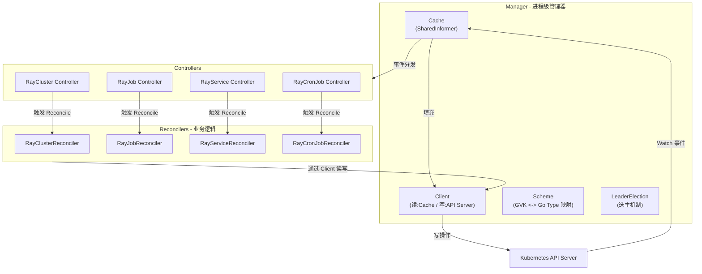
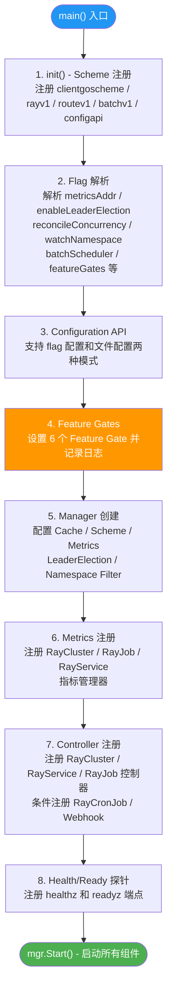
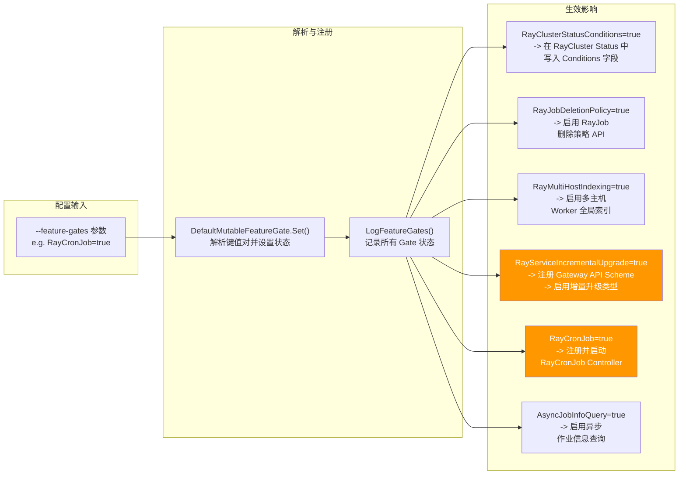
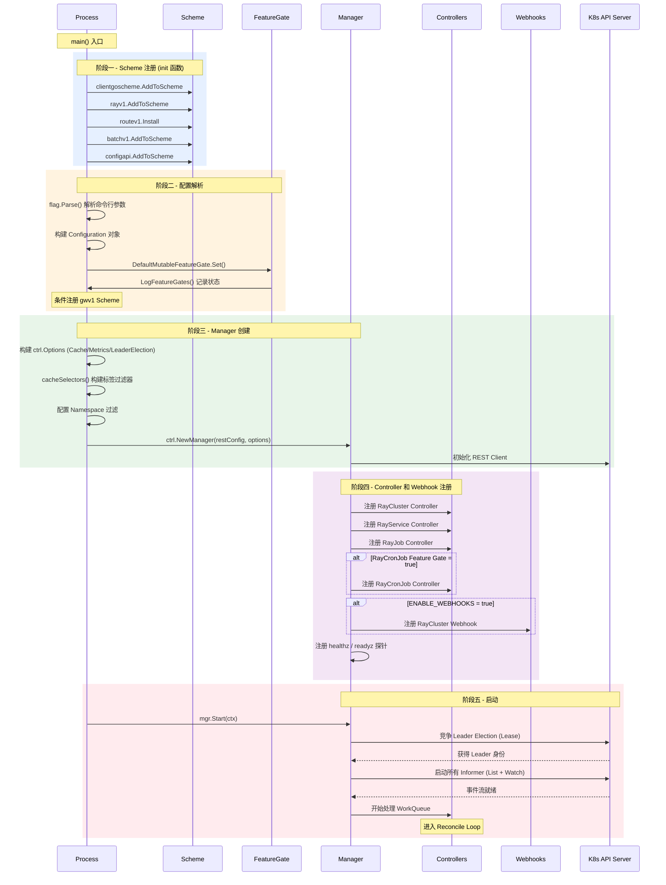

> 本文是 KubeRay 深度剖析系列的第二篇，将从 controller-runtime 框架基础出发，逐行拆解 `ray-operator/main.go` 的启动流程，深入分析 Scheme 注册、Manager 创建、Feature Gate 机制、Controller 注册、Leader Election、多命名空间 Watch 以及 Cache 选择器优化等核心设计。

---

## 目录

- [前置知识](#前置知识)
- [controller-runtime 框架基础](#controller-runtime-框架基础)
- [main.go 启动流程全景分析](#maingo-启动流程全景分析)
- [init 函数 - Scheme 注册](#init-函数---scheme-注册)
- [Flag 解析与 Configuration API](#flag-解析与-configuration-api)
- [Feature Gate 机制](#feature-gate-机制)
- [Manager 创建与配置](#manager-创建与配置)
- [多命名空间 Watch 配置](#多命名空间-watch-配置)
- [Cache 选择器优化](#cache-选择器优化)
- [Metrics 注册](#metrics-注册)
- [Controller 注册](#controller-注册)
- [Webhook 注册](#webhook-注册)
- [Health 与 Ready 探针](#health-与-ready-探针)
- [Leader Election 机制](#leader-election-机制)
- [启动流程总览图](#启动流程总览图)
- [延伸阅读](#延伸阅读)
- [下一篇](#下一篇)

---

## 前置知识

在阅读本文之前，请确保你已阅读并理解以下内容：

| 前置内容 | 说明 | 链接 |
|---------|------|------|
| **01 - KubeRay 项目概览** | 了解 KubeRay 的整体定位、生态组件、四大 CRD 资源和目录结构 | [01-what-is-kuberay.md](./01-what-is-kuberay.md) |
| **Kubernetes Operator 模式** | 理解 Custom Resource + Custom Controller 的基本协作模型 | [Operator Pattern](https://kubernetes.io/docs/concepts/extend-kubernetes/operator/) |
| **controller-runtime 文档** | 了解 Manager、Controller、Reconciler 等核心抽象 | [controller-runtime](https://pkg.go.dev/sigs.k8s.io/controller-runtime) |

---

## controller-runtime 框架基础

KubeRay Operator 基于 [controller-runtime](https://github.com/kubernetes-sigs/controller-runtime) 构建，这是 Kubernetes 生态中最主流的 Operator 开发框架。在深入 `main.go` 之前，我们需要理解该框架的四个核心抽象。

### 核心概念

| 概念 | 职责 | KubeRay 中的体现 |
|------|------|-----------------|
| **Manager** | Operator 进程的总管理器，负责管理所有 Controller、Cache、Client 的生命周期 | `ctrl.NewManager()` 创建，配置了 Scheme、Metrics、LeaderElection 等 |
| **Controller** | 绑定到某一类 GVK 资源上的控制循环，监听资源变更并触发 Reconcile | 4 个 Controller 分别监听 RayCluster、RayJob、RayService、RayCronJob |
| **Reconciler** | Controller 的核心逻辑接口，实现 `Reconcile(ctx, Request) (Result, error)` 方法 | `RayClusterReconciler`、`RayJobReconciler`、`RayServiceReconciler`、`RayCronJobReconciler` |
| **Client** | 对 Kubernetes API Server 的读写封装，读操作默认走 Cache（Informer） | 通过 `mgr.GetClient()` 获取，所有 Reconciler 内嵌 `client.Client` |

### 工作流程

controller-runtime 的核心工作流程可以用一句话概括：**Manager 管理 Controller，Controller 监听资源变更并将事件入队，WorkQueue 消费事件触发 Reconciler 的 Reconcile 方法，Reconciler 通过 Client 读写 API Server 实现状态收敛**。

```
Kubernetes API Server
        |
        | Watch (通过 Informer/Cache)
        v
    Controller
        |
        | 事件入队 (WorkQueue)
        v
    Reconciler.Reconcile(ctx, Request)
        |
        | 读写 (通过 Client)
        v
Kubernetes API Server
```

以下是 controller-runtime 各组件关系的详细示意：



**几个关键设计要点**：

1. **Client 的读写分离**：默认情况下，`Client.Get()` 和 `Client.List()` 走 Cache（基于 SharedInformer），而 `Client.Create()`、`Client.Update()`、`Client.Delete()` 直接写 API Server。这大幅减少了对 API Server 的读压力。

2. **Scheme 的作用**：Scheme 是 Go Type 与 Kubernetes GVK（Group/Version/Kind）之间的双向映射表。没有注册到 Scheme 中的类型，Client 无法识别和操作。

3. **Controller 的 Owns 语义**：当一个 Controller 声明 `Owns(&corev1.Pod{})` 时，controller-runtime 会自动 Watch Pod 资源的变更，并通过 OwnerReference 反查到父资源，触发父资源的 Reconcile。

---

## main.go 启动流程全景分析

`ray-operator/main.go` 是 KubeRay Operator 的入口文件，整个启动流程可以分为以下 8 个阶段：



下面逐个阶段详细分析。

---

## init 函数 - Scheme 注册

**源文件**：`ray-operator/main.go`，第 48-55 行

```go
func init() {
    utilruntime.Must(clientgoscheme.AddToScheme(scheme))
    utilruntime.Must(rayv1.AddToScheme(scheme))
    utilruntime.Must(routev1.Install(scheme))
    utilruntime.Must(batchv1.AddToScheme(scheme))
    utilruntime.Must(configapi.AddToScheme(scheme))
    // +kubebuilder:scaffold:scheme
}
```

`init()` 函数在 `main()` 之前执行，负责将所有需要操作的 Kubernetes 资源类型注册到全局 `Scheme` 中。

### 注册的资源类型

| 注册调用 | 包含的核心类型 | 用途 |
|---------|-------------|------|
| `clientgoscheme.AddToScheme` | Pod、Service、Secret、ConfigMap、Job 等 K8s 内置类型 | Operator 需要创建和管理这些原生资源 |
| `rayv1.AddToScheme` | RayCluster、RayJob、RayService、RayCronJob | KubeRay 自定义的四大 CRD 类型 |
| `routev1.Install` | OpenShift Route | 支持 OpenShift 环境下的 Route 资源管理 |
| `batchv1.AddToScheme` | batch/v1 Job | RayJob 需要创建 K8s Job 来运行 Submitter |
| `configapi.AddToScheme` | Configuration | Operator 自身的配置 API 类型 |

> **注意**：还有一个条件注册 --- 当 `RayServiceIncrementalUpgrade` Feature Gate 启用时，会在后续追加注册 `gwv1.AddToScheme(scheme)`（Gateway API v1 类型），用于支持基于 Gateway API 的增量升级流量切换。

### utilruntime.Must 的设计

`utilruntime.Must()` 是 Kubernetes 的惯用模式。如果 `AddToScheme` 返回错误（通常是类型冲突），`Must` 会直接 `panic`。这是合理的 --- Scheme 注册失败意味着 Operator 根本无法正常工作，应当在启动阶段立即暴露问题。

---

## Flag 解析与 Configuration API

### Flag 定义

`main()` 函数的前半部分定义了大量的命令行参数：

| Flag | 类型 | 默认值 | 说明 |
|------|------|--------|------|
| `--metrics-addr` | string | `:8080` | Metrics 端点绑定地址 |
| `--health-probe-bind-address` | string | `:8082` | 健康探针端点绑定地址 |
| `--enable-leader-election` | bool | `true` | 是否启用 Leader Election |
| `--leader-election-namespace` | string | `""` | Leader Election 资源所在命名空间 |
| `--reconcile-concurrency` | int | `1` | 每个 Controller 的最大并发 Reconcile 数 |
| `--watch-namespace` | string | `""` | 监听的命名空间（逗号分隔，空表示全命名空间） |
| `--batch-scheduler` | string | `""` | 批调度器名称（volcano / yunikorn / kai-scheduler） |
| `--feature-gates` | string | `""` | Feature Gate 键值对（如 `RayCronJob=true`） |
| `--config` | string | `""` | 结构化配置文件路径（设置后忽略其他 Flag） |
| `--enable-metrics` | bool | `false` | 是否启用控制平面指标 |
| `--use-kubernetes-proxy` | bool | `false` | 是否通过 K8s Proxy 子资源连接 Ray Head |
| `--qps` | float64 | `100.0` | 与 API Server 通信的 QPS 限制 |
| `--burst` | int | `200` | 与 API Server 通信的最大突发请求数 |
| `--log-file-path` | string | `""` | 日志同步到本地文件的路径 |
| `--log-file-encoder` | string | `json` | 文件日志编码格式（json / console） |
| `--log-stdout-encoder` | string | `json` | 标准输出日志编码格式（json / console） |

### Configuration API - 双模式配置

KubeRay 提供了两种配置方式，通过 `--config` Flag 进行区分：

**模式一：Flag 配置（默认）**

不设置 `--config` 参数时，所有配置从命令行 Flag 中读取并填入 `configapi.Configuration` 结构体：

```go
// ray-operator/main.go 第 124-141 行
config.MetricsAddr = metricsAddr
config.ProbeAddr = probeAddr
config.EnableLeaderElection = &enableLeaderElection
config.ReconcileConcurrency = reconcileConcurrency
config.WatchNamespace = watchNamespace
// ...
```

**模式二：文件配置**

设置 `--config /path/to/config.yaml` 后，通过 `decodeConfig()` 函数将 YAML 文件反序列化为 `Configuration` 对象。此时命令行 Flag 会被忽略。

```go
// ray-operator/main.go 第 331-341 行
func decodeConfig(configData []byte, scheme *runtime.Scheme) (configapi.Configuration, error) {
    cfg := configapi.Configuration{}
    codecs := serializer.NewCodecFactory(scheme)
    if err := runtime.DecodeInto(codecs.UniversalDecoder(), configData, &cfg); err != nil {
        return cfg, err
    }
    scheme.Default(&cfg)
    return cfg, nil
}
```

`scheme.Default(&cfg)` 调用会触发之前注册的默认值设置函数（定义在 `ray-operator/apis/config/v1alpha1/defaults.go`），为未设置的字段填入默认值。

### Configuration 结构体

`configapi.Configuration` 定义在 `ray-operator/apis/config/v1alpha1/configuration_types.go`，它是一个 Kubernetes 风格的配置对象（带有 `TypeMeta`），核心字段包括：

```go
type Configuration struct {
    metav1.TypeMeta `json:",inline"`

    // 网络配置
    MetricsAddr string  // Metrics 端点地址
    ProbeAddr   string  // 探针端点地址

    // 运行时配置
    EnableLeaderElection    *bool    // 是否启用选主
    ReconcileConcurrency    int      // 并发 Reconcile 数
    WatchNamespace          string   // 监听命名空间
    QPS                     *float64 // API Server QPS 限制
    Burst                   *int     // API Server 突发限制

    // 调度器配置
    BatchScheduler       string // 批调度器名称
    EnableBatchScheduler bool   // (已废弃) 是否启用批调度器

    // 容器注入配置
    HeadSidecarContainers   []corev1.Container // Head Pod Sidecar
    WorkerSidecarContainers []corev1.Container // Worker Pod Sidecar
    DefaultContainerEnvs    []corev1.EnvVar    // 默认环境变量

    // 其他
    UseKubernetesProxy bool // 是否通过 K8s Proxy 连接
    EnableMetrics      bool // 是否启用控制面指标
    // ...
}
```

**默认值**（定义在 `defaults.go`）：

| 字段 | 默认值 |
|------|--------|
| `MetricsAddr` | `:8080` |
| `ProbeAddr` | `:8082` |
| `EnableLeaderElection` | `true` |
| `ReconcileConcurrency` | `1` |
| `QPS` | `100.0` |
| `Burst` | `200` |

---

## Feature Gate 机制

Feature Gate 是 Kubernetes 社区广泛采用的特性开关机制，允许在不修改代码的情况下控制实验性功能的启停。KubeRay 基于 `k8s.io/component-base/featuregate` 实现了自己的 Feature Gate 体系。

### Feature Gate 定义

**源文件**：`ray-operator/pkg/features/features.go`

```go
var defaultFeatureGates = map[featuregate.Feature]featuregate.FeatureSpec{
    RayClusterStatusConditions:   {Default: true,  PreRelease: featuregate.Beta},
    RayJobDeletionPolicy:         {Default: false, PreRelease: featuregate.Alpha},
    RayMultiHostIndexing:         {Default: false, PreRelease: featuregate.Alpha},
    RayServiceIncrementalUpgrade: {Default: false, PreRelease: featuregate.Alpha},
    RayCronJob:                   {Default: false, PreRelease: featuregate.Alpha},
    AsyncJobInfoQuery:            {Default: false, PreRelease: featuregate.Alpha},
}
```

### 6 个 Feature Gate 详解

| Feature Gate | 阶段 | 默认值 | 引入版本 | 说明 |
|-------------|------|--------|---------|------|
| `RayClusterStatusConditions` | Beta | `true` | v1.2 (Alpha), v1.3 (Beta) | 在 RayCluster Status 中启用新的 Conditions 字段，提供更细粒度的集群状态信息 |
| `RayJobDeletionPolicy` | Alpha | `false` | v1.3 | 启用 RayJob 的删除策略 API，允许自定义 RayJob 删除时的资源清理行为 |
| `RayMultiHostIndexing` | Alpha | `false` | v1.5 | 启用多主机 Worker 索引功能，为跨节点的 Worker 分配全局唯一索引 |
| `RayServiceIncrementalUpgrade` | Alpha | `false` | v1.5 | 启用 RayService 的增量升级类型（`NewClusterWithIncrementalUpgrade`），通过 Gateway API 实现渐进式流量迁移 |
| `RayCronJob` | Alpha | `false` | v1.6 | 启用 RayCronJob 控制器，支持按 Cron 表达式定时调度 RayJob |
| `AsyncJobInfoQuery` | Alpha | `false` | v1.6 | 启用异步作业信息查询，优化 RayJob 状态轮询的性能 |

### Feature Gate 的生命周期

Kubernetes 社区的 Feature Gate 遵循严格的毕业路径：

```
Alpha (默认关闭) -> Beta (默认开启) -> GA (锁定开启，最终移除 Gate)
```

以 `RayClusterStatusConditions` 为例，它在 v1.2 以 Alpha 引入（默认关闭），v1.3 升级为 Beta（默认开启），这意味着社区对该特性已经有了充分的信心。

### Feature Gate 使用方式

**启动参数**：

```bash
ray-operator --feature-gates=RayCronJob=true,RayJobDeletionPolicy=true
```

**代码中的使用**：

```go
// 在 main.go 中设置 Feature Gate
utilfeature.DefaultMutableFeatureGate.Set(featureGates)
features.LogFeatureGates(setupLog)

// 在业务代码中判断
if features.Enabled(features.RayCronJob) {
    // 启动 RayCronJob 控制器
}
```

### Feature Gate 配置与影响链



> **关键点**：`RayServiceIncrementalUpgrade` 和 `RayCronJob` 这两个 Feature Gate 不仅影响业务逻辑，还影响 Operator 的启动行为 --- 前者会追加注册 Gateway API 的 Scheme 类型，后者会决定是否注册 RayCronJob Controller。

---

## Manager 创建与配置

Manager 是整个 Operator 的核心骨架。`main.go` 中 Manager 的创建包含以下关键配置：

```go
// ray-operator/main.go 第 200-212 行
options := ctrl.Options{
    Cache: cache.Options{
        DefaultNamespaces: map[string]cache.Config{},
    },
    Scheme: scheme,
    Metrics: metricsserver.Options{
        BindAddress: config.MetricsAddr,
    },
    HealthProbeBindAddress:  config.ProbeAddr,
    LeaderElection:          *config.EnableLeaderElection,
    LeaderElectionID:        "ray-operator-leader",
    LeaderElectionNamespace: config.LeaderElectionNamespace,
}
```

### REST Config 定制

```go
// ray-operator/main.go 第 240-243 行
restConfig := ctrl.GetConfigOrDie()
restConfig.UserAgent = userAgent  // "kuberay-operator/<version>"
restConfig.QPS = float32(*config.QPS)    // 默认 100
restConfig.Burst = *config.Burst          // 默认 200
```

`QPS` 和 `Burst` 控制了 Operator 对 API Server 的请求频率限制。在大规模集群中（管理数百个 RayCluster），可能需要适当提高这两个值以避免被客户端限流。

### UserAgent 的作用

```go
userAgent = fmt.Sprintf("kuberay-operator/%s", utils.KUBERAY_VERSION)
```

设置 `UserAgent` 后，API Server 的审计日志和监控指标中可以清楚地识别出来自 KubeRay Operator 的请求，这对于生产环境的问题排查非常有用。

---

## 多命名空间 Watch 配置

KubeRay 支持三种命名空间监听模式，通过 `--watch-namespace` 参数控制：

### 三种模式

| 模式 | 参数示例 | 行为 | 适用场景 |
|------|---------|------|---------|
| **全命名空间** | `--watch-namespace=""` (默认) | Watch 所有命名空间中的 CRD 资源 | 集群级别的单一 Operator 实例 |
| **单命名空间** | `--watch-namespace="production"` | 只 Watch 指定命名空间 | 多租户隔离，每个租户一个 Operator |
| **多命名空间** | `--watch-namespace="ns1,ns2,ns3"` | Watch 指定的多个命名空间 | 部分命名空间的精细化管控 |

### 实现细节

```go
// ray-operator/main.go 第 225-237 行
if watchNamespaces := strings.Split(config.WatchNamespace, ","); len(watchNamespaces) == 1 {
    if watchNamespaces[0] == "" {
        // 全命名空间模式 - DefaultNamespaces 保持空 map
        setupLog.Info("Flag watchNamespace is not set. Watch custom resources in all namespaces.")
    } else {
        // 单命名空间模式
        setupLog.Info("Only watch custom resources in the namespace.", "namespace", watchNamespaces[0])
        options.Cache.DefaultNamespaces[watchNamespaces[0]] = cache.Config{}
    }
} else {
    // 多命名空间模式
    setupLog.Info("Only watch custom resources in multiple namespaces.", "namespaces", watchNamespaces)
    for _, namespace := range watchNamespaces {
        options.Cache.DefaultNamespaces[namespace] = cache.Config{}
    }
}
```

**底层原理**：controller-runtime 的 `cache.Options.DefaultNamespaces` 控制了 SharedInformer 的 List/Watch 范围。当该 map 为空时，Informer 发起的 List/Watch 请求不带 namespace 参数，作用于全集群；当 map 非空时，框架会为每个命名空间创建独立的 Informer。

> **设计注意**：`strings.Split("", ",")` 返回 `[""]`（长度为 1），因此即使 `watchNamespace` 为空字符串，`len(watchNamespaces)` 也不会是 0。代码中的注释 `It is not possible for len(watchNamespaces) == 0 to be true` 就是在说明这一点。

---

## Cache 选择器优化

除了命名空间过滤之外，KubeRay 还通过 **标签选择器** 进一步缩小 Cache 的监听范围。

### 问题背景

KubeRay Operator 需要管理 Kubernetes `batch/v1 Job` 资源（用于 RayJob 的 Submitter Pod）。但在一个集群中可能存在大量与 KubeRay 无关的 Job 资源。如果 Informer 监听所有 Job，会导致：

1. **内存浪费**：Cache 中存储了大量无关的 Job 对象
2. **API Server 压力**：Watch 连接传输大量无关的变更事件
3. **不必要的 Reconcile 触发**

### 解决方案

```go
// ray-operator/main.go 第 311-321 行
func cacheSelectors() (map[client.Object]cache.ByObject, error) {
    label, err := labels.NewRequirement(
        utils.KubernetesCreatedByLabelKey,  // "app.kubernetes.io/created-by"
        selection.Equals,
        []string{utils.ComponentName},       // "kuberay-operator"
    )
    if err != nil {
        return nil, err
    }
    selector := labels.NewSelector().Add(*label)

    return map[client.Object]cache.ByObject{
        &batchv1.Job{}: {Label: selector},
    }, nil
}
```

**过滤逻辑**：只有带有 `app.kubernetes.io/created-by=kuberay-operator` 标签的 `batch/v1 Job` 才会进入 Cache。KubeRay 在创建 Submitter Job 时会自动添加该标签，因此这个选择器精确地过滤出了 KubeRay 管理的 Job 资源。

**效果**：在一个有数千个 Kubernetes Job 的集群中，KubeRay 的 Cache 只会缓存它自己创建的几十个 Job，极大降低了内存占用和 Watch 事件量。

---

## Metrics 注册

当 `--enable-metrics=true` 时，KubeRay 会注册三个指标管理器：

```go
// ray-operator/main.go 第 253-263 行
if config.EnableMetrics {
    mgrClient := mgr.GetClient()
    rayClusterMetricsManager = metrics.NewRayClusterMetricsManager(ctx, mgrClient)
    rayJobMetricsManager = metrics.NewRayJobMetricsManager(ctx, mgrClient)
    rayServiceMetricsManager = metrics.NewRayServiceMetricsManager(ctx, mgrClient)
    ctrlmetrics.Registry.MustRegister(
        rayClusterMetricsManager,
        rayJobMetricsManager,
        rayServiceMetricsManager,
    )
}
```

| 指标管理器 | 暴露的指标类别 |
|-----------|-------------|
| `RayClusterMetricsManager` | RayCluster 数量、状态分布、节点数等 |
| `RayJobMetricsManager` | RayJob 数量、状态分布、执行时长等 |
| `RayServiceMetricsManager` | RayService 数量、升级状态等 |

这些指标通过 Prometheus 的 `Registry` 注册后，会在 `--metrics-addr`（默认 `:8080`）端点上暴露，供 Prometheus 采集。

---

## Controller 注册

Controller 注册是 `main.go` 中最核心的部分。KubeRay 注册了 4 个 Controller（其中 1 个受 Feature Gate 控制）。

### RayCluster Controller

```go
// ray-operator/main.go 第 269-278 行
rayClusterOptions := ray.RayClusterReconcilerOptions{
    HeadSidecarContainers:    config.HeadSidecarContainers,
    WorkerSidecarContainers:  config.WorkerSidecarContainers,
    IsOpenShift:              utils.GetClusterType(),
    RayClusterMetricsManager: rayClusterMetricsManager,
    BatchSchedulerManager:    batchSchedulerManager,
    DefaultContainerEnvs:     config.DefaultContainerEnvs,
}
ray.NewReconciler(ctx, mgr, rayClusterOptions).SetupWithManager(mgr, config.ReconcileConcurrency)
```

`SetupWithManager` 的内部实现（`raycluster_controller.go` 第 1520-1546 行）展示了 Controller 的资源监听配置：

```go
func (r *RayClusterReconciler) SetupWithManager(mgr ctrl.Manager, reconcileConcurrency int) error {
    b := ctrl.NewControllerManagedBy(mgr).
        For(&rayv1.RayCluster{}, builder.WithPredicates(predicate.Or(
            predicate.GenerationChangedPredicate{},
            predicate.LabelChangedPredicate{},
            predicate.AnnotationChangedPredicate{},
        ))).
        Owns(&corev1.Pod{}).
        Owns(&corev1.Service{}).
        Owns(&corev1.Secret{})
    // ...
    return b.WithOptions(controller.Options{
        MaxConcurrentReconciles: reconcileConcurrency,
    }).Complete(r)
}
```

**关键设计**：`For` 上的 `Predicate` 过滤器限制了只有在 `Generation`（Spec 变更）、`Label` 或 `Annotation` 发生变化时才触发 Reconcile，避免了 Status 更新导致的循环触发。

### 四个 Controller 的 Watch 关系总览

| Controller | 主资源 (For) | 关联资源 (Owns) | 并发数 |
|-----------|-------------|----------------|--------|
| **RayCluster** | RayCluster | Pod, Service, Secret | `reconcileConcurrency` |
| **RayService** | RayService | RayCluster, Service | `reconcileConcurrency` |
| **RayJob** | RayJob | RayCluster, Service, batch/v1 Job | `reconcileConcurrency` |
| **RayCronJob** | RayCronJob | RayJob | `reconcileConcurrency` |

### RayCronJob Controller - Feature Gate 控制

```go
// ray-operator/main.go 第 295-301 行
if features.Enabled(features.RayCronJob) {
    setupLog.Info("RayCronJob feature gate is enabled, starting RayCronJob controller")
    ray.NewRayCronJobReconciler(mgr).SetupWithManager(mgr, config.ReconcileConcurrency)
} else {
    setupLog.Info("RayCronJob feature gate is disabled, skipping RayCronJob controller setup")
}
```

只有当 `--feature-gates=RayCronJob=true` 时，RayCronJob Controller 才会被注册。这意味着在默认配置下，Operator 不会 Watch RayCronJob 资源，也不会为其创建 Informer，完全不消耗额外资源。

---

## Webhook 注册

```go
// ray-operator/main.go 第 290-293 行
if os.Getenv("ENABLE_WEBHOOKS") == "true" {
    webhooks.SetupRayClusterWebhookWithManager(mgr)
}
```

Webhook 的注册通过环境变量 `ENABLE_WEBHOOKS` 控制（而非命令行 Flag）。这是因为 Webhook 需要 TLS 证书配置，通常由部署工具（如 Helm Chart 或 cert-manager）负责注入，因此通过环境变量在部署层面控制更为合理。

当前 KubeRay 仅为 **RayCluster** 注册了 Admission Webhook，主要用于：
- **Validating Webhook**：校验 RayCluster Spec 的合法性
- **Mutating Webhook**：为 RayCluster 注入默认值

---

## Health 与 Ready 探针

```go
// ray-operator/main.go 第 304-305 行
mgr.AddHealthzCheck("healthz", healthz.Ping)
mgr.AddReadyzCheck("readyz", healthz.Ping)
```

这两个探针用于 Kubernetes 的 Pod 健康检查：

| 探针 | 路径 | 用途 |
|------|------|------|
| Liveness (healthz) | `/healthz` | Kubelet 判断容器是否存活，失败则重启 |
| Readiness (readyz) | `/readyz` | Kubelet 判断容器是否就绪，失败则从 Service 摘除 |

两者都使用简单的 `Ping` 检查（返回 200 OK），绑定在 `--health-probe-bind-address`（默认 `:8082`）端口上。

---

## Leader Election 机制

### 为什么需要 Leader Election

在生产环境中，通常会部署多个 Operator 副本以实现高可用。但 Reconcile 逻辑**不能并发执行**（两个实例同时操作同一个 RayCluster 会导致资源冲突），因此需要 Leader Election 来确保在任意时刻只有一个实例作为 Leader 执行实际的 Reconcile 逻辑。

### 配置项

```go
options := ctrl.Options{
    LeaderElection:          *config.EnableLeaderElection,  // 默认 true
    LeaderElectionID:        "ray-operator-leader",         // Lease 资源名称
    LeaderElectionNamespace: config.LeaderElectionNamespace, // Lease 所在命名空间
}
```

### 工作原理

1. **Lease 资源**：controller-runtime 在 Kubernetes 中创建一个 `Lease` 对象（名为 `ray-operator-leader`），作为分布式锁
2. **竞争获取**：多个 Operator 实例竞争更新 Lease 的 `holderIdentity` 字段
3. **心跳续约**：获得 Lease 的实例（Leader）需要定期续约（默认每 15 秒）
4. **故障转移**：如果 Leader 实例崩溃无法续约，其他实例在 Lease 过期后（默认 15 秒）可以获取 Leader 身份
5. **非 Leader 行为**：非 Leader 实例会启动 Informer 和 Cache（保持缓存预热），但**不会执行 Reconcile 逻辑**，确保故障转移后可以快速接管

```
实例 A (Leader)      --> 执行 Reconcile，定期续约 Lease
实例 B (Standby)     --> Cache 预热，等待 Lease 过期
实例 C (Standby)     --> Cache 预热，等待 Lease 过期

实例 A 崩溃后：
实例 B (New Leader)  --> 获取 Lease，开始执行 Reconcile
实例 C (Standby)     --> 继续等待
```

> **注意**：如果 `--leader-election-namespace` 未设置，controller-runtime 会默认使用 Operator Pod 所在的命名空间（通过 Downward API 获取）。

---

## 启动流程总览图

以下是完整的 Operator 启动时序图，展示了从进程启动到开始接收 Watch 事件的全过程：



---

## 延伸阅读

- [controller-runtime 框架文档](https://pkg.go.dev/sigs.k8s.io/controller-runtime) - 深入理解 Manager、Controller、Cache 的实现细节
- [Kubernetes Leader Election 机制](https://kubernetes.io/blog/2016/01/simple-leader-election-with-kubernetes/) - Leader Election 的设计原理
- [Kubernetes Feature Gates 设计文档](https://kubernetes.io/docs/reference/command-line-tools-reference/feature-gates/) - Feature Gate 的毕业路径和使用规范
- [KubeRay GitHub 仓库](https://github.com/ray-project/kuberay) - 源代码参考
- [KubeRay Helm Chart 配置](https://github.com/ray-project/kuberay/tree/master/helm-chart/kuberay-operator) - 生产环境部署参数参考
- [Kubernetes Admission Webhook 文档](https://kubernetes.io/docs/reference/access-authn-authz/extensible-admission-controllers/) - Webhook 的工作原理

---

## 下一篇

> **[03 - CRD 类型体系与 API 设计](03-crd-api-design.md)**
>
> 下一篇将全面解析 KubeRay 的 4 种 CRD（RayCluster / RayJob / RayService / RayCronJob）的完整字段定义、kubebuilder 标记以及 XValidation CEL 表达式。

---

*本文基于 KubeRay 仓库 `master` 分支编写，核心源文件 `ray-operator/main.go`、`ray-operator/pkg/features/features.go`，Go 版本 1.25，使用 controller-runtime 框架。*
