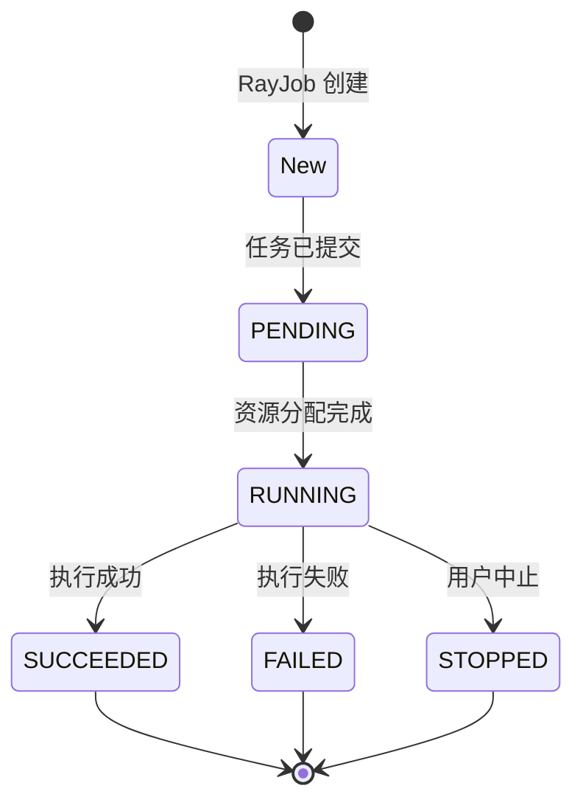
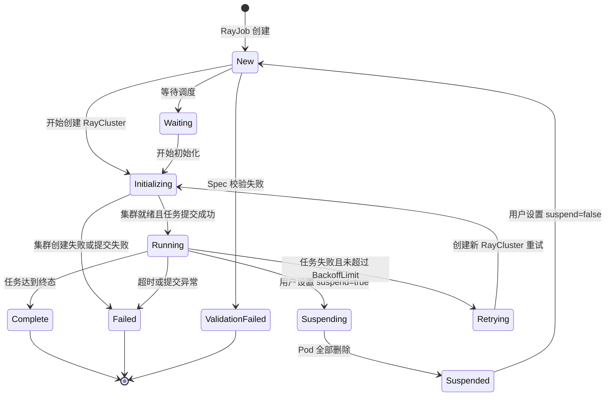
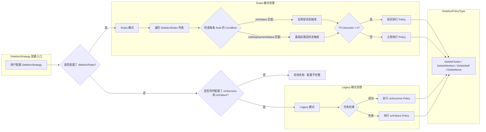

---

## 前置知识

在深入 KubeRay CRD 的类型定义之前，读者应具备以下基础知识：

| 前置知识 | 说明 |
|---------|------|
| Kubernetes API 机制 | 理解 GVK(Group/Version/Kind)、GVR(Group/Version/Resource) 的概念 |
| CRD 基础 | 了解 CustomResourceDefinition 的注册、Schema 校验、子资源等 |
| Go 语言结构体 | 熟悉 Go struct tag、指针类型与值类型的语义区别 |
| controller-runtime | 了解 kubebuilder 项目脚手架与 Marker 注释机制 |

---

## 1. Kubernetes CRD 基础回顾

Custom Resource Definition (CRD) 是 Kubernetes 原生的扩展机制，允许用户在不修改 Kubernetes 源码的前提下注册自定义资源类型。其核心工作流程如下：

1. **注册 CRD 对象** - 向 API Server 提交 `CustomResourceDefinition` 资源，声明自定义资源的 Group、Version、Kind 及 OpenAPI v3 Schema。
2. **API Server 动态生成 REST 端点** - 注册成功后，API Server 自动为该资源类型提供完整的 CRUD API。
3. **Controller 监听并调谐** - 自定义 Controller 通过 Informer 监听自定义资源的变更事件，执行 Reconcile 逻辑。

KubeRay 将所有 CRD 注册在 `ray.io` API Group 下，当前稳定版本为 `v1`。源码位于：

```
ray-operator/apis/ray/v1/
├── raycluster_types.go    # RayCluster CRD 类型定义
├── rayjob_types.go        # RayJob CRD 类型定义
├── rayservice_types.go    # RayService CRD 类型定义
├── raycronjob_types.go    # RayCronJob CRD 类型定义
├── groupversion_info.go   # GV 注册信息
└── zz_generated.deepcopy.go  # 自动生成的 DeepCopy 方法
```

每一个 CRD 都遵循 Kubernetes 标准的 `TypeMeta + ObjectMeta + Spec + Status` 四段式结构，其中 `Spec` 声明用户期望状态（desired state），`Status` 记录系统观测状态（observed state）。

---

## 2. RayCluster CRD 深度解析

> 源文件：`ray-operator/apis/ray/v1/raycluster_types.go`

RayCluster 是 KubeRay 最基础的 CRD，它直接映射到一个 Ray 集群实例。所有更高层抽象（RayJob、RayService）最终都会创建或引用一个 RayCluster。

### 2.1 RayClusterSpec - 期望状态定义

`RayClusterSpec` 是用户声明 Ray 集群配置的核心结构体，包含以下字段：

| 字段 | 类型 | 必填 | 说明 |
|------|------|------|------|
| `headGroupSpec` | `HeadGroupSpec` | 是 | Head 节点 Pod 模板与配置 |
| `workerGroupSpecs` | `[]WorkerGroupSpec` | 否 | Worker 节点组列表，支持异构配置 |
| `rayVersion` | `string` | 否 | Ray 版本号，影响 RayJob 的命令生成 |
| `upgradeStrategy` | `*RayClusterUpgradeStrategy` | 否 | 升级策略 - Recreate 或 None |
| `authOptions` | `*AuthOptions` | 否 | 认证选项 - disabled 或 token |
| `suspend` | `*bool` | 否 | 挂起标记，true 时删除所有 Pod |
| `managedBy` | `*string` | 否 | 管理者标识，不可变字段 |
| `autoscalerOptions` | `*AutoscalerOptions` | 否 | 自动扩缩容配置 |
| `headServiceAnnotations` | `map[string]string` | 否 | Head Service 的自定义注解 |
| `enableInTreeAutoscaling` | `*bool` | 否 | 是否启用内置自动扩缩容 |
| `gcsFaultToleranceOptions` | `*GcsFaultToleranceOptions` | 否 | GCS 容错（Redis 外部存储）配置 |

**关键设计点 - `managedBy` 字段的不可变性**

`managedBy` 字段通过两条 XValidation CEL 规则实现不可变（immutable）语义和枚举约束：

```go
// +kubebuilder:validation:XValidation:rule="self == oldSelf",message="the managedBy field is immutable"
// +kubebuilder:validation:XValidation:rule="self in ['ray.io/kuberay-operator', 'kueue.x-k8s.io/multikueue']",message="..."
ManagedBy *string `json:"managedBy,omitempty"`
```

`self == oldSelf` 这条 CEL 规则在 Update 操作时由 API Server 执行，确保字段值一旦设定便不可更改。该设计支撑了 KubeRay 与 Kueue MultiKueue 的集成场景：当 `managedBy` 设置为 `kueue.x-k8s.io/multikueue` 时，KubeRay Operator 将跳过该资源的 Reconcile，将控制权委派给 Kueue。

### 2.2 HeadGroupSpec - Head 节点配置

```go
type HeadGroupSpec struct {
    Template       corev1.PodTemplateSpec  `json:"template"`
    HeadService    *corev1.Service         `json:"headService,omitempty"`
    EnableIngress  *bool                   `json:"enableIngress,omitempty"`
    Resources      map[string]string       `json:"resources,omitempty"`
    Labels         map[string]string       `json:"labels,omitempty"`
    RayStartParams map[string]string       `json:"rayStartParams"`
    ServiceType    corev1.ServiceType      `json:"serviceType,omitempty"`
}
```

Head 节点是 Ray 集群的控制平面，负责运行 GCS (Global Control Store)、Dashboard 和 Driver 等核心组件。`HeadGroupSpec` 的设计要点：

- **`Template`** - 直接复用 Kubernetes 原生 `PodTemplateSpec`，所有标准 Pod 配置（容器镜像、资源限制、挂载卷、调度策略）均可在此声明。
- **`HeadService`** - 可选的自定义 Kubernetes Service 对象，若未指定则由 Operator 自动创建。
- **`Resources` 与 `Labels`** - 这两个 `map[string]string` 字段声明的是 **Ray 层面**的资源和标签，它们会覆盖 `rayStartParams` 中传递的对应参数，但**不影响** Kubernetes Pod 容器级别的资源配置。
- **`ServiceType`** - 控制 Head Service 的暴露方式（ClusterIP / NodePort / LoadBalancer），Worker 节点通过该 Service 连接 Head。

### 2.3 WorkerGroupSpec - Worker 节点组配置

KubeRay 支持多个异构 Worker 组（例如 CPU 组 + GPU 组），每个组通过 `GroupName` 唯一标识：

```go
type WorkerGroupSpec struct {
    Suspend            *bool                   `json:"suspend,omitempty"`
    GroupName          string                  `json:"groupName"`
    Replicas           *int32                  `json:"replicas,omitempty"`
    MinReplicas        *int32                  `json:"minReplicas"`
    MaxReplicas        *int32                  `json:"maxReplicas"`
    IdleTimeoutSeconds *int32                  `json:"idleTimeoutSeconds,omitempty"`
    Resources          map[string]string       `json:"resources,omitempty"`
    Labels             map[string]string       `json:"labels,omitempty"`
    RayStartParams     map[string]string       `json:"rayStartParams"`
    Template           corev1.PodTemplateSpec  `json:"template"`
    ScaleStrategy      ScaleStrategy           `json:"scaleStrategy,omitempty"`
    NumOfHosts         int32                   `json:"numOfHosts,omitempty"`
}
```

| 字段 | 默认值 | 说明 |
|------|--------|------|
| `Replicas` | `0` | 期望副本数。设为可选字段有特殊历史原因（参见 PR #1443） |
| `MinReplicas` | `0` | 最小副本数，自动扩缩容的下限 |
| `MaxReplicas` | `2147483647` (MaxInt32) | 最大副本数，自动扩缩容的上限 |
| `NumOfHosts` | `1` | 每个副本对应的主机数，用于多主机训练场景（如 TPU Pod Slice） |

**ScaleStrategy - 精确缩容控制**

```go
type ScaleStrategy struct {
    WorkersToDelete []string `json:"workersToDelete,omitempty"`
}
```

`WorkersToDelete` 允许指定待删除 Worker Pod 的名称列表，实现精确缩容。这对于有状态计算场景尤为重要 - 自动扩缩器可以选择性地删除空闲 Worker，避免中断正在执行任务的节点。

**`Suspend` 字段的特殊用途**

Worker 组的 `Suspend` 字段**不是面向用户的 API**，它仅被 RayJob 的 DeletionStrategy 内部使用，用于实现 `DeleteWorkers` 策略。

### 2.4 GcsFaultToleranceOptions - GCS 容错配置

```go
type GcsFaultToleranceOptions struct {
    RedisUsername            *RedisCredential `json:"redisUsername,omitempty"`
    RedisPassword            *RedisCredential `json:"redisPassword,omitempty"`
    ExternalStorageNamespace string           `json:"externalStorageNamespace,omitempty"`
    RedisAddress             string           `json:"redisAddress"`
}

type RedisCredential struct {
    ValueFrom *corev1.EnvVarSource `json:"valueFrom,omitempty"`
    Value     string               `json:"value,omitempty"`
}
```

GCS 容错机制将 Ray 的 Global Control Store 数据持久化到外部 Redis，实现 Head 节点故障恢复。`RedisCredential` 采用与 Kubernetes `EnvVar` 相同的设计模式，支持：

- **`Value`** - 直接内联明文值（适用于测试环境）。
- **`ValueFrom`** - 引用 Secret、ConfigMap 或其他来源（适用于生产环境）。

当 RayCluster 被删除时，Operator 会创建一个 `redis-cleanup` 类型的 Kubernetes Job 来清理 Redis 中的残留数据。

### 2.5 AutoscalerOptions - 自动扩缩容配置

```go
type AutoscalerOptions struct {
    Resources        *corev1.ResourceRequirements `json:"resources,omitempty"`
    Image            *string                      `json:"image,omitempty"`
    ImagePullPolicy  *corev1.PullPolicy           `json:"imagePullPolicy,omitempty"`
    SecurityContext  *corev1.SecurityContext       `json:"securityContext,omitempty"`
    IdleTimeoutSeconds *int32                     `json:"idleTimeoutSeconds,omitempty"`
    UpscalingMode    *UpscalingMode               `json:"upscalingMode,omitempty"`
    Version          *AutoscalerVersion           `json:"version,omitempty"`
    Env              []corev1.EnvVar              `json:"env,omitempty"`
    EnvFrom          []corev1.EnvFromSource       `json:"envFrom,omitempty"`
    VolumeMounts     []corev1.VolumeMount         `json:"volumeMounts,omitempty"`
}
```

**Autoscaler 版本策略**

```go
// +kubebuilder:validation:Enum=v1;v2
type AutoscalerVersion string
```

| 版本 | 默认条件 | 特点 |
|------|----------|------|
| `v1` | Ray < 2.47.0 | 基于传统的资源请求匹配 |
| `v2` | Ray >= 2.47.0 | 改进的扩缩容算法，支持 `IdleTimeoutSeconds` 按 Worker 组配置 |

如果未显式设置 `Version`，系统根据 `RayVersion` 字段自动选择。

**UpscalingMode 扩容模式**

```go
// +kubebuilder:validation:Enum=Default;Aggressive;Conservative
type UpscalingMode string
```

| 模式 | 行为 |
|------|------|
| `Conservative` | 限速扩容 - 待创建 Worker Pod 数量不超过当前集群规模 |
| `Default` | 不限速扩容 |
| `Aggressive` | `Default` 的别名，行为相同 |

### 2.6 RayClusterStatus - 观测状态

```go
type RayClusterStatus struct {
    State                   ClusterState                  `json:"state,omitempty"`
    DesiredCPU              resource.Quantity              `json:"desiredCPU,omitempty"`
    DesiredMemory           resource.Quantity              `json:"desiredMemory,omitempty"`
    DesiredGPU              resource.Quantity              `json:"desiredGPU,omitempty"`
    DesiredTPU              resource.Quantity              `json:"desiredTPU,omitempty"`
    ReadyWorkerReplicas     int32                          `json:"readyWorkerReplicas,omitempty"`
    AvailableWorkerReplicas int32                          `json:"availableWorkerReplicas,omitempty"`
    DesiredWorkerReplicas   int32                          `json:"desiredWorkerReplicas,omitempty"`
    MinWorkerReplicas       int32                          `json:"minWorkerReplicas,omitempty"`
    MaxWorkerReplicas       int32                          `json:"maxWorkerReplicas,omitempty"`
    Head                    HeadInfo                       `json:"head,omitempty"`
    Endpoints               map[string]string              `json:"endpoints,omitempty"`
    Conditions              []metav1.Condition             `json:"conditions,omitempty"`
    ObservedGeneration      int64                          `json:"observedGeneration,omitempty"`
}
```

**ClusterState 枚举**（已废弃，被 Conditions 取代）

| 状态 | 含义 |
|------|------|
| `ready` | 集群所有 Pod 就绪 |
| `suspended` | 集群处于挂起状态 |
| `failed` | 已废弃，保留以兼容导入 KubeRay Go 模块的项目 |

**5 种 Condition 类型**

| Condition | 含义 | 行为说明 |
|-----------|------|----------|
| `RayClusterProvisioned` | 所有 Ray Pod 首次全部就绪 | 设为 `True` 后**不再变化**，标记集群曾经完全就绪 |
| `HeadPodReady` | Head Pod 是否处于 Ready 状态 | 动态更新，反映 Head Pod 实时状态 |
| `ReplicaFailure` | Pod 创建或删除失败 | 出现错误时设为 `True` |
| `RayClusterSuspending` | 集群正在挂起（删除 Pod 过程中） | 保证挂起操作的原子性 |
| `RayClusterSuspended` | 集群已完全挂起（所有 Pod 已删除） | 与 `RayClusterSuspending` 互斥 |

> **设计要点**：`RayClusterSuspending` 和 `RayClusterSuspended` 不会同时为 `True`。前者表示"正在执行挂起"，后者表示"挂起已完成"。这种两阶段设计保证了挂起操作的原子性。

**HeadInfo - Head 节点信息**

```go
type HeadInfo struct {
    PodIP       string `json:"podIP,omitempty"`
    ServiceIP   string `json:"serviceIP,omitempty"`
    PodName     string `json:"podName,omitempty"`
    ServiceName string `json:"serviceName,omitempty"`
}
```

Status 中的 `Head` 字段暴露 Head Pod 的关键网络信息，方便用户和其他组件定位集群入口。

**Worker 副本数语义**

Status 中的 `*WorkerReplicas` 系列字段名称中使用了 "replicas" 一词，这是为了保持向后兼容。实际上：

- `ReadyWorkerReplicas` = Ready 状态的 Worker Pod 数量
- `AvailableWorkerReplicas` = Running 状态的 Worker Pod 数量
- `DesiredWorkerReplicas` = 所有 Worker 组的 `replicas * numOfHosts` 之和
- `MinWorkerReplicas` = 所有 Worker 组的 `minReplicas * numOfHosts` 之和
- `MaxWorkerReplicas` = 所有 Worker 组的 `maxReplicas * numOfHosts` 之和

---

## 3. RayJob CRD 深度解析

> 源文件：`ray-operator/apis/ray/v1/rayjob_types.go`

RayJob 在 RayCluster 之上构建了完整的任务生命周期管理，包括集群创建、任务提交、状态跟踪和资源清理。

### 3.1 双层状态模型

RayJob 拥有两个独立的状态维度：

- **JobStatus** - Ray 应用层的任务状态（来自 Ray Dashboard）
- **JobDeploymentStatus** - Kubernetes 基础设施层的部署状态（由 KubeRay Operator 管理）

#### JobStatus - 应用层状态

```go
const (
    JobStatusNew       JobStatus = ""          // 初始状态
    JobStatusPending   JobStatus = "PENDING"   // 等待资源
    JobStatusRunning   JobStatus = "RUNNING"   // 正在执行
    JobStatusStopped   JobStatus = "STOPPED"   // 被停止
    JobStatusSucceeded JobStatus = "SUCCEEDED" // 执行成功
    JobStatusFailed    JobStatus = "FAILED"    // 执行失败
)
```

终态判定函数 `IsJobTerminal` 将 `STOPPED`、`SUCCEEDED`、`FAILED` 标记为终态，这与 Ray 框架中 `is_terminal()` 的逻辑保持同步。



#### JobDeploymentStatus - 基础设施层状态

```go
const (
    JobDeploymentStatusNew              JobDeploymentStatus = ""
    JobDeploymentStatusInitializing     JobDeploymentStatus = "Initializing"
    JobDeploymentStatusRunning          JobDeploymentStatus = "Running"
    JobDeploymentStatusComplete         JobDeploymentStatus = "Complete"
    JobDeploymentStatusFailed           JobDeploymentStatus = "Failed"
    JobDeploymentStatusValidationFailed JobDeploymentStatus = "ValidationFailed"
    JobDeploymentStatusSuspending       JobDeploymentStatus = "Suspending"
    JobDeploymentStatusSuspended        JobDeploymentStatus = "Suspended"
    JobDeploymentStatusRetrying         JobDeploymentStatus = "Retrying"
    JobDeploymentStatusWaiting          JobDeploymentStatus = "Waiting"
)
```

终态判定函数 `IsJobDeploymentTerminal` 将 `Complete` 和 `Failed` 标记为终态。



### 3.2 JobSubmissionMode - 任务提交模式

```go
const (
    K8sJobMode      JobSubmissionMode = "K8sJobMode"
    HTTPMode        JobSubmissionMode = "HTTPMode"
    InteractiveMode JobSubmissionMode = "InteractiveMode"
    SidecarMode     JobSubmissionMode = "SidecarMode"
)
```

| 模式 | 机制 | 适用场景 |
|------|------|----------|
| `K8sJobMode` (默认) | 创建 Kubernetes Job 运行 `ray job submit` | 标准批处理，需要完整日志 |
| `HTTPMode` | Operator 直接调用 Ray Dashboard REST API | 轻量级提交，减少 Pod 开销 |
| `InteractiveMode` | Operator 不提交任务，等待用户手动提交并提供 Job ID | 交互式调试，Notebook 场景 |
| `SidecarMode` | 在 Head Pod 中注入 Sidecar 容器执行提交 | 网络隔离环境，Head Pod 内部通信 |

### 3.3 DeletionStrategy - 资源清理策略

DeletionStrategy 是 RayJob 中设计最精巧的部分，它支持两种互斥的配置风格。

#### Legacy 模式（已废弃，计划在 1.6.0 移除）

```go
type DeletionStrategy struct {
    OnSuccess     *DeletionPolicy  `json:"onSuccess,omitempty"`
    OnFailure     *DeletionPolicy  `json:"onFailure,omitempty"`
    DeletionRules []DeletionRule   `json:"deletionRules,omitempty"`
}
```

Legacy 模式要求**同时**指定 `onSuccess` 和 `onFailure`，分别控制任务成功和失败后的清理行为。

#### Rules 模式（推荐）

```go
type DeletionRule struct {
    Policy    DeletionPolicyType `json:"policy"`
    Condition DeletionCondition  `json:"condition"`
}

type DeletionCondition struct {
    JobStatus           *JobStatus           `json:"jobStatus,omitempty"`
    JobDeploymentStatus *JobDeploymentStatus `json:"jobDeploymentStatus,omitempty"`
    TTLSeconds          int32                `json:"ttlSeconds,omitempty"`
}
```

Rules 模式通过条件列表实现更灵活的多阶段清理策略。当多条规则同时满足（例如 Controller 宕机恢复后），影响最大的规则（如 `DeleteSelf`）会优先执行。

**DeletionPolicyType - 清理动作枚举**

| 策略 | 行为 |
|------|------|
| `DeleteCluster` | 删除整个 RayCluster 自定义资源 |
| `DeleteWorkers` | 仅删除 Worker Pod，保留 Head |
| `DeleteSelf` | 删除 RayJob 自身（级联删除所有关联资源） |
| `DeleteNone` | 不执行任何清理 |

**DeletionCondition - 触发条件**

每个 DeletionCondition 必须且只能指定 `JobStatus` 或 `JobDeploymentStatus` 之一（通过 XValidation CEL 规则强制互斥），配合 `TTLSeconds` 实现延迟触发。



**XValidation 互斥约束**

```go
// +kubebuilder:validation:XValidation:rule="!((has(self.onSuccess) || has(self.onFailure)) && has(self.deletionRules))",
//   message="legacy policies (onSuccess/onFailure) and deletionRules cannot be used together"
// +kubebuilder:validation:XValidation:rule="((has(self.onSuccess) && has(self.onFailure)) || has(self.deletionRules))",
//   message="deletionStrategy requires either BOTH onSuccess and onFailure, OR the deletionRules field"
```

这两条 CEL 规则在 API Server 层面强制执行：

1. Legacy 字段（`onSuccess`/`onFailure`）和 `deletionRules` **不能同时使用**。
2. 如果使用 Legacy 模式，`onSuccess` 和 `onFailure` 必须**同时存在**；否则必须使用 `deletionRules`。

### 3.4 RayJobSpec - 完整字段列表

| 字段 | 类型 | 默认值 | 说明 |
|------|------|--------|------|
| `entrypoint` | `string` | - | 任务入口命令 |
| `runtimeEnvYAML` | `string` | - | Ray 运行时环境配置（YAML 字符串） |
| `rayClusterSpec` | `*RayClusterSpec` | - | 内联 RayCluster 配置（与 `clusterSelector` 互斥） |
| `clusterSelector` | `map[string]string` | - | 通过标签选择已有 RayCluster |
| `submissionMode` | `JobSubmissionMode` | `K8sJobMode` | 任务提交模式 |
| `submitterPodTemplate` | `*corev1.PodTemplateSpec` | - | 提交器 Pod 模板（仅 K8sJobMode） |
| `activeDeadlineSeconds` | `*int32` | - | 任务最大运行时长（秒） |
| `backoffLimit` | `*int32` | `0` | 最大重试次数，每次重试创建新 RayCluster |
| `ttlSecondsAfterFinished` | `int32` | `0` | 完成后 TTL 清理延迟（需 `shutdownAfterJobFinishes=true`） |
| `shutdownAfterJobFinishes` | `bool` | `false` | 任务完成后是否关闭 RayCluster |
| `suspend` | `bool` | `false` | 是否挂起 - true 时不创建或删除 RayCluster |
| `deletionStrategy` | `*DeletionStrategy` | - | 资源清理策略（需启用 Feature Gate） |

### 3.5 RayJobStatus - 观测状态

```go
type RayJobStatus struct {
    RayJobStatusInfo    RayJobStatusInfo    `json:"rayJobInfo,omitempty"`
    JobId               string              `json:"jobId,omitempty"`
    RayClusterName      string              `json:"rayClusterName,omitempty"`
    DashboardURL        string              `json:"dashboardURL,omitempty"`
    JobStatus           JobStatus           `json:"jobStatus,omitempty"`
    JobDeploymentStatus JobDeploymentStatus `json:"jobDeploymentStatus,omitempty"`
    Reason              JobFailedReason     `json:"reason,omitempty"`
    Message             string              `json:"message,omitempty"`
    StartTime           *metav1.Time        `json:"startTime,omitempty"`
    EndTime             *metav1.Time        `json:"endTime,omitempty"`
    Succeeded           *int32              `json:"succeeded,omitempty"`
    Failed              *int32              `json:"failed,omitempty"`
    RayClusterStatus    RayClusterStatus    `json:"rayClusterStatus,omitempty"`
    ObservedGeneration  int64               `json:"observedGeneration,omitempty"`
}
```

- `StartTime` 记录 `JobDeploymentStatus` 从 `New` 转换为 `Initializing` 的时间点。
- `EndTime` 记录 `JobDeploymentStatus` 转换为 `Complete` 的时间点。
- `Succeeded` 和 `Failed` 计数器支撑了 `BackoffLimit` 的重试机制。
- `RayClusterStatus` 内嵌了关联 RayCluster 的完整状态快照。

---

## 4. RayService CRD 深度解析

> 源文件：`ray-operator/apis/ray/v1/rayservice_types.go`

RayService 在 RayCluster 之上封装了 Ray Serve 推理服务的生命周期管理，核心能力是零停机升级。

### 4.1 UpgradeStrategy - 升级策略

```go
const (
    RayServiceNewClusterWithIncrementalUpgrade RayServiceUpgradeType = "NewClusterWithIncrementalUpgrade"
    RayServiceNewCluster                       RayServiceUpgradeType = "NewCluster"
    RayServiceUpgradeNone                      RayServiceUpgradeType = "None"
)
```

| 策略 | 行为 | 停机时间 |
|------|------|----------|
| `NewCluster` | 创建新集群，就绪后一次性切换流量 | 零停机 |
| `NewClusterWithIncrementalUpgrade` | 创建新集群，通过 Gateway API 逐步迁移流量 | 零停机，渐进式 |
| `None` | 不创建新集群，原地更新 | 可能有短暂中断 |

### 4.2 ClusterUpgradeOptions - 增量升级配置

```go
type ClusterUpgradeOptions struct {
    MaxSurgePercent  *int32 `json:"maxSurgePercent,omitempty"`
    StepSizePercent  *int32 `json:"stepSizePercent"`
    IntervalSeconds  *int32 `json:"intervalSeconds"`
    GatewayClassName string `json:"gatewayClassName"`
}
```

仅在 `NewClusterWithIncrementalUpgrade` 策略下生效（需启用 `RayServiceIncrementalUpgrade` Feature Gate）。参数含义：

| 参数 | 默认值 | 说明 |
|------|--------|------|
| `MaxSurgePercent` | `100` | 新集群每次扩容承接的请求容量百分比 |
| `StepSizePercent` | - | 每次从旧集群切换到新集群的流量百分比 |
| `IntervalSeconds` | - | 两次流量切换之间的间隔秒数 |
| `GatewayClassName` | - | Kubernetes Gateway API 的 GatewayClass 名称 |

### 4.3 RayServiceSpec - 完整字段列表

| 字段 | 类型 | 说明 |
|------|------|------|
| `rayClusterConfig` | `RayClusterSpec` | 内联 RayCluster 配置 |
| `serveConfigV2` | `string` | Ray Serve 部署配置（YAML 多行字符串） |
| `serveService` | `*corev1.Service` | 自定义 Serve 流量 Service |
| `upgradeStrategy` | `*RayServiceUpgradeStrategy` | 升级策略 |
| `rayClusterDeletionDelaySeconds` | `*int32` | 旧集群删除延迟（默认 60 秒） |
| `excludeHeadPodFromServeSvc` | `bool` | 是否将 Head Pod 从 Serve Service 中排除 |

### 4.4 RayServiceStatuses 与 Condition

```go
type RayServiceStatuses struct {
    Conditions           []metav1.Condition `json:"conditions,omitempty"`
    ServiceStatus        ServiceStatus      `json:"serviceStatus,omitempty"`   // 已废弃
    ActiveServiceStatus  RayServiceStatus   `json:"activeServiceStatus,omitempty"`
    PendingServiceStatus RayServiceStatus   `json:"pendingServiceStatus,omitempty"`
    NumServeEndpoints    int32              `json:"numServeEndpoints,omitempty"`
    ObservedGeneration   int64              `json:"observedGeneration,omitempty"`
}
```

**Condition 类型**

| Condition | 含义 |
|-----------|------|
| `Ready` | 用户可向底层集群发送请求，且 Serve 端点数大于 0 |
| `UpgradeInProgress` | 正在执行零停机升级（存在 Pending 集群） |

**ServiceStatus 废弃说明**

`ServiceStatus` 字段（`Running` / 空字符串）自 KubeRay v1.3.0 起已被 `RayServiceReady` Condition 取代，保留仅为向后兼容。

**双集群状态模型**

`ActiveServiceStatus` 和 `PendingServiceStatus` 分别记录当前活跃集群和正在准备的新集群的状态，支撑了零停机升级的核心逻辑。每个 `RayServiceStatus` 包含：

```go
type RayServiceStatus struct {
    Applications           map[string]AppStatus `json:"applicationStatuses,omitempty"`
    TargetCapacity         *int32               `json:"targetCapacity,omitempty"`
    TrafficRoutedPercent   *int32               `json:"trafficRoutedPercent,omitempty"`
    LastTrafficMigratedTime *metav1.Time        `json:"lastTrafficMigratedTime,omitempty"`
    RayClusterName         string               `json:"rayClusterName,omitempty"`
    RayClusterStatus       RayClusterStatus     `json:"rayClusterStatus,omitempty"`
}
```

其中 `TargetCapacity` 和 `TrafficRoutedPercent` 是增量升级的关键状态字段，分别表示新集群的目标容量百分比和已路由的流量百分比。

---

## 5. RayCronJob CRD 解析

> 源文件：`ray-operator/apis/ray/v1/raycronjob_types.go`

RayCronJob 是 KubeRay 中最简洁的 CRD，它的设计理念与 Kubernetes 原生 CronJob 完全对齐 - 按 Cron 表达式周期性地创建 RayJob。

### 5.1 RayCronJobSpec

```go
type RayCronJobSpec struct {
    JobTemplate RayJobSpec `json:"jobTemplate"`
    Schedule    string     `json:"schedule"`
    Suspend     bool       `json:"suspend,omitempty"`
}
```

| 字段 | 类型 | 必填 | 说明 |
|------|------|------|------|
| `jobTemplate` | `RayJobSpec` | 是 | RayJob 模板，每次调度创建一个 RayJob 实例 |
| `schedule` | `string` | 是 | 标准 Cron 表达式（如 `"0 */6 * * *"`） |
| `suspend` | `bool` | 否 | 挂起调度（不影响已创建的 RayJob） |

### 5.2 RayCronJobStatus

```go
type RayCronJobStatus struct {
    LastScheduleTime *metav1.Time `json:"lastScheduleTime,omitempty"`
}
```

Status 仅记录上次调度时间，RayJob 自身的状态由 RayJob Controller 独立管理。

---

## 6. Kubebuilder Markers 详解

KubeRay 大量使用 kubebuilder Marker 注释来声明 CRD 的元数据、校验规则和生成逻辑。以下是在 KubeRay 源码中出现的关键 Marker 分类解析。

### 6.1 资源级别 Markers

以 RayCluster 为例：

```go
// +kubebuilder:object:root=true
// +kubebuilder:resource:categories=all
// +kubebuilder:subresource:status
// +kubebuilder:storageversion
```

| Marker | 作用 |
|--------|------|
| `+kubebuilder:object:root=true` | 标记为 API 根对象，生成 `DeepCopyObject()` 方法 |
| `+kubebuilder:resource:categories=all` | 加入 `all` 分类，`kubectl get all` 可列出 |
| `+kubebuilder:subresource:status` | 启用 `/status` 子资源，Spec 和 Status 的更新权限分离 |
| `+kubebuilder:storageversion` | 标记为存储版本（多版本 CRD 场景中只有一个版本可以作为存储版本） |

### 6.2 PrintColumn Markers

```go
// +kubebuilder:printcolumn:name="desired workers",type=integer,JSONPath=".status.desiredWorkerReplicas",priority=0
// +kubebuilder:printcolumn:name="status",type="string",JSONPath=".status.state",priority=0
// +kubebuilder:printcolumn:name="head pod IP",type="string",JSONPath=".status.head.podIP",priority=1
```

`printcolumn` Marker 定义 `kubectl get` 输出的列。`priority=0` 的列默认显示，`priority=1` 的列仅在 `-o wide` 时显示。

### 6.3 Validation Markers

KubeRay 使用的校验 Marker 类型：

| Marker | 示例 | 说明 |
|--------|------|------|
| `+kubebuilder:validation:Enum` | `Enum=Recreate;None` | 枚举值约束 |
| `+kubebuilder:validation:Minimum` | `Minimum=0` | 数值下限 |
| `+kubebuilder:validation:MinItems` | `MinItems=1` | 数组最少元素数 |
| `+kubebuilder:default` | `default:=0` | 字段默认值 |
| `+optional` | - | 标记可选字段 |

### 6.4 XValidation - CEL 表达式校验

XValidation 是 Kubernetes 1.25+ 引入的 CRD 校验增强特性，允许使用 CEL (Common Expression Language) 编写跨字段校验规则。KubeRay 中的典型用法：

**不可变字段**

```go
// +kubebuilder:validation:XValidation:rule="self == oldSelf",message="the managedBy field is immutable"
```

`self` 代表当前值，`oldSelf` 代表更新前的值。API Server 在处理 Update 请求时执行此规则。

**互斥字段**

```go
// +kubebuilder:validation:XValidation:rule="!(has(self.jobStatus) && has(self.jobDeploymentStatus))",
//   message="JobStatus and JobDeploymentStatus cannot be used together"
```

`has()` 函数检查字段是否被设置（非零值），组合逻辑运算符实现互斥约束。

**复合条件**

```go
// +kubebuilder:validation:XValidation:rule="!((has(self.onSuccess) || has(self.onFailure)) && has(self.deletionRules))",
//   message="legacy policies and deletionRules cannot be used together"
// +kubebuilder:validation:XValidation:rule="((has(self.onSuccess) && has(self.onFailure)) || has(self.deletionRules))",
//   message="requires either BOTH onSuccess and onFailure, OR deletionRules"
```

这两条规则协同工作，确保 DeletionStrategy 的两种配置风格严格互斥且各自完整。

**枚举约束**

```go
// +kubebuilder:validation:XValidation:rule="self in ['ray.io/kuberay-operator', 'kueue.x-k8s.io/multikueue']",
//   message="the managedBy field value must be either 'ray.io/kuberay-operator' or 'kueue.x-k8s.io/multikueue'"
```

与 `Enum` Marker 不同，XValidation 的 `in` 运算符可以用于 `string` 类型字段（Enum Marker 通常用于自定义类型）。

### 6.5 List 类型 Markers

```go
// +patchMergeKey=type
// +patchStrategy=merge
// +listType=map
// +listMapKey=type
```

这组 Marker 用于 `Conditions` 字段，声明其为 map 类型列表（以 `type` 为 key），支持 Server-Side Apply 的 merge 语义。

---

## 7. 设计模式总结

通过分析 KubeRay 的四种 CRD，可以提炼出以下 API 设计模式：

### 7.1 可选指针类型 vs 值类型

KubeRay 在字段类型选择上遵循以下原则：

| 场景 | 类型选择 | 示例 |
|------|----------|------|
| 需要区分"未设置"和"零值" | `*T`（指针） | `Suspend *bool` - nil 和 false 语义不同 |
| 零值即有效默认值 | `T`（值） | `Suspend bool` - RayJob 中 false 即为默认 |
| 可选嵌套配置块 | `*StructT`（指针） | `AutoscalerOptions *AutoscalerOptions` |
| 必填嵌套配置 | `StructT`（值） | `HeadGroupSpec HeadGroupSpec` |

### 7.2 Conditions 替代 State

KubeRay 正在从单一 `State` 枚举向标准 `Conditions` 数组迁移。Conditions 的优势：

- 多个正交维度可以独立表达（如"Head 就绪"与"Worker 就绪"可以独立为 True/False）。
- 每个 Condition 携带 `Reason`、`Message` 和 `LastTransitionTime`，信息密度更高。
- 与 Kubernetes 生态工具（如 `kubectl wait --for=condition=...`）天然兼容。

### 7.3 Feature Gate 渐进式发布

DeletionStrategy 和 IncrementalUpgrade 等新特性通过 Feature Gate 控制，允许用户按需启用实验性功能而不影响稳定性。

### 7.4 向后兼容性保护

- 废弃字段保留但标记 `Deprecated`（如 `ClusterState.Failed`、`ServiceStatus`）。
- 字段名称保持不变即使语义略有偏差（如 `*WorkerReplicas` 实际代表 Pod 数）。
- 新旧 API 风格共存且通过 XValidation 互斥约束避免冲突（DeletionStrategy Legacy vs Rules）。

---

## 延伸阅读

- [Kubernetes CRD 官方文档](https://kubernetes.io/docs/tasks/extend-kubernetes/custom-resources/custom-resource-definitions/)
- [CEL (Common Expression Language) in Kubernetes](https://kubernetes.io/docs/reference/using-api/cel/)
- [Kubebuilder Markers 参考](https://book.kubebuilder.io/reference/markers)
- [Ray Autoscaler V2 设计文档](https://docs.ray.io/en/latest/cluster/kubernetes/user-guides/autoscaling.html)
- [Ray Serve 部署指南](https://docs.ray.io/en/latest/serve/index.html)
- [KubeRay GitHub 源码](https://github.com/ray-project/kuberay/tree/master/ray-operator/apis/ray/v1)

---

## 下一篇

> **[2.1 - RayCluster 调和循环核心流程](../02-raycluster-controller/01-reconciliation-loop.md)**
>
> 下一篇将深入 `raycluster_controller.go`，逐步拆解 RayCluster 的 Reconcile 循环，包括 9 个 reconcileFunc 链、GCS FT Finalizer、四层 Validation 以及 Status 计算机制。
