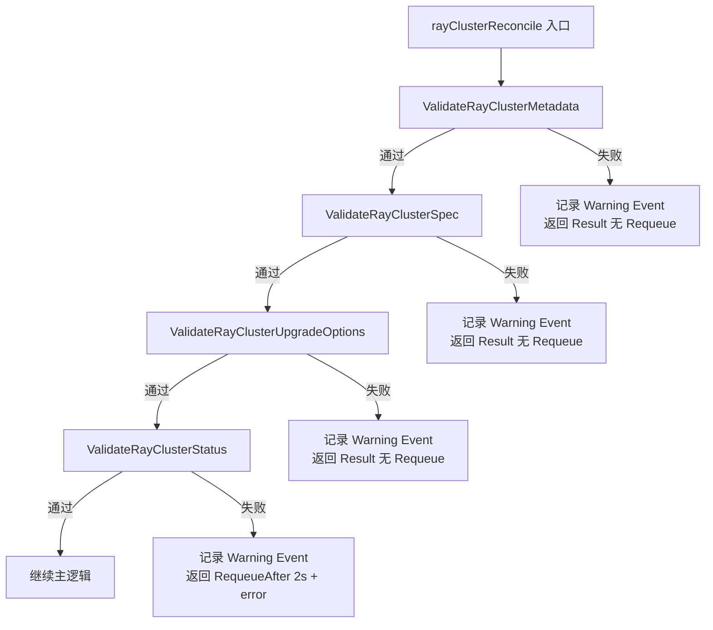
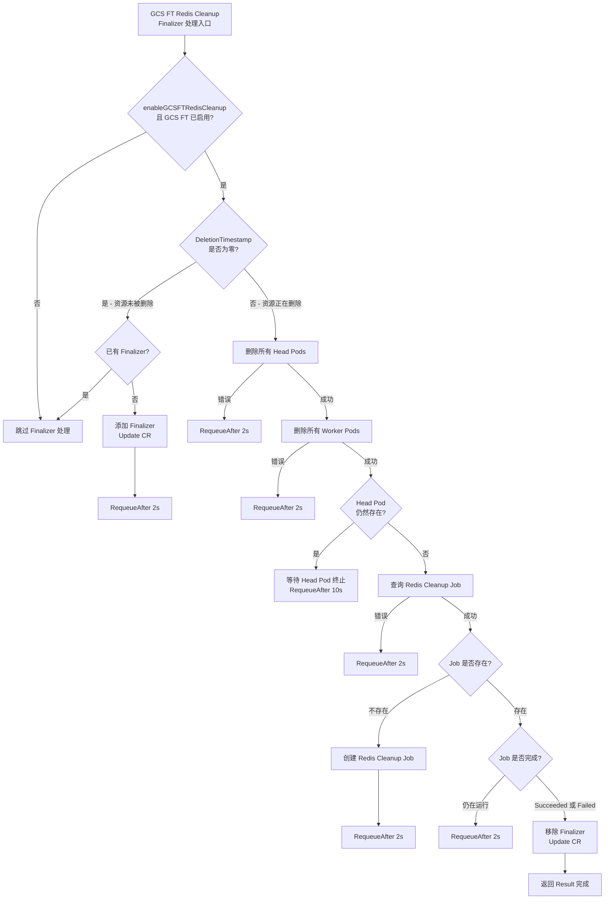
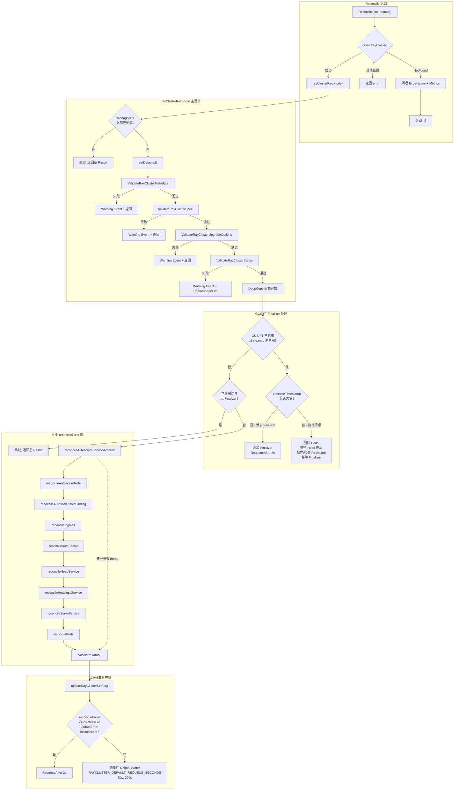
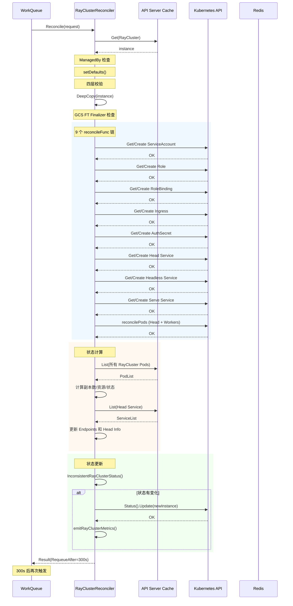

<p align="center">
  
</p>

> 本文基于 KubeRay 源码，对 RayCluster Controller 的核心调和循环 (Reconciliation Loop) 进行逐层拆解，覆盖从入口函数到状态更新的完整链路。主要源码文件为 `ray-operator/controllers/ray/raycluster_controller.go`（约 2011 行）。

---

## 目录

- [前置知识](#前置知识)
- [RayClusterReconciler 结构体分析](#rayclusterreconciler-结构体分析)
- [NewReconciler 工厂函数](#newreconciler-工厂函数)
- [RayClusterReconcilerOptions 配置结构体](#rayclusterreconcileroptions-配置结构体)
- [Reconcile 入口与 rayClusterReconcile 主逻辑](#reconcile-入口与-rayclusterreconcile-主逻辑)
- [四层校验体系](#四层校验体系)
- [ManagedByExternalController 跳过检查](#managedbyexternalcontroller-跳过检查)
- [GCS FT Redis Cleanup Finalizer 完整生命周期](#gcs-ft-redis-cleanup-finalizer-完整生命周期)
- [9 个 reconcileFunc 调和链](#9-个-reconcilefunc-调和链)
- [状态计算与更新流程](#状态计算与更新流程)
- [无条件重新入队机制](#无条件重新入队机制)
- [错误处理优先级](#错误处理优先级)
- [完整调和流程图](#完整调和流程图)
- [一次完整调和周期时序图](#一次完整调和周期时序图)
- [延伸阅读](#延伸阅读)
- [下一篇](#下一篇)

---

## 前置知识

在阅读本文之前，建议读者具备以下基础知识：

| 知识领域 | 说明 |
|---------|------|
| **Kubernetes Controller 模式** | 理解 Informer / WorkQueue / Reconciler 三层架构 |
| **controller-runtime 框架** | 了解 `manager.Manager`、`client.Client`、`reconcile.Reconciler` 接口 |
| **Finalizer 机制** | 理解 Kubernetes 中 Finalizer 阻止资源删除的原理 |
| **Go 语言基础** | 熟悉 struct embedding、interface、reflect 等语法特性 |
| **Ray 集群架构** | 了解 Head Node / Worker Node / GCS (Global Control Store) 的基本概念 |

---

## RayClusterReconciler 结构体分析

> 源码位置: `raycluster_controller.go` 第 77-83 行

```go
type RayClusterReconciler struct {
    client.Client                                                    // 嵌入式 K8s API 客户端
    Scheme                     *k8sruntime.Scheme                   // 资源类型注册表
    Recorder                   record.EventRecorder                 // K8s Event 记录器
    rayClusterScaleExpectation expectations.RayClusterScaleExpectation // 扩缩容期望值追踪器
    options                    RayClusterReconcilerOptions           // 可配置选项集合
}
```

### 字段详解

| 字段 | 类型 | 职责 |
|------|------|------|
| `client.Client` | `client.Client` (嵌入) | 提供对 K8s API Server 的 CRUD 操作能力，通过 struct embedding 将 `Get`、`List`、`Create`、`Update`、`Delete` 等方法直接暴露在 Reconciler 上 |
| `Scheme` | `*k8sruntime.Scheme` | 维护 GVK (Group/Version/Kind) 到 Go 类型的映射关系，用于序列化/反序列化及 OwnerReference 设置 |
| `Recorder` | `record.EventRecorder` | 向 K8s Event 系统发送事件通知（如资源创建成功/失败），便于用户通过 `kubectl describe` 查看 |
| `rayClusterScaleExpectation` | `expectations.RayClusterScaleExpectation` | 追踪 Pod 创建/删除的「期望值」，避免在 API Server 缓存尚未同步时重复操作（乐观并发控制） |
| `options` | `RayClusterReconcilerOptions` | 聚合所有可选配置，包括 Metrics Manager、批调度器管理器、Sidecar 容器列表等 |

> **设计亮点**: `client.Client` 采用 Go 的 struct embedding 模式，使得 `RayClusterReconciler` 可以直接调用 `r.Get()`、`r.List()` 等方法，无需通过 `r.Client.Get()` 间接访问，代码更简洁。

---

## NewReconciler 工厂函数

> 源码位置: `raycluster_controller.go` 第 59-74 行

```go
func NewReconciler(ctx context.Context, mgr manager.Manager, options RayClusterReconcilerOptions) *RayClusterReconciler {
    if err := mgr.GetFieldIndexer().IndexField(ctx, &corev1.Pod{}, podUIDIndexField, func(rawObj client.Object) []string {
        pod := rawObj.(*corev1.Pod)
        return []string{string(pod.UID)}
    }); err != nil {
        panic(err)
    }

    return &RayClusterReconciler{
        Client:                     mgr.GetClient(),
        Scheme:                     mgr.GetScheme(),
        Recorder:                   mgr.GetEventRecorderFor("raycluster-controller"),
        rayClusterScaleExpectation: expectations.NewRayClusterScaleExpectation(mgr.GetClient()),
        options:                    options,
    }
}
```

### 关键初始化步骤

**1. Pod UID 字段索引器注册**

```go
mgr.GetFieldIndexer().IndexField(ctx, &corev1.Pod{}, podUIDIndexField, ...)
```

通过 `IndexField` 在本地缓存中建立 `metadata.uid` -> Pod 的索引，使得后续可以通过 Pod UID 快速查找 Pod 对象，而无需遍历所有 Pod。这一索引主要用于 Scale Expectation 机制中快速验证某个 Pod 是否已被 API Server 确认创建。

**2. EventRecorder 创建**

```go
mgr.GetEventRecorderFor("raycluster-controller")
```

创建以 `raycluster-controller` 为来源标识的 Event 记录器。所有通过该 Recorder 发送的 K8s Events 都会标记 `source.component = raycluster-controller`，便于在 `kubectl get events` 中过滤。

**3. Scale Expectation 初始化**

```go
expectations.NewRayClusterScaleExpectation(mgr.GetClient())
```

创建扩缩容期望值追踪器，用于在创建/删除 Pod 后记录「期望看到的变化」，在下一次 Reconcile 时检查缓存是否已同步，避免重复操作。

---

## RayClusterReconcilerOptions 配置结构体

> 源码位置: `raycluster_controller.go` 第 85-92 行

```go
type RayClusterReconcilerOptions struct {
    RayClusterMetricsManager *metrics.RayClusterMetricsManager  // Prometheus 指标管理器
    BatchSchedulerManager    *batchscheduler.SchedulerManager   // 批调度器管理器 (Volcano/Yunikorn)
    HeadSidecarContainers    []corev1.Container                 // Head Pod Sidecar 容器列表
    WorkerSidecarContainers  []corev1.Container                 // Worker Pod Sidecar 容器列表
    DefaultContainerEnvs     []corev1.EnvVar                    // 默认容器环境变量
    IsOpenShift              bool                               // 是否运行在 OpenShift 平台
}
```

| 字段 | 用途 |
|------|------|
| `RayClusterMetricsManager` | 管理 RayCluster 相关的 Prometheus 指标采集与清理（如 `kuberay_cluster_provisioned_duration_seconds`） |
| `BatchSchedulerManager` | 集成 Volcano / Yunikorn 等批调度器，在 Pod 创建前注册 PodGroup |
| `HeadSidecarContainers` | 自动注入到所有 Head Pod 的 Sidecar 容器（如日志收集、监控代理） |
| `WorkerSidecarContainers` | 自动注入到所有 Worker Pod 的 Sidecar 容器 |
| `DefaultContainerEnvs` | 注入到所有 Ray 容器的默认环境变量 |
| `IsOpenShift` | 控制是否使用 OpenShift Route 替代 Kubernetes Ingress 进行流量路由 |

---

## Reconcile 入口与 rayClusterReconcile 主逻辑

### Reconcile 入口函数

> 源码位置: `raycluster_controller.go` 第 119-139 行

```go
func (r *RayClusterReconciler) Reconcile(ctx context.Context, request ctrl.Request) (ctrl.Result, error) {
    logger := ctrl.LoggerFrom(ctx)
    var err error

    // 尝试获取 RayCluster 实例
    instance := &rayv1.RayCluster{}
    if err = r.Get(ctx, request.NamespacedName, instance); err == nil {
        return r.rayClusterReconcile(ctx, instance)
    }

    // 资源未找到 - 已被删除
    if errors.IsNotFound(err) {
        r.rayClusterScaleExpectation.Delete(request.Name, request.Namespace)
        cleanUpRayClusterMetrics(r.options.RayClusterMetricsManager, request.Name, request.Namespace)
    } else {
        logger.Error(err, "Read request instance error!")
    }
    return ctrl.Result{}, client.IgnoreNotFound(err)
}
```

`Reconcile` 是 controller-runtime 框架调用的标准入口。其职责非常精简：

1. **获取 RayCluster 对象**: 通过 `r.Get()` 从 API Server 缓存中读取 CR
2. **成功获取**: 委托给 `rayClusterReconcile()` 处理全部业务逻辑
3. **资源不存在 (NotFound)**: 清理关联的 Scale Expectation 和 Metrics 数据
4. **其他错误**: 记录错误日志并返回错误（controller-runtime 会自动重新入队）

> **设计原则**: 入口函数保持极简，所有业务逻辑封装在 `rayClusterReconcile()` 中，便于单元测试和逻辑隔离。

### rayClusterReconcile 主逻辑概览

> 源码位置: `raycluster_controller.go` 第 159-367 行

`rayClusterReconcile` 是整个 Controller 的核心，约 210 行代码，按执行顺序分为以下阶段：

| 阶段 | 行号范围 | 职责 |
|------|---------|------|
| 外部管理检查 | 163-166 | 跳过由外部控制器管理的 RayCluster |
| 设置默认值 | 168 | 初始化 `RayStartParams` 为空 map |
| 四层校验 | 170-196 | 校验 Metadata / Spec / UpgradeOptions / Status |
| 深拷贝原始对象 | 199 | 保存原始状态用于后续对比 |
| GCS FT Finalizer 处理 | 201-300 | 管理 Redis 清理 Finalizer 生命周期 |
| 删除检查 | 302-305 | 跳过正在删除但无 Finalizer 的资源 |
| 9 个 reconcileFunc 链 | 307-325 | 依次调和所有子资源 |
| 状态计算与更新 | 327-351 | 计算新状态并对比更新 |
| 无条件重新入队 | 353-366 | 基于环境变量配置的定期重入队 |

---

## 四层校验体系

RayCluster Controller 在执行任何业务逻辑之前，会依次进行四层校验。任何一层校验失败都会立即返回，阻止后续逻辑执行。



### 1. ValidateRayClusterMetadata

> 源码位置: `utils/validation.go` 第 31-39 行

```go
func ValidateRayClusterMetadata(metadata metav1.ObjectMeta) error {
    if len(metadata.Name) > MaxRayClusterNameLength {
        return fmt.Errorf("RayCluster name should be no more than %d characters", MaxRayClusterNameLength)
    }
    if errs := validation.IsDNS1035Label(metadata.Name); len(errs) > 0 {
        return fmt.Errorf("RayCluster name should be a valid DNS1035 label: %v", errs)
    }
    return nil
}
```

校验内容：
- 名称长度不超过 `MaxRayClusterNameLength`
- 名称必须是合法的 DNS1035 标签（小写字母、数字、连字符）

### 2. ValidateRayClusterSpec

> 源码位置: `utils/validation.go` 第 102 行起

校验内容包括：
- HeadGroupSpec 至少包含一个容器
- WorkerGroupSpec 的容器非空校验
- GCS 容错配置一致性（注解 vs `GcsFaultToleranceOptions` 不可同时设置）
- Redis 密码/用户名配置合法性
- Worker Group 名称合法性
- Autoscaler 配置合法性（`minReplicas <= replicas <= maxReplicas`）
- 资源定义冲突检查（`rayStartParams` 和 `Resources` 不可同时设置资源）
- Label 语法校验

### 3. ValidateRayClusterUpgradeOptions

> 源码位置: `utils/validation.go` 第 41-56 行

```go
func ValidateRayClusterUpgradeOptions(instance *rayv1.RayCluster) error {
    // UpgradeStrategy.Type 必须是 Recreate 或 None
    // 由 RayJob/RayService 创建的 RayCluster 不允许设置 UpgradeStrategy
}
```

### 4. ValidateRayClusterStatus

> 源码位置: `utils/validation.go` 第 22-29 行

```go
func ValidateRayClusterStatus(instance *rayv1.RayCluster) error {
    suspending := meta.IsStatusConditionTrue(instance.Status.Conditions, string(rayv1.RayClusterSuspending))
    suspended := meta.IsStatusConditionTrue(instance.Status.Conditions, string(rayv1.RayClusterSuspended))
    if suspending && suspended {
        return errstd.New("invalid RayCluster State: ...")
    }
    return nil
}
```

> **关键差异**: 前三层校验失败时返回 `ctrl.Result{}` 且无错误（不会自动重试），因为这是用户配置错误，需要用户修复后重新触发。而第四层 Status 校验失败会返回 `RequeueAfter: 2s` 加 error，因为 Status 可能是暂态不一致，需要自动重试。

---

## ManagedByExternalController 跳过检查

> 源码位置: `raycluster_controller.go` 第 163-166 行

```go
if manager := utils.ManagedByExternalController(instance.Spec.ManagedBy); manager != nil {
    logger.Info("Skipping RayCluster managed by a custom controller", "managed-by", manager)
    return ctrl.Result{}, nil
}
```

当 `Spec.ManagedBy` 字段被设置为非 KubeRay 默认控制器名称时，RayCluster Controller 会跳过该资源的调和。这允许第三方控制器接管 RayCluster 的管理，实现多控制器共存的架构。

实现逻辑（`utils/util.go` 第 708 行）：

```go
func ManagedByExternalController(controllerName *string) *string {
    if controllerName != nil && *controllerName != KubeRayController {
        return controllerName
    }
    return nil // nil 表示由 KubeRay 管理
}
```

---

## GCS FT Redis Cleanup Finalizer 完整生命周期

当 RayCluster 启用了 GCS 容错（Global Control Store Fault Tolerance），Ray 会将集群元数据存储到外部 Redis 中。在 RayCluster 被删除时，需要确保 Redis 中的存储命名空间被正确清理。这通过 Kubernetes Finalizer 机制实现。

> Finalizer 名称: `ray.io/gcs-ft-redis-cleanup-finalizer`
> 环境变量开关: `ENABLE_GCS_FT_REDIS_CLEANUP`（默认启用，设置为 `false` 可禁用）

### GCS FT Finalizer 处理流程图



### 阶段详解

**阶段 1 - 添加 Finalizer（DeletionTimestamp 为零）**

```go
if instance.DeletionTimestamp.IsZero() {
    if !controllerutil.ContainsFinalizer(instance, utils.GCSFaultToleranceRedisCleanupFinalizer) {
        controllerutil.AddFinalizer(instance, utils.GCSFaultToleranceRedisCleanupFinalizer)
        if err := r.Update(ctx, instance); err != nil {
            return ctrl.Result{RequeueAfter: DefaultRequeueDuration}, err
        }
        return ctrl.Result{RequeueAfter: DefaultRequeueDuration}, nil
    }
}
```

当 RayCluster 未被删除且尚未添加 Finalizer 时，立即添加并重新入队。这确保了在后续删除时 Finalizer 能阻止资源被立即回收。

**阶段 2 - 删除所有 Pod（Head 优先，然后 Worker）**

```go
headPods, err := r.deleteAllPods(ctx, common.RayClusterHeadPodsAssociationOptions(instance))
if _, err = r.deleteAllPods(ctx, common.RayClusterWorkerPodsAssociationOptions(instance)); err != nil { ... }
```

先删除 Head Pod，再删除所有 Worker Pod。Head Pod 必须先被删除，因为 GCS 进程运行在 Head Pod 上，如果 Worker Pod 先删除而 Head Pod 仍在运行，GCS 可能会继续写入 Redis。

**阶段 3 - 等待 Head Pod 终止（重新入队 10s）**

```go
if len(headPods.Items) > 0 {
    return ctrl.Result{RequeueAfter: 10 * time.Second}, nil
}
```

如果 Head Pod 仍然存在（可能正在 Terminating），等待 10 秒后重试。使用 10 秒而非默认的 2 秒，是因为 Pod 终止通常需要较长时间（优雅终止期默认 30 秒）。

**阶段 4 - 创建/检查 Redis Cleanup Job**

当 Head Pod 已完全终止后：
- 如果 Redis Cleanup Job 不存在：创建新的 Job
- 如果 Job 已存在但未完成：等待 2 秒后重试
- 如果 Job 已完成（Succeeded 或 Failed）：移除 Finalizer

**阶段 5 - 移除 Finalizer**

```go
controllerutil.RemoveFinalizer(instance, utils.GCSFaultToleranceRedisCleanupFinalizer)
if err := r.Update(ctx, instance); err != nil {
    return ctrl.Result{RequeueAfter: DefaultRequeueDuration}, err
}
```

无论 Job 成功还是失败，都移除 Finalizer 以允许资源被 K8s 回收。如果 Job 失败，会记录日志提示用户手动清理 Redis 存储命名空间。

---

## 9 个 reconcileFunc 调和链

> 源码位置: `raycluster_controller.go` 第 307-325 行

```go
reconcileFuncs := []reconcileFunc{
    r.reconcileAutoscalerServiceAccount,  // 1. Autoscaler ServiceAccount
    r.reconcileAutoscalerRole,            // 2. Autoscaler Role
    r.reconcileAutoscalerRoleBinding,     // 3. Autoscaler RoleBinding
    r.reconcileIngress,                   // 4. Ingress / OpenShift Route
    r.reconcileAuthSecret,                // 5. Auth Secret
    r.reconcileHeadService,               // 6. Head Service (ClusterIP)
    r.reconcileHeadlessService,           // 7. Headless Service (用于 Pod 间直连)
    r.reconcileServeService,              // 8. Serve Service (Ray Serve 流量入口)
    r.reconcilePods,                      // 9. Pod 调和 (最复杂的环节)
}

for _, fn := range reconcileFuncs {
    if reconcileErr = fn(ctx, instance); reconcileErr != nil {
        funcName := runtime.FuncForPC(reflect.ValueOf(fn).Pointer()).Name()
        logger.Error(reconcileErr, "Error reconcile resources", "function name", funcName)
        break  // 遇到第一个错误立即终止
    }
}
```

### 执行特点

1. **顺序执行**: 9 个函数按固定顺序依次执行，保证资源依赖关系（如 ServiceAccount 必须先于需要它的 Pod 创建）
2. **快速失败 (Fail-Fast)**: 任何一个函数返回错误，立即 `break` 终止整个链
3. **错误函数名记录**: 通过 `reflect` 获取失败函数的完整名称，记录到日志中便于调试
4. **幂等性**: 每个函数内部都实现了幂等逻辑（先查询再创建/更新），多次调用不会产生副作用

### 各函数职责一览

| 序号 | 函数名 | 职责 | 前置条件 |
|------|--------|------|---------|
| 1 | `reconcileAutoscalerServiceAccount` | 为 Autoscaler 创建 ServiceAccount | `EnableInTreeAutoscaling = true` |
| 2 | `reconcileAutoscalerRole` | 为 Autoscaler 创建 RBAC Role | `EnableInTreeAutoscaling = true` |
| 3 | `reconcileAutoscalerRoleBinding` | 绑定 Role 到 ServiceAccount | `EnableInTreeAutoscaling = true` |
| 4 | `reconcileIngress` | 创建 Ingress 或 OpenShift Route | `HeadGroupSpec.EnableIngress = true` |
| 5 | `reconcileAuthSecret` | 生成包含随机 Token 的 Secret | `AuthOptions` 非空且非 Disabled |
| 6 | `reconcileHeadService` | 创建 Head Service (ClusterIP 类型) | 始终执行 |
| 7 | `reconcileHeadlessService` | 创建 Headless Service (用于多主机 Worker 通信) | 始终执行 |
| 8 | `reconcileServeService` | 创建 Serve Service (Ray Serve 入口) | `EnableServeService = true` |
| 9 | `reconcilePods` | 调和所有 Head/Worker Pod (最复杂) | 始终执行 |

> **`reconcilePods` 是整个链中最复杂的函数**（约 400 行），负责 Head Pod 创建、Worker Pod 扩缩容、多主机 Worker Group 管理、Pod 就地更新等核心逻辑。详细分析参见 [下一篇: Pod 调和](02-pod-reconciliation.md)。

---

## 状态计算与更新流程

> 源码位置: `raycluster_controller.go` 第 327-351 行、第 1548-1715 行、第 1945-1962 行

### 三步流程

```go
// Step 1: 计算新状态（不修改原始对象）
newInstance, calculateErr := r.calculateStatus(ctx, instance, reconcileErr)

// Step 2: 对比并更新状态
var updateErr error
var inconsistent bool
if calculateErr != nil {
    logger.Info("Got error when calculating new status", "error", calculateErr)
} else {
    inconsistent, updateErr = r.updateRayClusterStatus(ctx, originalRayClusterInstance, newInstance)
}

// Step 3: 按优先级返回错误
```

### calculateStatus 详解

> 源码位置: `raycluster_controller.go` 第 1548-1715 行

`calculateStatus` 对传入的 `instance` 进行 **深拷贝** 后计算新状态，确保不会修改原始对象：

```go
newInstance := instance.DeepCopy()
```

主要计算内容：

| 计算项 | 说明 |
|--------|------|
| `ObservedGeneration` | 设置为当前 CR 的 `metadata.generation` |
| `ReadyWorkerReplicas` | 统计处于 Ready 状态的 Worker Pod 数量 |
| `AvailableWorkerReplicas` | 统计可用的 Worker Pod 数量 |
| `DesiredWorkerReplicas` | 根据 Spec 计算期望的 Worker 副本数 |
| `MinWorkerReplicas` | 所有 WorkerGroup 的 minReplicas 之和 |
| `MaxWorkerReplicas` | 所有 WorkerGroup 的 maxReplicas 之和 |
| 资源统计 | `DesiredCPU`、`DesiredMemory`、`DesiredGPU`、`DesiredTPU` |
| `State` | 当所有 Pod 运行且数量匹配时设为 `Ready`；当挂起且无 Pod 时设为 `Suspended` |
| Conditions | `HeadPodReady`、`RayClusterProvisioned`、`RayClusterSuspending`、`RayClusterSuspended`、`RayClusterReplicaFailure` |
| `Endpoints` | 从 Head Service 的端口配置中提取 |
| `Head` | 更新 Head Pod/Service 的 IP 和名称 |
| `LastUpdateTime` | 设置为当前时间 |
| `StateTransitionTimes` | 当 State 变化时记录转换时间戳 |

### updateRayClusterStatus 详解

> 源码位置: `raycluster_controller.go` 第 1945-1962 行

```go
func (r *RayClusterReconciler) updateRayClusterStatus(ctx context.Context, originalRayClusterInstance, newInstance *rayv1.RayCluster) (bool, error) {
    inconsistent := utils.InconsistentRayClusterStatus(originalRayClusterInstance.Status, newInstance.Status)
    if !inconsistent {
        return inconsistent, nil  // 状态未变化，跳过更新
    }
    err := r.Status().Update(ctx, newInstance)
    if err == nil {
        emitRayClusterMetrics(...)  // 状态更新成功后发送指标
    }
    return inconsistent, err
}
```

**一致性检查** (`InconsistentRayClusterStatus`) 对比以下字段：
- `State` 和 `Reason`
- Worker 副本数相关字段（`ReadyWorkerReplicas`、`AvailableWorkerReplicas`、`DesiredWorkerReplicas`、`MinWorkerReplicas`、`MaxWorkerReplicas`）
- `Endpoints` 和 `Head` 信息
- `Conditions` 列表

> **优化设计**: `LastUpdateTime` 和 `ObservedGeneration` 的变化不会触发状态更新，避免无意义的 API Server 写请求。

### inconsistent 标志的作用

当 `inconsistent = true` 时，函数返回后会触发立即重新入队（RequeueAfter 2s），以确保原子操作（如 Suspend）能快速推进到下一阶段，而不必等待默认的 300 秒无条件重入队。

---

## 无条件重新入队机制

> 源码位置: `raycluster_controller.go` 第 353-366 行

```go
requeueAfterSeconds, err := strconv.Atoi(os.Getenv(utils.RAYCLUSTER_DEFAULT_REQUEUE_SECONDS_ENV))
if err != nil {
    requeueAfterSeconds = utils.RAYCLUSTER_DEFAULT_REQUEUE_SECONDS  // 默认 300 秒
}
logger.Info("Unconditional requeue after", "seconds", requeueAfterSeconds)
return ctrl.Result{RequeueAfter: time.Duration(requeueAfterSeconds) * time.Second}, nil
```

| 环境变量 | 默认值 | 说明 |
|---------|--------|------|
| `RAYCLUSTER_DEFAULT_REQUEUE_SECONDS_ENV` | 300 秒 (5 分钟) | 无条件重入队间隔 |

**设计目的**: 作为「安全网」机制，即使 Watch 事件丢失或控制器出现未知状态漂移，也能保证最终一致性。每隔 N 秒强制触发一次完整调和，修复可能遗漏的状态差异。

> **注意**: 只有当 reconcileFunc 全部成功、状态计算无错误、且状态无变化时，才会走到无条件重入队逻辑。任何错误或状态变化都会更早地以 2 秒间隔重入队。

---

## 错误处理优先级

> 源码位置: `raycluster_controller.go` 第 337-351 行

```go
var err error
if reconcileErr != nil {
    err = reconcileErr
} else if calculateErr != nil {
    err = calculateErr
} else {
    err = updateErr
}

if err != nil || inconsistent {
    return ctrl.Result{RequeueAfter: DefaultRequeueDuration}, err
}
```

错误优先级排序：

```
reconcileErr  >  calculateErr  >  updateErr
   (最高)           (中)           (最低)
```

| 优先级 | 错误来源 | 含义 |
|--------|---------|------|
| 最高 | `reconcileErr` | 9 个 reconcileFunc 链中任一函数的错误 |
| 中 | `calculateErr` | 状态计算过程中的错误（如查询 Pod/Service 列表失败） |
| 最低 | `updateErr` | 状态更新写入 API Server 时的错误（如冲突） |

> **设计理念**: 优先返回最早发生的、最根本的错误。即使状态计算或更新出错，reconcileFunc 的错误才是真正需要关注的根因。同时，无论返回哪个错误，都会以 2 秒间隔重新入队重试。

---

## 完整调和流程图



---

## 一次完整调和周期时序图



---

## 延伸阅读

- [Kubernetes Controller 模式官方文档](https://kubernetes.io/docs/concepts/architecture/controller/)
- [controller-runtime 框架源码](https://github.com/kubernetes-sigs/controller-runtime)
- [KubeRay GCS 容错配置指南](https://docs.ray.io/en/master/cluster/kubernetes/user-guides/kuberay-gcs-ft.html)
- [Kubernetes Finalizer 机制详解](https://kubernetes.io/docs/concepts/overview/working-with-objects/finalizers/)
- KubeRay 源码: `ray-operator/controllers/ray/raycluster_controller.go`
- KubeRay 校验逻辑: `ray-operator/controllers/ray/utils/validation.go`
- KubeRay 一致性检查: `ray-operator/controllers/ray/utils/consistency.go`

---

## 下一篇

> [02-pod-reconciliation.md - Pod 调和深度解析](02-pod-reconciliation.md)
>
> 下一篇将深入分析 `reconcilePods` 函数的完整逻辑，包括 Head Pod 创建与恢复、Worker Pod 扩缩容算法、多主机 Worker Group 管理、Pod 就地资源更新 (In-Place Update)、以及 Scale Expectation 机制如何避免竞态条件。
