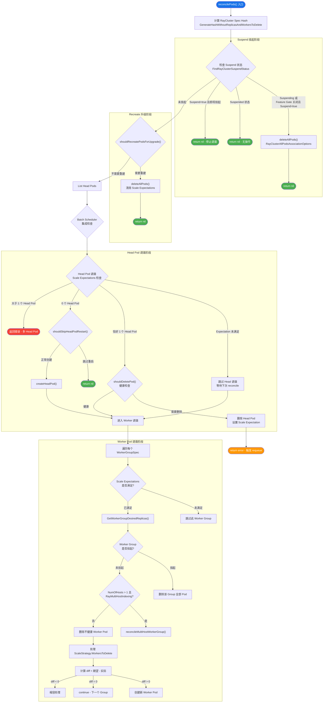
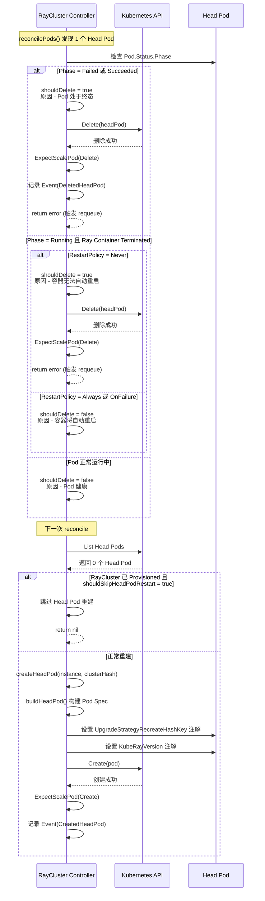
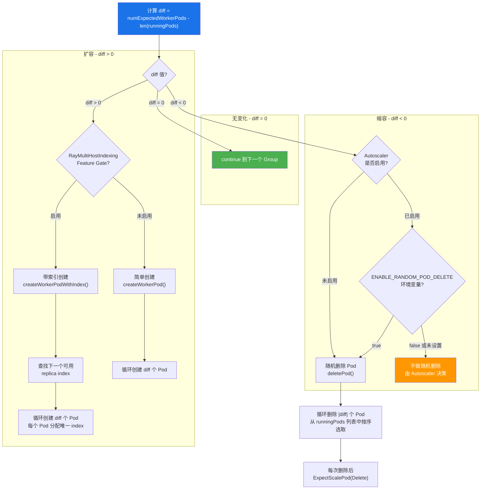

---

## 前置知识

| 知识领域 | 说明 |
|----------|------|
| controller-runtime 基础 | 理解 Reconcile 循环、client.Client 接口 |
| RayCluster Controller 调和循环 | 建议先阅读 [2.1 调和循环核心流程](01-reconciliation-loop.md) |
| Kubernetes Pod 生命周期 | Pod Phase、Container State、Readiness |
| Ray 集群架构 | Head Node / Worker Node 角色与职责 |

---

## 目录

- [前置知识](#前置知识)
- [概述](#概述)
- [reconcilePods 完整决策流程](#reconcilepods-完整决策流程)
- [Suspend 挂起处理](#suspend-挂起处理)
- [Recreate 升级策略](#recreate-升级策略)
- [Head Pod 调谐](#head-pod-调谐)
- [Worker Pod 调谐](#worker-pod-调谐)
- [Multi-Host Worker Group 调谐](#multi-host-worker-group-调谐)
- [关键辅助函数详解](#关键辅助函数详解)
- [延伸阅读](#延伸阅读)
- [下一篇](#下一篇)

---

## 概述

`reconcilePods()` 是 RayCluster Controller 中最核心的函数之一, 负责将集群的 **期望 Pod 状态** 与 **实际运行 Pod 状态** 进行对齐。该函数位于 `ray-operator/controllers/ray/raycluster_controller.go` 的第 615-931 行, 涵盖了以下关键职责 -

| 职责 | 说明 |
|------|------|
| Suspend 挂起 | 检测集群挂起状态, 删除全部 Pod |
| Recreate 升级 | 检测 Spec 变更, 执行全量 Pod 重建 |
| Head Pod 管理 | 确保有且仅有一个健康的 Head Pod |
| Worker Pod 管理 | 根据副本数进行扩缩容 |
| Multi-Host 调谐 | 多主机 Worker Group 的原子化管理 |

> **源码路径**: `ray-operator/controllers/ray/raycluster_controller.go`

---

## reconcilePods 完整决策流程

`reconcilePods()` 按照严格的优先级顺序执行以下决策链路。每一个阶段如果触发了操作 (例如删除 Pod), 通常会提前返回, 不再执行后续步骤, 这是为了保证在下一次 reconciliation 循环中可以重新评估集群状态。



---

## Suspend 挂起处理

### 整体逻辑

Suspend 机制允许用户暂停 RayCluster 而不必删除 CR 本身。挂起时, 所有关联的 Pod 会被删除, 但集群的配置 (Spec) 保持不变, 便于后续恢复。

```go
// raycluster_controller.go L624-L650
suspendStatus := utils.FindRayClusterSuspendStatus(instance)
statusConditionGateEnabled := features.Enabled(features.RayClusterStatusConditions)
if suspendStatus == rayv1.RayClusterSuspending ||
    (!statusConditionGateEnabled && instance.Spec.Suspend != nil && *instance.Spec.Suspend) {
    if _, err := r.deleteAllPods(ctx, common.RayClusterAllPodsAssociationOptions(instance)); err != nil {
        // ... 错误处理
    }
    return nil
}
```

### RayClusterSuspending Condition 检查

`FindRayClusterSuspendStatus()` 遍历 `instance.Status.Conditions`, 查找类型为 `RayClusterSuspending` 或 `RayClusterSuspended` 且 `Status` 为 `ConditionTrue` 的 Condition -

```go
// utils/util.go L154-L163
func FindRayClusterSuspendStatus(instance *rayv1.RayCluster) rayv1.RayClusterConditionType {
    for _, cond := range instance.Status.Conditions {
        if cond.Type == string(rayv1.RayClusterSuspending) || cond.Type == string(rayv1.RayClusterSuspended) {
            if cond.Status == metav1.ConditionTrue {
                return rayv1.RayClusterConditionType(cond.Type)
            }
        }
    }
    return ""
}
```

### Feature Gate `RayClusterStatusConditions` 的交互

`RayClusterStatusConditions` 是一个 Beta 级别的 Feature Gate (默认启用)。它控制着 Suspend 逻辑的两条代码路径 -

| Feature Gate 状态 | Suspend 判断方式 |
|---|---|
| **启用** (默认) | 依赖 Status.Conditions 中的 `RayClusterSuspending` / `RayClusterSuspended` |
| **禁用** | 直接判断 `Spec.Suspend != nil && *Spec.Suspend` |

当 Feature Gate **启用**时, 还有两个额外的短路返回 -

1. **Suspended 状态**: 集群已完全挂起, 所有 Pod 已删除 -> 直接返回 `nil` (无操作)
2. **Spec.Suspend = true 但尚未进入 Suspending**: 集群即将开始挂起流程 -> 直接返回 `nil`, 等待 Status 更新后再处理

```go
// raycluster_controller.go L642-L650
if statusConditionGateEnabled {
    if suspendStatus == rayv1.RayClusterSuspended {
        return nil // 集群已挂起, 停止 Pod 调谐
    }
    if instance.Spec.Suspend != nil && *instance.Spec.Suspend {
        return nil // 集群即将挂起, 停止 Pod 调谐
    }
}
```

### deleteAllPods 与 RayClusterAllPodsAssociationOptions

`deleteAllPods()` 使用 `client.DeleteAllOf` 批量删除所有匹配的 Pod -

```go
// raycluster_controller.go L141-L157
func (r *RayClusterReconciler) deleteAllPods(ctx context.Context, filters common.AssociationOptions) (pods corev1.PodList, err error) {
    if err = r.List(ctx, &pods, filters.ToListOptions()...); err != nil {
        return pods, err
    }
    active := 0
    for _, pod := range pods.Items {
        if pod.DeletionTimestamp.IsZero() {
            active++
        }
    }
    if active > 0 {
        return pods, r.DeleteAllOf(ctx, &corev1.Pod{}, filters.ToDeleteOptions()...)
    }
    return pods, nil
}
```

`RayClusterAllPodsAssociationOptions` 的过滤条件非常简单 - 匹配命名空间和 `ray.io/cluster` 标签 -

```go
// common/association.go L123-L130
func RayClusterAllPodsAssociationOptions(instance *rayv1.RayCluster) AssociationOptions {
    return AssociationOptions{
        client.InNamespace(instance.Namespace),
        client.MatchingLabels{
            utils.RayClusterLabelKey: instance.Name,
        },
    }
}
```

这意味着挂起操作会删除集群的 **所有** Pod (Head + Workers), 而不是逐个删除。

---

## Recreate 升级策略

### shouldRecreatePodsForUpgrade() 深度分析

当用户配置了 `UpgradeStrategy.Type = Recreate` 时, RayCluster Controller 会在检测到 Spec 变更时删除所有 Pod 并重新创建。这一逻辑由 `shouldRecreatePodsForUpgrade()` 函数驱动 (L1127-L1167) -

```go
func (r *RayClusterReconciler) shouldRecreatePodsForUpgrade(ctx context.Context, instance *rayv1.RayCluster) bool {
    // 1. 前置条件 - 必须配置 Recreate 升级策略
    if instance.Spec.UpgradeStrategy == nil ||
       instance.Spec.UpgradeStrategy.Type == nil ||
       *instance.Spec.UpgradeStrategy.Type != rayv1.RayClusterRecreate {
        return false
    }

    // 2. 计算当前 Spec 的 Hash
    expectedClusterHash, err := utils.GenerateHashWithoutReplicasAndWorkersToDelete(instance.Spec)
    // ...

    // 3. 获取 Head Pod 进行比对
    headPods := corev1.PodList{}
    r.List(ctx, &headPods, ...)

    // 4. KubeRay 版本变更跳过逻辑
    if len(headPods.Items) > 0 {
        headPod := headPods.Items[0]
        podVersion := headPod.Annotations[utils.KubeRayVersion]
        if podVersion != "" && podVersion != utils.KUBERAY_VERSION {
            // 仅更新注解, 不触发重建
            headPod.Annotations[utils.UpgradeStrategyRecreateHashKey] = expectedClusterHash
            headPod.Annotations[utils.KubeRayVersion] = utils.KUBERAY_VERSION
            r.Update(ctx, &headPod)
            return false
        }
        // 5. Hash 比较
        actualHash := headPod.Annotations[utils.UpgradeStrategyRecreateHashKey]
        if actualHash != "" && actualHash != expectedClusterHash {
            return true  // Spec 确实发生了变化, 触发重建
        }
    }
    return false
}
```

### Hash 计算 - GenerateHashWithoutReplicasAndWorkersToDelete

该函数在计算 Hash 时会静默以下字段, 避免这些字段的变更触发不必要的 Pod 重建 -

```go
// utils/util.go L643-L657
func GenerateHashWithoutReplicasAndWorkersToDelete(rayClusterSpec rayv1.RayClusterSpec) (string, error) {
    updatedRayClusterSpec := rayClusterSpec.DeepCopy()
    for i := 0; i < len(updatedRayClusterSpec.WorkerGroupSpecs); i++ {
        updatedRayClusterSpec.WorkerGroupSpecs[i].Replicas = nil        // Autoscaler 触发
        updatedRayClusterSpec.WorkerGroupSpecs[i].MaxReplicas = nil     // 弹性配置
        updatedRayClusterSpec.WorkerGroupSpecs[i].MinReplicas = nil     // 弹性配置
        updatedRayClusterSpec.WorkerGroupSpecs[i].ScaleStrategy.WorkersToDelete = nil  // Autoscaler 缩容
    }
    updatedRayClusterSpec.UpgradeStrategy = nil  // 升级策略本身的变更不应触发重建
    return GenerateJsonHash(updatedRayClusterSpec)
}
```

| 被静默的字段 | 原因 |
|---|---|
| `Replicas` | Autoscaler 频繁调整, 不属于 "Spec 变更" |
| `MinReplicas` / `MaxReplicas` | 弹性边界调整不应触发全量重建 |
| `ScaleStrategy.WorkersToDelete` | Autoscaler 缩容操作 |
| `UpgradeStrategy` | 升级策略本身的变更 |

### KubeRay 版本变更跳过逻辑

这是一个精妙的设计 - 当 KubeRay Operator 升级 (版本号发生变化) 时, 由于 Pod 构建逻辑可能发生细微变化, 导致 Hash 不一致。为了避免 Operator 升级触发所有集群的 Pod 重建, 控制器在检测到版本变更时 -

1. 将 Head Pod 注解中的 Hash 值更新为当前计算的新 Hash
2. 将 KubeRay 版本注解更新为当前版本
3. **返回 false**, 跳过本次重建

这保证了 Operator 升级是一个 "无感" 操作。

---

## Head Pod 调谐

Head Pod 的调谐是整个 `reconcilePods()` 中最关键的部分。一个 RayCluster 有且仅有一个 Head Pod, 它运行着 GCS (Global Control Service) 和 Ray Dashboard 等核心服务。

### Scale Expectations 检查

在开始 Head Pod 调谐之前, 控制器首先检查 Scale Expectations -

```go
// raycluster_controller.go L685-L686
if !r.rayClusterScaleExpectation.IsSatisfied(ctx, instance.Namespace, instance.Name, expectations.HeadGroup) {
    logger.Info("reconcilePods", "Expectation", "NotSatisfiedHeadExpectations, reconcile head later")
}
```

Scale Expectations 是一种乐观并发控制机制。当控制器发起创建或删除 Pod 的请求后, 它会在本地缓存中记录一个 "期望" - 例如 "我刚创建了一个名为 X 的 Pod, 它应该很快出现"。在下一次 reconcile 时, `IsSatisfied()` 会检查这些期望是否已经被 Kubernetes API Server 的状态更新所满足 -

```go
// expectations/scale_expectations.go L93-L113
func (r *rayClusterScaleExpectationImpl) IsSatisfied(ctx context.Context, namespace, rayClusterName, group string) (isSatisfied bool) {
    items, err := r.itemsCache.ByIndex(GroupIndex, fmt.Sprintf("%s/%s/%s", namespace, rayClusterName, group))
    // ...
    for i := range items {
        rp := items[i].(*rayPod)
        isPodSatisfied := r.isPodScaled(ctx, rp)
        if !isPodSatisfied {
            return false  // 有未满足的期望, 跳过本次调谐
        }
        // 删除已满足的期望
        r.itemsCache.Delete(items[i])
    }
    return true
}
```

如果 Expectations 未满足, 控制器会跳过 Head Pod 调谐, 等待下一次 reconcile。这避免了在 API Server 尚未反映最新状态时做出错误的调度决策。

### shouldDeletePod() 函数详解

`shouldDeletePod()` 是判断 Pod 是否应被删除的核心函数 (L1177-L1227), 它同时用于 Head Pod 和 Worker Pod -



具体来看, `shouldDeletePod()` 有三层判断逻辑 -

**第一层 - Pod 终态检查**

```go
// L1182-L1188
if pod.Status.Phase == corev1.PodFailed || pod.Status.Phase == corev1.PodSucceeded {
    return true, reason  // Pod 已进入终态, 必须删除重建
}
```

`PodFailed` 和 `PodSucceeded` 是 Kubernetes Pod 的两个终态, Pod 不会再自动恢复。

**第二层 - Ray 容器终止 + RestartPolicy 检查**

```go
// L1190-L1204
rayContainerTerminated := getRayContainerStateTerminated(pod)
if pod.Status.Phase == corev1.PodRunning && rayContainerTerminated != nil {
    if pod.Spec.RestartPolicy == corev1.RestartPolicyNever {
        return true, reason   // 容器已终止且不会重启, 需要删除
    }
    return false, reason      // 容器会自动重启, 不需要 KubeRay 介入
}
```

这里有一个有趣的情况 - Pod 整体状态是 `Running`, 但 Ray 容器已经 Terminated。这种情况发生在 Pod 中有多个容器 (sidecar) 时, 即使 Ray 容器退出, Pod 仍然可以是 `Running` 状态。

**第三层 - 默认不删除**

```go
// L1223-L1226
return false, reason  // 其他所有情况, 不删除 Pod
```

### Head Pod 创建 - createHeadPod -> buildHeadPod

当 Head Pod 数量为 0 时, 控制器通过 `createHeadPod()` 创建新的 Head Pod -

```go
// raycluster_controller.go L1303-L1333
func (r *RayClusterReconciler) createHeadPod(ctx context.Context, instance rayv1.RayCluster, clusterHash string) error {
    // 1. 构建 Pod Spec
    pod := r.buildHeadPod(ctx, instance)

    // 2. 写入升级策略相关注解
    if clusterHash != "" {
        pod.Annotations[utils.UpgradeStrategyRecreateHashKey] = clusterHash
        pod.Annotations[utils.KubeRayVersion] = utils.KUBERAY_VERSION
    }

    // 3. Batch Scheduler 集成
    if r.options.BatchSchedulerManager != nil {
        // 添加调度器元数据
    }

    // 4. 创建 Pod
    if err := r.Create(ctx, &pod); err != nil {
        return err
    }

    // 5. 注册 Scale Expectation
    r.rayClusterScaleExpectation.ExpectScalePod(pod.Namespace, instance.Name,
        expectations.HeadGroup, pod.Name, expectations.Create)
    return nil
}
```

`buildHeadPod()` 是实际构建 Pod 对象的函数, 它会根据 `HeadGroupSpec` 生成完整的 Pod Spec, 包含标签、环境变量、端口配置等。Pod 名称通过 `utils.PodName()` 生成, 支持确定性命名 (`IsDeterministicHeadPodNameEnabled`)。

### 多 Head Pod 错误处理

如果发现超过 1 个 Head Pod (通常是用户手动创建导致), 控制器会直接返回错误 -

```go
// raycluster_controller.go L734-L744
} else if len(headPods.Items) > 1 {
    headPodNames := make([]string, len(headPods.Items))
    for i, pod := range headPods.Items {
        headPodNames[i] = pod.Name
    }
    return fmt.Errorf("%d head pods found %v. Please delete extra head pods", len(headPods.Items), headPodNames)
}
```

控制器**不会**自动删除多余的 Head Pod, 而是要求用户手动介入。这是一种安全保守的设计, 避免控制器误删用户的重要 Pod。

### shouldSkipHeadPodRestart 注解检查

当 Head Pod 不存在 (数量为 0) 时, 控制器在创建之前会检查 `DisableProvisionedHeadRestartAnnotationKey` 注解 -

```go
// raycluster_controller.go L710-L728
if meta.IsStatusConditionTrue(instance.Status.Conditions, string(rayv1.RayClusterProvisioned)) &&
    shouldSkipHeadPodRestart(instance) {
    // 跳过 Head Pod 重建
    return nil
}
```

```go
// raycluster_controller.go L1123-L1125
func shouldSkipHeadPodRestart(instance *rayv1.RayCluster) bool {
    return instance.Annotations[utils.DisableProvisionedHeadRestartAnnotationKey] == "true"
}
```

该注解值为 `ray.io/disable-provisioned-head-restart`, 主要用于 **RayJob Sidecar 模式**。当满足以下两个条件时, 跳过 Head Pod 重建 -

1. RayCluster 已处于 `Provisioned` 状态
2. 注解 `ray.io/disable-provisioned-head-restart` 的值为 `"true"`

**为什么要跳过?** 因为在 RayJob 场景下, 重建 Head Pod 是没有意义的 -

- **GCS Fault Tolerance 未启用**: 新 Head Pod 会终止所有 Worker Pod, 新 Job 无法在 "已配置好的" 集群上运行
- **GCS Fault Tolerance 已启用**: Worker Pod 不会被终止, 但 Submission ID 已被使用, 新 Job 会失败

---

## Worker Pod 调谐

Worker Pod 的调谐在 Head Pod 调谐之后执行, 控制器会遍历 `instance.Spec.WorkerGroupSpecs` 中的每一个 Worker Group 进行独立调谐。

### Scale Expectations 检查

与 Head Pod 类似, 每个 Worker Group 都有独立的 Scale Expectations -

```go
// raycluster_controller.go L748-L751
if !r.rayClusterScaleExpectation.IsSatisfied(ctx, instance.Namespace, instance.Name, worker.GroupName) {
    continue  // 跳过此 Group, 等待下次 reconcile
}
```

### GetWorkerGroupDesiredReplicas - 期望副本数计算

```go
// utils/util.go L387-L405
func GetWorkerGroupDesiredReplicas(workerGroupSpec rayv1.WorkerGroupSpec) int32 {
    var workerReplicas int32
    minReplicas := ptr.Deref(workerGroupSpec.MinReplicas, int32(0))
    maxReplicas := ptr.Deref(workerGroupSpec.MaxReplicas, int32(math.MaxInt32))

    if workerGroupSpec.Suspend != nil && *workerGroupSpec.Suspend {
        return 0  // 挂起的 Group 期望 0 个副本
    }

    if workerGroupSpec.Replicas == nil || *workerGroupSpec.Replicas < minReplicas {
        workerReplicas = minReplicas
    } else if *workerGroupSpec.Replicas > maxReplicas {
        workerReplicas = maxReplicas
    } else {
        workerReplicas = *workerGroupSpec.Replicas
    }
    return workerReplicas * workerGroupSpec.NumOfHosts
}
```

该函数的 Clamping 逻辑如下 -

```
最终 Pod 数 = clamp(Replicas, MinReplicas, MaxReplicas) * NumOfHosts
```

| 场景 | Replicas | MinReplicas | MaxReplicas | NumOfHosts | 结果 |
|------|----------|-------------|-------------|------------|------|
| 正常 | 3 | 1 | 10 | 1 | 3 |
| 低于下限 | 0 | 2 | 10 | 1 | 2 |
| 超过上限 | 15 | 1 | 10 | 1 | 10 |
| 多主机 | 3 | 1 | 10 | 4 | 12 |
| 挂起 | 3 | 1 | 10 | 1 | 0 |

### Worker Group 挂起

单个 Worker Group 可以独立挂起 -

```go
// raycluster_controller.go L762-L771
if worker.Suspend != nil && *worker.Suspend {
    if _, err := r.deleteAllPods(ctx, common.RayClusterGroupPodsAssociationOptions(instance, worker.GroupName)); err != nil {
        return errstd.Join(utils.ErrFailedDeleteWorkerPod, err)
    }
    continue  // 跳到下一个 Worker Group
}
```

注意这里使用的是 `RayClusterGroupPodsAssociationOptions` 而非 `RayClusterAllPodsAssociationOptions`, 只删除该 Group 的 Pod。

### 不健康 Worker 删除循环

```go
// raycluster_controller.go L782-L808
deletedWorkers := make(map[string]struct{})
numDeletedUnhealthyWorkerPods := 0
for _, workerPod := range workerPods.Items {
    shouldDelete, reason := shouldDeletePod(workerPod, rayv1.WorkerNode)
    if shouldDelete {
        numDeletedUnhealthyWorkerPods++
        deletedWorkers[workerPod.Name] = deleted
        r.Delete(ctx, &workerPod)
        r.rayClusterScaleExpectation.ExpectScalePod(...)
    }
}

// 如果删除了不健康 Pod, 立即返回, 不创建新 Pod
if numDeletedUnhealthyWorkerPods > 0 {
    return fmt.Errorf("delete %d unhealthy worker Pods", numDeletedUnhealthyWorkerPods)
}
```

关键设计 - **如果有不健康 Pod 被删除, 本次 reconcile 不会创建新 Pod**。这是为了在下一次 reconcile 时能看到被删除 Pod 的最终状态, 避免在 API Server 状态不一致时做出错误决策。

### WorkersToDelete (ScaleStrategy) 处理

`WorkersToDelete` 是 Autoscaler 通过 `ScaleStrategy` 字段指定的需要删除的 Worker Pod 列表 -

```go
// raycluster_controller.go L810-L831
for _, podsToDelete := range worker.ScaleStrategy.WorkersToDelete {
    pod := corev1.Pod{}
    pod.Name = podsToDelete
    pod.Namespace = utils.GetNamespace(instance.ObjectMeta)
    if err := r.Delete(ctx, &pod); err != nil {
        if !errors.IsNotFound(err) {
            return errstd.Join(utils.ErrFailedDeleteWorkerPod, err)
        }
        // Pod 已被删除, 忽略
    } else {
        r.rayClusterScaleExpectation.ExpectScalePod(...)
        deletedWorkers[pod.Name] = deleted
    }
}
worker.ScaleStrategy.WorkersToDelete = []string{}  // 清空列表
```

这段逻辑的特点 -
- `WorkersToDelete` 的删除**不受 Replicas 值约束**, 始终执行
- 删除完成后立即清空 `WorkersToDelete` 列表
- 如果目标 Pod 已经不存在 (`IsNotFound`), 仅记录日志, 不返回错误

### 扩缩容决策



**扩容** (diff > 0) -

- 如果启用了 `RayMultiHostIndexing` Feature Gate, 使用 `createWorkerPodWithIndex()` 创建带索引的 Pod
- 否则使用 `createWorkerPod()` 创建普通 Pod
- 索引分配算法 - 从 0 开始递增查找第一个未被使用的 replica index

**缩容** (diff < 0) -

- 分两种情况处理 -

| 场景 | 行为 |
|------|------|
| Autoscaler **未启用** | 始终启用随机 Pod 删除 |
| Autoscaler **已启用** + `ENABLE_RANDOM_POD_DELETE=true` | 启用随机 Pod 删除 |
| Autoscaler **已启用** + `ENABLE_RANDOM_POD_DELETE` 未设置或非 true | 禁用随机删除, 仅由 Autoscaler 通过 `WorkersToDelete` 指定 |

### ENABLE_RANDOM_POD_DELETE 环境变量

```go
// raycluster_controller.go L896-L904
enableRandomPodDelete := false
if enableInTreeAutoscaling {
    if s := os.Getenv(utils.ENABLE_RANDOM_POD_DELETE); strings.ToLower(s) == "true" {
        enableRandomPodDelete = true
    }
}
```

这是 KubeRay v0.6.0 引入的兼容性 Feature Flag。默认情况下, 当 Autoscaler 启用时, KubeRay 不会随机删除 Pod, 而是完全交给 Autoscaler 决策。这是因为 Autoscaler 拥有更多上下文信息 (如节点利用率、任务调度情况等), 能做出更优的缩容决策。

如果用户希望恢复旧版行为 (随机删除), 可以设置 `ENABLE_RANDOM_POD_DELETE=true` 环境变量。

---

## Multi-Host Worker Group 调谐

### 概述

`reconcileMultiHostWorkerGroup()` (L954-L1121) 处理 `NumOfHosts > 1` 且启用了 `RayMultiHostIndexing` Feature Gate 的 Worker Group。在多主机场景下, 每个 "逻辑副本" 由多个 Pod 组成 (每个主机一个 Pod), 这些 Pod 必须作为一个原子单元进行管理。

### 按 replica-name 分组

```go
// raycluster_controller.go L962-L968
replicaMap := make(map[string][]corev1.Pod)
for _, pod := range workerPods {
    if replicaName, ok := pod.Labels[utils.RayWorkerReplicaNameKey]; ok {
        replicaMap[replicaName] = append(replicaMap[replicaName], pod)
    }
}
```

每个 Pod 通过 `ray.io/worker-group-replica-name` 标签标识其所属的逻辑副本组。该标签的值由 `GenerateRayWorkerReplicaGroupName()` 生成 (格式: `{groupName}-{5位随机字符}`)。

### 清理不完整的副本组

```go
// raycluster_controller.go L971-L980
for replicaName, podList := range replicaMap {
    if len(podList) < int(worker.NumOfHosts) {
        // Pod 数量不足, 删除整个副本组
        r.deletePods(ctx, instance, podList, worker.GroupName, "cleanup of incomplete multi-host group")
        return fmt.Errorf("cleaned up incomplete replica group %s, requeueing", replicaName)
    }
}
```

如果某个副本组的 Pod 数量少于 `NumOfHosts` (可能由外部删除导致), 控制器会 **删除该组所有剩余 Pod** 并触发 requeue。这保证了多主机副本的 **原子性** - 要么全部存在, 要么全部不存在。

### 删除不健康的副本组

```go
// raycluster_controller.go L982-L1003
deletedPods := make(map[string]struct{})
for _, pod := range workerPods {
    if _, alreadyDeleted := deletedPods[pod.Name]; alreadyDeleted {
        continue
    }
    if shouldDelete, reason := shouldDeletePod(pod, rayv1.WorkerNode); shouldDelete {
        replicaName := pod.Labels[utils.RayWorkerReplicaNameKey]
        podsToDelete := replicaMap[replicaName]
        // 删除整个副本组的所有 Pod
        r.deletePods(ctx, instance, podsToDelete, worker.GroupName, reason)
        for _, p := range podsToDelete {
            deletedPods[p.Name] = struct{}{}
        }
    }
}
```

关键设计 - 当副本组中的 **任何一个 Pod** 被判定为不健康时, **整个副本组** 的所有 Pod 都会被删除。`deletedPods` map 用于避免对已删除 Pod 重复检查。

### Autoscaler 显式删除处理

```go
// raycluster_controller.go L1005-L1034
if len(worker.ScaleStrategy.WorkersToDelete) > 0 {
    podsToDeleteFromStrategy := make(map[string]corev1.Pod)
    for _, podName := range worker.ScaleStrategy.WorkersToDelete {
        for _, pod := range workerPods {
            if pod.Name == podName {
                replicaName := pod.Labels[utils.RayWorkerReplicaNameKey]
                // 将该副本组的所有 Pod 加入待删除列表
                for _, p := range replicaMap[replicaName] {
                    podsToDeleteFromStrategy[p.Name] = p
                }
                break
            }
        }
    }
    // 执行批量删除并 requeue
}
```

当 Autoscaler 指定要删除某个 Pod 时, 控制器会自动扩展为删除该 Pod 所在的 **整个副本组**。这是多主机场景下的必要行为 - 你不能只删除多主机副本中的一个 Pod。

### 按 NumOfHosts 扩缩容

```go
// raycluster_controller.go L1036-L1060
numRunningReplicas := len(validReplicaGroups)
numExpectedWorkerPods := int(utils.GetWorkerGroupDesiredReplicas(*worker))

if numExpectedWorkerPods % int(worker.NumOfHosts) != 0 {
    return fmt.Errorf("desired worker pods (%d) is not a multiple of NumOfHosts (%d)",
        numExpectedWorkerPods, worker.NumOfHosts, worker.GroupName)
}
numExpectedReplicas := numExpectedWorkerPods / int(worker.NumOfHosts)
replicasToCreate := numExpectedReplicas - numRunningReplicas
```

**约束**: 期望 Pod 数必须是 `NumOfHosts` 的整数倍, 否则返回错误。

**扩容** (replicasToCreate > 0) -

```go
// raycluster_controller.go L1075-L1090
for range replicasToCreate {
    // 查找下一个可用的 replica index
    for validReplicaIndices[newReplicaIndex] {
        newReplicaIndex++
    }
    validReplicaIndices[newReplicaIndex] = true
    replicaName := utils.GenerateRayWorkerReplicaGroupName(worker.GroupName)
    // 创建 NumOfHosts 个 Pod, 每个 Pod 有不同的 hostIndex
    for j := 0; j < int(worker.NumOfHosts); j++ {
        r.createWorkerPodWithIndex(ctx, *instance, *worker.DeepCopy(), replicaName, newReplicaIndex, j)
    }
}
```

每个新副本组 -
1. 分配一个全局唯一的 `replicaName`
2. 分配一个在该 Worker Group 内唯一的 `replicaIndex`
3. 创建 `NumOfHosts` 个 Pod, 每个 Pod 的 `hostIndex` 从 0 到 `NumOfHosts-1`

**缩容** (replicasToCreate < 0) -

缩容逻辑与普通 Worker Group 类似, 但操作单位是 **整个副本组** 而非单个 Pod -

```go
// raycluster_controller.go L1100-L1117
if !enableInTreeAutoscaling || enableRandomPodDelete {
    replicasToRemove := -replicasToCreate
    replicasDeleted := 0
    for replicaID := range validReplicaGroups {
        if replicasDeleted >= replicasToRemove {
            break
        }
        podList := replicaMap[replicaID]
        r.deletePods(ctx, instance, podList, worker.GroupName, "scaling down")
        replicasDeleted++
    }
}
```

### Replica Index 管理

Replica Index 的管理贯穿整个多主机调谐流程, 确保每个副本组有唯一的索引 -

| Label | 说明 | 作用域 |
|-------|------|--------|
| `ray.io/worker-group-replica-name` | 副本组唯一名称 (如 `gpu-group-xh3hf`) | 跨 RayCluster 唯一 |
| `ray.io/worker-group-replica-index` | 副本组整数索引 (如 `0`, `1`, `2`) | Worker Group 内唯一 |
| `ray.io/replica-host-index` | 主机索引 (如 `0`, `1`, ..., `NumOfHosts-1`) | 副本组内唯一 |

索引分配算法采用 "贪心填充" 策略 - 从 0 开始, 跳过已被使用的索引, 取第一个可用值。

---

## 关键辅助函数详解

### getRayContainerStateTerminated

```go
// raycluster_controller.go L1233-L1244
func getRayContainerStateTerminated(pod corev1.Pod) *corev1.ContainerStateTerminated {
    rayContainerName := pod.Spec.Containers[utils.RayContainerIndex].Name
    for _, containerStatus := range pod.Status.ContainerStatuses {
        if containerStatus.Name == rayContainerName {
            return containerStatus.State.Terminated
        }
    }
    return nil  // 未找到时返回 nil, 表示未终止
}
```

KubeRay 要求 Ray 容器必须是 Pod 中的 **第一个应用容器** (`RayContainerIndex = 0`)。由于 `ContainerStatuses` 的顺序不保证与 `Containers` 一致, 函数通过名称匹配来定位 Ray 容器的状态。

### deletePods 辅助函数

```go
// raycluster_controller.go L935-L952
func (r *RayClusterReconciler) deletePods(ctx context.Context, instance *rayv1.RayCluster,
    podsToDelete []corev1.Pod, groupName string, reason string) error {
    for i := range podsToDelete {
        pod := podsToDelete[i]
        if err := r.Delete(ctx, &pod); err != nil {
            if errors.IsNotFound(err) {
                continue  // Pod 已不存在, 跳过
            }
            return errstd.Join(utils.ErrFailedDeleteWorkerPod, err)
        }
        r.rayClusterScaleExpectation.ExpectScalePod(...)
        r.Recorder.Eventf(...)
    }
    return nil
}
```

这是多主机调谐专用的批量删除辅助函数, 与普通 Worker 调谐中的内联删除逻辑不同, 它将删除、Expectation 注册和 Event 记录封装为一个统一操作。

---

## 延伸阅读

- [Kubernetes Pod Lifecycle](https://kubernetes.io/docs/concepts/workloads/pods/pod-lifecycle/) - 理解 Pod Phase 状态机
- [KubeRay Feature Gates](https://docs.ray.io/en/latest/cluster/kubernetes/user-guides/kuberay-feature-gates.html) - 各 Feature Gate 的说明与启用方式
- [Ray Autoscaler](https://docs.ray.io/en/latest/cluster/kubernetes/user-guides/ray-cluster-autoscaler.html) - Ray Autoscaler 与 KubeRay 的集成机制
- [Scale Expectations 模式](https://github.com/kubernetes/kubernetes/blob/master/pkg/controller/controller_utils.go) - Kubernetes 控制器中 Expectations 模式的原始实现

---

## 下一篇

[03 - Status 计算与更新机制](03-status-calculation.md) - 深入分析 `calculateStatus()` 如何根据 Pod 状态计算 RayCluster 的 Status 字段, 包括 Condition 管理、Worker 副本数统计、资源汇总等核心逻辑。
