---

## 前置知识

| 知识领域 | 说明 |
|----------|------|
| controller-runtime 基础 | 理解 Status Subresource、Conditions 模式 |
| RayCluster Controller 调和循环 | 建议先阅读 [2.1 调和循环核心流程](01-reconciliation-loop.md) |
| Kubernetes CRD Status 规范 | ObservedGeneration、Conditions、资源统计 |
| Prometheus client_golang | 理解 Gauge / Counter 指标类型 |

---

## 目录

- [前置知识](#前置知识)
- [1. 概述](#1-概述)
- [2. calculateStatus 完整解析](#2-calculatestatus-完整解析)
  - [2.1 Deep Copy 不可变模式](#21-deep-copy-不可变模式)
  - [2.2 RayClusterReplicaFailure Condition](#22-rayclusterreplicafailure-condition)
  - [2.3 ObservedGeneration 更新](#23-observedgeneration-更新)
  - [2.4 Worker 副本数统计](#24-worker-副本数统计)
  - [2.5 资源统计 - CPU/Memory/GPU/TPU](#25-资源统计---cpumemorygputpu)
  - [2.6 ClusterState 状态计算](#26-clusterstate-状态计算)
  - [2.7 StateTransitionTimes 追踪](#27-statetransitiontimes-追踪)
- [3. 五种 Condition 类型详解](#3-五种-condition-类型详解)
  - [3.1 HeadPodReady](#31-headpodready)
  - [3.2 RayClusterProvisioned](#32-rayclusterprovisioned)
  - [3.3 RayClusterSuspending](#33-rayclustersuspending)
  - [3.4 RayClusterSuspended](#34-rayclustersuspended)
  - [3.5 RayClusterReplicaFailure](#35-rayclusterreplicafailure)
- [4. Suspend 状态机转换](#4-suspend-状态机转换)
- [5. updateRayClusterStatus 解析](#5-updaterayclusterstatus-解析)
- [6. 辅助函数解析](#6-辅助函数解析)
  - [6.1 updateEndpoints](#61-updateendpoints)
  - [6.2 updateHeadInfo](#62-updateheadinfo)
- [7. 指标体系 - Metrics](#7-指标体系---metrics)
- [8. calculateStatus 完整流程图](#8-calculatestatus-完整流程图)
- [9. 关键设计思想总结](#9-关键设计思想总结)
- [延伸阅读](#延伸阅读)
- [下一篇](#下一篇)

---

## 1. 概述

RayCluster Controller 的状态计算是整个调谐循环中最关键的一环。每次 Reconcile 调用完成各资源（Service、Pods 等）的调谐后，都会调用 `calculateStatus()` 方法来重新计算集群的最新状态，然后通过 `updateRayClusterStatus()` 将变更写回 Kubernetes API Server。

状态计算涉及的核心概念包括：

| 概念 | 说明 |
|------|------|
| **ClusterState** | 集群的整体状态（`ready` / `suspended`） |
| **Conditions** | 5 种细粒度条件类型，受 Feature Gate 控制 |
| **Worker Replicas** | 5 个维度的副本计数 |
| **Resource Statistics** | CPU/Memory/GPU/TPU 资源汇总 |
| **Endpoints & HeadInfo** | 服务发现相关信息 |

状态计算的入口位于 `Reconcile()` 函数中：

```go
// ray-operator/controllers/ray/raycluster_controller.go (L327-L335)

// Calculate the new status for the RayCluster.
// Note that the function will deep copy `instance` instead of mutating it.
newInstance, calculateErr := r.calculateStatus(ctx, instance, reconcileErr)
var updateErr error
var inconsistent bool
if calculateErr != nil {
    logger.Info("Got error when calculating new status", "error", calculateErr)
} else {
    inconsistent, updateErr = r.updateRayClusterStatus(ctx, originalRayClusterInstance, newInstance)
}
```

---

## 2. calculateStatus 完整解析

> 源码位置：`ray-operator/controllers/ray/raycluster_controller.go` L1548-L1715

`calculateStatus()` 是一个纯计算函数，接收当前 RayCluster 实例和调谐错误，返回一个包含新状态的 RayCluster 深拷贝副本。

### 2.1 Deep Copy 不可变模式

```go
// L1556
newInstance := instance.DeepCopy()
```

**设计意图**：函数开始时对 `instance` 执行 `DeepCopy()`，确保整个状态计算过程不会修改原始对象。这是一种经典的 **不可变性模式（Immutability Pattern）**，带来以下好处：

- **安全性**：即使状态计算中途出错，原始对象不受影响
- **可比较性**：后续 `updateRayClusterStatus()` 可以用原始实例和新实例做精确对比，判断是否真正需要更新
- **事务性**：所有状态变更在深拷贝上进行，只有最后一步才原子性地写入 API Server

### 2.2 RayClusterReplicaFailure Condition

```go
// L1558-L1573
statusConditionGateEnabled := features.Enabled(features.RayClusterStatusConditions)
if statusConditionGateEnabled {
    if reconcileErr != nil {
        if reason := utils.RayClusterReplicaFailureReason(reconcileErr); reason != "" {
            meta.SetStatusCondition(&newInstance.Status.Conditions, metav1.Condition{
                Type:    string(rayv1.RayClusterReplicaFailure),
                Status:  metav1.ConditionTrue,
                Reason:  reason,
                Message: reconcileErr.Error(),
            })
        }
    } else {
        meta.RemoveStatusCondition(&newInstance.Status.Conditions,
            string(rayv1.RayClusterReplicaFailure))
    }
}
```

`RayClusterReplicaFailureReason()` 通过 `errors.As()` 匹配特定的错误类型 `errRayClusterReplicaFailure`，支持以下 5 种失败原因：

| 错误变量 | Reason 值 | 触发场景 |
|----------|-----------|----------|
| `ErrFailedDeleteAllPods` | `FailedDeleteAllPods` | 批量删除 Pods 失败 |
| `ErrFailedDeleteHeadPod` | `FailedDeleteHeadPod` | 删除 Head Pod 失败 |
| `ErrFailedCreateHeadPod` | `FailedCreateHeadPod` | 创建 Head Pod 失败 |
| `ErrFailedDeleteWorkerPod` | `FailedDeleteWorkerPod` | 删除 Worker Pod 失败 |
| `ErrFailedCreateWorkerPod` | `FailedCreateWorkerPod` | 创建 Worker Pod 失败 |

**核心逻辑**：当 `reconcileErr` 为 `nil` 时，主动 **移除** `RayClusterReplicaFailure` Condition（而不是设为 False），这意味着该 Condition 是"存在即意味着异常"的语义。

### 2.3 ObservedGeneration 更新

```go
// L1576
newInstance.Status.ObservedGeneration = newInstance.ObjectMeta.Generation
```

`ObservedGeneration` 是 Kubernetes 的标准模式，用于标记 Controller 最后一次处理的资源版本。当用户修改 `RayCluster.Spec` 时，API Server 会自增 `ObjectMeta.Generation`。Controller 在每次 Reconcile 中将 `ObservedGeneration` 更新为当前 `Generation`，让外部观察者可以判断 Controller 是否已经处理了最新的 Spec 变更。

### 2.4 Worker 副本数统计

```go
// L1578-L1587
runtimePods := corev1.PodList{}
if err := r.List(ctx, &runtimePods,
    common.RayClusterAllPodsAssociationOptions(newInstance).ToListOptions()...); err != nil {
    return nil, err
}

newInstance.Status.ReadyWorkerReplicas = utils.CalculateReadyReplicas(runtimePods)
newInstance.Status.AvailableWorkerReplicas = utils.CalculateAvailableReplicas(runtimePods)
newInstance.Status.DesiredWorkerReplicas = utils.CalculateDesiredReplicas(newInstance)
newInstance.Status.MinWorkerReplicas = utils.CalculateMinReplicas(newInstance)
newInstance.Status.MaxWorkerReplicas = utils.CalculateMaxReplicas(newInstance)
```

五个副本计数字段的计算逻辑如下：

| 字段 | 数据来源 | 计算逻辑 |
|------|----------|----------|
| `ReadyWorkerReplicas` | 运行时 Pod 列表 | 过滤 Worker 类型 Pod，统计 `PodRunning` 且 `PodReady=True` 的数量 |
| `AvailableWorkerReplicas` | 运行时 Pod 列表 | 过滤 Worker 类型 Pod，统计 `PodRunning` 的数量（不要求 Ready） |
| `DesiredWorkerReplicas` | Spec 声明 | `SUM(replicas * numOfHosts)` 跨所有 WorkerGroup |
| `MinWorkerReplicas` | Spec 声明 | `SUM(minReplicas * numOfHosts)` 跨所有非 Suspend 的 WorkerGroup |
| `MaxWorkerReplicas` | Spec 声明 | `SUM(maxReplicas * numOfHosts)` 跨所有非 Suspend 的 WorkerGroup |

**关键细节 - `GetWorkerGroupDesiredReplicas` 约束逻辑**：

```go
// ray-operator/controllers/ray/utils/util.go (L387-L405)
func GetWorkerGroupDesiredReplicas(workerGroupSpec rayv1.WorkerGroupSpec) int32 {
    var workerReplicas int32
    minReplicas := ptr.Deref(workerGroupSpec.MinReplicas, int32(0))
    maxReplicas := ptr.Deref(workerGroupSpec.MaxReplicas, int32(math.MaxInt32))
    if workerGroupSpec.Suspend != nil && *workerGroupSpec.Suspend {
        return 0  // Suspended WorkerGroup 期望副本数为 0
    }
    if workerGroupSpec.Replicas == nil || *workerGroupSpec.Replicas < minReplicas {
        workerReplicas = minReplicas
    } else if *workerGroupSpec.Replicas > maxReplicas {
        workerReplicas = maxReplicas
    } else {
        workerReplicas = *workerGroupSpec.Replicas
    }
    return workerReplicas * workerGroupSpec.NumOfHosts
}
```

期望副本数始终被 `[minReplicas, maxReplicas]` 区间约束，且 Suspended WorkerGroup 直接返回 0。

### 2.5 资源统计 - CPU/Memory/GPU/TPU

```go
// L1589-L1593
totalResources := utils.CalculateDesiredResources(newInstance)
newInstance.Status.DesiredCPU = totalResources[corev1.ResourceCPU]
newInstance.Status.DesiredMemory = totalResources[corev1.ResourceMemory]
newInstance.Status.DesiredGPU = sumGPUs(totalResources)
newInstance.Status.DesiredTPU = totalResources[corev1.ResourceName("google.com/tpu")]
```

**`CalculateDesiredResources` 计算流程**：

1. 计算 Head Pod 的资源（一个实例）
2. 遍历每个非 Suspend 的 WorkerGroup：
   - 计算单个 Worker Pod 的资源
   - 乘以 `numOfHosts` 得到单副本总资源
   - 乘以 `replicas` 得到该 WorkerGroup 总资源
3. 汇总所有资源

**`sumGPUs` - GPU 资源聚合**：

```go
// L1987-L1997
func sumGPUs(resources map[corev1.ResourceName]resource.Quantity) resource.Quantity {
    totalGPUs := resource.Quantity{}
    for key, val := range resources {
        if utils.IsGPUResourceKey(string(key)) && !val.IsZero() {
            totalGPUs.Add(val)
        }
    }
    return totalGPUs
}
```

`IsGPUResourceKey` 的匹配规则包括：
- 以 `gpu` 结尾的资源键（如 `nvidia.com/gpu`）
- NVIDIA MIG 格式（如 `nvidia.com/mig-2g.32gb`）

### 2.6 ClusterState 状态计算

#### Ready 状态判定

```go
// L1595-L1600
if reconcileErr == nil &&
    len(runtimePods.Items) == int(newInstance.Status.DesiredWorkerReplicas)+1 {
    // workers + 1 head
    if utils.CheckAllPodsRunning(ctx, runtimePods) {
        newInstance.Status.State = rayv1.Ready
        newInstance.Status.Reason = ""
    }
}
```

`Ready` 状态需要同时满足 **三个条件**：

1. **无调谐错误**：`reconcileErr == nil`
2. **Pod 数量完全匹配**：实际运行的 Pod 数 == 期望 Worker 数 + 1（Head Pod）
3. **所有 Pod 运行且就绪**：`CheckAllPodsRunning` 返回 `true`

`CheckAllPodsRunning` 的判定逻辑：

```go
// ray-operator/controllers/ray/utils/util.go (L585-L604)
func CheckAllPodsRunning(ctx context.Context, runningPods corev1.PodList) bool {
    if len(runningPods.Items) == 0 {
        return false  // 空列表直接返回 false
    }
    for _, pod := range runningPods.Items {
        if pod.Status.Phase != corev1.PodRunning {
            return false
        }
        for _, cond := range pod.Status.Conditions {
            if cond.Type == corev1.PodReady && cond.Status != corev1.ConditionTrue {
                return false
            }
        }
    }
    return true
}
```

#### Suspended 状态判定

```go
// L1692-L1694
if newInstance.Spec.Suspend != nil && *newInstance.Spec.Suspend &&
    len(runtimePods.Items) == 0 {
    newInstance.Status.State = rayv1.Suspended
}
```

Suspended 状态需要满足：`Spec.Suspend=true` 且所有 Pod 已被删除。

### 2.7 StateTransitionTimes 追踪

```go
// L1704-L1712
timeNow := metav1.Now()
newInstance.Status.LastUpdateTime = &timeNow

if instance.Status.State != newInstance.Status.State {
    if newInstance.Status.StateTransitionTimes == nil {
        newInstance.Status.StateTransitionTimes = make(map[rayv1.ClusterState]*metav1.Time)
    }
    newInstance.Status.StateTransitionTimes[newInstance.Status.State] = &timeNow
}
```

`StateTransitionTimes` 是一个 `map[ClusterState]*metav1.Time`，记录每次状态转换的时间戳。只有当新旧状态 **不同** 时才更新此映射，且 `LastUpdateTime` 每次都更新。

---

## 3. 五种 Condition 类型详解

所有 Condition 均受 `RayClusterStatusConditions` Feature Gate 控制。该 Feature Gate 在 v1.2 引入（Alpha），v1.3 升级为 Beta（默认开启）。

> 源码定义位置：`ray-operator/apis/ray/v1/raycluster_types.go` L344-L356

### 3.1 HeadPodReady

| 属性 | 值 |
|------|-----|
| **Condition Type** | `HeadPodReady` |
| **含义** | Head Pod 是否就绪，可接受请求 |
| **可能的 Reason** | `HeadPodNotFound` / `HeadPodRunningAndReady` / `ContainersNotReady` 相关 / `Unknown` |

**判定逻辑**：

```go
// L1604-L1619
headPod, err := common.GetRayClusterHeadPod(ctx, r, newInstance)
if headPod == nil {
    // Head Pod 不存在
    meta.SetStatusCondition(&newInstance.Status.Conditions, metav1.Condition{
        Type:    string(rayv1.HeadPodReady),
        Status:  metav1.ConditionFalse,
        Reason:  rayv1.HeadPodNotFound,
        Message: "Head Pod not found",
    })
} else {
    // 从 Head Pod 的 PodReady Condition 推导
    headPodReadyCondition := utils.FindHeadPodReadyCondition(headPod)
    meta.SetStatusCondition(&newInstance.Status.Conditions, headPodReadyCondition)
}
```

`FindHeadPodReadyCondition` 的细节处理：

1. 遍历 Head Pod 的 `Status.Conditions`，查找 `PodReady` 类型的 Condition
2. 如果 Pod Ready 且无特定 Reason，设置 Reason 为 `HeadPodRunningAndReady`
3. 如果 Reason 为 `ContainersNotReady`，进一步检查容器状态，提取 Waiting/Terminated 的根因信息（如 `CrashLoopBackOff`、`ImagePullBackOff` 等）

### 3.2 RayClusterProvisioned

| 属性 | 值 |
|------|-----|
| **Condition Type** | `RayClusterProvisioned` |
| **含义** | 所有 Ray Pod 是否第一次全部就绪 |
| **可能的 Reason** | `AllPodRunningAndReadyFirstTime` / `RayClusterPodsProvisioning` |
| **特殊行为** | 一旦设为 True，**不会** 再翻转回 False（除非集群被 Suspend） |

```go
// L1622-L1640
if !meta.IsStatusConditionTrue(newInstance.Status.Conditions,
    string(rayv1.RayClusterProvisioned)) &&
    suspendStatus != rayv1.RayClusterSuspended {
    // 只有在尚未 Provisioned 且非 Suspended 状态下才更新
    if utils.CheckAllPodsRunning(ctx, runtimePods) {
        meta.SetStatusCondition(&newInstance.Status.Conditions, metav1.Condition{
            Type:    string(rayv1.RayClusterProvisioned),
            Status:  metav1.ConditionTrue,
            Reason:  rayv1.AllPodRunningAndReadyFirstTime,
            Message: "All Ray Pods are ready for the first time",
        })
    } else {
        meta.SetStatusCondition(&newInstance.Status.Conditions, metav1.Condition{
            Type:    string(rayv1.RayClusterProvisioned),
            Status:  metav1.ConditionFalse,
            Reason:  rayv1.RayClusterPodsProvisioning,
            Message: "RayCluster Pods are being provisioned for first time",
        })
    }
}
```

**设计亮点**：`RayClusterProvisioned` 的"单向锁定"特性使其成为追踪集群首次就绪时间的可靠指标。Suspend 操作会将其重置为 False，使得恢复后需要重新 Provision。

### 3.3 RayClusterSuspending

| 属性 | 值 |
|------|-----|
| **Condition Type** | `RayClusterSuspending` |
| **含义** | 集群正在进行 Suspend 操作（Pod 删除中） |
| **可能的 Reason** | `RayClusterSuspending` |

当 `Spec.Suspend=true` 被设置，但 Pod 尚未全部删除时，该 Condition 为 True。

### 3.4 RayClusterSuspended

| 属性 | 值 |
|------|-----|
| **Condition Type** | `RayClusterSuspended` |
| **含义** | 集群已完全 Suspended（所有 Pod 已删除） |
| **可能的 Reason** | `RayClusterSuspended` |

**约束条件**：`RayClusterSuspending` 和 `RayClusterSuspended` **不能同时为 True**。

### 3.5 RayClusterReplicaFailure

| 属性 | 值 |
|------|-----|
| **Condition Type** | `ReplicaFailure` |
| **含义** | Pod 创建或删除失败 |
| **可能的 Reason** | 5 种错误类型（见 [2.2 节](#22-rayclusterreplicafailure-condition)） |
| **特殊行为** | 成功时被 **移除**（RemoveStatusCondition），而非设为 False |

---

## 4. Suspend 状态机转换

Suspend 功能通过 `RayClusterSuspending` 和 `RayClusterSuspended` 两个 Condition 实现原子性的挂起/恢复操作。

### 状态机图

```mermaid
stateDiagram-v2
    [*] --> Normal

    state Normal {
        note right of Normal
            Suspending = False
            Suspended = False
        end note
    }

    state Suspending["Suspending 中"] {
        note right of Suspending
            Suspending = True
            Suspended = False
            正在删除 Pods
        end note
    }

    state Suspended["已挂起"] {
        note right of Suspended
            Suspending = False
            Suspended = True
            所有 Pods 已删除
        end note
    }

    Normal --> Suspending : Spec.Suspend = true
    Suspending --> Suspended : len(runtimePods) == 0
    Suspended --> Normal : Spec.Suspend = false
```

### 转换矩阵

| 当前状态 | 触发条件 | 目标状态 | 额外操作 |
|----------|----------|----------|----------|
| Normal | `Spec.Suspend = true` | Suspending | 设置 `Suspending=True` |
| Suspending | `len(runtimePods) == 0` | Suspended | 设置 `Suspending=False`, `Suspended=True`, 重置 `Provisioned=False` |
| Suspended | `Spec.Suspend = false` | Normal | 设置 `Suspended=False` |

### 代码解析

```go
// L1642-L1689
switch suspendStatus {
case rayv1.RayClusterSuspending:
    if len(runtimePods.Items) == 0 {
        // 所有 Pod 已删除 -> 进入 Suspended 状态
        // 1. 重置 RayClusterProvisioned 为 False
        meta.SetStatusCondition(... RayClusterProvisioned = False ...)
        // 2. 设置 RayClusterSuspending 为 False
        meta.SetStatusCondition(... RayClusterSuspending = False ...)
        // 3. 设置 RayClusterSuspended 为 True
        meta.SetStatusCondition(... RayClusterSuspended = True ...)
    }
case rayv1.RayClusterSuspended:
    if instance.Spec.Suspend != nil && !*instance.Spec.Suspend {
        // 用户取消 Suspend -> 恢复正常
        meta.SetStatusCondition(... RayClusterSuspended = False ...)
    }
default:
    // 正常运行状态
    meta.SetStatusCondition(... RayClusterSuspended = False ...)
    if instance.Spec.Suspend != nil && *instance.Spec.Suspend {
        // 用户请求 Suspend -> 进入 Suspending
        meta.SetStatusCondition(... RayClusterSuspending = True ...)
    } else {
        meta.SetStatusCondition(... RayClusterSuspending = False ...)
    }
}
```

**原子性保证**：`updateRayClusterStatus()` 在检测到状态不一致时会返回 `inconsistent=true`，触发 Reconcile 重新排队。这确保了 Suspending -> Suspended 的过程中不会出现中间状态被遗漏的情况。

---

## 5. updateRayClusterStatus 解析

> 源码位置：`ray-operator/controllers/ray/raycluster_controller.go` L1945-L1962

```go
func (r *RayClusterReconciler) updateRayClusterStatus(
    ctx context.Context,
    originalRayClusterInstance, newInstance *rayv1.RayCluster,
) (bool, error) {
    logger := ctrl.LoggerFrom(ctx)
    inconsistent := utils.InconsistentRayClusterStatus(
        originalRayClusterInstance.Status, newInstance.Status)
    if !inconsistent {
        return inconsistent, nil  // 状态无变化，跳过更新
    }
    logger.Info("updateRayClusterStatus",
        "name", originalRayClusterInstance.Name,
        "old status", originalRayClusterInstance.Status,
        "new status", newInstance.Status)
    err := r.Status().Update(ctx, newInstance)
    if err != nil {
        logger.Info("Error updating status", ...)
    } else {
        emitRayClusterMetrics(r.options.RayClusterMetricsManager,
            newInstance.Name, newInstance.Namespace, newInstance.UID,
            originalRayClusterInstance.Status, newInstance.Status,
            newInstance.CreationTimestamp.Time)
    }
    return inconsistent, err
}
```

### InconsistentRayClusterStatus 判断逻辑

```go
// ray-operator/controllers/ray/utils/consistency.go (L16-L34)
func InconsistentRayClusterStatus(oldStatus, newStatus rayv1.RayClusterStatus) bool {
    // 1. 检查 State 和 Reason
    if oldStatus.State != newStatus.State || oldStatus.Reason != newStatus.Reason {
        return true
    }
    // 2. 检查 5 个副本计数
    if oldStatus.ReadyWorkerReplicas != newStatus.ReadyWorkerReplicas ||
        oldStatus.AvailableWorkerReplicas != newStatus.AvailableWorkerReplicas ||
        oldStatus.DesiredWorkerReplicas != newStatus.DesiredWorkerReplicas ||
        oldStatus.MinWorkerReplicas != newStatus.MinWorkerReplicas ||
        oldStatus.MaxWorkerReplicas != newStatus.MaxWorkerReplicas {
        return true
    }
    // 3. 检查 Endpoints 和 Head 信息
    if !reflect.DeepEqual(oldStatus.Endpoints, newStatus.Endpoints) ||
        !reflect.DeepEqual(oldStatus.Head, newStatus.Head) {
        return true
    }
    // 4. 检查 Conditions
    if !reflect.DeepEqual(oldStatus.Conditions, newStatus.Conditions) {
        return true
    }
    return false
}
```

**有意排除的字段**：`LastUpdateTime` 和 `ObservedGeneration` 的变更**不会**触发 Status 更新，避免不必要的 API Server 写入。

### 更新触发的后续行为

1. **Metrics 发射**：成功更新后调用 `emitRayClusterMetrics()`
2. **Requeue 触发**：返回的 `inconsistent=true` 会导致 Reconcile 以 `DefaultRequeueDuration` 重新排队

---

## 6. 辅助函数解析

### 6.1 updateEndpoints

> 源码位置：`ray-operator/controllers/ray/raycluster_controller.go` L1743-L1779

`updateEndpoints` 从 Head Service 的端口配置中提取服务端点信息，填充到 `Status.Endpoints`。

```go
func (r *RayClusterReconciler) updateEndpoints(ctx context.Context,
    instance *rayv1.RayCluster) error {
    // 查找 Head Service
    rayHeadSvc := corev1.ServiceList{}
    filterLabels := common.RayClusterHeadServiceListOptions(instance)
    if err := r.List(ctx, &rayHeadSvc, filterLabels...); err != nil {
        return err
    }
    // 遍历 Service 端口，优先级：NodePort > TargetPort.IntVal > TargetPort.StrVal
    for _, port := range svc.Spec.Ports {
        if port.NodePort != 0 {
            instance.Status.Endpoints[port.Name] = fmt.Sprintf("%d", port.NodePort)
        } else if port.TargetPort.IntVal != 0 {
            instance.Status.Endpoints[port.Name] = fmt.Sprintf("%d", port.TargetPort.IntVal)
        } else if port.TargetPort.StrVal != "" {
            instance.Status.Endpoints[port.Name] = port.TargetPort.StrVal
        }
    }
}
```

端口值的解析优先级：**NodePort** > **TargetPort（整数）** > **TargetPort（字符串）**。

### 6.2 updateHeadInfo

> 源码位置：`ray-operator/controllers/ray/raycluster_controller.go` L1781-L1802

`updateHeadInfo` 填充 `Status.Head` 结构体，包含 Head Pod 和 Service 的网络信息。

```go
func (r *RayClusterReconciler) updateHeadInfo(ctx context.Context,
    instance *rayv1.RayCluster) error {
    headPod, err := common.GetRayClusterHeadPod(ctx, r, instance)
    if headPod != nil {
        instance.Status.Head.PodIP = headPod.Status.PodIP
        instance.Status.Head.PodName = headPod.Name
    } else {
        instance.Status.Head.PodIP = ""
        instance.Status.Head.PodName = ""
    }

    ip, name, err := r.getHeadServiceIPAndName(ctx, instance)
    instance.Status.Head.ServiceIP = ip
    instance.Status.Head.ServiceName = name
    return nil
}
```

`getHeadServiceIPAndName` 还处理了 **Headless Service** 的特殊场景：当 `ClusterIP == "None"` 时，返回 Head Pod 的 IP 而非 Service IP。

---

## 7. 指标体系 - Metrics

### emitRayClusterProvisionedDuration

> 源码位置：`ray-operator/controllers/ray/raycluster_controller.go` L1971-L1977

```go
func emitRayClusterProvisionedDuration(
    RayClusterMetricsObserver metrics.RayClusterMetricsObserver,
    clusterName, namespace string, clusterUID types.UID,
    oldStatus, newStatus rayv1.RayClusterStatus,
    creationTimestamp time.Time,
) {
    if !meta.IsStatusConditionTrue(oldStatus.Conditions,
            string(rayv1.RayClusterProvisioned)) &&
        meta.IsStatusConditionTrue(newStatus.Conditions,
            string(rayv1.RayClusterProvisioned)) {
        RayClusterMetricsObserver.ObserveRayClusterProvisionedDuration(
            clusterName, namespace, clusterUID,
            time.Since(creationTimestamp).Seconds())
    }
}
```

**触发条件**：`RayClusterProvisioned` 从 False（或未设置）转变为 True 时触发，记录从 `CreationTimestamp` 到当前时间的耗时（秒）。

### Prometheus 指标列表

| 指标名称 | 类型 | Labels | 说明 |
|----------|------|--------|------|
| `kuberay_cluster_provisioned_duration_seconds` | Gauge | `name`, `namespace`, `uid` | 集群从创建到首次 Provisioned 的耗时 |
| `kuberay_cluster_info` | Gauge | `name`, `namespace`, `uid`, `owner_kind` | 集群元信息（RayCluster/RayJob/RayService） |
| `kuberay_cluster_condition_provisioned` | Gauge | `name`, `namespace`, `uid`, `condition` | 集群是否已 Provisioned |

---

## 8. calculateStatus 完整流程图

```mermaid
flowchart TD
    Start(["calculateStatus 开始"]) --> DeepCopy["DeepCopy instance<br/>创建不可变副本"]
    DeepCopy --> CheckGate{"Feature Gate<br/>RayClusterStatusConditions<br/>是否启用?"}

    CheckGate -->|"是"| CheckReconcileErr{"reconcileErr<br/>是否为 nil?"}
    CheckGate -->|"否"| UpdateGen["更新 ObservedGeneration"]

    CheckReconcileErr -->|"否 - 有错误"| CheckReason{"RayClusterReplicaFailureReason<br/>能否匹配错误类型?"}
    CheckReconcileErr -->|"是 - 无错误"| RemoveCondition["移除 ReplicaFailure Condition"]

    CheckReason -->|"匹配"| SetFailure["设置 ReplicaFailure Condition<br/>Status=True"]
    CheckReason -->|"不匹配"| UpdateGen
    SetFailure --> UpdateGen
    RemoveCondition --> UpdateGen

    UpdateGen --> ListPods["列出所有关联 Pods"]
    ListPods --> CalcReplicas["计算 5 个副本计数<br/>Ready/Available/Desired/Min/Max"]
    CalcReplicas --> CalcResources["计算资源统计<br/>CPU/Memory/GPU/TPU"]

    CalcResources --> CheckReady{"reconcileErr==nil<br/>且 Pod 数==Desired+1<br/>且所有 Pod Running?"}
    CheckReady -->|"是"| SetReady["State = Ready<br/>Reason = 空"]
    CheckReady -->|"否"| CheckGate2{"Feature Gate<br/>是否启用?"}
    SetReady --> CheckGate2

    CheckGate2 -->|"是"| CheckHead{"Head Pod<br/>是否存在?"}
    CheckGate2 -->|"否"| CheckSuspend2

    CheckHead -->|"不存在"| SetHeadNotFound["HeadPodReady = False<br/>Reason = HeadPodNotFound"]
    CheckHead -->|"存在"| SetHeadStatus["从 Pod Condition<br/>推导 HeadPodReady 状态"]

    SetHeadNotFound --> CheckProvisioned
    SetHeadStatus --> CheckProvisioned

    CheckProvisioned{"Provisioned 已为 True<br/>或集群已 Suspended?"}
    CheckProvisioned -->|"否"| CheckAllRunning{"所有 Pod<br/>是否运行就绪?"}
    CheckProvisioned -->|"是"| SuspendSwitch

    CheckAllRunning -->|"是"| SetProvisionedTrue["Provisioned = True<br/>首次就绪"]
    CheckAllRunning -->|"否"| SetProvisionedFalse["Provisioned = False<br/>正在部署中"]

    SetProvisionedTrue --> SuspendSwitch
    SetProvisionedFalse --> SuspendSwitch

    subgraph suspendBlock["Suspend 状态机处理"]
        SuspendSwitch{"当前 Suspend 状态?"}
        SuspendSwitch -->|"Suspending"| CheckPodsZero{"Pod 数 == 0?"}
        SuspendSwitch -->|"Suspended"| CheckResume{"Spec.Suspend<br/>== false?"}
        SuspendSwitch -->|"Normal"| CheckSuspendReq{"Spec.Suspend<br/>== true?"}

        CheckPodsZero -->|"是"| TransToSuspended["Provisioned=False<br/>Suspending=False<br/>Suspended=True"]
        CheckPodsZero -->|"否"| KeepSuspending["保持 Suspending 状态"]

        CheckResume -->|"是"| TransToNormal["Suspended=False"]
        CheckResume -->|"否"| KeepSuspended["保持 Suspended 状态"]

        CheckSuspendReq -->|"是"| StartSuspend["Suspending=True"]
        CheckSuspendReq -->|"否"| SetNormal["Suspending=False<br/>Suspended=False"]
    end

    TransToSuspended --> CheckSuspend2
    KeepSuspending --> CheckSuspend2
    TransToNormal --> CheckSuspend2
    KeepSuspended --> CheckSuspend2
    StartSuspend --> CheckSuspend2
    SetNormal --> CheckSuspend2

    CheckSuspend2{"Spec.Suspend=true<br/>且 Pod 数==0?"}
    CheckSuspend2 -->|"是"| SetSuspended["State = Suspended"]
    CheckSuspend2 -->|"否"| UpdateEndpoints
    SetSuspended --> UpdateEndpoints

    UpdateEndpoints["updateEndpoints<br/>填充 Service 端点信息"] --> UpdateHeadInfo["updateHeadInfo<br/>填充 Head Pod/Service 信息"]
    UpdateHeadInfo --> UpdateTime["更新 LastUpdateTime"]
    UpdateTime --> CheckStateChange{"State 是否<br/>发生变化?"}
    CheckStateChange -->|"是"| RecordTransition["记录 StateTransitionTimes"]
    CheckStateChange -->|"否"| ReturnResult
    RecordTransition --> ReturnResult(["返回 newInstance"])
```



---

## 9. Condition 状态机总览

```mermaid
stateDiagram-v2
    state headPodReady["HeadPodReady"] {
        [*] --> HPR_False
        HPR_False --> HPR_True : Head Pod Running 且 Ready
        HPR_True --> HPR_False : Head Pod 异常或被删除
        HPR_False --> HPR_NotFound : Head Pod 不存在
        HPR_NotFound --> HPR_False : Head Pod 创建但未就绪
        HPR_NotFound --> HPR_True : Head Pod 创建且就绪

        state HPR_False as "False"
        state HPR_True as "True (HeadPodRunningAndReady)"
        state HPR_NotFound as "False (HeadPodNotFound)"
    }

    state provisioned["RayClusterProvisioned"] {
        [*] --> P_False
        P_False --> P_True : 所有 Pod 首次就绪
        P_True --> P_False : 集群被 Suspend

        state P_False as "False (Provisioning)"
        state P_True as "True (锁定 - 不再翻转)"

        note right of P_True
            一旦为 True 则保持
            除非 Suspend 触发重置
        end note
    }

    state suspendGroup["Suspend 状态组"] {
        [*] --> S_Normal
        S_Normal --> S_Suspending : Spec.Suspend=true
        S_Suspending --> S_Suspended : 所有 Pod 删除完成
        S_Suspended --> S_Normal : Spec.Suspend=false

        state S_Normal as "Normal (两个 Condition 均为 False)"
        state S_Suspending as "Suspending=True, Suspended=False"
        state S_Suspended as "Suspending=False, Suspended=True"
    }

    state replicaFailure["ReplicaFailure"] {
        [*] --> RF_Absent
        RF_Absent --> RF_Present : Pod 创建/删除失败
        RF_Present --> RF_Absent : 调谐成功 (RemoveCondition)

        state RF_Absent as "不存在 (正常)"
        state RF_Present as "存在 (异常)"
    }
```

---

## 9. 关键设计思想总结

### 1. 不可变性优先

通过 `DeepCopy()` 保证状态计算的纯函数特性，所有修改在副本上进行，原始对象不受影响。

### 2. 条件触发的状态更新

`InconsistentRayClusterStatus` 充当守门人，只有当状态**真正发生变化**时才向 API Server 发起 Status Update，避免不必要的写入负载。

### 3. Feature Gate 渐进式演进

5 种 Condition 受 `RayClusterStatusConditions` Feature Gate 控制，从 Alpha 到 Beta 逐步推广。同时旧的 `State` 字段标记为 Deprecated，通过 Conditions 提供更细粒度的状态信息。

### 4. 原子性 Suspend 操作

Suspend 通过两个互斥的 Condition（`Suspending`/`Suspended`）和 Reconcile requeue 机制实现原子性，确保从请求 Suspend 到所有 Pod 删除完成的过程中状态流转不会丢失。

### 5. 单向锁定的 Provisioned 语义

`RayClusterProvisioned` 采用"一旦 True 不再回退"的设计（Suspend 除外），使其成为可靠的指标锚点，用于追踪集群首次就绪耗时。

---

## 延伸阅读

- [Kubernetes API Conventions - Conditions](https://github.com/kubernetes/community/blob/master/contributors/devel/sig-architecture/api-conventions.md#typical-status-properties)
- [KEP-1623: Standardize Conditions](https://github.com/kubernetes/enhancements/tree/master/keps/sig-api-machinery/1623-standardize-conditions)
- [KubeRay Enhancement - RayCluster Status Conditions](https://github.com/ray-project/enhancements/pull/54)
- [Feature Gate 机制](https://kubernetes.io/docs/reference/command-line-tools-reference/feature-gates/)

---

## 下一篇

[04-debug-guide-raycluster.md](./04-debug-guide-raycluster.md) - RayCluster Controller 调试指南：常见问题排查与诊断技巧
