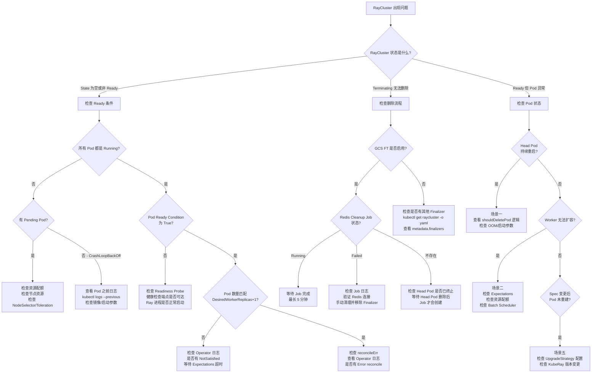
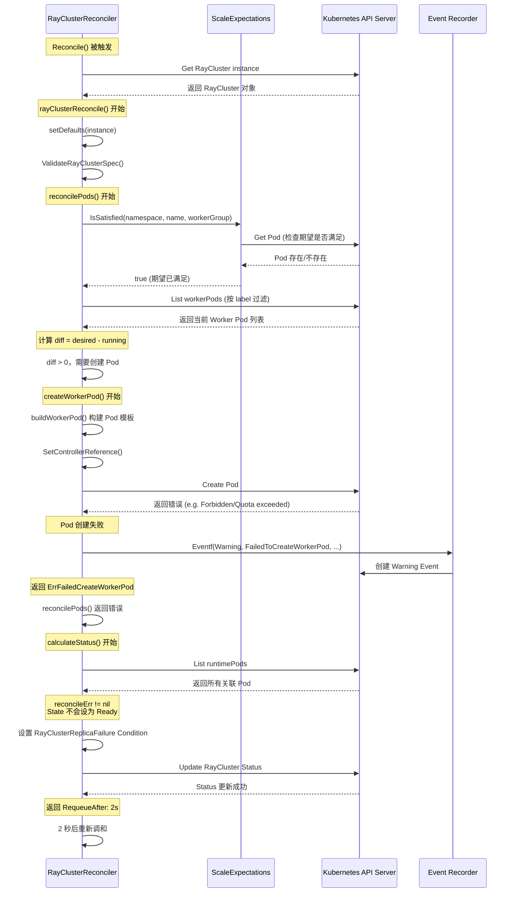

> 本文档基于 KubeRay 源码，深入分析 RayCluster Controller 的 5 个典型调试场景，涵盖代码路径追踪、关键断点设置、Event 解读及常用排查命令。适合需要从源码层面定位 RayCluster 问题的开发者和集群管理员。

---

## 前置知识

| 知识领域 | 说明 |
|----------|------|
| Go 开发环境 | 编译和调试 KubeRay Operator（Go 1.22+） |
| Kubernetes 集群 | Kind 或 Minikube 均可（v1.26+） |
| RayCluster Controller | 建议先阅读 [2.1 调和循环核心流程](01-reconciliation-loop.md) 和 [2.2 Pod 调和](02-pod-reconciliation.md) |
| IDE 调试能力 | VSCode 或 GoLand，支持 Go 远程调试 |

---

## 目录

- [1. 调试环境搭建](#1-调试环境搭建)
  - [1.1 本地开发集群 (Kind/Minikube)](#11-本地开发集群-kindminikube)
  - [1.2 本地运行 Operator](#12-本地运行-operator)
  - [1.3 IDE 调试配置](#13-ide-调试配置)
  - [1.4 常用 kubectl 调试命令](#14-常用-kubectl-调试命令)
- [2. 典型调试场景与代码路径追踪](#2-典型调试场景与代码路径追踪)
  - [场景一 - Head Pod 持续重启](#场景一---head-pod-持续重启)
  - [场景二 - Worker Pod 无法扩容](#场景二---worker-pod-无法扩容)
  - [场景三 - RayCluster 卡在非 Ready 状态](#场景三---raycluster-卡在非-ready-状态)
  - [场景四 - GCS FT Redis Cleanup Job 失败](#场景四---gcs-ft-redis-cleanup-job-失败)
  - [场景五 - Recreate 升级策略不生效](#场景五---recreate-升级策略不生效)
- [3. Event 事件解读指南](#3-event-事件解读指南)
- [4. 关键源码断点推荐](#4-关键源码断点推荐)
- [5. 故障排查决策树](#5-故障排查决策树)
- [6. Pod 创建失败完整调用链](#6-pod-创建失败完整调用链)
- [延伸阅读](#延伸阅读)
- [下一篇](#下一篇)

---

## 1. 调试环境搭建

### 1.1 本地开发集群 (Kind/Minikube)

#### Kind 集群

Kind (Kubernetes IN Docker) 是本地调试 KubeRay 的推荐方式。创建带有多节点的 Kind 集群可以更真实地模拟生产环境。

```yaml
# kind-config.yaml
kind: Cluster
apiVersion: kind.x-k8s.io/v1alpha4
nodes:
  - role: control-plane
  - role: worker
  - role: worker
  - role: worker
```

```bash
# 创建集群
kind create cluster --name kuberay-dev --config kind-config.yaml

# 安装 CRD
cd ray-operator
make install

# 验证 CRD 是否安装成功
kubectl get crd rayclusters.ray.io
```

#### Minikube 集群

```bash
# 启动 minikube，建议分配足够的资源
minikube start --cpus=4 --memory=8192 --driver=docker

# 安装 CRD
cd ray-operator
make install
```

### 1.2 本地运行 Operator

KubeRay Operator 可以在本地以进程方式运行，直接连接到 Kind/Minikube 集群进行调试。

> **注意**：从本地运行 Controller 可能导致部分功能无法正常工作。例如，创建 RayService 时 KubeRay 会向 Ray Head 发送 HTTP 请求（使用 `${HEAD_SVC_FQDN}:52365`），这些地址在集群外部不可达。

```bash
cd ray-operator

# 确保 CRD 已安装
make install

# 本地运行 operator（禁用 leader election）
go run ./main.go -enable-leader-election=false
```

源码位置 `ray-operator/Makefile` (第 116-120 行) 中有相关的说明。

### 1.3 IDE 调试配置

#### GoLand 调试配置

1. 打开 **Run/Debug Configurations**
2. 点击 **+** 添加 **Go Build**
3. 按如下配置：

| 配置项 | 值 |
|--------|-----|
| **Name** | `KubeRay Operator Debug` |
| **Run kind** | `Package` |
| **Package path** | `github.com/ray-project/kuberay/ray-operator` |
| **Working directory** | `<project-root>/ray-operator` |
| **Program arguments** | `-enable-leader-election=false` |
| **Environment** | `KUBECONFIG=~/.kube/config` |

4. 在关键代码处设置断点（参见 [第 4 节](#4-关键源码断点推荐)）
5. 点击 **Debug** 按钮启动

#### VSCode 调试配置

在 `.vscode/launch.json` 中添加以下配置：

```json
{
    "version": "0.2.0",
    "configurations": [
        {
            "name": "Debug KubeRay Operator",
            "type": "go",
            "request": "launch",
            "mode": "auto",
            "program": "${workspaceFolder}/ray-operator/main.go",
            "args": ["-enable-leader-election=false"],
            "env": {
                "KUBECONFIG": "${env:HOME}/.kube/config"
            },
            "cwd": "${workspaceFolder}/ray-operator"
        }
    ]
}
```

### 1.4 常用 kubectl 调试命令

以下是排查 RayCluster 问题时最常用的 kubectl 命令：

```bash
# ==================== 集群级别排查 ====================

# 查看所有 RayCluster 及其状态
kubectl get raycluster -o wide

# 查看 RayCluster 详细信息（包含 Events、Conditions、Status）
kubectl describe raycluster <raycluster-name>

# 以 YAML 格式查看 RayCluster 完整状态
kubectl get raycluster <raycluster-name> -o yaml

# ==================== Pod 级别排查 ====================

# 列出指定 RayCluster 的所有 Pod
kubectl get pods -l ray.io/cluster=<raycluster-name> -o wide

# 仅列出 Head Pod
kubectl get pods -l ray.io/cluster=<raycluster-name>,ray.io/node-type=head

# 仅列出某 worker group 的 Pod
kubectl get pods -l ray.io/cluster=<raycluster-name>,ray.io/group=<group-name>

# 查看 Head Pod 日志
kubectl logs <head-pod-name> -c ray-head

# 查看 Worker Pod 日志
kubectl logs <worker-pod-name> -c ray-worker

# 查看 Pod 之前崩溃的日志（适用于 CrashLoopBackOff）
kubectl logs <pod-name> -c ray-head --previous

# ==================== Event 排查 ====================

# 查看指定 RayCluster 的相关 Events
kubectl get events --field-selector involvedObject.name=<raycluster-name> --sort-by='.lastTimestamp'

# 查看整个 namespace 的 Events（按时间排序）
kubectl get events --sort-by='.lastTimestamp'

# ==================== Service 排查 ====================

# 查看 RayCluster 创建的 Service
kubectl get svc -l ray.io/cluster=<raycluster-name>

# ==================== 资源配额排查 ====================

# 查看当前 namespace 的资源配额
kubectl get resourcequota

# 查看节点资源使用情况
kubectl describe nodes | grep -A 10 "Allocated resources"

# ==================== Operator 日志 ====================

# 查看 KubeRay Operator 日志
kubectl logs -l app.kubernetes.io/name=kuberay-operator -n <operator-namespace> -f

# 过滤特定 RayCluster 的 Operator 日志
kubectl logs -l app.kubernetes.io/name=kuberay-operator -n <operator-namespace> | grep <raycluster-name>
```

---

## 2. 典型调试场景与代码路径追踪

### 场景一 - Head Pod 持续重启

#### 问题表现

Head Pod 反复进入 `CrashLoopBackOff` 或 `Error` 状态，RayCluster 无法达到 `Ready` 状态。Operator 日志中可以看到 `DeletedHeadPod` 事件反复出现。

#### 代码路径追踪

```
Reconcile()
  -> rayClusterReconcile()                          # 第 159 行
    -> reconcilePods()                               # 第 615 行
      -> List headPods                               # 第 669-672 行
      -> IsSatisfied (HeadGroup)                     # 第 685 行
      -> len(headPods.Items) == 1                    # 第 687 行
        -> shouldDeletePod(headPod, HeadNode)        # 第 694 行  <<<< 关键判断
          -> Phase == Failed/Succeeded ?             # 第 1182 行
          -> Phase == Running && 容器已终止 ?          # 第 1191 行
            -> RestartPolicy == Never ?              # 第 1192 行
        -> if shouldDelete:
          -> r.Delete(headPod)                       # 第 697 行
          -> ExpectScalePod(..., Delete)             # 第 703 行
          -> Recorder.Eventf(DeletedHeadPod)         # 第 704 行
      -> len(headPods.Items) == 0                    # 第 709 行
        -> r.createHeadPod()                         # 第 731 行
```

#### 关键函数 `shouldDeletePod` 详解

文件位置: `ray-operator/controllers/ray/raycluster_controller.go` 第 1177-1227 行

```go
func shouldDeletePod(pod corev1.Pod, nodeType rayv1.RayNodeType) (bool, string) {
    // 判断 1: Pod 处于终态 (Failed / Succeeded)
    if pod.Status.Phase == corev1.PodFailed || pod.Status.Phase == corev1.PodSucceeded {
        return true, reason  // -> 删除 Pod
    }

    // 判断 2: Pod Running 但 Ray 容器已终止
    rayContainerTerminated := getRayContainerStateTerminated(pod)
    if pod.Status.Phase == corev1.PodRunning && rayContainerTerminated != nil {
        if pod.Spec.RestartPolicy == corev1.RestartPolicyNever {
            return true, reason   // -> 容器不会自动重启，需删除
        }
        return false, reason      // -> RestartPolicy 为 Always/OnFailure，等待自动重启
    }

    return false, reason  // -> 不需要删除
}
```

`shouldDeletePod` 的判断逻辑可以用下表总结：

| Pod Phase | Ray 容器状态 | RestartPolicy | 是否删除 | 原因说明 |
|-----------|-------------|---------------|---------|---------|
| `Failed` | 任意 | 任意 | **是** | 终态，不可恢复 |
| `Succeeded` | 任意 | 任意 | **是** | 终态，不可恢复 |
| `Running` | Terminated | `Never` | **是** | 容器不会自动重启 |
| `Running` | Terminated | `Always`/`OnFailure` | **否** | 等待 kubelet 自动重启容器 |
| `Running` | Running | 任意 | **否** | 正常运行中 |
| `Pending` | 任意 | 任意 | **否** | 等待调度 |

#### 常见原因及排查

**原因 1: OOM (Out of Memory)**

```bash
# 检查 Pod 终止原因
kubectl describe pod <head-pod> | grep -A 5 "Last State"

# 如果看到 OOMKilled，需要增加内存限制
# 在 RayCluster spec 中调整：
# headGroupSpec.template.spec.containers[0].resources.limits.memory
```

**原因 2: Ray Start 参数错误**

```bash
# 查看 Ray 容器启动命令
kubectl get pod <head-pod> -o jsonpath='{.spec.containers[0].command}'
kubectl get pod <head-pod> -o jsonpath='{.spec.containers[0].args}'

# 查看生成的 ray start 命令环境变量
kubectl exec <head-pod> -- env | grep KUBERAY_GEN_RAY_START_CMD
```

**原因 3: CrashLoopBackOff**

```bash
# 查看之前的崩溃日志
kubectl logs <head-pod> --previous -c ray-head

# 检查容器重启次数
kubectl get pod <head-pod> -o jsonpath='{.status.containerStatuses[0].restartCount}'
```

---

### 场景二 - Worker Pod 无法扩容

#### 问题表现

RayCluster 的 `desiredWorkerReplicas` 大于当前实际运行的 Worker Pod 数量，但新的 Worker Pod 始终无法创建。Operator 日志显示 `NotSatisfiedGroupExpectations`。

#### 代码路径追踪

```
Reconcile()
  -> rayClusterReconcile()                                      # 第 159 行
    -> reconcilePods()                                           # 第 615 行
      -> for _, worker := range instance.Spec.WorkerGroupSpecs  # 第 747 行
        -> IsSatisfied(ctx, namespace, name, groupName)          # 第 748 行  <<<< 关键检查
           |
           | 如果返回 false，则跳过该 group 的调和
           | 日志: "NotSatisfiedGroupExpectations, reconcile the group later"
           |
        -> numExpectedWorkerPods = GetWorkerGroupDesiredReplicas(worker)  # 第 753 行
        -> List workerPods                                       # 第 756-758 行
        -> diff = numExpectedWorkerPods - len(runningPods.Items)  # 第 845 行
        -> if diff > 0:
          -> for i := range diff:
            -> r.createWorkerPod(ctx, instance, worker)          # 第 882 行
```

#### 关键机制 - Scale Expectations

文件位置: `ray-operator/controllers/ray/expectations/scale_expectations.go`

Scale Expectations 是一种防止重复创建/删除 Pod 的保护机制。当 Controller 发出创建或删除 Pod 的请求后，会在 `itemsCache` 中记录一条期望。只有当期望被满足（Pod 实际存在/消失）后，Controller 才会继续对该 group 进行调和。

```go
// 核心超时时间: 30 秒
var ExpectationsTimeout = time.Second * 30

// IsSatisfied 检查所有期望是否已满足
func (r *rayClusterScaleExpectationImpl) IsSatisfied(ctx context.Context,
    namespace, rayClusterName, group string) (isSatisfied bool) {
    items, _ := r.itemsCache.ByIndex(GroupIndex,
        fmt.Sprintf("%s/%s/%s", namespace, rayClusterName, group))
    for i := range items {
        rp := items[i].(*rayPod)
        isPodSatisfied := r.isPodScaled(ctx, rp)
        if !isPodSatisfied {
            return false  // 任一期望未满足，返回 false
        }
        // 删除已满足的期望
        r.itemsCache.Delete(items[i])
    }
    return true
}

// isPodScaled 检查单个 Pod 的期望是否满足
func (r *rayClusterScaleExpectationImpl) isPodScaled(ctx context.Context, rp *rayPod) bool {
    pod := &corev1.Pod{}
    switch rp.action {
    case Create:
        // 如果 Pod 已存在，期望满足
        if err := r.Get(ctx, ...); err == nil {
            return true
        }
        // 超过 30 秒超时，强制认为满足（避免永久阻塞）
        return rp.recordTimestamp.Add(ExpectationsTimeout).Before(time.Now())
    case Delete:
        // 如果 Pod 已不存在（NotFound），期望满足
        if err := r.Get(ctx, ...); err != nil {
            return errors.IsNotFound(err)
        }
    }
    return false
}
```

#### `GetWorkerGroupDesiredReplicas` 函数

文件位置: `ray-operator/controllers/ray/utils/util.go` 第 387-405 行

```go
func GetWorkerGroupDesiredReplicas(workerGroupSpec rayv1.WorkerGroupSpec) int32 {
    // 始终遵循 minReplicas/maxReplicas 约束
    var workerReplicas int32
    minReplicas := ptr.Deref(workerGroupSpec.MinReplicas, int32(0))
    maxReplicas := ptr.Deref(workerGroupSpec.MaxReplicas, int32(math.MaxInt32))

    if workerGroupSpec.Suspend != nil && *workerGroupSpec.Suspend {
        return 0
    }
    if workerGroupSpec.Replicas == nil || *workerGroupSpec.Replicas < minReplicas {
        workerReplicas = minReplicas
    } else if *workerGroupSpec.Replicas > maxReplicas {
        workerReplicas = maxReplicas
    } else {
        workerReplicas = *workerGroupSpec.Replicas
    }
    return workerReplicas * workerGroupSpec.NumOfHosts
}
```

#### 常见原因及排查

**原因 1: Expectations 未满足**

```bash
# 检查 Operator 日志是否有 "NotSatisfiedGroupExpectations" 关键字
kubectl logs -l app.kubernetes.io/name=kuberay-operator -n <ns> | grep "NotSatisfied"

# Expectations 会在 30 秒后超时，耐心等待或检查是否有 Pod 卡在创建中
kubectl get pods -l ray.io/cluster=<name> -o wide --watch
```

**原因 2: 资源配额不足**

```bash
# 检查 ResourceQuota
kubectl get resourcequota -o yaml

# 检查节点可用资源
kubectl describe nodes | grep -A 5 "Allocated resources"

# 检查是否有 Pod 卡在 Pending 状态
kubectl get pods -l ray.io/cluster=<name> --field-selector=status.phase=Pending
```

**原因 3: Batch Scheduler 阻塞**

如果启用了 Volcano 或 Yunikorn 等 batch scheduler，Pod 可能被 PodGroup 阻塞。

```bash
# 检查 PodGroup 状态（Volcano）
kubectl get podgroup -l ray.io/cluster=<name>
kubectl describe podgroup <podgroup-name>

# 检查 Operator 日志中的 batch scheduler 相关错误
kubectl logs -l app.kubernetes.io/name=kuberay-operator -n <ns> | grep -i "scheduler\|podgroup"
```

---

### 场景三 - RayCluster 卡在非 Ready 状态

#### 问题表现

RayCluster 长时间停留在 `""` (空状态) 或其他非 `Ready` 状态，即使 Pod 看起来已经在运行。

#### 代码路径追踪

```
Reconcile()
  -> rayClusterReconcile()                                    # 第 159 行
    -> reconcilePods() / reconcileXxx()...                    # 第 307-317 行
    -> calculateStatus(ctx, instance, reconcileErr)           # 第 328 行  <<<< 核心
      -> List runtimePods                                     # 第 1578-1581 行
      -> CalculateReadyReplicas / CalculateAvailableReplicas  # 第 1583-1584 行
      -> 关键判断 (第 1595-1600 行):
         if reconcileErr == nil
            && len(runtimePods) == DesiredWorkerReplicas + 1
            && CheckAllPodsRunning(ctx, runtimePods)
         then:
            State = Ready
```

#### Ready 状态的三个必要条件

RayCluster 的 State 被设置为 `Ready` 需要同时满足以下三个条件：

```go
// 文件: raycluster_controller.go 第 1595-1600 行
if reconcileErr == nil &&
   len(runtimePods.Items) == int(newInstance.Status.DesiredWorkerReplicas)+1 &&
   utils.CheckAllPodsRunning(ctx, runtimePods) {
    newInstance.Status.State = rayv1.Ready
}
```

| 条件 | 含义 | 常见未满足原因 |
|------|------|---------------|
| `reconcileErr == nil` | 调和过程无错误 | reconcilePods 或其他 reconcile 函数报错 |
| `len(runtimePods) == Desired+1` | Pod 数量匹配（workers + 1 head） | 有 Pod 还在创建中或被删除 |
| `CheckAllPodsRunning` | 所有 Pod Running 且 Ready | Pod 卡在 Pending 或容器未就绪 |

#### `CheckAllPodsRunning` 函数详解

文件位置: `ray-operator/controllers/ray/utils/util.go` 第 585-604 行

```go
func CheckAllPodsRunning(ctx context.Context, runningPods corev1.PodList) bool {
    if len(runningPods.Items) == 0 {
        return false
    }
    for _, pod := range runningPods.Items {
        // 条件 1: 所有 Pod 的 Phase 必须是 Running
        if pod.Status.Phase != corev1.PodRunning {
            return false
        }
        // 条件 2: 所有 Pod 的 Ready Condition 必须为 True
        for _, cond := range pod.Status.Conditions {
            if cond.Type == corev1.PodReady && cond.Status != corev1.ConditionTrue {
                return false
            }
        }
    }
    return true
}
```

#### 常见原因及排查

**原因 1: Pod 卡在 Pending 状态（镜像拉取/节点调度）**

```bash
# 检查 Pending 的 Pod
kubectl get pods -l ray.io/cluster=<name> --field-selector=status.phase=Pending

# 查看 Pending Pod 的详细事件
kubectl describe pod <pending-pod-name>

# 常见的 Event 信息：
# - FailedScheduling: 节点资源不足
# - ImagePullBackOff: 镜像拉取失败
# - Unschedulable: 节点亲和性/污点不匹配
```

**原因 2: Pod Running 但容器未 Ready**

```bash
# 检查 Pod 的 Ready 条件
kubectl get pods -l ray.io/cluster=<name> \
  -o custom-columns='NAME:.metadata.name,READY:.status.conditions[?(@.type=="Ready")].status,PHASE:.status.phase'

# 检查 Readiness Probe 是否失败
kubectl describe pod <pod-name> | grep -A 10 "Readiness"

# Ray Head 的健康检查端点
# - /api/local_raylet_healthz (Raylet 健康检查)
# - /api/gcs_healthz (GCS 健康检查)
```

**原因 3: reconcileErr 不为 nil**

```bash
# 查看 Operator 日志中的错误
kubectl logs -l app.kubernetes.io/name=kuberay-operator -n <ns> | grep "Error reconcile"

# 常见错误来源:
# - reconcileHeadService: Service 创建失败
# - reconcileIngress: Ingress 创建失败
# - reconcilePods: Pod 创建/删除失败
```

---

### 场景四 - GCS FT Redis Cleanup Job 失败

#### 问题表现

删除启用了 GCS 容错的 RayCluster 后，集群无法被彻底删除，停留在 `Terminating` 状态。原因是 Redis Cleanup Job 执行失败，Finalizer 无法被移除。

#### 代码路径追踪

```
Reconcile()
  -> rayClusterReconcile()                                       # 第 159 行
    -> enableGCSFTRedisCleanup 检查                               # 第 205-207 行
    -> instance.DeletionTimestamp 不为零 (正在删除)                 # 第 221 行
      -> deleteAllPods (Head + Worker)                            # 第 229-236 行
      -> 等待 Head Pod 终止                                       # 第 237-245 行
      -> List redisCleanupJobs                                    # 第 247-251 行
      -> if len == 0:
        -> buildRedisCleanupJob(ctx, instance)                    # 第 285 行  <<<< 构建 Job
        -> r.Create(ctx, &redisCleanupJob)                        # 第 286 行
        -> Recorder.Eventf(CreatedRedisCleanupJob)                # 第 296 行
      -> if len != 0:
        -> 检查 Job 完成状态                                       # 第 258 行
        -> if finished && condition == JobComplete:
          -> RemoveFinalizer                                      # 第 259 行
          -> r.Update(ctx, instance)                              # 第 260 行
        -> if finished && condition == JobFailed:
          -> RemoveFinalizer (仍移除，但记录警告)                    # 第 259 行
```

#### 关键函数 `buildRedisCleanupJob` 详解

文件位置: `ray-operator/controllers/ray/raycluster_controller.go` 第 1434-1517 行

该函数基于 Head Pod 模板构建一个 Kubernetes Job，其核心逻辑如下：

```go
func (r *RayClusterReconciler) buildRedisCleanupJob(ctx context.Context,
    instance rayv1.RayCluster) batchv1.Job {
    // 1. 基于 Head Pod 模板构建 Pod
    pod := r.buildHeadPod(ctx, instance)
    pod.Labels[utils.RayNodeTypeLabelKey] = string(rayv1.RedisCleanupNode)

    // 2. 只保留 Ray 容器，替换命令为 Redis 清理脚本
    pod.Spec.Containers = []corev1.Container{pod.Spec.Containers[utils.RayContainerIndex]}
    // 使用 Python 调用 ray._private.gcs_utils.cleanup_redis_storage

    // 3. 禁用探针（Job 不运行 Raylet/GCS 进程）
    pod.Spec.Containers[utils.RayContainerIndex].LivenessProbe = nil
    pod.Spec.Containers[utils.RayContainerIndex].ReadinessProbe = nil

    // 4. 固定资源限制 (200m CPU, 256Mi Memory)，避免使用 GPU
    // 5. RestartPolicy 设为 Never
    // 6. BackoffLimit 设为 0（不重试）
    // 7. ActiveDeadlineSeconds 设为 300（5 分钟超时）
}
```

Redis Cleanup Job 依赖以下环境变量（从 Head Pod 继承）：

| 环境变量 | 用途 |
|---------|------|
| `RAY_REDIS_ADDRESS` | Redis 连接地址 |
| `REDIS_PASSWORD` | Redis 认证密码 |
| `REDIS_USERNAME` | Redis 认证用户名（可选） |
| `RAY_external_storage_namespace` | Redis 中的 storage namespace |

#### 常见原因及排查

**原因 1: Redis 连接失败**

```bash
# 查看 Redis Cleanup Job 日志
kubectl logs job/<raycluster-name>-redis-cleanup

# 检查 Redis 地址是否可达
kubectl run redis-test --rm -it --image=redis:latest -- \
  redis-cli -h <redis-host> -p <redis-port> ping

# 检查 Job 的环境变量
kubectl get job <raycluster-name>-redis-cleanup -o yaml | grep -A 2 "RAY_REDIS_ADDRESS"
```

**原因 2: NetworkPolicy 阻止访问**

```bash
# 检查是否有 NetworkPolicy 限制出站流量
kubectl get networkpolicy

# Redis Cleanup Job 的 Pod 需要能访问 Redis 实例的网络
```

**原因 3: 凭证错误**

```bash
# 验证 Redis 密码是否正确
kubectl get secret <redis-secret-name> -o jsonpath='{.data.password}' | base64 -d
```

**手动恢复**: 如果 Job 持续失败，可以手动清理 Redis 并移除 Finalizer：

```bash
# 手动清理 Redis storage namespace
# (参考 https://docs.ray.io/en/master/cluster/kubernetes/user-guides/kuberay-gcs-ft.html)

# 移除 Finalizer 以释放 RayCluster
kubectl patch raycluster <name> --type=json \
  -p='[{"op": "remove", "path": "/metadata/finalizers"}]'
```

---

### 场景五 - Recreate 升级策略不生效

#### 问题表现

修改了 RayCluster 的 Spec（例如 Ray 镜像版本），期望 Recreate 策略自动重建所有 Pod，但 Pod 没有被重建。

#### 代码路径追踪

```
Reconcile()
  -> rayClusterReconcile()                                       # 第 159 行
    -> reconcilePods()                                           # 第 615 行
      -> GenerateHashWithoutReplicasAndWorkersToDelete           # 第 619 行
      -> shouldRecreatePodsForUpgrade(ctx, instance)             # 第 653 行  <<<< 关键判断
        -> 检查 UpgradeStrategy.Type == "Recreate"               # 第 1130 行
        -> 生成当前 Spec 的 Hash                                  # 第 1134 行
        -> List headPods                                         # 第 1140-1144 行
        -> 检查 KubeRay 版本是否变更                               # 第 1147-1159 行
        -> 比较 head Pod 上的 hash annotation                     # 第 1160-1164 行
           与当前计算出的 hash
      -> if shouldRecreate:
        -> deleteAllPods()                                       # 第 655 行
        -> 清理 ScaleExpectations                                 # 第 661 行
      -> 正常创建 Pod 流程...
```

#### 关键函数 `shouldRecreatePodsForUpgrade` 详解

文件位置: `ray-operator/controllers/ray/raycluster_controller.go` 第 1127-1167 行

```go
func (r *RayClusterReconciler) shouldRecreatePodsForUpgrade(ctx context.Context,
    instance *rayv1.RayCluster) bool {

    // 前置条件: UpgradeStrategy 必须配置为 Recreate
    if instance.Spec.UpgradeStrategy == nil ||
       instance.Spec.UpgradeStrategy.Type == nil ||
       *instance.Spec.UpgradeStrategy.Type != rayv1.RayClusterRecreate {
        return false  // 未配置 Recreate 策略，直接跳过
    }

    // 计算当前 Spec 的 Hash（排除 Replicas 和 WorkersToDelete 字段）
    expectedClusterHash, err := utils.GenerateHashWithoutReplicasAndWorkersToDelete(instance.Spec)

    // 获取当前 Head Pod
    headPods := corev1.PodList{}
    r.List(ctx, &headPods, ...)

    if len(headPods.Items) > 0 {
        headPod := headPods.Items[0]

        // KubeRay 版本变更检测: 如果版本变更，跳过重建
        // （避免升级 KubeRay 本身导致的不必要 Pod 重建）
        podVersion := headPod.Annotations[utils.KubeRayVersion]
        if podVersion != "" && podVersion != utils.KUBERAY_VERSION {
            // 更新 annotation 为新版本的 hash，但不触发重建
            headPod.Annotations[utils.UpgradeStrategyRecreateHashKey] = expectedClusterHash
            headPod.Annotations[utils.KubeRayVersion] = utils.KUBERAY_VERSION
            r.Update(ctx, &headPod)
            return false
        }

        // Hash 比较: 如果 Hash 不同，说明 Spec 发生了变更
        actualHash := headPod.Annotations[utils.UpgradeStrategyRecreateHashKey]
        if actualHash != "" && actualHash != expectedClusterHash {
            return true  // 触发 Recreate
        }
    }
    return false
}
```

涉及的关键 Annotation：

| Annotation Key | 含义 |
|---------------|------|
| `ray.io/upgrade-strategy-recreate-hash` | 存储在 Head Pod 上的 Spec Hash 值 |
| `ray.io/kuberay-version` | 创建 Pod 时的 KubeRay 版本 |

#### 常见原因及排查

**原因 1: 未配置 UpgradeStrategy**

```yaml
# 确保 RayCluster 的 spec 中包含以下配置
apiVersion: ray.io/v1
kind: RayCluster
spec:
  upgradeStrategy:
    type: Recreate     # 必须显式设置
  # ...
```

```bash
# 验证当前配置
kubectl get raycluster <name> -o jsonpath='{.spec.upgradeStrategy}'
```

**原因 2: KubeRay 版本变更导致跳过**

当 KubeRay Operator 本身升级后，第一次调和会检测到版本变更，更新 Head Pod 上的 hash annotation 而不触发重建。这是一个设计上的保护机制，防止 Operator 升级导致不必要的集群中断。

```bash
# 检查 Head Pod 上的 KubeRay 版本 annotation
kubectl get pod <head-pod> -o jsonpath='{.metadata.annotations.ray\.io/kuberay-version}'

# 检查当前 Operator 版本
kubectl logs -l app.kubernetes.io/name=kuberay-operator -n <ns> | head -5
```

**原因 3: Head Pod 不存在（Hash 无法比较）**

如果 Head Pod 还未创建或已被删除，`shouldRecreatePodsForUpgrade` 会返回 `false`，因为没有 head pod 上的 hash 可以比较。

```bash
# 检查是否有 Head Pod 存在
kubectl get pods -l ray.io/cluster=<name>,ray.io/node-type=head

# 查看 Head Pod 的 hash annotation
kubectl get pod <head-pod> -o jsonpath='{.metadata.annotations.ray\.io/upgrade-strategy-recreate-hash}'
```

---

## 3. Event 事件解读指南

KubeRay Operator 通过 Kubernetes Event 记录关键操作和错误。以下是 RayCluster 相关的所有 Event Reason 及其含义。

### 查看 Events 的方法

```bash
# 方法 1: 通过 involvedObject 过滤
kubectl get events --field-selector involvedObject.name=<raycluster-name> \
  --sort-by='.lastTimestamp'

# 方法 2: 通过 describe 查看
kubectl describe raycluster <raycluster-name>

# 方法 3: 以 YAML 格式查看（包含完整信息）
kubectl get events --field-selector involvedObject.name=<raycluster-name> -o yaml
```

### RayCluster 级别 Events

| Event Reason | 类型 | 含义 | 排查方向 |
|-------------|------|------|---------|
| `InvalidRayClusterStatus` | Warning | RayCluster 状态无效 | 检查 Status 字段是否被外部修改 |
| `InvalidRayClusterSpec` | Warning | RayCluster Spec 无效 | 检查 Spec 中的字段值是否合法 |
| `InvalidRayClusterMetadata` | Warning | RayCluster Metadata 无效 | 检查名称长度等 metadata 约束 |

### Head Pod Events

| Event Reason | 类型 | 含义 | 排查方向 |
|-------------|------|------|---------|
| `CreatedHeadPod` | Normal | 成功创建 Head Pod | 正常操作 |
| `FailedToCreateHeadPod` | Warning | 创建 Head Pod 失败 | 检查资源配额/RBAC/镜像 |
| `DeletedHeadPod` | Normal | 删除了 Head Pod | 检查 Pod 终止原因 |
| `FailedToDeleteHeadPod` | Warning | 删除 Head Pod 失败 | 检查 API Server 连通性 |

### Worker Pod Events

| Event Reason | 类型 | 含义 | 排查方向 |
|-------------|------|------|---------|
| `CreatedWorkerPod` | Normal | 成功创建 Worker Pod | 正常操作 |
| `FailedToCreateWorkerPod` | Warning | 创建 Worker Pod 失败 | 检查资源配额/节点亲和性 |
| `DeletedWorkerPod` | Normal | 删除了 Worker Pod | 可能是缩容或健康检查删除 |
| `FailedToDeleteWorkerPod` | Warning | 删除 Worker Pod 失败 | 检查 API Server 连通性 |
| `FailedToDeleteWorkerPodCollection` | Warning | 批量删除 Worker Pod 失败 | 通常发生在 Suspend 场景 |

### Redis Cleanup Job Events

| Event Reason | 类型 | 含义 | 排查方向 |
|-------------|------|------|---------|
| `CreatedRedisCleanupJob` | Normal | 成功创建 Redis Cleanup Job | 正常操作 |
| `FailedToCreateRedisCleanupJob` | Warning | 创建 Redis Cleanup Job 失败 | 检查 RBAC/资源配额 |

### 通用 Pod Events

| Event Reason | 类型 | 含义 | 排查方向 |
|-------------|------|------|---------|
| `DeletedPod` | Normal | 成功删除 Pod（Suspend 场景） | 正常操作 |
| `FailedToDeletePod` | Warning | 删除 Pod 失败 | 检查 API Server 连通性 |
| `FailedToDeletePodCollection` | Warning | 批量删除失败 | 检查 RBAC 权限 |

### Service / Ingress Events

| Event Reason | 类型 | 含义 |
|-------------|------|------|
| `CreatedService` | Normal | 成功创建 Service |
| `FailedToCreateService` | Warning | 创建 Service 失败 |
| `CreatedIngress` | Normal | 成功创建 Ingress |
| `FailedToCreateIngress` | Warning | 创建 Ingress 失败 |
| `CreatedRoute` | Normal | 成功创建 OpenShift Route |
| `FailedToCreateRoute` | Warning | 创建 OpenShift Route 失败 |

> **提示**: Event 的完整定义位于源码文件 `ray-operator/controllers/ray/utils/constant.go` 第 325-417 行。

---

## 4. 关键源码断点推荐

以下断点位置基于文件 `ray-operator/controllers/ray/raycluster_controller.go`，覆盖了 RayCluster 调和流程中最关键的逻辑点。

### 调和主流程

| 行号 | 函数 | 断点用途 |
|------|------|---------|
| **119** | `Reconcile()` | 调和入口，查看请求内容 |
| **159** | `rayClusterReconcile()` | 核心调和逻辑入口 |
| **307-317** | reconcileFuncs 循环 | 查看各子调和函数的执行顺序 |
| **328** | `calculateStatus()` 调用点 | 查看状态计算入参 |

### Pod 调和

| 行号 | 函数 | 断点用途 |
|------|------|---------|
| **615** | `reconcilePods()` | Pod 调和入口 |
| **653** | `shouldRecreatePodsForUpgrade()` 调用 | Recreate 升级检查 |
| **685** | `IsSatisfied (HeadGroup)` | Head Pod Expectations 检查 |
| **694** | `shouldDeletePod (head)` | Head Pod 删除判断 |
| **731** | `createHeadPod()` 调用 | Head Pod 创建 |
| **748** | `IsSatisfied (worker group)` | Worker Expectations 检查 |
| **753** | `GetWorkerGroupDesiredReplicas()` 调用 | Worker 期望副本数计算 |
| **845** | `diff 计算` | Worker 扩缩容差值 |
| **882** | `createWorkerPod()` 调用 | Worker Pod 创建 |

### Pod 删除判断

| 行号 | 函数 | 断点用途 |
|------|------|---------|
| **1177** | `shouldDeletePod()` | Pod 删除判断入口 |
| **1182** | Phase 检查 | 检查 Pod 是否处于终态 |
| **1191** | 容器终止状态检查 | Running + 容器终止 的判断 |

### 状态计算

| 行号 | 函数 | 断点用途 |
|------|------|---------|
| **1548** | `calculateStatus()` | 状态计算入口 |
| **1595** | Ready 状态判断 | 核心: 三条件检查 |

### GCS FT / Redis Cleanup

| 行号 | 函数 | 断点用途 |
|------|------|---------|
| **207** | GCS FT 检查 | Finalizer 添加/处理入口 |
| **285** | `buildRedisCleanupJob()` 调用 | Redis Cleanup Job 创建 |
| **1434** | `buildRedisCleanupJob()` | Job 构建逻辑 |

### Recreate 升级策略

| 行号 | 函数 | 断点用途 |
|------|------|---------|
| **1128** | `shouldRecreatePodsForUpgrade()` | 升级策略检查入口 |
| **1130** | UpgradeStrategy 类型检查 | 检查是否为 Recreate |
| **1147-1159** | KubeRay 版本变更检查 | 版本变更跳过逻辑 |
| **1160-1164** | Hash 比较 | Spec 变更检测 |

### Scale Expectations 关键函数

文件位置: `ray-operator/controllers/ray/expectations/scale_expectations.go`

| 行号 | 函数 | 断点用途 |
|------|------|---------|
| **56** | `ExpectScalePod()` | 记录缩放期望 |
| **73** | `isPodScaled()` | 检查单个 Pod 期望是否满足 |
| **84** | 超时判断 | 30 秒超时逻辑 |
| **93** | `IsSatisfied()` | 检查 group 所有期望是否满足 |

---

## 5. 故障排查决策树



---

## 6. Pod 创建失败完整调用链

以下时序图展示了 Worker Pod 创建失败时的完整调用链，包括 Controller、API Server、Scale Expectations 和 Event Recorder 之间的交互。



---

## 延伸阅读

- [Ray 官方文档 - KubeRay GCS Fault Tolerance](https://docs.ray.io/en/master/cluster/kubernetes/user-guides/kuberay-gcs-ft.html)
- [Ray 官方文档 - KubeRay Troubleshooting](https://docs.ray.io/en/master/cluster/kubernetes/troubleshooting/troubleshooting.html)
- [KubeRay GitHub - RayCluster Controller 源码](https://github.com/ray-project/kuberay/blob/master/ray-operator/controllers/ray/raycluster_controller.go)
- [KubeRay GitHub - Scale Expectations 源码](https://github.com/ray-project/kuberay/blob/master/ray-operator/controllers/ray/expectations/scale_expectations.go)
- [Kubernetes 官方文档 - Pod Lifecycle](https://kubernetes.io/docs/concepts/workloads/pods/pod-lifecycle/)
- [Kubernetes 官方文档 - Container Restart Policy](https://kubernetes.io/docs/concepts/workloads/pods/pod-lifecycle/#restart-policy)

---

## 下一篇

> 继续阅读 Module 3: [RayJob Controller 生命周期管理](../03-rayjob-controller/01-rayjob-lifecycle.md)，了解 RayJob 如何编排 Job 提交、集群管理以及任务完成后的资源清理。
