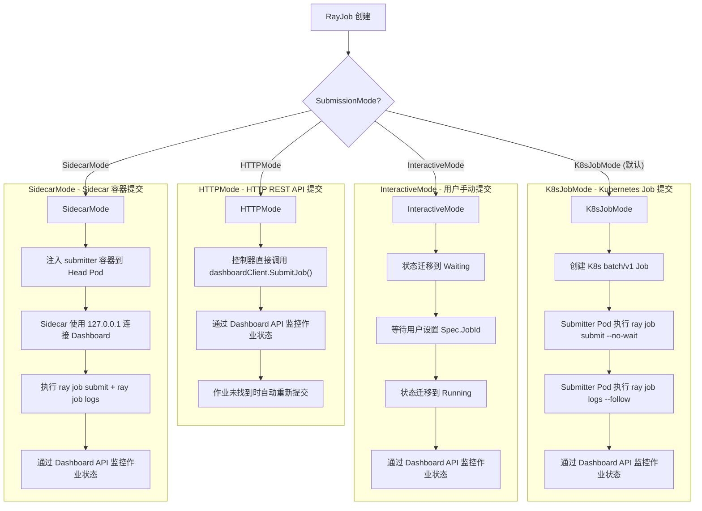
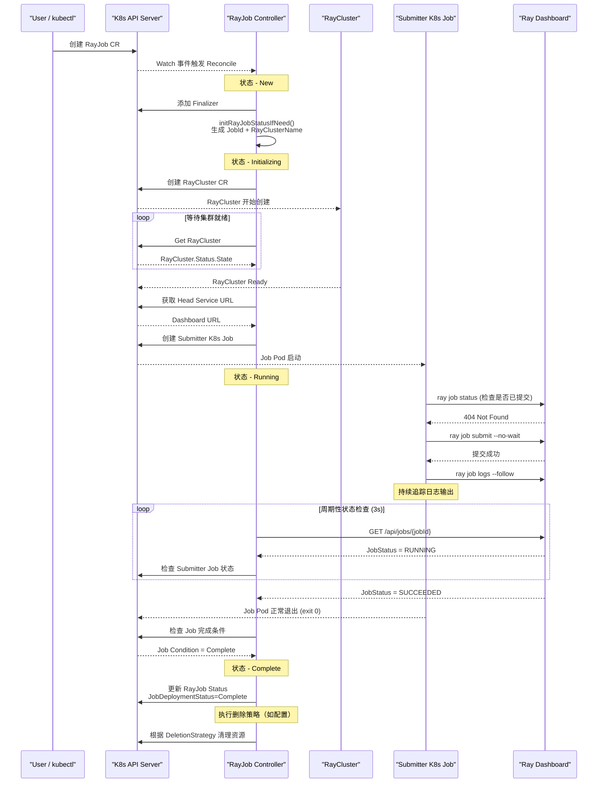
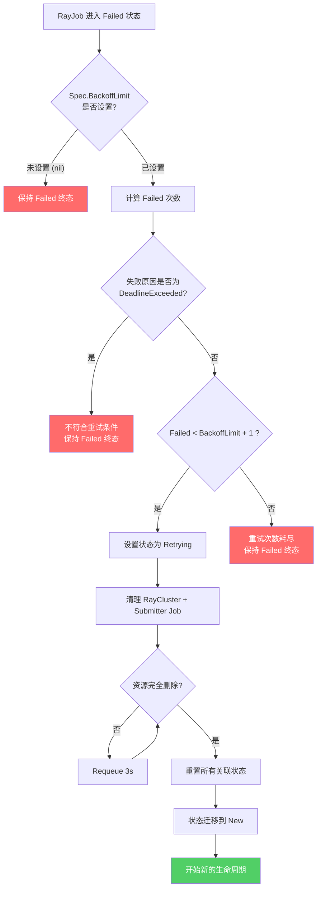
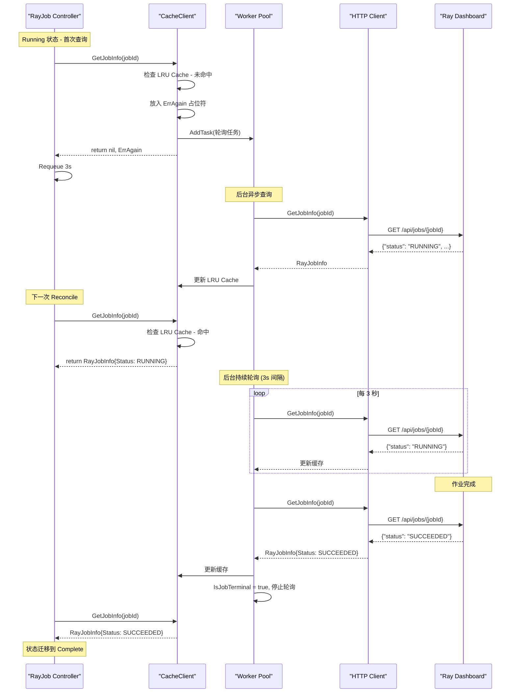

<p align="center">
  
</p>

> 本文基于 KubeRay 源码，对 RayJob Controller 的完整生命周期进行深度剖析。RayJob 是 KubeRay 中用于管理一次性 Ray 作业的核心 CRD，涵盖从集群创建、作业提交、状态监控到资源清理的全链路管理。主要源码文件为 `ray-operator/controllers/ray/rayjob_controller.go`（约 1496 行）。

---

## 目录

- [前置知识](#前置知识)
- [RayJobReconciler 结构体分析](#rayjobreconciler-结构体分析)
- [NewRayJobReconciler 工厂函数](#newrayjobreconciler-工厂函数)
- [JobDeploymentStatus 十种状态详解](#jobdeploymentstatus-十种状态详解)
- [JobDeploymentStatus 完整状态机](#jobdeploymentstatus-完整状态机)
- [四种 SubmissionMode 详解](#四种-submissionmode-详解)
- [K8sJobMode 作业提交完整流程](#k8sjobmode-作业提交完整流程)
- [BackoffLimit 重试机制](#backofflimit-重试机制)
- [ActiveDeadlineSeconds 超时机制](#activedeadlineseconds-超时机制)
- [TransitionGracePeriod 优雅过渡](#transitiongraceperiod-优雅过渡)
- [RayCluster 生命周期管理](#raycluster-生命周期管理)
- [Dashboard Client 交互机制](#dashboard-client-交互机制)
- [Dashboard Client 交互时序](#dashboard-client-交互时序)
- [终态处理与资源清理](#终态处理与资源清理)
- [延伸阅读](#延伸阅读)
- [下一篇](#下一篇)

---

## 前置知识

在阅读本文之前，建议读者具备以下基础知识：

| 知识领域 | 说明 |
|---------|------|
| **Kubernetes Controller 模式** | 理解 Informer / WorkQueue / Reconciler 三层架构 |
| **controller-runtime 框架** | 了解 `manager.Manager`、`client.Client`、`reconcile.Reconciler` 接口 |
| **RayCluster Controller** | 建议先阅读 [RayCluster Controller 调和循环](../02-raycluster-controller/01-reconciliation-loop.md) |
| **Kubernetes Batch Job** | 理解 K8s Job 的 BackoffLimit、CompletionCondition 等概念 |
| **Ray Job Submission API** | 了解 Ray Dashboard 的 REST API，包括 `/api/jobs/` 相关端点 |
| **Finalizer 机制** | 理解 Kubernetes 中 Finalizer 阻止资源删除的原理 |

---

## RayJobReconciler 结构体分析

> 源码位置: `ray-operator/controllers/ray/rayjob_controller.go` L44-56

RayJobReconciler 是 RayJob 控制器的核心结构体，负责调和 RayJob CR 的期望状态与实际状态。

```go
// RayJobReconciler reconciles a RayJob object
type RayJobReconciler struct {
    client.Client
    Recorder            record.EventRecorder
    options             RayJobReconcilerOptions
    Scheme              *runtime.Scheme
    dashboardClientFunc func(rayCluster *rayv1.RayCluster, url string) (dashboardclient.RayDashboardClientInterface, error)
}

type RayJobReconcilerOptions struct {
    RayJobMetricsManager  *metrics.RayJobMetricsManager
    BatchSchedulerManager *batchscheduler.SchedulerManager
}
```

### 字段解析

| 字段 | 类型 | 职责 |
|------|------|------|
| `client.Client` | 嵌入接口 | 通过 controller-runtime 提供的 K8s API 客户端，执行 Get/List/Create/Update/Delete 操作 |
| `Recorder` | `record.EventRecorder` | 事件记录器，用于向 RayJob 资源写入 Kubernetes Events（如创建集群、提交作业等关键事件） |
| `options` | `RayJobReconcilerOptions` | 可选配置项，包含指标管理器和批调度管理器 |
| `Scheme` | `*runtime.Scheme` | K8s 资源 Scheme，用于设置 OwnerReference 等操作 |
| `dashboardClientFunc` | 函数类型 | Dashboard 客户端工厂函数，用于创建与 Ray Dashboard 交互的 HTTP 客户端 |

#### RayJobReconcilerOptions 内部配置

| 选项字段 | 说明 |
|----------|------|
| `RayJobMetricsManager` | 管理 RayJob 相关的 Prometheus 指标，如 `kuberay_job_execution_duration_seconds` |
| `BatchSchedulerManager` | 批调度器管理器，支持 Volcano、Yunikorn 等调度器的集成 |

**关键设计要点**: `dashboardClientFunc` 采用工厂函数模式而非直接持有客户端实例，这样可以根据不同的 RayCluster 实例动态创建对应的 Dashboard 客户端，支持异步查询缓存（`RayDashboardCacheClient`）和直连两种模式。

---

## NewRayJobReconciler 工厂函数

> 源码位置: `ray-operator/controllers/ray/rayjob_controller.go` L59-68

```go
func NewRayJobReconciler(ctx context.Context, mgr manager.Manager, options RayJobReconcilerOptions, provider utils.ClientProvider) *RayJobReconciler {
    dashboardClientFunc := provider.GetDashboardClient(ctx, mgr)
    return &RayJobReconciler{
        Client:              mgr.GetClient(),
        Scheme:              mgr.GetScheme(),
        Recorder:            mgr.GetEventRecorderFor("rayjob-controller"),
        dashboardClientFunc: dashboardClientFunc,
        options:             options,
    }
}
```

工厂函数从 `manager.Manager` 中提取所需依赖，其中 `ClientProvider` 是一个可注入的接口，支持在测试中替换 Dashboard 客户端实现。事件记录器以 `"rayjob-controller"` 作为来源标识，便于在 `kubectl describe rayjob` 中区分事件来源。

### SetupWithManager 资源监听注册

> 源码位置: `ray-operator/controllers/ray/rayjob_controller.go` L817-834

```go
func (r *RayJobReconciler) SetupWithManager(mgr ctrl.Manager, reconcileConcurrency int) error {
    return ctrl.NewControllerManagedBy(mgr).
        For(&rayv1.RayJob{}).
        Owns(&rayv1.RayCluster{}).
        Owns(&corev1.Service{}).
        Owns(&batchv1.Job{}).
        WithOptions(controller.Options{
            MaxConcurrentReconciles: reconcileConcurrency,
            // ...
        }).
        Complete(r)
}
```

RayJob Controller 监听以下资源的变更事件：

| 资源类型 | 监听方式 | 说明 |
|----------|----------|------|
| `RayJob` | `For()` | 主资源，直接触发调和 |
| `RayCluster` | `Owns()` | RayJob 创建的子集群，通过 OwnerReference 关联 |
| `Service` | `Owns()` | Head Service，用于外部访问 Ray Dashboard |
| `Job` (batch/v1) | `Owns()` | K8sJobMode 下的 submitter Job |

---

## JobDeploymentStatus 十种状态详解

RayJob 的生命周期通过 `JobDeploymentStatus` 字段驱动，共定义了 10 种状态。每个状态对应 Reconcile 函数中 `switch` 语句的一个分支。

> 源码位置: `ray-operator/apis/ray/v1/rayjob_types.go` L47-58

```go
const (
    JobDeploymentStatusNew              JobDeploymentStatus = ""
    JobDeploymentStatusInitializing     JobDeploymentStatus = "Initializing"
    JobDeploymentStatusRunning          JobDeploymentStatus = "Running"
    JobDeploymentStatusComplete         JobDeploymentStatus = "Complete"
    JobDeploymentStatusFailed           JobDeploymentStatus = "Failed"
    JobDeploymentStatusValidationFailed JobDeploymentStatus = "ValidationFailed"
    JobDeploymentStatusSuspending       JobDeploymentStatus = "Suspending"
    JobDeploymentStatusSuspended        JobDeploymentStatus = "Suspended"
    JobDeploymentStatusRetrying         JobDeploymentStatus = "Retrying"
    JobDeploymentStatusWaiting          JobDeploymentStatus = "Waiting"
)
```

### 1. New - 新建状态

> 源码位置: `rayjob_controller.go` L174-186

当 RayJob CR 刚被创建时，`JobDeploymentStatus` 为空字符串（即 `New`）。此阶段执行两个关键操作：

1. **添加 Finalizer**: 添加 `ray.io/rayjob-finalizer`，确保在删除 RayJob 时能够优雅地停止 Ray 作业
2. **初始化状态**: 调用 `initRayJobStatusIfNeed()` 生成 JobId、RayClusterName，并将状态迁移至 `Initializing`

```go
case rayv1.JobDeploymentStatusNew:
    if !controllerutil.ContainsFinalizer(rayJobInstance, utils.RayJobStopJobFinalizer) {
        controllerutil.AddFinalizer(rayJobInstance, utils.RayJobStopJobFinalizer)
        if err := r.Update(ctx, rayJobInstance); err != nil {
            return ctrl.Result{RequeueAfter: RayJobDefaultRequeueDuration}, err
        }
    }
    initRayJobStatusIfNeed(ctx, rayJobInstance)
```

### 2. Initializing - 初始化中

> 源码位置: `rayjob_controller.go` L187-240

这是 RayJob 最复杂的中间状态，包含以下步骤（按执行顺序）：

```
1. 检查 suspend 标志 -> 若为 true，迁移到 Suspending
2. 检查 ActiveDeadlineSeconds -> 若超时，迁移到 Failed
3. 执行批调度器逻辑（如 Volcano PodGroup）
4. 获取或创建 RayCluster 实例
5. 等待 RayCluster 状态变为 Ready
6. 获取 Dashboard URL
7. 根据 SubmissionMode 决定下一步操作
   - InteractiveMode -> Waiting
   - K8sJobMode -> 创建 K8s Job, 迁移到 Running
   - HTTPMode/SidecarMode -> 直接迁移到 Running
```

**关键代码片段 - RayCluster 就绪检查**:

```go
if clientURL := rayJobInstance.Status.DashboardURL; clientURL == "" {
    if rayClusterInstance.Status.State != rayv1.Ready {
        logger.Info("Wait for the RayCluster.Status.State to be ready before submitting the job.")
        rayJobInstance.Status.RayClusterStatus = rayClusterInstance.Status
        break  // 退出 switch, 等待下次调和
    }
    // 获取 Dashboard URL
    clientURL, err = utils.FetchHeadServiceURL(ctx, r.Client, rayClusterInstance, utils.DashboardPortName)
    rayJobInstance.Status.DashboardURL = clientURL
}
```

### 3. Waiting - 等待用户提交

> 源码位置: `rayjob_controller.go` L241-248

仅在 `InteractiveMode` 下进入此状态。控制器在此状态下轮询 `Spec.JobId` 字段，等待用户手动将 Ray Job 的 submission ID 填入。

```go
case rayv1.JobDeploymentStatusWaiting:
    if rayJobInstance.Spec.JobId == "" {
        return ctrl.Result{RequeueAfter: RayJobDefaultRequeueDuration}, nil
    }
    rayJobInstance.Status.JobId = rayJobInstance.Spec.JobId
    rayJobInstance.Status.JobDeploymentStatus = rayv1.JobDeploymentStatusRunning
```

**使用场景**: 用户希望通过 Ray Client 或 `ray job submit` CLI 手动提交作业，KubeRay 仅负责集群管理和状态监控。

### 4. Running - 运行中

> 源码位置: `rayjob_controller.go` L249-360

这是 RayJob 的核心运行阶段，执行以下操作链：

```
1. 检查 suspend 标志
2. 检查 ActiveDeadlineSeconds 超时
3. 检查 TransitionGracePeriod
4. 获取 RayCluster 实例
5. 调和 Head Service（reconcileServices）
6. [K8sJobMode/SidecarMode] 检查 submitter 状态
7. 通过 Dashboard Client 查询 Ray Job 状态
8. 根据 JobStatus 判断是否达到终态
   - SUCCEEDED -> Complete
   - FAILED -> Failed
   - 其他 -> 保持 Running
```

**终态判断的精妙设计**:

```go
isJobTerminal := rayv1.IsJobTerminal(jobInfo.JobStatus)
// 对于有 submitter 的模式，需要同时等待 submitter 完成
if utils.HasSubmitter(rayJobInstance) {
    isJobTerminal = isJobTerminal && finishedAt != nil
}
```

在 K8sJobMode 和 SidecarMode 下，仅当 Ray Job 状态达到终态 **且** submitter Pod/Job 已完成时，才认为整个 RayJob 完成。这是因为 submitter 需要等待用户代码执行完毕并收集日志。

### 5. Suspending - 挂起中

> 源码位置: `rayjob_controller.go` L361-400

`Suspending` 是一个原子性的中间状态。无论 `suspend` 标志在此过程中如何变化，都必须完成资源清理后才能迁移到 `Suspended`。

```go
case rayv1.JobDeploymentStatusSuspending, rayv1.JobDeploymentStatusRetrying:
    isClusterDeleted, err := r.deleteClusterResources(ctx, rayJobInstance)
    isJobDeleted, err := r.deleteSubmitterJob(ctx, rayJobInstance)
    if !isClusterDeleted || !isJobDeleted {
        // 等待资源完全删除，避免资源泄漏
        return ctrl.Result{RequeueAfter: RayJobDefaultRequeueDuration}, nil
    }
    // 重置所有关联状态
    rayJobInstance.Status.RayClusterStatus = rayv1.RayClusterStatus{}
    rayJobInstance.Status.RayClusterName = ""
    rayJobInstance.Status.DashboardURL = ""
    rayJobInstance.Status.JobId = ""
    // ...
    if rayJobInstance.Status.JobDeploymentStatus == rayv1.JobDeploymentStatusSuspending {
        rayJobInstance.Status.JobDeploymentStatus = rayv1.JobDeploymentStatusSuspended
    }
```

**原子性保证**: 即使用户在 Suspending 期间将 `suspend` 改回 `false`，控制器仍然会先完成所有资源清理，再迁移到 Suspended。在 Suspended 状态下，控制器检测到 `suspend=false` 后才会重新启动整个生命周期。

### 6. Retrying - 重试中

> 源码位置: `rayjob_controller.go` L361-400（与 Suspending 共享 case 分支）

`Retrying` 与 `Suspending` 共享相同的资源清理逻辑，但最终迁移目标不同：

| 来源状态 | 清理完成后的目标状态 |
|----------|---------------------|
| `Suspending` | `Suspended` |
| `Retrying` | `New`（重新开始整个生命周期） |

```go
if rayJobInstance.Status.JobDeploymentStatus == rayv1.JobDeploymentStatusRetrying {
    rayJobInstance.Status.JobDeploymentStatus = rayv1.JobDeploymentStatusNew
}
```

### 7. Suspended - 已挂起

> 源码位置: `rayjob_controller.go` L401-409

在 `Suspended` 状态下，控制器不会重新入队（`return ctrl.Result{}, nil`），只有当 `suspend` 标志被设置为 `false` 时才会重新进入 `New` 状态。

```go
case rayv1.JobDeploymentStatusSuspended:
    if !rayJobInstance.Spec.Suspend {
        rayJobInstance.Status.JobStatus = rayv1.JobStatusNew
        rayJobInstance.Status.JobDeploymentStatus = rayv1.JobDeploymentStatusNew
        break
    }
    return ctrl.Result{}, nil  // 不重新入队
```

### 8. Complete - 已完成

> 源码位置: `rayjob_controller.go` L410-431

当 Ray Job 成功完成时进入此状态。控制器根据配置的删除策略决定是否清理资源：

- **DeletionRules** (新版): 多规则、多阶段清理
- **Legacy Policy** (旧版): 基于 onSuccess/onFailure 的单次清理
- **ShutdownAfterJobFinishes**: 最早期的布尔开关机制

### 9. Failed - 已失败

> 源码位置: `rayjob_controller.go` L410-431（与 Complete 共享 case 分支）

失败状态与完成状态共享清理逻辑，但 `Failed` 状态还可能触发 BackoffLimit 重试机制（详见后文）。失败原因通过 `Status.Reason` 字段记录：

| Reason | 含义 |
|--------|------|
| `SubmissionFailed` | 作业提交失败（submitter Job 或 Sidecar 容器失败） |
| `DeadlineExceeded` | 超过 ActiveDeadlineSeconds |
| `AppFailed` | Ray 作业本身执行失败（JobStatus=FAILED） |
| `JobDeploymentStatusTransitionGracePeriodExceeded` | JobStatus 达到终态后 JobDeploymentStatus 未能在宽限期内转换 |
| `ValidationFailed` | 验证失败 |

### 10. ValidationFailed - 验证失败

> 源码位置: `rayjob_controller.go` L152-170

这是一个终态，在 Reconcile 主循环之前通过 `validateRayJob()` 函数触发。验证失败后直接更新状态并返回，不再重新入队。

```go
errType, err := validateRayJob(ctx, rayJobInstance)
if err != nil {
    rayJobInstance.Status.JobDeploymentStatus = rayv1.JobDeploymentStatusValidationFailed
    rayJobInstance.Status.Reason = rayv1.ValidationFailed
    rayJobInstance.Status.Message = err.Error()
    if err = r.updateRayJobStatus(ctx, originalRayJobInstance, rayJobInstance); err != nil {
        return ctrl.Result{RequeueAfter: RayJobDefaultRequeueDuration}, err
    }
    return ctrl.Result{}, nil  // 终态，不重新入队
}
```

验证规则包括三个维度：

| 验证维度 | 函数 | 校验内容 |
|----------|------|----------|
| Metadata 验证 | `ValidateRayJobMetadata` | 标签和注解合法性 |
| Spec 验证 | `ValidateRayJobSpec` | 规格配置完整性和一致性 |
| Status 验证 | `ValidateRayJobStatus` | 状态字段合法性 |

---

## JobDeploymentStatus 完整状态机

以下状态图展示了 10 种 JobDeploymentStatus 之间的全部合法转换路径和触发条件：

```mermaid
stateDiagram-v2
    [*] --> New

    New --> Initializing : initRayJobStatusIfNeed()

    Initializing --> Running : 集群就绪 + 作业已提交
    Initializing --> Waiting : InteractiveMode
    Initializing --> Suspending : suspend=true
    Initializing --> Failed : ActiveDeadlineSeconds 超时

    Waiting --> Running : 用户设置 Spec.JobId

    Running --> Complete : JobStatus=SUCCEEDED + submitter 完成
    Running --> Failed : JobStatus=FAILED / submitter 失败 / 超时
    Running --> Suspending : suspend=true

    Suspending --> Suspended : 资源清理完成

    Suspended --> New : suspend=false

    Failed --> Retrying : BackoffLimit 未达上限 + 非 DeadlineExceeded
    Retrying --> New : 资源清理完成

    Complete --> [*]
    Failed --> [*]

    note right of New : Finalizer 添加阶段
    note right of ValidationFailed : 验证失败 - 终态
    note right of Retrying : 与 Suspending 共享清理逻辑

    [*] --> ValidationFailed : validateRayJob() 失败
    ValidationFailed --> [*]
```

### 状态转换汇总表

| 源状态 | 目标状态 | 触发条件 | 代码位置 |
|--------|----------|----------|----------|
| New | Initializing | `initRayJobStatusIfNeed()` | L186 |
| Initializing | Running | 集群 Ready + Dashboard URL 获取成功 + 作业提交完成 | L240 |
| Initializing | Waiting | `SubmissionMode == InteractiveMode` | L229-231 |
| Initializing | Suspending | `Spec.Suspend == true` | L188-190 |
| Initializing | Failed | `ActiveDeadlineSeconds` 超时 | L192-194 |
| Waiting | Running | `Spec.JobId != ""` | L243-248 |
| Running | Complete | `IsJobTerminal(JobStatus) && finishedAt != nil` | L338-343 |
| Running | Failed | submitter 失败 / ActiveDeadline / AppFailed | L275-323 |
| Running | Suspending | `Spec.Suspend == true` | L250-252 |
| Suspending | Suspended | 集群和 Job 资源均已删除 | L395-396 |
| Suspended | New | `Spec.Suspend == false` | L402-406 |
| Failed | Retrying | `Failed < BackoffLimit+1 && Reason != DeadlineExceeded` | L526-538 |
| Retrying | New | 资源清理完成 | L398-399 |
| (任意) | ValidationFailed | `validateRayJob()` 返回错误 | L155-169 |

---

## 四种 SubmissionMode 详解

RayJob 支持四种作业提交模式，通过 `Spec.SubmissionMode` 字段指定：

> 源码位置: `ray-operator/apis/ray/v1/rayjob_types.go` L81-88

```go
const (
    K8sJobMode      JobSubmissionMode = "K8sJobMode"
    HTTPMode        JobSubmissionMode = "HTTPMode"
    InteractiveMode JobSubmissionMode = "InteractiveMode"
    SidecarMode     JobSubmissionMode = "SidecarMode"
)
```



### K8sJobMode（默认模式）

> 核心源码: `ray-operator/controllers/ray/common/job.go` L84-199

K8sJobMode 是默认的提交模式，控制器创建一个 Kubernetes `batch/v1 Job` 作为作业提交器。

**核心命令构建逻辑**:

```bash
# 完整的 shell 命令模板（防止重复提交）
if ! ray job status --address http://$RAY_ADDRESS $JOB_ID >/dev/null 2>&1 ;
then
  ray job submit --address http://$RAY_ADDRESS \
    --submission-id $JOB_ID \
    --no-wait \
    -- python my_script.py ;
fi ;
ray job logs --address http://$RAY_ADDRESS --follow $JOB_ID
```

**防重复提交机制**: 由于 K8s Job 可能会由于 BackoffLimit 重试而多次执行 submitter Pod，KubeRay 通过先检查 `ray job status` 来判断作业是否已提交。如果已提交，则跳过 `ray job submit`，直接执行 `ray job logs --follow` 追踪日志。

**K8s Job 配置细节** (源码: `rayjob_controller.go` L674-715):

```go
job := &batchv1.Job{
    ObjectMeta: metav1.ObjectMeta{
        Name:      rayJobInstance.Name,  // Job 名称与 RayJob 相同
        Namespace: rayJobInstance.Namespace,
        Labels: map[string]string{
            utils.RayOriginatedFromCRNameLabelKey: rayJobInstance.Name,
            utils.RayOriginatedFromCRDLabelKey:    utils.RayOriginatedFromCRDLabelValue(utils.RayJobCRD),
            utils.KubernetesCreatedByLabelKey:     utils.ComponentName,
        },
    },
    Spec: batchv1.JobSpec{
        BackoffLimit: submitterBackoffLimit,  // 默认值为 2
        Template:     submitterTemplate,
    },
}
```

**环境变量注入**:

| 环境变量 | 值 | 用途 |
|----------|------|------|
| `PYTHONUNBUFFERED` | `"1"` | 实时输出 Python 日志 |
| `RAY_DASHBOARD_ADDRESS` | Dashboard URL | submitter 连接 Ray Dashboard 的地址 |
| `RAY_JOB_SUBMISSION_ID` | Job ID | 防重复提交的唯一标识 |

### HTTPMode

HTTPMode 是最轻量级的提交方式。控制器不创建任何额外的 Pod 或 Job，而是直接通过 HTTP REST API 向 Ray Dashboard 提交作业。

> 源码位置: `rayjob_controller.go` L304-312

```go
if rayJobInstance.Spec.SubmissionMode == rayv1.HTTPMode {
    if _, err := rayDashboardClient.SubmitJob(ctx, rayJobInstance); err != nil {
        logger.Error(err, "Failed to submit the Ray job")
        return ctrl.Result{RequeueAfter: RayJobDefaultRequeueDuration}, err
    }
    return ctrl.Result{RequeueAfter: RayJobDefaultRequeueDuration}, nil
}
```

**特别处理**: 当 Dashboard 返回 `BadRequest`（即作业不存在）时，HTTPMode 会自动重新提交。这处理了 RayCluster 重建后作业丢失的情况。

**局限性**: HTTPMode 不会创建 submitter Pod，因此无法通过 K8s 原生方式查看作业提交日志。此外，用户无法为作业提交设置重试策略（因为没有 K8s Job 的 BackoffLimit 机制）。

### InteractiveMode

InteractiveMode 适用于用户通过外部工具（如 Ray Client、Jupyter Notebook）提交作业的场景。

> 源码位置: `rayjob_controller.go` L229-231, L241-248

控制器在 `Initializing` 阶段将状态直接迁移至 `Waiting`，然后周期性地检查 `Spec.JobId` 字段是否被用户设置。一旦设置，即将 `Status.JobId` 同步并迁移到 `Running`。

**工作流程**:

1. 用户创建 RayJob（不设置 `jobId`）
2. 控制器创建 RayCluster，等待就绪
3. 状态迁移到 `Waiting`
4. 用户手动提交 Ray Job 并获取 submission ID
5. 用户通过 `kubectl patch` 设置 `Spec.JobId`
6. 控制器检测到 `JobId` 后迁移到 `Running`，开始监控

### SidecarMode

SidecarMode 将 submitter 容器以 Sidecar 的形式注入到 Head Pod 中，与 Ray Dashboard 共享同一个网络命名空间。

> 源码位置: `rayjob_controller.go` L949-993

```go
if rayJobInstance.Spec.SubmissionMode == rayv1.SidecarMode {
    sidecar, err := getSubmitterContainer(rayJobInstance, rayCluster)
    rayCluster.Spec.HeadGroupSpec.Template.Spec.Containers = append(
        rayCluster.Spec.HeadGroupSpec.Template.Spec.Containers, sidecar)
    // Sidecar 无需重试，设置 RestartPolicy 为 Never
    rayCluster.Spec.HeadGroupSpec.Template.Spec.RestartPolicy = corev1.RestartPolicyNever
}
```

**与 K8sJobMode 的关键区别**:

| 对比维度 | K8sJobMode | SidecarMode |
|----------|-----------|-------------|
| 提交器位置 | 独立的 K8s Job Pod | Head Pod 内的 Sidecar 容器 |
| Dashboard 地址 | 通过 Service DNS 访问 | `127.0.0.1`（本地回环） |
| 重试机制 | K8s Job BackoffLimit | 仅支持 RayJob 级别重试（BackoffLimit） |
| RestartPolicy | 不影响 Head Pod | 设置为 `Never`（避免 Head Pod 重启） |
| 网络可靠性 | 可能受瞬时网络问题影响 | 极高（共享网络命名空间） |
| 防重复提交 | 通过 `ray job status` 检查 | 不需要（Sidecar 不重启） |

**Sidecar 模式的启动等待**: 在 SidecarMode 下，submitter 容器需要等待 Ray Dashboard GCS 健康检查通过后才开始提交作业：

```go
// 源码: common/job.go L128-142
rayDashboardGCSHealthCommand := fmt.Sprintf(
    utils.BaseWgetHealthCommand,
    utils.DefaultReadinessProbeFailureThreshold,
    port,
    utils.RayDashboardGCSHealthPath,
)
waitLoop := []string{
    "until", rayDashboardGCSHealthCommand, ">/dev/null", "2>&1", ";",
    "do", "echo", "\"Waiting for Ray Dashboard GCS to become healthy...\"", ";",
    "sleep", "2", ";", "done", ";",
}
```

---

## K8sJobMode 作业提交完整流程

以下时序图展示了 K8sJobMode 下 RayJob 从创建到完成的完整交互流程：



---

## BackoffLimit 重试机制

> 源码位置: `ray-operator/controllers/ray/rayjob_controller.go` L500-540

BackoffLimit 机制允许失败的 RayJob 自动重试，每次重试会创建一个全新的 RayCluster 实例。



### 核心逻辑解析

```go
func checkBackoffLimitAndUpdateStatusIfNeeded(ctx context.Context, rayJob *rayv1.RayJob) {
    // 1. 统计成功和失败次数
    failedCount := int32(0)
    if rayJob.Status.Failed != nil {
        failedCount = *rayJob.Status.Failed
    }
    if rayJob.Status.JobDeploymentStatus == rayv1.JobDeploymentStatusFailed {
        failedCount++
    }

    // 2. 判断是否可以重试
    if rayJob.Status.JobDeploymentStatus == rayv1.JobDeploymentStatusFailed &&
       rayJob.Spec.BackoffLimit != nil &&
       *rayJob.Status.Failed < *rayJob.Spec.BackoffLimit+1 {
        // 3. DeadlineExceeded 不允许重试
        if rayJob.Status.Reason == rayv1.DeadlineExceeded {
            return
        }
        // 4. 设置为 Retrying
        rayJob.Status.JobDeploymentStatus = rayv1.JobDeploymentStatusRetrying
    }
}
```

**重试条件汇总**:

| 条件 | 说明 |
|------|------|
| `BackoffLimit != nil` | 必须显式设置 BackoffLimit |
| `Failed < BackoffLimit + 1` | 失败次数未达上限（BackoffLimit=2 表示允许最多 3 次执行） |
| `Reason != DeadlineExceeded` | 超时失败不允许重试 |
| `JobDeploymentStatus == Failed` | 必须已经进入 Failed 状态 |

**重要说明**: `checkBackoffLimitAndUpdateStatusIfNeeded` 在 `switch` 语句之后被调用（L436），这意味着它会覆盖 `switch` 中设置的终态。如果从 `Failed` 转为 `Retrying`，后续的状态更新会将 `Retrying` 写入 API Server 而非 `Failed`。

### 重试计数器管理

每次重试循环中，`Status.Failed` 和 `Status.Succeeded` 会被持久化到 RayJob Status 中：

| 字段 | 递增时机 |
|------|----------|
| `Status.Failed` | `JobDeploymentStatus` 变为 `Failed` 时 +1 |
| `Status.Succeeded` | `JobStatus == SUCCEEDED` 且 `JobDeploymentStatus == Complete` 时 +1 |

---

## ActiveDeadlineSeconds 超时机制

> 源码位置: `ray-operator/controllers/ray/rayjob_controller.go` L1144-1155

`ActiveDeadlineSeconds` 提供了一个全局超时机制，防止 RayJob 无限期运行。超时检查在 `Initializing` 和 `Running` 状态中都会执行。

```go
func checkActiveDeadlineAndUpdateStatusIfNeeded(ctx context.Context, rayJob *rayv1.RayJob) bool {
    if rayJob.Spec.ActiveDeadlineSeconds == nil ||
       time.Now().Before(rayJob.Status.StartTime.Add(time.Duration(*rayJob.Spec.ActiveDeadlineSeconds)*time.Second)) {
        return false
    }
    rayJob.Status.JobDeploymentStatus = rayv1.JobDeploymentStatusFailed
    rayJob.Status.Reason = rayv1.DeadlineExceeded
    rayJob.Status.Message = fmt.Sprintf(
        "The RayJob has passed the activeDeadlineSeconds. StartTime: %v. ActiveDeadlineSeconds: %d",
        rayJob.Status.StartTime, *rayJob.Spec.ActiveDeadlineSeconds)
    return true
}
```

**关键特性**:

1. **计时起点**: 从 `Status.StartTime` 开始计算，即 `New -> Initializing` 迁移的时刻（`initRayJobStatusIfNeed` 中设置）
2. **覆盖范围**: 包含集群创建时间 + 作业执行时间
3. **不可重试**: `Reason=DeadlineExceeded` 的失败不参与 BackoffLimit 重试
4. **检查位置**: 在 `Initializing`（L192）和 `Running`（L254）状态中都会检查

---

## TransitionGracePeriod 优雅过渡

> 源码位置: `ray-operator/controllers/ray/rayjob_controller.go` L1182-1210

TransitionGracePeriod 解决的是 JobStatus 已达终态但 JobDeploymentStatus 未能及时转换的异常情况。例如当 RayCluster 在作业运行过程中被意外删除时，submitter 可能无法正常完成。

```go
func checkTransitionGracePeriodAndUpdateStatusIfNeeded(ctx context.Context, rayJob *rayv1.RayJob) bool {
    if rayv1.IsJobTerminal(rayJob.Status.JobStatus) &&
       rayJob.Status.JobDeploymentStatus == rayv1.JobDeploymentStatusRunning {

        rayJobDeploymentGracePeriodTime, err := strconv.Atoi(
            os.Getenv(utils.RAYJOB_DEPLOYMENT_STATUS_TRANSITION_GRACE_PERIOD_SECONDS))
        if err != nil {
            rayJobDeploymentGracePeriodTime = utils.DEFAULT_RAYJOB_DEPLOYMENT_STATUS_TRANSITION_GRACE_PERIOD_SECONDS
            // 默认值: 300 秒（5 分钟）
        }

        if time.Now().Before(rayJob.Status.RayJobStatusInfo.EndTime.Add(
            time.Duration(rayJobDeploymentGracePeriodTime) * time.Second)) {
            return false  // 仍在宽限期内
        }

        // 宽限期已过，强制迁移到终态
        rayJob.Status.JobDeploymentStatus = rayv1.JobDeploymentStatusComplete
        if rayJob.Status.JobStatus == rayv1.JobStatusFailed {
            rayJob.Status.JobDeploymentStatus = rayv1.JobDeploymentStatusFailed
        }
        rayJob.Status.Reason = rayv1.JobDeploymentStatusTransitionGracePeriodExceeded
        return true
    }
    return false
}
```

**配置方式**:

| 配置 | 方式 | 默认值 |
|------|------|--------|
| `RAYJOB_DEPLOYMENT_STATUS_TRANSITION_GRACE_PERIOD_SECONDS` | 环境变量 | 300（秒） |

**SubmitterFinishedTimeout**: 此外还有一个类似机制 `checkSubmitterFinishedTimeoutAndUpdateStatusIfNeeded`（L1157-1180），当 submitter 已完成但 Ray Job 仍未达到终态时，30 秒后强制终止：

```go
const DefaultSubmitterFinishedTimeout = 30 * time.Second
```

---

## RayCluster 生命周期管理

RayJob 控制器管理着 RayCluster 的完整生命周期。本节深入分析三个核心函数。

### initRayJobStatusIfNeed - 状态初始化

> 源码位置: `rayjob_controller.go` L840-870

```go
func initRayJobStatusIfNeed(ctx context.Context, rayJob *rayv1.RayJob) {
    shouldUpdateStatus := rayJob.Status.JobId == "" ||
                         rayJob.Status.RayClusterName == "" ||
                         rayJob.Status.JobStatus == ""
    if !shouldUpdateStatus {
        return
    }

    // 1. 生成或使用指定的 JobId
    if rayJob.Spec.SubmissionMode != rayv1.InteractiveMode && rayJob.Status.JobId == "" {
        if rayJob.Spec.JobId != "" {
            rayJob.Status.JobId = rayJob.Spec.JobId
        } else {
            rayJob.Status.JobId = utils.GenerateRayJobId(rayJob.Name)
        }
    }

    // 2. 确定 RayCluster 名称
    if rayJob.Status.RayClusterName == "" {
        if clusterName := rayJob.Spec.ClusterSelector[utils.RayJobClusterSelectorKey]; clusterName != "" {
            rayJob.Status.RayClusterName = clusterName  // ClusterSelector 模式
        } else {
            rayJob.Status.RayClusterName = utils.GenerateRayClusterName(rayJob.Name)
        }
    }

    // 3. 设置初始 JobStatus 和 StartTime
    rayJob.Status.JobStatus = rayv1.JobStatusNew
    rayJob.Status.JobDeploymentStatus = rayv1.JobDeploymentStatusInitializing
    rayJob.Status.StartTime = &metav1.Time{Time: time.Now()}
}
```

**设计要点**: 所有 ID 和名称在 `New -> Initializing` 迁移时一次性生成并写入 Status。这确保了即使控制器在后续步骤中崩溃重启，重新调和时也不会创建重复的 RayCluster 或提交重复的 Ray Job。

### getOrCreateRayClusterInstance - 获取或创建集群

> 源码位置: `rayjob_controller.go` L899-947

```go
func (r *RayJobReconciler) getOrCreateRayClusterInstance(ctx context.Context, rayJobInstance *rayv1.RayJob) (*rayv1.RayCluster, error) {
    rayClusterNamespacedName := common.RayJobRayClusterNamespacedName(rayJobInstance)

    rayClusterInstance := &rayv1.RayCluster{}
    if err := r.Get(ctx, rayClusterNamespacedName, rayClusterInstance); err != nil {
        if errors.IsNotFound(err) {
            // ClusterSelector 模式: 集群必须已存在
            if len(rayJobInstance.Spec.ClusterSelector) != 0 {
                return nil, fmt.Errorf("clusterSelector mode, but RayCluster not found")
            }
            // 正常模式: 创建新集群
            rayClusterInstance, err = r.constructRayClusterForRayJob(rayJobInstance, rayClusterNamespacedName.Name)
            if err := r.Create(ctx, rayClusterInstance); err != nil {
                return nil, err
            }
        }
    }
    return rayClusterInstance, nil
}
```

**ClusterSelector 模式**: 通过 `Spec.ClusterSelector` 字段，RayJob 可以复用一个已存在的 RayCluster，而不是创建新的。此时控制器仅查找集群，不会创建或修改它。

### constructRayClusterForRayJob - 构建集群规格

> 源码位置: `rayjob_controller.go` L949-993

此函数从 RayJob 的 `RayClusterSpec` 字段构建出完整的 RayCluster 对象，主要工作包括：

1. **标签传递**: 将 RayJob 的标签复制到 RayCluster，并添加溯源标签
2. **注解传递**: 复制注解，SidecarMode 下额外添加禁止 Head Pod 重启的注解
3. **OwnerReference**: 设置 RayJob 为 RayCluster 的 Owner，实现级联删除
4. **Sidecar 注入**: SidecarMode 下注入 submitter 容器，设置 `RestartPolicy=Never`

```go
labels[utils.RayOriginatedFromCRNameLabelKey] = rayJobInstance.Name
labels[utils.RayOriginatedFromCRDLabelKey] = utils.RayOriginatedFromCRDLabelValue(utils.RayJobCRD)
labels[utils.RayJobSubmissionModeLabelKey] = string(rayJobInstance.Spec.SubmissionMode)

if rayJobInstance.Spec.SubmissionMode == rayv1.SidecarMode {
    annotations[utils.DisableProvisionedHeadRestartAnnotationKey] = "true"
}
```

---

## Dashboard Client 交互机制

RayJob Controller 通过 Dashboard Client 与 Ray Dashboard 进行 HTTP 交互，实现作业提交、状态查询和作业停止等操作。

### 接口定义

> 源码位置: `ray-operator/controllers/ray/utils/dashboardclient/dashboard_httpclient.go` L29-41

```go
type RayDashboardClientInterface interface {
    UpdateDeployments(ctx context.Context, configJson []byte) error
    GetServeDetails(ctx context.Context) (*utiltypes.ServeDetails, error)
    GetMultiApplicationStatus(context.Context) (map[string]*utiltypes.ServeApplicationStatus, error)
    GetJobInfo(ctx context.Context, jobId string) (*utiltypes.RayJobInfo, error)
    ListJobs(ctx context.Context) (*[]utiltypes.RayJobInfo, error)
    SubmitJob(ctx context.Context, rayJob *rayv1.RayJob) (string, error)
    SubmitJobReq(ctx context.Context, request *utiltypes.RayJobRequest) (string, error)
    GetJobLog(ctx context.Context, jobName string) (*string, error)
    StopJob(ctx context.Context, jobName string) error
    DeleteJob(ctx context.Context, jobName string) error
}
```

### API 端点映射

| 接口方法 | HTTP 方法 | URL 路径 | 说明 |
|----------|-----------|----------|------|
| `GetJobInfo` | GET | `/api/jobs/{jobId}` | 查询指定作业的状态信息 |
| `SubmitJob` | POST | `/api/jobs/` | 提交新的 Ray 作业 |
| `StopJob` | POST | `/api/jobs/{jobId}/stop` | 停止运行中的作业 |
| `DeleteJob` | DELETE | `/api/jobs/{jobId}` | 删除作业记录 |
| `GetJobLog` | GET | `/api/jobs/{jobId}/logs` | 获取作业日志 |
| `ListJobs` | GET | `/api/jobs/` | 列出所有作业 |
| `UpdateDeployments` | PUT | `/api/serve/applications/` | 更新 Serve 部署（RayService 使用） |
| `GetServeDetails` | GET | `/api/serve/applications/?api_type=declarative` | 获取 Serve 应用详情 |

### 认证机制

Dashboard Client 支持通过 `x-ray-authorization` Header 传递 Bearer Token：

```go
func (r *RayDashboardClient) setAuthHeader(req *http.Request) {
    if r.authToken != "" {
        req.Header.Set("x-ray-authorization", fmt.Sprintf("Bearer %s", r.authToken))
    }
}
```

### 异步查询缓存 - RayDashboardCacheClient

> 源码位置: `ray-operator/controllers/ray/utils/dashboardclient/dashboard_cache_client.go`

当 `AsyncJobInfoQuery` Feature Gate 启用时，控制器使用 `RayDashboardCacheClient` 包装器来优化 Dashboard 查询性能。

**核心设计**:

| 组件 | 说明 |
|------|------|
| Worker Pool | 8 个后台 goroutine，以 3 秒间隔轮询作业状态 |
| LRU Cache | 容量 10000，过期时间 10 分钟 |
| `ErrAgain` 机制 | 首次查询返回 `ErrAgain`，通知调用方稍后重试 |

**工作流程**:

1. 首次调用 `GetJobInfo` 时，放入占位符（`ErrAgain`），启动后台 Task
2. 后台 Task 周期性调用底层 `GetJobInfo`，更新缓存
3. 后续调用直接从缓存读取
4. 当 JobStatus 达到终态时，停止后台轮询
5. `StopJob`/`DeleteJob` 时清除缓存条目

---

## Dashboard Client 交互时序

以下时序图展示了 Dashboard Client 在作业提交和监控过程中的详细交互：



---

## 终态处理与资源清理

当 RayJob 达到终态（`Complete` 或 `Failed`）后，控制器根据配置策略执行资源清理。

> 源码位置: `rayjob_controller.go` L410-431

### 清理策略优先级

```go
case rayv1.JobDeploymentStatusComplete, rayv1.JobDeploymentStatusFailed:
    // 1. ClusterSelector 模式不删除集群
    if len(rayJobInstance.Spec.ClusterSelector) > 0 {
        return ctrl.Result{}, nil
    }

    // 2. 新版 DeletionRules（Feature Gate: RayJobDeletionPolicy）
    if features.Enabled(features.RayJobDeletionPolicy) && rayJobInstance.Spec.DeletionStrategy != nil {
        if rayJobInstance.Spec.DeletionStrategy.DeletionRules != nil {
            return r.handleDeletionRules(ctx, rayJobInstance)
        }
        return r.handleLegacyDeletionPolicy(ctx, rayJobInstance)
    }

    // 3. 旧版 ShutdownAfterJobFinishes
    if rayJobInstance.Spec.ShutdownAfterJobFinishes {
        return r.handleShutdownAfterJobFinishes(ctx, rayJobInstance)
    }

    // 4. 默认: 不清理
    return ctrl.Result{}, nil
```

### DeletionPolicyType 删除策略

| 策略 | 影响级别 | 行为 |
|------|----------|------|
| `DeleteNone` | 1 (最低) | 不执行任何删除操作 |
| `DeleteWorkers` | 2 | 挂起所有 Worker Group（设置 `suspend=true`） |
| `DeleteCluster` | 3 | 删除整个 RayCluster 自定义资源 |
| `DeleteSelf` | 4 (最高) | 删除 RayJob 自身（及所有级联资源） |

**多规则冲突解决**: 当多个 DeletionRule 同时到期时（例如控制器长时间不可用后恢复），控制器选择影响力最大的规则优先执行：

```go
// 源码: rayjob_controller.go L1475-1490
func selectMostImpactfulRule(rules []rayv1.DeletionRule) rayv1.DeletionRule {
    order := map[rayv1.DeletionPolicyType]int{
        rayv1.DeleteSelf:    4,
        rayv1.DeleteCluster: 3,
        rayv1.DeleteWorkers: 2,
        rayv1.DeleteNone:    1,
    }
    mostImpactfulRule := rules[0]
    for _, rule := range rules[1:] {
        if order[rule.Policy] > order[mostImpactfulRule.Policy] {
            mostImpactfulRule = rule
        }
    }
    return mostImpactfulRule
}
```

### Finalizer 清理流程

当 RayJob 被删除时（`DeletionTimestamp` 非零），Finalizer 确保 Ray 作业被正确停止：

> 源码位置: `rayjob_controller.go` L113-147

```
1. 检测到 DeletionTimestamp 非零
2. 如果 JobStatus 不在终态:
   a. 获取 RayCluster 实例
   b. 创建 Dashboard Client
   c. 调用 StopJob(jobId) 停止 Ray 作业
3. 无论 StopJob 是否成功，移除 Finalizer
4. 更新 RayJob 资源
```

**容错设计**: 即使 `StopJob()` 调用失败（如集群已经被删除），Finalizer 仍然会被移除，避免 RayJob 永远无法被删除。

---

## 延伸阅读

- [KubeRay 整体架构概览](../01-architecture-overview/02-overall-architecture.md) - 理解 KubeRay 的整体设计理念和组件关系
- [CRD API 设计](../01-architecture-overview/03-crd-api-design.md) - RayJob、RayCluster、RayService 三大 CRD 的 API 设计原则
- [RayCluster Controller 调和循环](../02-raycluster-controller/01-reconciliation-loop.md) - RayCluster 控制器的核心调和逻辑
- [RayCluster Pod 调和](../02-raycluster-controller/02-pod-reconciliation.md) - Head/Worker Pod 的创建和管理机制
- [RayCluster 状态计算](../02-raycluster-controller/03-status-calculation.md) - RayCluster Status 的计算和更新规则
- [Ray Job Submission REST API](https://docs.ray.io/en/latest/cluster/running-applications/job-submission/rest.html) - Ray 官方 Job Submission API 文档
- [KubeRay RayJob 用户指南](https://docs.ray.io/en/latest/cluster/kubernetes/getting-started/rayjob-quick-start.html) - RayJob 快速入门指南

---

## 下一篇

> **[3.2 - 删除策略与清理机制](02-deletion-strategy.md)**
>
> 下一篇将深入分析 RayJob 的删除策略，包括 Legacy 模式与 Rules 模式的工作原理、多规则优先级处理以及 CRD XValidation 互斥验证。

---

*本文档基于 KubeRay 主分支源码编写。如有疏漏或更新，欢迎提交 Issue 或 PR。*
