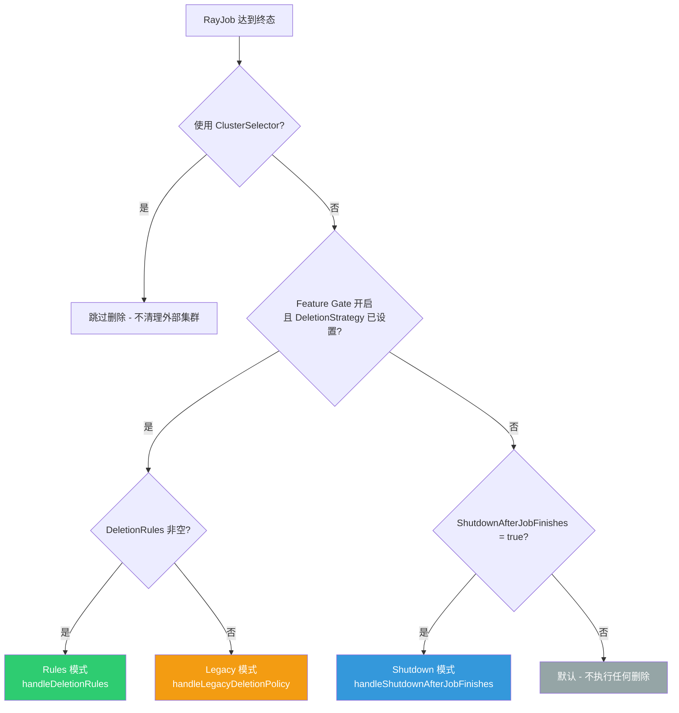
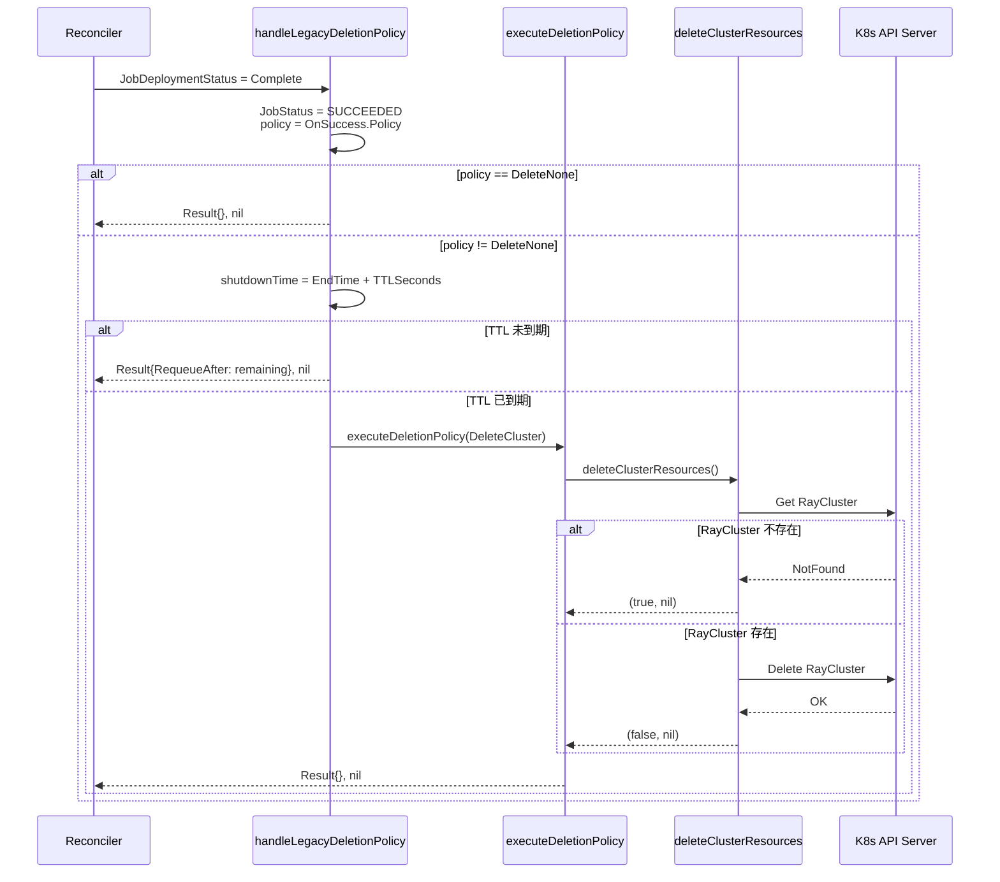
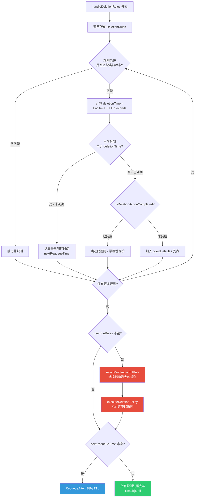
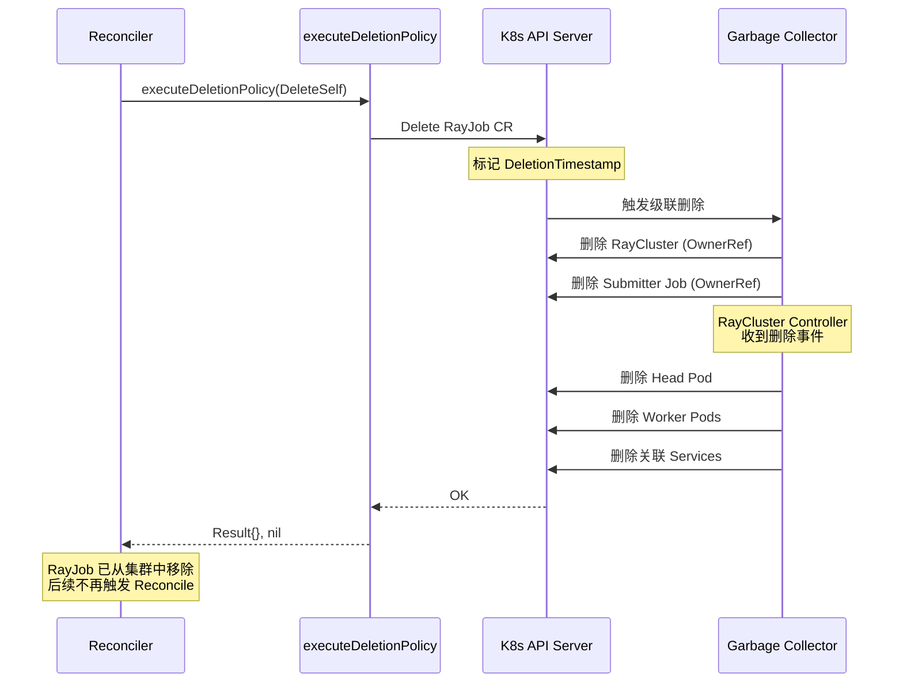
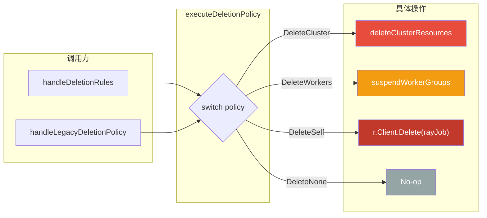
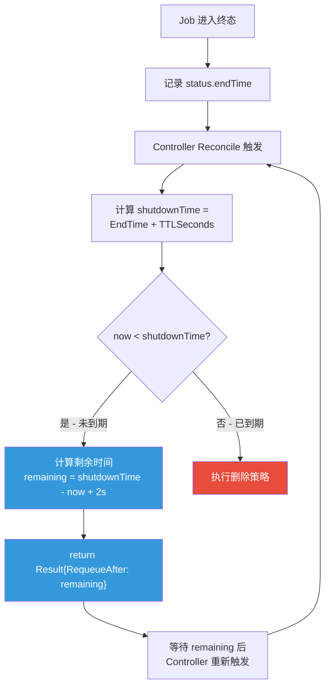
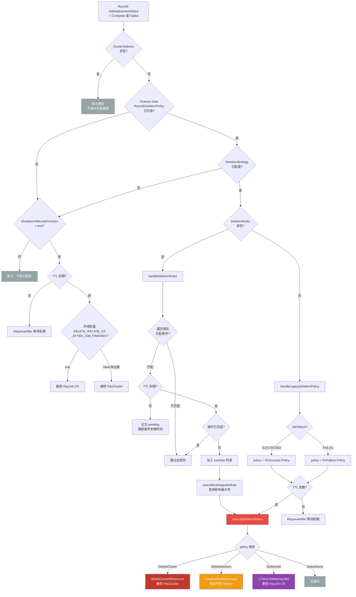

-yellow?style=flat-square)

> 本文基于 KubeRay 源码，对 RayJob Controller 中的删除策略 (DeletionStrategy) 与清理机制进行系统性深度剖析。核心源码文件为 `ray-operator/controllers/ray/rayjob_controller.go`，API 类型定义位于 `ray-operator/apis/ray/v1/rayjob_types.go`。

---

## 目录

- [前置知识](#前置知识)
- [删除策略概览](#删除策略概览)
- [决策入口 - 终态分支逻辑](#决策入口---终态分支逻辑)
- [Legacy 模式详解](#legacy-模式详解)
  - [ShutdownAfterJobFinishes 机制](#shutdownafterjobfinishes-机制)
  - [OnSuccess / OnFailure 策略](#onsuccess--onfailure-策略)
- [Rules 模式详解 - DeletionRules](#rules-模式详解---deletionrules)
  - [DeletionRule 数据结构](#deletionrule-数据结构)
  - [handleDeletionRules 核心逻辑](#handledeletionrules-核心逻辑)
  - [影响力优先级选择](#影响力优先级选择)
- [DeletionPolicyType 四种策略详解](#deletionpolicytype-四种策略详解)
  - [DeleteCluster - 删除集群](#deletecluster---删除集群)
  - [DeleteWorkers - 挂起 Worker 节点](#deleteworkers---挂起-worker-节点)
  - [DeleteSelf - 删除 RayJob 自身](#deleteself---删除-rayjob-自身)
  - [DeleteNone - 不执行清理](#deletenone---不执行清理)
- [executeDeletionPolicy 统一执行入口](#executedeletionpolicy-统一执行入口)
- [TTL 延迟删除机制](#ttl-延迟删除机制)
- [CRD XValidation 互斥验证](#crd-xvalidation-互斥验证)
- [删除操作的幂等性保障](#删除操作的幂等性保障)
- [完整删除决策流程图](#完整删除决策流程图)
- [延伸阅读](#延伸阅读)
- [下一篇](#下一篇)

---

## 前置知识

在阅读本文之前，建议读者具备以下基础知识：

| 知识领域 | 说明 |
|---------|------|
| **Kubernetes Feature Gate** | 理解 Alpha / Beta / GA 三阶段特性开关机制 |
| **CRD Validation (CEL)** | 了解 `+kubebuilder:validation:XValidation` 通过 CEL 表达式在 admission 阶段进行校验 |
| **controller-runtime Reconciler** | 理解 `ctrl.Result` 中 `RequeueAfter` 的延迟重新入队语义 |
| **Owner Reference 级联删除** | 理解 RayJob -> RayCluster 的 OwnerReference 关系及删除传播 |
| **RayJob 生命周期** | 了解 `JobDeploymentStatus` 的状态机（参考 [CRD API 设计](../01-architecture-overview/03-crd-api-design.md)） |

---

## 删除策略概览

RayJob 的删除策略决定了当 Job 达到终态（`Complete` 或 `Failed`）后，如何清理关联的 Kubernetes 资源。KubeRay 提供了三层机制，按引入时间从早到晚排列：

| 机制 | Feature Gate | 引入版本 | 状态 | 说明 |
|------|-------------|---------|------|------|
| `ShutdownAfterJobFinishes` | 无 | 早期 | 稳定 | 最原始的布尔开关，TTL 后删除 RayCluster |
| `DeletionStrategy.OnSuccess/OnFailure` | `RayJobDeletionPolicy` | v1.3 Alpha | 已废弃 (计划 v1.6 移除) | Legacy 模式，按成功/失败分别配置策略 |
| `DeletionStrategy.DeletionRules` | `RayJobDeletionPolicy` | v1.3+ | 推荐 | Rules 模式，多规则、多条件、独立 TTL |

> **关键约束**: Legacy 模式 (`OnSuccess`/`OnFailure`) 和 Rules 模式 (`DeletionRules`) **互斥**，通过 CRD XValidation 在 admission 阶段强制校验。

三种机制的整体关系如下：



---

## 决策入口 - 终态分支逻辑

> 源码位置: `ray-operator/controllers/ray/rayjob_controller.go` 第 410-431 行

当 `JobDeploymentStatus` 进入 `Complete` 或 `Failed` 状态时，Controller 进入终态处理分支。决策逻辑严格按照以下优先级从高到低执行：

```go
case rayv1.JobDeploymentStatusComplete, rayv1.JobDeploymentStatusFailed:
    // 优先级 1: ClusterSelector 引用外部集群，绝不删除
    if len(rayJobInstance.Spec.ClusterSelector) > 0 {
        logger.Info("RayJob is using an existing RayCluster via clusterSelector; skipping resource deletion.",
            "RayClusterSelector", rayJobInstance.Spec.ClusterSelector)
        return ctrl.Result{}, nil
    }

    // 优先级 2: Feature Gate 开启 + DeletionStrategy 已配置
    if features.Enabled(features.RayJobDeletionPolicy) && rayJobInstance.Spec.DeletionStrategy != nil {
        if rayJobInstance.Spec.DeletionStrategy.DeletionRules != nil {
            return r.handleDeletionRules(ctx, rayJobInstance)       // Rules 模式
        }
        return r.handleLegacyDeletionPolicy(ctx, rayJobInstance)    // Legacy 模式
    }

    // 优先级 3: ShutdownAfterJobFinishes 布尔开关
    if rayJobInstance.Spec.ShutdownAfterJobFinishes {
        return r.handleShutdownAfterJobFinishes(ctx, rayJobInstance)
    }

    // 优先级 4: 默认不执行任何删除
    return ctrl.Result{}, nil
```

**设计要点分析**:

1. **ClusterSelector 最高优先级**: 当 RayJob 通过 `clusterSelector` 引用已有 RayCluster 时，该集群不属于本 RayJob 管理，**绝不执行任何删除操作**。
2. **Feature Gate 防护**: `DeletionStrategy` 字段必须在 `RayJobDeletionPolicy` Feature Gate 开启时才生效，确保 Alpha 功能不会意外触发。
3. **互斥分支**: `DeletionRules` 非空时走 Rules 模式，否则走 Legacy 模式。两者不会同时配置（由 CRD XValidation 保证）。
4. **向后兼容**: 未配置 `DeletionStrategy` 的 RayJob 仍然可以使用最原始的 `ShutdownAfterJobFinishes` 机制。

---

## Legacy 模式详解

### ShutdownAfterJobFinishes 机制

> 源码位置: `ray-operator/controllers/ray/rayjob_controller.go` 第 1330-1372 行

这是 KubeRay 最早引入的删除机制，通过一个简单的布尔字段控制。

**Spec 字段定义** (来自 `ray-operator/apis/ray/v1/rayjob_types.go` 第 278-285 行):

```go
// TTLSecondsAfterFinished is the TTL to clean up RayCluster.
// It's only working when ShutdownAfterJobFinishes set to true.
TTLSecondsAfterFinished int32 `json:"ttlSecondsAfterFinished,omitempty"`
// ShutdownAfterJobFinishes will determine whether to delete the ray cluster
// once rayJob succeed or failed.
ShutdownAfterJobFinishes bool `json:"shutdownAfterJobFinishes,omitempty"`
```

**核心实现**:

```go
func (r *RayJobReconciler) handleShutdownAfterJobFinishes(ctx context.Context, rayJob *rayv1.RayJob) (ctrl.Result, error) {
    nowTime := time.Now()
    ttlSeconds := rayJob.Spec.TTLSecondsAfterFinished
    shutdownTime := rayJob.Status.EndTime.Add(time.Duration(ttlSeconds) * time.Second)

    // TTL 未到期，延迟重新入队
    if shutdownTime.After(nowTime) {
        requeueAfter := requeueDelayFor(shutdownTime)
        return ctrl.Result{RequeueAfter: requeueAfter}, nil
    }

    // 环境变量控制: 是否删除 RayJob CR 本身
    if s := os.Getenv(utils.DELETE_RAYJOB_CR_AFTER_JOB_FINISHES); strings.ToLower(s) == "true" {
        err = r.Client.Delete(ctx, rayJob)
    } else {
        // 默认只删除 RayCluster，保留 RayJob CR 和 Submitter Job（用户可查看日志）
        _, err = r.deleteClusterResources(ctx, rayJob)
    }
    return ctrl.Result{}, nil
}
```

**行为总结**:

| 条件 | 行为 |
|------|------|
| TTL 未到期 | 延迟重新入队，等待 TTL 过期 |
| TTL 已到期 + 环境变量 `DELETE_RAYJOB_CR_AFTER_JOB_FINISHES=true` | 删除 RayJob CR 本身（级联删除所有子资源） |
| TTL 已到期 + 无环境变量 | 仅删除 RayCluster，保留 RayJob CR 和 Submitter K8s Job |

> **注意**: 保留 Submitter K8s Job 的原因是让用户仍然可以通过 `kubectl logs` 查看 Ray Job 的 Driver 日志。已完成的 K8s Job 不消耗计算资源。

---

### OnSuccess / OnFailure 策略

> 源码位置: `ray-operator/controllers/ray/rayjob_controller.go` 第 1286-1328 行

Legacy 模式下的 `OnSuccess` / `OnFailure` 策略允许用户针对不同的终态分别指定清理策略。

**API 类型定义** (来自 `ray-operator/apis/ray/v1/rayjob_types.go` 第 109-129 行):

```go
type DeletionStrategy struct {
    // Deprecated: Use `deletionRules` instead. Will be removed in release 1.6.0.
    OnSuccess *DeletionPolicy `json:"onSuccess,omitempty"`
    OnFailure *DeletionPolicy `json:"onFailure,omitempty"`
    DeletionRules []DeletionRule `json:"deletionRules,omitempty"`
}

type DeletionPolicy struct {
    Policy *DeletionPolicyType `json:"policy,omitempty"`
}
```

**核心实现**:

```go
func (r *RayJobReconciler) handleLegacyDeletionPolicy(ctx context.Context, rayJob *rayv1.RayJob) (ctrl.Result, error) {
    var policy rayv1.DeletionPolicyType
    switch rayJob.Status.JobStatus {
    case rayv1.JobStatusSucceeded:
        policy = *rayJob.Spec.DeletionStrategy.OnSuccess.Policy
    case rayv1.JobStatusFailed:
        policy = *rayJob.Spec.DeletionStrategy.OnFailure.Policy
    default:
        // JobStatus 不匹配，不执行任何操作
        return ctrl.Result{}, nil
    }

    if policy == rayv1.DeleteNone {
        return ctrl.Result{}, nil
    }

    // Legacy 策略使用顶层 TTLSecondsAfterFinished 字段
    ttlSeconds := rayJob.Spec.TTLSecondsAfterFinished
    shutdownTime := rayJob.Status.EndTime.Add(time.Duration(ttlSeconds) * time.Second)

    if shutdownTime.After(nowTime) {
        requeueAfter := requeueDelayFor(shutdownTime)
        return ctrl.Result{RequeueAfter: requeueAfter}, nil
    }

    return r.executeDeletionPolicy(ctx, rayJob, policy)
}
```

**与 ShutdownAfterJobFinishes 的区别**:

| 维度 | ShutdownAfterJobFinishes | OnSuccess / OnFailure |
|------|--------------------------|----------------------|
| 策略粒度 | 统一行为（删除 RayCluster） | 按成功/失败分别配置 |
| 可选操作 | 删除 RayCluster 或删除 RayJob | 四种策略均可选 |
| TTL 来源 | `TTLSecondsAfterFinished` | `TTLSecondsAfterFinished`（复用同一字段） |
| Feature Gate | 无需 | 需要 `RayJobDeletionPolicy` |
| 状态 | 稳定 | 已废弃（计划 v1.6 移除） |

以下时序图展示了 Legacy `OnSuccess` 策略为 `DeleteCluster` 时的执行流程：



---

## Rules 模式详解 - DeletionRules

### DeletionRule 数据结构

> 源码位置: `ray-operator/apis/ray/v1/rayjob_types.go` 第 131-169 行

Rules 模式是当前推荐使用的删除机制，支持定义多条删除规则，每条规则包含独立的触发条件和 TTL。

```go
type DeletionRule struct {
    // 删除策略: DeleteCluster / DeleteWorkers / DeleteSelf / DeleteNone
    Policy DeletionPolicyType `json:"policy"`
    // 触发条件
    Condition DeletionCondition `json:"condition"`
}

type DeletionCondition struct {
    // 应用层条件: SUCCEEDED / FAILED
    JobStatus *JobStatus `json:"jobStatus,omitempty"`
    // 基础设施层条件: Failed (JobDeploymentStatus)
    JobDeploymentStatus *JobDeploymentStatus `json:"jobDeploymentStatus,omitempty"`
    // 从达到终态到触发删除的延迟秒数
    TTLSeconds int32 `json:"ttlSeconds,omitempty"`
}
```

**DeletionCondition 的双层触发机制**:

| 条件类型 | 字段 | 支持的值 | 适用场景 |
|---------|------|---------|---------|
| 应用层 | `JobStatus` | `SUCCEEDED`, `FAILED` | Ray Job 执行完成（成功或失败） |
| 基础设施层 | `JobDeploymentStatus` | `Failed` | Ray Job 提交失败（集群创建失败、提交器异常等） |

> **设计亮点**: `JobDeploymentStatus` 条件可以捕获那些 Ray Job 根本没有机会运行的场景（例如集群创建失败），这是 Legacy 模式无法覆盖的。

---

### handleDeletionRules 核心逻辑

> 源码位置: `ray-operator/controllers/ray/rayjob_controller.go` 第 1229-1284 行

`handleDeletionRules` 采用了**影响力感知**（impact-aware）策略来处理多条规则。其核心思想是：**每次 reconcile 最多执行一条规则**，且优先执行影响最大的规则。

```go
func (r *RayJobReconciler) handleDeletionRules(ctx context.Context, rayJob *rayv1.RayJob) (ctrl.Result, error) {
    nowTime := time.Now()
    var overdueRules []rayv1.DeletionRule
    var nextRequeueTime *time.Time

    for _, rule := range rayJob.Spec.DeletionStrategy.DeletionRules {
        // 步骤 1: 跳过不匹配当前状态的规则
        if !isDeletionRuleMatched(rule, rayJob) {
            continue
        }

        deletionTime := rayJob.Status.EndTime.Add(time.Duration(rule.Condition.TTLSeconds) * time.Second)

        // 步骤 2: 规则尚未到期 -> 记录下次重新入队时间
        if nowTime.Before(deletionTime) {
            if nextRequeueTime == nil || deletionTime.Before(*nextRequeueTime) {
                nextRequeueTime = &deletionTime
            }
            continue
        }

        // 步骤 3: 规则已到期 -> 检查是否已完成（幂等性）
        isCompleted, err := r.isDeletionActionCompleted(ctx, rayJob, rule.Policy)
        if err != nil {
            return ctrl.Result{RequeueAfter: RayJobDefaultRequeueDuration}, err
        }
        if isCompleted {
            continue
        }

        overdueRules = append(overdueRules, rule)
    }

    // 步骤 4: 从到期规则中选择影响最大的执行
    if len(overdueRules) > 0 {
        ruleToExecute := selectMostImpactfulRule(overdueRules)
        if _, err := r.executeDeletionPolicy(ctx, rayJob, ruleToExecute.Policy); err != nil {
            return ctrl.Result{RequeueAfter: RayJobDefaultRequeueDuration}, err
        }
    }

    // 步骤 5: 如果还有未到期的规则，按最早到期时间重新入队
    if nextRequeueTime != nil {
        requeueAfter := requeueDelayFor(*nextRequeueTime)
        return ctrl.Result{RequeueAfter: requeueAfter}, nil
    }

    return ctrl.Result{}, nil
}
```

规则处理的完整流程如下：



---

### 影响力优先级选择

> 源码位置: `ray-operator/controllers/ray/rayjob_controller.go` 第 1474-1490 行

当多条规则同时到期（例如 Controller 宕机恢复后），`selectMostImpactfulRule` 会选择影响最大的规则优先执行：

```go
func selectMostImpactfulRule(rules []rayv1.DeletionRule) rayv1.DeletionRule {
    order := map[rayv1.DeletionPolicyType]int{
        rayv1.DeleteSelf:    4,  // 最高影响 - 删除 RayJob 自身
        rayv1.DeleteCluster: 3,  // 删除整个 RayCluster
        rayv1.DeleteWorkers: 2,  // 仅挂起 Worker
        rayv1.DeleteNone:    1,  // 最低影响 - 无操作
    }

    mostImpactfulRule := rules[0]
    for _, rule := range rules[1:] {
        if order[rule.Policy] > order[mostImpactfulRule.Policy] {
            mostImpactfulRule = rule
        }
    }
    return mostImpactfulRule
}
```

**影响力排序** (从高到低):

```
DeleteSelf (4) > DeleteCluster (3) > DeleteWorkers (2) > DeleteNone (1)
```

> **设计原理**: 当 Controller 因宕机而积压多条到期规则时，优先执行影响最大的规则可以更快释放计算资源。例如，如果 `DeleteWorkers`（TTL=60s）和 `DeleteCluster`（TTL=120s）同时到期，则先执行 `DeleteCluster`，因为它直接释放了全部资源。

---

## DeletionPolicyType 四种策略详解

> 源码位置: `ray-operator/apis/ray/v1/rayjob_types.go` 第 182-188 行

```go
type DeletionPolicyType string

const (
    DeleteCluster DeletionPolicyType = "DeleteCluster"
    DeleteWorkers DeletionPolicyType = "DeleteWorkers"
    DeleteSelf    DeletionPolicyType = "DeleteSelf"
    DeleteNone    DeletionPolicyType = "DeleteNone"
)
```

### DeleteCluster - 删除集群

> 源码位置: `ray-operator/controllers/ray/rayjob_controller.go` 第 756-787 行

`DeleteCluster` 策略删除与 RayJob 关联的 RayCluster 自定义资源，从而释放全部计算资源（Head Pod + Worker Pod）。

```go
func (r *RayJobReconciler) deleteClusterResources(ctx context.Context, rayJobInstance *rayv1.RayJob) (bool, error) {
    clusterIdentifier := common.RayJobRayClusterNamespacedName(rayJobInstance)
    var isClusterDeleted bool

    cluster := rayv1.RayCluster{}
    if err := r.Get(ctx, clusterIdentifier, &cluster); err != nil {
        if errors.IsNotFound(err) {
            // 已删除 - 幂等性保护
            isClusterDeleted = true
        } else {
            return false, err
        }
    } else {
        if !cluster.DeletionTimestamp.IsZero() {
            // 删除正在进行中
            logger.Info("The deletion of the associated RayCluster is ongoing.")
        } else {
            if err := r.Delete(ctx, &cluster); err != nil {
                return false, err
            }
        }
    }
    return isClusterDeleted, nil
}
```

**幂等性三状态处理**:

| 状态 | 条件 | 行为 |
|------|------|------|
| 已删除 | `errors.IsNotFound(err)` | 返回 `(true, nil)`，标记完成 |
| 删除中 | `DeletionTimestamp` 非零 | 记录日志，返回 `(false, nil)` 等待下次 reconcile |
| 存在 | 正常获取到对象 | 发起 `Delete` 请求 |

---

### DeleteWorkers - 挂起 Worker 节点

> 源码位置: `ray-operator/controllers/ray/rayjob_controller.go` 第 789-814 行

`DeleteWorkers` 策略不删除 RayCluster，而是将所有 Worker Group 的 `Suspend` 字段设置为 `true`，触发 RayCluster Controller 缩容 Worker Pod 到 0，同时保留 Head Pod。

```go
func (r *RayJobReconciler) suspendWorkerGroups(ctx context.Context, rayJobInstance *rayv1.RayJob) error {
    clusterIdentifier := common.RayJobRayClusterNamespacedName(rayJobInstance)

    cluster := rayv1.RayCluster{}
    if err := r.Get(ctx, clusterIdentifier, &cluster); err != nil {
        return err
    }

    for i := range cluster.Spec.WorkerGroupSpecs {
        cluster.Spec.WorkerGroupSpecs[i].Suspend = ptr.To(true)
    }

    if err := r.Update(ctx, &cluster); err != nil {
        return err
    }
    return nil
}
```

> **注意**: `Suspend` 字段属于 RayCluster Spec 中的 WorkerGroupSpec，设置为 `true` 后，RayCluster Controller 会将该 Worker Group 的 Pod 缩容至 0。参考 [RayCluster Pod Reconciliation](../02-raycluster-controller/02-pod-reconciliation.md) 了解 Suspend 的具体行为。

---

### DeleteSelf - 删除 RayJob 自身

`DeleteSelf` 策略直接删除 RayJob CR 本身。由于 RayCluster 通过 OwnerReference 关联到 RayJob，删除 RayJob 会触发 Kubernetes 的级联删除机制，自动清理 RayCluster 及其所有 Pod。

```go
case rayv1.DeleteSelf:
    logger.Info("Executing deletion policy: DeleteSelf", "RayJob", rayJob.Name)
    err = r.Client.Delete(ctx, rayJob)
```

以下时序图展示了 `DeleteSelf` 策略的完整执行链路：



---

### DeleteNone - 不执行清理

`DeleteNone` 是一个显式声明"不进行任何清理操作"的策略。它的存在意义在于：

1. **Rules 模式下的条件覆盖**: 允许用户对某些终态条件显式声明不操作。
2. **Legacy 模式下的差异化处理**: 例如，成功时删除集群，失败时保留现场供调试。

```go
case rayv1.DeleteNone:
    logger.Info("Executing deletion policy: DeleteNone. No action taken.")
```

---

## executeDeletionPolicy 统一执行入口

> 源码位置: `ray-operator/controllers/ray/rayjob_controller.go` 第 1374-1402 行

`executeDeletionPolicy` 是所有删除策略的统一分发中心，被 `handleDeletionRules`、`handleLegacyDeletionPolicy` 共同调用。

```go
func (r *RayJobReconciler) executeDeletionPolicy(ctx context.Context,
    rayJob *rayv1.RayJob, policy rayv1.DeletionPolicyType) (ctrl.Result, error) {
    var err error

    switch policy {
    case rayv1.DeleteCluster:
        _, err = r.deleteClusterResources(ctx, rayJob)
    case rayv1.DeleteWorkers:
        err = r.suspendWorkerGroups(ctx, rayJob)
    case rayv1.DeleteSelf:
        err = r.Client.Delete(ctx, rayJob)
    case rayv1.DeleteNone:
        // No-op
    default:
        logger.Error(fmt.Errorf("unknown deletion policy: %s", policy),
            "Unknown deletion policy encountered")
    }

    if err != nil {
        return ctrl.Result{RequeueAfter: RayJobDefaultRequeueDuration}, err
    }
    return ctrl.Result{}, nil
}
```

**调用关系总览**:



---

## TTL 延迟删除机制

TTL（Time-To-Live）机制在所有三种删除模式中均有应用，核心思想是：**从 Job 终态时间点 (`EndTime`) 开始计时，延迟指定秒数后再执行删除操作**。

### 各模式的 TTL 来源

| 模式 | TTL 字段来源 | 作用域 |
|------|-------------|--------|
| ShutdownAfterJobFinishes | `spec.ttlSecondsAfterFinished` | 全局 |
| Legacy OnSuccess/OnFailure | `spec.ttlSecondsAfterFinished` | 全局（复用） |
| Rules DeletionRules | `rule.condition.ttlSeconds` | 每条规则独立 |

### TTL 计算流程



### requeueDelayFor 缓冲机制

> 源码位置: `ray-operator/controllers/ray/rayjob_controller.go` 第 1492-1495 行

```go
func requeueDelayFor(t time.Time) time.Duration {
    return time.Until(t) + 2*time.Second
}
```

**为什么需要额外的 2 秒缓冲？** 这是为了避免因时钟精度或 reconcile 调度延迟导致的边界竞争。如果恰好在 TTL 到期的那一瞬间触发 reconcile，由于时钟可能存在微小偏差，可能导致 `now.Before(shutdownTime)` 判断不一致。增加 2 秒缓冲确保在重新入队后能稳定通过 TTL 到期检查。

---

## CRD XValidation 互斥验证

> 源码位置: `ray-operator/apis/ray/v1/rayjob_types.go` 第 107-108 行

KubeRay 通过 CRD 的 XValidation（基于 CEL 表达式）在 admission 阶段强制校验 Legacy 和 Rules 模式的互斥性：

```go
// +kubebuilder:validation:XValidation:rule="!((has(self.onSuccess) || has(self.onFailure)) && has(self.deletionRules))",
//   message="legacy policies (onSuccess/onFailure) and deletionRules cannot be used together
//            within the same deletionStrategy"

// +kubebuilder:validation:XValidation:rule="((has(self.onSuccess) && has(self.onFailure)) || has(self.deletionRules))",
//   message="deletionStrategy requires either BOTH onSuccess and onFailure, OR the deletionRules
//            field (cannot be empty)"
```

**CEL 规则解析**:

| 规则 | CEL 表达式 | 含义 |
|------|-----------|------|
| 规则 1 | `!((has(onSuccess) \|\| has(onFailure)) && has(deletionRules))` | Legacy 字段和 Rules 字段不能同时存在 |
| 规则 2 | `(has(onSuccess) && has(onFailure)) \|\| has(deletionRules)` | 必须完整配置 Legacy（OnSuccess + OnFailure）或配置 DeletionRules |

**被拒绝的配置示例**:

```yaml
# 错误 1: Legacy 和 Rules 混用
deletionStrategy:
  onSuccess:
    policy: DeleteCluster
  deletionRules:      # 违反规则 1
    - policy: DeleteSelf
      condition:
        jobStatus: SUCCEEDED
        ttlSeconds: 60

# 错误 2: Legacy 模式只配置了 onSuccess，缺少 onFailure
deletionStrategy:
  onSuccess:           # 违反规则 2
    policy: DeleteCluster

# 错误 3: deletionStrategy 为空（既没有 Legacy 也没有 Rules）
deletionStrategy: {}   # 违反规则 2
```

**额外的 Controller 层面验证** (来自 `ray-operator/controllers/ray/utils/validation.go` 第 479-480 行):

```go
if !features.Enabled(features.RayJobDeletionPolicy) {
    return fmt.Errorf("RayJobDeletionPolicy feature gate must be enabled to use DeletionStrategy")
}
```

> **多层防御**: CRD XValidation 在 API Server 的 admission 阶段拦截，Controller 的 validation 在 reconcile 阶段二次校验。两层防护确保无论用户通过何种方式创建资源，都不会绕过校验逻辑。

---

## 删除操作的幂等性保障

Controller 的 reconcile 循环可能因为各种原因重复执行（网络抖动、Controller 重启、Watch 事件重放等）。因此，所有删除操作都必须保证**幂等性**：重复执行不会产生错误或副作用。

### deleteClusterResources 的幂等性

> 源码位置: `ray-operator/controllers/ray/rayjob_controller.go` 第 756-787 行

```go
func (r *RayJobReconciler) deleteClusterResources(ctx context.Context,
    rayJobInstance *rayv1.RayJob) (bool, error) {
    cluster := rayv1.RayCluster{}
    if err := r.Get(ctx, clusterIdentifier, &cluster); err != nil {
        if errors.IsNotFound(err) {
            isClusterDeleted = true              // 已删除，安全返回
        } else {
            return false, err                    // 真正的错误
        }
    } else {
        if !cluster.DeletionTimestamp.IsZero() {
            // 删除正在进行中，等待下次 reconcile
        } else {
            r.Delete(ctx, &cluster)              // 发起删除
        }
    }
    return isClusterDeleted, nil
}
```

### deleteSubmitterJob 的幂等性

> 源码位置: `ray-operator/controllers/ray/rayjob_controller.go` 第 717-754 行

```go
func (r *RayJobReconciler) deleteSubmitterJob(ctx context.Context,
    rayJobInstance *rayv1.RayJob) (bool, error) {
    // HTTPMode 和 SidecarMode 没有 Submitter Job，直接返回
    if rayJobInstance.Spec.SubmissionMode == rayv1.HTTPMode ||
       rayJobInstance.Spec.SubmissionMode == rayv1.SidecarMode {
        return true, nil
    }

    job := &batchv1.Job{}
    if err := r.Client.Get(ctx, namespacedName, job); err != nil {
        if errors.IsNotFound(err) {
            isJobDeleted = true                  // 已删除
        } else {
            return false, err
        }
    } else {
        if !job.DeletionTimestamp.IsZero() {
            // 删除进行中
        } else {
            r.Client.Delete(ctx, job,
                client.PropagationPolicy(metav1.DeletePropagationBackground))
        }
    }
    return isJobDeleted, nil
}
```

### isDeletionActionCompleted - Rules 模式的幂等性检查

> 源码位置: `ray-operator/controllers/ray/rayjob_controller.go` 第 1413-1472 行

在 Rules 模式中，`isDeletionActionCompleted` 通过检查**实际集群状态**来判断某条规则是否已经执行过：

```go
func (r *RayJobReconciler) isDeletionActionCompleted(ctx context.Context,
    rayJob *rayv1.RayJob, policy rayv1.DeletionPolicyType) (bool, error) {
    switch policy {
    case rayv1.DeleteWorkers:
        // 检查所有 Worker Group 是否已被 Suspend
        for _, wg := range cluster.Spec.WorkerGroupSpecs {
            if wg.Suspend == nil || !*wg.Suspend {
                return false, nil  // 还有活跃的 Worker
            }
        }
        return true, nil

    case rayv1.DeleteCluster:
        // 检查 RayCluster 是否已不存在或正在删除
        if errors.IsNotFound(err) || !cluster.DeletionTimestamp.IsZero() {
            return true, nil
        }
        return false, nil

    case rayv1.DeleteSelf:
        // RayJob 如果还存在（代码能运行到这里），说明未完成
        return false, nil

    case rayv1.DeleteNone:
        // 无操作永远算"已完成"
        return true, nil
    }
}
```

**各策略的完成判定条件汇总**:

| 策略 | 完成条件 | 说明 |
|------|---------|------|
| `DeleteWorkers` | 所有 Worker Group 的 `Suspend=true`，或 RayCluster 已被删除/删除中 | 更高影响的操作（如 DeleteCluster）会隐含完成 DeleteWorkers |
| `DeleteCluster` | RayCluster 不存在或 `DeletionTimestamp` 非零 | 包含正在删除的中间态 |
| `DeleteSelf` | 永远返回 `false` | 如果代码还在运行，说明 RayJob 还在 |
| `DeleteNone` | 永远返回 `true` | 无操作天然幂等 |

---

## 完整删除决策流程图

以下是从 RayJob 进入终态到具体清理操作的完整决策树：



---

## 延伸阅读

| 主题 | 文档路径 | 说明 |
|------|---------|------|
| KubeRay 整体架构 | [01-architecture-overview/01-what-is-kuberay.md](../01-architecture-overview/01-what-is-kuberay.md) | 了解 KubeRay 的整体架构与核心组件 |
| CRD API 设计 | [01-architecture-overview/03-crd-api-design.md](../01-architecture-overview/03-crd-api-design.md) | RayJob / RayCluster / RayService 的 CRD 类型定义 |
| RayCluster 调和循环 | [02-raycluster-controller/01-reconciliation-loop.md](../02-raycluster-controller/01-reconciliation-loop.md) | RayCluster Controller 的核心 Reconcile 逻辑 |
| RayCluster Pod 调和 | [02-raycluster-controller/02-pod-reconciliation.md](../02-raycluster-controller/02-pod-reconciliation.md) | Worker Group Suspend 的具体实现细节 |
| RayCluster 状态计算 | [02-raycluster-controller/03-status-calculation.md](../02-raycluster-controller/03-status-calculation.md) | RayCluster 状态字段的计算与更新 |
| Feature Gate 源码 | `ray-operator/pkg/features/features.go` | 所有 Feature Gate 的定义与默认值 |
| DeletionStrategy E2E 测试 | `ray-operator/test/e2erayjob/rayjob_deletion_strategy_test.go` | 删除策略的端到端集成测试 |

---

## 下一篇

> **[3.3 - RayJob Debug 指南](03-debug-guide-rayjob.md)**
>
> 下一篇将通过 5 个常见问题的代码链路追踪，帮助你快速定位和解决 RayJob 使用中的各类问题，包括 Dashboard HTTP Client 分析和 K8s Submitter Job 调试技巧。
