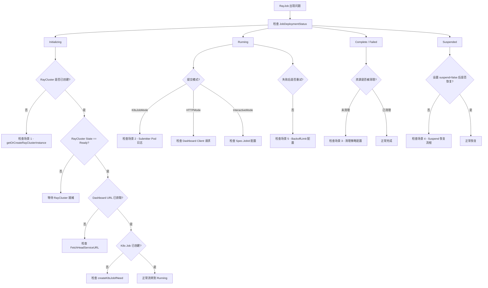
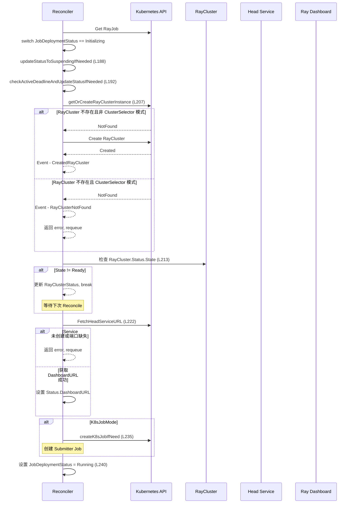
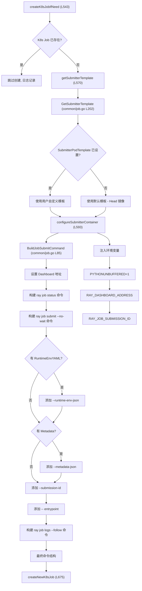
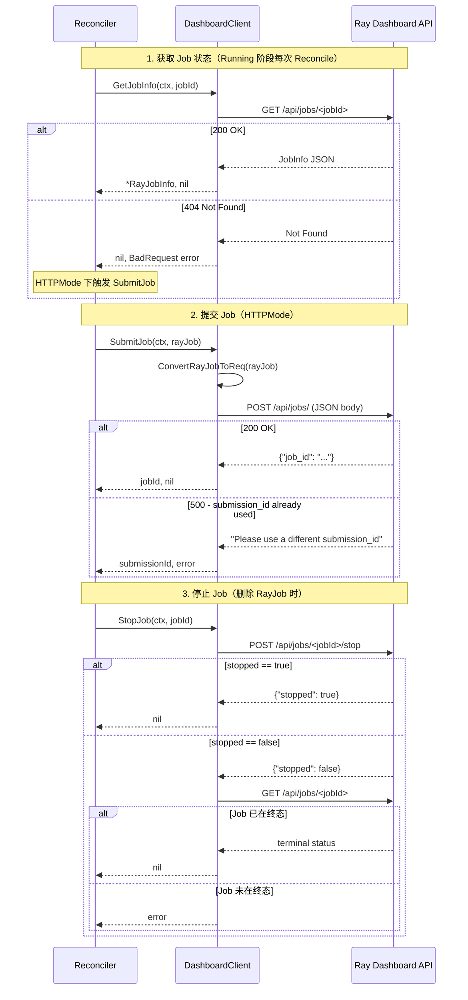

> 本文档基于 KubeRay 源码，深入分析 RayJob Controller 的 5 个典型调试场景，涵盖代码路径追踪、Dashboard HTTP Client 分析、K8s Job Submitter 机制、Event 事件解读及关键断点设置。适合需要从源码层面定位 RayJob 问题的开发者和集群管理员。

---

## 前置知识

| 知识领域 | 说明 |
|----------|------|
| Go 开发环境 | 编译和调试 KubeRay Operator（Go 1.22+） |
| Kubernetes 集群 | Kind 或 Minikube 均可（v1.26+） |
| RayJob Controller | 建议先阅读 [3.1 RayJob 生命周期管理](01-rayjob-lifecycle.md) 和 [3.2 删除策略](02-deletion-strategy.md) |
| IDE 调试能力 | VSCode 或 GoLand，支持 Go 远程调试 |
| Ray Dashboard API | 理解 Job submission / status 查询接口 |

---

## 目录

- [1. 调试环境搭建](#1-调试环境搭建)
  - [1.1 本地开发集群](#11-本地开发集群)
  - [1.2 本地运行 Operator](#12-本地运行-operator)
  - [1.3 IDE 调试配置](#13-ide-调试配置)
  - [1.4 关键环境变量](#14-关键环境变量)
  - [1.5 Reconcile 函数断点设置](#15-reconcile-函数断点设置)
- [2. 常见问题场景与代码链路追踪](#2-常见问题场景与代码链路追踪)
  - [场景 1 - RayJob 一直停留在 Initializing 状态](#场景-1---rayjob-一直停留在-initializing-状态)
  - [场景 2 - Ray Job 提交失败 (K8sJobMode)](#场景-2---ray-job-提交失败-k8sjobmode)
  - [场景 3 - RayJob Complete/Failed 但不清理资源](#场景-3---rayjob-completefailed-但不清理资源)
  - [场景 4 - RayJob Suspend 后无法恢复](#场景-4---rayjob-suspend-后无法恢复)
  - [场景 5 - BackoffLimit 重试不生效](#场景-5---backofflimit-重试不生效)
- [3. Dashboard HTTP Client 分析](#3-dashboard-http-client-分析)
- [4. K8s Job (Submitter) 创建与监控](#4-k8s-job-submitter-创建与监控)
- [5. Event 事件含义解读](#5-event-事件含义解读)
- [6. 关键源码断点位置建议](#6-关键源码断点位置建议)
- [延伸阅读](#延伸阅读)
- [下一篇](#下一篇)

---

## 1. 调试环境搭建

### 1.1 本地开发集群

#### Kind 集群（推荐）

Kind (Kubernetes IN Docker) 是本地调试 KubeRay 的推荐方式。

```yaml
# kind-config.yaml
kind: Cluster
apiVersion: kind.x-k8s.io/v1alpha4
nodes:
  - role: control-plane
  - role: worker
  - role: worker
```

```bash
# 创建集群
kind create cluster --name kuberay-dev --config kind-config.yaml

# 安装 CRD
cd ray-operator
make install

# 验证 CRD 是否安装成功
kubectl get crd rayjobs.ray.io
```

#### Minikube 集群

```bash
minikube start --cpus=4 --memory=8192 --driver=docker
cd ray-operator && make install
```

### 1.2 本地运行 Operator

KubeRay Operator 可以在本地以进程方式运行，直接连接到 Kind/Minikube 集群进行调试。

```bash
cd ray-operator

# 禁用 Webhook 本地运行（推荐调试方式）
ENABLE_WEBHOOKS=false make run

# 如果需要启用特定 Feature Gate，可通过命令行参数传递
ENABLE_WEBHOOKS=false go run main.go \
  --feature-gates=RayJobDeletionPolicy=true,AsyncJobInfoQuery=true
```

> **注意**：本地运行时需要确保 kubeconfig 指向正确的集群，且集群中不能同时运行另一个 KubeRay Operator 实例。

### 1.3 IDE 调试配置

#### VSCode (launch.json)

```json
{
  "version": "0.2.0",
  "configurations": [
    {
      "name": "Debug KubeRay Operator",
      "type": "go",
      "request": "launch",
      "mode": "auto",
      "program": "${workspaceFolder}/ray-operator/main.go",
      "env": {
        "ENABLE_WEBHOOKS": "false",
        "KUBECONFIG": "${env:HOME}/.kube/config"
      },
      "args": []
    }
  ]
}
```

#### GoLand

1. 打开 `Run/Debug Configurations`
2. 新建 `Go Build` 配置
3. 设置 `Package path` 为 `github.com/ray-project/kuberay/ray-operator`
4. 在 `Environment` 中添加 `ENABLE_WEBHOOKS=false`
5. 在 `Program arguments` 中可选添加 Feature Gate 参数

### 1.4 关键环境变量

| 环境变量 | 作用 | 默认值 |
|---------|------|--------|
| `ENABLE_WEBHOOKS` | 是否启用 Admission Webhook | `true` |
| `RAY_DASHBOARD_ADDRESS` | Submitter Pod 中注入的 Dashboard 地址 | 由 Controller 自动设置 |
| `RAY_JOB_SUBMISSION_ID` | Submitter Pod 中注入的 Job 提交 ID | 由 Controller 自动生成 |
| `DELETE_RAYJOB_CR_AFTER_JOB_FINISHES` | Job 完成后是否删除 RayJob CR 本身 | `false` |
| `RAYJOB_DEPLOYMENT_STATUS_TRANSITION_GRACE_PERIOD_SECONDS` | JobStatus 到达终态后等待 JobDeploymentStatus 转换的宽限期 | `300` |

> 源码位置：`ray-operator/controllers/ray/utils/constant.go` L153-206

### 1.5 Reconcile 函数断点设置

RayJob Controller 的核心入口是 `Reconcile` 函数（`rayjob_controller.go` L90）。该函数基于 `JobDeploymentStatus` 的 switch-case 来分发不同阶段的处理逻辑。

**推荐的初始断点位置：**

```go
// rayjob_controller.go L173 - 状态分发入口
switch rayJobInstance.Status.JobDeploymentStatus {
```

在此处设置断点后，可以观察到每次 Reconcile 循环进入时的 `JobDeploymentStatus` 值，从而快速定位问题所在的阶段。

---

## 2. 常见问题场景与代码链路追踪

### 问题排障总决策树

下面的决策树涵盖了 RayJob 最常见的 5 类问题，帮助开发者快速定位问题所属场景：



---

### 场景 1 - RayJob 一直停留在 Initializing 状态

**现象**：创建 RayJob 后，`JobDeploymentStatus` 持续显示 `Initializing`，无法进入 `Running`。

**代码路径**：`Reconcile` -> `case rayv1.JobDeploymentStatusInitializing` (L187-240)



#### 排查检查清单

**Check 1 - RayCluster 是否已创建?**

```bash
# 查看 RayCluster
kubectl get raycluster -n <namespace>

# 查看 RayJob 状态中的 RayClusterName
kubectl get rayjob <name> -o jsonpath='{.status.rayClusterName}'
```

源码位置：`getOrCreateRayClusterInstance` (L899-947)

如果 RayCluster 不存在：
- 非 ClusterSelector 模式：Controller 自动创建，若创建失败会发出 `FailedToCreateRayCluster` 事件
- ClusterSelector 模式：Controller 不会创建，而是发出 `RayClusterNotFound` 事件

**Check 2 - RayCluster 是否 Ready?**

```bash
kubectl get raycluster <name> -o jsonpath='{.status.state}'
```

源码位置：L213-214

```go
if rayClusterInstance.Status.State != rayv1.Ready {
    logger.Info("Wait for the RayCluster.Status.State to be ready before submitting the job.")
```

常见原因：Head Pod 未就绪、资源不足、镜像拉取失败。

> 详见 [RayCluster 调试指南](../02-raycluster-controller/04-debug-guide-raycluster.md)

**Check 3 - Dashboard URL 是否获取成功?**

```bash
kubectl get rayjob <name> -o jsonpath='{.status.dashboardURL}'
```

源码位置：`FetchHeadServiceURL` (L222-226, 定义在 `utils/util.go` L899-921)

该函数通过 Head Service 获取 Dashboard 端口，构建 FQDN URL。常见失败原因：
- Head Service 尚未创建
- Service 中缺少 `dashboard` 端口定义
- Head Pod 未通过 readiness probe

**Check 4 - K8s Job 是否创建?**

```bash
kubectl get job -n <namespace> -l ray.io/originated-from-cr-name=<rayjob-name>
```

源码位置：`createK8sJobIfNeed` (L543-567)

---

### 场景 2 - Ray Job 提交失败 (K8sJobMode)

**现象**：RayJob 进入 `Running` 状态后，Job 提交失败，Submitter Pod 报错退出。

**代码路径**：`createK8sJobIfNeed` -> `getSubmitterTemplate` -> `configureSubmitterContainer` -> `BuildJobSubmitCommand`

#### Submitter 命令构建流程



#### K8sJobMode 最终命令结构

`BuildJobSubmitCommand` 在 K8sJobMode 下生成的完整 Shell 命令如下：

```bash
# 命令结构 (common/job.go L114-196)
if ! ray job status --address http://<DASHBOARD_URL> <JOB_ID> >/dev/null 2>&1 ;
then ray job submit --address http://<DASHBOARD_URL> --no-wait \
     --submission-id <JOB_ID> \
     [--runtime-env-json '<JSON>'] \
     [--metadata-json '<JSON>'] \
     [--entrypoint-num-cpus <N>] \
     [--entrypoint-num-gpus <N>] \
     -- <ENTRYPOINT> ;
fi ; ray job logs --address http://<DASHBOARD_URL> --follow <JOB_ID>
```

**设计要点**：
- 先用 `ray job status` 检查 Job 是否已提交，避免重复提交（解决 [#2154](https://github.com/ray-project/kuberay/issues/2154)）
- 使用 `--no-wait` 提交 Job，不阻塞等待 Job 完成
- 无论 Job 是否已提交，最后都执行 `ray job logs --follow` 跟踪日志

#### 排查步骤

**Step 1 - 检查 Submitter Pod 日志**

```bash
# 查找 Submitter Pod
kubectl get pods -n <namespace> -l ray.io/originated-from-cr-name=<rayjob-name>

# 查看 Submitter Pod 日志
kubectl logs <submitter-pod-name> -n <namespace>
```

**Step 2 - 检查 Submitter Container 命令和环境变量**

```bash
# 查看 Submitter Pod 的完整 YAML
kubectl get pod <submitter-pod-name> -n <namespace> -o yaml

# 关注 containers[0].command, containers[0].args, containers[0].env
```

**Step 3 - 检查 Dashboard 是否可达**

```bash
# 端口转发到 Dashboard
kubectl port-forward svc/<head-svc-name> 8265:8265 -n <namespace>

# 测试 Dashboard API
curl http://localhost:8265/api/jobs/
```

**常见失败原因**：
- Dashboard 地址不可达（Head Pod 未就绪或 Service 配置错误）
- 入口脚本 (Entrypoint) 语法错误
- RuntimeEnvYAML 格式不正确
- 镜像中缺少 `ray` CLI 工具

---

### 场景 3 - RayJob Complete/Failed 但不清理资源

**现象**：RayJob 已到达终态 (`Complete` 或 `Failed`)，但关联的 RayCluster 未被删除。

**代码路径**：`case rayv1.JobDeploymentStatusComplete, rayv1.JobDeploymentStatusFailed` (L410-431)

```go
// L410-431 终态处理逻辑
case rayv1.JobDeploymentStatusComplete, rayv1.JobDeploymentStatusFailed:
    // Check 1: ClusterSelector 模式跳过清理
    if len(rayJobInstance.Spec.ClusterSelector) > 0 {
        return ctrl.Result{}, nil  // 直接返回，不清理
    }

    // Check 2: RayJobDeletionPolicy Feature Gate
    if features.Enabled(features.RayJobDeletionPolicy) && rayJobInstance.Spec.DeletionStrategy != nil {
        if rayJobInstance.Spec.DeletionStrategy.DeletionRules != nil {
            return r.handleDeletionRules(ctx, rayJobInstance)
        }
        return r.handleLegacyDeletionPolicy(ctx, rayJobInstance)
    }

    // Check 3: ShutdownAfterJobFinishes
    if rayJobInstance.Spec.ShutdownAfterJobFinishes {
        return r.handleShutdownAfterJobFinishes(ctx, rayJobInstance)
    }

    // 默认: 不配置任何删除策略，不执行清理
    return ctrl.Result{}, nil
```

#### 排查检查清单

| 检查项 | 检查命令 | 预期 |
|-------|---------|------|
| Check 1 - ClusterSelector | `kubectl get rayjob <name> -o jsonpath='{.spec.clusterSelector}'` | 如果已设置，则不会清理外部集群 |
| Check 2 - RayJobDeletionPolicy Feature Gate | 检查 Operator 启动参数 `--feature-gates=RayJobDeletionPolicy=true` | Feature Gate 默认关闭 (Alpha) |
| Check 3 - DeletionStrategy | `kubectl get rayjob <name> -o jsonpath='{.spec.deletionStrategy}'` | 需配置 DeletionRules 或 OnSuccess/OnFailure |
| Check 4 - ShutdownAfterJobFinishes | `kubectl get rayjob <name> -o jsonpath='{.spec.shutdownAfterJobFinishes}'` | 需设置为 `true` |
| Check 5 - TTLSeconds 与 EndTime | `kubectl get rayjob <name> -o jsonpath='{.spec.ttlSecondsAfterFinished}'` | TTL 未到期时不清理 |

**总结**：如果未配置任何清理策略（`ClusterSelector` 未设置、`RayJobDeletionPolicy` 未启用、`ShutdownAfterJobFinishes` 为 false），Controller 在到达终态后直接返回 `ctrl.Result{}, nil`，**不会清理任何资源**。

---

### 场景 4 - RayJob Suspend 后无法恢复

**现象**：将 RayJob 的 `spec.suspend` 设为 `true` 再设为 `false` 后，RayJob 无法恢复运行。

**完整状态流转**：

```
Running/Initializing -> (set suspend=true) -> Suspending -> Suspended -> (set suspend=false) -> New -> Initializing -> Running
```

**代码路径**：

1. **Suspending 阶段** (L361-400)：清理所有关联资源

```go
// L370-382 清理逻辑
isClusterDeleted, err := r.deleteClusterResources(ctx, rayJobInstance)
isJobDeleted, err := r.deleteSubmitterJob(ctx, rayJobInstance)
if !isClusterDeleted || !isJobDeleted {
    // 资源尚未完全删除，等待下次 Reconcile
    return ctrl.Result{RequeueAfter: RayJobDefaultRequeueDuration}, nil
}
```

2. **状态重置** (L384-400)：

```go
// 重置所有 RayCluster 和 Ray Job 相关状态
rayJobInstance.Status.RayClusterStatus = rayv1.RayClusterStatus{}
rayJobInstance.Status.RayClusterName = ""
rayJobInstance.Status.DashboardURL = ""
rayJobInstance.Status.JobId = ""
rayJobInstance.Status.Message = ""
rayJobInstance.Status.Reason = ""
rayJobInstance.Status.RayJobStatusInfo = rayv1.RayJobStatusInfo{}
rayJobInstance.Status.JobStatus = rayv1.JobStatusNew
// Suspending -> Suspended
rayJobInstance.Status.JobDeploymentStatus = rayv1.JobDeploymentStatusSuspended
```

3. **恢复阶段** (L401-407)：

```go
case rayv1.JobDeploymentStatusSuspended:
    if !rayJob.Spec.Suspend {
        // 用户将 suspend 设为 false，重新开始
        rayJob.Status.JobStatus = rayv1.JobStatusNew
        rayJob.Status.JobDeploymentStatus = rayv1.JobDeploymentStatusNew
    }
    // 如果仍然 suspended，不 requeue
    return ctrl.Result{}, nil
```

#### 排查要点

- **`deleteClusterResources` 是否返回 `true`?** 如果 RayCluster 正在删除中（`DeletionTimestamp` 不为零但尚未完成），函数返回 `false`，Controller 会持续 requeue 等待。
- **`deleteSubmitterJob` 是否返回 `true`?** 同理，K8s Job 正在删除中时返回 `false`。
- **状态重置是否完整?** L384-400 会清除所有与上一轮关联的状态，包括 `RayClusterName`、`JobId` 等，确保恢复后是一个全新的提交。

```bash
# 检查 RayCluster 是否仍在删除中
kubectl get raycluster -n <namespace> -o jsonpath='{.items[*].metadata.deletionTimestamp}'

# 检查 Submitter Job 是否仍在删除中
kubectl get job -n <namespace> -l ray.io/originated-from-cr-name=<rayjob-name>

# 确认 RayJob 当前状态
kubectl get rayjob <name> -o jsonpath='{.status.jobDeploymentStatus}'
```

---

### 场景 5 - BackoffLimit 重试不生效

**现象**：RayJob 配置了 `spec.backoffLimit`，但 Job 失败后未触发重试。

**代码路径**：`checkBackoffLimitAndUpdateStatusIfNeeded` (L500-540)

```go
func checkBackoffLimitAndUpdateStatusIfNeeded(ctx context.Context, rayJob *rayv1.RayJob) {
    // 统计 failed 和 succeeded 计数
    failedCount := int32(0)
    if rayJob.Status.Failed != nil {
        failedCount = *rayJob.Status.Failed
    }
    // ... (L506-524)

    // 核心判断条件 (L526)
    if rayJob.Status.JobDeploymentStatus == rayv1.JobDeploymentStatusFailed &&
       rayJob.Spec.BackoffLimit != nil &&
       *rayJob.Status.Failed < *rayJob.Spec.BackoffLimit+1 {

        // DeadlineExceeded 不可重试 (L527-535)
        if rayJob.Status.Reason == rayv1.DeadlineExceeded {
            logger.Info("RayJob is not eligible for retry due to failure with DeadlineExceeded")
            return
        }

        // 可重试: 设置 JobDeploymentStatus = Retrying
        rayJob.Status.JobDeploymentStatus = rayv1.JobDeploymentStatusRetrying
    }
}
```

#### 重试不生效的三种原因

| 原因 | 检查方式 | 说明 |
|------|---------|------|
| **BackoffLimit 未设置** | `kubectl get rayjob <name> -o jsonpath='{.spec.backoffLimit}'` | `spec.backoffLimit` 为 nil 时不触发重试 |
| **失败原因为 DeadlineExceeded** | `kubectl get rayjob <name> -o jsonpath='{.status.reason}'` | `ActiveDeadlineSeconds` 超时导致的失败不可重试 |
| **Failed 次数已达到 BackoffLimit+1** | `kubectl get rayjob <name> -o jsonpath='{.status.failed}'` | 已超过重试上限 |

**重试流程**：`Failed` -> `Retrying` -> (清理资源，等同 Suspending) -> `New` -> `Initializing` -> `Running`

注意 L398-400 中 `Retrying` 状态的处理：

```go
if rayJob.Status.JobDeploymentStatus == rayv1.JobDeploymentStatusRetrying {
    rayJob.Status.JobDeploymentStatus = rayv1.JobDeploymentStatusNew
}
```

`Retrying` 与 `Suspending` 共享同一个 case 分支（L361），执行相同的资源清理逻辑，但最终转换目标不同：`Suspending` -> `Suspended`，`Retrying` -> `New`。

---

## 3. Dashboard HTTP Client 分析

### 接口定义

Dashboard HTTP Client 是 RayJob Controller 与 Ray Dashboard API 交互的核心组件。

> 源码位置：`ray-operator/controllers/ray/utils/dashboardclient/dashboard_httpclient.go` L29-41

```go
type RayDashboardClientInterface interface {
    UpdateDeployments(ctx context.Context, configJson []byte) error
    GetServeDetails(ctx context.Context) (*utiltypes.ServeDetails, error)
    GetMultiApplicationStatus(context.Context) (map[string]*utiltypes.ServeApplicationStatus, error)
    GetJobInfo(ctx context.Context, jobId string) (*utiltypes.RayJobInfo, error)
    ListJobs(ctx context.Context) (*[]utiltypes.RayJobInfo, error)
    SubmitJob(ctx context.Context, rayJob *rayv1.RayJob) (string, error)
    SubmitJobReq(ctx context.Context, request *utiltypes.RayJobRequest) (string, error)
    GetJobLog(ctx context.Context, jobName string) (*string, error)
    StopJob(ctx context.Context, jobName string) error
    DeleteJob(ctx context.Context, jobName string) error
}
```

### Dashboard Client 交互时序



### URL 构建规则

所有 Job 相关 API 的 URL 构建规则如下：

| 操作 | HTTP 方法 | URL | 说明 |
|------|----------|-----|------|
| 获取 Job 信息 | GET | `{dashboardURL}/api/jobs/{jobId}` | 404 返回 BadRequest |
| 列出所有 Job | GET | `{dashboardURL}/api/jobs/` | - |
| 提交 Job | POST | `{dashboardURL}/api/jobs/` | Content-Type: application/json |
| 获取 Job 日志 | GET | `{dashboardURL}/api/jobs/{jobId}/logs` | - |
| 停止 Job | POST | `{dashboardURL}/api/jobs/{jobId}/stop` | - |
| 删除 Job | DELETE | `{dashboardURL}/api/jobs/{jobId}` | - |

### 认证机制

当 RayCluster 启用了 Auth 时，Dashboard Client 会在每个请求中添加 `x-ray-authorization` Header：

```go
// dashboard_httpclient.go L55-58
func (r *RayDashboardClient) setAuthHeader(req *http.Request) {
    if r.authToken != "" {
        req.Header.Set("x-ray-authorization", fmt.Sprintf("Bearer %s", r.authToken))
    }
}
```

### Dashboard Cache Client（AsyncJobInfoQuery Feature Gate）

当 `AsyncJobInfoQuery` Feature Gate 启用时，Controller 使用 `RayDashboardCacheClient` 代替直接的 HTTP Client。

> 源码位置：`ray-operator/controllers/ray/utils/dashboardclient/dashboard_cache_client.go`

**核心机制**：
- 使用 LRU Cache（容量 10000，过期时间 10 分钟）缓存 Job 信息
- 首次查询返回 `ErrAgain`，同时在后台 Worker Pool（8 个 goroutine）中异步获取 Job 信息
- 后续查询直接从 Cache 中读取，减少对 Dashboard API 的直接调用
- Job 到达终态后停止后台轮询
- `StopJob` 和 `DeleteJob` 操作会主动清除 Cache

---

## 4. K8s Job (Submitter) 创建与监控

### 创建流程

`createNewK8sJob` (L675-714) 创建一个 Kubernetes Batch Job 作为 Submitter：

```go
// L675-714 创建 Submitter Job
func (r *RayJobReconciler) createNewK8sJob(ctx context.Context, rayJobInstance *rayv1.RayJob,
    submitterTemplate corev1.PodTemplateSpec) error {

    submitterBackoffLimit := ptr.To[int32](2)  // 默认 BackoffLimit = 2
    if rayJobInstance.Spec.SubmitterConfig != nil &&
       rayJobInstance.Spec.SubmitterConfig.BackoffLimit != nil {
        submitterBackoffLimit = rayJobInstance.Spec.SubmitterConfig.BackoffLimit
    }

    job := &batchv1.Job{
        ObjectMeta: metav1.ObjectMeta{
            Name:      rayJobInstance.Name,  // Job 名称与 RayJob 相同
            Namespace: rayJobInstance.Namespace,
            Labels: map[string]string{
                utils.RayOriginatedFromCRNameLabelKey: rayJobInstance.Name,
                utils.RayOriginatedFromCRDLabelKey:    utils.RayOriginatedFromCRDLabelValue(utils.RayJobCRD),
                utils.KubernetesCreatedByLabelKey:     utils.ComponentName,
            },
        },
        Spec: batchv1.JobSpec{
            BackoffLimit: submitterBackoffLimit,
            Template:     submitterTemplate,
        },
    }
    // ...
}
```

**关键细节**：
- Submitter K8s Job 的名称与 RayJob CR 名称相同
- 默认 `BackoffLimit=2`，即最多重试 3 次（1 次初始 + 2 次重试）
- 通过 `ctrl.SetControllerReference` 设置 Owner Reference，实现级联删除
- 标签 `ray.io/originated-from-cr-name` 用于关联回 RayJob

### 监控机制

`checkSubmitterAndUpdateStatusIfNeeded` (L1014-1109) 在每次 `Running` 阶段的 Reconcile 中检查 Submitter 状态：

- **K8sJobMode**：检查 Kubernetes Job 的 `Conditions`，若存在 `JobFailed` 条件则标记 RayJob 为 Failed
- **SidecarMode**：检查 Head Pod 中 Submitter Sidecar 容器的 `State.Terminated`，若退出码非零则标记为 Failed

### Submitter 完成超时

`checkSubmitterFinishedTimeoutAndUpdateStatusIfNeeded` (L1157-1180)：

当 Submitter 已完成但 Ray Job 仍未到达终态时，等待 **30 秒** (`DefaultSubmitterFinishedTimeout`) 后将 RayJob 标记为 Failed。

```go
const DefaultSubmitterFinishedTimeout = 30 * time.Second
```

这个超时机制防止 Submitter 已完成但 Ray Job 状态未同步的情况导致 RayJob 永远卡在 `Running` 状态。

---

## 5. Event 事件含义解读

RayJob Controller 在关键操作的成功或失败时发出 Kubernetes Events，这些事件是排查问题的重要线索。

```bash
# 查看 RayJob 相关的所有事件
kubectl describe rayjob <name> -n <namespace>

# 或者通过 kubectl events 过滤
kubectl get events -n <namespace> --field-selector involvedObject.name=<rayjob-name>
```

### RayCluster 生命周期事件

| 事件类型 | 级别 | 含义 | 触发位置 |
|---------|------|------|---------|
| `CreatedRayCluster` | Normal | 成功创建 RayCluster | `getOrCreateRayClusterInstance` (L933) |
| `FailedToCreateRayCluster` | Warning | 创建 RayCluster 失败 | `getOrCreateRayClusterInstance` (L930) |
| `DeletedRayCluster` | Normal | 成功删除 RayCluster | `deleteClusterResources` (L781) |
| `FailedToDeleteRayCluster` | Warning | 删除 RayCluster 失败 | `deleteClusterResources` (L777) |
| `UpdatedRayCluster` | Normal | 更新 RayCluster（如 suspend worker groups） | `suspendWorkerGroups` (L811) |
| `FailedToUpdateRayCluster` | Warning | 更新 RayCluster 失败 | `suspendWorkerGroups` (L803) |
| `RayClusterNotFound` | Warning | ClusterSelector 模式下 RayCluster 不存在 | `getOrCreateRayClusterInstance` (L910) |

### Submitter Job 生命周期事件

| 事件类型 | 级别 | 含义 | 触发位置 |
|---------|------|------|---------|
| `CreatedRayJobSubmitter` | Normal | 成功创建 Submitter K8s Job | `createNewK8sJob` (L713) |
| `FailedToCreateRayJobSubmitter` | Warning | 创建 Submitter K8s Job 失败 | `createNewK8sJob` (L709) |
| `DeletedRayJobSubmitter` | Normal | 成功删除 Submitter K8s Job（Suspend 时） | `deleteSubmitterJob` (L748) |
| `FailedToDeleteRayJobSubmitter` | Warning | 删除 Submitter K8s Job 失败 | `deleteSubmitterJob` (L744) |

### Service 生命周期事件

| 事件类型 | 级别 | 含义 | 触发位置 |
|---------|------|------|---------|
| `CreatedService` | Normal | 成功创建 Head Service | `reconcileServices` (L668) |
| `FailedToCreateService` | Warning | 创建 Head Service 失败 | `reconcileServices` (L665) |
| `UpdatedService` | Normal | 更新 Head Service（RayCluster 切换时） | `reconcileServices` (L656) |
| `FailedToUpdateService` | Warning | 更新 Head Service 失败 | `reconcileServices` (L653) |

### 验证失败事件

| 事件类型 | 级别 | 含义 | 触发位置 |
|---------|------|------|---------|
| `InvalidRayJobMetadata` | Warning | RayJob metadata 验证失败 | `validateRayJob` (L156) |
| `InvalidRayJobSpec` | Warning | RayJob spec 验证失败 | `validateRayJob` (L156) |
| `InvalidRayJobStatus` | Warning | RayJob status 验证失败 | `validateRayJob` (L156) |

> **提示**：验证失败会直接将 `JobDeploymentStatus` 设为 `ValidationFailed`，RayJob 不会再进入 Reconcile 循环。

---

## 6. 关键源码断点位置建议

下表列出了在各个调试场景中推荐设置的断点位置：

| 场景 | 文件 | 函数 | 行号 | 说明 |
|-----|------|------|------|------|
| 全局入口 | `rayjob_controller.go` | `Reconcile` | L90 | 每次 Reconcile 循环入口 |
| 状态分发 | `rayjob_controller.go` | `Reconcile` | L173 | switch JobDeploymentStatus |
| 初始化状态设置 | `rayjob_controller.go` | `initRayJobStatusIfNeed` | L840 | JobId 和 RayClusterName 初始化 |
| 集群创建/获取 | `rayjob_controller.go` | `getOrCreateRayClusterInstance` | L899 | RayCluster 创建或获取 |
| Dashboard URL 获取 | `rayjob_controller.go` | `Reconcile` | L222 | FetchHeadServiceURL 调用 |
| Submitter 创建 | `rayjob_controller.go` | `createK8sJobIfNeed` | L543 | K8s Job 创建入口 |
| 命令构建 | `common/job.go` | `BuildJobSubmitCommand` | L85 | ray job submit 命令构建 |
| Container 配置 | `rayjob_controller.go` | `configureSubmitterContainer` | L593 | 环境变量与命令注入 |
| K8s Job 创建 | `rayjob_controller.go` | `createNewK8sJob` | L675 | 实际创建 Batch Job |
| Submitter 状态检查 | `rayjob_controller.go` | `checkSubmitterAndUpdateStatusIfNeeded` | L1014 | K8s Job / Sidecar 状态检查 |
| Dashboard 查询 | `dashboard_httpclient.go` | `GetJobInfo` | L154 | 获取 Ray Job 信息 |
| Job 提交 | `dashboard_httpclient.go` | `SubmitJobReq` | L226 | HTTP 提交 Ray Job |
| BackoffLimit 判断 | `rayjob_controller.go` | `checkBackoffLimitAndUpdateStatusIfNeeded` | L502 | 重试逻辑判断 |
| 资源清理 | `rayjob_controller.go` | `deleteClusterResources` | L757 | RayCluster 删除 |
| Submitter 删除 | `rayjob_controller.go` | `deleteSubmitterJob` | L718 | Submitter Job 删除 |
| 状态更新 | `rayjob_controller.go` | `updateRayJobStatus` | L872 | 状态持久化（仅有的 2 个位置之一） |
| Suspend 处理 | `rayjob_controller.go` | `Reconcile` | L361 | Suspending/Retrying 分支 |
| 终态处理 | `rayjob_controller.go` | `Reconcile` | L410 | Complete/Failed 清理策略 |
| Deletion Rules 处理 | `rayjob_controller.go` | `handleDeletionRules` | L1229 | 新版删除规则处理 |
| 超时检查 | `rayjob_controller.go` | `checkSubmitterFinishedTimeoutAndUpdateStatusIfNeeded` | L1157 | 30s 超时检查 |
| Grace Period | `rayjob_controller.go` | `checkTransitionGracePeriodAndUpdateStatusIfNeeded` | L1182 | 状态转换宽限期 |
| Cache Client | `dashboard_cache_client.go` | `GetJobInfo` | L176 | 异步缓存查询入口 |

---

## 延伸阅读

- [KubeRay 整体架构概述](../01-architecture-overview/02-overall-architecture.md) - 了解 KubeRay 各组件的关系
- [CRD API 设计详解](../01-architecture-overview/03-crd-api-design.md) - 深入理解 RayJob CRD 的字段定义
- [RayCluster Controller Reconciliation Loop](../02-raycluster-controller/01-reconciliation-loop.md) - RayCluster 的 Reconcile 流程
- [RayCluster 调试指南](../02-raycluster-controller/04-debug-guide-raycluster.md) - RayCluster 层面的调试方法
- [RayCluster Pod 调和机制](../02-raycluster-controller/02-pod-reconciliation.md) - Pod 级别的创建与管理
- [RayCluster 状态计算](../02-raycluster-controller/03-status-calculation.md) - RayCluster 状态如何影响 RayJob

---

## 下一篇

> **[4.1 - RayService 调和核心流程](../04-rayservice-controller/01-rayservice-reconciliation.md)**
>
> 下一篇将深入 RayService Controller 的实现原理，了解如何在 Kubernetes 上实现 Ray Serve 应用的蓝绿部署与渐进式升级。
