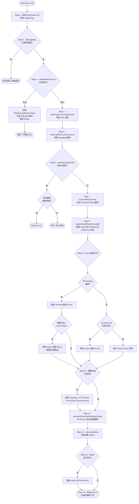
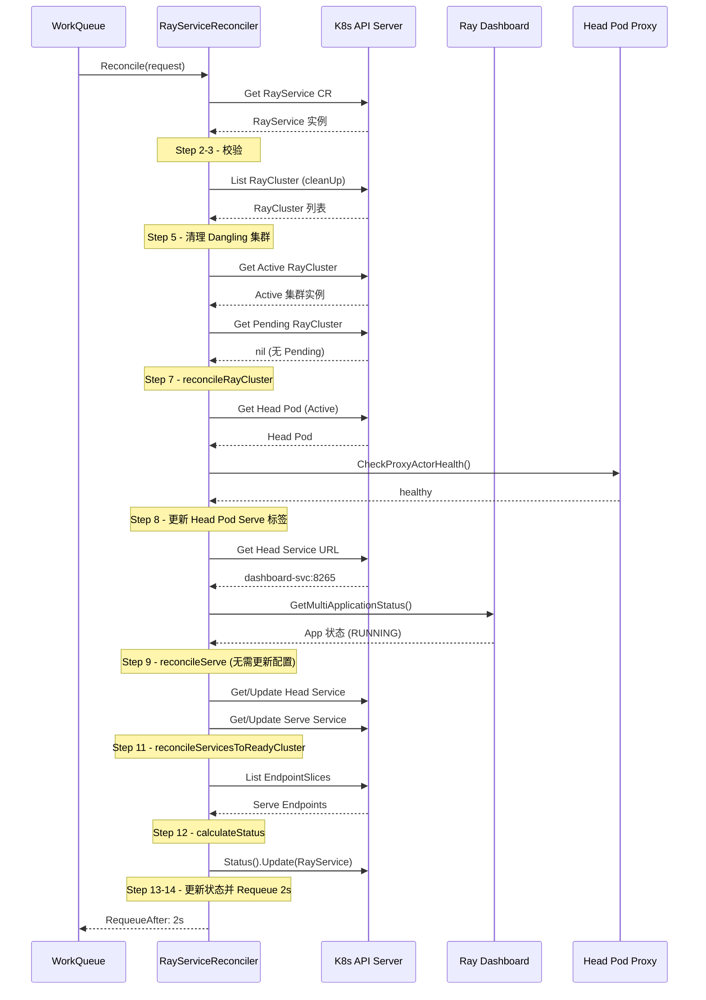
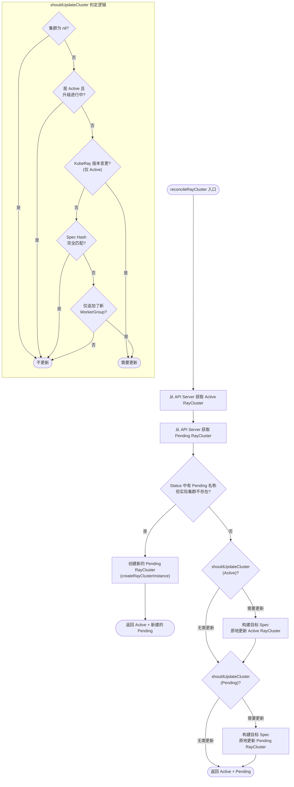

<p align="center">
  
</p>

> 本文基于 KubeRay 源码，对 RayService Controller 的核心调和流程进行全面深度剖析。RayService 是 KubeRay 中最复杂的 CRD，它在 RayCluster 之上叠加了 Ray Serve 应用管理、双集群蓝绿升级、增量升级（Incremental Upgrade）、Gateway API 流量治理等高级能力。主要源码文件为 `ray-operator/controllers/ray/rayservice_controller.go`（约 1923 行）。

---

## 目录

- [前置知识](#前置知识)
- [RayServiceReconciler 结构体解析](#rayservicereconciler-结构体解析)
- [NewRayServiceReconciler 工厂函数](#newrayservicereconciler-工厂函数)
- [Reconcile 主流程逐步分析](#reconcile-主流程逐步分析)
- [Reconcile 主流程图](#reconcile-主流程图)
- [正常运行时的调和时序](#正常运行时的调和时序)
- [reconcileRayCluster 深度分析](#reconcileraycluster-深度分析)
- [reconcileRayCluster 决策树](#reconcileraycluster-决策树)
- [shouldPrepareNewCluster 决策逻辑](#shouldpreparenewcluster-决策逻辑)
- [reconcileServe 深度分析](#reconcileserve-深度分析)
- [Serve 配置缓存机制](#serve-配置缓存机制)
- [calculateStatus 详解](#calculatestatus-详解)
- [calculateConditions 状态条件计算](#calculateconditions-状态条件计算)
- [reconcilePromotionAndServingStatus 升级晋升逻辑](#reconcilepromotionandservingstatus-升级晋升逻辑)
- [Active/Pending 双集群管理模型](#activepending-双集群管理模型)
- [Dangling 集群清理与延迟删除](#dangling-集群清理与延迟删除)
- [SetupWithManager 配置](#setupwithmanager-配置)
- [延伸阅读](#延伸阅读)
- [下一篇](#下一篇)

---

## 前置知识

在阅读本文之前，建议读者具备以下基础知识：

| 知识领域 | 说明 |
|---------|------|
| **Kubernetes Controller 模式** | 理解 Informer / WorkQueue / Reconciler 三层架构 |
| **controller-runtime 框架** | 了解 `manager.Manager`、`client.Client`、`reconcile.Reconciler` 接口 |
| **RayCluster Controller** | 建议先阅读 [RayCluster Controller 调和循环](../02-raycluster-controller/01-reconciliation-loop.md) |
| **Ray Serve 概念** | 了解 Ray Serve 的 Application / Deployment 模型及 Dashboard REST API |
| **Kubernetes Service / EndpointSlice** | 理解 K8s Service 选择器、EndpointSlice 机制 |
| **Gateway API（可选）** | 了解 Gateway / HTTPRoute CRD 的基本概念，增量升级功能依赖此知识 |

---

## RayServiceReconciler 结构体解析

> 源码位置：`ray-operator/controllers/ray/rayservice_controller.go` L52-65

```go
// RayServiceReconciler reconciles a RayService object
type RayServiceReconciler struct {
    client.Client
    Scheme   *runtime.Scheme
    Recorder record.EventRecorder
    ServeConfigs                 *lru.Cache
    RayClusterDeletionTimestamps cmap.ConcurrentMap[string, time.Time]
    dashboardClientFunc          func(rayCluster *rayv1.RayCluster, url string) (dashboardclient.RayDashboardClientInterface, error)
    httpProxyClientFunc          func(hostIp, podNamespace, podName string, port int) utils.RayHttpProxyClientInterface
}
```

### 字段逐一解析

| 字段 | 类型 | 说明 |
|------|------|------|
| `client.Client` | 嵌入字段 | controller-runtime 提供的 K8s API 客户端，支持 Get/List/Create/Update/Delete/Patch 操作。嵌入式设计使 reconciler 可以直接调用 `r.Get()`、`r.Update()` 等方法 |
| `Scheme` | `*runtime.Scheme` | Kubernetes runtime scheme，用于 GVK（GroupVersionKind）到 Go 类型的映射，在设置 OwnerReference 时不可或缺 |
| `Recorder` | `record.EventRecorder` | Kubernetes 事件记录器，通过 `r.Recorder.Eventf()` 向 API Server 发送事件，便于用户通过 `kubectl describe` 查看操作历史 |
| `ServeConfigs` | `*lru.Cache` | **LRU 缓存**，用于存储 Serve 应用配置。由于 Ray Dashboard 不缓存 Serve 配置，为避免每次调和都重复下发相同配置，controller 在本地维护此缓存。缓存键为 `namespace/name`，缓存值为 `map[clusterName]configString` 的并发安全 Map |
| `RayClusterDeletionTimestamps` | `cmap.ConcurrentMap[string, time.Time]` | **并发安全 Map**，记录待删除 RayCluster 的计划删除时间戳。用于实现延迟删除（Deletion Delay）机制，确保旧集群在被删除前有足够时间完成流量排空 |
| `dashboardClientFunc` | 函数类型 | Dashboard HTTP 客户端工厂函数。接收 RayCluster 实例和 URL，返回 `RayDashboardClientInterface`。该接口封装了对 Ray Dashboard REST API 的调用，包括部署 Serve 应用、获取应用状态等 |
| `httpProxyClientFunc` | 函数类型 | HTTP 代理客户端工厂函数。用于创建与 Head Pod 上 Serve proxy actor 通信的客户端，主要用于健康检查（`CheckProxyActorHealth`），决定是否为 Head Pod 打上 Serve 标签 |

### 设计要点

1. **工厂函数模式**：`dashboardClientFunc` 和 `httpProxyClientFunc` 采用工厂函数而非直接持有客户端实例，这为单元测试提供了极大便利 -- 测试中可以注入 mock 实现，无需启动真实的 Ray 集群。

2. **LRU 缓存策略**：`ServeConfigs` 使用 LRU（Least Recently Used）缓存而非无界 Map，防止在大量 RayService 资源存在时出现内存泄漏。缓存容量由 `utils.ServeConfigLRUSize`（默认 1000）控制。

3. **并发安全**：`RayClusterDeletionTimestamps` 使用 `concurrent-map` 第三方库实现并发安全，因为 reconciler 可能以并发模式运行（由 `MaxConcurrentReconciles` 控制）。

---

## NewRayServiceReconciler 工厂函数

> 源码位置：`ray-operator/controllers/ray/rayservice_controller.go` L68-81

```go
func NewRayServiceReconciler(ctx context.Context, mgr manager.Manager, provider utils.ClientProvider) *RayServiceReconciler {
    dashboardClientFunc := provider.GetDashboardClient(ctx, mgr)
    httpProxyClientFunc := provider.GetHttpProxyClient(mgr)
    return &RayServiceReconciler{
        Client:                       mgr.GetClient(),
        Scheme:                       mgr.GetScheme(),
        Recorder:                     mgr.GetEventRecorderFor("rayservice-controller"),
        ServeConfigs:                 lru.New(utils.ServeConfigLRUSize),
        RayClusterDeletionTimestamps: cmap.New[time.Time](),
        dashboardClientFunc:          dashboardClientFunc,
        httpProxyClientFunc:          httpProxyClientFunc,
    }
}
```

### 关键设计

- **Provider 模式**：通过 `utils.ClientProvider` 接口获取 Dashboard 和 HTTP Proxy 客户端的工厂函数。生产环境注入真实 HTTP 客户端，测试环境注入 mock 客户端。
- **事件记录器名称**：`mgr.GetEventRecorderFor("rayservice-controller")` 创建的事件记录器，其 `source.component` 字段值为 `rayservice-controller`，用户可通过 `kubectl get events` 过滤。
- **LRU 缓存容量**：`utils.ServeConfigLRUSize` 定义在 `ray-operator/controllers/ray/utils/constant.go` L270，默认值为 `1000`。

---

## Reconcile 主流程逐步分析

> 源码位置：`ray-operator/controllers/ray/rayservice_controller.go` L112-280

`Reconcile` 方法是 RayService Controller 的核心入口，每次调和循环执行以下步骤。这是 KubeRay 中最长、最复杂的 Reconcile 实现之一。

### 步骤 1 - 获取 RayService 实例并 DeepCopy（L115-119）

```go
rayServiceInstance, err := r.getRayServiceInstance(ctx, request)
if err != nil {
    return ctrl.Result{}, client.IgnoreNotFound(err)
}
originalRayServiceInstance := rayServiceInstance.DeepCopy()
```

- 通过 `getRayServiceInstance()` 从 API Server 获取最新的 RayService CR。
- 如果资源已被删除（NotFound），通过 `client.IgnoreNotFound(err)` 优雅处理，不再重新入队。
- **DeepCopy 的用途**：保存原始状态的深拷贝，在最后一步用于比较状态是否发生变化，避免不必要的 Status 更新写操作。

### 步骤 2 - ManagedByExternalController 检查（L121-124）

```go
if manager := utils.ManagedByExternalController(rayServiceInstance.Spec.ManagedBy); manager != nil {
    logger.Info("Skipping RayService managed by a custom controller", "managed-by", manager)
    return ctrl.Result{}, nil
}
```

- 如果 `Spec.ManagedBy` 字段指定了外部控制器，则跳过本次调和。
- 此机制允许第三方控制器接管 RayService 的管理，KubeRay 不做任何干预。

### 步骤 3 - 校验 RayService（L127-141）

```go
errType, err := validateRayService(ctx, rayServiceInstance)
if err != nil {
    r.Recorder.Eventf(rayServiceInstance, corev1.EventTypeWarning, string(errType), ...)
    setCondition(rayServiceInstance, rayv1.RayServiceReady, metav1.ConditionFalse,
        rayv1.RayServiceValidationFailed, err.Error())
    rayServiceInstance.Status.LastUpdateTime = &metav1.Time{Time: time.Now()}
    if updateErr := r.Status().Update(ctx, rayServiceInstance); updateErr != nil {
        return ctrl.Result{RequeueAfter: ServiceDefaultRequeueDuration}, updateErr
    }
    return ctrl.Result{}, nil
}
```

`validateRayService()` 执行两条校验规则：

| 校验规则 | 函数 | 说明 |
|---------|------|------|
| Metadata 校验 | `ValidateRayServiceMetadata()` | 校验 annotations 中的超时配置等元数据格式 |
| Spec 校验 | `ValidateRayServiceSpec()` | 校验 RayClusterSpec、ServeConfigV2 等字段的合法性 |

校验失败时，controller 立即更新 Status 并发送 Warning 事件，**不再重新入队**（返回空 Result），将 RayService 置于失败终态。

### 步骤 4 - 缓存清理（L143）

```go
r.cleanUpServeConfigCache(ctx, rayServiceInstance)
```

清理本地 LRU 缓存中不再需要的 Serve 配置条目。遍历缓存中的所有 clusterName 键，只保留与当前 Active 和 Pending 集群名匹配的条目，删除其余"孤立"条目。

### 步骤 5 - Dangling 集群清理（L144-147）

```go
hasRayClustersToClean, err := r.cleanUpRayClusterInstance(ctx, rayServiceInstance)
if err != nil {
    return ctrl.Result{}, err
}
```

清理所有"悬挂"的 RayCluster 实例 -- 即那些既不是 Active 也不是 Pending 的旧集群。采用**延迟删除**策略，默认等待 60 秒后再执行真正的删除操作（详见后续"Dangling 集群清理"章节）。

### 步骤 6 - 初始化超时检查（L152-160）

```go
if isInitializingTimeout(rayServiceInstance) {
    if hasRayClustersToClean {
        return ctrl.Result{RequeueAfter: ServiceDefaultRequeueDuration}, nil
    }
    logger.Info("RayService in terminal failure state, all RayClusters cleaned up")
    return ctrl.Result{}, nil
}
```

如果 RayService 在初始化阶段超时（由 annotation `ray.io/initializing-timeout` 配置），controller 将 RayService 置于**终态失败状态**。此时：
- 仅继续执行集群清理操作。
- 如果所有旧集群已清理完毕，则停止重新入队。
- 用户必须删除并重建 RayService 才能恢复。

### 步骤 7 - 调和 RayCluster（L163-166）

```go
var activeRayClusterInstance, pendingRayClusterInstance *rayv1.RayCluster
if activeRayClusterInstance, pendingRayClusterInstance, err = r.reconcileRayCluster(ctx, rayServiceInstance); err != nil {
    return ctrl.Result{RequeueAfter: ServiceDefaultRequeueDuration}, client.IgnoreNotFound(err)
}
```

这是 RayService 调和的核心步骤之一，负责管理 Active/Pending 双集群模型（详见后续"reconcileRayCluster 深度分析"章节）。返回当前的 Active 和 Pending RayCluster 实例指针。

### 步骤 8 - 更新 Head Pod Serve 标签（L171-176）

```go
if err := r.updateHeadPodServeLabel(ctx, rayServiceInstance, activeRayClusterInstance,
    rayServiceInstance.Spec.ExcludeHeadPodFromServeSvc); err != nil {
    return ctrl.Result{RequeueAfter: ServiceDefaultRequeueDuration}, err
}
if err := r.updateHeadPodServeLabel(ctx, rayServiceInstance, pendingRayClusterInstance,
    rayServiceInstance.Spec.ExcludeHeadPodFromServeSvc); err != nil {
    return ctrl.Result{RequeueAfter: ServiceDefaultRequeueDuration}, err
}
```

为 Active 和 Pending 集群的 Head Pod 更新 Serve 标签。`updateHeadPodServeLabel()` 的核心逻辑（L1691-1736）：

1. 获取 Head Pod 实例。
2. 找到 Ray 容器的 Serve 端口（默认 8000）。
3. 通过 `httpProxyClientFunc` 创建代理客户端。
4. 如果 `ExcludeHeadPodFromServeSvc` 为 `false`，调用 `CheckProxyActorHealth()` 检查 proxy actor 健康状态。
5. 根据健康检查结果设置 `ray.io/serve` 标签为 `"true"` 或 `"false"`。
6. 仅在标签值变化时才执行 Pod 更新操作。

该标签被 Kubernetes Serve Service 的选择器使用，决定 Head Pod 是否参与流量转发。

### 步骤 9 - 调和 Serve 应用（L186-205）

这是 RayService 调和中最复杂的分支逻辑，涉及 4 种场景：

```
场景 1：仅 Pending 集群存在 → 调和 Pending 集群的 Serve 应用
场景 2：Active + Pending 都存在（传统升级）→ 仅调和 Pending 集群
场景 3：仅 Active 集群存在 + 无需升级 → 调和 Active 集群
场景 4：Active + Pending 都存在 + 增量升级启用 → 同时调和 Active 集群
```

```go
if pendingRayClusterInstance != nil {
    // 场景 1 & 2：有 Pending 集群时，始终调和 Pending
    isPendingClusterReady, pendingClusterServeApplications, err = r.reconcileServe(...)
}
if activeRayClusterInstance != nil && pendingRayClusterInstance == nil &&
    !shouldPrepareNewCluster(ctx, rayServiceInstance, activeRayClusterInstance, nil, false) {
    // 场景 3：仅 Active 且无需升级
    isActiveClusterReady, activeClusterServeApplications, err = r.reconcileServe(...)
} else if activeRayClusterInstance != nil && pendingRayClusterInstance != nil &&
    utils.IsIncrementalUpgradeEnabled(&rayServiceInstance.Spec) {
    // 场景 4：增量升级期间也调和 Active
    isActiveClusterReady, activeClusterServeApplications, err = r.reconcileServe(...)
}
```

**设计意图**：传统蓝绿升级期间（场景 2），不更新 Active 集群的 Serve 应用，避免在升级过程中引入额外变更。增量升级（场景 4）则需要同时管理两个集群的 target_capacity。

### 步骤 10 - Gateway/HTTPRoute 调和（L208-229）

```go
if utils.IsIncrementalUpgradeEnabled(&rayServiceInstance.Spec) {
    // 1. 为 Active 和 Pending 集群各自创建/更新 per-cluster Serve Service
    r.reconcilePerClusterServeService(ctx, rayServiceInstance, activeRayClusterInstance)
    r.reconcilePerClusterServeService(ctx, rayServiceInstance, pendingRayClusterInstance)

    // 2. 创建/更新 Gateway
    r.reconcileGateway(ctx, rayServiceInstance)

    // 3. 创建/更新 HTTPRoute，传入 Pending 集群就绪状态
    httpRouteInstance, err = r.reconcileHTTPRoute(ctx, rayServiceInstance, isPendingClusterReady)
}
```

仅在增量升级模式（`NewClusterWithIncrementalUpgrade`）下执行。通过 Gateway API 实现精细化流量分割：
- **per-cluster Serve Service**：每个 RayCluster 拥有独立的 Serve Service，而非共享一个。
- **Gateway**：定义 HTTP 入口监听器。
- **HTTPRoute**：基于权重将流量分配到 Active 和 Pending 集群的 Serve Service。

### 步骤 11 - Service 切换到就绪集群（L232-255）

```go
if isPendingClusterReady || isActiveClusterReady {
    targetCluster := activeRayClusterInstance
    isIncrementalUpgradeInProgress := utils.IsIncrementalUpgradeEnabled(&rayServiceInstance.Spec) &&
        meta.IsStatusConditionTrue(rayServiceInstance.Status.Conditions, string(rayv1.UpgradeInProgress))
    if isPendingClusterReady && !isIncrementalUpgradeInProgress {
        targetCluster = pendingRayClusterInstance
    }
    headSvc, serveSvc, err = r.reconcileServicesToReadyCluster(ctx, rayServiceInstance, targetCluster)
}
```

将 Head Service 和 Serve Service 的选择器指向目标集群：
- **传统升级**：当 Pending 集群就绪时，将 Service 切换到 Pending 集群（触发流量切换）。
- **增量升级**：升级进行中时跳过 Service 切换（流量由 HTTPRoute 权重控制），Service 保持指向 Active 集群。
- **无升级**：Service 保持指向 Active 集群。

### 步骤 12 - calculateStatus 计算状态（L258-270）

```go
if err := r.calculateStatus(
    ctx, rayServiceInstance, headSvc, serveSvc,
    activeRayClusterInstance, pendingRayClusterInstance,
    activeClusterServeApplications, pendingClusterServeApplications,
    httpRouteInstance,
); err != nil {
    return ctrl.Result{RequeueAfter: ServiceDefaultRequeueDuration}, err
}
```

综合所有 K8s 资源状态计算 RayService 的完整 Status（详见后续"calculateStatus 详解"章节）。

### 步骤 13 - 最终状态更新（L273-278）

```go
if utils.InconsistentRayServiceStatuses(originalRayServiceInstance.Status, rayServiceInstance.Status) {
    rayServiceInstance.Status.LastUpdateTime = &metav1.Time{Time: time.Now()}
    if errStatus := r.Status().Update(ctx, rayServiceInstance); errStatus != nil {
        return ctrl.Result{RequeueAfter: ServiceDefaultRequeueDuration}, errStatus
    }
}
```

通过 `InconsistentRayServiceStatuses()` 比较 DeepCopy 保存的原始状态与当前计算状态，仅在状态发生变化时才执行 Status 更新。这一优化显著减少了对 API Server 的无效写入。

### 步骤 14 - 无条件重新入队（L279）

```go
return ctrl.Result{RequeueAfter: ServiceDefaultRequeueDuration}, nil
```

**始终以 2 秒间隔重新入队**。这是 RayService Controller 的关键设计决策：

- `ServiceDefaultRequeueDuration = 2 * time.Second`（L47）
- 由于 Serve 应用状态需要通过 Dashboard API 轮询获取（而非 K8s Watch），controller 必须持续轮询以检测状态变化。
- 2 秒的间隔在响应速度和 API Server 负载之间取得平衡。

---

## Reconcile 主流程图



---

## 正常运行时的调和时序

以下时序图展示了一次正常调和循环中，Reconciler 与各组件之间的交互过程：



---

## reconcileRayCluster 深度分析

> 源码位置：`ray-operator/controllers/ray/rayservice_controller.go` L889-941

`reconcileRayCluster()` 是 RayService 双集群管理的核心函数，负责确保 Active 和 Pending RayCluster 处于期望状态。

### 执行流程

```go
func (r *RayServiceReconciler) reconcileRayCluster(ctx context.Context,
    rayServiceInstance *rayv1.RayService) (*rayv1.RayCluster, *rayv1.RayCluster, error) {

    // 1. 获取 Active 和 Pending 集群实例
    activeRayCluster, err := r.getRayClusterByNamespacedName(ctx,
        common.RayServiceActiveRayClusterNamespacedName(rayServiceInstance))
    pendingRayCluster, err := r.getRayClusterByNamespacedName(ctx,
        common.RayServicePendingRayClusterNamespacedName(rayServiceInstance))

    // 2. 如果 Status 中记录了 Pending 集群名但实际不存在，则创建新集群
    if rayServiceInstance.Status.PendingServiceStatus.RayClusterName != "" && pendingRayCluster == nil {
        pendingRayCluster, err = r.createRayClusterInstance(ctx, rayServiceInstance)
        return activeRayCluster, pendingRayCluster, err
    }

    // 3. 检查并更新 Active 集群（仅在非升级状态下）
    if shouldUpdateCluster(rayServiceInstance, activeRayCluster, true) {
        // 重建目标集群 Spec，执行原地更新
        goalCluster, _ := constructRayClusterForRayService(rayServiceInstance, activeRayCluster.Name, r.Scheme)
        modifyRayCluster(ctx, activeRayCluster, goalCluster)
        r.Update(ctx, activeRayCluster)
    }

    // 4. 检查并更新 Pending 集群
    if shouldUpdateCluster(rayServiceInstance, pendingRayCluster, false) {
        goalCluster, _ := constructRayClusterForRayService(rayServiceInstance, pendingRayCluster.Name, r.Scheme)
        modifyRayCluster(ctx, pendingRayCluster, goalCluster)
        r.Update(ctx, pendingRayCluster)
    }

    return activeRayCluster, pendingRayCluster, nil
}
```

### shouldUpdateCluster 判定逻辑（L1035-1061）

`shouldUpdateCluster()` 决定是否应该原地更新（而非重建）一个 RayCluster：

| 条件 | Active 集群 | Pending 集群 |
|------|------------|-------------|
| 集群为 nil | 不更新 | 不更新 |
| 正在升级中 | **不更新**（Spec 应与 Pending 比较） | 正常检查 |
| KubeRay 版本变更 | 更新（刷新版本标注） | - |
| Spec Hash 完全匹配 | 不更新 | 不更新 |
| 仅追加了新 WorkerGroup | 更新（原地扩展） | 更新 |
| Spec Hash 不匹配且非追加 | 不更新（需要创建新集群） | 不更新 |

**关键设计**：升级进行中时，Active 集群被"冻结"，不再接受 Spec 变更。所有变更仅应用到 Pending 集群。

---

## reconcileRayCluster 决策树



---

## shouldPrepareNewCluster 决策逻辑

> 源码位置：`ray-operator/controllers/ray/rayservice_controller.go` L1093-1115

`shouldPrepareNewCluster()` 在 `calculateStatus()` 中被调用，决定是否需要在 Status 中设置一个新的 Pending RayCluster 名称（触发下一轮调和时创建集群）。

```go
func shouldPrepareNewCluster(ctx context.Context, rayServiceInstance *rayv1.RayService,
    activeRayCluster, pendingRayCluster *rayv1.RayCluster, isPendingClusterServing bool) bool {

    // 1. Pending 集群正在服务中，不创建新集群
    if isPendingClusterServing { return false }

    // 2. 两个集群都为 nil → 初始创建
    if activeRayCluster == nil && pendingRayCluster == nil { return true }

    // 3. 选择比较对象：优先 Pending，其次 Active
    cluster := pendingRayCluster
    if cluster == nil { cluster = activeRayCluster }

    // 4. Spec Hash 完全匹配 → 无需创建
    if isClusterSpecHashEqual(rayServiceInstance, cluster, false) { return false }

    // 5. 仅追加了 WorkerGroup（部分匹配）→ 通过原地更新处理，无需创建
    if isClusterSpecHashEqual(rayServiceInstance, cluster, true) { return false }

    // 6. Spec 确实发生了不兼容变更 → 根据零停机升级配置决定
    return isZeroDowntimeUpgradeEnabled(ctx, rayServiceInstance.Spec.UpgradeStrategy)
}
```

决策流程总结：

| 条件 | 结果 | 说明 |
|------|------|------|
| Pending 正在服务流量 | `false` | 不中断正在进行的切换 |
| Active 和 Pending 都为 nil | `true` | RayService 刚创建，需要第一个集群 |
| Spec Hash 完全匹配 | `false` | 无变更，保持现状 |
| 仅追加 WorkerGroup | `false` | 通过原地更新处理 |
| Spec 不兼容变更 + 零停机升级启用 | `true` | 创建新 Pending 集群进行蓝绿升级 |
| Spec 不兼容变更 + 零停机升级禁用 | `false` | 直接原地更新（可能导致短暂不可用） |

---

## reconcileServe 深度分析

> 源码位置：`ray-operator/controllers/ray/rayservice_controller.go` L1612-1689

`reconcileServe()` 负责管理 RayCluster 上的 Serve 应用部署和状态检查。返回三元组 `(isReady, serveApplications, error)`。

### 执行步骤

#### 1. Head Pod 就绪检查

```go
// 新版本使用 RayCluster Status Condition
if features.Enabled(features.RayClusterStatusConditions) {
    if !meta.IsStatusConditionTrue(rayClusterInstance.Status.Conditions, string(rayv1.HeadPodReady)) {
        return false, serveApplications, nil
    }
} else {
    // 旧版本直接检查 Pod 状态
    if isRunningAndReady, err := r.isHeadPodRunningAndReady(ctx, rayClusterInstance); !isRunningAndReady {
        return false, serveApplications, nil
    }
}
```

如果 Head Pod 尚未就绪，直接返回 `false`，避免向未就绪的 Dashboard 发送无效请求。

#### 2. 创建 Dashboard 客户端

```go
clientURL, err := utils.FetchHeadServiceURL(ctx, r.Client, rayClusterInstance, utils.DashboardPortName)
rayDashboardClient, err := r.dashboardClientFunc(rayClusterInstance, clientURL)
```

通过 Head Service 的 Dashboard 端口（默认 8265）获取 URL，创建 Dashboard HTTP 客户端。

#### 3. 增量升级期间的配置更新阻断

```go
if isActiveCluster && isIncrementalUpgradeInProgress {
    skipConfigUpdate = true
}
```

增量升级进行中时，Active 集群的 Serve 配置被"冻结"，新配置仅部署到 Pending 集群。

#### 4. 获取并检查 Serve 状态

```go
cachedServeConfigV2 := r.getServeConfigFromCache(rayServiceInstance, rayClusterInstance.Name)
isReady, serveApplications, err := getAndCheckServeStatus(ctx, rayDashboardClient)
```

`getAndCheckServeStatus()`（L1471-1519）通过 Dashboard API 获取所有 Serve 应用的状态，当所有应用都处于 `RUNNING` 状态时返回 `isReady = true`。

#### 5. 判断是否需要提交 Serve 配置

```go
shouldUpdate, reason := checkIfNeedSubmitServeApplications(
    cachedServeConfigV2, rayServiceInstance.Spec.ServeConfigV2, serveApplications)
```

`checkIfNeedSubmitServeApplications()`（L1209-1228）的判定逻辑：

| 条件 | 结果 | 原因 |
|------|------|------|
| 缓存为空 | 需要提交 | 首次部署或缓存被清除 |
| Dashboard 返回 0 个应用 | 需要提交 | Head Pod 可能重启过（GCS FT 未启用） |
| 缓存配置 != 当前 Spec 配置 | 需要提交 | 用户更新了 ServeConfigV2 |
| 缓存配置 == 当前 Spec 配置 | 无需提交 | 配置一致，无变更 |

#### 6. 部署 Serve 配置

```go
if shouldUpdate && !skipConfigUpdate {
    r.updateServeDeployment(ctx, rayServiceInstance, rayDashboardClient, rayClusterInstance.Name)
}
```

`updateServeDeployment()`（L1230-1274）将 `ServeConfigV2` YAML 解析为 JSON，通过 Dashboard API 的 `UpdateDeployments` 接口部署。部署成功后，调用 `cacheServeConfig()` 缓存当前配置。

#### 7. 增量升级 target_capacity 调节

```go
if isIncrementalUpgradeInProgress {
    incrementalUpgradeUpdate, reason := r.checkIfNeedTargetCapacityUpdate(ctx, rayServiceInstance)
    if incrementalUpgradeUpdate {
        r.reconcileServeTargetCapacity(ctx, rayServiceInstance, rayClusterInstance, rayDashboardClient)
    }
}
```

增量升级期间，通过 `reconcileServeTargetCapacity()`（L1399-1463）逐步调节 Active 和 Pending 集群的 `target_capacity`，实现流量的渐进式迁移。

---

## Serve 配置缓存机制

### 缓存结构

```
ServeConfigs (LRU Cache, 容量 1000)
  └── key: "namespace/name"
      └── value: ConcurrentMap[string, string]
                   ├── "raycluster-abc123": "<ServeConfigV2 YAML>"
                   └── "raycluster-def456": "<ServeConfigV2 YAML>"
```

### 缓存读取 - getServeConfigFromCache（L1521-1533）

```go
func (r *RayServiceReconciler) getServeConfigFromCache(rayServiceInstance *rayv1.RayService, clusterName string) string {
    cacheKey := rayServiceInstance.Namespace + "/" + rayServiceInstance.Name
    cacheValue, exist := r.ServeConfigs.Get(cacheKey)
    if !exist { return "" }
    serveConfigs := cacheValue.(cmap.ConcurrentMap[string, string])
    serveConfig, exist := serveConfigs.Get(clusterName)
    if !exist { return "" }
    return serveConfig
}
```

### 缓存写入 - cacheServeConfig（L1535-1550）

```go
func (r *RayServiceReconciler) cacheServeConfig(rayServiceInstance *rayv1.RayService, clusterName string) {
    serveConfig := rayServiceInstance.Spec.ServeConfigV2
    if serveConfig == "" { return }
    cacheKey := rayServiceInstance.Namespace + "/" + rayServiceInstance.Name
    cacheValue, exist := r.ServeConfigs.Get(cacheKey)
    var rayServiceServeConfigs cmap.ConcurrentMap[string, string]
    if !exist {
        rayServiceServeConfigs = cmap.New[string]()
        r.ServeConfigs.Add(cacheKey, rayServiceServeConfigs)
    } else {
        rayServiceServeConfigs = cacheValue.(cmap.ConcurrentMap[string, string])
    }
    rayServiceServeConfigs.Set(clusterName, serveConfig)
}
```

### 缓存清理 - cleanUpServeConfigCache（L1013-1033）

每次调和时清理不再活跃的集群配置条目，保留仅与 Active 和 Pending 集群关联的缓存。

### 设计考量

- **为什么需要缓存？** Ray Dashboard 不持久化 Serve 配置，每次调用 `UpdateDeployments` 都是全量覆盖。如果不缓存，controller 每 2 秒就会重新下发相同配置，造成不必要的开销。
- **为什么用 LRU？** 相比普通 Map，LRU 缓存在达到容量上限时自动淘汰最久未访问的条目，防止内存无限增长。
- **为什么用 ConcurrentMap？** 同一个 RayService 可能同时有 Active 和 Pending 两个集群需要缓存配置，使用并发 Map 支持安全的并发读写。

---

## calculateStatus 详解

> 源码位置：`ray-operator/controllers/ray/rayservice_controller.go` L370-492

`calculateStatus()` 是 RayService 状态计算的核心函数，它汇总所有子资源的状态，生成最终的 `RayServiceStatuses`。

### 执行步骤

#### 1. 更新 ObservedGeneration

```go
rayServiceInstance.Status.ObservedGeneration = rayServiceInstance.ObjectMeta.Generation
```

记录当前处理的 CR Generation，用户可通过比较 `metadata.generation` 和 `status.observedGeneration` 判断最新 Spec 是否已被处理。

#### 2. 更新 RayClusterStatus

```go
if activeCluster != nil {
    activeClusterStatus = activeCluster.Status
}
if pendingCluster != nil {
    pendingClusterStatus = pendingCluster.Status
}
rayServiceInstance.Status.ActiveServiceStatus.RayClusterStatus = activeClusterStatus
rayServiceInstance.Status.PendingServiceStatus.RayClusterStatus = pendingClusterStatus
```

将 Active 和 Pending RayCluster 的 Status 嵌入到 RayService Status 中，便于用户一站式查看集群状态。

#### 3. 更新 Serve 应用状态

```go
rayServiceInstance.Status.ActiveServiceStatus.Applications = activeClusterServeApplications
rayServiceInstance.Status.PendingServiceStatus.Applications = pendingClusterServeApplications
```

#### 4. 增量升级流量权重更新

当增量升级启用时，从 HTTPRoute 中读取实际的流量权重并更新到 Status：

```go
if utils.IsIncrementalUpgradeEnabled(&rayServiceInstance.Spec) {
    activeWeight, pendingWeight := utils.GetWeightsFromHTTPRoute(httpRoute, rayServiceInstance)
    // 更新 TrafficRoutedPercent 和 LastTrafficMigratedTime
}
```

#### 5. 晋升逻辑

```go
isPendingClusterServing = reconcilePromotionAndServingStatus(ctx, headSvc, serveSvc, rayServiceInstance, pendingCluster)
```

调用 `reconcilePromotionAndServingStatus()` 判断是否需要将 Pending 集群晋升为 Active（详见下一节）。

#### 6. shouldPrepareNewCluster 判定

```go
if shouldPrepareNewCluster(ctx, rayServiceInstance, activeCluster, pendingCluster, isPendingClusterServing) {
    rayServiceInstance.Status.PendingServiceStatus = rayv1.RayServiceStatus{
        RayClusterName: utils.GenerateRayClusterName(rayServiceInstance.Name),
    }
}
```

如果需要准备新集群，在 Status 中设置 PendingServiceStatus.RayClusterName。这个名称会在下一轮调和的 `reconcileRayCluster()` 中被检测到，触发实际的集群创建。

#### 7. 计算 Serve Endpoint 数量

```go
numServeEndpoints, err := r.calculateNumServeEndpointsFromSlices(ctx, serveServiceNamespacedName)
```

通过 `EndpointSlice` API 计算就绪的 Serve Pod 数量。在双栈（IPv4 + IPv6）环境下，同一个 Pod 可能出现在多个 EndpointSlice 中，函数通过 `TargetRef.UID` 去重。

#### 8. 计算 Conditions

```go
calculateConditions(ctx, r, rayServiceInstance)
```

#### 9. 设置 ServiceStatus

```go
rayServiceInstance.Status.ServiceStatus = rayv1.NotRunning
if meta.IsStatusConditionTrue(rayServiceInstance.Status.Conditions, string(rayv1.RayServiceReady)) {
    rayServiceInstance.Status.ServiceStatus = rayv1.Running
}
```

`ServiceStatus` 是 `RayServiceReady` Condition 的简化表示，值为 `Running` 或 `NotRunning`。

---

## calculateConditions 状态条件计算

> 源码位置：`ray-operator/controllers/ray/rayservice_controller.go` L494-527

RayService 维护两个核心 Condition：

### RayServiceReady

| 场景 | Status | Reason | 说明 |
|------|--------|--------|------|
| 初始化中 | `False` | `Initializing` | 首次创建，Serve 尚未就绪 |
| Serve Endpoint > 0 | `True` | `NonZeroServeEndpoints` | 有就绪的 Serve Pod，可以服务流量 |
| Serve Endpoint 降为 0 | `False` | `ZeroServeEndpoints` | 所有 Serve Pod 均不可用 |
| 初始化超时 | `False` | `InitializingTimeout` | 超过配置的初始化超时时间 |
| 校验失败 | `False` | `ValidationFailed` | Spec 校验不通过 |

### UpgradeInProgress

| 场景 | Status | Reason | 说明 |
|------|--------|--------|------|
| 初始化中 | `False` | `Initializing` | 尚无 Active 集群 |
| Active + Pending 都存在 | `True` | `BothActivePendingClustersExist` | 升级正在进行 |
| 仅 Active 存在 | `False` | `NoPendingCluster` | 无升级进行中 |
| 无 Active 集群（异常） | `Unknown` | `NoActiveCluster` | 异常状态 |

```go
func calculateConditions(ctx context.Context, r *RayServiceReconciler, rayServiceInstance *rayv1.RayService) {
    // 初始化 Conditions
    if len(rayServiceInstance.Status.Conditions) == 0 {
        setCondition(rayServiceInstance, rayv1.RayServiceReady, metav1.ConditionFalse,
            rayv1.RayServiceInitializing, "RayService is initializing")
        setCondition(rayServiceInstance, rayv1.UpgradeInProgress, metav1.ConditionFalse,
            rayv1.RayServiceInitializing, "RayService is initializing")
    }

    // RayServiceReady 判定
    if rayServiceInstance.Status.NumServeEndpoints > 0 {
        setCondition(..., rayv1.RayServiceReady, metav1.ConditionTrue, rayv1.NonZeroServeEndpoints, ...)
    } else if meta.IsStatusConditionTrue(..., string(rayv1.RayServiceReady)) {
        setCondition(..., rayv1.RayServiceReady, metav1.ConditionFalse, rayv1.ZeroServeEndpoints, ...)
    } else {
        markFailedOnInitializingTimeout(ctx, r, rayServiceInstance)
    }

    // UpgradeInProgress 判定
    if activeClusterName != "" && pendingClusterName != "" {
        setCondition(..., rayv1.UpgradeInProgress, metav1.ConditionTrue, ...)
    } else if activeClusterName != "" {
        setCondition(..., rayv1.UpgradeInProgress, metav1.ConditionFalse, ...)
    }
}
```

---

## reconcilePromotionAndServingStatus 升级晋升逻辑

> 源码位置：`ray-operator/controllers/ray/rayservice_controller.go` L314-368

此函数处理升级完成后的集群晋升（Promotion）逻辑，是 RayService 升级流程的最终阶段。

### 三步逻辑

#### Step 1 - Service 一致性检查

```go
clusterSvcPointsTo := utils.GetRayClusterNameFromService(headSvc)
if clusterSvcPointsTo != utils.GetRayClusterNameFromService(serveSvc) {
    panic("headSvc and serveSvc are not pointing to the same cluster")
}
```

Head Service 和 Serve Service **必须**指向同一个集群，否则表明系统进入了不一致状态，直接 panic（这是一个不应发生的编程错误）。

#### Step 2 - 晋升条件判定

**传统蓝绿升级**：
```go
if activeClusterName != clusterSvcPointsTo {
    shouldPromote = true
}
```
当 Service 选择器已切换到 Pending 集群时触发晋升。

**增量升级**：
```go
if meta.IsStatusConditionTrue(..., string(rayv1.UpgradeInProgress)) {
    if utils.IsIncrementalUpgradeComplete(rayServiceInstance, pendingCluster) {
        shouldPromote = true
    }
}
```
增量升级完成的条件：Active 集群的 target_capacity 降至 0%，Pending 集群的 target_capacity 达到 100%。

**首次部署**（增量升级模式下）：
```go
if activeClusterName == "" && pendingClusterName != "" {
    shouldPromote = true
}
```

#### Step 3 - 执行晋升

```go
if shouldPromote {
    rayServiceInstance.Status.ActiveServiceStatus = rayServiceInstance.Status.PendingServiceStatus
    rayServiceInstance.Status.PendingServiceStatus = rayv1.RayServiceStatus{}
}
```

将 PendingServiceStatus 整体复制到 ActiveServiceStatus，然后清空 PendingServiceStatus。旧的 Active 集群名不再被任何 Status 字段引用，将在下一轮调和的 `cleanUpRayClusterInstance()` 中被识别为 Dangling 集群并被延迟删除。

---

## Active/Pending 双集群管理模型

### 设计哲学

RayService 采用 Active/Pending 双集群模型实现零停机升级，核心理念是：

```
                                     ┌─────────────┐
                    流量 ──────────→  │ Active 集群  │  ← 当前服务流量
                                     └─────────────┘
                                     ┌─────────────┐
               （预热中，无流量） ──→  │ Pending 集群 │  ← 准备就绪后接管
                                     └─────────────┘
```

| 角色 | 职责 | 生命周期 |
|------|------|---------|
| **Active 集群** | 当前正在服务流量的集群。Head Service 和 Serve Service 的选择器指向此集群 | 从晋升开始，到下一次升级被新集群替代后进入延迟删除 |
| **Pending 集群** | 正在准备中的新集群。Serve 应用部署完毕且全部 RUNNING 后被视为"就绪" | 从创建开始，到就绪后被晋升为 Active |

### 升级流程总览

1. 用户更新 `RayService.Spec.RayClusterSpec`，导致 Spec Hash 变更。
2. `shouldPrepareNewCluster()` 检测到变更，在 Status 中设置新的 PendingServiceStatus.RayClusterName。
3. 下一轮调和中，`reconcileRayCluster()` 检测到 Pending 名称存在但集群不存在，创建新的 RayCluster。
4. `reconcileServe()` 在 Pending 集群的 Head Pod 就绪后，部署 Serve 应用。
5. 所有 Serve 应用达到 RUNNING 状态后，`isPendingClusterReady` 为 `true`。
6. `reconcileServicesToReadyCluster()` 将 Service 切换到 Pending 集群。
7. `reconcilePromotionAndServingStatus()` 检测到 Service 已切换，执行晋升操作。
8. 旧 Active 集群成为 Dangling 集群，经过延迟删除后被清理。

### 状态字段与集群名映射

```
RayService.Status
  ├── ActiveServiceStatus
  │     ├── RayClusterName: "rayservice-sample-raycluster-abc123"
  │     ├── RayClusterStatus: { ... }
  │     ├── Applications: { "app1": { Status: "RUNNING" } }
  │     ├── TargetCapacity: 100        (仅增量升级)
  │     └── TrafficRoutedPercent: 100  (仅增量升级)
  │
  └── PendingServiceStatus
        ├── RayClusterName: ""  (无升级时为空)
        ├── RayClusterStatus: { ... }
        ├── Applications: { ... }
        ├── TargetCapacity: 0          (仅增量升级)
        └── TrafficRoutedPercent: 0    (仅增量升级)
```

---

## Dangling 集群清理与延迟删除

> 源码位置：`ray-operator/controllers/ray/rayservice_controller.go` L943-996

### cleanUpRayClusterInstance 执行流程

```go
func (r *RayServiceReconciler) cleanUpRayClusterInstance(ctx context.Context,
    rayServiceInstance *rayv1.RayService) (bool, error) {

    // 1. 列出所有属于该 RayService 的 RayCluster
    rayClusterList := rayv1.RayClusterList{}
    r.List(ctx, &rayClusterList, common.RayServiceRayClustersAssociationOptions(rayServiceInstance).ToListOptions()...)

    // 2. 确定删除延迟时间
    deletionDelay := RayClusterDeletionDelayDuration  // 默认 60s
    if rayServiceInstance.Spec.RayClusterDeletionDelaySeconds != nil {
        deletionDelay = time.Duration(*rayServiceInstance.Spec.RayClusterDeletionDelaySeconds) * time.Second
    }

    // 3. 遍历所有集群，处理 Dangling 集群
    for _, rayClusterInstance := range rayClusterList.Items {
        if rayClusterInstance.Name != activeClusterName && rayClusterInstance.Name != pendingClusterName {
            // 这是一个 Dangling 集群
            cachedTimestamp, exists := r.RayClusterDeletionTimestamps.Get(rayClusterInstance.Name)
            if !exists {
                // 首次发现：记录计划删除时间
                deletionTimestamp := metav1.Now().Add(deletionDelay)
                r.RayClusterDeletionTimestamps.Set(rayClusterInstance.Name, deletionTimestamp)
            } else if time.Now().After(cachedTimestamp) {
                // 延迟时间已过：执行删除
                r.Delete(ctx, &rayClusterInstance, client.PropagationPolicy(metav1.DeletePropagationBackground))
            }
        }
    }
}
```

### 延迟删除机制

| 参数 | 默认值 | 可配置 |
|------|--------|--------|
| `RayClusterDeletionDelayDuration` | `60s`（L48） | 通过 `Spec.RayClusterDeletionDelaySeconds` 覆盖 |

**设计目的**：
- 在升级晋升后，旧 Active 集群可能仍有少量 in-flight 请求正在处理。
- 60 秒的延迟给予这些请求足够的时间完成。
- 对于长连接或流式响应场景，用户可通过 `RayClusterDeletionDelaySeconds` 增大延迟。

**删除策略**：使用 `metav1.DeletePropagationBackground` 后台级联删除，RayCluster 及其所有子资源（Pod、Service 等）将被异步清理。

### Dangling 集群的产生场景

| 场景 | 说明 |
|------|------|
| 正常升级完成 | 旧 Active 集群被晋升操作"丢弃"，成为 Dangling |
| 升级过程中再次升级 | 旧 Pending 集群被新 Pending 替代 |
| 初始化超时 | 所有集群名被清空，现有集群全部成为 Dangling |

---

## SetupWithManager 配置

> 源码位置：`ray-operator/controllers/ray/rayservice_controller.go` L541-561

```go
func (r *RayServiceReconciler) SetupWithManager(mgr ctrl.Manager, reconcileConcurrency int) error {
    return ctrl.NewControllerManagedBy(mgr).
        For(&rayv1.RayService{}, builder.WithPredicates(predicate.Or(
            predicate.GenerationChangedPredicate{},
            predicate.LabelChangedPredicate{},
            predicate.AnnotationChangedPredicate{},
        ))).
        Owns(&rayv1.RayCluster{}).
        Owns(&corev1.Service{}).
        WithOptions(controller.Options{
            MaxConcurrentReconciles: reconcileConcurrency,
            LogConstructor: func(request *reconcile.Request) logr.Logger {
                logger := ctrl.Log.WithName("controllers").WithName("RayService")
                if request != nil {
                    logger = logger.WithValues("RayService", request.NamespacedName)
                }
                return logger
            },
        }).
        Complete(r)
}
```

### Watch 配置解析

| 资源 | Watch 方式 | 说明 |
|------|-----------|------|
| `RayService` | `For()` - 主资源 | 监听 RayService CR 的变更，作为调和触发源 |
| `RayCluster` | `Owns()` - 从属资源 | 监听由本 RayService 创建的 RayCluster 变更，自动映射到 Owner RayService 进行调和 |
| `Service` | `Owns()` - 从属资源 | 监听由本 RayService 创建的 K8s Service 变更 |

### Predicate 过滤器

对主资源 RayService 应用了三种事件过滤器的 OR 组合：

| Predicate | 作用 |
|-----------|------|
| `GenerationChangedPredicate` | 仅在 `metadata.generation` 变更时触发（即 `spec` 字段变更） |
| `LabelChangedPredicate` | 仅在 Labels 变更时触发 |
| `AnnotationChangedPredicate` | 仅在 Annotations 变更时触发（例如初始化超时配置） |

**注意**：纯 Status 更新不会增加 Generation，因此不会触发额外的调和循环。但由于 controller 无条件以 2 秒间隔重新入队，Status 变化仍然会在下一次轮询中被处理。

### 并发控制

`MaxConcurrentReconciles` 控制同一时刻最多有多少个 RayService 可以并发调和。不同 RayService 之间的调和是独立的，但同一个 RayService 的调和是串行的（由 controller-runtime 的 WorkQueue 保证）。

### EndpointSlice 监听

虽然 `SetupWithManager` 中没有直接 Watch EndpointSlice，但 controller 在 `calculateNumServeEndpointsFromSlices()` 中通过 `r.List()` 主动查询 EndpointSlice。由于 controller 每 2 秒重新入队，EndpointSlice 的变化会在下一轮调和中被检测到。

RBAC 标记中明确声明了对 `discovery.k8s.io/endpointslices` 的 `get;list;watch` 权限（L102）。

---

## 核心常量汇总

| 常量 | 值 | 定义位置 | 说明 |
|------|----|---------|------|
| `ServiceDefaultRequeueDuration` | `2s` | L47 | 调和重新入队间隔 |
| `RayClusterDeletionDelayDuration` | `60s` | L48 | Dangling 集群默认删除延迟 |
| `ENABLE_ZERO_DOWNTIME` | 环境变量名 | L49 | 零停机升级开关 |
| `ServeConfigLRUSize` | `1000` | utils/constant.go L270 | LRU 缓存容量 |

---

## 关键源码文件索引

| 文件路径 | 说明 |
|---------|------|
| `ray-operator/controllers/ray/rayservice_controller.go` | RayService Controller 主文件（1923 行） |
| `ray-operator/controllers/ray/utils/constant.go` | 常量定义（包括 ServeConfigLRUSize） |
| `ray-operator/controllers/ray/utils/consistency.go` | `InconsistentRayServiceStatuses()` 状态比较函数 |
| `ray-operator/controllers/ray/utils/dashboardclient/` | Ray Dashboard HTTP 客户端接口和实现 |
| `ray-operator/controllers/ray/common/` | RayCluster/Service 构建工具函数 |
| `ray-operator/apis/ray/v1/rayservice_types.go` | RayService CRD 类型定义 |

---

## 延伸阅读

- [RayCluster Controller 调和循环](../02-raycluster-controller/01-reconciliation-loop.md) -- 理解 RayCluster 层面的 Pod 调和机制
- [RayCluster Pod 调和](../02-raycluster-controller/02-pod-reconciliation.md) -- 深入了解 Head/Worker Pod 的生命周期管理
- [RayJob 生命周期管理](../03-rayjob-controller/01-rayjob-lifecycle.md) -- RayJob Controller 的完整生命周期分析
- [Ray Serve 文档](https://docs.ray.io/en/latest/serve/index.html) -- Ray Serve 官方文档
- [KubeRay RayService 排障指南](https://docs.ray.io/en/latest/cluster/kubernetes/troubleshooting/rayservice-troubleshooting.html) -- 官方排障文档
- [增量升级设计文档 (REP)](https://github.com/ray-project/enhancements/blob/main/reps/2024-12-4-ray-service-incr-upgrade.md) -- NewClusterWithIncrementalUpgrade 的设计提案

---

## 下一篇

[RayService 零停机升级策略深度解析](02-zero-downtime-upgrade.md) -- 将深入分析传统蓝绿升级与增量升级（NewClusterWithIncrementalUpgrade）的完整流程，包括 Gateway API 集成、target_capacity 状态机、流量迁移策略以及 MaxSurgePercent 配置。
