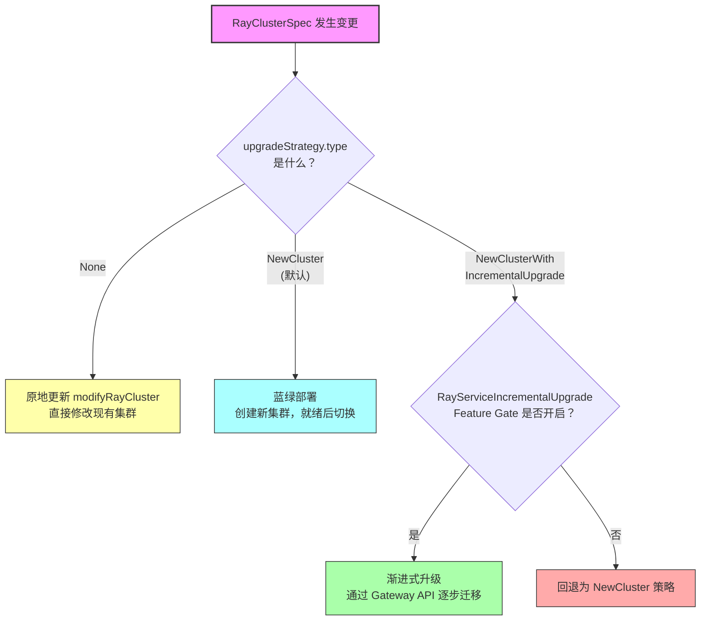
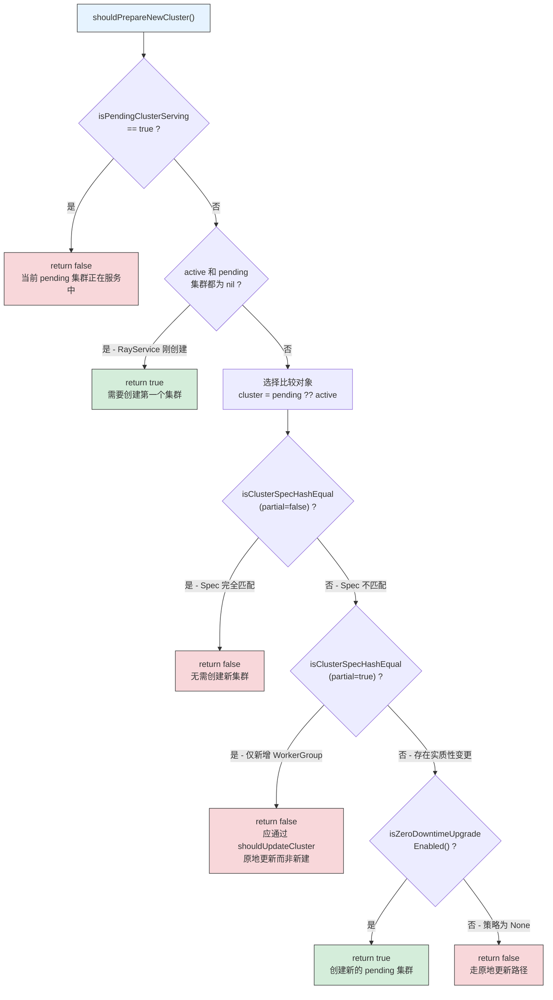
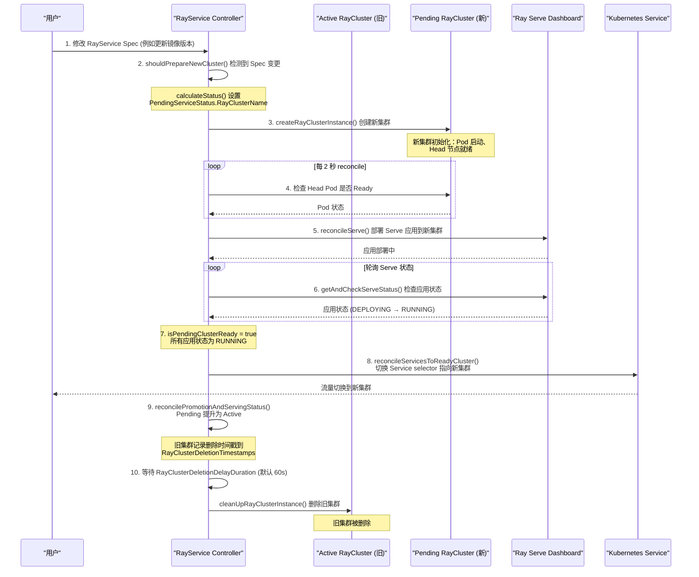
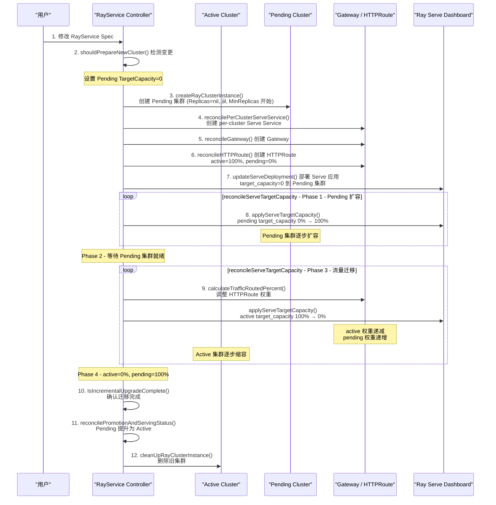
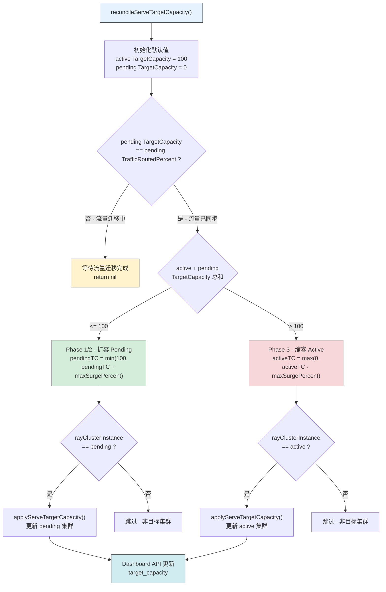

---

## 前置知识

在阅读本文之前，建议先了解以下内容：

| 前置知识 | 说明 | 参考资料 |
|---------|------|---------|
| RayService 基础概念 | 了解 RayService CRD 的基本结构和生命周期 | `ray-operator/apis/ray/v1/rayservice_types.go` |
| RayCluster Controller | 理解 RayCluster 的创建和管理流程 | `docs/deep-dive/02-raycluster-controller/` |
| Ray Serve | 理解 Ray Serve 的应用部署和 TargetCapacity 概念 | [Ray Serve 官方文档](https://docs.ray.io/en/latest/serve/) |
| Kubernetes Gateway API | 了解 Gateway、HTTPRoute 等资源的基本概念 | [Gateway API 官方文档](https://gateway-api.sigs.k8s.io/) |
| 蓝绿部署模式 | 了解传统蓝绿部署的基本原理 | - |

---

## 目录

- [1. UpgradeStrategy 概览](#1-upgradestrategy-概览)
- [2. shouldPrepareNewCluster 决策逻辑](#2-shouldpreparenewcluster-决策逻辑)
- [3. NewCluster 策略详解 - 传统蓝绿部署](#3-newcluster-策略详解---传统蓝绿部署)
- [4. NewClusterWithIncrementalUpgrade 策略详解](#4-newclusterwithIncrementalupgrade-策略详解)
- [5. ClusterUpgradeOptions 配置详解](#5-clusterupgradeoptions-配置详解)
- [6. Gateway API 资源管理](#6-gateway-api-资源管理)
- [7. Serve TargetCapacity 机制](#7-serve-targetcapacity-机制)
- [延伸阅读](#延伸阅读)
- [下一篇](#下一篇)

---

## 1. UpgradeStrategy 概览

RayService 提供了三种升级策略，通过 `spec.upgradeStrategy.type` 字段进行配置。这些策略决定了当 RayService 的 `RayClusterSpec` 发生变更时，控制器如何执行升级操作。

### 1.1 三种升级策略

**策略定义位于：** `ray-operator/apis/ray/v1/rayservice_types.go`

```go
type RayServiceUpgradeType string

const (
    // 渐进式升级 - 使用 Gateway API 逐步迁移流量（Alpha 特性）
    RayServiceNewClusterWithIncrementalUpgrade RayServiceUpgradeType = "NewClusterWithIncrementalUpgrade"
    // 传统蓝绿部署 - 创建新集群，就绪后一次性切换（默认策略）
    RayServiceNewCluster RayServiceUpgradeType = "NewCluster"
    // 无升级 - 仅执行原地更新
    RayServiceUpgradeNone RayServiceUpgradeType = "None"
)
```

### 1.2 策略对比

| 特性 | `None` | `NewCluster` (默认) | `NewClusterWithIncrementalUpgrade` |
|------|--------|---------------------|-------------------------------------|
| **停机时间** | 可能有停机 | 近零停机 | 真正零停机 |
| **资源开销** | 低（无额外集群） | 高（同时运行两个完整集群） | 中等（渐进式扩缩容） |
| **实现复杂度** | 低 | 中 | 高 |
| **流量切换方式** | 原地更新，无切换 | 一次性切换 Service selector | 通过 Gateway API 渐进式迁移 |
| **Feature Gate** | 无 | 无 | `RayServiceIncrementalUpgrade` (Alpha) |
| **适用场景** | 开发测试、GPU 资源受限 | 通用生产环境 | 大规模 LLM 推理服务、高可用要求 |
| **回滚能力** | 无 | 删除旧集群前可回滚 | 任意阶段可回滚 |

### 1.3 策略选择决策树



---

## 2. shouldPrepareNewCluster 决策逻辑

`shouldPrepareNewCluster()` 是升级流程的入口函数，它决定是否需要创建一个新的 pending RayCluster。

### 2.1 函数签名与位置

**文件：** `ray-operator/controllers/ray/rayservice_controller.go` (L1093-1115)

```go
func shouldPrepareNewCluster(
    ctx context.Context,
    rayServiceInstance *rayv1.RayService,
    activeRayCluster, pendingRayCluster *rayv1.RayCluster,
    isPendingClusterServing bool,
) bool
```

### 2.2 决策流程图



### 2.3 Hash 比较机制

控制器使用 `GenerateHashWithoutReplicasAndWorkersToDelete()` 函数计算 RayClusterSpec 的哈希值，用于判断 Spec 是否发生了实质性变更。

**文件：** `ray-operator/controllers/ray/utils/util.go` (L643-657)

```go
func GenerateHashWithoutReplicasAndWorkersToDelete(rayClusterSpec rayv1.RayClusterSpec) (string, error) {
    updatedRayClusterSpec := rayClusterSpec.DeepCopy()
    for i := 0; i < len(updatedRayClusterSpec.WorkerGroupSpecs); i++ {
        updatedRayClusterSpec.WorkerGroupSpecs[i].Replicas = nil
        updatedRayClusterSpec.WorkerGroupSpecs[i].MaxReplicas = nil
        updatedRayClusterSpec.WorkerGroupSpecs[i].MinReplicas = nil
        updatedRayClusterSpec.WorkerGroupSpecs[i].ScaleStrategy.WorkersToDelete = nil
    }
    updatedRayClusterSpec.UpgradeStrategy = nil
    return GenerateJsonHash(updatedRayClusterSpec)
}
```

**关键设计要点：**

- `Replicas`、`MaxReplicas`、`MinReplicas`、`WorkersToDelete` 字段的变更**不会**触发新集群创建，因为这些字段由 Autoscaler 动态调整
- `UpgradeStrategy` 字段的变更也**不会**触发新集群创建
- 仅当 RayClusterSpec 的其他字段（如镜像版本、资源配置、环境变量等）发生变更时才会触发

### 2.4 isZeroDowntimeUpgradeEnabled 判断逻辑

**文件：** `ray-operator/controllers/ray/rayservice_controller.go` (L577-605)

控制器通过以下优先级决定是否启用零停机升级：

1. **`spec.upgradeStrategy.type`** 字段优先级最高
   - `NewCluster` 或 `NewClusterWithIncrementalUpgrade` → 启用
   - `None` → 禁用
2. **`ENABLE_ZERO_DOWNTIME` 环境变量** 作为备选
   - 设为 `"false"` → 禁用
   - 其他值或未设置 → 启用（默认行为）

### 2.5 None 策略的原地更新路径

当升级策略为 `None` 时，控制器通过 `modifyRayCluster()` 函数直接修改现有集群：

**文件：** `ray-operator/controllers/ray/rayservice_controller.go` (L1120-1141)

```go
func modifyRayCluster(ctx context.Context, currentCluster, goalCluster *rayv1.RayCluster) {
    // 直接替换 Spec、Labels 和 Annotations
    currentCluster.Spec = goalCluster.Spec
    currentCluster.Labels = goalCluster.Labels
    currentCluster.Annotations = goalCluster.Annotations
}
```

> **注意：** 原地更新可能导致短暂的服务中断，因为 Ray 集群在更新过程中需要重启 Pod。这种方式适合开发测试环境或 GPU 资源受限无法同时运行两个集群的场景。

---

## 3. NewCluster 策略详解 - 传统蓝绿部署

`NewCluster` 是 RayService 的默认升级策略，实现了经典的蓝绿部署模式。在整个升级过程中，旧集群持续服务流量，直到新集群完全就绪后才执行一次性切换。

### 3.1 完整升级时序



### 3.2 各步骤详解

#### 步骤 1-2：变更检测

当用户更新 RayService 的 `spec.rayClusterConfig` 时，`shouldPrepareNewCluster()` 通过哈希比较检测到 Spec 变更，并在 `calculateStatus()` 中设置 `PendingServiceStatus.RayClusterName`：

```go
// ray-operator/controllers/ray/rayservice_controller.go (L428-452)
if shouldPrepareNewCluster(ctx, rayServiceInstance, activeCluster, pendingCluster, isPendingClusterServing) {
    rayServiceInstance.Status.PendingServiceStatus = rayv1.RayServiceStatus{
        RayClusterName: utils.GenerateRayClusterName(rayServiceInstance.Name),
    }
}
```

#### 步骤 3：创建新集群

`reconcileRayCluster()` 在检测到 `PendingServiceStatus.RayClusterName` 非空且对应的 RayCluster 不存在时，调用 `createRayClusterInstance()` 创建新集群：

```go
// ray-operator/controllers/ray/rayservice_controller.go (L904-907)
if rayServiceInstance.Status.PendingServiceStatus.RayClusterName != "" && pendingRayCluster == nil {
    logger.Info("Creating a new pending RayCluster instance")
    pendingRayCluster, err = r.createRayClusterInstance(ctx, rayServiceInstance)
    return activeRayCluster, pendingRayCluster, err
}
```

#### 步骤 4-6：Serve 应用部署与状态检查

控制器在 `reconcileServe()` 中完成以下操作：

1. 检查 Head Pod 是否 Running 且 Ready
2. 通过 Dashboard Client 调用 `UpdateDeployments()` 部署 Serve 应用
3. 通过 `getAndCheckServeStatus()` 持续轮询 Serve 应用状态

```go
// ray-operator/controllers/ray/rayservice_controller.go (L1465-1519)
func getAndCheckServeStatus(ctx context.Context, dashboardClient ...) (bool, map[string]rayv1.AppStatus, error) {
    serveAppStatuses, err := dashboardClient.GetMultiApplicationStatus(ctx)
    // ...
    isReady := true
    for appName, app := range serveAppStatuses {
        if app.Status != rayv1.ApplicationStatusEnum.RUNNING {
            isReady = false
        }
        // ...
    }
    return isReady, newApplications, nil
}
```

**只有当所有 Serve 应用状态都为 `RUNNING` 时，`isReady` 才为 `true`。**

#### 步骤 7-8：Service 切换

当 `isPendingClusterReady` 为 `true` 时，`reconcileServicesToReadyCluster()` 将 Kubernetes Head Service 和 Serve Service 的 selector 切换到新集群：

```go
// ray-operator/controllers/ray/rayservice_controller.go (L238-243)
if isPendingClusterReady && !isIncrementalUpgradeInProgress {
    targetCluster = pendingRayClusterInstance
    logMsg = "Reconciling K8s services to point to the pending Ray cluster..."
}
```

#### 步骤 9：Pending 提升为 Active

`reconcilePromotionAndServingStatus()` 检测到 Service 已经指向了 pending 集群，触发 promotion：

```go
// ray-operator/controllers/ray/rayservice_controller.go (L357-365)
if shouldPromote {
    rayServiceInstance.Status.ActiveServiceStatus = rayServiceInstance.Status.PendingServiceStatus
    rayServiceInstance.Status.PendingServiceStatus = rayv1.RayServiceStatus{}
}
```

#### 步骤 10：延迟删除旧集群

旧集群不会被立即删除，而是通过 `RayClusterDeletionTimestamps` 缓存一个删除时间戳：

```go
// ray-operator/controllers/ray/rayservice_controller.go (L946-996)
const RayClusterDeletionDelayDuration = 60 * time.Second

// 可通过 spec.rayClusterDeletionDelaySeconds 自定义延迟时间
deletionDelay := RayClusterDeletionDelayDuration
if rayServiceInstance.Spec.RayClusterDeletionDelaySeconds != nil {
    deletionDelay = time.Duration(*rayServiceInstance.Spec.RayClusterDeletionDelaySeconds) * time.Second
}
```

**设计考量：** 60 秒的延迟窗口允许：
- 正在处理的请求完成（优雅关闭）
- 出现问题时有时间回滚
- DNS 缓存刷新

---

## 4. NewClusterWithIncrementalUpgrade 策略详解

`NewClusterWithIncrementalUpgrade` 是 KubeRay 引入的高级零停机升级策略，利用 Kubernetes Gateway API 实现**真正的零停机**流量迁移。与传统蓝绿部署一次性切换不同，该策略通过渐进式扩缩容和流量迁移，确保在升级过程中服务始终可用。

### 4.1 前提条件

| 条件 | 说明 |
|------|------|
| Feature Gate | `RayServiceIncrementalUpgrade` 必须启用 (`--feature-gates=RayServiceIncrementalUpgrade=true`) |
| Gateway API CRDs | 集群中必须安装 Gateway API CRDs |
| Gateway Controller | 必须运行 Gateway 控制器（如 Envoy Gateway、Istio Gateway 等） |
| Autoscaler | RayClusterSpec 必须启用 Autoscaler（因为 TargetCapacity 依赖自动扩缩容） |

**Feature Gate 定义：** `ray-operator/pkg/features/features.go` (L41, L66)

```go
RayServiceIncrementalUpgrade featuregate.Feature = "RayServiceIncrementalUpgrade"

// 默认关闭，Alpha 阶段
RayServiceIncrementalUpgrade: {Default: false, PreRelease: featuregate.Alpha},
```

### 4.2 创建的额外资源

在渐进式升级模式下，控制器会创建以下额外的 Kubernetes 资源：

| 资源类型 | 名称模式 | 用途 |
|---------|---------|------|
| Per-Cluster Serve Service | `<ray-cluster-name>-serve-svc` | 每个集群独立的 Serve 服务，作为 HTTPRoute 的后端 |
| Gateway | `<ray-service-name>-gateway` | 网关资源，提供统一的流量入口 |
| HTTPRoute | `<ray-service-name>-httproute` | HTTP 路由规则，通过权重控制流量分配 |

### 4.3 渐进式升级时序



### 4.4 Pending 集群的特殊构造

在渐进式升级模式下，Pending 集群的构造与传统蓝绿部署不同：

**文件：** `ray-operator/controllers/ray/rayservice_controller.go` (L1181-1189)

```go
isPendingClusterForUpgrade := utils.IsIncrementalUpgradeEnabled(&rayService.Spec) &&
    rayService.Status.ActiveServiceStatus.RayClusterName != ""
if isPendingClusterForUpgrade {
    // 渐进式升级时，将 Replicas 设为 nil
    // 使其根据 target_capacity 从 MinReplicas 开始自动扩缩
    for i := range clusterSpec.WorkerGroupSpecs {
        clusterSpec.WorkerGroupSpecs[i].Replicas = nil
    }
}
```

**设计意图：** 将 `Replicas` 设为 `nil` 让新集群从 `MinReplicas` 开始，然后通过 `target_capacity` 机制逐步扩容到完整容量，避免一次性分配所有资源。

### 4.5 TargetCapacity 初始化

**文件：** `ray-operator/controllers/ray/rayservice_controller.go` (L435-451)

```go
if utils.IsIncrementalUpgradeEnabled(&rayServiceInstance.Spec) {
    if rayServiceInstance.Status.ActiveServiceStatus.RayClusterName == "" {
        // 首次创建（无 Active 集群），直接设置 100%
        if rayServiceInstance.Status.ActiveServiceStatus.TargetCapacity == nil {
            rayServiceInstance.Status.PendingServiceStatus.TargetCapacity = ptr.To(int32(100))
        }
    } else if meta.IsStatusConditionTrue(..., string(rayv1.UpgradeInProgress)) {
        // 升级过程中创建的 Pending 集群，从 0% 开始
        if rayServiceInstance.Status.PendingServiceStatus.TargetCapacity == nil {
            rayServiceInstance.Status.PendingServiceStatus.TargetCapacity = ptr.To(int32(0))
        }
    }
}
```

---

## 5. ClusterUpgradeOptions 配置详解

`ClusterUpgradeOptions` 结构体定义了渐进式升级的行为参数，仅在 `NewClusterWithIncrementalUpgrade` 策略下生效。

### 5.1 字段定义

**文件：** `ray-operator/apis/ray/v1/rayservice_types.go` (L64-75)

```go
type ClusterUpgradeOptions struct {
    // 每次迁移步骤中 TargetCapacity 的最大变化幅度
    // 默认值: 100 (一次性迁移全部容量)
    // +kubebuilder:default:=100
    MaxSurgePercent *int32 `json:"maxSurgePercent,omitempty"`

    // 每次 reconcile 周期中迁移的流量百分比
    StepSizePercent *int32 `json:"stepSizePercent"`

    // 两次流量迁移步骤之间的最小等待时间（秒）
    IntervalSeconds *int32 `json:"intervalSeconds"`

    // Gateway Controller 使用的 GatewayClass 名称
    GatewayClassName string `json:"gatewayClassName"`
}
```

### 5.2 参数详解

#### MaxSurgePercent

`MaxSurgePercent` 控制 TargetCapacity 的每步变化量。在 `reconcileServeTargetCapacity()` 中的使用如下：

```go
// ray-operator/controllers/ray/rayservice_controller.go (L1441-1455)
switch rayClusterInstance.Name {
case activeRayServiceStatus.RayClusterName:
    if activeTargetCapacity+pendingTargetCapacity > 100 {
        // 缩容 Active 集群
        goalTargetCapacity = max(int32(0), activeTargetCapacity-maxSurgePercent)
    }
case pendingRayServiceStatus.RayClusterName:
    if activeTargetCapacity+pendingTargetCapacity <= 100 {
        // 扩容 Pending 集群
        goalTargetCapacity = min(int32(100), pendingTargetCapacity+maxSurgePercent)
    }
}
```

#### StepSizePercent

`StepSizePercent` 控制每次 reconcile 周期中 HTTPRoute 权重的变化量：

```go
// ray-operator/controllers/ray/rayservice_controller.go (L724-728)
proposedPendingWeight := pendingClusterWeight + *options.StepSizePercent
pendingClusterWeight = min(100, proposedPendingWeight, pendingClusterTargetCapacity)
activeClusterWeight = 100 - pendingClusterWeight
```

#### IntervalSeconds

`IntervalSeconds` 确保两次流量迁移之间有足够的等待时间：

```go
// ray-operator/controllers/ray/rayservice_controller.go (L720-722)
interval := time.Duration(*options.IntervalSeconds) * time.Second
lastTrafficMigratedTime := pendingServiceStatus.LastTrafficMigratedTime
if lastTrafficMigratedTime == nil || time.Since(lastTrafficMigratedTime.Time) >= interval {
    // 执行流量迁移...
}
```

### 5.3 配置示例

#### 场景一 - 默认配置（快速迁移）

```yaml
spec:
  upgradeStrategy:
    type: NewClusterWithIncrementalUpgrade
    clusterUpgradeOptions:
      maxSurgePercent: 100
      stepSizePercent: 100
      intervalSeconds: 0
      gatewayClassName: "envoy-gateway"
```

**行为：** 类似于蓝绿部署但通过 Gateway 实现。Pending 集群一次性扩容到 100%，流量一次性迁移。

**容量变化时间线：**

| 步骤 | Active TargetCapacity | Pending TargetCapacity | Active 流量权重 | Pending 流量权重 |
|------|----------------------|----------------------|----------------|-----------------|
| 初始 | 100% | 0% | 100% | 0% |
| 第 1 步 | 100% | 100% | 0% | 100% |
| 第 2 步 | 0% | 100% | 0% | 100% |
| 完成 | 提升 Pending 为 Active | - | - | - |

#### 场景二 - 保守配置（渐进式迁移）

```yaml
spec:
  upgradeStrategy:
    type: NewClusterWithIncrementalUpgrade
    clusterUpgradeOptions:
      maxSurgePercent: 120
      stepSizePercent: 20
      intervalSeconds: 30
      gatewayClassName: "istio"
```

**行为：** 每 30 秒迁移 20% 的流量，最大总容量为 120%（Active + Pending）。

**容量变化时间线：**

| 时间 | Active TargetCapacity | Pending TargetCapacity | Active 流量 | Pending 流量 |
|------|----------------------|----------------------|------------|-------------|
| T+0s | 100% | 0% | 100% | 0% |
| T+30s | 100% | 20% | 80% | 20% |
| T+60s | 100% | 40% | 60% | 40% |
| T+90s | 100% | 60% | 40% | 60% |
| T+120s | 100% | 80% | 20% | 80% |
| T+150s | 100% | 100% | 0% | 100% |
| T+180s | 80% | 100% | 0% | 100% |
| ... | 递减 | 100% | 0% | 100% |
| 最终 | 0% | 100% | 0% | 100% |

> **注意：** 上述时间线是理想化的。实际迁移速度取决于 reconcile 周期（默认 2 秒）、Pod 启动时间、Serve 应用部署时间等因素。

---

## 6. Gateway API 资源管理

渐进式升级策略依赖 Kubernetes Gateway API 来实现细粒度的流量控制。本节详细分析控制器如何管理 Gateway 相关资源。

### 6.1 Gateway CR 管理

#### createGateway()

**文件：** `ray-operator/controllers/ray/rayservice_controller.go` (L608-634)

```go
func (r *RayServiceReconciler) createGateway(rayServiceInstance *rayv1.RayService) (*gwv1.Gateway, error) {
    options := utils.GetRayServiceClusterUpgradeOptions(&rayServiceInstance.Spec)
    gatewayName := rayServiceInstance.Name + "-gateway"

    rayServiceGateway := &gwv1.Gateway{
        ObjectMeta: metav1.ObjectMeta{
            Name:      gatewayName,
            Namespace: rayServiceInstance.Namespace,
        },
        Spec: gwv1.GatewaySpec{
            GatewayClassName: gwv1.ObjectName(options.GatewayClassName),
            Listeners: []gwv1.Listener{
                {
                    Name:     gwv1.SectionName(utils.GatewayListenerPortName), // "http"
                    Protocol: gwv1.HTTPProtocolType,
                    Port:     utils.DefaultGatewayListenerPort, // 80
                },
            },
        },
    }
    return rayServiceGateway, nil
}
```

**Gateway 资源结构：**
- 名称格式：`<RayService 名称>-gateway`
- GatewayClass 由 `clusterUpgradeOptions.gatewayClassName` 指定
- 默认监听 HTTP 协议的 80 端口

#### reconcileGateway()

**文件：** `ray-operator/controllers/ray/rayservice_controller.go` (L638-684)

`reconcileGateway()` 实现了标准的 Kubernetes 资源协调逻辑：

1. 构建期望的 Gateway 对象
2. 尝试获取已存在的 Gateway
3. 如果不存在，设置 OwnerReference 后创建
4. 如果存在但 Spec 不同，执行更新

### 6.2 HTTPRoute CR 管理

#### createHTTPRoute()

**文件：** `ray-operator/controllers/ray/rayservice_controller.go` (L743-838)

`createHTTPRoute()` 是流量管理的核心函数，它构建 HTTPRoute 对象，配置到 Active 和 Pending 集群 Serve 服务的加权路由：

```go
func (r *RayServiceReconciler) createHTTPRoute(ctx context.Context,
    rayServiceInstance *rayv1.RayService, isPendingClusterReady bool) (*gwv1.HTTPRoute, error) {

    // 1. 获取 Gateway 实例
    gatewayInstance := &gwv1.Gateway{}
    r.Get(ctx, common.RayServiceGatewayNamespacedName(rayServiceInstance), gatewayInstance)

    // 2. 获取 Active 和 Pending RayCluster
    activeRayCluster, _ := r.getRayClusterByNamespacedName(ctx, ...)
    pendingRayCluster, _ := r.getRayClusterByNamespacedName(ctx, ...)

    // 3. 计算流量权重
    activeClusterWeight, pendingClusterWeight, _ :=
        r.calculateTrafficRoutedPercent(ctx, rayServiceInstance, isPendingClusterReady)

    // 4. 构建 BackendRefs
    backendRefs := []gwv1.HTTPBackendRef{
        {
            BackendRef: gwv1.BackendRef{
                BackendObjectReference: gwv1.BackendObjectReference{
                    Name: gwv1.ObjectName(activeClusterServeSvcName),
                    Port: ptr.To(activeServePort),
                },
                Weight: ptr.To(activeClusterWeight),
            },
        },
    }

    // 如果 Pending 集群存在，添加到 BackendRefs
    if pendingRayCluster != nil {
        backendRefs = append(backendRefs, gwv1.HTTPBackendRef{...})
    }

    // 5. 构建 HTTPRoute
    desiredHTTPRoute := &gwv1.HTTPRoute{
        Spec: gwv1.HTTPRouteSpec{
            CommonRouteSpec: gwv1.CommonRouteSpec{
                ParentRefs: []gwv1.ParentReference{{Name: gatewayInstance.Name}},
            },
            Rules: []gwv1.HTTPRouteRule{{
                Matches: []gwv1.HTTPRouteMatch{{
                    Path: &gwv1.HTTPPathMatch{
                        Type:  ptr.To(gwv1.PathMatchPathPrefix),
                        Value: ptr.To("/"),
                    },
                }},
                BackendRefs: backendRefs,
            }},
        },
    }
    return desiredHTTPRoute, nil
}
```

### 6.3 流量权重计算

#### calculateTrafficRoutedPercent()

**文件：** `ray-operator/controllers/ray/rayservice_controller.go` (L694-732)

该函数负责根据当前升级进度计算 HTTPRoute 中的流量权重分配：

```go
func (r *RayServiceReconciler) calculateTrafficRoutedPercent(ctx context.Context,
    rayServiceInstance *rayv1.RayService, isPendingClusterReady bool) (
    activeClusterWeight, pendingClusterWeight int32, err error) {

    // 默认: active=100%, pending=0%
    activeClusterWeight = ptr.Deref(activeServiceStatus.TrafficRoutedPercent, 100)
    pendingClusterWeight = ptr.Deref(pendingServiceStatus.TrafficRoutedPercent, 0)

    if isPendingClusterReady {
        // 检查流量是否已达到 TargetCapacity 上限
        pendingClusterTargetCapacity := ptr.Deref(pendingServiceStatus.TargetCapacity, 0)
        if pendingClusterWeight == pendingClusterTargetCapacity {
            return // 已达上限，停止迁移
        }

        // 检查时间间隔
        interval := time.Duration(*options.IntervalSeconds) * time.Second
        if lastTrafficMigratedTime == nil || time.Since(lastTrafficMigratedTime.Time) >= interval {
            // 按 StepSizePercent 迁移流量
            proposedPendingWeight := pendingClusterWeight + *options.StepSizePercent
            pendingClusterWeight = min(100, proposedPendingWeight, pendingClusterTargetCapacity)
            activeClusterWeight = 100 - pendingClusterWeight
        }
    }

    return activeClusterWeight, pendingClusterWeight, nil
}
```

**核心设计约束：**
- `activeClusterWeight + pendingClusterWeight` 始终等于 100
- `pendingClusterWeight` 不会超过 `pendingClusterTargetCapacity`（确保流量不超过集群实际容量）
- 迁移速度受 `IntervalSeconds` 和 `StepSizePercent` 两个参数控制

### 6.4 Per-Cluster Serve Service

**文件：** `ray-operator/controllers/ray/rayservice_controller.go` (L1894-1923)

在渐进式升级中，每个 RayCluster 需要独立的 Serve Service 作为 HTTPRoute 的后端目标：

```go
func (r *RayServiceReconciler) reconcilePerClusterServeService(ctx context.Context,
    rayServiceInstance *rayv1.RayService, rayClusterInstance *rayv1.RayCluster) error {

    if rayClusterInstance == nil {
        return nil
    }
    // 构建 per-cluster Serve Service
    desiredSvc, err := common.BuildServeService(ctx, *rayServiceInstance, *rayClusterInstance, true)
    // OwnerReference 设置为 RayCluster（而非 RayService），
    // 确保集群删除时 Service 自动清理
    ctrl.SetControllerReference(rayClusterInstance, desiredSvc, r.Scheme)

    // 创建或跳过（已存在）
    existingSvc := &corev1.Service{}
    err = r.Get(ctx, client.ObjectKey{...}, existingSvc)
    if errors.IsNotFound(err) {
        return r.Create(ctx, desiredSvc)
    }
    return err
}
```

---

## 7. Serve TargetCapacity 机制

`TargetCapacity` 是 Ray Serve 的原生功能，它控制集群中 Serve 副本的缩放比例。KubeRay 利用这一机制实现了渐进式升级中的容量管理。

### 7.1 TargetCapacity 概念

Ray Serve 的 `target_capacity` 是一个 0-100 的整数值，用于按比例缩放所有 Serve Deployment 的副本数：

- `target_capacity = 100` → 所有 Deployment 按照配置的 `num_replicas` 运行
- `target_capacity = 50` → 所有 Deployment 运行约 50% 的副本
- `target_capacity = 0` → 所有 Deployment 缩容到最小

### 7.2 reconcileServeTargetCapacity 状态机

**文件：** `ray-operator/controllers/ray/rayservice_controller.go` (L1397-1463)

`reconcileServeTargetCapacity()` 实现了渐进式升级的核心状态机，管理 Active 和 Pending 集群之间的容量转移：



### 7.3 checkIfNeedTargetCapacityUpdate 四阶段检查

**文件：** `ray-operator/controllers/ray/rayservice_controller.go` (L1302-1344)

该函数判断是否需要调整 `target_capacity`，实现了四阶段的完成度检查：

```go
func (r *RayServiceReconciler) checkIfNeedTargetCapacityUpdate(ctx context.Context,
    rayServiceInstance *rayv1.RayService) (bool, string) {

    // 前置条件检查
    // - Active 和 Pending 集群都必须存在
    // - Gateway 和 HTTPRoute 必须就绪

    activeTargetCapacity := int(*activeRayServiceStatus.TargetCapacity)
    pendingTargetCapacity := int(*pendingRayServiceStatus.TargetCapacity)
    pendingTrafficRoutedPercent := int(*pendingRayServiceStatus.TrafficRoutedPercent)

    // Phase 4: 升级完成 - active=0%, pending=100%
    if activeTargetCapacity == 0 && pendingTargetCapacity == 100 {
        return false, "All traffic has migrated..."
    }

    // Phase 1/2: Pending 集群尚未完成扩容或流量迁移
    if pendingTargetCapacity < 100 || pendingTrafficRoutedPercent < 100 {
        return true, "Pending RayCluster has not finished scaling up."
    }

    // Phase 3: Active 集群尚未完成缩容
    return true, "Active RayCluster TargetCapacity has not finished scaling down."
}
```

**四阶段对应关系（参考 [REP 设计文档](https://github.com/ray-project/enhancements/blob/main/reps/2024-12-4-ray-service-incr-upgrade.md)）：**

| 阶段 | 描述 | Active TC | Pending TC | Pending Traffic | 返回值 |
|------|------|-----------|------------|-----------------|--------|
| Phase 1 | Pending 集群扩容 | 100% | 0% → 100% | 0% | `(true, "scaling up")` |
| Phase 2 | 流量迁移到 Pending | 100% | 100% | 0% → 100% | `(true, "scaling up")` |
| Phase 3 | Active 集群缩容 | 100% → 0% | 100% | 100% | `(true, "scaling down")` |
| Phase 4 | 升级完成 | 0% | 100% | 100% | `(false, "complete")` |

### 7.4 applyServeTargetCapacity - Dashboard API 调用

**文件：** `ray-operator/controllers/ray/rayservice_controller.go` (L1346-1395)

该函数通过 Ray Dashboard API 更新指定 RayCluster 的 `target_capacity`：

```go
func (r *RayServiceReconciler) applyServeTargetCapacity(ctx context.Context,
    rayServiceInstance *rayv1.RayService, rayClusterInstance *rayv1.RayCluster,
    rayDashboardClient dashboardclient.RayDashboardClientInterface,
    goalTargetCapacity int32) error {

    // 1. 获取缓存的 ServeConfig
    cachedConfig := r.getServeConfigFromCache(rayServiceInstance, rayClusterInstance.Name)

    // 2. 反序列化为 map
    serveConfig := make(map[string]any)
    yaml.Unmarshal([]byte(cachedConfig), &serveConfig)

    // 3. 检查是否需要更新
    if currentTargetCapacity, ok := serveConfig["target_capacity"].(float64); ok {
        if int32(currentTargetCapacity) == goalTargetCapacity {
            return nil // 已经是目标值，无需更新
        }
    }

    // 4. 设置新的 target_capacity 并发送到 Dashboard
    serveConfig["target_capacity"] = goalTargetCapacity
    configJson, _ := json.Marshal(serveConfig)
    rayDashboardClient.UpdateDeployments(ctx, configJson)

    // 5. 更新 Status 中的 TargetCapacity
    switch rayClusterInstance.Name {
    case rayServiceInstance.Status.ActiveServiceStatus.RayClusterName:
        rayServiceInstance.Status.ActiveServiceStatus.TargetCapacity = ptr.To(goalTargetCapacity)
    case rayServiceInstance.Status.PendingServiceStatus.RayClusterName:
        rayServiceInstance.Status.PendingServiceStatus.TargetCapacity = ptr.To(goalTargetCapacity)
    }
    return nil
}
```

**Dashboard API 调用路径：** `PUT /api/serve/applications/` 请求体中包含 `target_capacity` 字段。

### 7.5 Serve 配置提交与缓存机制

控制器使用 LRU 缓存来避免重复提交相同的 Serve 配置：

**文件：** `ray-operator/controllers/ray/rayservice_controller.go` (L1209-1228)

```go
func checkIfNeedSubmitServeApplications(cachedServeConfigV2 string,
    serveConfigV2 string, serveApplications map[string]rayv1.AppStatus) (bool, string) {

    // 1. 首次部署 - 缓存为空
    if cachedServeConfigV2 == "" {
        return true, "Nothing has been cached for the cluster."
    }

    // 2. Head Pod 崩溃且未启用 GCS FT
    if len(serveApplications) == 0 {
        return true, "No Serve application found in the RayCluster."
    }

    // 3. 配置发生变更
    if cachedServeConfigV2 != serveConfigV2 {
        return true, "Current V2 Serve config doesn't match cached Serve config."
    }

    return false, "Current V2 Serve config matches cached Serve config."
}
```

在渐进式升级期间，Active 集群的 Serve 配置更新被阻止：

```go
// ray-operator/controllers/ray/rayservice_controller.go (L1653-1657)
if isActiveCluster && isIncrementalUpgradeInProgress {
    skipConfigUpdate = true
    logger.Info("Blocking new Serve config submission for Active cluster during upgrade.")
}
```

### 7.6 升级完成判定

**文件：** `ray-operator/controllers/ray/utils/util.go` (L812-817)

```go
func IsIncrementalUpgradeComplete(rayServiceInstance *rayv1.RayService,
    pendingCluster *rayv1.RayCluster) bool {
    return pendingCluster != nil &&
        ptr.Deref(rayServiceInstance.Status.ActiveServiceStatus.TargetCapacity, -1) == 0 &&
        ptr.Deref(rayServiceInstance.Status.PendingServiceStatus.TrafficRoutedPercent, -1) == 100
}
```

升级完成的条件是：
1. Pending 集群存在
2. Active 集群的 `TargetCapacity` 降为 0
3. Pending 集群的 `TrafficRoutedPercent` 达到 100

在 `reconcilePromotionAndServingStatus()` 中，渐进式升级的 promotion 逻辑：

```go
// ray-operator/controllers/ray/rayservice_controller.go (L338-349)
if utils.IsIncrementalUpgradeEnabled(&rayServiceInstance.Spec) {
    if meta.IsStatusConditionTrue(..., string(rayv1.UpgradeInProgress)) {
        if utils.IsIncrementalUpgradeComplete(rayServiceInstance, pendingCluster) {
            shouldPromote = true
            logger.Info("Incremental upgrade completed, triggering promotion.")
        }
    }
}
```

---

## 附录 A - Condition 状态管理

RayService 使用两个 Condition 来追踪升级状态：

| Condition | Type | 含义 |
|-----------|------|------|
| `RayServiceReady` | `Ready` | RayService 是否就绪，可以处理请求 |
| `UpgradeInProgress` | `UpgradeInProgress` | 是否正在进行零停机升级 |

**状态转换逻辑：** `ray-operator/controllers/ray/rayservice_controller.go` (L494-527)

```go
func calculateConditions(ctx context.Context, r *RayServiceReconciler,
    rayServiceInstance *rayv1.RayService) {

    // Ready 条件：基于 Serve Endpoint 数量
    if rayServiceInstance.Status.NumServeEndpoints > 0 {
        setCondition(rayServiceInstance, rayv1.RayServiceReady, metav1.ConditionTrue, ...)
    }

    // UpgradeInProgress 条件：基于 Active 和 Pending 集群是否共存
    if activeClusterName != "" && pendingClusterName != "" {
        setCondition(rayServiceInstance, rayv1.UpgradeInProgress, metav1.ConditionTrue,
            rayv1.BothActivePendingClustersExist, "Both active and pending Ray clusters exist")
    } else if activeClusterName != "" {
        setCondition(rayServiceInstance, rayv1.UpgradeInProgress, metav1.ConditionFalse,
            rayv1.NoPendingCluster, "Active Ray cluster exists and no pending Ray cluster")
    }
}
```

---

## 附录 B - 关键常量与配置

| 常量 / 配置 | 值 | 文件位置 | 说明 |
|------------|---|---------|------|
| `ServiceDefaultRequeueDuration` | `2s` | `rayservice_controller.go:47` | 默认 reconcile 重新入队间隔 |
| `RayClusterDeletionDelayDuration` | `60s` | `rayservice_controller.go:48` | 旧集群删除延迟 |
| `GatewayListenerPortName` | `"http"` | `constant.go:115` | Gateway 监听器端口名 |
| `DefaultGatewayListenerPort` | `80` | `constant.go:116` | Gateway 默认监听端口 |
| Feature Gate `RayServiceIncrementalUpgrade` | `Default: false` | `features.go:41,66` | 渐进式升级特性开关 |

---

## 附录 C - 关键源码文件索引

| 文件路径 | 内容 |
|---------|------|
| `ray-operator/controllers/ray/rayservice_controller.go` | RayService Controller 主逻辑 |
| `ray-operator/apis/ray/v1/rayservice_types.go` | RayService CRD 类型定义 |
| `ray-operator/controllers/ray/utils/util.go` | 工具函数（Hash、Gateway 辅助等） |
| `ray-operator/controllers/ray/utils/constant.go` | 常量定义 |
| `ray-operator/controllers/ray/utils/validation.go` | 验证逻辑（含 ClusterUpgradeOptions 验证） |
| `ray-operator/pkg/features/features.go` | Feature Gate 定义 |
| `ray-operator/controllers/ray/common/` | 公共构建函数（Service、RayCluster 等） |
| `ray-operator/controllers/ray/utils/dashboardclient/` | Dashboard API 客户端 |

---

## 延伸阅读

- [Ray Enhancement Proposal - RayService Incremental Upgrade](https://github.com/ray-project/enhancements/blob/main/reps/2024-12-4-ray-service-incr-upgrade.md) - 渐进式升级的设计文档
- [Kubernetes Gateway API 文档](https://gateway-api.sigs.k8s.io/) - Gateway API 的官方规范和使用指南
- [Ray Serve TargetCapacity 文档](https://docs.ray.io/en/latest/serve/advanced-guides/advanced-autoscaling.html) - Ray Serve 中 TargetCapacity 的使用说明
- [KubeRay RayService 故障排查指南](https://docs.ray.io/en/master/cluster/kubernetes/troubleshooting/rayservice-troubleshooting.html) - 官方故障排查文档
- [Envoy Gateway 安装指南](https://gateway.envoyproxy.io/) - 推荐的 Gateway Controller 之一

---

## 下一篇

[RayService 调试指南](./03-debug-guide-rayservice.md) - 详解 RayService 在各种升级场景下的调试方法，包括日志分析、状态诊断和常见问题排查。
