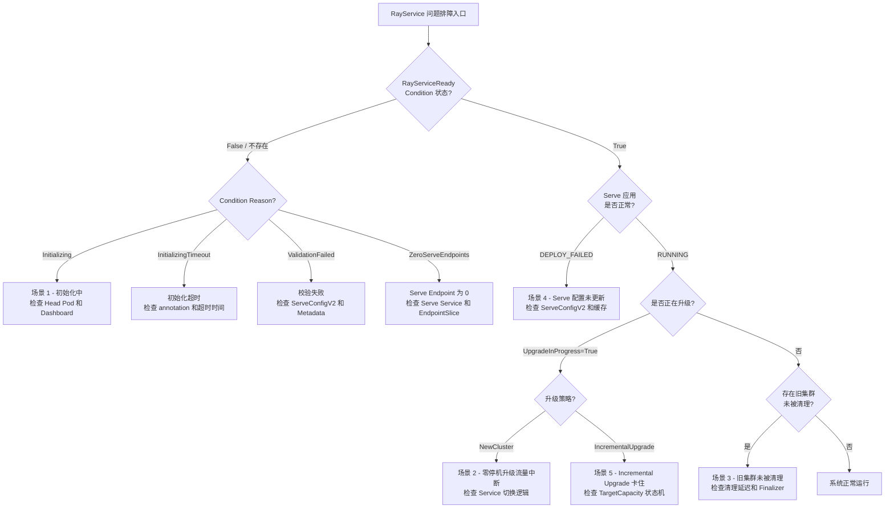
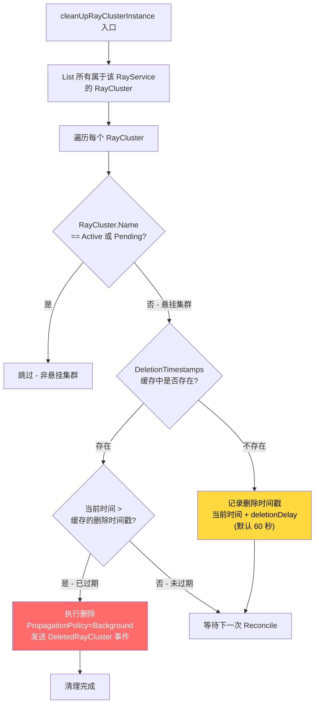
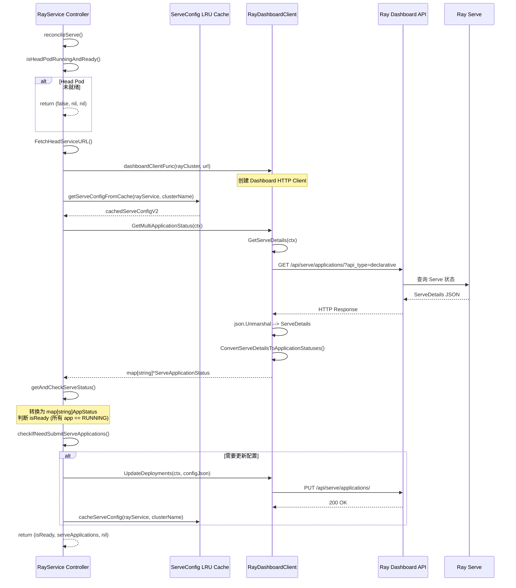

---

## 前置知识

在开始本指南之前，请确保你已具备以下环境和知识储备：

| 条件 | 说明 | 最低版本 |
|------|------|----------|
| Go 开发环境 | 编译和调试 KubeRay Operator | Go 1.22+ |
| Kubernetes 集群 | Kind 或 Minikube 均可 | v1.26+ |
| kubectl | 集群管理工具 | 与集群版本匹配 |
| IDE | VSCode 或 GoLand，支持 Go 远程调试 | 最新版 |
| controller-runtime 基础 | 理解 Reconcile 循环、client.Client 接口 | - |
| Ray Serve 基础 | 理解 Serve Application / Deployment 概念 | Ray 2.9+ |
| Gateway API CRDs (可选) | 测试 Incremental Upgrade 功能 | v1.0+ |

---

## 目录

- [1. 调试环境搭建](#1-调试环境搭建)
- [2. 五个常见问题代码链路追踪](#2-五个常见问题代码链路追踪)
- [3. HTTP Proxy Client 分析](#3-http-proxy-client-分析)
- [4. Serve 应用状态查询链路](#4-serve-应用状态查询链路)
- [5. Event 事件含义解读](#5-event-事件含义解读)
- [6. 源码断点位置建议](#6-源码断点位置建议)
- [延伸阅读](#延伸阅读)

---

## 1. 调试环境搭建

### 1.1 本地集群创建

使用 Kind 创建一个测试集群：

```bash
# 创建 Kind 集群
kind create cluster --name rayservice-debug --image kindest/node:v1.30.0

# 验证集群就绪
kubectl cluster-info --context kind-rayservice-debug
```

如果使用 Minikube：

```bash
minikube start --cpus=4 --memory=8192 --kubernetes-version=v1.30.0
```

### 1.2 安装 CRD 和依赖

```bash
# 进入 ray-operator 目录
cd ray-operator

# 安装 KubeRay CRDs
make install

# (可选) 安装 Gateway API CRDs - 用于测试 Incremental Upgrade
kubectl apply -f https://github.com/kubernetes-sigs/gateway-api/releases/download/v1.0.0/standard-install.yaml
```

### 1.3 本地运行 Operator

最直接的调试方式是在本地直接运行 Operator 进程：

```bash
# 不带 feature gate
go run ./main.go

# 启用 Incremental Upgrade feature gate
go run ./main.go -feature-gates=RayServiceIncrementalUpgrade=true

# 启用多个 feature gate
go run ./main.go \
  -feature-gates=RayServiceIncrementalUpgrade=true,RayClusterStatusConditions=true
```

### 1.4 VSCode 调试配置

在 `.vscode/launch.json` 中添加如下配置：

```json
{
  "version": "0.2.0",
  "configurations": [
    {
      "name": "Debug RayService Controller",
      "type": "go",
      "request": "launch",
      "mode": "auto",
      "program": "${workspaceFolder}/ray-operator/main.go",
      "args": [
        "-feature-gates=RayServiceIncrementalUpgrade=true"
      ],
      "env": {
        "KUBECONFIG": "${env:HOME}/.kube/config",
        "ENABLE_ZERO_DOWNTIME": "true"
      }
    }
  ]
}
```

### 1.5 GoLand 调试配置

1. 打开 **Run > Edit Configurations**
2. 新建 **Go Build** 配置
3. **Package path**: `github.com/ray-project/kuberay/ray-operator`
4. **Program arguments**: `-feature-gates=RayServiceIncrementalUpgrade=true`
5. **Environment**: `KUBECONFIG=/path/to/.kube/config`

### 1.6 关键 kubectl 调试命令

```bash
# 查看 RayService 状态概览
kubectl get rayservice <name> -o yaml

# 查看 RayService 的 Conditions
kubectl get rayservice <name> -o jsonpath='{.status.conditions}' | jq

# 查看关联的 RayCluster
kubectl get raycluster -l ray.io/originated-from-cr-name=<rayservice-name>

# 查看 RayService 事件
kubectl describe rayservice <name>

# 查看 Head Pod 日志
kubectl logs -l ray.io/cluster=<cluster-name>,ray.io/node-type=head -c ray-head

# 查看 serve label 状态
kubectl get pods -l ray.io/cluster=<cluster-name> \
  -o custom-columns='NAME:.metadata.name,SERVE:.metadata.labels.ray\.io/serve'

# 查看 EndpointSlice（确认 serve endpoint 数量）
kubectl get endpointslice -l kubernetes.io/service-name=<rayservice-name>-serve-svc

# 查看 Gateway 和 HTTPRoute（Incremental Upgrade）
kubectl get gateway,httproute -l app.kubernetes.io/created-by=kuberay-operator
```

---

## 2. 五个常见问题代码链路追踪

### 问题排障决策树

在开始具体场景分析之前，先通过以下决策树快速定位问题所在区域：



---

### 场景 1 - RayService 始终处于 NotReady 状态

**现象**: `kubectl get rayservice` 输出中 `service status` 列始终为空（即 `NotRunning`），或者 Condition `Ready` 为 `False`。

**核心链路追踪**:

RayService 的 Ready 状态由 `calculateConditions()` 函数决定，其判定逻辑位于:

> **文件**: `ray-operator/controllers/ray/rayservice_controller.go` L494-L527

```go
// calculateConditions 的核心判断
func calculateConditions(ctx context.Context, r *RayServiceReconciler, rayServiceInstance *rayv1.RayService) {
    // 1. 初始化状态：首次创建时设为 Initializing
    if len(rayServiceInstance.Status.Conditions) == 0 {
        setCondition(rayServiceInstance, rayv1.RayServiceReady,
            metav1.ConditionFalse, rayv1.RayServiceInitializing, "RayService is initializing")
    }

    // 2. 核心判定：NumServeEndpoints > 0 才标记为 Ready
    if rayServiceInstance.Status.NumServeEndpoints > 0 {
        setCondition(rayServiceInstance, rayv1.RayServiceReady,
            metav1.ConditionTrue, rayv1.NonZeroServeEndpoints, ...)
    } else if meta.IsStatusConditionTrue(...) {
        setCondition(rayServiceInstance, rayv1.RayServiceReady,
            metav1.ConditionFalse, rayv1.ZeroServeEndpoints, ...)
    }
}
```

Ready 的核心依赖条件链：

1. **Active RayCluster 存在** -- `reconcileRayCluster()` 成功创建或获取集群
2. **Head Pod Running & Ready** -- `isHeadPodRunningAndReady()` (L1790-L1798) 或者 `HeadPodReady` Condition 为 True
3. **Dashboard 可访问** -- `FetchHeadServiceURL()` 获取 Dashboard URL 成功
4. **Serve Application 状态为 RUNNING** -- `getAndCheckServeStatus()` 返回 `isReady=true`
5. **Serve Endpoint 数量 > 0** -- `calculateNumServeEndpointsFromSlices()` (L1747-L1787)

**调试步骤**:

```bash
# Step 1: 检查 RayCluster 是否已创建
kubectl get raycluster -l ray.io/originated-from-cr-name=<name>

# Step 2: 检查 Head Pod 状态
kubectl get pod -l ray.io/node-type=head,ray.io/cluster=<cluster-name>

# Step 3: 验证 Dashboard 是否可达
kubectl port-forward svc/<cluster-name>-head-svc 8265:8265
curl http://localhost:8265/api/serve/applications/?api_type=declarative

# Step 4: 检查 Serve Endpoints
kubectl get endpointslice -l kubernetes.io/service-name=<name>-serve-svc
```

**常见原因总结**:

| 原因 | 检查方法 | 对应代码位置 |
|------|----------|------------|
| Head Pod 未就绪 | `kubectl describe pod <head-pod>` | `isHeadPodRunningAndReady()` L1790 |
| Dashboard 不可达 | `kubectl port-forward` + `curl` | `FetchHeadServiceURL()` L1639 |
| Serve 部署失败 | Dashboard UI `/serve` 页面 | `getAndCheckServeStatus()` L1471 |
| Serve Endpoint 为 0 | 检查 EndpointSlice | `calculateNumServeEndpointsFromSlices()` L1747 |
| ServeConfigV2 格式错误 | 检查 Event `FailedToUpdateServeApplications` | `updateServeDeployment()` L1230 |

---

### 场景 2 - 零停机升级过程中流量中断

**现象**: 更新 RayService 的 `RayClusterSpec` 后，在升级过程中出现短暂的请求失败。

**核心链路追踪**:

流量切换的关键函数是 `reconcileServicesToReadyCluster()`，该函数决定 K8s Service 指向哪个 RayCluster：

> **文件**: `ray-operator/controllers/ray/rayservice_controller.go` L301-L312

```go
func (r *RayServiceReconciler) reconcileServicesToReadyCluster(ctx context.Context,
    rayServiceInstance *rayv1.RayService,
    rayClusterInstance *rayv1.RayCluster) (*corev1.Service, *corev1.Service, error) {

    headSvc, err := r.reconcileServices(ctx, rayServiceInstance, rayClusterInstance, utils.HeadService)
    serveSvc, err := r.reconcileServices(ctx, rayServiceInstance, rayClusterInstance, utils.ServingService)
    return headSvc, serveSvc, nil
}
```

**NewCluster 策略下的切换逻辑** (L233-L255):

```go
// 只有当 isPendingClusterReady 为 true 且不是 IncrementalUpgrade 时才切换
if isPendingClusterReady && !isIncrementalUpgradeInProgress {
    targetCluster = pendingRayClusterInstance
    logMsg = "Reconciling K8s services to point to the pending Ray cluster..."
}
```

`isPendingClusterReady` 的判定来源于 `reconcileServe()` 的返回值，它要求 pending 集群上 **所有** Serve Application 的 Status 都为 `RUNNING`。

**Incremental Upgrade 策略下的流量迁移**:

Incremental Upgrade 使用 HTTPRoute 的权重来控制流量分配，而非直接切换 K8s Service 的 Selector。流量通过 `calculateTrafficRoutedPercent()` (L694-L731) 逐步从 active 迁移到 pending 集群。

**常见原因总结**:

| 原因 | 检查方法 | 说明 |
|------|----------|------|
| Pending 集群 Serve 部署失败 | `kubectl describe rayservice` 查看 `pendingServiceStatus.applicationStatuses` | Serve 应用未达到 RUNNING 状态 |
| Pending 集群 Head Pod 未就绪 | 检查 pending 集群 Head Pod | Dashboard 不可访问，无法部署 Serve |
| Service 切换后端口映射异常 | `kubectl get svc -o yaml` | ClusterIP 或 Port 不一致 |
| Incremental Upgrade 的 HTTPRoute 权重未更新 | `kubectl get httproute -o yaml` | 检查 `backendRefs` 中的 `weight` 字段 |

---

### 场景 3 - 旧集群未被清理

**现象**: 升级完成后，旧的 RayCluster 仍然存在，资源未释放。

**核心链路追踪**:

清理逻辑位于 `cleanUpRayClusterInstance()` (L945-L996)，它是 Reconcile 主循环中较早被调用的函数：

> **文件**: `ray-operator/controllers/ray/rayservice_controller.go` L945-L996



核心代码片段：

```go
// 判断集群是否为"悬挂"集群（既不是 active 也不是 pending）
if rayClusterInstance.Name != rayServiceInstance.Status.ActiveServiceStatus.RayClusterName &&
   rayClusterInstance.Name != rayServiceInstance.Status.PendingServiceStatus.RayClusterName {
    // 这是一个悬挂集群，需要清理
    cachedTimestamp, exists := r.RayClusterDeletionTimestamps.Get(rayClusterInstance.Name)
    if !exists {
        // 首次发现，设置延迟删除时间戳
        deletionTimestamp := metav1.Now().Add(deletionDelay)
        r.RayClusterDeletionTimestamps.Set(rayClusterInstance.Name, deletionTimestamp)
    } else if time.Now().After(cachedTimestamp) {
        // 延迟时间已到，执行删除
        r.Delete(ctx, &rayClusterInstance, client.PropagationPolicy(metav1.DeletePropagationBackground))
    }
}
```

**删除延迟机制说明**:

- 默认延迟: `60` 秒 (由常量 `RayClusterDeletionDelayDuration` 定义)
- 可配置: 通过 `RayService.Spec.RayClusterDeletionDelaySeconds` 自定义
- 时间戳存储: 使用 `ConcurrentMap[string, time.Time]` 内存缓存，**Operator 重启后丢失**
- 删除策略: 使用 `metav1.DeletePropagationBackground` 后台级联删除

**常见原因总结**:

| 原因 | 检查方法 | 说明 |
|------|----------|------|
| Finalizer 阻塞 | `kubectl get raycluster <name> -o jsonpath='{.metadata.finalizers}'` | 第三方 controller 添加的 Finalizer 未释放 |
| Namespace Terminating | `kubectl get ns <namespace>` | Namespace 处于 Terminating 状态 |
| Operator 重启 | 检查 Operator Pod 重启次数 | 内存中的 DeletionTimestamp 丢失，重新计时 |
| Active/Pending 状态异常 | `kubectl get rayservice -o yaml` 查看 status | 旧集群名仍残留在 status 中 |
| deletionDelay 过长 | 检查 `spec.rayClusterDeletionDelaySeconds` | 配置值过大导致等待时间过长 |

---

### 场景 4 - Serve 配置未更新

**现象**: 修改了 `ServeConfigV2` 字段后，Ray Cluster 上的 Serve Application 没有更新。

**核心链路追踪**:

Serve 配置更新的入口在 `reconcileServe()` (L1612-L1689)，关键判断函数是 `checkIfNeedSubmitServeApplications()` (L1209-L1228):

> **文件**: `ray-operator/controllers/ray/rayservice_controller.go` L1209-L1228

```go
func checkIfNeedSubmitServeApplications(
    cachedServeConfigV2 string,  // 缓存中的配置
    serveConfigV2 string,        // 期望的配置 (spec.ServeConfigV2)
    serveApplications map[string]rayv1.AppStatus,  // 当前运行的应用
) (bool, string) {
    // Case 1: 缓存为空 --> 需要更新
    if cachedServeConfigV2 == "" {
        return true, "Nothing has been cached for the cluster."
    }
    // Case 2: 没有运行中的 Serve Application（可能 Head Pod 崩溃）--> 需要更新
    if len(serveApplications) == 0 {
        return true, "No Serve application found in the RayCluster."
    }
    // Case 3: 缓存值与目标值不一致 --> 需要更新
    if cachedServeConfigV2 != serveConfigV2 {
        return true, "Current V2 Serve config doesn't match cached Serve config."
    }
    // 其他情况 --> 不需要更新
    return false, "Current V2 Serve config matches cached Serve config."
}
```

**LRU 缓存机制**:

```go
// 缓存结构: LRU Cache (容量 1000)
//   Key:   "{namespace}/{rayservice-name}"
//   Value: ConcurrentMap[clusterName -> serveConfigV2 字符串]

// 读取缓存
func (r *RayServiceReconciler) getServeConfigFromCache(rayServiceInstance, clusterName) string
// 写入缓存
func (r *RayServiceReconciler) cacheServeConfig(rayServiceInstance, clusterName)
// 清理过期缓存
func (r *RayServiceReconciler) cleanUpServeConfigCache(ctx, rayServiceInstance)
```

当判定需要更新时，调用 `updateServeDeployment()` (L1230-L1274):

```go
func (r *RayServiceReconciler) updateServeDeployment(...) error {
    // 1. 解析 ServeConfigV2 YAML 为 map
    serveConfig := make(map[string]any)
    yaml.Unmarshal([]byte(rayServiceInstance.Spec.ServeConfigV2), &serveConfig)

    // 2. (Incremental Upgrade) 注入 target_capacity
    if utils.IsIncrementalUpgradeEnabled(...) {
        serveConfig["target_capacity"] = *targetCapacity
    }

    // 3. 序列化为 JSON 并发送 PUT 请求到 Dashboard
    configJson, _ := json.Marshal(serveConfig)
    rayDashboardClient.UpdateDeployments(ctx, configJson)

    // 4. 更新缓存
    r.cacheServeConfig(rayServiceInstance, clusterName)
}
```

**常见原因总结**:

| 原因 | 检查方法 | 说明 |
|------|----------|------|
| LRU 缓存未失效 | 检查 Operator 日志中 `checkIfNeedSubmitServeApplications` | 缓存 Key 匹配导致跳过更新 |
| ServeConfigV2 YAML 格式错误 | `kubectl get rayservice -o jsonpath='{.spec.serveConfigV2}'` 手动解析 | YAML 解析失败 |
| Dashboard API 返回错误 | `curl` Dashboard `/api/serve/applications/` PUT 端点 | HTTP 状态码非 2xx |
| Upgrade 期间 Active 集群配置被锁定 | 检查 `UpgradeInProgress` Condition | Incremental Upgrade 期间不更新 Active 集群配置 |

---

### 场景 5 - Incremental Upgrade 卡住不前进

**现象**: 启用 `NewClusterWithIncrementalUpgrade` 后，升级过程停滞，TargetCapacity 或 TrafficRoutedPercent 不再变化。

**核心链路追踪**:

Incremental Upgrade 的状态机由 `checkIfNeedTargetCapacityUpdate()` (L1302-L1344) 驱动，该函数包含 4 个阶段的完成检查：

> **文件**: `ray-operator/controllers/ray/rayservice_controller.go` L1276-L1344

**阶段 1 -- Pending 集群扩容** (Step 7-8):
- `pendingTargetCapacity`: 0% --> 100%
- 检查: `pendingTargetCapacity < 100`
- 返回: `true, "Pending RayCluster has not finished scaling up."`

**阶段 2 -- 流量逐步迁移** (Step 9):
- `pendingTrafficRoutedPercent`: 0% --> 100%
- 检查: `pendingTrafficRoutedPercent < 100`
- 返回: `true, "Pending RayCluster has not finished scaling up."`

**阶段 3 -- Active 集群缩容** (Step 10):
- `activeTargetCapacity`: 100% --> 0%
- 返回: `true, "Active RayCluster TargetCapacity has not finished scaling down."`

**阶段 4 -- 升级完成** (Step 11):
- `activeTargetCapacity == 0 && pendingTargetCapacity == 100`
- 返回: `false, "All traffic has migrated..."`

`reconcileServeTargetCapacity()` (L1397-L1463) 负责实际执行 TargetCapacity 的调整：

```go
// 核心决策逻辑
switch rayClusterInstance.Name {
case activeRayServiceStatus.RayClusterName:
    if activeTargetCapacity + pendingTargetCapacity > 100 {
        // 缩减 Active 集群
        goalTargetCapacity = max(0, activeTargetCapacity - maxSurgePercent)
    }
case pendingRayServiceStatus.RayClusterName:
    if activeTargetCapacity + pendingTargetCapacity <= 100 {
        // 扩展 Pending 集群
        goalTargetCapacity = min(100, pendingTargetCapacity + maxSurgePercent)
    }
}
```

**前置检查**: 在执行 TargetCapacity 更新前，函数会验证以下条件：

1. **Gateway 就绪**: `IsGatewayReady()` -- 要求 `Accepted` 和 `Programmed` 两个 Condition 均为 True
2. **HTTPRoute 就绪**: `IsHTTPRouteReady()` -- 要求 `Accepted` 和 `ResolvedRefs` 两个 Condition 均为 True
3. **Active/Pending 集群均存在**: 两个集群名都不能为空

**常见原因总结**:

| 原因 | 检查方法 | 说明 |
|------|----------|------|
| Gateway 未就绪 | `kubectl get gateway -o yaml` 检查 Conditions | GatewayClass 未安装或配置错误 |
| HTTPRoute 未就绪 | `kubectl get httproute -o yaml` 检查 Parents Status | BackendRef 引用的 Service 不存在 |
| ClusterUpgradeOptions 配置错误 | `kubectl get rayservice -o yaml` 检查 `spec.upgradeStrategy` | `stepSizePercent`/`intervalSeconds` 未设置 |
| Pending 集群 Serve 未 RUNNING | 查看 `status.pendingServiceStatus.applicationStatuses` | Serve Application 部署失败 |
| MaxSurgePercent 为 0 | 检查 `clusterUpgradeOptions.maxSurgePercent` | 值为 0 导致永远无法扩容 |
| Traffic 未到达 TargetCapacity | `pendingTargetCapacity != pendingTrafficRoutedPercent` | 流量迁移尚未完成，等待下一轮 |
| Feature Gate 未启用 | 检查 Operator 启动参数 | `RayServiceIncrementalUpgrade` 需要显式启用 |

---

## 3. HTTP Proxy Client 分析

### 3.1 接口定义

`RayHttpProxyClientInterface` 用于检查 Head Pod 上 Ray Serve Proxy Actor 的健康状态：

> **文件**: `ray-operator/controllers/ray/utils/httpproxy_httpclient.go`

```go
type RayHttpProxyClientInterface interface {
    CheckProxyActorHealth(ctx context.Context) error
}
```

### 3.2 实现细节

```go
type RayHttpProxyClient struct {
    client       *http.Client
    httpProxyURL string       // 格式: http://<podIP>:<servingPort>
}

func (r *RayHttpProxyClient) CheckProxyActorHealth(ctx context.Context) error {
    // 请求路径: /-/healthz
    req, _ := http.NewRequestWithContext(ctx, http.MethodGet,
        r.httpProxyURL + RayServeProxyHealthPath, nil)
    resp, err := r.client.Do(req)
    // 成功条件: HTTP 200
}
```

关键参数:
- **健康检查路径**: `/-/healthz` (定义在常量 `RayServeProxyHealthPath`)
- **超时设置**: 2 秒 (`http.Client{Timeout: 2 * time.Second}`)
- **Serving Port**: 默认端口由 `DefaultServingPort` 定义，可通过容器端口名 `serve` 覆盖

### 3.3 使用场景

`updateHeadPodServeLabel()` (L1691-L1736) 使用此 Client 决定是否将 Head Pod 加入 Serve Service 的 Endpoint：

```go
// 创建 client 并检查健康
client := r.httpProxyClientFunc(headPod.Status.PodIP, headPod.Namespace, headPod.Name, servingPort)
isHealthy := client.CheckProxyActorHealth(ctx) == nil

// 更新 label: ray.io/serve = "true" 或 "false"
newLabel = strconv.FormatBool(isHealthy)
headPod.Labels[utils.RayClusterServingServiceLabelKey] = newLabel
```

如果 `excludeHeadPodFromServeSvc` 设为 `true`，则直接将 label 设为 `"false"`，跳过健康检查。

### 3.4 错误处理

- **连接超时**: 2 秒超时后返回 error，label 设为 `"false"`
- **非 200 响应**: 读取 response body 作为错误信息，label 设为 `"false"`
- **Pod IP 为空**: 上游代码会先检查 Head Pod 是否 Running & Ready

---

## 4. Serve 应用状态查询链路

### 4.1 完整调用序列



### 4.2 Dashboard API 详解

**查询 Serve 状态**:

```
GET /api/serve/applications/?api_type=declarative
```

返回格式 (`ServeDetails`):

```json
{
  "deploy_mode": "MULTI_APP",
  "applications": {
    "app1": {
      "name": "app1",
      "status": "RUNNING",
      "message": "",
      "route_prefix": "/app1",
      "deployments": {
        "Translator": {
          "name": "Translator",
          "status": "HEALTHY",
          "message": ""
        }
      }
    }
  }
}
```

**更新 Serve 配置**:

```
PUT /api/serve/applications/
Content-Type: application/json

{
  "applications": [...],
  "target_capacity": 100
}
```

### 4.3 状态值含义

**Application 状态** (`rayv1.ApplicationStatusEnum`):

| 状态 | 含义 | isReady? |
|------|------|----------|
| `NOT_STARTED` | 应用尚未开始部署 | false |
| `DEPLOYING` | 正在部署中 | false |
| `RUNNING` | 运行正常，可接收流量 | true |
| `DEPLOY_FAILED` | 部署失败 | false |
| `DELETING` | 正在删除中 | false |
| `UNHEALTHY` | 运行但状态异常 | false |

**Deployment 状态** (`rayv1.DeploymentStatusEnum`):

| 状态 | 含义 |
|------|------|
| `UPDATING` | 正在更新副本 |
| `HEALTHY` | 所有副本运行正常 |
| `UNHEALTHY` | 存在异常副本 |

### 4.4 数据转换链路

```
Ray Dashboard API Response (JSON)
    |
    v
utiltypes.ServeDetails                       // 原始响应结构
    |-- Applications: map[string]ServeApplicationDetails
    |       |-- ServeApplicationStatus (Status, Message)
    |       |-- Deployments: map[string]ServeDeploymentDetails
    |
    v  ConvertServeDetailsToApplicationStatuses()
    |
map[string]*utiltypes.ServeApplicationStatus  // 中间格式
    |
    v  getAndCheckServeStatus() 转换
    |
map[string]rayv1.AppStatus                    // 最终写入 RayService Status
    |-- Status: string
    |-- Message: string
    |-- Deployments: map[string]ServeDeploymentStatus
```

---

## 5. Event 事件含义解读

RayService Controller 通过 Kubernetes Event 机制记录关键操作。以下是完整的事件列表：

### 5.1 RayCluster 生命周期事件

| 事件类型 | Event Reason | 级别 | 触发场景 | 对应代码位置 |
|----------|-------------|------|----------|------------|
| RayCluster 创建 | `CreatedRayCluster` | Normal | 创建 pending RayCluster 成功 | `createRayClusterInstance()` L1158 |
| RayCluster 创建失败 | `FailedToCreateRayCluster` | Warning | 创建 pending RayCluster 失败 | `createRayClusterInstance()` L1154 |
| RayCluster 更新 | `UpdatedRayCluster` | Normal | 更新 active/pending RayCluster 成功 | `reconcileRayCluster()` L922, L937 |
| RayCluster 更新失败 | `FailedToUpdateRayCluster` | Warning | 更新 RayCluster 失败 | `reconcileRayCluster()` L919, L934 |
| RayCluster 删除 | `DeletedRayCluster` | Normal | 清理悬挂 RayCluster 成功 | `cleanUpRayClusterInstance()` L989 |
| RayCluster 删除失败 | `FailedToDeleteRayCluster` | Warning | 清理悬挂 RayCluster 失败 | `cleanUpRayClusterInstance()` L986 |

### 5.2 Serve 部署事件

| 事件类型 | Event Reason | 级别 | 触发场景 | 对应代码位置 |
|----------|-------------|------|----------|------------|
| Serve 应用更新 | `UpdatedServeApplications` | Normal | 成功提交 Serve 配置到 Dashboard | `reconcileServe()` L1673 |
| Serve 应用更新失败 | `FailedToUpdateServeApplications` | Warning | 提交 Serve 配置失败 | `reconcileServe()` L1670 |
| Head Pod Serve Label 更新 | `UpdatedHeadPodServeLabel` | Normal | 更新 Head Pod 的 `ray.io/serve` label | `updateHeadPodServeLabel()` L1732 |
| Head Pod Serve Label 更新失败 | `FailedToUpdateHeadPodServeLabel` | Warning | 更新 label 失败 | `updateHeadPodServeLabel()` L1729 |

### 5.3 Incremental Upgrade 事件

| 事件类型 | Event Reason | 级别 | 触发场景 | 对应代码位置 |
|----------|-------------|------|----------|------------|
| TargetCapacity 更新 | `UpdatedServeTargetCapacity` | Normal | 成功更新 target_capacity | `reconcileServe()` L1683 |
| TargetCapacity 更新失败 | `FailedToUpdateTargetCapacity` | Warning | 更新 target_capacity 失败 | `reconcileServe()` L1680 |
| Gateway 创建 | `CreatedGateway` | Normal | 创建 Gateway 资源成功 | `reconcileGateway()` L666 |
| Gateway 创建失败 | `FailedToCreateGateway` | Warning | 创建 Gateway 失败 | `reconcileGateway()` L663 |
| Gateway 更新 | `UpdatedGateway` | Normal | 更新 Gateway 资源 | `reconcileGateway()` L680 |
| Gateway 更新失败 | `FailedToUpdateGateway` | Warning | 更新 Gateway 失败 | `reconcileGateway()` L678 |
| HTTPRoute 创建 | `CreatedHTTPRoute` | Normal | 创建 HTTPRoute 成功 | `reconcileHTTPRoute()` |
| HTTPRoute 创建失败 | `FailedToCreateHTTPRoute` | Warning | 创建 HTTPRoute 失败 | `reconcileHTTPRoute()` |
| HTTPRoute 更新 | `UpdatedHTTPRoute` | Normal | 更新 HTTPRoute 权重 | `reconcileHTTPRoute()` |
| HTTPRoute 更新失败 | `FailedToUpdateHTTPRoute` | Warning | 更新 HTTPRoute 失败 | `reconcileHTTPRoute()` |

### 5.4 Service 事件

| 事件类型 | Event Reason | 级别 | 触发场景 | 对应代码位置 |
|----------|-------------|------|----------|------------|
| Service 创建 | `CreatedService` | Normal | 创建 Head/Serve Service | `reconcileServices()` L1604 |
| Service 创建失败 | `FailedToCreateService` | Warning | 创建 Service 失败 | `reconcileServices()` L1601 |
| Service 更新 | `UpdatedService` | Normal | Service 切换到新集群 | `reconcileServices()` L1592 |
| Service 更新失败 | `FailedToUpdateService` | Warning | Service 更新失败 | `reconcileServices()` L1589 |

### 5.5 校验失败事件

| 事件类型 | Event Reason | 级别 | 触发场景 | 对应代码位置 |
|----------|-------------|------|----------|------------|
| Spec 校验失败 | `InvalidRayServiceSpec` | Warning | RayService Spec 不合法 | `validateRayService()` L282 |
| Metadata 校验失败 | `InvalidRayServiceMetadata` | Warning | RayService Metadata 不合法 | `validateRayService()` L282 |
| 初始化超时 | `RayServiceInitializingTimeout` | Warning | RayService 初始化超时 | `markFailedOnInitializingTimeout()` L1846 |

---

## 6. 源码断点位置建议

以下是调试 RayService Controller 时推荐的断点位置，按功能模块分类：

### 6.1 核心 Reconcile 流程

| 文件 | 函数 | 行号 (参考) | 说明 |
|------|------|------------|------|
| `rayservice_controller.go` | `Reconcile()` | L112 | Reconcile 总入口，观察完整调度流程 |
| `rayservice_controller.go` | `validateRayService()` | L282 | 校验入口，排查 Spec/Metadata 错误 |
| `rayservice_controller.go` | `reconcileRayCluster()` | L889 | 集群创建/更新逻辑，排查集群状态问题 |
| `rayservice_controller.go` | `reconcileServe()` | L1612 | Serve 应用管理总入口 |
| `rayservice_controller.go` | `calculateStatus()` | L370 | 状态计算，排查 Status 不一致 |
| `rayservice_controller.go` | `calculateConditions()` | L494 | Condition 计算，排查 Ready 状态 |

### 6.2 集群生命周期管理

| 文件 | 函数 | 行号 (参考) | 说明 |
|------|------|------------|------|
| `rayservice_controller.go` | `shouldPrepareNewCluster()` | L1093 | 是否需要创建新集群的判定 |
| `rayservice_controller.go` | `shouldUpdateCluster()` | L1035 | 是否需要更新现有集群的判定 |
| `rayservice_controller.go` | `cleanUpRayClusterInstance()` | L945 | 悬挂集群清理逻辑 |
| `rayservice_controller.go` | `reconcilePromotionAndServingStatus()` | L316 | 集群提升 (pending --> active) |
| `rayservice_controller.go` | `isZeroDowntimeUpgradeEnabled()` | L577 | 零停机升级开关判定 |

### 6.3 Serve 应用管理

| 文件 | 函数 | 行号 (参考) | 说明 |
|------|------|------------|------|
| `rayservice_controller.go` | `checkIfNeedSubmitServeApplications()` | L1209 | 判断是否需要提交新配置 |
| `rayservice_controller.go` | `updateServeDeployment()` | L1230 | 实际提交 Serve 配置到 Dashboard |
| `rayservice_controller.go` | `getAndCheckServeStatus()` | L1471 | 获取并检查 Serve 应用状态 |
| `rayservice_controller.go` | `getServeConfigFromCache()` | L1521 | 读取 Serve 配置缓存 |
| `rayservice_controller.go` | `cacheServeConfig()` | L1535 | 写入 Serve 配置缓存 |

### 6.4 Incremental Upgrade

| 文件 | 函数 | 行号 (参考) | 说明 |
|------|------|------------|------|
| `rayservice_controller.go` | `checkIfNeedTargetCapacityUpdate()` | L1302 | 4 阶段状态机判定 |
| `rayservice_controller.go` | `reconcileServeTargetCapacity()` | L1397 | TargetCapacity 实际调整 |
| `rayservice_controller.go` | `applyServeTargetCapacity()` | L1347 | 发送 TargetCapacity 到 Dashboard |
| `rayservice_controller.go` | `calculateTrafficRoutedPercent()` | L694 | 计算 HTTPRoute 流量权重 |
| `rayservice_controller.go` | `reconcileGateway()` | L638 | Gateway 资源管理 |
| `rayservice_controller.go` | `createHTTPRoute()` | L743 | HTTPRoute 创建与权重设置 |

### 6.5 Dashboard Client

| 文件 | 函数 | 说明 |
|------|------|------|
| `dashboardclient/dashboard_httpclient.go` | `GetServeDetails()` | 查询 Serve 详细信息 |
| `dashboardclient/dashboard_httpclient.go` | `UpdateDeployments()` | 更新 Serve 部署配置 |
| `dashboardclient/dashboard_httpclient.go` | `ConvertServeDetailsToApplicationStatuses()` | 状态数据转换 |
| `dashboardclient/dashboard_httpclient.go` | `GetMultiApplicationStatus()` | 获取多应用状态 |

### 6.6 工具函数

| 文件 | 函数 | 说明 |
|------|------|------|
| `utils/httpproxy_httpclient.go` | `CheckProxyActorHealth()` | Proxy Actor 健康检查 |
| `utils/validation.go` | `ValidateRayServiceSpec()` | Spec 校验 |
| `utils/validation.go` | `ValidateRayServiceMetadata()` | Metadata 校验 |
| `utils/util.go` | `IsIncrementalUpgradeEnabled()` | 判断是否启用 Incremental Upgrade |
| `utils/util.go` | `IsGatewayReady()` | Gateway 就绪检查 |
| `utils/util.go` | `IsHTTPRouteReady()` | HTTPRoute 就绪检查 |
| `utils/util.go` | `IsIncrementalUpgradeComplete()` | 增量升级完成判定 |
| `utils/util.go` | `GetWeightsFromHTTPRoute()` | 从 HTTPRoute 提取流量权重 |

### 6.7 调试技巧

**条件断点设置建议**:

```
// 仅在特定 RayService 触发时中断
rayServiceInstance.Name == "my-rayservice"

// 仅在升级进行中时中断
meta.IsStatusConditionTrue(rayServiceInstance.Status.Conditions, "UpgradeInProgress")

// 仅在 Serve 状态非 RUNNING 时中断
app.Status != "RUNNING"

// 仅在 Serve Endpoint 为 0 时中断
rayServiceInstance.Status.NumServeEndpoints == 0
```

**日志级别调整**:

```bash
# 启用 verbose 日志 (V=1 会输出 EndpointSlice 计数等详情)
go run ./main.go -zap-log-level=debug
```

---

## 延伸阅读

- [Ray Serve 官方文档 - 应用状态说明](https://docs.ray.io/en/latest/serve/api/doc/ray.serve.schema.ServeDeploySchema.html)
- [KubeRay RayService 故障排查手册](https://docs.ray.io/en/master/cluster/kubernetes/troubleshooting/rayservice-troubleshooting.html)
- [RayService Incremental Upgrade REP](https://github.com/ray-project/enhancements/blob/main/reps/2024-12-4-ray-service-incr-upgrade.md)
- [Kubernetes Gateway API 规范](https://gateway-api.sigs.k8s.io/)
- [controller-runtime 官方文档](https://pkg.go.dev/sigs.k8s.io/controller-runtime)

---

## 下一篇

[Pod 模板构建 -- Pod Template Construction](../05-pod-creation/01-pod-template-construction.md)
