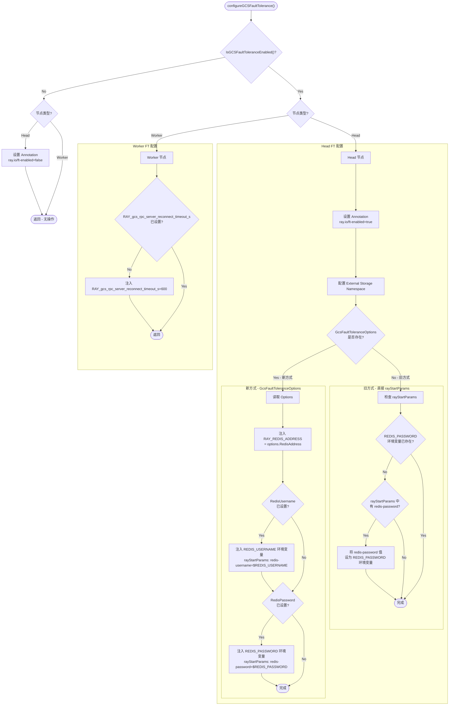
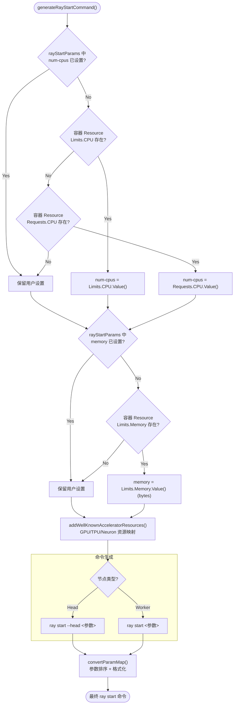

<p align="center">
  
</p>

---

## 目录

- [前置知识](#前置知识)
- [Pod 模板构建总览](#pod-模板构建总览)
- [DefaultHeadPodTemplate 深度分析](#defaultheadpodtemplate-深度分析)
- [DefaultWorkerPodTemplate 深度分析](#defaultworkerpodtemplate-深度分析)
- [configureGCSFaultTolerance 详解](#configuregcsfaulttolerance-详解)
- [BuildPod 核心构建函数](#buildpod-核心构建函数)
- [generateRayStartCommand 详解](#generateraystartcommand-详解)
- [BuildAutoscalerContainer 详解](#buildautoscalercontainer-详解)
- [GPU/TPU/Neuron Core 资源映射](#gputpuneuron-core-资源映射)
- [Multi-host Worker Pod 创建](#multi-host-worker-pod-创建)
- [延伸阅读](#延伸阅读)
- [下一篇](#下一篇)

---

## 前置知识

在阅读本文之前, 建议先熟悉以下前序文档中的核心概念 -

| 前置文档 | 需要掌握的内容 | 路径 |
|---------|---------------|------|
| KubeRay 整体架构 | Operator 工作原理, CRD 定义 | `01-architecture-overview/02-overall-architecture.md` |
| CRD API 设计 | RayCluster Spec 结构, HeadGroupSpec, WorkerGroupSpec | `01-architecture-overview/03-crd-api-design.md` |
| Reconciliation 循环 | Controller 主循环如何触发 Pod 创建 | `02-raycluster-controller/01-reconciliation-loop.md` |
| Pod 调谐与生命周期 | reconcilePods 函数如何调用模板构建 | `02-raycluster-controller/02-pod-reconciliation.md` |

> **核心源码文件**: `ray-operator/controllers/ray/common/pod.go` (约 1228 行)
>
> 本文涉及的所有行号均基于此文件, 除非另有说明。

---

## Pod 模板构建总览

### 架构定位

在 KubeRay 的 reconciliation 循环中, 当 Controller 检测到需要创建新的 Head Pod 或 Worker Pod 时, 会经历 **两阶段构建过程** -

1. **PodTemplate 阶段** - 调用 `DefaultHeadPodTemplate()` 或 `DefaultWorkerPodTemplate()` 生成 `corev1.PodTemplateSpec`
2. **BuildPod 阶段** - 调用 `BuildPod()` 将 PodTemplateSpec 转换为最终的 `corev1.Pod` 对象

这种两阶段设计将 **节点类型相关的配置** (Phase 1) 与 **通用 Pod 构建逻辑** (Phase 2) 解耦。

### Controller 调用入口

在 `raycluster_controller.go` 中, Pod 模板构建的调用链路如下 -

```go
// Head Pod 创建 (raycluster_controller.go L1389-1398)
headPort := common.GetHeadPort(instance.Spec.HeadGroupSpec.RayStartParams)
autoscalingEnabled := utils.IsAutoscalingEnabled(&instance.Spec)
podConf := common.DefaultHeadPodTemplate(ctx, instance, instance.Spec.HeadGroupSpec, podName, headPort)
// ... 注入 sidecar containers ...
pod := common.BuildPod(ctx, podConf, rayv1.HeadNode, instance.Spec.HeadGroupSpec.RayStartParams,
    headPort, autoscalingEnabled, creatorCRDType, fqdnRayIP, r.options.DefaultContainerEnvs, instance.Spec.RayVersion)

// Worker Pod 创建 (raycluster_controller.go L1417-1425)
headPort := common.GetHeadPort(instance.Spec.HeadGroupSpec.RayStartParams)
autoscalingEnabled := utils.IsAutoscalingEnabled(&instance.Spec)
podTemplateSpec := common.DefaultWorkerPodTemplate(ctx, instance, worker, podName, fqdnRayIP,
    headPort, replicaGrpName, replicaIndex, hostIndex)
// ... 注入 sidecar containers ...
pod := common.BuildPod(ctx, podTemplateSpec, rayv1.WorkerNode, worker.RayStartParams,
    headPort, autoscalingEnabled, creatorCRDType, fqdnRayIP, r.options.DefaultContainerEnvs, instance.Spec.RayVersion)
```

### Head 与 Worker 模板构建对比

| 构建环节 | Head Pod | Worker Pod |
|---------|----------|------------|
| Pod 名称策略 | 支持确定性命名 (`IsDeterministicHeadPodNameEnabled`) | 始终使用 `GenerateName` (避免名称冲突) |
| Init Container | 不注入 (Head 本身就是 GCS Server) | 注入 `wait-gcs-ready` 等待 GCS 就绪 |
| Autoscaler Sidecar | 当 `EnableInTreeAutoscaling=true` 时注入 | 不注入 |
| GCS FT 配置 | 注入 Redis 地址/密码/存储命名空间 | 仅设置 GCS 重连超时 |
| Multi-Host 标签 | 无 | 当 Feature Gate 启用时添加索引标签 |
| `ray start` 参数 | `--head`, `--dashboard-host=0.0.0.0` | `--address=<head>:<port>` |
| Metrics 端口 | 默认添加 8080 | 默认添加 8080 |
| Restart Policy | Autoscaler V2 时设为 `Never` | Autoscaler V2 时设为 `Never` |

### Pod 模板构建完整流程

```mermaid
flowchart TB
    Start(["Controller 检测到需要创建 Pod"]) --> TypeCheck{"节点类型?"}

    TypeCheck -->|"Head"| HeadTemplate["DefaultHeadPodTemplate()"]
    TypeCheck -->|"Worker"| WorkerTemplate["DefaultWorkerPodTemplate()"]

    subgraph head_phase["Head Pod 模板构建 - L165-238"]
        HeadTemplate --> H1["设置 Pod 名称<br/>确定性命名 or GenerateName"]
        H1 --> H2["updateRayStartParamsResources()<br/>updateRayStartParamsLabels()"]
        H2 --> H3["labelPod() 合并标签"]
        H3 --> H4["setMissingRayStartParams()<br/>--dashboard-host, --metrics-export-port"]
        H4 --> H5["initTemplateAnnotations()"]
        H5 --> H6{"Autoscaling<br/>已启用?"}
        H6 -->|"Yes"| H7["BuildAutoscalerContainer()<br/>注入 Autoscaler Sidecar"]
        H7 --> H8{"Autoscaler V2?"}
        H8 -->|"Yes"| H8a["setAutoscalerV2EnvVars()<br/>RestartPolicy=Never"]
        H8 -->|"No"| H9
        H8a --> H9
        H6 -->|"No"| H9["configureGCSFaultTolerance()"]
        H9 --> H10["添加 Metrics 端口"]
        H10 --> H10a{"Auth 已启用?"}
        H10a -->|"Yes"| H10b["configureTokenAuth()"]
        H10a -->|"No"| H11
        H10b --> H11["返回 PodTemplateSpec"]
    end

    subgraph worker_phase["Worker Pod 模板构建 - L301-413"]
        WorkerTemplate --> W1["设置 GenerateName"]
        W1 --> W2{"Init Container<br/>注入已启用?"}
        W2 -->|"Yes"| W3["注入 wait-gcs-ready<br/>Init Container"]
        W2 -->|"No"| W4
        W3 --> W4["updateRayStartParamsResources()<br/>updateRayStartParamsLabels()"]
        W4 --> W5["labelPod() 合并标签"]
        W5 --> W6{"RayMultiHostIndexing<br/>Feature Gate?"}
        W6 -->|"Yes"| W7["添加 replica-index<br/>replica-name, host-index 标签"]
        W6 -->|"No"| W8
        W7 --> W8["setMissingRayStartParams()<br/>--address=head:port"]
        W8 --> W9["initTemplateAnnotations()"]
        W9 --> W10["configureGCSFaultTolerance()"]
        W10 --> W11["添加 Metrics 端口"]
        W11 --> W11a{"Auth 已启用?"}
        W11a -->|"Yes"| W11b["configureTokenAuth()"]
        W11a -->|"No"| W12
        W11b --> W12["返回 PodTemplateSpec"]
    end

    H11 --> BuildPodPhase
    W12 --> BuildPodPhase

    subgraph build_phase["BuildPod 通用构建 - L526-614"]
        BuildPodPhase["BuildPod()"] --> B1["设置 RayService Serving 标签"]
        B1 --> B2["创建 Pod 对象"]
        B2 --> B3["addEmptyDir /dev/shm<br/>共享内存卷"]
        B3 --> B4{"Head + Autoscaler?"}
        B4 -->|"Yes"| B5["addEmptyDir /tmp/ray<br/>日志共享卷"]
        B4 -->|"No"| B6
        B5 --> B6["generateRayStartCommand()"]
        B6 --> B7["拼接容器命令<br/>ulimit + ray start"]
        B7 --> B8["setContainerEnvVars()<br/>注入环境变量"]
        B8 --> B9{"Probes 注入<br/>已启用?"}
        B9 -->|"Yes"| B10["initLivenessAndReadinessProbe()"]
        B9 -->|"No"| B11
        B10 --> B11["返回 Pod 对象"]
    end

    B11 --> Final(["最终 Pod 对象<br/>提交至 Kubernetes API"])
```



---

## DefaultHeadPodTemplate 深度分析

> **函数签名**: `func DefaultHeadPodTemplate(ctx context.Context, instance rayv1.RayCluster, headSpec rayv1.HeadGroupSpec, podName string, headPort string) corev1.PodTemplateSpec`
>
> **源码位置**: `pod.go` L165-238

### 步骤 1 - Pod 命名与命名空间

```go
// L169-174
podTemplate := headSpec.Template
if utils.IsDeterministicHeadPodNameEnabled() {
    podTemplate.Name = podName          // 确定性命名, Pod 名称固定
} else {
    podTemplate.GenerateName = podName  // 随机后缀, 例如 raycluster-head-xxxxx
}
podTemplate.ObjectMeta.Namespace = instance.Namespace
```

确定性命名特性允许 Head Pod 在删除重建后保持相同名称, 这对依赖 Pod 名称进行服务发现的场景非常重要。命名空间强制与 RayCluster 一致, 确保权限隔离。

### 步骤 2 - 资源与标签同步

```go
// L180-187
updateRayStartParamsResources(ctx, headSpec.RayStartParams, headSpec.Resources)
updateRayStartParamsLabels(headSpec.RayStartParams, headSpec.Labels)
mergedLabels := mergeLabels(headSpec.Template.ObjectMeta.Labels, headSpec.Labels)
podTemplate.Labels = labelPod(rayv1.HeadNode, instance.Name, utils.RayNodeHeadGroupLabelValue, mergedLabels)
```

这一步做了两件重要的事 -

1. **资源同步**: 将顶层 `Resources` 字段中的 CPU/Memory/GPU 值同步到 `rayStartParams` (如 `--num-cpus`, `--memory`, `--num-gpus`)
2. **标签合并**: 将 Pod Template 的标签与顶层 `Labels` 字段合并, 然后通过 `labelPod()` 添加 KubeRay 系统标签

`labelPod()` 函数 (L717-743) 会设置以下系统标签 -

| 标签键 | 值 | 用途 |
|-------|------|------|
| `ray.io/is-ray-node` | `"yes"` | 标识 Ray 节点 |
| `ray.io/cluster` | RayCluster 名称 | 关联集群 |
| `ray.io/node-type` | `"head"` | 节点类型 |
| `ray.io/group` | `"headgroup"` | 组名称 |
| `ray.io/identifier` | 生成的标识符 | 唯一标识 |
| `app.kubernetes.io/name` | `"kuberay"` | K8s 标准标签 |
| `app.kubernetes.io/created-by` | `"kuberay-operator"` | K8s 标准标签 |

> **注意**: `ray.io/node-type`, `ray.io/group`, `ray.io/cluster` 三个标签不可被用户覆盖 (L732-737)。

### 步骤 3 - Ray 启动参数补全

```go
// L189
headSpec.RayStartParams = setMissingRayStartParams(ctx, headSpec.RayStartParams, rayv1.HeadNode, headPort, "")
```

`setMissingRayStartParams()` (L879-922) 为 Head 节点设置以下默认参数 -

| 参数 | 默认值 | 说明 |
|------|-------|------|
| `--dashboard-host` | `0.0.0.0` | 允许从 Pod 外部访问 Dashboard |
| `--metrics-export-port` | `8080` | Prometheus 指标暴露端口 |
| `--block` | `true` | 阻塞模式, 防止容器提前退出 |
| `--dashboard-agent-listen-port` | `52365` | Dashboard Agent 监听端口 |

### 步骤 4 - Autoscaler Sidecar 注入

当 `EnableInTreeAutoscaling` 为 `true` 时, Head Pod 会注入 Autoscaler sidecar 容器 -

```go
// L194-218
if utils.IsAutoscalingEnabled(&instance.Spec) {
    headSpec.RayStartParams["no-monitor"] = "true"
    podTemplate.Spec.ServiceAccountName = utils.CheckName(utils.GetHeadGroupServiceAccountName(&instance))
    autoscalerImage := podTemplate.Spec.Containers[utils.RayContainerIndex].Image
    autoscalerContainer := BuildAutoscalerContainer(autoscalerImage)

    // 如果 Auth 已启用, 为 autoscaler 配置 Token
    if utils.IsAuthEnabled(&instance.Spec) {
        SetContainerTokenAuthEnvVars(instance.Name, &autoscalerContainer)
    }

    mergeAutoscalerOverrides(&autoscalerContainer, instance.Spec.AutoscalerOptions)
    podTemplate.Spec.Containers = append(podTemplate.Spec.Containers, autoscalerContainer)

    if utils.IsAutoscalingV2Enabled(&instance.Spec) {
        setAutoscalerV2EnvVars(&podTemplate)
        podTemplate.Spec.RestartPolicy = corev1.RestartPolicyNever
    }
}
```

关键逻辑 -

- **禁用内置 Monitor**: 设置 `--no-monitor=true`, 因为 KubeRay Autoscaler 替代了 Ray 内置的 monitor 进程
- **Service Account**: 设置专用的 ServiceAccount, 该账户绑定了操作 RayCluster 资源所需的 RBAC 权限
- **Autoscaler V2**: 设置 `RAY_enable_autoscaler_v2=true` 环境变量, 并将 RestartPolicy 改为 `Never`

### 步骤 5 - GCS 容错配置与 Metrics 端口

```go
// L221-231
configureGCSFaultTolerance(&podTemplate, instance, rayv1.HeadNode)

isMetricsPortExists := utils.FindContainerPort(&podTemplate.Spec.Containers[utils.RayContainerIndex],
    utils.MetricsPortName, -1) != -1
if !isMetricsPortExists {
    metricsPort := corev1.ContainerPort{
        Name:          utils.MetricsPortName,
        ContainerPort: int32(utils.DefaultMetricsPort),  // 8080
    }
    podTemplate.Spec.Containers[utils.RayContainerIndex].Ports = append(
        podTemplate.Spec.Containers[utils.RayContainerIndex].Ports, metricsPort)
}
```

GCS 容错配置将在 [configureGCSFaultTolerance 详解](#configuregcsfaulttolerance-详解) 一节展开。Metrics 端口仅在用户未显式指定时添加, 确保不覆盖自定义配置。

---

## DefaultWorkerPodTemplate 深度分析

> **函数签名**: `func DefaultWorkerPodTemplate(ctx context.Context, instance rayv1.RayCluster, workerSpec rayv1.WorkerGroupSpec, podName string, fqdnRayIP string, headPort string, replicaGrpName string, replicaIndex int, numHostIndex int) corev1.PodTemplateSpec`
>
> **源码位置**: `pod.go` L301-413

### 步骤 1 - Init Container 注入

Worker Pod 需要等待 Head Pod 的 GCS Server 就绪后才能启动。KubeRay 通过注入 `wait-gcs-ready` init container 来实现这一依赖 -

```go
// L310-363
enableInitContainerInjection := getEnableInitContainerInjection()
if enableInitContainerInjection {
    deepCopyRayContainer := podTemplate.Spec.Containers[utils.RayContainerIndex].DeepCopy()
    initContainer := corev1.Container{
        Name:            "wait-gcs-ready",
        Image:           podTemplate.Spec.Containers[utils.RayContainerIndex].Image,
        ImagePullPolicy: podTemplate.Spec.Containers[utils.RayContainerIndex].ImagePullPolicy,
        Command:         utils.GetContainerCommand([]string{}),
        Args: []string{
            fmt.Sprintf(`
                SECONDS=0
                while true; do
                    if (( SECONDS <= 120 )); then
                        if ray health-check --address %s:%s > /dev/null 2>&1; then
                            echo "GCS is ready."
                            break
                        fi
                        echo "$SECONDS seconds elapsed: Waiting for GCS to be ready."
                    else
                        if ray health-check --address %s:%s; then
                            echo "GCS is ready. Any error messages above can be safely ignored."
                            break
                        fi
                        echo "$SECONDS seconds elapsed: Still waiting for GCS to be ready."
                    fi
                    sleep 5
                done
            `, fqdnRayIP, headPort, fqdnRayIP, headPort),
        },
        SecurityContext: podTemplate.Spec.Containers[utils.RayContainerIndex].SecurityContext.DeepCopy(),
        Env:             deepCopyRayContainer.Env,
        VolumeMounts:    deepCopyRayContainer.VolumeMounts,
        Resources: corev1.ResourceRequirements{
            Limits:   corev1.ResourceList{corev1.ResourceCPU: resource.MustParse("200m"), corev1.ResourceMemory: resource.MustParse("256Mi")},
            Requests: corev1.ResourceList{corev1.ResourceCPU: resource.MustParse("200m"), corev1.ResourceMemory: resource.MustParse("256Mi")},
        },
    }
    podTemplate.Spec.InitContainers = append(podTemplate.Spec.InitContainers, initContainer)
}
```

关键设计决策 -

| 设计点 | 说明 |
|-------|------|
| **健康检查两阶段** | 前 120 秒静默输出 (避免日志噪音), 之后输出详细错误 |
| **继承环境变量** | 复制 Ray 容器的 Env 和 VolumeMounts, 以支持 TLS 认证 |
| **硬编码资源** | CPU: 200m, Memory: 256Mi - 因为 Init Container 只做轻量 HTTP 请求 |
| **不继承 GPU** | 显式设置资源而非复制 Ray 容器资源, 避免 GKE Autopilot 不支持 GPU init container 的问题 |

可通过环境变量 `ENABLE_INIT_CONTAINER_INJECTION=false` 禁用此注入。

### 步骤 2 - 资源/标签同步与 Ray 启动参数

```go
// L369-389
updateRayStartParamsResources(ctx, workerSpec.RayStartParams, workerSpec.Resources)
updateRayStartParamsLabels(workerSpec.RayStartParams, workerSpec.Labels)
mergedLabels := mergeLabels(workerSpec.Template.ObjectMeta.Labels, workerSpec.Labels)
podTemplate.Labels = labelPod(rayv1.WorkerNode, instance.Name, workerSpec.GroupName, mergedLabels)

// Multi-Host 索引标签
if features.Enabled(features.RayMultiHostIndexing) {
    podTemplate.Labels[utils.RayWorkerReplicaIndexKey] = strconv.Itoa(replicaIndex)
    if workerSpec.NumOfHosts > 1 {
        podTemplate.Labels[utils.RayWorkerReplicaNameKey] = replicaGrpName
        podTemplate.Labels[utils.RayHostIndexKey] = strconv.Itoa(numHostIndex)
    }
}

workerSpec.RayStartParams = setMissingRayStartParams(ctx, workerSpec.RayStartParams, rayv1.WorkerNode, headPort, fqdnRayIP)
```

Worker 的 `setMissingRayStartParams()` 会添加 `--address=<fqdnRayIP>:<headPort>` 参数, 使 Worker 能连接到 Head 节点。其中 `fqdnRayIP` 是 Head Service 的完全限定域名, 格式为 `<cluster-name>-head-svc.<namespace>.svc.cluster.local`。

### 步骤 3 - Autoscaler V2 与 Auth 配置

```go
// L404-410
if utils.IsAutoscalingEnabled(&instance.Spec) && utils.IsAutoscalingV2Enabled(&instance.Spec) {
    podTemplate.Spec.RestartPolicy = corev1.RestartPolicyNever
}

if utils.IsAuthEnabled(&instance.Spec) {
    configureTokenAuth(instance.Name, &podTemplate)
}
```

当 Autoscaler V2 启用时, Worker Pod 的 RestartPolicy 也会设为 `Never`, 以配合 Autoscaler V2 的 Pod 生命周期管理。Token Auth 会为 Ray 容器和 `wait-gcs-ready` init container 设置 `RAY_AUTH_MODE` 和 `RAY_AUTH_TOKEN` 环境变量。

---

## configureGCSFaultTolerance 详解

> **函数签名**: `func configureGCSFaultTolerance(podTemplate *corev1.PodTemplateSpec, instance rayv1.RayCluster, rayNodeType rayv1.RayNodeType)`
>
> **源码位置**: `pod.go` L76-162

GCS (Global Control Service) 容错是 Ray 集群高可用的核心机制。当启用 GCS FT 时, GCS 状态会持久化到外部 Redis, 使得 Head Pod 崩溃重建后能恢复集群状态。

### GCS FT 配置注入流程



### External Storage Namespace 确定优先级

External Storage Namespace 用于隔离不同 RayCluster 在 Redis 中的数据。其确定优先级如下 -

```go
// L106-113
storageNS := string(instance.UID)                                       // 默认: RayCluster UID
if v, ok := instance.Annotations[utils.RayExternalStorageNSAnnotationKey]; ok {
    storageNS = v                                                        // 覆盖: Annotation
}
if options != nil && options.ExternalStorageNamespace != "" {
    storageNS = options.ExternalStorageNamespace                          // 最高优先级: Spec 字段
}
```

| 优先级 | 来源 | 说明 |
|-------|------|------|
| 1 (最高) | `GcsFaultToleranceOptions.ExternalStorageNamespace` | Spec 中显式指定 |
| 2 | `ray.io/external-storage-namespace` Annotation | 向后兼容 |
| 3 (最低) | `instance.UID` | 自动生成, 保证唯一性 |

### Head 与 Worker 的 GCS FT 差异

| 配置项 | Head Pod | Worker Pod |
|-------|----------|------------|
| `ray.io/ft-enabled` Annotation | 设置 `true/false` | 不设置 |
| `RAY_REDIS_ADDRESS` | 注入 Redis 地址 | 不注入 |
| `REDIS_PASSWORD` / `REDIS_USERNAME` | 注入 (支持 Secret 引用) | 不注入 |
| `RAY_external_storage_namespace` | 注入命名空间值 | 不注入 |
| `RAY_gcs_rpc_server_reconnect_timeout_s` | 不注入 (默认 60s) | 注入 600s |

Worker 节点之所以将 GCS 重连超时设置为 600s (远大于 Head 默认的 60s), 是因为 Head Pod 重建通常需要约 120 秒, 设置 600s 可以防止 Worker 在此期间因超时而崩溃退出。

### Redis 密码配置 - 新旧两种方式

**新方式 (推荐)** - 通过 `GcsFaultToleranceOptions` -

```yaml
spec:
  gcsFaultToleranceOptions:
    redisAddress: "redis:6379"
    redisPassword:
      valueFrom:
        secretKeyRef:
          name: redis-secret
          key: password
```

此方式将密码通过 `ValueFrom` 引用 K8s Secret, 避免在 Spec 中明文存储密码。

**旧方式 (不推荐)** - 直接在 `rayStartParams` 中设置 -

```yaml
spec:
  headGroupSpec:
    rayStartParams:
      redis-password: "my-password"
```

此方式会将密码明文写入 `rayStartParams`, 存在安全风险。KubeRay 会将其同步到 `REDIS_PASSWORD` 环境变量, 以便 Redis 清理 Job 使用。

---

## BuildPod 核心构建函数

> **函数签名**: `func BuildPod(ctx context.Context, podTemplateSpec corev1.PodTemplateSpec, rayNodeType rayv1.RayNodeType, rayStartParams map[string]string, headPort string, enableRayAutoscaler bool, creatorCRDType utils.CRDType, fqdnRayIP string, defaultContainerEnvs []corev1.EnvVar, rayVersion string) (aPod corev1.Pod)`
>
> **源码位置**: `pod.go` L526-614

`BuildPod()` 接收 `DefaultHeadPodTemplate()` 或 `DefaultWorkerPodTemplate()` 的输出, 执行所有节点类型通用的构建逻辑。

### 5.1 RayService Serving 标签

```go
// L533-538
if creatorCRDType == utils.RayServiceCRD {
    podTemplateSpec.Labels[utils.RayClusterServingServiceLabelKey] = utils.EnableRayClusterServingServiceTrue
    if rayNodeType == rayv1.HeadNode {
        podTemplateSpec.Labels[utils.RayClusterServingServiceLabelKey] = utils.EnableRayClusterServingServiceFalse
    }
}
```

当 Pod 由 RayService 创建时 -
- **Worker Pod**: `ray.io/serve=true` - Worker 的流量就绪由 readiness probe 决定
- **Head Pod**: `ray.io/serve=false` - Head 的流量就绪由 RayService Controller 管理

### 5.2 共享内存卷 (`/dev/shm`)

```go
// L550
addEmptyDir(ctx, &pod.Spec.Containers[utils.RayContainerIndex], &pod,
    SharedMemoryVolumeName, SharedMemoryVolumeMountPath, corev1.StorageMediumMemory)
```

Ray 的 Object Store 使用共享内存 (`/dev/shm`) 进行进程间数据共享。Kubernetes 容器默认的 `/dev/shm` 大小仅为 64MB, 对 Ray 而言远远不够。`addEmptyDir()` (L1081-1102) 创建一个基于 Memory 介质的 emptyDir volume -

- 如果容器设置了 Memory Limits, `SizeLimit` 会自动设置为该值
- 如果未设置 Memory Limits/Requests, `SizeLimit` 为 nil (不限制)
- 函数会先检查是否已存在同路径挂载, 避免重复添加

### 5.3 Autoscaler 日志共享卷

```go
// L551-559
if rayNodeType == rayv1.HeadNode && enableRayAutoscaler {
    autoscalerContainerIndex := getAutoscalerContainerIndex(pod)
    addEmptyDir(ctx, &pod.Spec.Containers[utils.RayContainerIndex], &pod,
        RayLogVolumeName, RayLogVolumeMountPath, corev1.StorageMediumDefault)
    addEmptyDir(ctx, &pod.Spec.Containers[autoscalerContainerIndex], &pod,
        RayLogVolumeName, RayLogVolumeMountPath, corev1.StorageMediumDefault)
}
```

当 Autoscaler 启用时, Ray Head 容器和 Autoscaler 容器共享 `/tmp/ray` 目录。Autoscaler 将日志写入此目录, Ray Head 的事件日志功能会读取这些日志。

### 5.4 容器命令拼接

```go
// L561-595
var cmd, args string
if len(pod.Spec.Containers[utils.RayContainerIndex].Command) > 0 {
    cmd = convertCmdToString(pod.Spec.Containers[utils.RayContainerIndex].Command)
}
if len(pod.Spec.Containers[utils.RayContainerIndex].Args) > 0 {
    cmd += convertCmdToString(pod.Spec.Containers[utils.RayContainerIndex].Args)
}

ulimitCmd := "ulimit -n 65536"
rayStartCmd := generateRayStartCommand(ctx, rayNodeType, rayStartParams,
    pod.Spec.Containers[utils.RayContainerIndex].Resources)

if !isOverwriteRayContainerCmd && !strings.Contains(cmd, "ray start") {
    generatedCmd := fmt.Sprintf("%s; %s", ulimitCmd, rayStartCmd)
    pod.Spec.Containers[utils.RayContainerIndex].Command = utils.GetContainerCommand([]string{})
    if cmd != "" {
        args = fmt.Sprintf("%s && %s", cmd, generatedCmd)  // 用户命令在前
    } else {
        args = generatedCmd
    }
    pod.Spec.Containers[utils.RayContainerIndex].Args = []string{args}
}
```

命令拼接逻辑 -

1. 先设置 `ulimit -n 65536` 提高文件描述符限制
2. 生成 `ray start` 命令
3. 如果用户已有自定义命令, 将其放在 `ray start` **之前** (因为 `ray start --block` 会阻塞后续命令)
4. 如果用户已设置 `ray.io/overwrite-container-cmd=true` 注解或命令中已包含 `ray start`, 则不覆盖

### 5.5 环境变量注入

`setContainerEnvVars()` (L759-877) 为 Ray 容器注入大量环境变量 -

| 环境变量 | 值 | 适用节点 | 说明 |
|---------|------|---------|------|
| `FQ_RAY_IP` | Head Service FQDN / `127.0.0.1` | Worker / Head | 完全限定域名 |
| `RAY_IP` | 提取的短 IP (已废弃) | Worker | 向后兼容 |
| `RAY_CLUSTER_NAME` | 从 Pod 标签读取 | 全部 | 集群名称 |
| `RAY_CLUSTER_NAMESPACE` | 从 Pod 元数据读取 | 全部 | 集群命名空间 |
| `RAY_CLOUD_INSTANCE_ID` | Pod 名称 | 全部 | Autoscaler V2 使用 |
| `RAY_NODE_TYPE_NAME` | 从 `ray.io/group` 标签读取 | 全部 | Autoscaler V2 使用 |
| `KUBERAY_GEN_RAY_START_CMD` | 生成的 `ray start` 命令 | 全部 | 调试/覆盖用 |
| `RAY_PORT` | Head 端口 | 全部 | GCS 端口 |
| `RAY_ADDRESS` | `<ip>:<port>` | 全部 | `ray.init()` 连接地址 |
| `RAY_USAGE_STATS_KUBERAY_IN_USE` | `"1"` | 全部 | 使用统计 |
| `RAY_USAGE_STATS_EXTRA_TAGS` | KubeRay 版本和 CRD 类型 | Head | 使用统计标签 |
| `RAY_DASHBOARD_ENABLE_K8S_DISK_USAGE` | `"1"` | 全部 | 启用磁盘使用显示 |

RayService 专属环境变量 -

| 环境变量 | 值 | 说明 |
|---------|------|------|
| `RAY_timeout_ms_task_wait_for_death_info` | `"0"` | 提高服务 SLA |
| `RAY_gcs_server_request_timeout_seconds` | `"5"` | GCS 请求超时 |
| `RAY_SERVE_KV_TIMEOUT_S` | `"5"` | Serve KV 超时 |

### 5.6 健康探针注入

```go
// L604-611
enableProbesInjection := getEnableProbesInjection()
if enableProbesInjection {
    initLivenessAndReadinessProbe(&pod.Spec.Containers[utils.RayContainerIndex],
        rayNodeType, creatorCRDType, rayStartParams, rayVersion)
}
```

`initLivenessAndReadinessProbe()` (L426-523) 根据 Ray 版本和节点类型配置健康探针 -

**Ray >= 2.53.0** - 使用统一的 HTTP 健康检查端点 (`HTTPGet` 探针)

**Ray < 2.53.0** - 使用 `Exec` 探针执行 `wget` 命令 -
- **Head**: 检查 Raylet 健康 + GCS 健康
- **Worker**: 仅检查 Raylet 健康
- **RayService Worker**: 额外检查 Serve Proxy 健康

探针参数 -

| 参数 | Head | Worker |
|------|------|--------|
| InitialDelaySeconds | 默认值 | 默认值 |
| TimeoutSeconds | `DefaultHeadLivenessProbeTimeoutSeconds` | `DefaultLivenessProbeTimeoutSeconds` |
| PeriodSeconds | 默认值 | 默认值 |
| FailureThreshold | 默认值 | 默认值 (RayService Worker 使用 `ServeReadinessProbeFailureThreshold`) |

---

## generateRayStartCommand 详解

> **函数签名**: `func generateRayStartCommand(ctx context.Context, nodeType rayv1.RayNodeType, rayStartParams map[string]string, resource corev1.ResourceRequirements) string`
>
> **源码位置**: `pod.go` L924-964

### Ray 启动参数拼接逻辑



### 资源自动推导

`generateRayStartCommand()` 会根据容器的 Kubernetes 资源声明自动推导 Ray 资源参数 -

```go
// L928-946
// CPU 推导: 优先 Limits, 其次 Requests
if _, ok := rayStartParams["num-cpus"]; !ok {
    cpu := resource.Limits[corev1.ResourceCPU]
    if !cpu.IsZero() {
        rayStartParams["num-cpus"] = strconv.FormatInt(cpu.Value(), 10)
    } else {
        cpu := resource.Requests[corev1.ResourceCPU]
        if !cpu.IsZero() {
            rayStartParams["num-cpus"] = strconv.FormatInt(cpu.Value(), 10)
        }
    }
}

// Memory 推导: 仅使用 Limits
if _, ok := rayStartParams["memory"]; !ok {
    memory := resource.Limits[corev1.ResourceMemory]
    if !memory.IsZero() {
        rayStartParams["memory"] = strconv.FormatInt(memory.Value(), 10)
    }
}
```

> **重要细节**: CPU 推导同时检查 Limits 和 Requests, 而 Memory 仅检查 Limits。这是因为 Memory 的 Requests 通常不能代表节点可用内存 (只是调度保证), 而 Limits 才是实际可用的上限。

### convertParamMap 参数格式化

`convertParamMap()` (L1052-1077) 将参数 Map 转换为命令行标志 -

```go
// 布尔参数 (值为 "true"/"false") => 只输出开关
// 例如: {"block": "true"} => "--block"
// 例如: {"block": "false"} => (不输出)

// 值参数 => 输出 key=value
// 例如: {"num-cpus": "4"} => "--num-cpus=4"

// 特殊参数 (log-color, include-dashboard) => 始终输出 key=value
// 例如: {"log-color": "true"} => "--log-color=true"
```

参数按字母顺序排序输出, 确保相同配置生成完全一致的命令, 这对 Spec Hash 比较至关重要。

---

## BuildAutoscalerContainer 详解

> **函数签名**: `func BuildAutoscalerContainer(autoscalerImage string) corev1.Container`
>
> **源码位置**: `pod.go` L617-668

### Autoscaler 容器构建

```go
// L617-668
container := corev1.Container{
    Name:            "autoscaler",
    Image:           autoscalerImage,
    ImagePullPolicy: corev1.PullIfNotPresent,
    Env: []corev1.EnvVar{
        {Name: "RAY_CLUSTER_NAME",      ValueFrom: &corev1.EnvVarSource{FieldRef: &corev1.ObjectFieldSelector{FieldPath: "metadata.labels['ray.io/cluster']"}}},
        {Name: "RAY_CLUSTER_NAMESPACE", ValueFrom: &corev1.EnvVarSource{FieldRef: &corev1.ObjectFieldSelector{FieldPath: "metadata.namespace"}}},
        {Name: "RAY_HEAD_POD_NAME",     ValueFrom: &corev1.EnvVarSource{FieldRef: &corev1.ObjectFieldSelector{FieldPath: "metadata.name"}}},
        {Name: "KUBERAY_CRD_VER",       Value: "v1"},
    },
    Command: utils.GetContainerCommand([]string{}),
    Args:    []string{"ray kuberay-autoscaler --cluster-name $(RAY_CLUSTER_NAME) --cluster-namespace $(RAY_CLUSTER_NAMESPACE)"},
    Resources: corev1.ResourceRequirements{
        Limits:   corev1.ResourceList{corev1.ResourceCPU: resource.MustParse("500m"), corev1.ResourceMemory: resource.MustParse("512Mi")},
        Requests: corev1.ResourceList{corev1.ResourceCPU: resource.MustParse("500m"), corev1.ResourceMemory: resource.MustParse("512Mi")},
    },
}
```

| 配置项 | 默认值 | 说明 |
|-------|--------|------|
| Image | 与 Ray Head 容器相同 | 使用同一镜像, autoscaler 命令内置于 Ray 镜像中 |
| CPU | 500m (Requests = Limits) | QoS 为 Guaranteed |
| Memory | 512Mi (Requests = Limits) | QoS 为 Guaranteed |
| Command | `ray kuberay-autoscaler` | 通过 Ray CLI 启动 KubeRay autoscaler |

### mergeAutoscalerOverrides 用户自定义

`mergeAutoscalerOverrides()` (L671-695) 允许用户通过 `AutoscalerOptions` 覆盖默认配置 -

```go
func mergeAutoscalerOverrides(autoscalerContainer *corev1.Container, autoscalerOptions *rayv1.AutoscalerOptions) {
    if autoscalerOptions != nil {
        if autoscalerOptions.Resources != nil {
            autoscalerContainer.Resources = *autoscalerOptions.Resources
        }
        if autoscalerOptions.Image != nil {
            autoscalerContainer.Image = *autoscalerOptions.Image
        }
        if autoscalerOptions.ImagePullPolicy != nil {
            autoscalerContainer.ImagePullPolicy = *autoscalerOptions.ImagePullPolicy
        }
        if len(autoscalerOptions.Env) > 0 {
            autoscalerContainer.Env = append(autoscalerContainer.Env, autoscalerOptions.Env...)
        }
        if len(autoscalerOptions.EnvFrom) > 0 {
            autoscalerContainer.EnvFrom = append(autoscalerContainer.EnvFrom, autoscalerOptions.EnvFrom...)
        }
        if len(autoscalerOptions.VolumeMounts) > 0 {
            autoscalerContainer.VolumeMounts = append(autoscalerContainer.VolumeMounts, autoscalerOptions.VolumeMounts...)
        }
        if autoscalerOptions.SecurityContext != nil {
            autoscalerContainer.SecurityContext = autoscalerOptions.SecurityContext.DeepCopy()
        }
    }
}
```

可覆盖项 -

| 字段 | 行为 | 典型场景 |
|------|------|---------|
| `Resources` | 完全替换 | 调整 CPU/Memory |
| `Image` | 替换 | 使用特定版本的 autoscaler 镜像 |
| `ImagePullPolicy` | 替换 | 开发环境使用 `Always` |
| `Env` | 追加 (append) | 添加额外环境变量 |
| `EnvFrom` | 追加 (append) | 引用 ConfigMap/Secret |
| `VolumeMounts` | 追加 (append) | 挂载额外存储 |
| `SecurityContext` | 深拷贝替换 | 设置安全上下文 |

### Autoscaler V1 vs V2

| 特性 | V1 (默认) | V2 (Alpha) |
|------|----------|------------|
| 环境变量 | 无特殊设置 | `RAY_enable_autoscaler_v2=true` |
| Pod RestartPolicy | 默认 | `Never` |
| Version 配置 | 无需设置 | `spec.autoscalerOptions.version: "v2"` |
| 功能 | 基础自动扩缩 | 支持 `idleTimeoutSeconds` 等高级特性 |
| 状态 | 稳定 | Alpha 阶段 |

---

## GPU/TPU/Neuron Core 资源映射

> **函数签名**: `func addWellKnownAcceleratorResources(rayStartParams map[string]string, resourceLimits corev1.ResourceList) error`
>
> **源码位置**: `pod.go` L966-1013

### 加速器资源映射表

KubeRay 自动将 Kubernetes 容器的加速器资源声明映射到 Ray 的资源参数 -

| Kubernetes 资源名 | Ray 参数 | 映射方式 | 说明 |
|-------------------|----------|---------|------|
| `nvidia.com/gpu` | `--num-gpus` | `rayStartParams["num-gpus"]` | NVIDIA GPU |
| `nvidia.com/mig-*` | `--num-gpus` | `rayStartParams["num-gpus"]` | NVIDIA MIG |
| `*gpu` (后缀匹配) | `--num-gpus` | `rayStartParams["num-gpus"]` | 通用 GPU |
| `google.com/tpu` | `--resources='{"TPU": N}'` | 自定义资源 JSON | Google TPU |
| `aws.amazon.com/neuroncore` | `--resources='{"neuron_cores": N}'` | 自定义资源 JSON | AWS Neuron |

### GPU 识别逻辑

GPU 识别由 `IsGPUResourceKey()` 函数 (`utils/resources.go` L8-17) 实现 -

```go
func IsGPUResourceKey(key string) bool {
    // 后缀匹配 "gpu", 如 "nvidia.com/gpu", "amd.com/gpu"
    if strings.HasSuffix(key, "gpu") {
        return true
    }
    // NVIDIA MIG 模式匹配, 如 "nvidia.com/mig-2g.32gb"
    match, _ := regexp.MatchString(`nvidia\.com/mig-\d+g\.\d+gb$`, key)
    return match
}
```

### 自定义加速器资源注入

TPU 和 Neuron Core 使用 `--resources` 参数以 JSON 格式注入 -

```go
// L45-48 定义映射关系
var customAcceleratorToRayResourceMap = map[string]string{
    "aws.amazon.com/neuroncore": "neuron_cores",
    "google.com/tpu":           "TPU",
}
```

注入流程 -

1. 检查现有 `rayStartParams["resources"]` 中是否已包含该加速器类型
2. 如果不存在, 将加速器资源添加到 resources JSON map
3. 序列化后更新 `rayStartParams["resources"]`
4. 仅处理 **第一个** 遇到的自定义加速器资源 (资源键按字母排序)

示例 - 当容器声明了 `google.com/tpu: 4`, 最终生成的命令中会包含 -

```bash
ray start --resources='{"TPU":4}' ...
```

---

## Multi-host Worker Pod 创建

### Feature Gate - RayMultiHostIndexing

Multi-host Worker Pod 创建依赖 `RayMultiHostIndexing` Feature Gate -

```go
// features/features.go L34, L65
RayMultiHostIndexing featuregate.Feature = "RayMultiHostIndexing"
// 默认关闭, Alpha 阶段
RayMultiHostIndexing: {Default: false, PreRelease: featuregate.Alpha},
```

### 索引标签系统

当 Feature Gate 启用时, `DefaultWorkerPodTemplate()` 会为 Worker Pod 添加索引标签 -

```go
// pod.go L380-388
if features.Enabled(features.RayMultiHostIndexing) {
    // 所有 Worker (包括单主机) 都添加 replica index
    podTemplate.Labels[utils.RayWorkerReplicaIndexKey] = strconv.Itoa(replicaIndex)

    if workerSpec.NumOfHosts > 1 {
        // 仅多主机 Worker Group 添加以下标签
        podTemplate.Labels[utils.RayWorkerReplicaNameKey] = replicaGrpName
        podTemplate.Labels[utils.RayHostIndexKey] = strconv.Itoa(numHostIndex)
    }
}
```

标签含义 -

| 标签 | 键 | 值范围 | 适用场景 | 说明 |
|------|------|-------|---------|------|
| Replica Index | `ray.io/worker-group-replica-index` | `0` 到 `replicas-1` | 单主机 + 多主机 | Worker Group 内唯一 |
| Replica Name | `ray.io/worker-group-replica-name` | `<group>-<hash>` | 仅多主机 | 跨 RayCluster 唯一 |
| Host Index | `ray.io/replica-host-index` | `0` 到 `numOfHosts-1` | 仅多主机 | Replica 内主机索引 |

### Controller 调用时的索引管理

在 `raycluster_controller.go` 中, Controller 负责分配索引 -

```go
// raycluster_controller.go L864-870
if features.Enabled(features.RayMultiHostIndexing) {
    newReplicaIndex := 0
    for i := range diff {
        // 找到下一个可用的 replica index
        for validReplicaIndices[newReplicaIndex] {
            newReplicaIndex++
        }
        // ... 创建 Pod 时传入 replicaIndex 和 hostIndex
    }
}
```

多主机场景示例 - 假设 `NumOfHosts=2`, `Replicas=3` -

| Pod | replica-index | replica-name | host-index |
|-----|---------------|-------------|------------|
| worker-0 | 0 | group-abc | 0 |
| worker-1 | 0 | group-abc | 1 |
| worker-2 | 1 | group-def | 0 |
| worker-3 | 1 | group-def | 1 |
| worker-4 | 2 | group-ghi | 0 |
| worker-5 | 2 | group-ghi | 1 |

---

## 关键辅助函数速查

| 函数 | 位置 | 作用 |
|------|------|------|
| `GetHeadPort()` | L53-58 | 获取 Head 端口 (默认 6379) |
| `isOverwriteRayContainerCmd()` | L61-64 | 检查是否覆盖容器命令 |
| `initTemplateAnnotations()` | L66-74 | 初始化模板注解 |
| `labelPod()` | L717-743 | 生成 Pod 标签集 |
| `setInitContainerEnvVars()` | L745-757 | 设置 Init Container 环境变量 |
| `setContainerEnvVars()` | L759-877 | 设置 Ray 容器环境变量 |
| `setMissingRayStartParams()` | L879-922 | 补全 Ray 启动参数 |
| `addEmptyDir()` | L1081-1102 | 添加 emptyDir 卷 |
| `makeEmptyDirVolume()` | L1107-1125 | 创建 emptyDir Volume 对象 |
| `findMemoryReqOrLimit()` | L1148-1160 | 查找容器内存 Limit 或 Request |
| `convertParamMap()` | L1052-1077 | 参数 Map 转命令行标志 |
| `convertCmdToString()` | L697-703 | 命令数组转字符串 |
| `updateRayStartParamsResources()` | L1182-1218 | 顶层 Resources 同步到 rayStartParams |
| `updateRayStartParamsLabels()` | L1162-1179 | 顶层 Labels 同步到 rayStartParams |
| `mergeLabels()` | L1222-1227 | 合并 Pod Template 和顶层标签 |

---

## 常见问题与陷阱

### 1. 为什么 Worker Pod 的 Memory 只从 Limits 推导?

在 `generateRayStartCommand()` 中, CPU 会回退到 Requests, 但 Memory 不会。这是因为 -

- CPU Requests 通常接近实际可用 CPU (Kubernetes 会按比例分配)
- Memory Requests 仅是调度保证, 不代表实际可用内存上限
- 如果用 Requests 作为 Ray memory, 可能导致 Ray 分配超过 Limits 的内存, 触发 OOMKill

### 2. 为什么 Head Pod 不注入 wait-gcs-ready init container?

Head Pod 本身就是 GCS Server 的宿主。GCS 随 `ray start --head` 一起启动, 因此不需要等待自己就绪。

### 3. 为什么 convertParamMap 要排序 keys?

参数排序确保相同的 `rayStartParams` 输入始终生成相同的 `ray start` 命令字符串。这对 Spec Hash 计算至关重要 - Controller 通过比较 Hash 来判断 Spec 是否变更, 如果命令字符串因参数顺序不同而变化, 会触发不必要的 Pod 重建。

### 4. 为什么自定义加速器只注入第一个?

`addWellKnownAcceleratorResources()` 使用 `isCustomAcceleratorResourceAdded` 标志确保只注入第一个自定义加速器。这是因为 Ray 的 `--resources` 参数期望每种类型只有一个值, 且一个 Pod 通常只使用一种加速器类型。

---

## 延伸阅读

- [Ray 官方文档 - 集群配置](https://docs.ray.io/en/latest/cluster/kubernetes/getting-started.html) - 了解 Ray 集群的基本配置
- [Ray 官方文档 - GCS 容错](https://docs.ray.io/en/latest/cluster/kubernetes/user-guides/kuberay-gcs-ft.html) - GCS 容错的详细使用指南
- [Ray 官方文档 - Autoscaler](https://docs.ray.io/en/latest/cluster/kubernetes/user-guides/configuring-autoscaling.html) - Autoscaler 配置指南
- [KubeRay GitHub - Feature Gates](https://github.com/ray-project/kuberay/blob/master/ray-operator/pkg/features/features.go) - Feature Gate 定义
- [Kubernetes 官方文档 - Pod Lifecycle](https://kubernetes.io/docs/concepts/workloads/pods/pod-lifecycle/) - Pod 生命周期
- [Kubernetes 官方文档 - Init Containers](https://kubernetes.io/docs/concepts/workloads/pods/init-containers/) - Init Container 原理

---

## 下一篇

> **[02-service-ingress-rbac.md](./02-service-ingress-rbac.md)** - Service/Ingress/RBAC 创建
>
> 下一篇将深入分析 KubeRay 如何为 RayCluster 创建 Kubernetes Service (Head Service, Serve Service, Dashboard Service), 配置 Ingress 路由规则, 以及为 Autoscaler 设置 RBAC 权限。

---

> **源码版本**: 基于 KubeRay master 分支, commit `bd1057ce`
>
> **最后更新**: 2026-02-18
