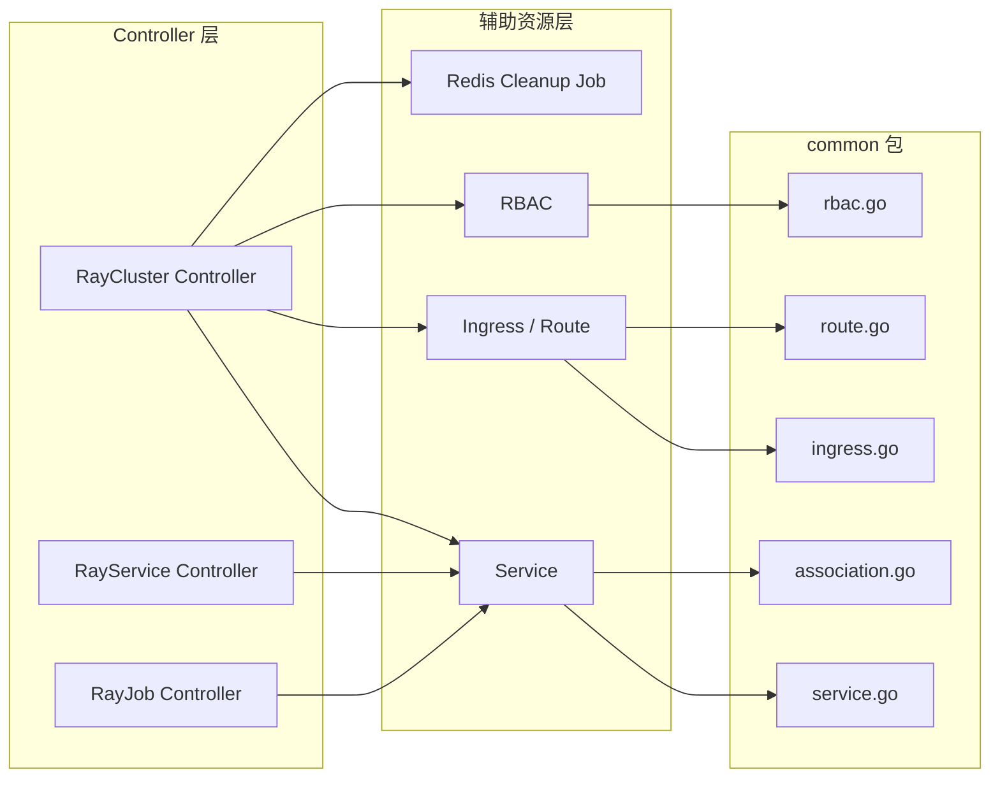
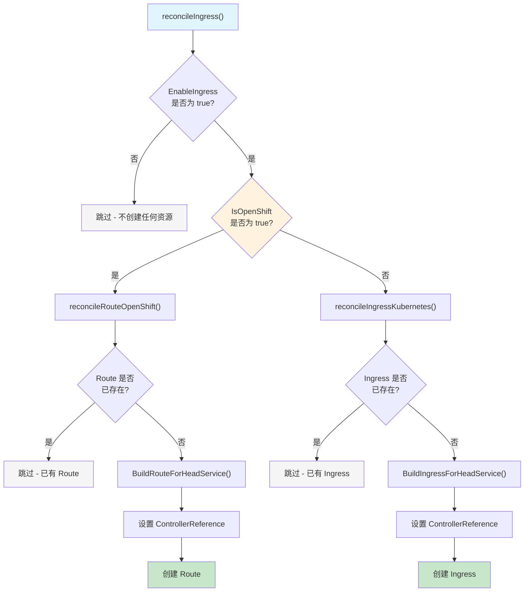
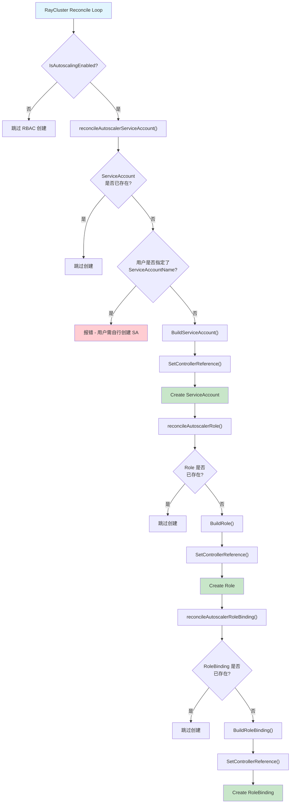
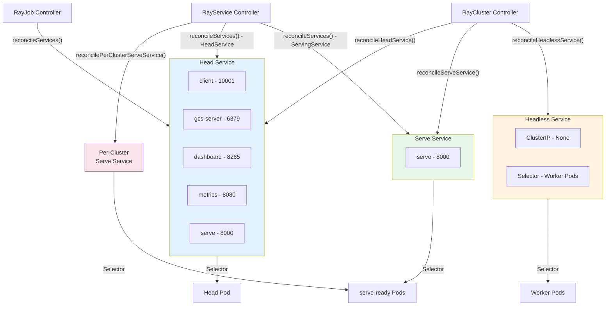

---

## 前置知识

| 知识领域 | 要求程度 | 说明 |
|---------|---------|------|
| Kubernetes Service | 必须掌握 | 理解 ClusterIP / NodePort / LoadBalancer / Headless Service |
| Kubernetes Ingress | 建议了解 | IngressClass、路径路由、TLS 配置 |
| Kubernetes RBAC | 建议了解 | ServiceAccount / Role / RoleBinding 模型 |
| OpenShift Route | 可选 | 仅在 OpenShift 环境下需要了解 |
| KubeRay CRD 基础 | 必须掌握 | RayCluster / RayService / RayJob 的基本概念 |
| Go 语言基础 | 建议了解 | 便于阅读源码分析 |

---

## 目录

- [1. 概述](#1-概述)
- [2. Service 资源管理](#2-service-资源管理)
  - [2.1 Head Service](#21-head-service)
  - [2.2 Headless Service](#22-headless-service)
  - [2.3 Serve Service](#23-serve-service)
  - [2.4 Per-Cluster Serve Service - 增量升级专用](#24-per-cluster-serve-service---增量升级专用)
- [3. Ingress 管理](#3-ingress-管理)
- [4. OpenShift Route 管理](#4-openshift-route-管理)
- [5. Autoscaler RBAC 自动创建](#5-autoscaler-rbac-自动创建)
- [6. Redis Cleanup Job 构建](#6-redis-cleanup-job-构建)
- [7. Association Options 标签过滤机制](#7-association-options-标签过滤机制)
- [8. reconcileServices 在各 Controller 中的调用](#8-reconcileservices-在各-controller-中的调用)
- [9. 延伸阅读](#9-延伸阅读)

---

## 1. 概述

在 KubeRay Operator 中，除了 Pod 的创建与管理外，还需要管理一系列辅助 Kubernetes 资源来保障 Ray 集群的正常运行。这些资源包括：

- **Service** - 为 Head Pod、Worker Pod 以及 Ray Serve 流量提供网络入口
- **Ingress / Route** - 将 Ray Dashboard 暴露到集群外部
- **RBAC 资源** - 为 Autoscaler 提供必要的 API 权限
- **Redis Cleanup Job** - 在启用 GCS 容错的集群删除时清理 Redis 中的存储命名空间
- **Association Options** - 基于标签的资源过滤机制，贯穿整个 Controller 的资源查询逻辑

本文将从源码层面深入剖析这些资源的构建过程、调度逻辑以及它们在不同 Controller 中的协作方式。



---

## 2. Service 资源管理

### 2.1 Head Service

Head Service 是 Ray 集群中最核心的 Service 资源，它为 Worker 节点连接 Head 节点提供稳定的网络端点，同时对外暴露 Dashboard、Client、Metrics 等端口。

**源码文件**: `ray-operator/controllers/ray/common/service.go` - `BuildServiceForHeadPod()` (L37-142)

#### 2.1.1 默认端口配置

当用户未在 Head Pod 容器中显式定义端口时，KubeRay 会使用以下默认端口：

| 端口名称 | 端口号 | 用途 | 常量名 |
|---------|-------|------|--------|
| `client` | 10001 | Ray Client 连接（ray.init 远程连接） | `DefaultClientPort` |
| `gcs-server` | 6379 | GCS Server 通信端口 | `DefaultGcsServerPort` |
| `dashboard` | 8265 | Ray Dashboard Web UI | `DefaultDashboardPort` |
| `metrics` | 8080 | Prometheus 指标暴露 | `DefaultMetricsPort` |
| `serve` | 8000 | Ray Serve 推理服务端口 | `DefaultServingPort` |

这些常量定义在 `ray-operator/controllers/ray/utils/constant.go` (L100-112) 中：

```go
// ray-operator/controllers/ray/utils/constant.go
const (
    DefaultClientPort               = 10001
    DefaultGcsServerPort            = 6379
    DefaultDashboardPort            = 8265
    DefaultMetricsPort              = 8080
    DefaultDashboardAgentListenPort = 52365
    DefaultServingPort              = 8000

    ClientPortName    = "client"
    GcsServerPortName = "gcs-server"
    DashboardPortName = "dashboard"
    MetricsPortName   = "metrics"
    ServingPortName   = "serve"
)
```

#### 2.1.2 端口获取逻辑

端口的获取遵循以下优先级链：

```
用户在容器中定义的 Ports  >  默认端口集合
                                  |
                        metrics 端口始终保证存在
```

核心代码在 `getServicePorts()` 函数中：

```go
// ray-operator/controllers/ray/common/service.go L396-410
func getServicePorts(cluster rayv1.RayCluster) map[string]int32 {
    ports := getPortsFromCluster(cluster)
    if len(ports) == 0 {
        ports = getDefaultPorts()
    }
    // metrics 端口始终需要存在
    if _, metricsDefined := ports[utils.MetricsPortName]; !metricsDefined {
        ports[utils.MetricsPortName] = utils.DefaultMetricsPort
    }
    return ports
}
```

`getPortsFromCluster()` 直接从 Head 容器的 `containerPort` 定义中提取端口映射。如果某个 port 没有 `name` 字段，会自动生成 `<端口号>-port` 格式的名称。

#### 2.1.3 Service 类型与 Headless 默认行为

一个关键的设计决策是：**当未启用 `ENABLE_RAY_HEAD_CLUSTER_IP_SERVICE` 环境变量且 Service 类型为 ClusterIP（或未指定）时，Head Service 默认为 Headless Service**。

```go
// ray-operator/controllers/ray/common/service.go L127-131
if !getEnableRayHeadClusterIPService() &&
    (defaultType == "" || defaultType == corev1.ServiceTypeClusterIP) {
    headService.Spec.ClusterIP = corev1.ClusterIPNone
    headService.Spec.PublishNotReadyAddresses = true
}
```

这个设计的原因是：一个 RayCluster 最多只有一个 Head Pod，使用 Headless Service 可以直接解析到 Pod IP，避免了 kube-proxy 的额外转发开销。同时设置 `PublishNotReadyAddresses: true` 确保即使 Head Pod 的健康检查未通过，DNS 仍能解析到该地址。

#### 2.1.4 自定义 HeadService 支持

用户可以在 `RayCluster.Spec.HeadGroupSpec.HeadService` 中提供完整的自定义 Service 定义。此时，KubeRay 会：

1. **深拷贝**用户的 HeadService 定义，避免修改原始对象
2. **强制覆盖** Selector - 忽略用户自定义的 Selector，使用默认的 Head Pod 选择器
3. **合并 Annotations** - 默认 Annotations 覆盖用户自定义 Annotations 中的重复键
4. **追加默认端口** - 将默认端口追加到用户定义的端口列表中
5. **设置名称/命名空间/类型** - 如果用户未指定，使用默认值

```go
// ray-operator/controllers/ray/common/service.go L79-111
if cluster.Spec.HeadGroupSpec.HeadService != nil {
    headService := cluster.Spec.HeadGroupSpec.HeadService.DeepCopy()
    headService.Spec.Selector = selector  // 强制覆盖
    // 合并 annotations ...
    headService.Spec.Ports = append(headService.Spec.Ports, ports...)
    // 设置 labels / name / namespace / type ...
    return headService, nil
}
```

#### 2.1.5 Head Service 标签体系

Head Service 使用以下标签进行标识和选择：

| 标签键 | 值 | 用途 |
|--------|-----|------|
| `ray.io/cluster` | `<cluster-name>` | 关联 RayCluster |
| `ray.io/node-type` | `head` | 标识 Head 节点 |
| `ray.io/identifier` | `<cluster-name>-head` | 唯一标识 |
| `app.kubernetes.io/name` | `kuberay` | 标准 K8s 应用标签 |
| `app.kubernetes.io/created-by` | `kuberay-operator` | 标准 K8s 创建者标签 |

---

### 2.2 Headless Service

Headless Service 专用于 **多主机 Worker Group** 场景（`NumOfHosts > 1`），为同一 Worker Group 中的多个 Pod 提供点对点通信能力。

**源码文件**: `ray-operator/controllers/ray/common/service.go` - `BuildHeadlessServiceForRayCluster()` (L292-321)

```go
// ray-operator/controllers/ray/common/service.go L292-321
func BuildHeadlessServiceForRayCluster(rayCluster rayv1.RayCluster) *corev1.Service {
    name := rayCluster.Name + utils.DashSymbol + utils.HeadlessServiceSuffix
    // ...
    headlessService := &corev1.Service{
        // ...
        Spec: corev1.ServiceSpec{
            ClusterIP: "None",
            Selector:  selectorLabels,   // ray.io/cluster + ray.io/node-type=worker
            Type:      corev1.ServiceTypeClusterIP,
            PublishNotReadyAddresses: true,
        },
    }
    return headlessService
}
```

关键特征：
- **ClusterIP 设为 "None"** - 这是 Headless Service 的标准配置
- **Selector 只选择 Worker 节点** - 通过 `ray.io/node-type: worker` 标签过滤
- **PublishNotReadyAddresses 为 true** - 无需依赖 Proxy Actor 的就绪状态即可发布 DNS 地址
- **仅在多主机场景下创建** - Controller 会检查是否存在 `NumOfHosts > 1` 的 Worker Group

Headless Service 的 reconcile 逻辑位于 `raycluster_controller.go` 的 `reconcileHeadlessService()` (L582-613)：

```go
// ray-operator/controllers/ray/raycluster_controller.go L582-613
func (r *RayClusterReconciler) reconcileHeadlessService(ctx context.Context, instance *rayv1.RayCluster) error {
    isMultiHost := false
    for _, workerGroup := range instance.Spec.WorkerGroupSpecs {
        if workerGroup.NumOfHosts > 1 {
            isMultiHost = true
            break
        }
    }
    if isMultiHost {
        // 创建或验证 Headless Service 存在
    }
    return nil
}
```

---

### 2.3 Serve Service

Serve Service 为 Ray Serve 推理流量提供专用的 Kubernetes Service 入口。

**源码文件**: `ray-operator/controllers/ray/common/service.go` - `BuildServeService()` (L181-289)

#### 2.3.1 Serve Service 的创建条件

- **RayCluster 场景**：需要在集群上设置 annotation `ray.io/enable-serve-service: "true"`
- **RayService 场景**：自动创建，用户也可以通过 `spec.serveService` 提供自定义定义

#### 2.3.2 核心构建逻辑

```go
// ray-operator/controllers/ray/common/service.go L181-289
func BuildServeService(ctx context.Context, rayService rayv1.RayService,
    rayCluster rayv1.RayCluster, isRayService bool) (*corev1.Service, error) {
    // ...
    selectorLabels := map[string]string{
        utils.RayClusterLabelKey: rayCluster.Name,
    }
    if isRayService {
        selectorLabels[utils.RayClusterServingServiceLabelKey] =
            utils.EnableRayClusterServingServiceTrue
    }
    // 只包含 serve 端口
    if _, defined := portsInt[utils.ServingPortName]; defined {
        svcPort := corev1.ServicePort{
            Name: utils.ServingPortName,
            Port: portsInt[utils.ServingPortName],
        }
        ports = append(ports, svcPort)
    }
    // ...
}
```

关键设计要点：
- Serve Service **只暴露 `serve` 端口**（默认 8000），不暴露其他端口
- 在 RayService 场景中，Selector 额外添加 `ray.io/serve` 标签，只将流量路由到 serve-ready 的 Pod
- 支持用户通过 `rayService.Spec.ServeService` 提供自定义 Service 定义

---

### 2.4 Per-Cluster Serve Service - 增量升级专用

在 RayService 的增量升级（Incremental Upgrade）场景下，每个 RayCluster 会获得独立的 Serve Service，用作 HTTPRoute 的后端引用（backend refs）。

**源码文件**: `ray-operator/controllers/ray/rayservice_controller.go` - `reconcilePerClusterServeService()` (L1894-1923)

```go
// ray-operator/controllers/ray/rayservice_controller.go L1894-1923
func (r *RayServiceReconciler) reconcilePerClusterServeService(ctx context.Context,
    rayServiceInstance *rayv1.RayService, rayClusterInstance *rayv1.RayCluster) error {
    if rayClusterInstance == nil {
        return nil
    }
    desiredSvc, err := common.BuildServeService(ctx,
        *rayServiceInstance, *rayClusterInstance, true)
    if err != nil {
        return err
    }
    // Owner 设置为 RayCluster 而非 RayService
    if err := ctrl.SetControllerReference(rayClusterInstance, desiredSvc, r.Scheme); err != nil {
        return err
    }
    // 只创建不更新
    existingSvc := &corev1.Service{}
    err = r.Get(ctx, client.ObjectKey{...}, existingSvc)
    if errors.IsNotFound(err) {
        return r.Create(ctx, desiredSvc)
    }
    return err
}
```

重要细节：
- 当 `IsIncrementalUpgradeEnabled` 时，Service 名称基于 **RayCluster 名称**而非 RayService 名称
- Owner 设置为 RayCluster，意味着当 RayCluster 被删除时，对应的 Per-Cluster Serve Service 也会被垃圾回收
- Active 和 Pending 集群各有一个独立的 Serve Service

---

## 3. Ingress 管理

Ingress 资源用于将 Ray Dashboard 暴露到 Kubernetes 集群外部。

**源码文件**: `ray-operator/controllers/ray/common/ingress.go`

### 3.1 Ingress 构建逻辑

```go
// ray-operator/controllers/ray/common/ingress.go L18-97
func BuildIngressForHeadService(ctx context.Context,
    cluster rayv1.RayCluster) (*networkingv1.Ingress, error) {
    // ...
    pathType := networkingv1.PathTypeExact
    paths := []networkingv1.HTTPIngressPath{
        {
            Path:     "/" + cluster.Name + "/(.*)",
            PathType: &pathType,
            Backend: networkingv1.IngressBackend{
                Service: &networkingv1.IngressServiceBackend{
                    Name: headSvcName,
                    Port: networkingv1.ServiceBackendPort{
                        Number: dashboardPort,
                    },
                },
            },
        },
    }
    // ...
}
```

### 3.2 IngressClassName 配置

IngressClassName 通过 RayCluster 的 Annotation `kubernetes.io/ingress.class` 配置：

```go
// ray-operator/controllers/ray/common/ingress.go L89-94
if ingressClassName, ok := cluster.Annotations[IngressClassAnnotationKey]; !ok {
    log.Info("Ingress class annotation is not set for the cluster.")
} else {
    ingress.Spec.IngressClassName = &ingressClassName
}
```

注意：`kubernetes.io/ingress.class` Annotation 本身会被排除在 Ingress 的 Annotations 复制列表之外，避免同时设置 Annotation 和 `Spec.IngressClassName` 导致冲突（尤其在 AWS EKS 上）。

### 3.3 Annotation 透传

Ingress 会复制 RayCluster 上的所有 Annotations（排除 `kubernetes.io/ingress.class`），这为用户提供了通用的自定义机制，例如配置 Nginx Ingress Controller 的 rewrite 规则等。

### 3.4 Ingress 创建决策流程



`reconcileIngress()` 位于 `raycluster_controller.go` (L425-438)：

```go
// ray-operator/controllers/ray/raycluster_controller.go L425-438
func (r *RayClusterReconciler) reconcileIngress(ctx context.Context,
    instance *rayv1.RayCluster) error {
    if instance.Spec.HeadGroupSpec.EnableIngress == nil ||
        !*instance.Spec.HeadGroupSpec.EnableIngress {
        return nil
    }
    if r.options.IsOpenShift {
        return r.reconcileRouteOpenShift(ctx, instance)
    }
    return r.reconcileIngressKubernetes(ctx, instance)
}
```

---

## 4. OpenShift Route 管理

在 OpenShift 环境中，KubeRay 使用 Route 资源替代 Ingress 来暴露 Ray Dashboard。

**源码文件**: `ray-operator/controllers/ray/common/route.go`

### 4.1 IsOpenShift 检测

`IsOpenShift` 是 `RayClusterReconcilerOptions` 结构体中的一个布尔字段（定义在 `raycluster_controller.go` L91），在 Operator 启动时根据集群环境设置。

```go
// ray-operator/controllers/ray/raycluster_controller.go L85-92
type RayClusterReconcilerOptions struct {
    RayClusterMetricsManager *metrics.RayClusterMetricsManager
    BatchSchedulerManager    *batchscheduler.SchedulerManager
    HeadSidecarContainers    []corev1.Container
    WorkerSidecarContainers  []corev1.Container
    DefaultContainerEnvs     []corev1.EnvVar
    IsOpenShift              bool
}
```

### 4.2 Route 构建

```go
// ray-operator/controllers/ray/common/route.go L16-63
func BuildRouteForHeadService(cluster rayv1.RayCluster) (*routev1.Route, error) {
    // ...
    weight := int32(100)
    route := &routev1.Route{
        // ...
        Spec: routev1.RouteSpec{
            To: routev1.RouteTargetReference{
                Kind:   "Service",
                Name:   serviceName,
                Weight: &weight,
            },
            Port: &routev1.RoutePort{
                TargetPort: intstr.FromInt(dashboardPort),
            },
            WildcardPolicy: "None",
        },
    }
    return route, nil
}
```

Route 的关键配置：
- **Kind**: 目标为 `Service`，指向 Head Service
- **Weight**: 100（100% 流量转发到目标 Service）
- **TargetPort**: Dashboard 端口（默认 8265）
- **WildcardPolicy**: "None"，不使用通配符
- **Annotations**: 透传 RayCluster 的所有 Annotations，用于自定义路由行为

---

## 5. Autoscaler RBAC 自动创建

当 RayCluster 启用了 InTree Autoscaling 时，Controller 会自动创建 RBAC 资源，使 Autoscaler Sidecar 容器能够通过 Kubernetes API 执行扩缩容操作。

**源码文件**: `ray-operator/controllers/ray/common/rbac.go`

### 5.1 RBAC 资源创建链路



### 5.2 ServiceAccount 构建

```go
// ray-operator/controllers/ray/common/rbac.go L13-27
func BuildServiceAccount(cluster *rayv1.RayCluster) (*corev1.ServiceAccount, error) {
    sa := &corev1.ServiceAccount{
        ObjectMeta: metav1.ObjectMeta{
            Name:      utils.GetHeadGroupServiceAccountName(cluster),
            Namespace: cluster.Namespace,
            Labels: map[string]string{
                utils.RayClusterLabelKey:                cluster.Name,
                utils.KubernetesApplicationNameLabelKey: utils.ApplicationName,
                utils.KubernetesCreatedByLabelKey:       utils.ComponentName,
            },
        },
    }
    return sa, nil
}
```

如果用户已在 HeadGroupSpec 中通过 `ServiceAccountName` 指定了自定义 ServiceAccount，KubeRay **不会**自动创建 ServiceAccount，而是要求用户自行创建。这是为了避免在 RayService 滚动升级时出现权限问题（参见 [PR #1128](https://github.com/ray-project/kuberay/pull/1128)）。

### 5.3 Role 权限定义

Autoscaler 的 Role 包含以下权限规则：

```go
// ray-operator/controllers/ray/common/rbac.go L30-61
func BuildRole(cluster *rayv1.RayCluster) (*rbacv1.Role, error) {
    role := &rbacv1.Role{
        // ...
        Rules: []rbacv1.PolicyRule{
            {
                APIGroups: []string{""},
                Resources: []string{"pods"},
                Verbs:     []string{"get", "list", "watch", "patch"},
            },
            {
                APIGroups: []string{""},
                Resources: []string{"pods/resize"},
                Verbs:     []string{"patch"},
            },
            {
                APIGroups: []string{"ray.io"},
                Resources: []string{"rayclusters"},
                Verbs:     []string{"get", "patch"},
            },
        },
    }
    return role, nil
}
```

权限说明：

| API Group | 资源 | 操作 | 用途 |
|-----------|------|------|------|
| `""` (core) | `pods` | get / list / watch / patch | 监控和操作 Worker Pod |
| `""` (core) | `pods/resize` | patch | 支持 Pod 在线资源调整（In-Place Resize） |
| `ray.io` | `rayclusters` | get / patch | 读取和更新 RayCluster 的 WorkerGroupSpec 中的 Replicas 字段 |

### 5.4 RoleBinding 构建

```go
// ray-operator/controllers/ray/common/rbac.go L64-93
func BuildRoleBinding(cluster *rayv1.RayCluster) (*rbacv1.RoleBinding, error) {
    serviceAccountName := utils.GetHeadGroupServiceAccountName(cluster)
    rb := &rbacv1.RoleBinding{
        // ...
        Subjects: []rbacv1.Subject{
            {
                Kind:      rbacv1.ServiceAccountKind,
                Name:      utils.CheckName(serviceAccountName),
                Namespace: cluster.Namespace,
            },
        },
        RoleRef: rbacv1.RoleRef{
            APIGroup: rbacv1.GroupName,
            Kind:     "Role",
            Name:     utils.CheckName(cluster.Name),
        },
    }
    return rb, nil
}
```

### 5.5 OwnerReference 与垃圾回收

所有 RBAC 资源（ServiceAccount / Role / RoleBinding）都通过 `SetControllerReference()` 设置 OwnerReference 为对应的 RayCluster。当 RayCluster 被删除时，Kubernetes 的垃圾回收机制（Garbage Collector）会自动清理这些 RBAC 资源。

---

## 6. Redis Cleanup Job 构建

当启用 GCS Fault Tolerance（使用 Redis 作为外部存储）的 RayCluster 被删除时，KubeRay 会创建一个 Kubernetes Batch Job 来清理 Redis 中的存储命名空间。

**源码文件**: `ray-operator/controllers/ray/raycluster_controller.go` - `buildRedisCleanupJob()` (L1434-1517)

### 6.1 Job 构建过程

```go
// ray-operator/controllers/ray/raycluster_controller.go L1434-1517
func (r *RayClusterReconciler) buildRedisCleanupJob(ctx context.Context,
    instance rayv1.RayCluster) batchv1.Job {
    // 1. 基于 Head Pod 模板构建 Pod
    pod := r.buildHeadPod(ctx, instance)
    // 2. 修改标签为 RedisCleanupNode 类型
    pod.Labels[utils.RayNodeTypeLabelKey] = string(rayv1.RedisCleanupNode)
    // 3. 只保留 Ray 容器
    pod.Spec.Containers = []corev1.Container{
        pod.Spec.Containers[utils.RayContainerIndex],
    }
    // 4. 替换命令为 Redis 清理脚本
    pod.Spec.Containers[0].Command = utils.GetContainerCommand([]string{})
    pod.Spec.Containers[0].Args = []string{
        // Python 脚本调用 ray._private.gcs_utils.cleanup_redis_storage
    }
    // 5. 禁用健康检查
    pod.Spec.Containers[0].LivenessProbe = nil
    pod.Spec.Containers[0].ReadinessProbe = nil
    // 6. 固定资源配额（避免使用 GPU）
    pod.Spec.Containers[0].Resources = corev1.ResourceRequirements{
        Limits: corev1.ResourceList{
            corev1.ResourceCPU:    resource.MustParse("200m"),
            corev1.ResourceMemory: resource.MustParse("256Mi"),
        },
        // ...
    }
    // 7. 设置 RestartPolicy 为 Never
    pod.Spec.RestartPolicy = corev1.RestartPolicyNever
    // ...
}
```

### 6.2 关键配置参数

| 配置项 | 值 | 说明 |
|--------|-----|------|
| BackoffLimit | 0 | 不重试，失败即停止 |
| ActiveDeadlineSeconds | 300 | 最多运行 5 分钟 |
| RestartPolicy | Never | Pod 不重启 |
| CPU Limits | 200m | 低资源消耗 |
| Memory Limits | 256Mi | 低资源消耗 |
| RAY_redis_db_connect_retries | 120 | Redis 连接重试次数 |
| RAY_redis_db_connect_wait_milliseconds | 500 | 每次重试间隔 |

### 6.3 清理脚本核心逻辑

Job 内部运行的 Python 脚本调用 `ray._private.gcs_utils.cleanup_redis_storage` 方法，参数从环境变量中获取：

- `RAY_REDIS_ADDRESS` - Redis 地址（取第一个逗号分隔的地址）
- `REDIS_USERNAME` - Redis 用户名（可选）
- `REDIS_PASSWORD` - Redis 密码
- `RAY_external_storage_namespace` - Ray 使用的 Redis 存储命名空间

### 6.4 Job 在 Finalizer 中的处理

Redis Cleanup Job 在 RayCluster 的 Finalizer 处理流程中执行。Controller 会持续 Requeue 检查 Job 状态：

- **Job 成功完成** - 移除 Finalizer，允许 RayCluster 被删除
- **Job 仍在运行** - 继续 Requeue 等待
- **Job 失败** - 记录错误日志，提示用户手动清理 Redis 并移除 Finalizer

---

## 7. Association Options 标签过滤机制

Association Options 是 KubeRay 中一套基于标签的资源过滤抽象层，用于在 Controller 中精确查询和操作不同类型的 Kubernetes 资源。

**源码文件**: `ray-operator/controllers/ray/common/association.go`

### 7.1 核心接口设计

```go
// ray-operator/controllers/ray/common/association.go L54-73
type AssociationOption interface {
    client.ListOption
    client.DeleteAllOfOption
}

type AssociationOptions []AssociationOption

func (list AssociationOptions) ToListOptions() (options []client.ListOption) { ... }
func (list AssociationOptions) ToDeleteOptions() (options []client.DeleteAllOfOption) { ... }
func (list AssociationOptions) ToMetaV1ListOptions() (options metav1.ListOptions) { ... }
```

`AssociationOption` 同时实现了 `client.ListOption` 和 `client.DeleteAllOfOption` 接口，使得同一组标签过滤条件可以用于 List 和 DeleteAllOf 操作。

### 7.2 预定义过滤器一览

| 函数名 | 标签选择器 | 用途 |
|--------|-----------|------|
| `RayClusterAllPodsAssociationOptions` | `ray.io/cluster=<name>` | 选择集群的所有 Pod |
| `RayClusterHeadPodsAssociationOptions` | `ray.io/cluster=<name>`, `ray.io/node-type=head` | 只选择 Head Pod |
| `RayClusterWorkerPodsAssociationOptions` | `ray.io/cluster=<name>`, `ray.io/node-type=worker` | 选择所有 Worker Pod |
| `RayClusterGroupPodsAssociationOptions` | `ray.io/cluster=<name>`, `ray.io/group=<group>` | 选择特定 Worker Group 的 Pod |
| `RayClusterRedisCleanupJobAssociationOptions` | `ray.io/cluster=<name>`, `ray.io/node-type=redis-cleanup` | 选择 Redis 清理 Job 的 Pod |
| `RayServiceRayClustersAssociationOptions` | `ray.io/originated-from-cr-name=<name>`, `ray.io/originated-from-crd=...` | 选择 RayService 关联的所有 RayCluster |
| `RayClusterNetworkResourcesOptions` | `ray.io/cluster=<name>` | 选择集群的网络资源（Ingress / Route） |

### 7.3 使用示例

以获取 Head Pod 为例：

```go
// ray-operator/controllers/ray/common/association.go L178-196
func GetRayClusterHeadPod(ctx context.Context, reader client.Reader,
    instance *rayv1.RayCluster) (*corev1.Pod, error) {
    runtimePods := corev1.PodList{}
    filterLabels := RayClusterHeadPodsAssociationOptions(instance)
    if err := reader.List(ctx, &runtimePods, filterLabels.ToListOptions()...); err != nil {
        return nil, err
    }
    if len(runtimePods.Items) == 0 {
        return nil, nil  // 允许 Head Pod 暂时不存在
    }
    if len(runtimePods.Items) > 1 {
        return nil, fmt.Errorf("found multiple heads")
    }
    return &runtimePods.Items[0], nil
}
```

### 7.4 NamespacedName 辅助函数

association.go 还提供了一系列 NamespacedName 辅助函数，用于精确定位特定资源：

```go
RayClusterServeServiceNamespacedName(instance)           // Serve Service
RayClusterAutoscalerRoleNamespacedName(instance)         // Autoscaler Role
RayClusterAutoscalerRoleBindingNamespacedName(instance)  // Autoscaler RoleBinding
RayClusterAutoscalerServiceAccountNamespacedName(instance) // Autoscaler SA
RayServiceServeServiceNamespacedName(rayService)         // RayService Serve Service
RayServiceActiveRayClusterNamespacedName(rayService)     // Active RayCluster
RayServicePendingRayClusterNamespacedName(rayService)    // Pending RayCluster
RayJobK8sJobNamespacedName(rayJob)                       // RayJob K8s Job
RayJobRayClusterNamespacedName(rayJob)                   // RayJob 关联的 RayCluster
```

---

## 8. reconcileServices 在各 Controller 中的调用

### 8.1 Service 类型与端口映射总览



### 8.2 RayCluster Controller

RayCluster Controller 在 reconcile 循环中按顺序调用以下 Service reconcile 函数：

```go
// ray-operator/controllers/ray/raycluster_controller.go L307-317
reconcileFuncs := []reconcileFunc{
    r.reconcileAutoscalerServiceAccount,
    r.reconcileAutoscalerRole,
    r.reconcileAutoscalerRoleBinding,
    r.reconcileIngress,
    r.reconcileAuthSecret,
    r.reconcileHeadService,       // Head Service
    r.reconcileHeadlessService,   // Headless Service（仅多主机场景）
    r.reconcileServeService,      // Serve Service（需要 annotation 启用）
    r.reconcilePods,
}
```

**执行特点**：
- 顺序执行，任一环节出错则中断后续步骤
- Head Service 在 Pod 创建之前完成 reconcile，确保 Pod 启动时 DNS 解析可用
- 所有 Service 通过 `SetControllerReference` 设置 OwnerReference，RayCluster 删除时自动回收

`reconcileHeadService()` 的核心逻辑（L503-550）：
1. 通过标签查询已有的 Head Service
2. 如果恰好存在 1 个 - 跳过
3. 如果存在多个 - 报错（防止用户手动创建重复 Service）
4. 如果不存在 - 调用 `BuildServiceForHeadPod()` 创建

### 8.3 RayService Controller

RayService Controller 的 Service reconcile 更为复杂，因为它需要管理 Service 在不同 RayCluster 之间的切换。

```go
// ray-operator/controllers/ray/rayservice_controller.go L301-311
func (r *RayServiceReconciler) reconcileServicesToReadyCluster(ctx context.Context,
    rayServiceInstance *rayv1.RayService,
    rayClusterInstance *rayv1.RayCluster) (*corev1.Service, *corev1.Service, error) {
    headSvc, err := r.reconcileServices(ctx, rayServiceInstance,
        rayClusterInstance, utils.HeadService)
    if err != nil {
        return headSvc, nil, err
    }
    serveSvc, err := r.reconcileServices(ctx, rayServiceInstance,
        rayClusterInstance, utils.ServingService)
    if err != nil {
        return headSvc, serveSvc, err
    }
    return headSvc, serveSvc, nil
}
```

`reconcileServices()` (L1552-1608) 的关键行为：

1. 根据 serviceType 调用不同的 Build 函数（`BuildHeadServiceForRayService` 或 `BuildServeServiceForRayService`）
2. 查询已有 Service - 如果 Service 已经指向当前 RayCluster，则跳过更新
3. **集群切换时更新 Service** - 当 RayCluster 发生切换时，更新 Service 的 Selector 指向新集群
4. 更新时**保留原 ClusterIP** - 保证 Service 的 ClusterIP 不变，维持连接稳定性
5. Service 的 OwnerReference 设置为 **RayService**（非 RayCluster），确保 Service 在 RayCluster 切换时不被回收

### 8.4 RayJob Controller

RayJob Controller 也管理自己的 Head Service：

```go
// ray-operator/controllers/ray/rayjob_controller.go L624
func (r *RayJobReconciler) reconcileServices(ctx context.Context,
    rayJobInstance *rayv1.RayJob,
    rayClusterInstance *rayv1.RayCluster) error { ... }
```

RayJob 的 Head Service 命名基于 RayJob 名称，通过 `BuildHeadServiceForRayJob()` 构建。其 Labels 使用 `ray.io/originated-from-cr-name` 和 `ray.io/originated-from-crd` 来标识来源。

### 8.5 Service OwnerReference 与垃圾回收对比

| Controller | Service 类型 | Owner | 删除时机 |
|-----------|-------------|-------|---------|
| RayCluster | Head Service | RayCluster | RayCluster 删除时 |
| RayCluster | Serve Service | RayCluster | RayCluster 删除时 |
| RayCluster | Headless Service | RayCluster | RayCluster 删除时 |
| RayService | Head Service | RayService | RayService 删除时 |
| RayService | Serve Service | RayService | RayService 删除时 |
| RayService | Per-Cluster Serve Service | RayCluster | RayCluster 删除时（增量升级） |
| RayJob | Head Service | RayJob | RayJob 删除时 |

---

## 9. 延伸阅读

- [Kubernetes Service 官方文档](https://kubernetes.io/docs/concepts/services-networking/service/)
- [Kubernetes Ingress 官方文档](https://kubernetes.io/docs/concepts/services-networking/ingress/)
- [Kubernetes RBAC 官方文档](https://kubernetes.io/docs/reference/access-authn-authz/rbac/)
- [KubeRay GCS Fault Tolerance 指南](https://docs.ray.io/en/master/cluster/kubernetes/user-guides/kuberay-gcs-ft.html)
- [KubeRay Autoscaler 配置](https://docs.ray.io/en/master/cluster/kubernetes/user-guides/configuring-autoscaling.html)
- [OpenShift Route 文档](https://docs.openshift.com/container-platform/latest/networking/routes/route-configuration.html)

---

## 下一篇

> **[6.1 - Autoscaler 集成机制](../06-advanced-features/01-autoscaler-integration.md)**
>
> 深入分析 KubeRay 与 Ray Autoscaler 的集成原理，包括 InTree Autoscaling 的完整工作流程。
