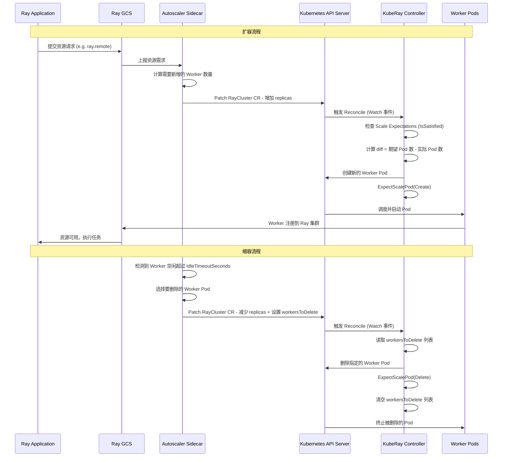
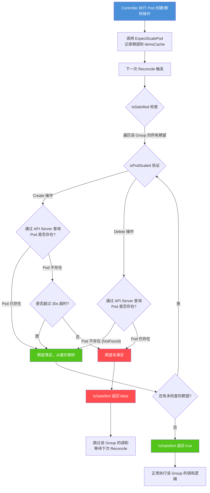
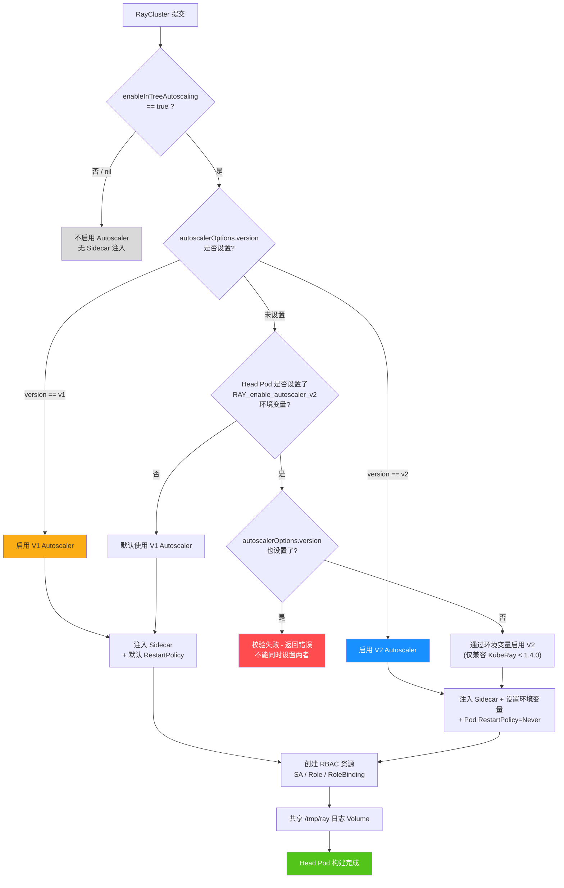

<p align="center">
  
</p>

> 本文基于 KubeRay 源码，深入解析 Ray Autoscaler 与 KubeRay Operator 的集成机制。内容涵盖 In-tree Autoscaling 的启用原理、V1/V2 Autoscaler 的版本选择逻辑、Scale Expectations 缓存一致性保障、WorkersToDelete 精准缩容交互、UpscalingMode 与 IdleTimeoutSeconds 配置等核心话题。

---

## 目录

- [前置知识](#前置知识)
- [In-tree Autoscaling 机制](#in-tree-autoscaling-机制)
- [V1 与 V2 Autoscaler](#v1-与-v2-autoscaler)
- [Scale Expectations 机制详解](#scale-expectations-机制详解)
- [WorkersToDelete 缩容交互](#workerstodelete-缩容交互)
- [UpscalingMode 配置](#upscalingmode-配置)
- [IdleTimeoutSeconds 空闲超时](#idletimeoutseconds-空闲超时)
- [Autoscaler 扩缩容完整流程](#autoscaler-扩缩容完整流程)
- [Scale Expectations 工作原理图](#scale-expectations-工作原理图)
- [V1 vs V2 Autoscaler 选择逻辑图](#v1-vs-v2-autoscaler-选择逻辑图)
- [调试与排障指南](#调试与排障指南)
- [延伸阅读](#延伸阅读)
- [下一篇](#下一篇)

---

## 前置知识

| 知识领域 | 说明 |
|---------|------|
| **Kubernetes Controller 模式** | 理解 Informer / WorkQueue / Reconciler 三层架构 |
| **Ray Autoscaler 基本概念** | 了解 Ray Autoscaler 如何监控资源需求并触发扩缩容 |
| **RBAC 权限模型** | 理解 ServiceAccount / Role / RoleBinding 的关系 |
| **Sidecar 容器模式** | 了解 Pod 中多容器协作的基本模式 |
| **KubeRay Reconciliation Loop** | 建议先阅读 `02-raycluster-controller/01-reconciliation-loop.md` |

---

## In-tree Autoscaling 机制

### EnableInTreeAutoscaling 字段

KubeRay 通过 `enableInTreeAutoscaling` 字段控制是否启用内置自动伸缩。

> 源码位置: `ray-operator/apis/ray/v1/raycluster_types.go` 第 41 行

```go
type RayClusterSpec struct {
    // EnableInTreeAutoscaling indicates whether operator should create
    // in tree autoscaling configs
    EnableInTreeAutoscaling *bool `json:"enableInTreeAutoscaling,omitempty"`
}
```

判断逻辑：

> 源码位置: `ray-operator/controllers/ray/utils/util.go` 第 715-718 行

```go
func IsAutoscalingEnabled(spec *rayv1.RayClusterSpec) bool {
    return spec != nil && spec.EnableInTreeAutoscaling != nil &&
        *spec.EnableInTreeAutoscaling
}
```

当该字段设为 `true` 时，KubeRay Operator 自动完成三项工作：

1. **注入 Autoscaler Sidecar 容器** 到 Head Pod 中
2. **创建 RBAC 资源**（ServiceAccount、Role、RoleBinding）
3. **设置 `no-monitor` 参数** 禁用 Ray 默认的 monitor 进程

### Autoscaler Sidecar 注入流程

核心逻辑位于 `BuildHeadPodTemplate` 函数中：

> 源码位置: `ray-operator/controllers/ray/common/pod.go` 第 193-218 行

```go
if utils.IsAutoscalingEnabled(&instance.Spec) {
    headSpec.RayStartParams["no-monitor"] = "true"
    podTemplate.Spec.ServiceAccountName = utils.CheckName(
        utils.GetHeadGroupServiceAccountName(&instance))
    autoscalerImage := podTemplate.Spec.Containers[utils.RayContainerIndex].Image
    autoscalerContainer := BuildAutoscalerContainer(autoscalerImage)
    mergeAutoscalerOverrides(&autoscalerContainer, instance.Spec.AutoscalerOptions)
    podTemplate.Spec.Containers = append(podTemplate.Spec.Containers, autoscalerContainer)

    if utils.IsAutoscalingV2Enabled(&instance.Spec) {
        setAutoscalerV2EnvVars(&podTemplate)
        podTemplate.Spec.RestartPolicy = corev1.RestartPolicyNever
    }
}
```

`BuildAutoscalerContainer` 构建 sidecar 默认配置（`pod.go` 第 616-668 行），其启动命令为 `ray kuberay-autoscaler --cluster-name $(RAY_CLUSTER_NAME) --cluster-namespace $(RAY_CLUSTER_NAMESPACE)`。

**Autoscaler Sidecar 关键配置项：**

| 配置项 | 默认值 | 说明 |
|-------|--------|------|
| 容器名称 | `autoscaler` | 固定名称，用于容器查找 |
| 镜像 | 与 Ray Head 容器相同 | 可通过 `autoscalerOptions.image` 覆盖 |
| CPU 请求/限制 | `500m` | 可通过 `autoscalerOptions.resources` 覆盖 |
| 内存 请求/限制 | `512Mi` | 可通过 `autoscalerOptions.resources` 覆盖 |

此外，Head Pod 的 Ray 容器和 Autoscaler 容器会共享 `/tmp/ray` 日志 Volume（`pod.go` 第 551-558 行），以支持 Autoscaler 的事件日志功能。

`mergeAutoscalerOverrides` 函数（`pod.go` 第 670-695 行）支持覆盖 `resources`、`image`、`imagePullPolicy`、`env`、`envFrom`、`volumeMounts`、`securityContext` 七个字段。

### RBAC 资源自动创建

Autoscaler sidecar 需要 Kubernetes API 权限。Controller 在 reconcile 链中通过三个函数自动创建 RBAC 资源：

> 源码位置: `ray-operator/controllers/ray/raycluster_controller.go` 第 307-310 行

```go
reconcileFuncs := []reconcileFunc{
    r.reconcileAutoscalerServiceAccount,
    r.reconcileAutoscalerRole,
    r.reconcileAutoscalerRoleBinding,
    // ...
}
```

**ServiceAccount 名称逻辑**：优先使用用户在 Head Pod 模板中指定的 `serviceAccountName`，否则使用 RayCluster 名称：

> 源码位置: `ray-operator/controllers/ray/utils/util.go` 第 574-582 行

```go
func GetHeadGroupServiceAccountName(cluster *rayv1.RayCluster) string {
    headGroupServiceAccountName :=
        cluster.Spec.HeadGroupSpec.Template.Spec.ServiceAccountName
    if headGroupServiceAccountName != "" {
        return headGroupServiceAccountName
    }
    return cluster.Name
}
```

每个 RBAC reconcile 函数都遵循相同模式：检查 Autoscaler 是否启用 -> 查询资源是否存在 -> 不存在则创建。以 `reconcileAutoscalerServiceAccount` 为例：

> 源码位置: `ray-operator/controllers/ray/raycluster_controller.go` 第 1804-1858 行

```go
func (r *RayClusterReconciler) reconcileAutoscalerServiceAccount(
    ctx context.Context, instance *rayv1.RayCluster) error {
    if !utils.IsAutoscalingEnabled(&instance.Spec) {
        return nil  // Autoscaler 未启用时直接跳过
    }
    serviceAccount := &corev1.ServiceAccount{}
    namespacedName := common.RayClusterAutoscalerServiceAccountNamespacedName(instance)
    if err := r.Get(ctx, namespacedName, serviceAccount); err != nil {
        if !errors.IsNotFound(err) {
            return err
        }
        // 如果用户指定了同名 SA 但 SA 不存在，报错提示用户手动创建
        if instance.Spec.HeadGroupSpec.Template.Spec.ServiceAccountName == namespacedName.Name {
            // ... 返回错误并记录 Event
        }
        // 创建 ServiceAccount 并设置 OwnerReference
        serviceAccount, _ := common.BuildServiceAccount(instance)
        serviceAccount.Name = utils.CheckName(serviceAccount.Name)
        controllerutil.SetControllerReference(instance, serviceAccount, r.Scheme)
        r.Create(ctx, serviceAccount)
    }
    return nil
}
```

**Role 定义的最小权限集**（`common/rbac.go` 第 30-61 行）：

| 资源类型 | API Group | 权限 | 用途 |
|---------|-----------|------|------|
| `pods` | `""` (core) | get, list, watch, patch | 监控 Worker Pod 状态 |
| `pods/resize` | `""` (core) | patch | 支持 Pod 原地资源调整 |
| `rayclusters` | `ray.io` | get, patch | 读取集群配置并修改 Worker 副本数 |

三个 RBAC 资源均设置了 `OwnerReference`，指向 RayCluster CR，删除时自动被垃圾回收。

---

## V1 与 V2 Autoscaler

### 版本差异对比

| 特性 | V1 Autoscaler | V2 Autoscaler |
|------|--------------|--------------|
| 适用 Ray 版本 | Ray < 2.47.0 | Ray >= 2.47.0 |
| 架构方式 | 外部 monitor 进程轮询 | 与 Ray GCS 深度集成 |
| Pod 重启策略 | 默认 `Always` | 设置为 `Never` |
| 环境变量 | 无特殊设置 | `RAY_enable_autoscaler_v2=true` |
| 节点类型感知 | 通过 labels | 通过 `RAY_NODE_TYPE_NAME` 环境变量 |
| 节点实例标识 | 无 | 通过 `RAY_CLOUD_INSTANCE_ID` 环境变量 |
| API 配置 | 默认行为 | `autoscalerOptions.version: v2` |

### 版本选择逻辑

> 源码位置: `ray-operator/apis/ray/v1/raycluster_types.go` 第 220-246 行

```go
// Version is the version of the Ray autoscaler.
// Setting this to v1 will explicitly use autoscaler v1.
// Setting this to v2 will explicitly use autoscaler v2.
// If this isn't set, the Ray version determines the autoscaler version.
// In Ray 2.47.0 and later, the default autoscaler version is v2. It's v1 before that.
Version *AutoscalerVersion `json:"version,omitempty"`
```

V2 判断逻辑（`utils/util.go` 第 720-722 行）：

```go
func IsAutoscalingV2Enabled(spec *rayv1.RayClusterSpec) bool {
    return spec != nil && spec.AutoscalerOptions != nil &&
        spec.AutoscalerOptions.Version != nil &&
        *spec.AutoscalerOptions.Version == rayv1.AutoscalerVersionV2
}
```

校验逻辑会检查冲突配置 -- 同时设置 `autoscalerOptions.version` 和 `RAY_enable_autoscaler_v2` 环境变量时会报错（`validation.go` 第 214-215 行）。

### V2 特有的环境变量

V2 启用时，`setAutoscalerV2EnvVars`（`pod.go` 第 240-250 行）向 Head 容器注入 `RAY_enable_autoscaler_v2=true`。同时，所有 Ray 容器还会被注入以下 V2 专用环境变量（`pod.go` 第 807-827 行）：

| 环境变量 | 来源 | 用途 |
|---------|------|------|
| `RAY_enable_autoscaler_v2` | 静态值 `"true"` | 告知 Ray Head 启用 V2 |
| `RAY_CLOUD_INSTANCE_ID` | `metadata.name` | 通过 Pod 名称标识节点实例 |
| `RAY_NODE_TYPE_NAME` | 标签 `ray.io/group` | 感知节点所属 Worker Group |

---

## Scale Expectations 机制详解

### 问题背景 - Informer 缓存延迟

Controller 通过 Informer 缓存获取集群状态，但创建/删除 Pod 后缓存不会立即更新。若不处理，会导致**重复创建**（缓存中没有刚创建的 Pod）或**重复删除**（缓存中仍有刚删除的 Pod）。Scale Expectations 机制解决这一经典的**缓存一致性**问题。

### RayClusterScaleExpectation 接口

> 源码位置: `ray-operator/controllers/ray/expectations/scale_expectations.go` 第 37-41 行

```go
type RayClusterScaleExpectation interface {
    ExpectScalePod(namespace, rayClusterName, group, podName string, action ScaleAction)
    IsSatisfied(ctx context.Context, namespace, rayClusterName, group string) bool
    Delete(rayClusterName, namespace string)
}
```

| 方法 | 说明 |
|------|------|
| `ExpectScalePod` | 执行 Pod 创建/删除后，记录期望变更 |
| `IsSatisfied` | 检查期望是否已被实际状态反映 |
| `Delete` | 清除某个 RayCluster 的所有期望记录 |

### 核心数据结构

实现类使用 `client-go` 的 `cache.Indexer` 作为内部缓存，支持按 Group 和 Cluster 两个维度索引。每条期望以 `rayPod` 结构体表示：

> 源码位置: `scale_expectations.go` 第 130-145 行

```go
type rayPod struct {
    recordTimestamp time.Time     // 记录时间戳，用于超时判断
    action          ScaleAction   // Create 或 Delete
    name            string        // Pod 名称
    namespace       string        // 命名空间
    rayCluster      string        // 所属 RayCluster 名称
    group           string        // 所属 Worker Group 名称
}
```

三个索引键格式：`namespace/name`（唯一标识）、`namespace/rayCluster/group`（按 Group）、`namespace/rayCluster`（按 Cluster）。

### 关键方法解析

**ExpectScalePod** -- 在 Pod 创建/删除操作完成后立刻调用，将期望记录写入 `itemsCache`（`scale_expectations.go` 第 56-71 行）。

Controller 中的调用示例：

```go
// 创建 Head Pod 后 (raycluster_controller.go 第 1329 行)
r.rayClusterScaleExpectation.ExpectScalePod(
    pod.Namespace, instance.Name, expectations.HeadGroup, pod.Name, expectations.Create)

// 删除 Worker Pod 后 (raycluster_controller.go 第 826 行)
r.rayClusterScaleExpectation.ExpectScalePod(
    pod.Namespace, instance.Name, worker.GroupName, pod.Name, expectations.Delete)
```

**IsSatisfied** -- 在 reconcile 循环中，处理 Head Pod 和每个 Worker Group 之前先调用。遍历该 Group 所有期望，通过 `isPodScaled` 逐一验证：

> 源码位置: `ray-operator/controllers/ray/expectations/scale_expectations.go` 第 93-114 行

```go
func (r *rayClusterScaleExpectationImpl) IsSatisfied(
    ctx context.Context, namespace, rayClusterName, group string) bool {
    items, err := r.itemsCache.ByIndex(GroupIndex,
        fmt.Sprintf("%s/%s/%s", namespace, rayClusterName, group))
    if err != nil {
        panic(err)
    }
    for i := range items {
        rp := items[i].(*rayPod)
        isPodSatisfied := r.isPodScaled(ctx, rp)
        if !isPodSatisfied {
            return false   // 只要有一条期望未满足就返回 false
        }
        // 已满足的期望从缓存中删除
        if err := r.itemsCache.Delete(items[i]); err != nil {
            panic(err)
        }
    }
    return true
}
```

Controller 中的调用位置：

```go
// Head Group 检查 (raycluster_controller.go 第 685 行)
if !r.rayClusterScaleExpectation.IsSatisfied(
    ctx, instance.Namespace, instance.Name, expectations.HeadGroup) {
    logger.Info("NotSatisfiedHeadExpectations, reconcile head later")
}

// Worker Group 检查 (raycluster_controller.go 第 748 行)
if !r.rayClusterScaleExpectation.IsSatisfied(
    ctx, instance.Namespace, instance.Name, worker.GroupName) {
    continue  // 未满足则跳过该 Group
}
```

**isPodScaled** -- 通过直接查询 API Server（非 Informer 缓存）判断 Pod 实际状态：

> 源码位置: `ray-operator/controllers/ray/expectations/scale_expectations.go` 第 73-91 行

```go
func (r *rayClusterScaleExpectationImpl) isPodScaled(ctx context.Context, rp *rayPod) bool {
    pod := &corev1.Pod{}
    switch rp.action {
    case Create:
        if err := r.Get(ctx, types.NamespacedName{
            Name: rp.name, Namespace: rp.namespace}, pod); err == nil {
            return true  // Pod 已存在，期望满足
        }
        // 超过 30 秒后视为满足，避免永久阻塞
        return rp.recordTimestamp.Add(ExpectationsTimeout).Before(time.Now())
    case Delete:
        if err := r.Get(ctx, types.NamespacedName{
            Name: rp.name, Namespace: rp.namespace}, pod); err != nil {
            return errors.IsNotFound(err)  // Pod 已删除
        }
    }
    return false
}
```

验证规则总结：
- **Create**：Pod 存在则满足；不存在但超过 30s 超时也视为满足
- **Delete**：Pod NotFound 则满足；仍存在则不满足（无超时机制）

### 超时与 Group 粒度追踪

超时时间为 **30 秒**（`ExpectationsTimeout = time.Second * 30`），仅适用于 Create 操作，防止极端情况下永久阻塞。

Scale Expectations 按 Worker Group 独立追踪 -- 某个 Group 未满足不会阻塞其他 Group：

| Group 标识 | 索引键格式 | 说明 |
|-----------|-----------|------|
| Head Group | `namespace/clusterName/` | `HeadGroup = ""`（空字符串） |
| Worker Group | `namespace/clusterName/groupName` | 每个 Worker Group 独立追踪 |

---

## WorkersToDelete 缩容交互

### 交互流程

Ray Autoscaler 缩容时通过 `ScaleStrategy.WorkersToDelete` **精确指定**要删除的 Pod：

> 源码位置: `ray-operator/apis/ray/v1/raycluster_types.go` 第 185-189 行

```go
type ScaleStrategy struct {
    WorkersToDelete []string `json:"workersToDelete,omitempty"`
}
```

**完整链路：** Autoscaler 检测空闲节点 -> 选择目标 Pod -> patch RayCluster CR（写入 `workersToDelete` + 减少 `replicas`）-> Controller reconcile -> 删除指定 Pod -> 清空列表。

### Controller 处理逻辑

> 源码位置: `ray-operator/controllers/ray/raycluster_controller.go` 第 810-831 行

```go
// Always remove the specified WorkersToDelete - regardless of the value of Replicas.
for _, podsToDelete := range worker.ScaleStrategy.WorkersToDelete {
    pod := corev1.Pod{}
    pod.Name = podsToDelete
    pod.Namespace = utils.GetNamespace(instance.ObjectMeta)
    if err := r.Delete(ctx, &pod); err != nil {
        if !errors.IsNotFound(err) {
            return errstd.Join(utils.ErrFailedDeleteWorkerPod, err)
        }
    } else {
        r.rayClusterScaleExpectation.ExpectScalePod(
            pod.Namespace, instance.Name, worker.GroupName, pod.Name, expectations.Delete)
        deletedWorkers[pod.Name] = deleted
    }
}
worker.ScaleStrategy.WorkersToDelete = []string{}  // 清空
```

**关键设计要点：**

- `WorkersToDelete` 的处理优先级高于 `replicas` 差值计算
- 即使 `replicas` 的值表示不需要缩容，`WorkersToDelete` 中的 Pod 仍然会被删除
- 删除操作完成后立即清空列表以避免重复删除
- 每次成功删除都会记录 Scale Expectation

对于多主机（Multi-host）Worker Group，处理逻辑更加复杂。删除 `WorkersToDelete` 中指定的 Pod 时，会同时删除其所属 Replica Group 中的所有 Pod，以保持多主机组的原子性：

> 源码位置: `ray-operator/controllers/ray/raycluster_controller.go` 第 1005-1034 行

```go
// Handle explicit deletions from the autoscaler.
if len(worker.ScaleStrategy.WorkersToDelete) > 0 {
    podsToDeleteFromStrategy := make(map[string]corev1.Pod)
    for _, podName := range worker.ScaleStrategy.WorkersToDelete {
        for _, pod := range workerPods {
            if pod.Name == podName {
                replicaName := pod.Labels[utils.RayWorkerReplicaNameKey]
                // 删除整个 Replica Group 的所有 Pod
                for _, p := range replicaMap[replicaName] {
                    podsToDeleteFromStrategy[p.Name] = p
                }
                break
            }
        }
    }
    if len(podsToDeleteFromStrategy) > 0 {
        // 执行批量删除
        r.deletePods(ctx, instance, podsToDel, worker.GroupName,
            "autoscaler scale-down request")
        worker.ScaleStrategy.WorkersToDelete = []string{}
    }
}
```

### 随机删除 vs 精准删除

> 源码位置: `ray-operator/controllers/ray/raycluster_controller.go` 第 891-927 行

| 场景 | Autoscaler | `ENABLE_RANDOM_POD_DELETE` | 行为 |
|------|-----------|--------------------------|------|
| Autoscaler 未启用 | 关 | 任意 | 随机删除多余 Pod |
| Autoscaler 启用，默认 | 开 | 未设置 / false | 等待 Autoscaler 通过 `WorkersToDelete` 指定 |
| Autoscaler 启用，开启随机 | 开 | true | 随机删除多余 Pod（不推荐） |

Autoscaler 启用时，默认禁用随机删除，Autoscaler 成为 Pod 删除的**唯一决策者**。

---

## UpscalingMode 配置

> 源码位置: `ray-operator/apis/ray/v1/raycluster_types.go` 第 212-218 行

```go
// UpscalingMode is "Conservative", "Default", or "Aggressive."
// It is not read by the KubeRay operator but by the Ray autoscaler.
UpscalingMode *UpscalingMode `json:"upscalingMode,omitempty"`
```

| 模式 | 说明 | 适用场景 |
|------|------|---------|
| **Default** | 扩容不限速，一次性创建所有需要的 Worker Pod | 大多数场景 |
| **Aggressive** | 与 Default 完全相同（别名） | 明确表达激进意图 |
| **Conservative** | 扩容限速 -- 待创建 Pod 数最多不超过当前集群规模 | 平滑扩容、避免资源争抢 |

**配置示例：**

```yaml
spec:
  enableInTreeAutoscaling: true
  autoscalerOptions:
    upscalingMode: Conservative
  workerGroupSpecs:
    - groupName: small-group
      minReplicas: 1
      maxReplicas: 10
```

> **注意**：`UpscalingMode` 不由 KubeRay Operator 读取，而由 Ray Autoscaler 进程直接消费。

---

## IdleTimeoutSeconds 空闲超时

`IdleTimeoutSeconds` 定义 Worker Pod 空闲多久后触发缩容，可在两个层级设置：

**全局级别**（`AutoscalerOptions`，默认 60 秒，V1/V2 通用）：

```go
// ray-operator/apis/ray/v1/raycluster_types.go 第 208-211 行
IdleTimeoutSeconds *int32 `json:"idleTimeoutSeconds,omitempty"`
```

**Worker Group 级别**（仅 V2 Autoscaler，覆盖全局值）：

```go
// ray-operator/apis/ray/v1/raycluster_types.go 第 157-160 行
// WorkerGroupSpec.IdleTimeoutSeconds
IdleTimeoutSeconds *int32 `json:"idleTimeoutSeconds,omitempty"`
```

| 层级 | 字段路径 | 默认值 | 适用版本 |
|------|---------|--------|---------|
| 全局 | `.spec.autoscalerOptions.idleTimeoutSeconds` | 60 秒 | V1 / V2 |
| Worker Group | `.spec.workerGroupSpecs[].idleTimeoutSeconds` | 继承全局 | 仅 V2 |

校验逻辑确保 Worker Group 级别的 `idleTimeoutSeconds` 只能在 V2 启用时使用（`validation.go` 第 715-724 行）。

**配置示例：**

```yaml
spec:
  enableInTreeAutoscaling: true
  autoscalerOptions:
    version: v2
    idleTimeoutSeconds: 120
  workerGroupSpecs:
    - groupName: gpu-group
      idleTimeoutSeconds: 300   # GPU 启动成本高，等待更久
      minReplicas: 0
      maxReplicas: 4
    - groupName: cpu-group
      idleTimeoutSeconds: 60
      minReplicas: 1
      maxReplicas: 20
```

---

## 完整配置示例

以下是一个启用 V2 Autoscaler 的完整 RayCluster 配置示例，包含所有 Autoscaler 相关字段：

```yaml
apiVersion: ray.io/v1
kind: RayCluster
metadata:
  name: autoscaler-demo
spec:
  enableInTreeAutoscaling: true   # 启用 In-tree Autoscaling
  rayVersion: "2.47.0"
  autoscalerOptions:
    version: v2                    # 显式指定 V2 Autoscaler
    upscalingMode: Default         # 扩容不限速
    idleTimeoutSeconds: 120        # 全局空闲超时 120 秒
    resources:                     # 自定义 Autoscaler 容器资源
      limits:
        cpu: "1"
        memory: "1Gi"
      requests:
        cpu: "500m"
        memory: "512Mi"
    image: "rayproject/ray:2.47.0"  # 可选 - 自定义 Autoscaler 镜像
    env:
      - name: RAY_AUTOSCALER_LOG_LEVEL
        value: "DEBUG"
  headGroupSpec:
    rayStartParams:
      dashboard-host: "0.0.0.0"
    template:
      spec:
        containers:
          - name: ray-head
            image: rayproject/ray:2.47.0
            resources:
              limits:
                cpu: "2"
                memory: "4Gi"
              requests:
                cpu: "2"
                memory: "4Gi"
  workerGroupSpecs:
    - groupName: gpu-workers
      replicas: 0                  # 初始 0 个副本，按需扩容
      minReplicas: 0
      maxReplicas: 8
      idleTimeoutSeconds: 300      # GPU 节点空闲 5 分钟后缩容
      rayStartParams: {}
      template:
        spec:
          containers:
            - name: ray-worker
              image: rayproject/ray:2.47.0
              resources:
                limits:
                  cpu: "4"
                  memory: "8Gi"
                  nvidia.com/gpu: "1"
                requests:
                  cpu: "4"
                  memory: "8Gi"
                  nvidia.com/gpu: "1"
    - groupName: cpu-workers
      replicas: 1
      minReplicas: 1
      maxReplicas: 20
      idleTimeoutSeconds: 60       # CPU 节点空闲 1 分钟后缩容
      rayStartParams: {}
      template:
        spec:
          containers:
            - name: ray-worker
              image: rayproject/ray:2.47.0
              resources:
                limits:
                  cpu: "2"
                  memory: "4Gi"
                requests:
                  cpu: "2"
                  memory: "4Gi"
```

该配置启用后，KubeRay Operator 会自动完成：创建 ServiceAccount `autoscaler-demo`、创建对应 Role 和 RoleBinding、在 Head Pod 中注入 Autoscaler sidecar 容器、设置 `RAY_enable_autoscaler_v2=true` 环境变量、将 Head Pod RestartPolicy 设为 `Never`。

---

## Autoscaler 扩缩容完整流程



---

## Scale Expectations 工作原理图



---

## V1 vs V2 Autoscaler 选择逻辑图



---

## 调试与排障指南

**1. Autoscaler Sidecar 容器未注入**

```bash
kubectl get raycluster <name> -o jsonpath='{.spec.enableInTreeAutoscaling}'
kubectl get pod <head-pod-name> -o jsonpath='{.spec.containers[*].name}'
```

**2. Autoscaler 权限不足**

```bash
kubectl get sa,role,rolebinding -l ray.io/cluster=<cluster-name>
kubectl logs <head-pod-name> -c autoscaler
```

**3. Scale Expectations 阻塞调和**

Controller 日志出现 `NotSatisfiedHeadExpectations` / `NotSatisfiedGroupExpectations` 表示期望未满足，30 秒超时后自动恢复。

```bash
kubectl logs -n ray-system deployment/kuberay-operator | grep "Expectation"
```

**4. WorkersToDelete 不生效**

```bash
kubectl get raycluster <name> -o jsonpath='{.spec.workerGroupSpecs[*].scaleStrategy}'
kubectl get pods -l ray.io/cluster=<cluster-name>
```

**5. V2 环境变量缺失**

```bash
kubectl exec <head-pod-name> -c ray-head -- env | grep RAY_enable_autoscaler_v2
kubectl exec <worker-pod-name> -- env | grep -E "RAY_CLOUD_INSTANCE_ID|RAY_NODE_TYPE_NAME"
```

### 关键源码文件索引

| 文件 | 说明 |
|------|------|
| `ray-operator/apis/ray/v1/raycluster_types.go` | CRD 类型定义 |
| `ray-operator/controllers/ray/raycluster_controller.go` | 主 Controller |
| `ray-operator/controllers/ray/common/pod.go` | Pod 构建与 Sidecar 注入 |
| `ray-operator/controllers/ray/common/rbac.go` | RBAC 资源构建 |
| `ray-operator/controllers/ray/expectations/scale_expectations.go` | Scale Expectations 实现 |
| `ray-operator/controllers/ray/utils/util.go` | 工具函数 |
| `ray-operator/controllers/ray/utils/validation.go` | 校验逻辑 |

---

## 延伸阅读

- [Ray Autoscaler 官方文档](https://docs.ray.io/en/latest/cluster/kubernetes/user-guides/configuring-autoscaling.html) -- Ray 自动伸缩完整使用指南
- [KubeRay Autoscaler E2E 测试](https://github.com/ray-project/kuberay/tree/master/ray-operator/test/e2eautoscaler) -- 端到端测试用例
- [KubeRay Issue #1751](https://github.com/ray-project/kuberay/issues/1751) -- `RAY_CLOUD_INSTANCE_ID` 设计讨论
- [KubeRay Issue #1965](https://github.com/ray-project/kuberay/issues/1965) -- `RAY_NODE_TYPE_NAME` 设计讨论
- [KubeRay PR #1128](https://github.com/ray-project/kuberay/pull/1128) -- Autoscaler ServiceAccount 设计说明

---

## 下一篇

[Batch Scheduler 集成深度解析 ->](02-batch-scheduler-integration.md)

---

> **文档版本**: 基于 KubeRay 主分支源码 (commit `bd1057ce`) 编写
> **最后更新**: 2026-02-18
