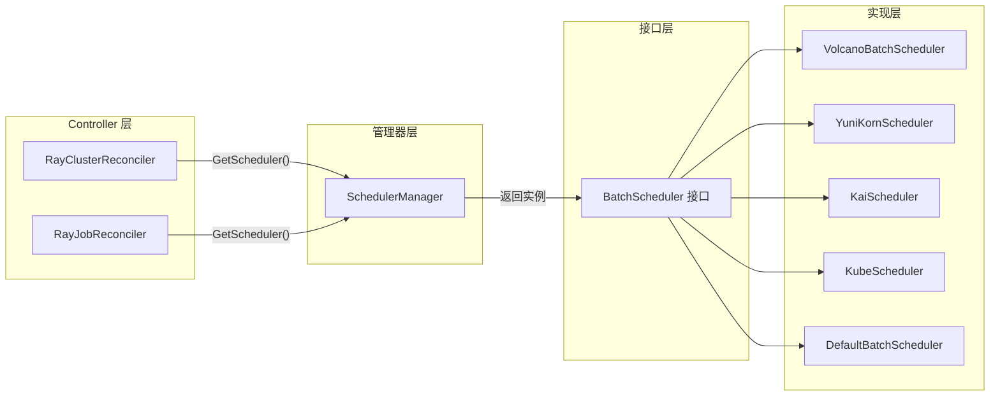
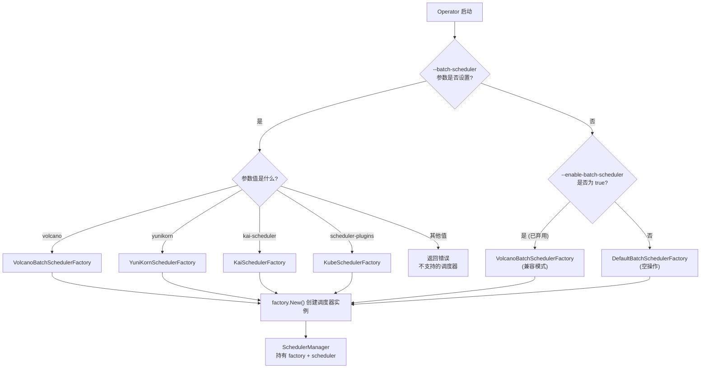
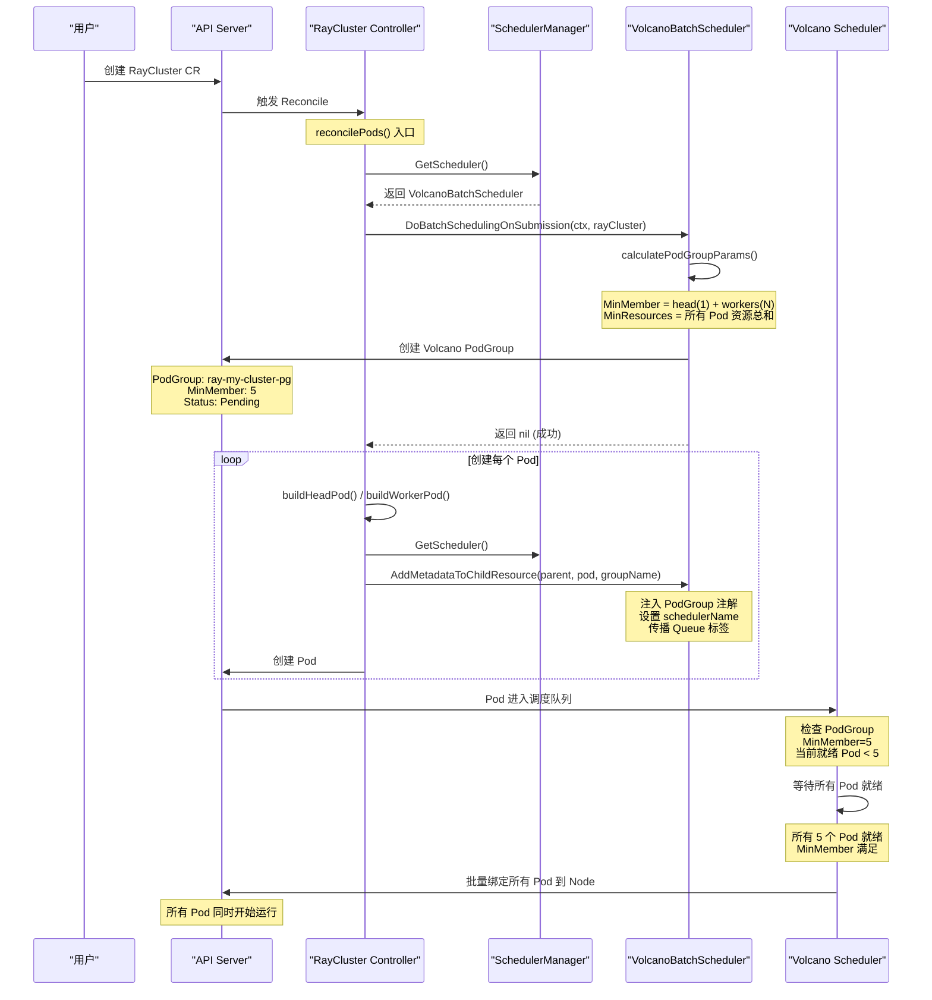
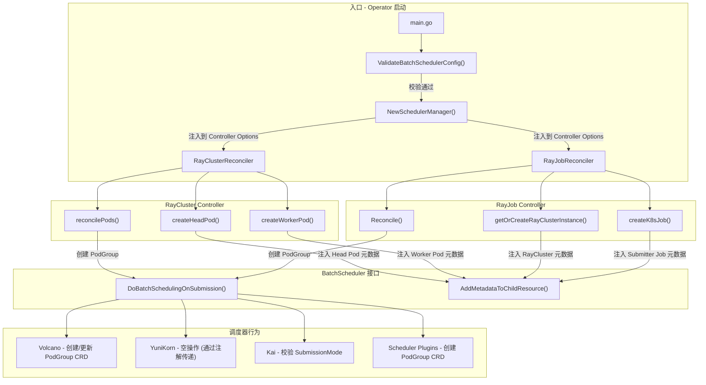

---

## 前置知识

在深入了解 KubeRay 批调度器集成之前，建议读者具备以下知识基础:

| 领域 | 内容 | 重要程度 |
|------|------|----------|
| Kubernetes 调度 | Pod 调度机制、SchedulerName 字段、多调度器架构 | 必须 |
| Gang Scheduling | 组调度概念、PodGroup 语义、死锁预防 | 必须 |
| KubeRay 架构 | RayCluster / RayJob CRD 结构、Controller 协调循环 | 必须 |
| Volcano | PodGroup CRD、Queue 管理、MinMember 语义 | 推荐 |
| YuniKorn | Application 模型、Task Group、Gang 调度 | 推荐 |

---

## 目录

- [1. 概述 - 为什么需要批调度器](#1-概述---为什么需要批调度器)
- [2. BatchScheduler 接口设计](#2-batchscheduler-接口设计)
- [3. SchedulerManager 管理器](#3-schedulermanager-管理器)
- [4. Volcano 实现详解](#4-volcano-实现详解)
- [5. YuniKorn 实现详解](#5-yunikorn-实现详解)
- [6. Kai Scheduler 实现](#6-kai-scheduler-实现)
- [7. Scheduler Plugins 实现](#7-scheduler-plugins-实现)
- [8. 控制器集成链路](#8-控制器集成链路)
- [9. 配置与部署](#9-配置与部署)
- [10. 各调度器对比分析](#10-各调度器对比分析)
- [11. 调试与排障指南](#11-调试与排障指南)

---

## 1. 概述 - 为什么需要批调度器

### 1.1 问题背景

在多租户 Kubernetes 集群中，默认调度器采用**逐 Pod 调度**的策略。对于 Ray 集群这类需要多个 Pod 协同工作的分布式应用，会带来以下问题:

1. **资源死锁 (Deadlock)**: 两个 RayCluster 各自获得部分资源，但都不足以启动完整集群，导致所有 Pod 都处于 Pending 状态
2. **资源碎片化**: Head Pod 成功调度但 Worker Pod 无法调度，浪费了 Head Pod 占用的资源
3. **等待时间不可预测**: 无法保证所有 Pod 同时或近乎同时被调度

### 1.2 Gang Scheduling 解决方案

Gang Scheduling (组调度) 的核心思想是: **要么全部调度，要么一个都不调度 (all-or-nothing)**。通过引入 PodGroup 概念，将属于同一个 Ray 集群的所有 Pod 组织为一个调度单元:

- **MinMember**: 最少需要多少个 Pod 才能启动
- **MinResources**: 最少需要多少资源 (CPU、内存、GPU 等)
- 调度器在满足 MinMember 和 MinResources 之前，不会调度该组中的任何 Pod

### 1.3 KubeRay 支持的批调度器

KubeRay 通过插件化架构支持以下四种批调度器:

| 调度器 | 插件名称 | PodGroup 管理方式 | 特色功能 |
|--------|----------|-------------------|----------|
| Volcano | `volcano` | Operator 主动创建 | 网络拓扑感知、Queue 管理 |
| YuniKorn | `yunikorn` | 调度器自动创建 | Task Group 定义、Application 模型 |
| Kai Scheduler | `kai-scheduler` | 调度器内置 PodGrouper | 轻量级、自动组发现 |
| Scheduler Plugins | `scheduler-plugins` | Operator 主动创建 | 原生 K8s 调度框架扩展 |

---

## 2. BatchScheduler 接口设计

> 源码位置: [`ray-operator/controllers/ray/batchscheduler/interface/interface.go`](https://github.com/ray-project/kuberay/blob/master/ray-operator/controllers/ray/batchscheduler/interface/interface.go)

KubeRay 定义了两个核心接口来抽象批调度器的行为，使得不同调度器的接入只需实现统一接口即可。

### 2.1 BatchScheduler 接口

```go
// BatchScheduler manages submitting RayCluster pods to a third-party scheduler.
type BatchScheduler interface {
    // Name 对应 Kubernetes 中的 schedulerName 字段
    // 用于指定 Pod 应由哪个调度器进行调度
    Name() string

    // DoBatchSchedulingOnSubmission 在 RayCluster/RayJob 创建或更新时调用
    // 对于大多数批调度器，这会导致创建一个 PodGroup 资源
    DoBatchSchedulingOnSubmission(ctx context.Context, object metav1.Object) error

    // AddMetadataToChildResource 为子资源（Pod、Job、RayCluster）添加
    // 调度器所需的元数据（标签、注解、schedulerName）
    AddMetadataToChildResource(ctx context.Context, parent metav1.Object,
        child metav1.Object, groupName string)
}
```

**三个方法的职责分工**:

| 方法 | 调用时机 | 核心职责 |
|------|----------|----------|
| `Name()` | Pod 创建时 | 返回调度器名称，写入 `pod.spec.schedulerName` |
| `DoBatchSchedulingOnSubmission()` | CRD 提交 / 更新时 | 创建或更新 PodGroup 等调度资源 |
| `AddMetadataToChildResource()` | 子 Pod / Job 创建时 | 将 PodGroup 关联信息注入子资源 |

### 2.2 BatchSchedulerFactory 接口

```go
// BatchSchedulerFactory 负责调度器插件的初始化和 Reconciler 配置
type BatchSchedulerFactory interface {
    // New 创建新的 BatchScheduler 实例
    New(ctx context.Context, config *rest.Config, cli client.Client) (BatchScheduler, error)

    // AddToScheme 将调度器的 CRD 类型注册到 runtime.Scheme
    // 在 Operator 初始化阶段调用
    AddToScheme(scheme *runtime.Scheme)

    // ConfigureReconciler 配置 Reconciler 的 Watch 触发器
    // 例如 Volcano 需要 Watch PodGroup 资源的变更
    ConfigureReconciler(b *builder.Builder) *builder.Builder
}
```

### 2.3 DefaultBatchScheduler - 空操作实现

当未配置任何批调度器时，KubeRay 使用 `DefaultBatchScheduler`，它是一个 **no-op (空操作)** 实现:

```go
type DefaultBatchScheduler struct{}

func (d *DefaultBatchScheduler) Name() string {
    return "default"
}

func (d *DefaultBatchScheduler) DoBatchSchedulingOnSubmission(_ context.Context,
    _ metav1.Object) error {
    return nil  // 不执行任何操作
}

func (d *DefaultBatchScheduler) AddMetadataToChildResource(_ context.Context,
    _ metav1.Object, _ metav1.Object, _ string) {
    // 不添加任何元数据
}
```

这种设计保证了 Controller 的调用逻辑无需判断是否启用了批调度器，始终可以安全调用接口方法。

### 2.4 接口调用链路



---

## 3. SchedulerManager 管理器

> 源码位置: [`ray-operator/controllers/ray/batchscheduler/schedulermanager.go`](https://github.com/ray-project/kuberay/blob/master/ray-operator/controllers/ray/batchscheduler/schedulermanager.go)

`SchedulerManager` 是批调度器子系统的入口点，负责根据配置创建合适的调度器实例，并将其提供给 Controller 使用。

### 3.1 结构体定义

```go
type SchedulerManager struct {
    config     *rest.Config                         // Kubernetes 客户端配置
    factory    schedulerinterface.BatchSchedulerFactory  // 调度器工厂
    scheduler  schedulerinterface.BatchScheduler         // 调度器实例（单例）
    rayConfigs configapi.Configuration              // Operator 配置
    sync.Mutex                                      // 并发安全锁
}
```

### 3.2 调度器选择逻辑 - getSchedulerFactory

`getSchedulerFactory()` 函数实现了调度器的选择决策树，同时兼容新旧两种配置方式:

```go
func getSchedulerFactory(rayConfigs configapi.Configuration) (
    schedulerinterface.BatchSchedulerFactory, error) {

    var factory schedulerinterface.BatchSchedulerFactory

    // 新的 --batch-scheduler 标志（优先级高）
    if len(rayConfigs.BatchScheduler) > 0 {
        switch rayConfigs.BatchScheduler {
        case volcano.GetPluginName():       // "volcano"
            factory = &volcano.VolcanoBatchSchedulerFactory{}
        case yunikorn.GetPluginName():      // "yunikorn"
            factory = &yunikorn.YuniKornSchedulerFactory{}
        case kaischeduler.GetPluginName():  // "kai-scheduler"
            factory = &kaischeduler.KaiSchedulerFactory{}
        case schedulerplugins.GetPluginName(): // "scheduler-plugins"
            factory = &schedulerplugins.KubeSchedulerFactory{}
        default:
            return nil, fmt.Errorf("the scheduler is not supported, name=%s",
                rayConfigs.BatchScheduler)
        }
    } else {
        // 默认: 空操作调度器
        factory = &schedulerinterface.DefaultBatchSchedulerFactory{}
    }

    // 兼容旧的 --enable-batch-scheduler 标志 (已弃用)
    // 会覆盖上面的选择，映射到 Volcano
    if rayConfigs.EnableBatchScheduler {
        factory = &volcano.VolcanoBatchSchedulerFactory{}
    }

    return factory, nil
}
```

### 3.3 调度器选择决策树



### 3.4 对外暴露的方法

```go
// GetScheduler 返回当前配置的调度器实例
func (batch *SchedulerManager) GetScheduler() (schedulerinterface.BatchScheduler, error) {
    return batch.scheduler, nil
}

// ConfigureReconciler 配置 Reconciler 的 Watch 触发器
func (batch *SchedulerManager) ConfigureReconciler(b *builder.Builder) *builder.Builder {
    batch.factory.ConfigureReconciler(b)
    return b
}

// AddToScheme 注册调度器的 CRD 到 Scheme
func (batch *SchedulerManager) AddToScheme(scheme *runtime.Scheme) {
    batch.factory.AddToScheme(scheme)
}
```

### 3.5 配置验证

> 源码位置: [`ray-operator/apis/config/v1alpha1/config_utils.go`](https://github.com/ray-project/kuberay/blob/master/ray-operator/apis/config/v1alpha1/config_utils.go)

`ValidateBatchSchedulerConfig()` 函数在 Operator 启动时校验配置的合法性:

```go
func ValidateBatchSchedulerConfig(logger logr.Logger, config Configuration) error {
    // 规则1: 新旧标志不能同时设置
    if config.EnableBatchScheduler && len(config.BatchScheduler) > 0 {
        return fmt.Errorf("both feature flags enable-batch-scheduler (deprecated) " +
            "and batch-scheduler are set. Please use batch-scheduler only")
    }

    // 规则2: 旧标志已弃用，但仍然合法
    if config.EnableBatchScheduler {
        logger.Info("Feature flag enable-batch-scheduler is deprecated...")
        return nil
    }

    // 规则3: 新标志必须是白名单中的值
    if len(config.BatchScheduler) > 0 {
        if config.BatchScheduler == volcano.GetPluginName() ||
           config.BatchScheduler == yunikorn.GetPluginName() ||
           config.BatchScheduler == schedulerplugins.GetPluginName() ||
           config.BatchScheduler == kaischeduler.GetPluginName() {
            logger.Info("Feature flag batch-scheduler is enabled",
                "scheduler name", config.BatchScheduler)
        } else {
            return fmt.Errorf("scheduler is not supported, name=%s",
                config.BatchScheduler)
        }
    }
    return nil
}
```

---

## 4. Volcano 实现详解

> 源码位置: [`ray-operator/controllers/ray/batchscheduler/volcano/volcano_scheduler.go`](https://github.com/ray-project/kuberay/blob/master/ray-operator/controllers/ray/batchscheduler/volcano/volcano_scheduler.go) (276 行)

Volcano 是 KubeRay 中功能最完整、代码量最大的批调度器实现。它通过显式创建 Volcano PodGroup CRD 来实现 Gang Scheduling。

### 4.1 核心结构

```go
const (
    pluginName                                = "volcano"
    QueueNameLabelKey                         = "volcano.sh/queue-name"
    NetworkTopologyModeLabelKey               = "volcano.sh/network-topology-mode"
    NetworkTopologyHighestTierAllowedLabelKey = "volcano.sh/network-topology-highest-tier-allowed"
)

type VolcanoBatchScheduler struct {
    cli client.Client  // Kubernetes 客户端，用于操作 PodGroup 资源
}
```

### 4.2 DoBatchSchedulingOnSubmission - 提交时调度处理

该方法根据对象类型分发到不同的处理函数:

```go
func (v *VolcanoBatchScheduler) DoBatchSchedulingOnSubmission(
    ctx context.Context, object metav1.Object) error {
    switch obj := object.(type) {
    case *rayv1.RayCluster:
        return v.handleRayCluster(ctx, obj)
    case *rayv1.RayJob:
        return v.handleRayJob(ctx, obj)
    default:
        return fmt.Errorf("unsupported object type %T", object)
    }
}
```

#### 4.2.1 handleRayCluster - RayCluster 处理逻辑

```go
func (v *VolcanoBatchScheduler) handleRayCluster(
    ctx context.Context, raycluster *rayv1.RayCluster) error {
    // 关键: 如果 RayCluster 是由 RayJob 创建的，跳过 PodGroup 创建
    // 因为 PodGroup 应该由 RayJob 级别创建和管理
    if crdType, ok := raycluster.Labels[utils.RayOriginatedFromCRDLabelKey]; ok &&
        crdType == utils.RayOriginatedFromCRDLabelValue(utils.RayJobCRD) {
        return nil
    }

    minMember, totalResource := v.calculatePodGroupParams(&raycluster.Spec)
    return v.syncPodGroup(ctx, raycluster, minMember, totalResource)
}
```

#### 4.2.2 handleRayJob - RayJob 处理逻辑

```go
func (v *VolcanoBatchScheduler) handleRayJob(
    ctx context.Context, rayJob *rayv1.RayJob) error {
    // 必须内联 RayClusterSpec，不支持引用外部 RayCluster
    if rayJob.Spec.RayClusterSpec == nil {
        return fmt.Errorf("gang scheduling does not support RayJob %s/%s " +
            "referencing an existing RayCluster",
            rayJob.Namespace, rayJob.Name)
    }

    var totalResourceList []corev1.ResourceList
    minMember, totalResource := v.calculatePodGroupParams(rayJob.Spec.RayClusterSpec)
    totalResourceList = append(totalResourceList, totalResource)

    // 注意: MinMember 不包括 submitter Pod
    // 原因: submitter Pod 需要等待集群就绪才能运行
    // 如果将 submitter 计入 MinMember，会导致启动死锁:
    //   submitter 等待集群 -> gang 等待 submitter -> 死锁
    // 但 submitter 的资源请求仍然计入 MinResources，以确保容量预留
    submitterResource := getSubmitterResource(rayJob)
    totalResourceList = append(totalResourceList, submitterResource)

    return v.syncPodGroup(ctx, rayJob, minMember,
        utils.SumResourceList(totalResourceList))
}
```

#### 4.2.3 PodGroup 参数计算

```go
func (v *VolcanoBatchScheduler) calculatePodGroupParams(
    rayClusterSpec *rayv1.RayClusterSpec) (int32, corev1.ResourceList) {
    rayCluster := &rayv1.RayCluster{Spec: *rayClusterSpec}

    // 非自动伸缩: 使用期望副本数
    if !utils.IsAutoscalingEnabled(rayClusterSpec) {
        return utils.CalculateDesiredReplicas(rayCluster) + 1,  // +1 for head Pod
               utils.CalculateDesiredResources(rayCluster)
    }
    // 自动伸缩: 使用最小副本数（保证最低运行规模）
    return utils.CalculateMinReplicas(rayCluster) + 1,
           utils.CalculateMinResources(rayCluster)
}
```

### 4.3 syncPodGroup - PodGroup 同步

```go
func (v *VolcanoBatchScheduler) syncPodGroup(ctx context.Context,
    owner metav1.Object, size int32, totalResource corev1.ResourceList) error {
    podGroupName := getAppPodGroupName(owner)  // 格式: "ray-{name}-pg"

    podGroup := volcanoschedulingv1beta1.PodGroup{}
    if err := v.cli.Get(ctx, types.NamespacedName{
        Namespace: owner.GetNamespace(),
        Name:      podGroupName,
    }, &podGroup); err != nil {
        if !errors.IsNotFound(err) {
            return err
        }
        // PodGroup 不存在 -> 创建
        podGroup, err := createPodGroup(owner, podGroupName, size, totalResource)
        if err != nil {
            return err
        }
        return v.cli.Create(ctx, &podGroup)
    }

    // PodGroup 已存在 -> 如果参数变化则更新
    if podGroup.Spec.MinMember != size ||
       podGroup.Spec.MinResources == nil ||
       !quotav1.Equals(*podGroup.Spec.MinResources, totalResource) {
        podGroup.Spec.MinMember = size
        podGroup.Spec.MinResources = &totalResource
        return v.cli.Update(ctx, &podGroup)
    }
    return nil
}
```

### 4.4 PodGroup 创建 - 完整字段解析

```go
func createPodGroup(owner metav1.Object, podGroupName string,
    size int32, totalResource corev1.ResourceList) (
    volcanoschedulingv1beta1.PodGroup, error) {

    podGroup := volcanoschedulingv1beta1.PodGroup{
        ObjectMeta: metav1.ObjectMeta{
            Namespace:       owner.GetNamespace(),
            Name:            podGroupName,        // "ray-{name}-pg"
            OwnerReferences: []metav1.OwnerReference{ownerRef},
            Annotations:     annotations,          // 继承 owner 的 annotations
        },
        Spec: volcanoschedulingv1beta1.PodGroupSpec{
            MinMember:    size,           // 最小 Pod 数
            MinResources: &totalResource, // 最小资源需求
        },
        Status: volcanoschedulingv1beta1.PodGroupStatus{
            Phase: volcanoschedulingv1beta1.PodGroupPending, // 初始状态
        },
    }

    // 网络拓扑配置 (可选)
    mode, modeOk := owner.GetLabels()[NetworkTopologyModeLabelKey]
    if modeOk {
        podGroup.Spec.NetworkTopology = &volcanoschedulingv1beta1.NetworkTopologySpec{
            Mode: volcanoschedulingv1beta1.NetworkTopologyMode(mode),
        }
        // 可选: 最高允许的网络拓扑层级
        highestTier, tierOk := owner.GetLabels()[NetworkTopologyHighestTierAllowedLabelKey]
        if tierOk {
            highestTierInt, _ := strconv.Atoi(highestTier)
            podGroup.Spec.NetworkTopology.HighestTierAllowed = &highestTierInt
        }
    }

    // Queue 和 PriorityClass 配置 (可选)
    if queue, ok := owner.GetLabels()[QueueNameLabelKey]; ok {
        podGroup.Spec.Queue = queue
    }
    if priorityClassName, ok := owner.GetLabels()[utils.RayPriorityClassName]; ok {
        podGroup.Spec.PriorityClassName = priorityClassName
    }

    return podGroup, nil
}
```

### 4.5 AddMetadataToChildResource - 元数据注入

```go
func (v *VolcanoBatchScheduler) AddMetadataToChildResource(
    _ context.Context, parent metav1.Object,
    child metav1.Object, groupName string) {

    // 1. 传播 Queue 标签
    populateLabelsFromObject(parent, child, QueueNameLabelKey)

    // 2. 传播 PriorityClass 标签
    populateLabelsFromObject(parent, child, utils.RayPriorityClassName)

    // 3. 添加 PodGroup 关联注解
    //    - scheduling.volcano.sh/group-name -> PodGroup 名称
    //    - volcano.sh/task-spec-key -> 任务组名称 (headgroup/worker-group-xxx)
    populateAnnotations(parent, child, groupName)

    // 4. 设置 schedulerName 为 "volcano"
    addSchedulerName(child, v.Name())
}
```

**注入到 Pod 的元数据汇总**:

| 类型 | Key | 值示例 | 用途 |
|------|-----|--------|------|
| Annotation | `scheduling.volcano.sh/group-name` | `ray-my-cluster-pg` | 关联 PodGroup |
| Annotation | `volcano.sh/task-spec-key` | `headgroup` | 标识任务组 |
| Label | `volcano.sh/queue-name` | `default` | 队列分配 |
| Label | `ray.io/priority-class-name` | `high-priority` | 优先级 |
| Spec | `schedulerName` | `volcano` | 指定调度器 |

### 4.6 Volcano PodGroup 创建与 Pod 调度时序



### 4.7 Gang Scheduling 语义解析

Volcano 的 Gang Scheduling 通过以下机制保证 all-or-nothing 语义:

```
RayCluster (1 Head + 4 Workers)
    |
    v
PodGroup: ray-my-cluster-pg
    MinMember: 5        <- 至少 5 个 Pod 才能启动
    MinResources:       <- 至少这些资源才能满足
      cpu: "20"
      memory: "40Gi"
      nvidia.com/gpu: "4"
    |
    v
Volcano Scheduler 逻辑:
    IF 可用资源 >= MinResources AND 可调度 Pod 数 >= MinMember:
        批量调度所有 Pod
    ELSE:
        所有 Pod 保持 Pending，不占用任何资源
```

---

## 5. YuniKorn 实现详解

> 源码位置: [`ray-operator/controllers/ray/batchscheduler/yunikorn/yunikorn_scheduler.go`](https://github.com/ray-project/kuberay/blob/master/ray-operator/controllers/ray/batchscheduler/yunikorn/yunikorn_scheduler.go) 和 [`yunikorn_task_groups.go`](https://github.com/ray-project/kuberay/blob/master/ray-operator/controllers/ray/batchscheduler/yunikorn/yunikorn_task_groups.go)

与 Volcano 不同，YuniKorn 不需要 Operator 预创建 PodGroup 资源。它通过 **Pod 注解中的 Task Group 定义** 来实现 Gang Scheduling。

### 5.1 核心常量与结构

```go
const (
    SchedulerName                       = "yunikorn"
    YuniKornPodApplicationIDLabelName   = "applicationId"
    YuniKornPodQueueLabelName           = "queue"
    RayApplicationIDLabelName           = "yunikorn.apache.org/app-id"
    RayApplicationQueueLabelName        = "yunikorn.apache.org/queue"
    YuniKornTaskGroupNameAnnotationName = "yunikorn.apache.org/task-group-name"
    YuniKornTaskGroupsAnnotationName    = "yunikorn.apache.org/task-groups"
)

type YuniKornScheduler struct{}  // 无状态，不需要 K8s 客户端
```

### 5.2 DoBatchSchedulingOnSubmission - 空操作

```go
func (y *YuniKornScheduler) DoBatchSchedulingOnSubmission(
    _ context.Context, _ metav1.Object) error {
    // YuniKorn 不需要预创建任何资源
    // 所有信息通过 Pod 注解传递
    return nil
}
```

### 5.3 AddMetadataToChildResource - 元数据注入

```go
func (y *YuniKornScheduler) AddMetadataToChildResource(ctx context.Context,
    parent metav1.Object, child metav1.Object, groupName string) {

    // 1. 传播应用 ID 标签 (yunikorn.apache.org/app-id -> applicationId)
    populateLabelsFromObject(parent, child,
        RayApplicationIDLabelName, YuniKornPodApplicationIDLabelName)

    // 2. 传播队列标签 (yunikorn.apache.org/queue -> queue)
    populateLabelsFromObject(parent, child,
        RayApplicationQueueLabelName, YuniKornPodQueueLabelName)

    // 3. 设置 schedulerName
    batchschedulerutils.AddSchedulerNameToObject(child, y.Name())

    // 4. 如果启用了 Gang Scheduling，添加 Task Group 注解
    if y.isGangSchedulingEnabled(parent) {
        err := propagateTaskGroupsAnnotation(parent, child)
        if err != nil {
            logger.Error(err, "failed to add gang scheduling annotations")
            return
        }
        if groupName != "" {
            addTaskGroupNameAnnotation(child, groupName)
        }
    }
}
```

### 5.4 Task Group 定义

> 源码位置: [`yunikorn_task_groups.go`](https://github.com/ray-project/kuberay/blob/master/ray-operator/controllers/ray/batchscheduler/yunikorn/yunikorn_task_groups.go)

YuniKorn 使用 Task Group 来定义 Gang 调度的成员:

```go
type TaskGroup struct {
    Name                      string                            `json:"name"`
    MinMember                 int32                             `json:"minMember"`
    MinResource               map[string]resource.Quantity      `json:"minResource"`
    NodeSelector              map[string]string                 `json:"nodeSelector,omitempty"`
    Affinity                  *corev1.Affinity                  `json:"affinity,omitempty"`
    Tolerations               []corev1.Toleration               `json:"tolerations,omitempty"`
    TopologySpreadConstraints []corev1.TopologySpreadConstraint `json:"topologySpreadConstraints,omitempty"`
}
```

#### RayCluster 的 Task Group 生成

```go
func newTaskGroupsFromRayClusterSpec(rayClusterSpec *v1.RayClusterSpec) *TaskGroups {
    taskGroups := newTaskGroups()

    // Head Group - 固定 1 个
    headGroupSpec := rayClusterSpec.HeadGroupSpec
    headPodMinResource := utils.CalculatePodResource(headGroupSpec.Template.Spec)
    taskGroups.addTaskGroup(TaskGroup{
        Name:         "headgroup",
        MinMember:    1,
        MinResource:  utils.ConvertResourceListToMapString(headPodMinResource),
        NodeSelector: headGroupSpec.Template.Spec.NodeSelector,
        Tolerations:  headGroupSpec.Template.Spec.Tolerations,
        Affinity:     headGroupSpec.Template.Spec.Affinity,
    })

    // Worker Groups - 按 MinReplicas 计算
    for _, workerGroupSpec := range rayClusterSpec.WorkerGroupSpecs {
        workerMinResource := utils.CalculatePodResource(workerGroupSpec.Template.Spec)
        minReplicas := ptr.Deref(workerGroupSpec.MinReplicas, int32(0))
        minWorkers := minReplicas * workerGroupSpec.NumOfHosts
        taskGroups.addTaskGroup(TaskGroup{
            Name:         workerGroupSpec.GroupName,
            MinMember:    minWorkers,
            MinResource:  utils.ConvertResourceListToMapString(workerMinResource),
            NodeSelector: workerGroupSpec.Template.Spec.NodeSelector,
            Tolerations:  workerGroupSpec.Template.Spec.Tolerations,
            Affinity:     workerGroupSpec.Template.Spec.Affinity,
        })
    }

    return taskGroups
}
```

#### RayJob 的 Task Group 生成

```go
func newTaskGroupsFromRayJobSpec(rayJobSpec *v1.RayJobSpec) *TaskGroups {
    // 继承 RayCluster 的所有 Task Group
    taskGroups := newTaskGroupsFromRayClusterSpec(rayJobSpec.RayClusterSpec)

    // 额外添加 Submitter Pod 的 Task Group
    submitterGroupSpec := common.GetSubmitterTemplate(rayJobSpec,
        rayJobSpec.RayClusterSpec).Spec
    submitterPodMinResource := utils.CalculatePodResource(submitterGroupSpec)
    taskGroups.addTaskGroup(TaskGroup{
        Name:         "submitter",
        MinMember:    1,
        MinResource:  utils.ConvertResourceListToMapString(submitterPodMinResource),
        NodeSelector: submitterGroupSpec.NodeSelector,
        Tolerations:  submitterGroupSpec.Tolerations,
        Affinity:     submitterGroupSpec.Affinity,
    })

    return taskGroups
}
```

### 5.5 YuniKorn 注入到 Pod 的元数据

| 类型 | Key | 值示例 | 用途 |
|------|-----|--------|------|
| Label | `applicationId` | `my-ray-cluster` | 应用标识 |
| Label | `queue` | `root.default` | 队列分配 |
| Annotation | `yunikorn.apache.org/task-groups` | `[{"name":"headgroup",...}]` | Gang 调度定义 |
| Annotation | `yunikorn.apache.org/task-group-name` | `headgroup` | 当前 Pod 所属的 Task Group |
| Spec | `schedulerName` | `yunikorn` | 指定调度器 |

### 5.6 Gang Scheduling 启用条件

YuniKorn 的 Gang Scheduling 并非默认启用，需要在 RayCluster/RayJob 上添加特定标签:

```go
func (y *YuniKornScheduler) isGangSchedulingEnabled(obj metav1.Object) bool {
    _, exist := obj.GetLabels()[utils.RayGangSchedulingEnabled]
    return exist
}
```

用户需要在 CR 上添加 `ray.io/gang-scheduling-enabled: ""` 标签来启用。

---

## 6. Kai Scheduler 实现

> 源码位置: [`ray-operator/controllers/ray/batchscheduler/kai-scheduler/kai_scheduler.go`](https://github.com/ray-project/kuberay/blob/master/ray-operator/controllers/ray/batchscheduler/kai-scheduler/kai_scheduler.go) (83 行)

Kai Scheduler 是四个实现中最轻量的一个。它依赖调度器内置的 **PodGrouper** 机制，在运行时自动创建 PodGroup，因此 Operator 端的逻辑非常简洁。

### 6.1 核心设计理念

```go
// 该 KAI 插件依赖 KAI-Scheduler 内置的 PodGrouper
// 在运行时自动创建 PodGroup，因此插件本身只需:
//   1. 暴露调度器名称
//   2. 为 Pod 设置 schedulerName 和 queue 标签
// 不包含任何 PodGroup 创建/更新逻辑
```

### 6.2 DoBatchSchedulingOnSubmission - K8sJobMode 限制

```go
func (k *KaiScheduler) DoBatchSchedulingOnSubmission(
    _ context.Context, object metav1.Object) error {
    // Kai Scheduler 不支持 K8sJobMode 的 RayJob
    // 原因: K8sJobMode 中 submitter Pod 在 RayCluster 就绪后才创建
    // Kai 的 PodGrouper 无法处理这种两阶段创建模式
    if rayJob, ok := object.(*rayv1.RayJob); ok {
        switch rayJob.Spec.SubmissionMode {
        case rayv1.K8sJobMode:
            return fmt.Errorf("KAI-Scheduler does not support RayJob " +
                "with K8sJobMode")
        }
    }
    return nil
}
```

### 6.3 AddMetadataToChildResource

```go
func (k *KaiScheduler) AddMetadataToChildResource(ctx context.Context,
    parent metav1.Object, child metav1.Object, _ string) {
    // 1. 设置 schedulerName
    utils.AddSchedulerNameToObject(child, k.Name())

    // 2. 传播 Queue 标签
    parentLabel := parent.GetLabels()
    queue, ok := parentLabel[QueueLabelName]  // "kai.scheduler/queue"
    if !ok || queue == "" {
        logger.Info("Queue label missing from parent; child will remain pending",
            "requiredLabel", QueueLabelName)
        return
    }

    childLabels := child.GetLabels()
    if childLabels == nil {
        childLabels = make(map[string]string)
    }
    childLabels[QueueLabelName] = queue
    child.SetLabels(childLabels)
}
```

### 6.4 Factory - 无需 Scheme 注册

```go
func (kf *KaiSchedulerFactory) AddToScheme(_ *runtime.Scheme) {
    // 不需要注册额外的 CRD Scheme
    // PodGroup 由 Kai Scheduler 自行管理
}

func (kf *KaiSchedulerFactory) ConfigureReconciler(b *builder.Builder) *builder.Builder {
    return b  // 不需要额外的 Watch 配置
}
```

---

## 7. Scheduler Plugins 实现

> 源码位置: [`ray-operator/controllers/ray/batchscheduler/scheduler-plugins/scheduler_plugins.go`](https://github.com/ray-project/kuberay/blob/master/ray-operator/controllers/ray/batchscheduler/scheduler-plugins/scheduler_plugins.go) (132 行)

Scheduler Plugins 使用 Kubernetes SIG 维护的 `sigs.k8s.io/scheduler-plugins` 项目中的 PodGroup API，通过 Coscheduling 插件实现 Gang Scheduling。

### 7.1 核心常量

```go
const (
    // Operator 配置中使用的名称
    schedulerName string = "scheduler-plugins"
    // 实际的调度器实例名称
    schedulerInstanceName         string = "scheduler-plugins-scheduler"
    // PodGroup 关联标签
    kubeSchedulerPodGroupLabelKey string = "scheduling.x-k8s.io/pod-group"
)
```

> 注意: `Name()` 返回的是 `schedulerInstanceName` ("scheduler-plugins-scheduler")，而不是 `schedulerName` ("scheduler-plugins")。这是因为 `Name()` 会被写入 Pod 的 `schedulerName` 字段，必须与实际部署的调度器名称一致。

### 7.2 DoBatchSchedulingOnSubmission - PodGroup 创建

```go
func (k *KubeScheduler) DoBatchSchedulingOnSubmission(
    ctx context.Context, object metav1.Object) error {
    app, ok := object.(*rayv1.RayCluster)
    if !ok {
        return fmt.Errorf("currently only RayCluster is supported, got %T", object)
    }
    // 仅在启用 Gang Scheduling 时创建 PodGroup
    if !k.isGangSchedulingEnabled(app) {
        return nil
    }
    podGroup := &v1alpha1.PodGroup{}
    if err := k.cli.Get(ctx, ktypes.NamespacedName{
        Namespace: app.Namespace, Name: app.Name,
    }, podGroup); err != nil {
        if !errors.IsNotFound(err) {
            return err
        }
        podGroup = createPodGroup(app)
        return k.cli.Create(ctx, podGroup)
    }
    return nil
}
```

#### PodGroup 创建

```go
func createPodGroup(app *rayv1.RayCluster) *v1alpha1.PodGroup {
    podGroup := &v1alpha1.PodGroup{
        ObjectMeta: metav1.ObjectMeta{
            Namespace: app.Namespace,
            Name:      app.Name,
            OwnerReferences: []metav1.OwnerReference{{
                Name:       app.Name,
                UID:        app.UID,
                APIVersion: app.APIVersion,
                Kind:       app.Kind,
            }},
        },
        Spec: v1alpha1.PodGroupSpec{
            MinMember:    utils.CalculateDesiredReplicas(app) + 1, // +1 for head
            MinResources: utils.CalculateDesiredResources(app),
        },
    }
    return podGroup
}
```

### 7.3 AddMetadataToChildResource

```go
func (k *KubeScheduler) AddMetadataToChildResource(_ context.Context,
    parent metav1.Object, child metav1.Object, _ string) {
    // Gang Scheduling 启用时，添加 PodGroup 关联标签
    if k.isGangSchedulingEnabled(parent) {
        labels := child.GetLabels()
        if labels == nil {
            labels = make(map[string]string)
        }
        // scheduling.x-k8s.io/pod-group -> RayCluster 名称
        labels[kubeSchedulerPodGroupLabelKey] = parent.GetName()
        child.SetLabels(labels)
    }
    // 始终设置 schedulerName
    batchschedulerutils.AddSchedulerNameToObject(child, k.Name())
}
```

### 7.4 限制

- **仅支持 RayCluster**: 不支持直接从 RayJob 创建 PodGroup
- **不支持自动伸缩**: `calculateDesiredReplicas` 使用的是固定副本数
- **需要显式标签**: 需要 `ray.io/gang-scheduling-enabled` 标签才会启用 Gang Scheduling

---

## 8. 控制器集成链路

### 8.1 RayCluster Controller 中的调用点

在 `RayClusterReconciler` 中，批调度器在以下关键位置被调用:

```go
// 位置1: reconcilePods() - 创建 PodGroup
func (r *RayClusterReconciler) reconcilePods(ctx context.Context,
    instance *rayv1.RayCluster) error {
    // ...
    if r.options.BatchSchedulerManager != nil {
        if scheduler, err := r.options.BatchSchedulerManager.GetScheduler(); err == nil {
            if err := scheduler.DoBatchSchedulingOnSubmission(ctx, instance); err != nil {
                return err
            }
        }
    }
    // ... 后续创建 Pod
}

// 位置2: createHeadPod() - 注入元数据到 Head Pod
func (r *RayClusterReconciler) createHeadPod(...) error {
    // ...
    if r.options.BatchSchedulerManager != nil {
        if scheduler, err := r.options.BatchSchedulerManager.GetScheduler(); err == nil {
            scheduler.AddMetadataToChildResource(ctx, &instance, &pod,
                utils.RayNodeHeadGroupLabelValue)  // "headgroup"
        }
    }
    r.Create(ctx, &pod)
}

// 位置3: createWorkerPod() - 注入元数据到 Worker Pod
func (r *RayClusterReconciler) createWorkerPod(...) error {
    // ...
    if r.options.BatchSchedulerManager != nil {
        if scheduler, err := r.options.BatchSchedulerManager.GetScheduler(); err == nil {
            scheduler.AddMetadataToChildResource(ctx, &instance, &pod,
                worker.GroupName)  // e.g., "small-group"
        }
    }
    r.Create(ctx, &pod)
}
```

### 8.2 RayJob Controller 中的调用点

```go
// 位置1: Reconcile() - RayJob 提交时创建 PodGroup
func (r *RayJobReconciler) Reconcile(ctx context.Context, ...) {
    // ...
    if r.options.BatchSchedulerManager != nil {
        if scheduler, err := r.options.BatchSchedulerManager.GetScheduler(); err == nil {
            if err := scheduler.DoBatchSchedulingOnSubmission(ctx, rayJobInstance); err != nil {
                return ctrl.Result{RequeueAfter: ...}, err
            }
        }
    }
}

// 位置2: getOrCreateRayClusterInstance() - 注入元数据到 RayCluster
func (r *RayJobReconciler) getOrCreateRayClusterInstance(...) {
    // 仅 K8sJobMode 需要这一步
    if r.options.BatchSchedulerManager != nil &&
       rayJobInstance.Spec.SubmissionMode == rayv1.K8sJobMode {
        if scheduler, err := r.options.BatchSchedulerManager.GetScheduler(); err == nil {
            scheduler.AddMetadataToChildResource(ctx, rayJobInstance,
                rayClusterInstance, "")  // 空 groupName
        }
    }
}

// 位置3: createK8sJob() - 注入元数据到 Submitter Job
func (r *RayJobReconciler) createK8sJob(...) {
    if r.options.BatchSchedulerManager != nil {
        if scheduler, err := r.options.BatchSchedulerManager.GetScheduler(); err == nil {
            scheduler.AddMetadataToChildResource(ctx, rayJobInstance,
                &submitterTemplate,
                utils.RayNodeSubmitterGroupLabelValue)  // "submitter"
        }
    }
}
```

### 8.3 完整调用链路



---

## 9. 配置与部署

### 9.1 Helm Chart 配置

在 `kuberay-operator` Helm Chart 的 `values.yaml` 中:

```yaml
# 批调度器配置
batchScheduler:
  # (已弃用) 设置为 true 时启用 Volcano
  enabled: false

  # 推荐方式: 直接指定调度器名称
  # 支持的值: "volcano", "yunikorn", "kai-scheduler", "scheduler-plugins"
  name: ""
```

#### 配置示例

```yaml
# 示例1: 使用 Volcano (推荐方式)
batchScheduler:
  name: volcano

# 示例2: 使用 Volcano (已弃用方式，向后兼容)
batchScheduler:
  enabled: true

# 示例3: 使用 YuniKorn
batchScheduler:
  name: yunikorn

# 示例4: 使用 Kai Scheduler
batchScheduler:
  name: kai-scheduler

# 示例5: 使用 Scheduler Plugins
batchScheduler:
  name: scheduler-plugins
```

### 9.2 命令行标志

Operator 支持以下命令行标志:

```bash
# 新方式 (推荐)
--batch-scheduler=volcano

# 旧方式 (已弃用)
--enable-batch-scheduler
```

### 9.3 前置条件

在启用批调度器之前，必须先在集群中安装对应调度器及其 CRD:

| 调度器 | 需要安装的组件 | CRD |
|--------|--------------|-----|
| Volcano | Volcano Controller + Scheduler | `podgroups.scheduling.volcano.sh` |
| YuniKorn | YuniKorn Scheduler | 无额外 CRD |
| Kai Scheduler | Kai Scheduler | 由调度器自动管理 |
| Scheduler Plugins | Kube-scheduler + Coscheduling 插件 | `podgroups.scheduling.x-k8s.io` |

### 9.4 Helm Chart 中的 RBAC 配置

Helm Chart 会根据选择的调度器自动添加所需的 RBAC 规则:

```yaml
# 当 batchScheduler.name=volcano 时，自动添加:
- apiGroups: ["scheduling.volcano.sh"]
  resources: ["podgroups"]
  verbs: ["get", "list", "watch", "create", "delete", "update"]

# 当 batchScheduler.name=scheduler-plugins 时，自动添加:
- apiGroups: ["scheduling.x-k8s.io"]
  resources: ["podgroups"]
  verbs: ["get", "list", "watch", "create", "delete"]
```

### 9.5 RayCluster/RayJob CR 配置示例

#### Volcano 配置示例

```yaml
apiVersion: ray.io/v1
kind: RayCluster
metadata:
  name: my-ray-cluster
  labels:
    # 指定 Volcano Queue
    volcano.sh/queue-name: "default"
    # 可选: 优先级类
    ray.io/priority-class-name: "high-priority"
    # 可选: 网络拓扑模式
    volcano.sh/network-topology-mode: "hard"
    volcano.sh/network-topology-highest-tier-allowed: "2"
spec:
  headGroupSpec:
    # ...
  workerGroupSpecs:
    - groupName: small-group
      replicas: 3
      minReplicas: 3
      # ...
```

#### YuniKorn 配置示例

```yaml
apiVersion: ray.io/v1
kind: RayCluster
metadata:
  name: my-ray-cluster
  labels:
    # 启用 Gang Scheduling
    ray.io/gang-scheduling-enabled: ""
    # 指定应用 ID 和队列
    yunikorn.apache.org/app-id: "my-ray-app"
    yunikorn.apache.org/queue: "root.default"
spec:
  # ...
```

#### Kai Scheduler 配置示例

```yaml
apiVersion: ray.io/v1
kind: RayCluster
metadata:
  name: my-ray-cluster
  labels:
    # 指定 Kai Queue (必须)
    kai.scheduler/queue: "default"
spec:
  # ...
```

---

## 10. 各调度器对比分析

### 10.1 功能对比矩阵

| 特性 | Volcano | YuniKorn | Kai Scheduler | Scheduler Plugins |
|------|---------|----------|---------------|-------------------|
| PodGroup 管理 | Operator 创建 | 调度器管理 | 调度器内置 PodGrouper | Operator 创建 |
| RayCluster 支持 | 完整 | 完整 | 完整 | 完整 |
| RayJob 支持 | 完整 | 完整 | 部分 (不支持 K8sJobMode) | 不支持 |
| 自动伸缩适配 | MinReplicas 计算 | MinReplicas 计算 | N/A | 仅 DesiredReplicas |
| Gang Scheduling | 默认启用 | 需要标签启用 | 默认启用 | 需要标签启用 |
| Queue 支持 | `volcano.sh/queue-name` | `yunikorn.apache.org/queue` | `kai.scheduler/queue` | 无 |
| 网络拓扑 | 支持 | 不支持 | 不支持 | 不支持 |
| 额外 CRD | 需要 | 不需要 | 不需要 | 需要 |
| Scheme 注册 | 需要 | 不需要 | 不需要 | 需要 |
| Reconciler Watch | PodGroup | 无 | 无 | 无 |
| 代码量 | 276 行 | 150 + 115 行 | 83 行 | 132 行 |

### 10.2 架构差异

```
Volcano / Scheduler Plugins 模式:
  Operator ----创建----> PodGroup CRD ----读取----> Scheduler
                                       Pod 关联

YuniKorn 模式:
  Operator ----注入注解----> Pod ----解析----> Scheduler 自动发现 Task Group

Kai Scheduler 模式:
  Operator ----设置标签----> Pod ----分析----> Scheduler 内置 PodGrouper 自动创建 PodGroup
```

### 10.3 选择建议

| 场景 | 推荐调度器 | 理由 |
|------|-----------|------|
| 生产环境多租户集群 | Volcano | 功能最全面，Queue 管理成熟 |
| 已有 YuniKorn 的 Hadoop 生态 | YuniKorn | 无缝集成，无额外 CRD |
| 轻量级 Gang Scheduling 需求 | Kai Scheduler | 零配置，自动 PodGroup |
| 原生 K8s 生态偏好 | Scheduler Plugins | 官方 SIG 维护 |
| RayJob + K8sJobMode | Volcano / YuniKorn | Kai 不支持此模式 |
| 需要网络拓扑感知调度 | Volcano | 唯一支持此功能的选项 |

---

## 11. 调试与排障指南

### 11.1 常见问题排查

#### 问题1: Pod 始终 Pending

**检查步骤**:

```bash
# 1. 确认 Pod 的 schedulerName 是否正确
kubectl get pod <pod-name> -o jsonpath='{.spec.schedulerName}'

# 2. 确认调度器是否正在运行
kubectl get pods -n <scheduler-namespace>

# 3. 检查 PodGroup 状态 (Volcano)
kubectl get podgroup -n <namespace>

# 4. 检查 PodGroup 状态 (Scheduler Plugins)
kubectl get podgroup.scheduling.x-k8s.io -n <namespace>

# 5. 查看调度器日志
kubectl logs -n <scheduler-namespace> <scheduler-pod>
```

#### 问题2: 配置验证失败

```
Error: both feature flags enable-batch-scheduler (deprecated)
       and batch-scheduler are set
```

**解决方案**: 只保留 `--batch-scheduler` 配置，移除 `--enable-batch-scheduler`。

#### 问题3: Kai Scheduler 不支持 K8sJobMode

```
Error: KAI-Scheduler does not support RayJob with K8sJobMode
```

**解决方案**: 改用 `SidecarMode` 或切换到 Volcano/YuniKorn。

#### 问题4: Scheduler Plugins 不支持 RayJob

```
Error: currently only RayCluster is supported, got *v1.RayJob
```

**解决方案**: 改用 Volcano 或 YuniKorn。

### 11.2 调度器关键日志

| 调度器 | 日志关键词 | 含义 |
|--------|-----------|------|
| Volcano | `failed to create PodGroup` | PodGroup 创建失败 |
| Volcano | `podGroup already exists` | PodGroup 已存在，正常 |
| YuniKorn | `gang scheduling is enabled` | Gang 调度已激活 |
| YuniKorn | `failed to add gang scheduling related annotations` | Task Group 注解注入失败 |
| Kai | `Queue label missing from parent` | 缺少 Queue 标签，Pod 将 Pending |

### 11.3 工具函数

> 源码位置: [`ray-operator/controllers/ray/batchscheduler/utils/utils.go`](https://github.com/ray-project/kuberay/blob/master/ray-operator/controllers/ray/batchscheduler/utils/utils.go)

公共工具函数 `AddSchedulerNameToObject` 被 YuniKorn、Kai Scheduler 和 Scheduler Plugins 共同使用:

```go
// AddSchedulerNameToObject 设置 Pod/PodTemplateSpec 的 schedulerName 字段
func AddSchedulerNameToObject(obj metav1.Object, schedulerName string) {
    switch obj := obj.(type) {
    case *corev1.Pod:
        obj.Spec.SchedulerName = schedulerName
    case *corev1.PodTemplateSpec:
        obj.Spec.SchedulerName = schedulerName
    }
}
```

---

## 核心源码文件索引

| 文件 | 行数 | 描述 |
|------|------|------|
| [`batchscheduler/interface/interface.go`](https://github.com/ray-project/kuberay/blob/master/ray-operator/controllers/ray/batchscheduler/interface/interface.go) | 71 | 接口定义与默认实现 |
| [`batchscheduler/schedulermanager.go`](https://github.com/ray-project/kuberay/blob/master/ray-operator/controllers/ray/batchscheduler/schedulermanager.go) | 98 | 调度器管理器与选择逻辑 |
| [`batchscheduler/volcano/volcano_scheduler.go`](https://github.com/ray-project/kuberay/blob/master/ray-operator/controllers/ray/batchscheduler/volcano/volcano_scheduler.go) | 276 | Volcano 完整实现 |
| [`batchscheduler/yunikorn/yunikorn_scheduler.go`](https://github.com/ray-project/kuberay/blob/master/ray-operator/controllers/ray/batchscheduler/yunikorn/yunikorn_scheduler.go) | 150 | YuniKorn 调度器实现 |
| [`batchscheduler/yunikorn/yunikorn_task_groups.go`](https://github.com/ray-project/kuberay/blob/master/ray-operator/controllers/ray/batchscheduler/yunikorn/yunikorn_task_groups.go) | 115 | YuniKorn Task Group 定义 |
| [`batchscheduler/kai-scheduler/kai_scheduler.go`](https://github.com/ray-project/kuberay/blob/master/ray-operator/controllers/ray/batchscheduler/kai-scheduler/kai_scheduler.go) | 83 | Kai Scheduler 轻量实现 |
| [`batchscheduler/scheduler-plugins/scheduler_plugins.go`](https://github.com/ray-project/kuberay/blob/master/ray-operator/controllers/ray/batchscheduler/scheduler-plugins/scheduler_plugins.go) | 132 | Scheduler Plugins 实现 |
| [`batchscheduler/utils/utils.go`](https://github.com/ray-project/kuberay/blob/master/ray-operator/controllers/ray/batchscheduler/utils/utils.go) | 20 | 公共工具函数 |
| [`apis/config/v1alpha1/config_utils.go`](https://github.com/ray-project/kuberay/blob/master/ray-operator/apis/config/v1alpha1/config_utils.go) | 36 | 配置验证逻辑 |

---

## 延伸阅读

- [Volcano 官方文档](https://volcano.sh/en/docs/) - Gang Scheduling 与队列管理的完整参考
- [Apache YuniKorn 官方文档](https://yunikorn.apache.org/docs/) - 统一资源调度器，支持 Task Group 与 Gang Scheduling
- [Kubernetes Scheduling Framework](https://kubernetes.io/docs/concepts/scheduling-eviction/scheduling-framework/) - Kubernetes 调度框架扩展机制的官方说明
- [Autoscaler 集成](01-autoscaler-integration.md) - KubeRay 自动伸缩器与批调度器的协同工作机制

---

## 下一篇

> **[6.3 - GCS 容错与 Redis 清理](03-gcs-fault-tolerance.md)**
>
> 下一篇将深入分析 GCS 容错机制的配置注入流程与 Redis Cleanup Finalizer 的完整生命周期。
