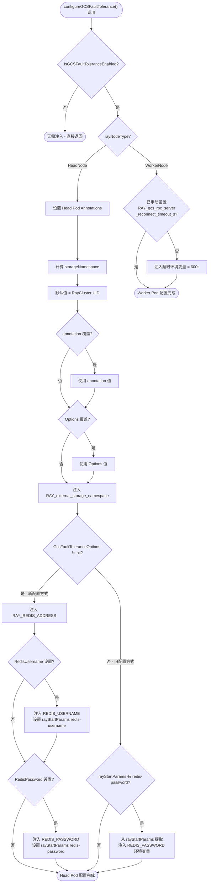
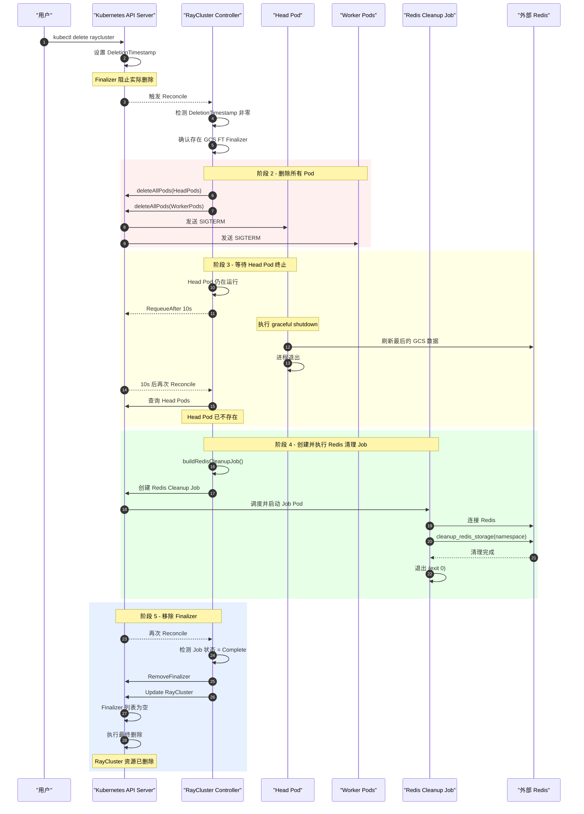
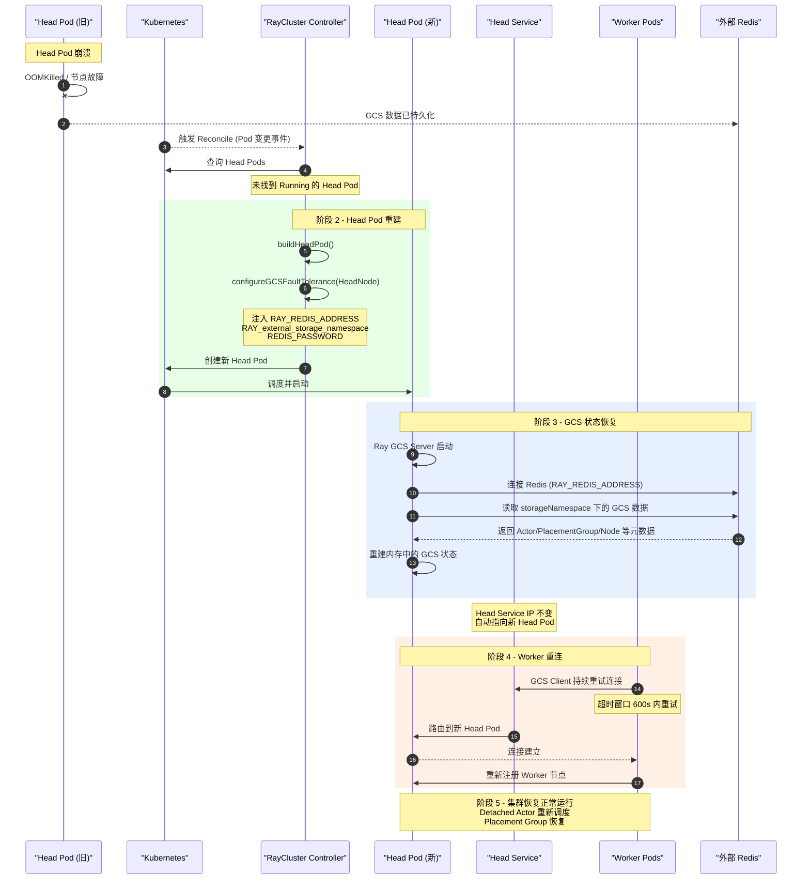

> 本文基于 KubeRay 源码，对 GCS (Global Control Store) 容错机制进行完整拆解，涵盖 GCS FT 配置注入、Pod 层面环境变量设置、Redis 清理 Finalizer 生命周期、以及 Head Pod 崩溃恢复的全链路分析。

---

## 目录

- [前置知识](#前置知识)
- [GCS 基础概念](#gcs-基础概念)
- [GCS FT 配置方式](#gcs-ft-配置方式)
- [Pod 层面配置注入流程](#pod-层面配置注入流程)
- [GCS FT 配置注入流程图](#gcs-ft-配置注入流程图)
- [Redis Cleanup Finalizer 机制](#redis-cleanup-finalizer-机制)
- [RayCluster 删除时 Redis 清理时序](#raycluster-删除时-redis-清理时序)
- [buildRedisCleanupJob 详解](#buildrediscleanjob-详解)
- [Redis 连接与安全](#redis-连接与安全)
- [Head Pod 恢复流程](#head-pod-恢复流程)
- [Head Pod 崩溃恢复时序](#head-pod-崩溃恢复时序)
- [Worker Init Container 等待机制](#worker-init-container-等待机制)
- [配置校验与防御性编程](#配置校验与防御性编程)
- [生产环境最佳实践](#生产环境最佳实践)
- [延伸阅读](#延伸阅读)
- [下一篇](#下一篇)

---

## 前置知识

阅读本文前，建议你已经了解以下内容：

| 前置知识 | 说明 |
|---------|------|
| Ray GCS 架构 | 理解 Ray 集群中 Global Control Store 的作用和存储模型 |
| Kubernetes Finalizer | 理解 Finalizer 阻止资源删除的机制 |
| Kubernetes Job | 理解 batch/v1 Job 的生命周期和重试策略 |
| RayCluster CRD | 已阅读 [CRD API 设计](../01-architecture-overview/03-crd-api-design.md) |
| RayCluster 调和循环 | 已阅读 [Reconciliation Loop 深度解析](../02-raycluster-controller/01-reconciliation-loop.md) |

---

## GCS 基础概念

Ray 的 **Global Control Store (GCS)** 是一个集中式元数据存储服务，运行在 Head 节点上，负责管理整个 Ray 集群的关键元数据。

### GCS 存储的核心数据

| 数据类型 | 说明 |
|---------|------|
| Actor Registry | 所有 Actor 的注册信息、位置、状态 |
| Placement Groups | 资源分组的分配和调度信息 |
| Node Information | 集群中所有节点的注册信息和健康状态 |
| Job Information | 提交到集群的作业信息 |
| Resource Usage | 各节点的资源使用和可用情况 |

### 默认行为的问题

默认情况下，GCS 数据完全存储在 Head 节点的**内存**中：

- Head 节点崩溃或被删除时，所有 GCS 数据**永久丢失**
- 所有 Worker 节点失去连接，集群需要**完全重启**
- 正在运行的 Detached Actor、Placement Group 等**无法恢复**
- 对于生产环境的长期运行任务（如 Ray Serve），这意味着**服务中断**

### GCS FT 解决方案

GCS Fault Tolerance (GCS FT) 通过将 GCS 数据存储到**外部 Redis** 中来解决上述问题：

- Head 节点崩溃后，新的 Head 节点可以从 Redis **恢复完整的 GCS 状态**
- Worker 节点通过 Head Service 自动重连新的 Head 节点
- Detached Actor、Placement Group 等在恢复后继续运行
- 整个过程对用户和应用程序**透明**

---

## GCS FT 配置方式

KubeRay 提供两种方式来启用 GCS FT，它们**互斥**，不能同时使用。

### 方式一 - GcsFaultToleranceOptions 字段（推荐）

从 KubeRay v1.1.0 开始引入的结构化配置方式，定义在 `RayClusterSpec` 中：

> 源码文件: `ray-operator/apis/ray/v1/raycluster_types.go`

```go
// GcsFaultToleranceOptions contains configs for GCS FT
type GcsFaultToleranceOptions struct {
    // +optional
    RedisUsername *RedisCredential `json:"redisUsername,omitempty"`
    // +optional
    RedisPassword *RedisCredential `json:"redisPassword,omitempty"`
    // +optional
    ExternalStorageNamespace string `json:"externalStorageNamespace,omitempty"`
    RedisAddress             string `json:"redisAddress"`
}

// RedisCredential is the redis username/password or a reference to the source
type RedisCredential struct {
    // +optional
    ValueFrom *corev1.EnvVarSource `json:"valueFrom,omitempty"`
    // +optional
    Value string `json:"value,omitempty"`
}
```

**字段说明**：

| 字段 | 必填 | 说明 |
|-----|------|------|
| `RedisAddress` | 是 | Redis 服务器地址，支持 `host:port` 和 `redis://host:port` 两种格式 |
| `RedisPassword` | 否 | Redis 密码，支持直接设置 `Value` 或通过 `ValueFrom` 引用 K8s Secret |
| `RedisUsername` | 否 | Redis 用户名（Ray 2.41+ 支持），同样支持 `Value` 和 `ValueFrom` |
| `ExternalStorageNamespace` | 否 | Redis 中的数据隔离命名空间，默认使用 RayCluster 的 UID |

**YAML 示例**（来自 `ray-operator/config/samples/ray-cluster.external-redis.yaml`）：

```yaml
apiVersion: ray.io/v1
kind: RayCluster
metadata:
  name: raycluster-external-redis
spec:
  rayVersion: '2.52.0'
  gcsFaultToleranceOptions:
    redisAddress: "redis:6379"
    redisPassword:
      valueFrom:
        secretKeyRef:
          name: redis-password-secret
          key: password
    # externalStorageNamespace: "my-raycluster-storage"  # 可选
  headGroupSpec:
    rayStartParams:
      num-cpus: "0"
    template:
      spec:
        containers:
        - name: ray-head
          image: rayproject/ray:2.52.0
```

也支持 Redis URI 格式（来自 `ray-operator/config/samples/ray-cluster.external-redis-uri.yaml`）：

```yaml
gcsFaultToleranceOptions:
  redisAddress: "redis://redis:6379"   # URI 格式
  redisPassword:
    valueFrom:
      secretKeyRef:
        name: redis-password-secret
        key: password
```

### 方式二 - Annotations（已弃用）

旧版的注解配置方式，在 KubeRay v1.1.0 之前使用：

> 源码文件: `ray-operator/controllers/ray/utils/constant.go` (L59-60)

```go
RayFTEnabledAnnotationKey         = "ray.io/ft-enabled"
RayExternalStorageNSAnnotationKey = "ray.io/external-storage-namespace"
```

**YAML 示例**（来自 `ray-operator/config/samples/ray-cluster.deprecate-gcs-ft.yaml`）：

```yaml
apiVersion: ray.io/v1
kind: RayCluster
metadata:
  annotations:
    ray.io/ft-enabled: "true"
    # ray.io/external-storage-namespace: "my-raycluster-storage"
  name: raycluster-external-redis
spec:
  headGroupSpec:
    rayStartParams:
      num-cpus: "0"
      redis-password: $REDIS_PASSWORD
    template:
      spec:
        containers:
        - name: ray-head
          env:
          - name: RAY_REDIS_ADDRESS
            value: redis:6379
          - name: REDIS_PASSWORD
            valueFrom:
              secretKeyRef:
                name: redis-password-secret
                key: password
```

### GCS FT 启用判定逻辑

> 源码文件: `ray-operator/controllers/ray/utils/util.go` (L725-728)

```go
func IsGCSFaultToleranceEnabled(spec *rayv1.RayClusterSpec, annotations map[string]string) bool {
    v, ok := annotations[RayFTEnabledAnnotationKey]
    return (ok && strings.ToLower(v) == "true") || spec.GcsFaultToleranceOptions != nil
}
```

只要满足以下任一条件，GCS FT 即被认为已启用：
1. 注解 `ray.io/ft-enabled` 的值为 `"true"`（大小写不敏感）
2. `spec.GcsFaultToleranceOptions` 不为 `nil`

---

## Pod 层面配置注入流程

GCS FT 的核心配置注入逻辑位于 `configureGCSFaultTolerance()` 函数中。这个函数在创建 Head Pod 和 Worker Pod 时都会被调用，但针对不同节点类型注入不同的环境变量。

> 源码文件: `ray-operator/controllers/ray/common/pod.go` (L76-162)

### Head Pod 注入的环境变量

当 `rayNodeType == rayv1.HeadNode` 时，注入以下配置：

| 环境变量 | 来源 | 说明 |
|---------|------|------|
| `RAY_REDIS_ADDRESS` | `GcsFaultToleranceOptions.RedisAddress` | Redis 连接地址 |
| `RAY_external_storage_namespace` | UID / Annotation / Options | 数据隔离命名空间 |
| `REDIS_PASSWORD` | `GcsFaultToleranceOptions.RedisPassword` 或 `rayStartParams` | Redis 认证密码 |
| `REDIS_USERNAME` | `GcsFaultToleranceOptions.RedisUsername` | Redis 用户名 (Ray 2.41+) |

**ExternalStorageNamespace 的优先级**（从低到高）：

1. RayCluster 的 UID（默认值）
2. 注解 `ray.io/external-storage-namespace` 的值
3. `GcsFaultToleranceOptions.ExternalStorageNamespace` 的值

相关源码片段：

```go
// 确定 storageNS 的值 (L106-112)
storageNS := string(instance.UID)
if v, ok := instance.Annotations[utils.RayExternalStorageNSAnnotationKey]; ok {
    storageNS = v
}
if options != nil && options.ExternalStorageNamespace != "" {
    storageNS = options.ExternalStorageNamespace
}
```

### Worker Pod 注入的环境变量

当 `rayNodeType == rayv1.WorkerNode` 时：

| 环境变量 | 默认值 | 说明 |
|---------|--------|------|
| `RAY_gcs_rpc_server_reconnect_timeout_s` | `600` | GCS 重连超时时间（秒） |

> 源码文件: `ray-operator/controllers/ray/utils/constant.go` (L218)

```go
DefaultWorkerRayGcsReconnectTimeoutS = "600"
```

**为什么 Worker 需要 600 秒的重连超时？**

- 默认值为 60 秒，但 Head 节点重建通常需要约 120 秒
- 如果 Worker 在 60 秒内无法重连 GCS，Raylet 进程会主动退出
- 将超时设置为 600 秒可以确保 Worker 节点在 Head 恢复期间不会被意外终止
- 用户可以通过在 Worker Pod 容器中手动设置此环境变量来覆盖默认值

### Head Pod 的 Annotation 标记

无论使用哪种配置方式，`configureGCSFaultTolerance()` 都会在 Head Pod 的 Annotation 中写入：

```go
podTemplate.Annotations[utils.RayFTEnabledAnnotationKey] = strconv.FormatBool(ftEnabled)
podTemplate.Annotations[utils.RayExternalStorageNSAnnotationKey] = storageNS
```

这些 Annotation 在后续的 Redis 清理流程中至关重要，因为清理 Job 需要知道要清理的 `storageNamespace`。

### rayStartParams 自动注入

当使用 `GcsFaultToleranceOptions` 配置方式时，KubeRay 会自动在 `rayStartParams` 中设置 Redis 认证参数：

```go
// L129 - 自动设置 redis-username 参数
instance.Spec.HeadGroupSpec.RayStartParams["redis-username"] = "$REDIS_USERNAME"

// L140 - 自动设置 redis-password 参数
instance.Spec.HeadGroupSpec.RayStartParams["redis-password"] = "$REDIS_PASSWORD"
```

这意味着用户不需要在 `rayStartParams` 中手动指定 `redis-password`，KubeRay 会自动处理。

---

## GCS FT 配置注入流程图



---

## Redis Cleanup Finalizer 机制

当启用 GCS FT 的 RayCluster 被删除时，KubeRay 需要清理 Redis 中对应的存储命名空间数据。这个过程通过 Kubernetes **Finalizer** 机制来保证在 RayCluster 被完全删除之前，Redis 中的数据已被清理。

> 源码文件: `ray-operator/controllers/ray/raycluster_controller.go` (L201-299)

### Finalizer 名称

> 源码文件: `ray-operator/controllers/ray/utils/constant.go` (L84)

```go
GCSFaultToleranceRedisCleanupFinalizer = "ray.io/gcs-ft-redis-cleanup-finalizer"
```

### 功能开关

Redis 清理功能可以通过环境变量 `ENABLE_GCS_FT_REDIS_CLEANUP` 来控制：

> 源码文件: `ray-operator/controllers/ray/utils/constant.go` (L180)

```go
ENABLE_GCS_FT_REDIS_CLEANUP = "ENABLE_GCS_FT_REDIS_CLEANUP"
```

- 默认值: 启用（只有显式设置为 `"false"` 时才关闭）
- 关闭后: 用户需要手动清理 Redis 中的存储命名空间

### 完整删除流程

以下是 RayCluster 删除时 Redis 清理 Finalizer 的完整处理链路：

**阶段 1 - 添加 Finalizer**

当 GCS FT 启用且 RayCluster 尚未被删除（`DeletionTimestamp.IsZero()`）时：

```go
if !controllerutil.ContainsFinalizer(instance, utils.GCSFaultToleranceRedisCleanupFinalizer) {
    controllerutil.AddFinalizer(instance, utils.GCSFaultToleranceRedisCleanupFinalizer)
    if err := r.Update(ctx, instance); err != nil {
        return ctrl.Result{RequeueAfter: DefaultRequeueDuration}, err
    }
    return ctrl.Result{RequeueAfter: DefaultRequeueDuration}, nil
}
```

Finalizer 在 RayCluster 首次调和时就会被添加，确保后续删除操作能被拦截。

**阶段 2 - 删除所有 Pod**

当检测到 `DeletionTimestamp` 不为零时，首先删除所有 Ray Pod：

```go
// 先删除 Head Pod
headPods, err := r.deleteAllPods(ctx, common.RayClusterHeadPodsAssociationOptions(instance))
// 再删除所有 Worker Pod
if _, err = r.deleteAllPods(ctx, common.RayClusterWorkerPodsAssociationOptions(instance)); err != nil {
    return ctrl.Result{RequeueAfter: DefaultRequeueDuration}, err
}
```

**阶段 3 - 等待 Head Pod 终止**

如果 Head Pod 仍在运行，控制器会等待其完全终止，因为 GCS 进程可能仍在向 Redis 写入数据：

```go
if len(headPods.Items) > 0 {
    // Requeue after 10 seconds
    return ctrl.Result{RequeueAfter: 10 * time.Second}, nil
}
```

等待间隔为 **10 秒**，因为 Head Pod 的终止时间通常远超默认的 2 秒重试间隔。

**阶段 4 - 创建 Redis 清理 Job**

Head Pod 终止后，控制器检查是否已存在 Redis 清理 Job：

- 如果**不存在**: 调用 `buildRedisCleanupJob()` 创建新 Job
- 如果**已存在且完成**: 根据完成状态（成功/失败）输出日志，然后进入阶段 5
- 如果**已存在且运行中**: 以 2 秒间隔重新入队等待

**阶段 5 - 移除 Finalizer**

Redis 清理 Job 完成（无论成功或失败）后，移除 Finalizer：

```go
controllerutil.RemoveFinalizer(instance, utils.GCSFaultToleranceRedisCleanupFinalizer)
if err := r.Update(ctx, instance); err != nil {
    return ctrl.Result{RequeueAfter: DefaultRequeueDuration}, err
}
```

Finalizer 被移除后，Kubernetes 会自动完成 RayCluster 资源的最终删除。

> **注意**: 即使 Redis 清理 Job 失败，Finalizer 也会被移除以避免 RayCluster 永远无法删除。此时控制器会输出提示信息，指导用户手动清理 Redis 数据。

---

## RayCluster 删除时 Redis 清理时序



---

## buildRedisCleanupJob 详解

Redis 清理 Job 是整个 Finalizer 流程的核心执行单元。其构建逻辑位于 `buildRedisCleanupJob()` 函数中。

> 源码文件: `ray-operator/controllers/ray/raycluster_controller.go` (L1434-1517)

### Job 构建策略

```go
func (r *RayClusterReconciler) buildRedisCleanupJob(ctx context.Context, instance rayv1.RayCluster) batchv1.Job {
    // 1. 基于 Head Pod 模板构建 Pod
    pod := r.buildHeadPod(ctx, instance)
    // 2. 标记为 Redis 清理节点类型
    pod.Labels[utils.RayNodeTypeLabelKey] = string(rayv1.RedisCleanupNode)
    // 3. 只保留 Ray 容器
    pod.Spec.Containers = []corev1.Container{pod.Spec.Containers[utils.RayContainerIndex]}
    // ...
}
```

**关键设计决策**：使用与 Head Pod 相同的容器镜像和环境变量配置来构建清理 Job，这样可以确保：
- Redis 连接信息（地址、密码）与 Head Pod 完全一致
- 可以正确访问 K8s Secret 中引用的凭据
- 使用相同版本的 Ray SDK 中的 `cleanup_redis_storage` 函数

### 清理命令

Job 容器执行的 Python 脚本调用了 Ray 内部的 `cleanup_redis_storage` 工具函数：

```python
from ray._private.gcs_utils import cleanup_redis_storage
from urllib.parse import urlparse
import os
import sys

redis_address = os.getenv('RAY_REDIS_ADDRESS', '').split(',')[0]
redis_address = redis_address if '://' in redis_address else 'redis://' + redis_address
parsed = urlparse(redis_address)

# 如果配置了 RedisUsername
sys.exit(1) if not cleanup_redis_storage(
    host=parsed.hostname,
    port=parsed.port,
    username=os.getenv('REDIS_USERNAME', parsed.username),
    password=os.getenv('REDIS_PASSWORD', parsed.password or ''),
    use_ssl=parsed.scheme=='rediss',
    storage_namespace=os.getenv('RAY_external_storage_namespace')
) else None
```

**关键细节**：

- `split(',')[0]`: 仅取第一个 Redis 地址（支持多地址配置但只用第一个来做清理）
- `use_ssl=parsed.scheme=='rediss'`: 通过 URI scheme 自动检测是否需要 TLS（`rediss://` 表示 TLS）
- `sys.exit(1)`: 如果清理失败，返回非零退出码触发 Job 重试

### Job 配置参数

| 参数 | 值 | 说明 |
|-----|-----|------|
| `BackoffLimit` | `0` | 不重试（清理失败由 Controller 层面处理） |
| `ActiveDeadlineSeconds` | `300` | 最长运行 5 分钟 |
| `RestartPolicy` | `Never` | Pod 失败后不重启 |
| CPU 请求/限制 | `200m` | 固定资源 - 清理任务不需要大量 CPU |
| Memory 请求/限制 | `256Mi` | 固定资源 - 避免使用 Head Pod 的 GPU 等昂贵资源 |
| `RAY_redis_db_connect_retries` | `120` | Redis 连接重试次数 |
| `RAY_redis_db_connect_wait_milliseconds` | `500` | 每次重试等待时间 |

> **资源优化**: 清理 Job 显式设置了轻量级的资源配额（200m CPU / 256Mi Memory），避免继承 Head Pod 可能配置的 GPU 或大量 CPU/Memory 资源。

### Job 命名

```go
jobName := utils.TrimJobName(fmt.Sprintf("%s-%s", instance.Name, "redis-cleanup"))
```

Job 名称格式为 `{RayCluster名称}-redis-cleanup`，并通过 `TrimJobName` 确保不超过 Kubernetes 的 63 字符限制。

### OwnerReference

```go
if err := controllerutil.SetControllerReference(&instance, &redisCleanupJob, r.Scheme); err != nil {
    logger.Error(err, "Failed to set controller reference for the Redis cleanup Job.")
}
```

Redis 清理 Job 的 OwnerReference 指向 RayCluster，确保 RayCluster 最终被删除时，Job 也会被 Kubernetes 垃圾回收。

---

## Redis 连接与安全

### 密码认证方式对比

| 方式 | 安全性 | 示例 |
|-----|--------|------|
| Secret 引用（推荐） | 高 | `valueFrom: secretKeyRef: ...` |
| 明文密码 | 低 | `value: "my-password"` |
| rayStartParams 直接设置（已弃用） | 最低 | `redis-password: 5241590000000000` |

**Secret 引用示例**：

```yaml
gcsFaultToleranceOptions:
  redisAddress: "redis:6379"
  redisPassword:
    valueFrom:
      secretKeyRef:
        name: redis-password-secret
        key: password
  redisUsername:
    valueFrom:
      secretKeyRef:
        name: redis-credentials
        key: username
```

### TLS 加密连接

Redis 的 TLS 支持通过 URI scheme 来控制：

| URI 格式 | TLS | 说明 |
|---------|-----|------|
| `redis://host:port` | 否 | 明文连接 |
| `rediss://host:port` | 是 | TLS 加密连接 |
| `host:port` | 否 | 自动添加 `redis://` 前缀 |

在 Redis 清理 Job 中，TLS 检测逻辑：

```python
use_ssl=parsed.scheme=='rediss'
```

### 多集群数据隔离

`ExternalStorageNamespace` 是实现多个 RayCluster 共享同一个 Redis 实例的关键机制：

- 每个 RayCluster 的 GCS 数据存储在 Redis 中不同的 namespace 下
- 默认值为 RayCluster 的 UID，保证全局唯一性
- 删除 RayCluster 时，只清理对应 namespace 下的数据，不影响其他集群

```
Redis 数据结构示例:

{namespace-uuid-1}/gcs/actor/...      ← RayCluster A 的数据
{namespace-uuid-1}/gcs/node/...
{namespace-uuid-2}/gcs/actor/...      ← RayCluster B 的数据
{namespace-uuid-2}/gcs/node/...
```

> **重要提示**: 如果手动指定 `ExternalStorageNamespace`，需要确保不同 RayCluster 之间不使用相同的值。对于 RayService 场景，需要特别注意，因为 RayService 在滚动升级时会创建新的 RayCluster，如果两个 RayCluster 使用了相同的 namespace，可能导致数据冲突。

---

## Head Pod 恢复流程

当 GCS FT 启用后，Head Pod 的崩溃和恢复变成一个可自动完成的过程。以下是完整的恢复链路。

### 恢复阶段详解

**阶段 1 - 故障检测**

Head Pod 因各种原因（OOMKilled、节点故障、手动删除等）变为不可用：
- RayCluster Controller 在每次调和时检查 Head Pod 状态
- 通过 `reconcileHeadPods()` 检测到 Head Pod 不存在

**阶段 2 - Head Pod 重建**

Controller 检测到 Head Pod 缺失后，使用与原始 Head Pod 相同的 PodTemplate 创建新的 Head Pod：
- 新 Pod 携带相同的 GCS FT 配置（Redis 地址、密码、storageNamespace）
- `configureGCSFaultTolerance()` 被再次调用，注入所有必要的环境变量
- 如果启用了确定性 Head Pod 名称，新 Pod 使用与原来相同的名称

**阶段 3 - GCS 状态恢复**

新的 Head Pod 启动后：
- Ray GCS Server 进程启动
- 检测到 `RAY_REDIS_ADDRESS` 环境变量已设置
- 连接外部 Redis
- 从 Redis 中读取 `RAY_external_storage_namespace` 对应的所有 GCS 数据
- 重建内存中的 GCS 状态（Actor 注册表、Placement Group 等）

**阶段 4 - Worker 重连**

Worker 节点通过 Head Service 自动发现新的 Head Pod：
- Head Service（ClusterIP 类型）的 IP 保持不变
- Worker 的 `RAY_gcs_rpc_server_reconnect_timeout_s` 默认 600 秒
- Worker 的 GCS Client 在超时窗口内持续重试连接
- 成功连接后，Worker 重新注册到新的 GCS Server

**阶段 5 - 集群恢复**

GCS 状态恢复完成后：
- Detached Actor 被重新调度
- Placement Group 恢复到之前的状态
- 集群恢复正常运行

---

## Head Pod 崩溃恢复时序



---

## Worker Init Container 等待机制

为了确保 Worker Pod 的 Raylet 进程不会在 GCS Server 尚未就绪时启动，KubeRay 会为每个 Worker Pod 注入一个 `wait-gcs-ready` Init Container。

> 源码文件: `ray-operator/controllers/ray/common/pod.go` (L308-363)

### Init Container 配置

```go
initContainer := corev1.Container{
    Name:            "wait-gcs-ready",
    Image:           podTemplate.Spec.Containers[utils.RayContainerIndex].Image,
    ImagePullPolicy: podTemplate.Spec.Containers[utils.RayContainerIndex].ImagePullPolicy,
    Command:         utils.GetContainerCommand([]string{}),
    Args: []string{
        fmt.Sprintf(`
            SECONDS=0
            while true; do
                if (( SECONDS <= 120 )); then
                    if ray health-check --address %s:%s > /dev/null 2>&1; then
                        echo "GCS is ready."
                        break
                    fi
                    echo "$SECONDS seconds elapsed: Waiting for GCS to be ready."
                else
                    if ray health-check --address %s:%s; then
                        echo "GCS is ready. Any error messages above can be safely ignored."
                        break
                    fi
                    echo "$SECONDS seconds elapsed: Still waiting for GCS to be ready."
                fi
                sleep 5
            done
        `, fqdnRayIP, headPort, fqdnRayIP, headPort),
    },
    Resources: corev1.ResourceRequirements{
        Limits: corev1.ResourceList{
            corev1.ResourceCPU:    resource.MustParse("200m"),
            corev1.ResourceMemory: resource.MustParse("256Mi"),
        },
        Requests: corev1.ResourceList{
            corev1.ResourceCPU:    resource.MustParse("200m"),
            corev1.ResourceMemory: resource.MustParse("256Mi"),
        },
    },
}
```

**等待逻辑特点**：

| 时间段 | 行为 |
|--------|------|
| 0-120 秒 | 静默模式 - 错误输出被重定向到 `/dev/null` |
| 120 秒之后 | 详细模式 - 显示完整的错误信息，方便排障 |
| 轮询间隔 | 每 5 秒检查一次 |

**功能开关**：

```go
// 通过环境变量控制是否注入 Init Container
EnableInitContainerInjectionEnvKey = "ENABLE_INIT_CONTAINER_INJECTION"
```

设置 `ENABLE_INIT_CONTAINER_INJECTION=false` 可以关闭自动注入，用户可以自行实现等待逻辑。

---

## 配置校验与防御性编程

KubeRay 在 `ValidateRayClusterSpec()` 中对 GCS FT 配置进行了严格的合法性校验。

> 源码文件: `ray-operator/controllers/ray/utils/validation.go` (L149-179)

### 校验规则

| 规则编号 | 校验条件 | 错误信息 |
|---------|---------|---------|
| 1 | Annotation 和 Options 不能同时设置 | `Please use only GcsFaultToleranceOptions to configure GCS fault tolerance` |
| 2 | 未启用 FT 时不能设置 `RAY_REDIS_ADDRESS` | `to enable GCS fault tolerance` |
| 3 | 使用 Options 时不能手动设置 `RAY_REDIS_ADDRESS` 环境变量 | `use GcsFaultToleranceOptions.RedisAddress instead` |
| 4 | 使用 Options 时不能手动设置 `REDIS_PASSWORD` 环境变量 | `cannot set REDIS_PASSWORD env var in head Pod when GcsFaultToleranceOptions is enabled` |
| 5 | 使用 Options 时不能设置 `ray.io/external-storage-namespace` 注解 | `use GcsFaultToleranceOptions.ExternalStorageNamespace instead` |

这些校验确保用户不会混合使用新旧两种配置方式，避免配置冲突和歧义。

---

## 生产环境最佳实践

### 1. Redis 高可用

在生产环境中，Redis 本身也应该是高可用的。推荐方案：

| 方案 | 适用场景 | 说明 |
|------|---------|------|
| Redis Sentinel | 中等规模 | 自动故障转移，需要 3+ 节点 |
| Redis Cluster | 大规模 | 数据分片，但 GCS FT 只用第一个节点 |
| 云托管 Redis | 所有场景 | AWS ElastiCache / GCP Memorystore / Azure Cache |

### 2. ExternalStorageNamespace 管理

- **默认值（推荐）**: 使用 RayCluster UID，保证全局唯一，无需手动管理
- **自定义值**: 仅在需要跨 RayCluster 共享 GCS 数据时使用（极少见场景）
- **RayService 场景**: 不要手动设置，让 KubeRay 自动管理以确保滚动升级正确工作

### 3. Redis 清理 Job 失败处理

如果 Redis 清理 Job 失败，RayCluster 仍会被删除（Finalizer 会在 Job 完成后移除，无论成功或失败）。此时需要手动清理 Redis：

```bash
# 连接到 Redis
redis-cli -h <redis-host> -p <redis-port> -a <password>

# 查找对应的 namespace 键
KEYS {storage-namespace}*

# 删除所有相关键
DEL {storage-namespace}/gcs/...
```

### 4. 监控建议

| 监控项 | 方法 | 告警阈值 |
|--------|------|---------|
| Redis 连接状态 | Redis `PING` | 连接失败 |
| Redis 内存使用 | `INFO memory` | > 80% |
| GCS 重连超时 | Worker Pod 日志 | 接近 600s |
| Redis 清理 Job 状态 | `kubectl get jobs` | Job Failed |

---

## 延伸阅读

- [Ray GCS 容错官方文档](https://docs.ray.io/en/master/cluster/kubernetes/user-guides/kuberay-gcs-ft.html)
- [Kubernetes Finalizer 机制详解](https://kubernetes.io/docs/concepts/overview/working-with-objects/finalizers/)
- [Kubernetes Job 控制器文档](https://kubernetes.io/docs/concepts/workloads/controllers/job/)
- [Redis Sentinel 高可用文档](https://redis.io/docs/management/sentinel/)
- KubeRay 源码: `ray-operator/controllers/ray/common/pod.go` - GCS FT 配置注入
- KubeRay 源码: `ray-operator/controllers/ray/raycluster_controller.go` - Finalizer 与清理 Job
- KubeRay 源码: `ray-operator/apis/ray/v1/raycluster_types.go` - CRD 类型定义
- KubeRay 源码: `ray-operator/controllers/ray/utils/constant.go` - 常量定义
- KubeRay 源码: `ray-operator/controllers/ray/utils/validation.go` - 配置校验逻辑

---

## 下一篇

> [04-webhook-validation.md - Webhook 校验机制深度解析](04-webhook-validation.md)
>
> 下一篇将深入分析 KubeRay 的 Admission Webhook 校验机制，包括 Mutating Webhook 的默认值注入、Validating Webhook 的字段校验规则、Webhook 证书管理、以及如何调试 Webhook 相关问题。
