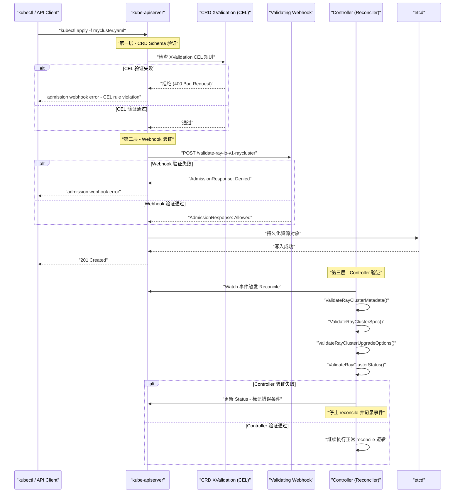
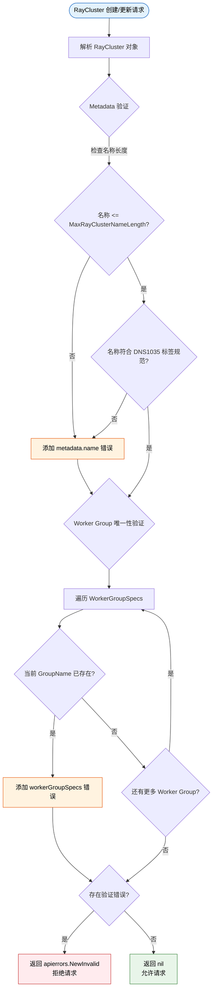
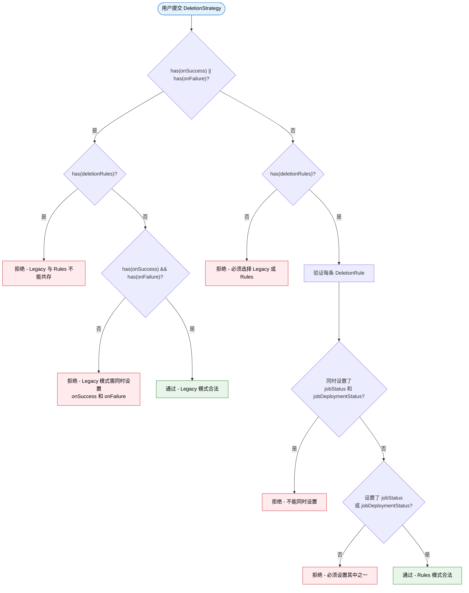

## 前置知识

在深入理解 KubeRay 的 Webhook 验证机制之前，建议读者具备以下基础知识:

| 知识领域 | 具体内容 | 重要程度 |
|---------|---------|---------|
| Kubernetes Admission Controller | 理解 ValidatingWebhookConfiguration 与 MutatingWebhookConfiguration 的区别 | 必需 |
| CRD (Custom Resource Definition) | 理解 CRD 的 schema 定义和 structural schema 要求 | 必需 |
| CEL (Common Expression Language) | 了解 Kubernetes 1.25+ 引入的 CRD XValidation 规则语法 | 推荐 |
| cert-manager | 理解 TLS 证书自动管理机制 | 推荐 |
| controller-runtime Webhook | 了解 `sigs.k8s.io/controller-runtime` 中的 webhook 接口设计 | 推荐 |

---

## 1. Webhook 概览

### 1.1 验证架构总览

KubeRay 项目采用了**三层验证架构**来确保 CRD 资源的合法性。与许多 Kubernetes Operator 不同，KubeRay 仅使用 **Validating Webhook**（验证型准入 Webhook），而没有使用 Mutating Webhook（变更型准入 Webhook）。这意味着 KubeRay 的 Webhook 只负责"拒绝不合法的资源"，而不会对用户提交的资源做任何自动修改。

三层验证的设计理念是**纵深防御（Defense in Depth）**:

| 层级 | 验证类型 | 执行时机 | 执行位置 | 可绕过性 |
|------|---------|---------|---------|---------|
| 第一层 | CRD XValidation (CEL) | API Server 写入前 | kube-apiserver 内部 | 不可绕过 |
| 第二层 | Validating Webhook | API Server 准入阶段 | Operator Pod 内 | 可选关闭 |
| 第三层 | Controller Validation | Reconcile 循环中 | Operator Pod 内 | 不可绕过 |

### 1.2 Webhook 启用方式

Webhook 通过环境变量 `ENABLE_WEBHOOKS=true` 启用。相关注册逻辑位于 `main.go` 的 L290-293:

```go
// ray-operator/main.go (L290-293)
if os.Getenv("ENABLE_WEBHOOKS") == "true" {
    exitOnError(webhooks.SetupRayClusterWebhookWithManager(mgr),
        "unable to create webhook", "webhook", "RayCluster")
}
```

> **注意**: 当前代码中只有 RayCluster Webhook 在 `main.go` 中通过 `ENABLE_WEBHOOKS` 控制注册。RayJob 和 RayService 的 Webhook 实现虽然存在，但其注册方式需要通过 Kustomize overlay 配合 `ValidatingWebhookConfiguration` 清单一并部署。

### 1.3 三层验证链路时序

下面的时序图展示了用户创建一个 KubeRay 资源（以 RayCluster 为例）时，请求经过的完整验证链路:



---

## 2. RayCluster Webhook

### 2.1 Webhook 结构体定义

RayCluster Webhook 的完整实现仅有 86 行代码，位于:

> **源码文件**: `ray-operator/pkg/webhooks/v1/raycluster_webhook.go`

```go
// ray-operator/pkg/webhooks/v1/raycluster_webhook.go

type RayClusterWebhook struct{}

//+kubebuilder:webhook:path=/validate-ray-io-v1-raycluster,mutating=false,
//  failurePolicy=fail,sideEffects=None,groups=ray.io,resources=rayclusters,
//  verbs=create;update,versions=v1,name=vraycluster.kb.io,
//  admissionReviewVersions=v1

var _ webhook.CustomValidator = &RayClusterWebhook{}
```

关键的 kubebuilder marker 注解说明:

| 参数 | 值 | 说明 |
|-----|---|------|
| `path` | `/validate-ray-io-v1-raycluster` | Webhook HTTP 端点路径 |
| `mutating` | `false` | 仅验证，不做变更 |
| `failurePolicy` | `fail` | Webhook 不可用时拒绝请求 |
| `sideEffects` | `None` | 无副作用，支持 dry-run |
| `verbs` | `create;update` | 仅拦截创建和更新操作 |

### 2.2 验证方法实现

RayCluster Webhook 实现了 `webhook.CustomValidator` 接口的三个方法:

```go
// ValidateCreate - 创建时验证
func (w *RayClusterWebhook) ValidateCreate(_ context.Context, obj runtime.Object) (admission.Warnings, error) {
    rayCluster := obj.(*rayv1.RayCluster)
    rayClusterLog.Info("validate create", "name", rayCluster.Name)
    return nil, w.validateRayCluster(rayCluster)
}

// ValidateUpdate - 更新时验证（使用新对象）
func (w *RayClusterWebhook) ValidateUpdate(_ context.Context, _ runtime.Object, newObj runtime.Object) (admission.Warnings, error) {
    rayCluster := newObj.(*rayv1.RayCluster)
    rayClusterLog.Info("validate update", "name", rayCluster.Name)
    return nil, w.validateRayCluster(rayCluster)
}

// ValidateDelete - 删除时验证（空操作）
func (w *RayClusterWebhook) ValidateDelete(_ context.Context, _ runtime.Object) (admission.Warnings, error) {
    return nil, nil
}
```

### 2.3 核心验证逻辑

`validateRayCluster` 方法执行两类验证:

```go
func (w *RayClusterWebhook) validateRayCluster(rayCluster *rayv1.RayCluster) error {
    var allErrs field.ErrorList

    // 1. Metadata 验证 - 复用 Controller 层的验证逻辑
    if err := utils.ValidateRayClusterMetadata(rayCluster.ObjectMeta); err != nil {
        allErrs = append(allErrs, field.Invalid(
            field.NewPath("metadata").Child("name"), rayCluster.Name, err.Error()))
    }

    // 2. Worker Group 名称唯一性验证
    if err := w.validateWorkerGroups(rayCluster); err != nil {
        allErrs = append(allErrs, err)
    }

    if len(allErrs) == 0 {
        return nil
    }

    return apierrors.NewInvalid(
        schema.GroupKind{Group: "ray.io", Kind: "RayCluster"},
        rayCluster.Name, allErrs)
}
```

Worker Group 名称唯一性检查的实现:

```go
func (w *RayClusterWebhook) validateWorkerGroups(rayCluster *rayv1.RayCluster) *field.Error {
    workerGroupNames := make(map[string]bool)

    for i, workerGroup := range rayCluster.Spec.WorkerGroupSpecs {
        if _, ok := workerGroupNames[workerGroup.GroupName]; ok {
            return field.Invalid(
                field.NewPath("spec").Child("workerGroupSpecs").Index(i),
                workerGroup,
                "worker group names must be unique")
        }
        workerGroupNames[workerGroup.GroupName] = true
    }

    return nil
}
```

### 2.4 RayCluster Webhook 验证流程



### 2.5 RayJob 与 RayService Webhook

除 RayCluster 外，KubeRay 还为 RayJob 和 RayService 提供了同样结构的 Webhook:

**RayJob Webhook** (`ray-operator/pkg/webhooks/v1/rayjob_webhook.go`):

```go
func (w *RayJobWebhook) validateRayJob(rayJob *rayv1.RayJob) error {
    var allErrs field.ErrorList
    if err := utils.ValidateRayJobMetadata(rayJob.ObjectMeta); err != nil {
        allErrs = append(allErrs, field.Invalid(
            field.NewPath("metadata").Child("name"), rayJob.Name, err.Error()))
    }
    // ... 返回聚合错误
}
```

**RayService Webhook** (`ray-operator/pkg/webhooks/v1/rayservice_webhook.go`):

```go
func (w *RayServiceWebhook) validateRayService(rayService *rayv1.RayService) error {
    var allErrs field.ErrorList
    if err := utils.ValidateRayServiceMetadata(rayService.ObjectMeta); err != nil {
        allErrs = append(allErrs, field.Invalid(
            field.NewPath("metadata").Child("name"), rayService.Name, err.Error()))
    }
    // ... 返回聚合错误
}
```

三种 Webhook 共享统一的设计模式:
- 都实现 `webhook.CustomValidator` 接口
- `ValidateDelete` 均为空操作 (返回 nil)
- 都使用 `field.ErrorList` 聚合多个验证错误
- 都通过 `apierrors.NewInvalid` 构造标准 Kubernetes 错误响应

### 2.6 Webhook 注册机制

所有 Webhook 都通过 `SetupXxxWebhookWithManager` 函数注册到 controller-runtime 的 Manager:

```go
// ray-operator/pkg/webhooks/v1/raycluster_webhook.go
func SetupRayClusterWebhookWithManager(mgr ctrl.Manager) error {
    return ctrl.NewWebhookManagedBy(mgr).
        For(&rayv1.RayCluster{}).
        WithValidator(&RayClusterWebhook{}).
        Complete()
}
```

`ctrl.NewWebhookManagedBy(mgr)` 会自动完成以下工作:
1. 根据 kubebuilder marker 注解推断 Webhook 路径
2. 在 Manager 的 webhook server 上注册 HTTP handler
3. 配置 TLS 证书加载和请求认证

---

## 3. Controller 侧双重验证

### 3.1 为什么需要双重验证

Webhook 验证虽然在资源写入前拦截非法请求，但存在以下局限性:

1. **Webhook 可能被禁用**: `ENABLE_WEBHOOKS` 环境变量可设为 `false`
2. **Webhook 可能不可用**: 网络故障、Pod 重启等原因可能导致 Webhook 暂时不可达
3. **failurePolicy 策略**: 如果设为 `Ignore`，Webhook 故障时请求会直接通过
4. **旧资源兼容**: 在启用 Webhook 之前已创建的资源不会被追溯验证
5. **运行时状态验证**: 某些验证需要依赖运行时状态（如 Status 条件），这些在 Webhook 阶段不可用

因此，Controller 在每次 Reconcile 循环开始时都会重新执行一遍完整的验证，作为最后一道防线。

### 3.2 RayCluster Controller 验证

> **源码文件**: `ray-operator/controllers/ray/raycluster_controller.go` (L170-193)

RayCluster Controller 在 Reconcile 入口处依次执行四类验证:

```go
// ray-operator/controllers/ray/raycluster_controller.go (L170-193)

// 1. Metadata 验证
if err := utils.ValidateRayClusterMetadata(instance.ObjectMeta); err != nil {
    logger.Error(err, "The RayCluster metadata is invalid")
    // ...
}

// 2. Spec 验证
if err := utils.ValidateRayClusterSpec(&instance.Spec, instance.Annotations); err != nil {
    logger.Error(err, "The RayCluster spec is invalid")
    // ...
}

// 3. UpgradeStrategy 验证
if err := utils.ValidateRayClusterUpgradeOptions(instance); err != nil {
    logger.Error(err, "The RayCluster UpgradeStrategy is invalid")
    // ...
}

// 4. Status 验证
if err := utils.ValidateRayClusterStatus(instance); err != nil {
    logger.Error(err, "The RayCluster status is invalid")
    // ...
}
```

### 3.3 验证函数详解

所有验证函数定义在:

> **源码文件**: `ray-operator/controllers/ray/utils/validation.go` (726 行)

#### ValidateRayClusterMetadata

```go
func ValidateRayClusterMetadata(metadata metav1.ObjectMeta) error {
    if len(metadata.Name) > MaxRayClusterNameLength {
        return fmt.Errorf("RayCluster name should be no more than %d characters",
            MaxRayClusterNameLength)
    }
    if errs := validation.IsDNS1035Label(metadata.Name); len(errs) > 0 {
        return fmt.Errorf("RayCluster name should be a valid DNS1035 label: %v", errs)
    }
    return nil
}
```

#### ValidateRayClusterSpec (核心验证函数)

该函数是 KubeRay 中最全面的验证函数，涵盖以下检查项:

| 验证项 | 说明 |
|--------|------|
| Container 存在性 | HeadGroupSpec 和每个 WorkerGroupSpec 至少包含一个容器 |
| 资源配置冲突 | `rayStartParams` 和 `Resources` 不能同时设置资源 |
| 标签语法 | Group Labels 必须符合 Kubernetes 标签语法规范 |
| 副本数约束 | `minReplicas >= 0`, `maxReplicas >= 0`, `minReplicas <= maxReplicas` |
| Autoscaler 一致性 | 禁用 Autoscaler 时必须设置 min/maxReplicas |
| GCS FT 配置 | `GcsFaultToleranceOptions` 与旧版注解/环境变量互斥 |
| Redis 配置 | redis-password、RAY_REDIS_ADDRESS 等与 GcsFaultToleranceOptions 互斥 |
| Worker 挂起 | Suspend 需启用 `RayJobDeletionPolicy` feature gate |
| Autoscaler V2 | RestartPolicy 必须为 `Never` 或未设置 |
| Auth 配置 | Token 模式要求 Ray >= 2.52.0 |

#### ValidateRayClusterUpgradeOptions

```go
func ValidateRayClusterUpgradeOptions(instance *rayv1.RayCluster) error {
    // UpgradeStrategy.Type 必须是 Recreate 或 None
    if instance.Spec.UpgradeStrategy != nil && instance.Spec.UpgradeStrategy.Type != nil &&
        *instance.Spec.UpgradeStrategy.Type != rayv1.RayClusterRecreate &&
        *instance.Spec.UpgradeStrategy.Type != rayv1.RayClusterUpgradeNone {
        return fmt.Errorf(...)
    }

    // UpgradeStrategy 不能用于 RayJob/RayService 创建的子 RayCluster
    if instance.Spec.UpgradeStrategy != nil && instance.Spec.UpgradeStrategy.Type != nil {
        creatorCRDType := GetCRDType(instance.Labels[RayOriginatedFromCRDLabelKey])
        if creatorCRDType == RayJobCRD || creatorCRDType == RayServiceCRD {
            return fmt.Errorf("upgradeStrategy cannot be set when RayCluster is created by %s",
                creatorCRDType)
        }
    }
    return nil
}
```

#### ValidateRayClusterStatus

```go
func ValidateRayClusterStatus(instance *rayv1.RayCluster) error {
    suspending := meta.IsStatusConditionTrue(instance.Status.Conditions,
        string(rayv1.RayClusterSuspending))
    suspended := meta.IsStatusConditionTrue(instance.Status.Conditions,
        string(rayv1.RayClusterSuspended))
    // Suspending 和 Suspended 不能同时为 true
    if suspending && suspended {
        return errstd.New("invalid RayCluster State: ...")
    }
    return nil
}
```

### 3.4 RayJob Controller 验证

> **源码文件**: `ray-operator/controllers/ray/rayjob_controller.go` (L453-456)

RayJob Controller 使用表驱动方式组织验证:

```go
// ray-operator/controllers/ray/rayjob_controller.go (L453-456)
{func() error { return utils.ValidateRayJobMetadata(rayJobInstance.ObjectMeta) }, utils.InvalidRayJobMetadata},
{func() error { return utils.ValidateRayJobSpec(rayJobInstance) }, utils.InvalidRayJobSpec},
{func() error { return utils.ValidateRayJobStatus(rayJobInstance) }, utils.InvalidRayJobStatus},
```

**ValidateRayJobSpec** 涵盖的检查项:

| 验证项 | 说明 |
|--------|------|
| Suspend 约束 | `suspend=true` 要求 `shutdownAfterJobFinishes=true` |
| TTL 约束 | `TTLSecondsAfterFinished` 必须非负 |
| DeletionStrategy | Legacy 与 Rules 互斥验证 |
| ClusterSelector | 与 suspend、SidecarMode 的兼容性检查 |
| InteractiveMode | 不支持 `backoffLimit > 0` |
| SidecarMode | 不支持 SubmitterPodTemplate/SubmitterConfig |
| 嵌套 RayClusterSpec | 递归调用 `ValidateRayClusterSpec` |
| RuntimeEnvYAML | YAML 格式合法性 |
| ActiveDeadlineSeconds | 必须为正整数 |

### 3.5 RayService Controller 验证

> **源码文件**: `ray-operator/controllers/ray/rayservice_controller.go` (L287-289)

```go
// ray-operator/controllers/ray/rayservice_controller.go (L287-289)
{func() error { return utils.ValidateRayServiceMetadata(rayServiceInstance.ObjectMeta) }, utils.InvalidRayServiceMetadata},
{func() error { return utils.ValidateRayServiceSpec(rayServiceInstance) }, utils.InvalidRayServiceSpec},
```

**ValidateRayServiceSpec** 涵盖的检查项:

| 验证项 | 说明 |
|--------|------|
| 嵌套 RayClusterSpec | 递归调用 `ValidateRayClusterSpec` |
| HeadService 名称 | `headService.metadata.name` 不允许手动设置 |
| UpgradeStrategy.Type | 仅允许 `NewClusterWithIncrementalUpgrade`、`NewCluster`、`None` |
| RayClusterDeletionDelaySeconds | 必须为非负整数 |
| ClusterUpgradeOptions | 增量升级模式的详细参数验证 |
| Initializing Timeout | Annotation 格式验证 (Go duration 或整数秒) |

---

## 4. CRD XValidation 规则 (CEL 表达式)

### 4.1 CEL 验证概述

Kubernetes 1.25+ 引入了基于 Common Expression Language (CEL) 的 CRD 验证规则。这些规则直接嵌入 CRD Schema 定义中，由 kube-apiserver 在对象写入 etcd 之前执行，**无需部署额外的 Webhook 服务**。

KubeRay 通过 kubebuilder 的 `+kubebuilder:validation:XValidation` marker 注解定义 CEL 规则，这些规则在代码生成时被写入 CRD YAML 清单。

### 4.2 managedBy 字段不可变性规则

三种 CRD (RayCluster、RayJob、RayService) 都为 `managedBy` 字段定义了相同的 XValidation 规则:

> **源码文件**: `ray-operator/apis/ray/v1/raycluster_types.go` (L30-31)

```go
// +kubebuilder:validation:XValidation:rule="self == oldSelf",
//   message="the managedBy field is immutable"
// +kubebuilder:validation:XValidation:rule="self in ['ray.io/kuberay-operator', 'kueue.x-k8s.io/multikueue']",
//   message="the managedBy field value must be either 'ray.io/kuberay-operator' or 'kueue.x-k8s.io/multikueue'"
// +optional
ManagedBy *string `json:"managedBy,omitempty"`
```

生成到 CRD YAML 中的效果:

```yaml
managedBy:
  type: string
  x-kubernetes-validations:
    - rule: "self == oldSelf"
      message: "the managedBy field is immutable"
    - rule: "self in ['ray.io/kuberay-operator', 'kueue.x-k8s.io/multikueue']"
      message: "the managedBy field value must be either 'ray.io/kuberay-operator' or 'kueue.x-k8s.io/multikueue'"
```

**规则解析**:

| CEL 表达式 | 语义 | 适用场景 |
|------------|------|---------|
| `self == oldSelf` | 字段值在更新时不能改变 | 创建后的不可变性约束 |
| `self in [...]` | 字段值必须是枚举列表中的一个 | 限制合法值范围 |

### 4.3 DeletionStrategy 互斥规则

RayJob 的 `DeletionStrategy` 类型定义了两条 CEL 规则，确保 Legacy 模式和 Rules 模式不能混用:

> **源码文件**: `ray-operator/apis/ray/v1/rayjob_types.go` (L107-108)

```go
// +kubebuilder:validation:XValidation:rule="!((has(self.onSuccess) || has(self.onFailure)) && has(self.deletionRules))",
//   message="legacy policies (onSuccess/onFailure) and deletionRules cannot be used together within the same deletionStrategy"
// +kubebuilder:validation:XValidation:rule="((has(self.onSuccess) && has(self.onFailure)) || has(self.deletionRules))",
//   message="deletionStrategy requires either BOTH onSuccess and onFailure, OR the deletionRules field (cannot be empty)"
type DeletionStrategy struct {
    OnSuccess      *DeletionPolicy `json:"onSuccess,omitempty"`
    OnFailure      *DeletionPolicy `json:"onFailure,omitempty"`
    DeletionRules  []DeletionRule  `json:"deletionRules,omitempty"`
}
```

### 4.4 DeletionCondition 互斥规则

`DeletionCondition` 类型要求 `JobStatus` 和 `JobDeploymentStatus` 二选一:

> **源码文件**: `ray-operator/apis/ray/v1/rayjob_types.go` (L147-148)

```go
// +kubebuilder:validation:XValidation:rule="!(has(self.jobStatus) && has(self.jobDeploymentStatus))",
//   message="JobStatus and JobDeploymentStatus cannot be used together within the same deletion condition."
// +kubebuilder:validation:XValidation:rule="has(self.jobStatus) || has(self.jobDeploymentStatus)",
//   message="the deletion condition requires either the JobStatus or the JobDeploymentStatus field."
type DeletionCondition struct {
    JobStatus             *JobStatus             `json:"jobStatus,omitempty"`
    JobDeploymentStatus   *JobDeploymentStatus   `json:"jobDeploymentStatus,omitempty"`
    TTLSeconds            int32                  `json:"ttlSeconds"`
}
```

### 4.5 DeletionStrategy XValidation CEL 决策流程



### 4.6 XValidation 规则完整清单

下表汇总了 KubeRay 中所有 CRD XValidation 规则:

| CRD 类型 | 字段 | CEL 规则 | 语义 |
|----------|------|---------|------|
| RayCluster | `spec.managedBy` | `self == oldSelf` | 不可变 |
| RayCluster | `spec.managedBy` | `self in [...]` | 枚举约束 |
| RayJob | `spec.managedBy` | `self == oldSelf` | 不可变 |
| RayJob | `spec.managedBy` | `self in [...]` | 枚举约束 |
| RayJob | `spec.deletionStrategy` | `!((has(onSuccess)\|\|has(onFailure)) && has(deletionRules))` | 互斥 |
| RayJob | `spec.deletionStrategy` | `(has(onSuccess) && has(onFailure)) \|\| has(deletionRules)` | 完整性 |
| RayJob | `spec.deletionStrategy.deletionRules[].condition` | `!(has(jobStatus) && has(jobDeploymentStatus))` | 互斥 |
| RayJob | `spec.deletionStrategy.deletionRules[].condition` | `has(jobStatus) \|\| has(jobDeploymentStatus)` | 完整性 |
| RayService | `spec.managedBy` | `self == oldSelf` | 不可变 |
| RayService | `spec.managedBy` | `self in [...]` | 枚举约束 |

---

## 5. 三层验证链路深度分析

### 5.1 各层验证的职责划分

三层验证并非简单的重复，而是各有侧重:

**第一层 - CRD XValidation (CEL)**:
- 在 kube-apiserver 内部执行，性能极高
- 适合简单的、无需外部状态的规则（如不可变性、枚举约束、字段互斥）
- 即使 Operator 完全不可用也能工作
- 不支持跨资源引用或复杂业务逻辑

**第二层 - Webhook Validation**:
- 可以执行更复杂的跨字段验证
- 可以访问 API Server 查询其他资源
- 提供即时的、友好的错误反馈
- 依赖 Operator Pod 的可用性

**第三层 - Controller Validation**:
- 可以验证运行时状态（如 Status 条件）
- 可以结合 feature gate 做条件验证
- 可以验证嵌套的 RayClusterSpec（从 RayJob/RayService 中）
- 是最全面、最可靠的验证层

### 5.2 验证覆盖矩阵

下表展示了各验证规则在三个层级中的覆盖情况:

| 验证规则 | CEL | Webhook | Controller |
|---------|-----|---------|------------|
| managedBy 不可变 | Y | - | - |
| managedBy 枚举 | Y | - | - |
| DeletionStrategy 互斥 | Y | - | Y |
| DeletionCondition 互斥 | Y | - | Y |
| Metadata 名称长度 | - | Y | Y |
| Metadata DNS1035 合规 | - | Y | Y |
| Worker Group 名称唯一 | - | Y | - |
| Container 存在性 | - | - | Y |
| 资源配置冲突 | - | - | Y |
| 标签语法合规 | - | - | Y |
| 副本数约束 | - | - | Y |
| Autoscaler 一致性 | - | - | Y |
| GCS FT 配置互斥 | - | - | Y |
| UpgradeStrategy 合法性 | - | - | Y |
| Status 条件一致性 | - | - | Y |
| SidecarMode 约束 | - | - | Y |
| Auth 版本要求 | - | - | Y |

### 5.3 错误处理方式对比

| 层级 | 错误返回形式 | 用户体验 |
|------|-------------|---------|
| CEL | HTTP 403 Forbidden | `kubectl apply` 直接报错，包含 CEL message |
| Webhook | HTTP 403 Forbidden | `kubectl apply` 直接报错，包含 `field.ErrorList` 详细信息 |
| Controller | Status Condition + Event | 资源创建成功但状态异常，需 `kubectl describe` 查看 |

---

## 6. Webhook 部署配置

### 6.1 ValidatingWebhookConfiguration

> **源码文件**: `ray-operator/config/webhook/manifests.yaml`

KubeRay 定义了三个 Webhook 端点，分别对应三种 CRD:

```yaml
# ray-operator/config/webhook/manifests.yaml
apiVersion: admissionregistration.k8s.io/v1
kind: ValidatingWebhookConfiguration
metadata:
  name: validating-webhook-configuration
webhooks:
- admissionReviewVersions: [v1]
  clientConfig:
    service:
      name: webhook-service
      namespace: system
      path: /validate-ray-io-v1-raycluster
  failurePolicy: Fail
  name: vraycluster.kb.io
  rules:
  - apiGroups: [ray.io]
    apiVersions: [v1]
    operations: [CREATE, UPDATE]
    resources: [rayclusters]
  sideEffects: None

- admissionReviewVersions: [v1]
  clientConfig:
    service:
      name: webhook-service
      namespace: system
      path: /validate-ray-io-v1-rayjob
  failurePolicy: Fail
  name: vrayjob.kb.io
  rules:
  - apiGroups: [ray.io]
    apiVersions: [v1]
    operations: [CREATE, UPDATE]
    resources: [rayjobs]
  sideEffects: None

- admissionReviewVersions: [v1]
  clientConfig:
    service:
      name: webhook-service
      namespace: system
      path: /validate-ray-io-v1-rayservice
  failurePolicy: Fail
  name: vrayservice.kb.io
  rules:
  - apiGroups: [ray.io]
    apiVersions: [v1]
    operations: [CREATE, UPDATE]
    resources: [rayservices]
  sideEffects: None
```

### 6.2 failurePolicy 策略分析

KubeRay 选择了 `failurePolicy: Fail`，这意味着:

| 场景 | Fail 策略行为 | Ignore 策略行为 |
|------|-------------|----------------|
| Webhook 服务不可用 | 拒绝所有 CRD 创建/更新 | 允许请求通过 |
| Webhook 超时 | 拒绝请求 | 允许请求通过 |
| Webhook 返回错误 | 拒绝请求 | 允许请求通过 |

选择 `Fail` 的原因:
- 保证数据一致性 - 宁可阻塞也不允许非法资源进入集群
- Controller 层有第三道防线 - 即使 Webhook 不可用，Controller 仍会验证
- 对 KubeRay 用户来说，集群稳定性优先于可用性

### 6.3 Webhook Service

> **源码文件**: `ray-operator/config/webhook/service.yaml`

```yaml
# ray-operator/config/webhook/service.yaml
apiVersion: v1
kind: Service
metadata:
  name: webhook-service
  namespace: ray-system
spec:
  ports:
    - port: 443
      protocol: TCP
      targetPort: 9443
  selector:
    app.kubernetes.io/component: kuberay-operator
```

Webhook Service 通过标签选择器 `app.kubernetes.io/component: kuberay-operator` 将流量路由到 Operator Pod 的 9443 端口。

### 6.4 TLS 证书管理

KubeRay 使用 cert-manager 自动管理 Webhook 所需的 TLS 证书。

> **源码文件**: `ray-operator/config/certmanager/certificate.yaml`

```yaml
# 自签名 Issuer
apiVersion: cert-manager.io/v1
kind: Issuer
metadata:
  name: selfsigned-issuer
  namespace: system
spec:
  selfSigned: {}
---
# TLS 证书
apiVersion: cert-manager.io/v1
kind: Certificate
metadata:
  name: serving-cert
  namespace: system
spec:
  dnsNames:
  - $(SERVICE_NAME).$(SERVICE_NAMESPACE).svc
  - $(SERVICE_NAME).$(SERVICE_NAMESPACE).svc.cluster.local
  issuerRef:
    kind: Issuer
    name: selfsigned-issuer
  secretName: webhook-server-cert
```

证书的 DNS 名称通过 Kustomize 替换变量自动填充为实际的 Service 名称和命名空间。

### 6.5 Kustomize Overlay 配置

> **源码文件**: `ray-operator/config/default-with-webhooks/kustomization.yaml`

启用 Webhook 的部署通过 `default-with-webhooks` Kustomize overlay 完成，它额外引入:

```yaml
resources:
- ../crd
- ../rbac
- ../manager
- ../webhook          # Webhook Service 和 ValidatingWebhookConfiguration
- ../certmanager      # cert-manager Issuer 和 Certificate
patches:
- path: manager_webhook_patch.yaml        # 为 Manager Deployment 添加 Webhook 配置
- path: webhookcainjection_patch.yaml     # 注入 CA Bundle
```

Kustomize `replacements` 自动完成以下关联:
1. 将 Certificate 的 `namespace/name` 注入到 `ValidatingWebhookConfiguration` 的 `cert-manager.io/inject-ca-from` 注解
2. 将 Service 的名称和命名空间注入到 Certificate 的 `dnsNames`

---

## 7. 常见问题与调试

### 7.1 Webhook 不生效

**症状**: 提交明显非法的 CRD 没有被拒绝

**排查步骤**:

1. 检查环境变量是否启用:
   ```bash
   kubectl get deploy -n ray-system kuberay-operator -o jsonpath='{.spec.template.spec.containers[0].env}' | jq '.[] | select(.name=="ENABLE_WEBHOOKS")'
   ```

2. 检查 ValidatingWebhookConfiguration 是否存在:
   ```bash
   kubectl get validatingwebhookconfigurations | grep ray
   ```

3. 检查 Webhook Service 端点:
   ```bash
   kubectl get endpoints -n ray-system webhook-service
   ```

4. 检查 cert-manager Certificate 状态:
   ```bash
   kubectl get certificate -n ray-system serving-cert -o wide
   ```

### 7.2 Webhook 阻塞所有请求

**症状**: 所有 CRD 创建/更新都被拒绝，错误信息提示 webhook 连接失败

**可能原因**:
- Operator Pod 未就绪
- cert-manager 未安装或证书未签发
- NetworkPolicy 阻断了 apiserver 到 Operator Pod 的通信
- Webhook Service 的 selector 与 Operator Pod 标签不匹配

### 7.3 CEL 验证错误

**症状**: 错误信息包含 `x-kubernetes-validations` 字样

**示例错误**:
```
The RayCluster "my-cluster" is invalid:
spec.managedBy: Invalid value: "string": the managedBy field is immutable
```

这类错误来自 CRD XValidation 规则，无法通过禁用 Webhook 绕过。唯一的解决方案是修改提交的资源使其符合 CEL 规则要求。

---

## 8. 总结

KubeRay 的三层验证架构是一个精心设计的纵深防御体系:

1. **CRD XValidation (CEL)** 提供了最基础、最可靠的保护 -- 不可变性约束和字段互斥规则在 API Server 层面强制执行，即使 Operator 完全不可用也能生效。

2. **Validating Webhook** 提供了更丰富的验证能力 -- 跨字段的语义检查和友好的错误信息，在准入阶段拦截不合法的请求。

3. **Controller Validation** 作为最后一道防线 -- 覆盖了最全面的验证规则，包括运行时状态检查和 feature gate 条件验证，确保即使前两层被绕过，系统也能安全运行。

这种设计使得 KubeRay 在保持高可用性的同时，最大限度地减少了非法资源进入集群并导致运行时故障的风险。

---

## 相关源码文件索引

| 文件路径 | 说明 |
|---------|------|
| `ray-operator/main.go` (L290-293) | Webhook 注册入口 |
| `ray-operator/pkg/webhooks/v1/raycluster_webhook.go` | RayCluster Webhook 实现 (86 行) |
| `ray-operator/pkg/webhooks/v1/rayjob_webhook.go` | RayJob Webhook 实现 |
| `ray-operator/pkg/webhooks/v1/rayservice_webhook.go` | RayService Webhook 实现 |
| `ray-operator/controllers/ray/utils/validation.go` | 全部验证函数实现 (726 行) |
| `ray-operator/apis/ray/v1/raycluster_types.go` (L30-31) | RayCluster XValidation 规则 |
| `ray-operator/apis/ray/v1/rayjob_types.go` (L107-108, L147-148, L238-239) | RayJob XValidation 规则 |
| `ray-operator/apis/ray/v1/rayservice_types.go` (L111-112) | RayService XValidation 规则 |
| `ray-operator/config/webhook/manifests.yaml` | ValidatingWebhookConfiguration 清单 |
| `ray-operator/config/webhook/service.yaml` | Webhook Service 定义 |
| `ray-operator/config/certmanager/certificate.yaml` | TLS 证书配置 |
| `ray-operator/config/default-with-webhooks/kustomization.yaml` | Webhook 部署 overlay |

---

## 延伸阅读

- [Kubernetes Admission Controllers 官方文档](https://kubernetes.io/docs/reference/access-authn-authz/admission-controllers/) - ValidatingWebhookConfiguration 与 MutatingWebhookConfiguration 的完整参考
- [Kubebuilder Webhook 开发指南](https://book.kubebuilder.io/cronjob-tutorial/webhook-implementation) - 基于 controller-runtime 实现 Webhook 的最佳实践
- [cert-manager 官方文档](https://cert-manager.io/docs/) - TLS 证书自动化管理方案
- [CRD API 设计](../01-architecture-overview/03-crd-api-design.md) - KubeRay 自定义资源定义的详细设计，包括 XValidation 规则的设计动机

---

## 下一篇

> **[7.1 - APIServer gRPC+REST 网关](../07-peripheral-components/01-apiserver.md)**
>
> 下一篇将深入分析 KubeRay APIServer 的双协议架构、5 个 gRPC Service 实现以及 Model 层双向转换机制。
