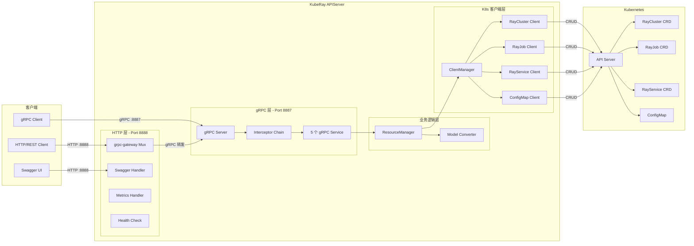
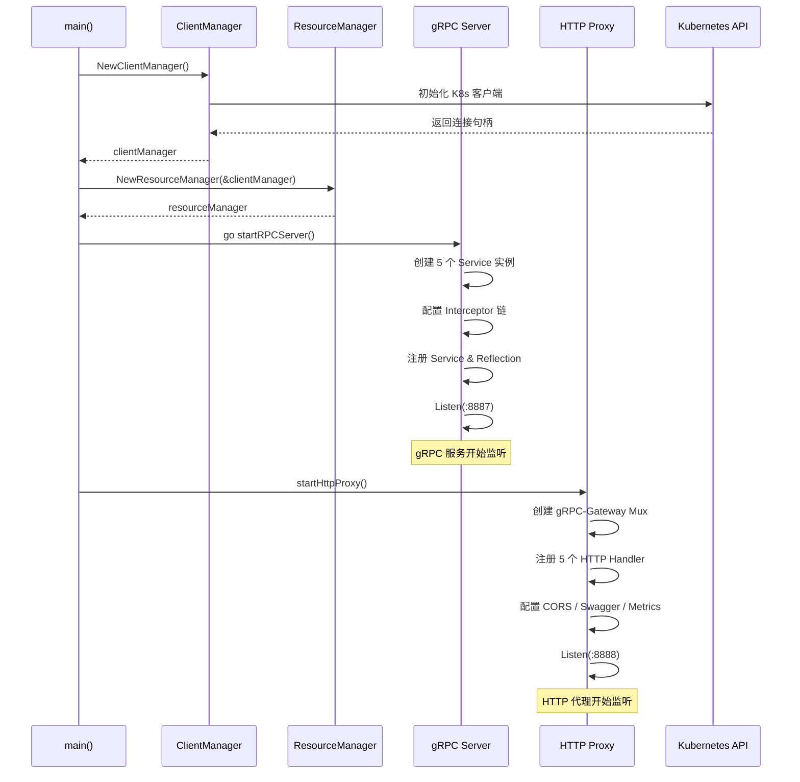
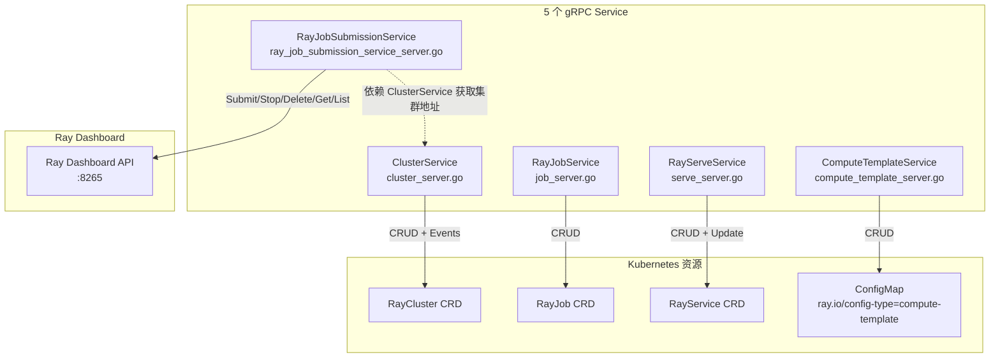
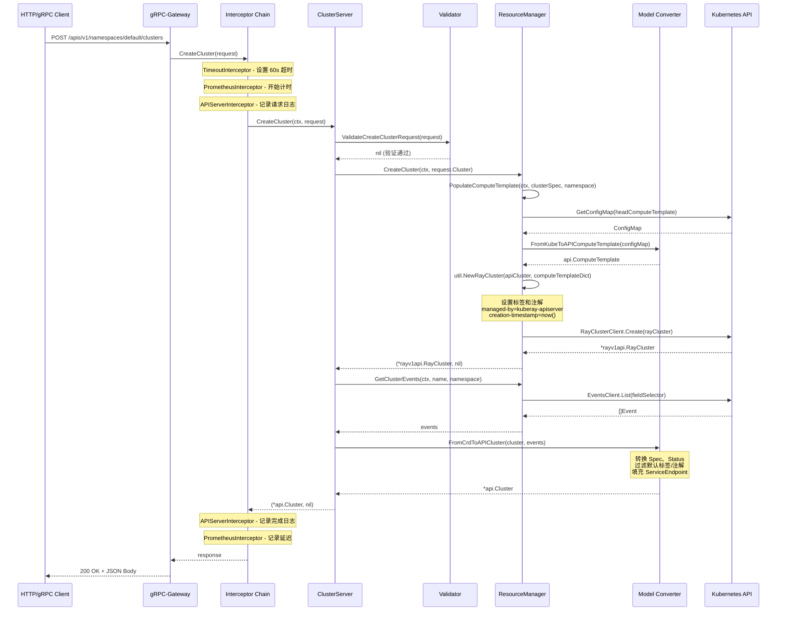

<p align="center">
  
</p>

---

## 前置知识

在阅读本文之前，建议读者对以下技术有基本的了解：

| 技术领域 | 最低要求 | 推荐掌握程度 |
|---------|---------|------------|
| gRPC / Protobuf | 理解 service 定义和消息类型 | 熟悉 gRPC-Gateway 注解 |
| Go 语言 | 掌握 interface、goroutine | 熟悉 HTTP ServeMux |
| Kubernetes API | 了解 CRD 概念 | 熟悉 client-go 编程 |
| KubeRay CRD | 了解 RayCluster、RayJob、RayService | 熟悉各 CRD 的 Spec/Status |

---

## 目录

- [1. 整体架构](#1-整体架构)
- [2. 服务端启动流程](#2-服务端启动流程)
- [3. 五个 gRPC Service 实现](#3-五个-grpc-service-实现)
- [4. ResourceManager - K8s Client 封装层](#4-resourcemanager---k8s-client-封装层)
- [5. Model 层双向转换](#5-model-层双向转换)
- [6. Proto 定义与 HTTP 路由映射](#6-proto-定义与-http-路由映射)
- [7. 错误处理与安全机制](#7-错误处理与安全机制)

---

## 1. 整体架构

KubeRay APIServer 是 KubeRay 项目的 **外围组件**，它为用户提供了一个声明式 REST/gRPC API 网关，用于管理 Ray 集群、作业和服务。APIServer 本身并不直接运行 Ray 工作负载，而是作为一个 **翻译层**，将用户的 API 请求转换为 Kubernetes CRD 操作，再由 KubeRay Operator 完成实际的资源调谐。

### 1.1 双协议服务器

APIServer 同时暴露两个端口，提供双协议访问能力：

| 端口 | 协议 | 用途 | 实现方式 |
|------|------|------|---------|
| `8887` | gRPC | 原生 gRPC 客户端调用 | `grpc.NewServer()` |
| `8888` | HTTP/REST | REST API 网关、Swagger UI、Metrics、Health Check | `grpc-gateway` 反向代理 |

HTTP 端口作为 gRPC 的 **REST 网关**，通过 `grpc-gateway` 项目自动将 HTTP 请求转发到本地 gRPC 服务。这种架构保证了两种协议的语义完全一致——所有业务逻辑只在 gRPC 层实现一次。

### 1.2 架构总览图



### 1.3 核心设计理念

APIServer 的设计遵循以下原则：

1. **Proto-first**：所有 API 定义以 Protobuf 为源，gRPC 和 REST 接口均从 `.proto` 文件自动生成。
2. **单一实现**：业务逻辑只在 gRPC Service 层实现，HTTP 端点通过 `grpc-gateway` 自动代理。
3. **资源隔离**：APIServer 创建的资源通过标签 `app.kubernetes.io/managed-by: kuberay-apiserver` 与手动创建的资源隔离。
4. **Converter 模式**：CRD 对象和 API 对象之间通过专门的 Model 层进行双向转换。

---

## 2. 服务端启动流程

> **源文件**: `apiserver/cmd/main.go`

### 2.1 启动参数

APIServer 通过命令行参数控制运行时行为：

```go
// apiserver/cmd/main.go

var (
    rpcPortFlag        = flag.String("rpcPortFlag", ":8887", "RPC Port")
    httpPortFlag       = flag.String("httpPortFlag", ":8888", "Http Proxy Port")
    collectMetricsFlag = flag.Bool("collectMetricsFlag", true, "Whether to collect Prometheus metrics")
    logFile            = flag.String("logFilePath", "", "Synchronize logs to local file")
    localSwaggerPath   = flag.String("localSwaggerPath", "", "Root directory for *.swagger.json files")
    grpcTimeout        = flag.Duration("grpc_timeout", util.GRPCServerDefaultTimeout, "gRPC server timeout")
    enableAPIServerV2  = flag.Bool("enable-api-server-v2", true, "Enable API server V2")
    corsAllowOrigin    = flag.String("cors-allow-origin", "", "CORS Access-Control-Allow-Origin")
    healthy            int32
)
```

其中 `GRPCServerDefaultTimeout` 定义在 `apiserver/pkg/util/config.go` 中，默认值为 60 秒。

### 2.2 main 函数执行流程

```go
// apiserver/cmd/main.go

func main() {
    flag.Parse()
    // 1. 初始化 ClientManager（K8s 客户端集合）
    clientManager := manager.NewClientManager()
    // 2. 初始化 ResourceManager（业务操作封装）
    resourceManager := manager.NewResourceManager(&clientManager)
    // 3. 设置健康状态
    atomic.StoreInt32(&healthy, 1)
    // 4. 启动 gRPC 服务器（异步）
    go startRPCServer(resourceManager, *grpcTimeout)
    // 5. 启动 HTTP 代理（阻塞）
    startHttpProxy()
    // 6. 信号处理
    // ...
}
```

### 2.3 gRPC 服务器初始化

`startRPCServer` 函数完成以下操作：

**第一步 - 创建 5 个 Service 实例**：

```go
// apiserver/cmd/main.go - startRPCServer()

clusterServer := server.NewClusterServer(resourceManager, &server.ClusterServerOptions{CollectMetrics: *collectMetricsFlag})
templateServer := server.NewComputeTemplateServer(resourceManager, &server.ComputeTemplateServerOptions{CollectMetrics: *collectMetricsFlag})
jobServer := server.NewRayJobServer(resourceManager, &server.JobServerOptions{CollectMetrics: *collectMetricsFlag})
jobSubmissionServer := server.NewRayJobSubmissionServiceServer(clusterServer, &server.RayJobSubmissionServiceServerOptions{CollectMetrics: *collectMetricsFlag})
serveServer := server.NewRayServiceServer(resourceManager, &server.ServiceServerOptions{CollectMetrics: *collectMetricsFlag})
```

注意 `JobSubmissionServer` 的依赖关系较为特殊——它接收 `clusterServer` 而不是 `resourceManager`，因为它需要先通过 `ClusterServer.GetCluster` 获取集群信息，再直接与 Ray Dashboard 通信。

**第二步 - 配置 gRPC Interceptor 链**：

```go
// apiserver/cmd/main.go - startRPCServer()

s := grpc.NewServer(
    grpc.StreamInterceptor(grpc_prometheus.StreamServerInterceptor),
    grpc.UnaryInterceptor(grpc_middleware.ChainUnaryServer(
        interceptor.TimeoutInterceptor(grpcTimeout),   // 超时控制
        grpc_prometheus.UnaryServerInterceptor,         // Prometheus 指标
        interceptor.APIServerInterceptor,               // 日志记录
    )),
    grpc.MaxRecvMsgSize(math.MaxInt32),
)
```

Interceptor 链按注册顺序执行，形成洋葱模型：请求依次经过 Timeout -> Prometheus -> APIServer 拦截器，再到达实际的 Service Handler。

**第三步 - 注册 Service 并启动**：

```go
// apiserver/cmd/main.go - startRPCServer()

api.RegisterClusterServiceServer(s, clusterServer)
api.RegisterComputeTemplateServiceServer(s, templateServer)
api.RegisterRayJobServiceServer(s, jobServer)
api.RegisterRayJobSubmissionServiceServer(s, jobSubmissionServer)
api.RegisterRayServeServiceServer(s, serveServer)

reflection.Register(s)         // gRPC 反射支持
grpc_prometheus.Register(s)    // Prometheus 指标初始化
grpc_prometheus.EnableHandlingTimeHistogram() // 延迟直方图
```

### 2.4 HTTP 代理初始化

`startHttpProxy` 函数创建 HTTP 层，将 REST 请求路由到 gRPC 服务。核心步骤包括：创建 `runtime.ServeMux`（配置 camelCase 字段名、枚举数值序列化、忽略未知字段），然后通过 `registerHttpHandlerFromEndpoint` 为 5 个 Service 分别注册 HTTP -> gRPC 端点映射。HTTP 层还注册了以下辅助端点：

| 路径 | 功能 |
|------|------|
| `/` | gRPC-Gateway REST API 入口 |
| `/metrics` | Prometheus 指标端点 |
| `/swagger/` | Swagger JSON 文件服务 |
| `/swagger-ui/` | Swagger UI 交互界面 |
| `/healthz` | 健康检查端点 |

### 2.5 启动时序图



---

## 3. 五个 gRPC Service 实现

> **源文件目录**: `apiserver/pkg/server/`

APIServer 提供 5 个 gRPC Service，分别管理不同类型的 Ray 资源。每个 Service 遵循相同的架构模式：请求验证 -> 调用 ResourceManager -> Model 转换 -> 返回响应。

### 3.1 Service 与资源映射关系



### 3.2 ClusterService

> **源文件**: `apiserver/pkg/server/cluster_server.go`

ClusterService 负责 RayCluster 资源的生命周期管理。

| RPC 方法 | HTTP 路由 | 功能 |
|---------|----------|------|
| `CreateCluster` | `POST /apis/v1/namespaces/{namespace}/clusters` | 创建集群 |
| `GetCluster` | `GET /apis/v1/namespaces/{namespace}/clusters/{name}` | 获取集群详情 |
| `ListCluster` | `GET /apis/v1/namespaces/{namespace}/clusters` | 按命名空间列出集群 |
| `ListAllClusters` | `GET /apis/v1/clusters` | 列出所有命名空间的集群 |
| `DeleteCluster` | `DELETE /apis/v1/namespaces/{namespace}/clusters/{name}` | 删除集群 |

`CreateCluster` 的核心实现逻辑：

```go
// apiserver/pkg/server/cluster_server.go

func (s *ClusterServer) CreateCluster(ctx context.Context, request *api.CreateClusterRequest) (*api.Cluster, error) {
    // 1. 请求验证
    if err := ValidateCreateClusterRequest(request); err != nil {
        return nil, util.Wrap(err, "Validate create cluster request failed.")
    }
    // 2. 命名空间对齐
    request.Cluster.Namespace = request.Namespace
    // 3. 调用 ResourceManager 创建
    cluster, err := s.resourceManager.CreateCluster(ctx, request.Cluster)
    if err != nil {
        return nil, util.Wrap(err, "Create Cluster failed.")
    }
    // 4. 获取关联事件
    events, err := s.resourceManager.GetClusterEvents(ctx, cluster.Name, cluster.Namespace)
    // 5. CRD -> API 类型转换
    return model.FromCrdToAPICluster(cluster, events), nil
}
```

请求验证逻辑确保以下字段合法：
- `Namespace` 不为空且与 Cluster 定义中的一致
- `Cluster.Name` 不为空
- `Cluster.User` 不为空
- `ClusterSpec` 通过 `ValidateClusterSpec` 校验（包括 HeadGroupSpec、WorkerGroupSpec 等）

### 3.3 RayJobService

> **源文件**: `apiserver/pkg/server/job_server.go`

RayJobService 管理 RayJob CRD 资源，支持通过 K8s CRD 创建和管理 Ray 作业。

| RPC 方法 | HTTP 路由 | 功能 |
|---------|----------|------|
| `CreateRayJob` | `POST /apis/v1/namespaces/{namespace}/jobs` | 创建 Ray 作业 |
| `GetRayJob` | `GET /apis/v1/namespaces/{namespace}/jobs/{name}` | 获取作业详情 |
| `ListRayJobs` | `GET /apis/v1/namespaces/{namespace}/jobs` | 按命名空间列出作业 |
| `ListAllRayJobs` | `GET /apis/v1/jobs` | 列出所有命名空间的作业 |
| `DeleteRayJob` | `DELETE /apis/v1/namespaces/{namespace}/jobs/{name}` | 删除作业 |

`CreateRayJob` 支持两种工作模式：
1. **内联集群**：提供 `ClusterSpec`，由 RayJob Controller 自动创建临时集群。
2. **集群选择器**：提供 `ClusterSelector`，复用已有集群。

```go
// apiserver/pkg/server/job_server.go

func ValidateCreateJobRequest(request *api.CreateRayJobRequest) error {
    // ...
    // 如果提供了 ClusterSelector，则跳过 ClusterSpec 验证
    if len(request.Job.ClusterSelector) != 0 {
        return nil
    }
    return ValidateClusterSpec(request.Job.ClusterSpec)
}
```

### 3.4 RayServeService

> **源文件**: `apiserver/pkg/server/serve_server.go`

RayServeService 管理 RayService CRD，是五个 Service 中唯一支持 `Update` 操作的服务。

| RPC 方法 | HTTP 路由 | 功能 |
|---------|----------|------|
| `CreateRayService` | `POST /apis/v1/namespaces/{namespace}/services` | 创建 Ray Service |
| `UpdateRayService` | `PUT /apis/v1/namespaces/{namespace}/services/{name}` | 更新 Ray Service |
| `GetRayService` | `GET /apis/v1/namespaces/{namespace}/services/{name}` | 获取 Service 详情 |
| `ListRayServices` | `GET /apis/v1/namespaces/{namespace}/services` | 按命名空间列出 Service |
| `ListAllRayServices` | `GET /apis/v1/services` | 列出所有 Service |
| `DeleteRayService` | `DELETE /apis/v1/namespaces/{namespace}/services/{name}` | 删除 Service |

与其他 Service 不同，`RayServeService` 在返回结果时会附带 Service 关联的事件信息（包括底层 RayCluster 的事件）：

```go
// apiserver/pkg/server/serve_server.go

func (s *RayServiceServer) GetRayService(ctx context.Context, request *api.GetRayServiceRequest) (*api.RayService, error) {
    // ...
    service, err := s.resourceManager.GetService(ctx, request.Name, request.Namespace)
    // 获取 Service 事件（含关联 Cluster 事件）
    events, err := s.resourceManager.GetServiceEvents(ctx, *service)
    return model.FromCrdToAPIService(service, events), nil
}
```

### 3.5 ComputeTemplateService

> **源文件**: `apiserver/pkg/server/compute_template_server.go`

ComputeTemplateService 管理基于 ConfigMap 的计算资源模板，这些模板定义了 CPU、内存、GPU 等资源配额。

| RPC 方法 | HTTP 路由 | 功能 |
|---------|----------|------|
| `CreateComputeTemplate` | `POST /apis/v1/namespaces/{namespace}/compute_templates` | 创建模板 |
| `GetComputeTemplate` | `GET /apis/v1/namespaces/{namespace}/compute_templates/{name}` | 获取模板 |
| `ListComputeTemplates` | `GET /apis/v1/namespaces/{namespace}/compute_templates` | 按命名空间列出 |
| `ListAllComputeTemplates` | `GET /apis/v1/compute_templates` | 列出所有模板 |
| `DeleteComputeTemplate` | `DELETE /apis/v1/namespaces/{namespace}/compute_templates/{name}` | 删除模板 |

ComputeTemplate 底层存储为 ConfigMap，通过标签 `ray.io/config-type=compute-template` 进行筛选。验证逻辑要求 `cpu` 和 `memory` 字段不能为零。

### 3.6 RayJobSubmissionService

> **源文件**: `apiserver/pkg/server/ray_job_submission_service_server.go`

RayJobSubmissionService 是一个特殊的 Service，它 **不通过 K8s CRD**，而是直接与 Ray 集群的 Dashboard API 通信来提交和管理作业。

| RPC 方法 | HTTP 路由 | 功能 |
|---------|----------|------|
| `SubmitRayJob` | `POST /apis/v1/namespaces/{namespace}/jobsubmissions/{clustername}` | 提交作业 |
| `GetJobDetails` | `GET /apis/v1/namespaces/{namespace}/jobsubmissions/{clustername}/{submissionid}` | 获取作业详情 |
| `GetJobLog` | `GET /apis/v1/namespaces/{namespace}/jobsubmissions/{clustername}/log/{submissionid}` | 获取作业日志 |
| `ListJobDetails` | `GET /apis/v1/namespaces/{namespace}/jobsubmissions/{clustername}` | 列出集群所有作业 |
| `StopRayJob` | `POST /apis/v1/namespaces/{namespace}/jobsubmissions/{clustername}/{submissionid}` | 停止作业 |
| `DeleteRayJob` | `DELETE /apis/v1/namespaces/{namespace}/jobsubmissions/{clustername}/{submissionid}` | 删除作业 |

其架构与其他 Service 有本质区别：

```go
// apiserver/pkg/server/ray_job_submission_service_server.go

type RayJobSubmissionServiceServer struct {
    api.UnimplementedRayJobSubmissionServiceServer
    options             *RayJobSubmissionServiceServerOptions
    clusterServer       *ClusterServer          // 依赖 ClusterServer
    dashboardClientFunc func(...) (dashboardclient.RayDashboardClientInterface, error)
    log                 logr.Logger
}
```

请求处理流程：
1. 通过 `ClusterServer.GetCluster` 获取目标集群信息
2. 验证集群状态为 `ready`
3. 构造 Ray Dashboard URL（`{name}-head-svc.{namespace}.svc.cluster.local:8265`）
4. 通过 `dashboardClientFunc` 创建 Dashboard 客户端
5. 调用 Dashboard API 完成实际操作

---

## 4. ResourceManager - K8s Client 封装层

> **源文件**: `apiserver/pkg/manager/resource_manager.go`

### 4.1 结构设计

`ResourceManager` 是 APIServer 的核心业务逻辑层，封装了所有 Kubernetes 资源操作。它通过 `ClientManagerInterface` 与底层 K8s API 交互。

```go
// apiserver/pkg/manager/resource_manager.go

type ResourceManager struct {
    clientManager ClientManagerInterface
}
```

`ClientManagerInterface` 定义在 `apiserver/pkg/manager/client_manager.go` 中：

```go
// apiserver/pkg/manager/client_manager.go

type ClientManagerInterface interface {
    ClusterClient() client.ClusterClientInterface     // RayCluster 客户端
    JobClient() client.JobClientInterface             // RayJob 客户端
    ServiceClient() client.ServiceClientInterface     // RayService 客户端
    KubernetesClient() client.KubernetesClientInterface // K8s 核心客户端
    Time() util.TimeInterface                         // 时间接口（可 mock）
}
```

`ClientManager` 在初始化时设置默认的客户端配置：

```go
// apiserver/pkg/manager/client_manager.go

defaultKubernetesClientConfig := util.ClientOptions{
    QPS:   5,
    Burst: 10,
}
```

### 4.2 资源操作方法概览

| 资源类型 | 支持的操作 | 说明 |
|---------|----------|------|
| RayCluster | Create, Get, List, Delete, GetEvents | List 支持分页（`continue` + `limit`） |
| RayJob | Create, Get, List, Delete | 创建时可选内联 ClusterSpec |
| RayService | Create, Get, List, Update, Delete, GetEvents | 唯一支持 Update 的资源 |
| ComputeTemplate | Create, Get, List, ListAll, Delete | 底层为 ConfigMap，按标签筛选 |

### 4.3 标签过滤机制

APIServer 创建的所有资源都会打上管理标签，并且在 List/Get 操作时严格验证此标签：

```go
// apiserver/pkg/manager/resource_manager.go

// List 操作使用标签选择器
labelSelector := metav1.LabelSelector{
    MatchLabels: map[string]string{
        util.KubernetesManagedByLabelKey: util.ComponentName,  // "app.kubernetes.io/managed-by": "kuberay-apiserver"
    },
}

// Get 操作验证标签
func getClusterByName(ctx context.Context, client rayv1.RayClusterInterface, name string) (*rayv1api.RayCluster, error) {
    cluster, err := client.Get(ctx, name, metav1.GetOptions{})
    // ...
    if managedBy, ok := cluster.Labels[util.KubernetesManagedByLabelKey]; !ok || managedBy != util.ComponentName {
        return nil, fmt.Errorf("RayCluster with name %s not managed by %s", name, util.ComponentName)
    }
    return cluster, nil
}
```

这意味着 **通过 kubectl 或其他方式直接创建的 Ray 资源不会被 APIServer 管理**，这是一种安全的资源隔离策略。

### 4.4 ComputeTemplate 填充

创建 Cluster、Job 或 Service 时，APIServer 会根据 `ClusterSpec` 中引用的 ComputeTemplate 名称，从 K8s 中查询对应的 ConfigMap 并构建模板字典：

```go
// apiserver/pkg/manager/resource_manager.go

func (r *ResourceManager) PopulateComputeTemplate(ctx context.Context, clusterSpec *api.ClusterSpec, nameSpace string) (map[string]*api.ComputeTemplate, error) {
    dict := map[string]*api.ComputeTemplate{}
    // 填充 Head 节点的 ComputeTemplate
    name := clusterSpec.HeadGroupSpec.ComputeTemplate
    configMap, err := r.GetComputeTemplate(ctx, name, nameSpace)
    computeTemplate := model.FromKubeToAPIComputeTemplate(configMap)
    dict[name] = computeTemplate
    // 填充每个 Worker 组的 ComputeTemplate（去重）
    for _, spec := range clusterSpec.WorkerGroupSpec {
        name := spec.ComputeTemplate
        if _, exist := dict[name]; !exist {
            // ... 查询并填充
        }
    }
    return dict, nil
}
```

### 4.5 事件查询

ResourceManager 提供了两种事件查询方式：

- **`GetClusterEvents`**：按 RayCluster 名称查询关联事件（`FieldSelector: involvedObject.name=<name>`）。
- **`GetServiceEvents`**：查询 RayService 自身事件以及其关联的活跃 RayCluster 的事件。

```go
// apiserver/pkg/manager/resource_manager.go

func (r *ResourceManager) GetServiceEvents(ctx context.Context, service rayv1api.RayService) ([]corev1.Event, error) {
    // 1. 获取 Service 自身的事件
    events, err := getRayServiceEventsByName(ctx, service.Name, eventClient)
    // 2. 如果存在活跃集群，追加集群事件
    if len(service.Status.ActiveServiceStatus.RayClusterName) > 0 {
        clusterEvents, err := r.GetClusterEvents(ctx, service.Status.ActiveServiceStatus.RayClusterName, service.Namespace)
        events = append(events, clusterEvents...)
    }
    return events, nil
}
```

---

## 5. Model 层双向转换

> **源文件**: `apiserver/pkg/model/converter.go`, `apiserver/pkg/model/volumes.go`

Model 层负责 Kubernetes CRD 对象与 gRPC API 类型之间的双向转换。这是 APIServer 中代码量最大的模块之一。

### 5.1 转换方向

```
K8s CRD (rayv1api.RayCluster)  ←→  gRPC API (api.Cluster)
K8s CRD (rayv1api.RayJob)      ←→  gRPC API (api.RayJob)
K8s CRD (rayv1api.RayService)  ←→  gRPC API (api.RayService)
K8s CRD (corev1.ConfigMap)     ←→  gRPC API (api.ComputeTemplate)
```

### 5.2 CRD -> API 转换（FromCrdToAPI*）

以 `FromCrdToAPICluster` 为例：

```go
// apiserver/pkg/model/converter.go

func FromCrdToAPICluster(cluster *rayv1api.RayCluster, events []corev1.Event) *api.Cluster {
    pbCluster := &api.Cluster{
        Name:         cluster.Name,
        Namespace:    cluster.Namespace,
        Version:      cluster.Labels[util.RayClusterVersionLabelKey],
        User:         cluster.Labels[util.RayClusterUserLabelKey],
        Environment:  api.Cluster_Environment(api.Cluster_Environment_value[cluster.Labels[util.RayClusterEnvironmentLabelKey]]),
        CreatedAt:    &timestamppb.Timestamp{Seconds: cluster.CreationTimestamp.Unix()},
        ClusterState: string(cluster.Status.State),
    }
    // 转换 ClusterSpec
    pbCluster.ClusterSpec = PopulateRayClusterSpec(cluster.Spec)
    // 转换事件
    for _, event := range events {
        // ...
    }
    // 复制 Service Endpoint
    pbCluster.ServiceEndpoint = map[string]string{}
    maps.Copy(pbCluster.ServiceEndpoint, cluster.Status.Endpoints)
    return pbCluster
}
```

### 5.3 节点标签/注解过滤

在转换 HeadGroupSpec 和 WorkerGroupSpec 时，Model 层通过 `getNodeDefaultAnnotations()` 和 `getNodeDefaultLabels()` 函数定义需要过滤的 Ray 内部标签和注解（如 `ray.io/compute-image`、`ray.io/cluster`、`app.kubernetes.io/created-by` 等），只保留用户自定义的内容。类似地，环境变量转换也会通过 `getHeadNodeEnv()` 和 `getWorkNodeEnv()` 过滤 Ray 运行时注入的内部变量（如 `RAY_ADDRESS`、`RAY_PORT`、`MY_POD_IP` 等）。

### 5.4 ComputeTemplate 转换

`FromKubeToAPIComputeTemplate` 从 ConfigMap 的 `Data` 字段中解析 `cpu`、`memory`、`gpu`、`memory_unit`、`gpu_accelerator` 等字段并映射到 `api.ComputeTemplate` 结构体。此外还支持 JSON 格式的 `extended_resources`（扩展资源）和 `tolerations`（容忍度）字段的反序列化。

### 5.5 Volume 配置处理

Volume 转换在 `apiserver/pkg/model/volumes.go` 中实现，支持以下卷类型：

| Volume 类型 | 说明 |
|------------|------|
| `PERSISTENT_VOLUME_CLAIM` | 持久卷声明 |
| `HOST_PATH` | 主机路径卷 |
| `EPHEMERAL` | 通用临时卷 |
| `CONFIGMAP` | ConfigMap 卷 |
| `SECRET` | Secret 卷 |
| `EMPTY_DIR` | 空目录卷 |

---

## 6. Proto 定义与 HTTP 路由映射

> **源文件目录**: `proto/`

### 6.1 Proto 文件结构

```
proto/
  cluster.proto          # ClusterService + 相关消息类型
  job.proto              # RayJobService + RayJob 消息类型
  serve.proto            # RayServeService + RayService 消息类型
  job_submission.proto   # RayJobSubmissionService + 提交相关消息
  config.proto           # ComputeTemplateService 定义
  error.proto            # 通用错误类型（Status 消息）
```

### 6.2 gRPC-Gateway 注解

每个 RPC 方法通过 `google.api.http` 注解定义 HTTP 路由映射。以 `ClusterService` 为例：

```protobuf
// proto/cluster.proto

service ClusterService {
  rpc CreateCluster(CreateClusterRequest) returns (Cluster) {
    option (google.api.http) = {
      post: "/apis/v1/namespaces/{namespace}/clusters"
      body: "cluster"
    };
  }

  rpc GetCluster(GetClusterRequest) returns (Cluster) {
    option (google.api.http) = {
      get: "/apis/v1/namespaces/{namespace}/clusters/{name}"
    };
  }

  rpc DeleteCluster(DeleteClusterRequest) returns (google.protobuf.Empty) {
    option (google.api.http) = {
      delete: "/apis/v1/namespaces/{namespace}/clusters/{name}"
    };
  }
}
```

### 6.3 路由规则总结

所有 API 路由遵循 RESTful 规范，路径模式为 `/apis/v1/namespaces/{namespace}/{resource_type}[/{name}]`。跨命名空间查询去掉 `namespaces/{namespace}` 前缀（如 `GET /apis/v1/clusters`）。各 Service 的详细路由见第 3 章对应小节。

### 6.4 错误响应格式

所有 API 使用统一的错误响应格式，定义在 `proto/error.proto` 中：

```protobuf
// proto/error.proto

message Status {
  string error = 1;
  int32 code = 2;
  repeated google.protobuf.Any details = 3;
}
```

---

## 7. 错误处理与安全机制

### 7.1 UserError 统一错误类型

> **源文件**: `apiserver/pkg/util/error.go`

APIServer 定义了一个统一的 `UserError` 类型，封装了内部错误信息和面向外部客户端的错误消息：

```go
// apiserver/pkg/util/error.go

type UserError struct {
    internalError      error       // 内部调试信息
    externalMessage    string      // 面向客户端的消息
    externalStatusCode codes.Code  // gRPC 状态码
}
```

该类型实现了 `GRPCStatus()` 接口方法，确保 gRPC 框架能正确返回对应的状态码：

```go
// apiserver/pkg/util/error.go

func (e *UserError) GRPCStatus() *status.Status {
    return status.New(e.externalStatusCode, e.ErrorStringWithoutStackTrace())
}
```

### 7.2 错误类型工厂函数

| 工厂函数 | gRPC 状态码 | 使用场景 |
|---------|------------|---------|
| `NewInvalidInputError` | `codes.InvalidArgument` | 请求参数验证失败 |
| `NewInvalidInputErrorWithDetails` | `codes.InvalidArgument` | 带详情的输入错误 |
| `NewNotFoundError` | `codes.NotFound` | 资源不存在 |
| `NewResourceNotFoundError` | `codes.NotFound` | 指定类型的资源不存在 |
| `NewAlreadyExistError` | `codes.AlreadyExists` | 资源已存在（如重复创建 ComputeTemplate） |
| `NewInternalServerError` | `codes.Internal` | K8s API 调用失败等内部错误 |
| `NewBadRequestError` | `codes.Aborted` | 请求被中止 |
| `NewUnauthenticatedError` | `codes.Unauthenticated` | 未认证 |
| `NewPermissionDeniedError` | `codes.PermissionDenied` | 权限不足 |

### 7.3 错误包装传播

`Wrap` 和 `Wrapf` 函数在传播错误时保留 `UserError` 的外部状态码和消息，同时向内部错误添加上下文信息：

```go
// apiserver/pkg/util/error.go

func Wrap(err error, message string) error {
    var userErr *UserError
    if errors.As(err, &userErr) {
        // 保留 externalMessage 和 externalStatusCode
        // 只包装 internalError
        return userErr.wrap(message)
    }
    return errors.Wrapf(err, "%s", message)
}
```

这意味着即使错误经过多层传播，客户端看到的依然是最初定义的友好错误消息和状态码。

### 7.4 gRPC 拦截器

> **源文件**: `apiserver/pkg/interceptor/interceptor.go`

APIServer 注册了三个 Unary 拦截器，按顺序执行：

**1. TimeoutInterceptor - 超时控制**

```go
// apiserver/pkg/interceptor/interceptor.go

func TimeoutInterceptor(timeout time.Duration) grpc.UnaryServerInterceptor {
    return func(ctx context.Context, req any, _ *grpc.UnaryServerInfo, handler grpc.UnaryHandler) (any, error) {
        ctx, cancel := context.WithTimeout(ctx, timeout)
        defer cancel()
        return handler(ctx, req)
    }
}
```

为每个请求设置超时上下文，默认 60 秒。如果底层 K8s API 调用超时，请求会被自动取消。

**2. grpc_prometheus 指标收集**

自动收集 gRPC 请求的延迟、计数、状态码等 Prometheus 指标。通过 `EnableHandlingTimeHistogram()` 还启用了延迟直方图。

**3. APIServerInterceptor - 请求日志**

```go
// apiserver/pkg/interceptor/interceptor.go

func APIServerInterceptor(ctx context.Context, req any, info *grpc.UnaryServerInfo, handler grpc.UnaryHandler) (resp any, err error) {
    klog.Infof("%v handler starting", info.FullMethod)
    resp, err = handler(ctx, req)
    if err != nil {
        klog.Warning(err)
    }
    klog.Infof("%v handler finished", info.FullMethod)
    return
}
```

记录每个 RPC 调用的开始和结束，错误时输出警告日志。

### 7.5 CORS 配置

APIServer 支持通过 `--cors-allow-origin` 参数配置跨域资源共享。启用后，所有 HTTP 响应会自动添加 `Access-Control-Allow-Origin` 头，支持 GET、POST、PUT、PATCH、DELETE、OPTIONS 方法。未设置时 CORS 默认关闭。

### 7.6 请求验证

> **源文件**: `apiserver/pkg/server/validations.go`

所有创建和更新操作在进入 ResourceManager 之前，都会经过严格的请求验证。`ValidateClusterSpec` 检查 `ClusterSpec` 非空、`HeadGroupSpec` 存在且包含 `ComputeTemplate` 和 `RayStartParams`、`ImagePullPolicy` 值合法（仅允许 `Always` 或 `IfNotPresent`）。对于每个 Worker 组，还验证 `GroupName`、`ComputeTemplate` 非空，`MaxReplicas > 0` 且 `MinReplicas <= MaxReplicas`。

### 7.7 CreateCluster 完整请求处理时序



---

## 总结

KubeRay APIServer 通过 **gRPC + REST 双协议网关** 的架构，为 Ray 集群管理提供了灵活的 API 访问方式。其核心设计要点包括：

1. **Proto-first 开发模式**：以 `.proto` 文件为唯一 API 定义源，通过代码生成保证 gRPC 和 REST 接口的一致性。
2. **分层架构**：Service 层（验证 + 编排）-> ResourceManager 层（K8s 操作）-> ClientManager 层（客户端管理）-> Model 层（类型转换），职责清晰。
3. **资源隔离**：通过 `app.kubernetes.io/managed-by` 标签区分 APIServer 管理的资源和直接创建的资源。
4. **统一错误处理**：`UserError` 类型同时承载内部调试信息和外部友好消息，跨层传播时保持状态码一致。
5. **可观测性**：内置 Prometheus 指标采集、请求日志记录和健康检查端点。

---

## 延伸阅读

- [gRPC 官方文档](https://grpc.io/docs/) - gRPC 框架核心概念、服务定义与多语言支持
- [grpc-gateway 官方文档](https://grpc-ecosystem.github.io/grpc-gateway/) - 从 gRPC 服务自动生成 RESTful JSON API 的反向代理
- [KubeRay API Proto 定义](https://github.com/ray-project/kuberay/tree/master/proto) - KubeRay APIServer 的 Protobuf 服务与消息类型定义
- [KubeRay 是什么](../01-architecture-overview/01-what-is-kuberay.md) - KubeRay 项目整体介绍，了解 APIServer 在架构中的定位

---

## 下一篇

> **[7.2 - History Server 事件回放系统](02-history-server.md)**
>
> 下一篇将深入分析 KubeRay History Server 的四层架构、EventHandler 事件处理流水线以及 Live/Dead 集群的请求路由机制。
