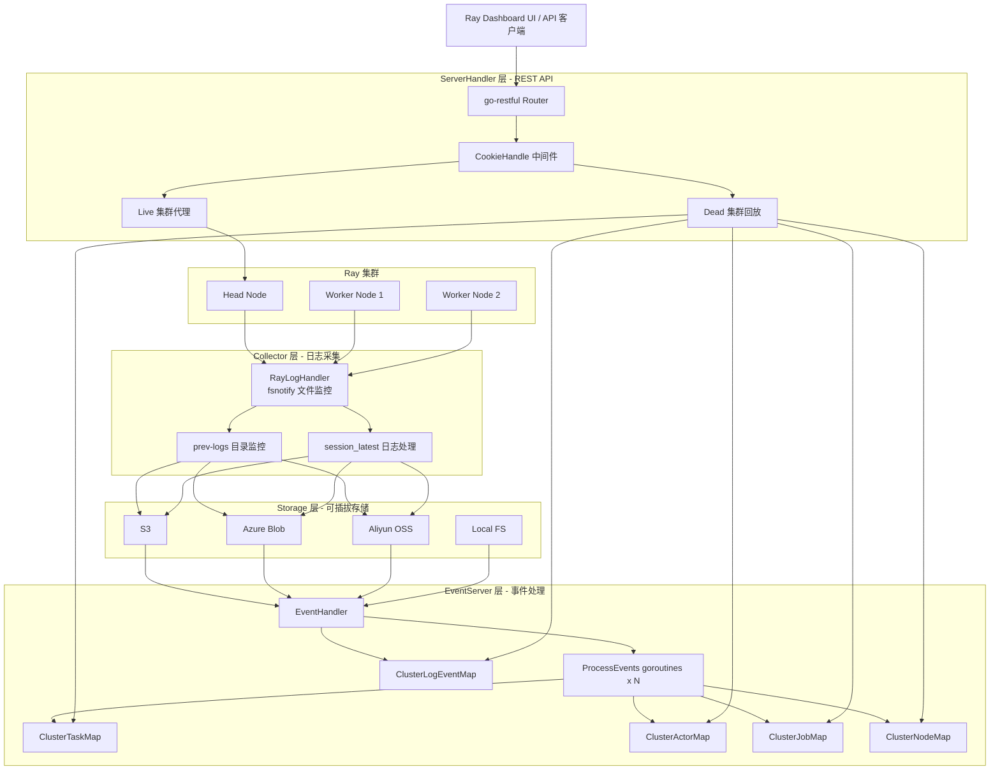
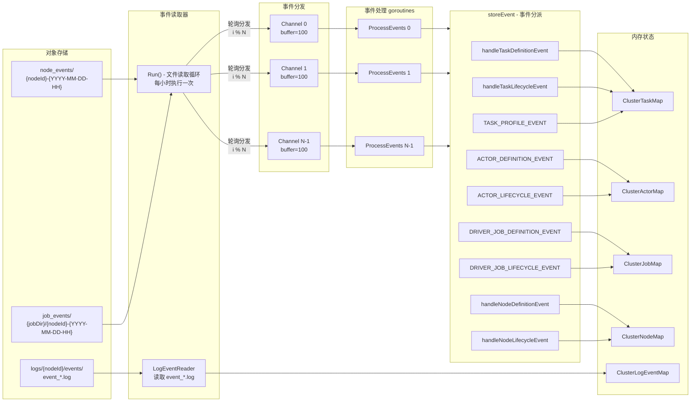
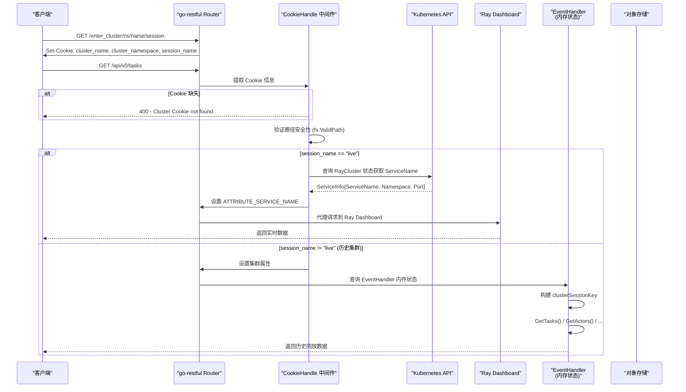

## 前置知识

| 知识领域 | 说明 | 重要程度 |
|---------|------|---------|
| Ray 集群架构 | 了解 Ray Head/Worker 节点、GCS、Dashboard 组成 | 必须 |
| Ray Export Events API | Ray 2.9+ 引入的事件导出协议 | 必须 |
| Kubernetes Operator 模式 | CRD/Controller 的基本工作原理 | 建议 |
| 对象存储基础 | S3/Azure Blob/Aliyun OSS 基本概念 | 建议 |
| Go 并发编程 | goroutine、channel、sync.Mutex 等 | 建议 |

---

## 1. 概述

History Server 是 KubeRay 生态中负责 **Ray 集群历史数据回放** 的核心组件。在生产环境中，Ray 集群可能因为任务完成、资源回收等原因被销毁，但运维人员和开发者仍然需要查看已销毁集群的任务执行情况、Actor 状态、节点拓扑和日志信息。History Server 通过收集、存储并回放 Ray 的 Export Events，实现了对已销毁集群的完整状态重建。

**核心设计目标：**

- **透明代理**：对活跃集群（Live）的请求直接代理至 Ray Dashboard，用户无感知
- **历史回放**：对已销毁集群（Dead）的请求从存储后端重建状态并返回
- **API 兼容**：响应格式完全对齐 Ray Dashboard API，前端无需修改
- **可插拔存储**：支持 S3、Azure Blob、Aliyun OSS 及本地文件系统

---

## 2. 整体架构

History Server 采用四层架构设计，各层职责清晰、解耦良好：



**各层职责总结：**

| 层 | 包路径 | 核心职责 |
|----|--------|---------|
| Collector | `historyserver/pkg/collector/` | 从 Ray 节点收集事件日志，上传到对象存储 |
| Storage | `historyserver/pkg/storage/` | 提供统一的存储读写接口，支持多种后端 |
| EventServer | `historyserver/pkg/eventserver/` | 解析事件日志，维护内存中的集群状态 |
| ServerHandler | `historyserver/pkg/historyserver/` | 提供 REST API，路由 Live/Dead 集群请求 |

---

## 3. EventHandler 核心数据结构

`EventHandler` 是 History Server 事件处理引擎的核心，定义在 `historyserver/pkg/eventserver/eventserver.go` 中。它负责从存储后端读取事件日志，通过多 goroutine 并发处理事件，最终将状态保存在线程安全的 Map 结构中。

### 3.1 EventHandler 结构体

```go
// 文件: historyserver/pkg/eventserver/eventserver.go

type EventHandler struct {
    reader storage.StorageReader

    ClusterTaskMap     *types.ClusterTaskMap
    ClusterActorMap    *types.ClusterActorMap
    ClusterJobMap      *types.ClusterJobMap
    ClusterNodeMap     *types.ClusterNodeMap
    ClusterLogEventMap *types.ClusterLogEventMap // 用于 /events API
}
```

每个 `Cluster*Map` 都是一个两级嵌套的线程安全 Map：

- **第一级**: `clusterSessionKey` (格式: `{clusterName}_{namespace}_{sessionName}`) 到实体 Map 的映射
- **第二级**: 实体 ID (如 `taskId`、`actorId`) 到实体对象的映射

### 3.2 集群状态 Map 详解

| Map 类型 | 定义文件 | Key 格式 | Value 类型 | 锁机制 |
|----------|---------|---------|-----------|--------|
| `ClusterTaskMap` | `types/task.go` | `taskId` -> `[]Task` (按 attempt 排序) | `Task` | `sync.RWMutex` + 内部 `sync.Mutex` |
| `ClusterActorMap` | `types/actor.go` | `actorId` -> `Actor` | `Actor` | `sync.RWMutex` + 内部 `sync.Mutex` |
| `ClusterJobMap` | `types/job.go` | `jobId` -> `Job` | `Job` | `sync.RWMutex` + 内部 `sync.Mutex` |
| `ClusterNodeMap` | `types/node.go` | `nodeId` -> `Node` | `Node` | `sync.RWMutex` + 内部 `sync.Mutex` |
| `ClusterLogEventMap` | `types/log_event.go` | `jobId` -> `{eventId -> LogEvent}` | `LogEvent` | `sync.RWMutex` + 内部 `sync.RWMutex` |

**关键设计 - 双层锁机制：**

```
ClusterTaskMap (RWMutex)        // 保护集群级别的 Map 操作
  └── TaskMap (Mutex)           // 保护单个集群内的 Task 操作
        └── map[taskId][]Task   // 实际数据 (按 attempt number 排序)
```

外层使用 `RWMutex` 允许多个读操作并发进行，内层 `Mutex` 保护具体实体的写操作。所有对外暴露的查询方法（如 `GetTasks()`、`GetActors()`）均返回 **深拷贝**（DeepCopy），确保调用方拿到的数据在锁释放后依然安全。

### 3.3 Task 的多 Attempt 支持

Task 是所有实体中结构最复杂的，因为单个 Task 可能有多次重试尝试（attempt）。`TaskMap` 使用 `map[string][]Task` 结构，其中 slice 按 `TaskAttempt` 升序排列，支持二分查找：

```go
// 文件: historyserver/pkg/eventserver/types/task.go

func (t *TaskMap) CreateOrMergeAttempt(taskId string, taskAttempt int, mergeFn func(*Task)) {
    t.Lock()
    defer t.Unlock()

    tasks, exists := t.TaskMap[taskId]
    if !exists {
        // Case 1: Task 不存在，创建新的
        newTask := Task{TaskID: taskId, TaskAttempt: taskAttempt}
        mergeFn(&newTask)
        t.TaskMap[taskId] = []Task{newTask}
        return
    }

    // Case 2: 二分查找已有 attempt
    idx := sort.Search(len(tasks), func(i int) bool {
        return tasks[i].TaskAttempt >= taskAttempt
    })

    if idx < len(tasks) && tasks[idx].TaskAttempt == taskAttempt {
        // 已存在，合并
        mergeFn(&tasks[idx])
        return
    }

    // Case 3: 新 attempt，插入到正确位置
    newTask := Task{TaskID: taskId, TaskAttempt: taskAttempt}
    mergeFn(&newTask)
    tasks = append(tasks, Task{})
    copy(tasks[idx+1:], tasks[idx:])
    tasks[idx] = newTask
    t.TaskMap[taskId] = tasks
}
```

---

## 4. Ray 事件类型体系

History Server 处理的事件类型来自 Ray 的 Export Events API。所有事件类型定义在 `historyserver/pkg/eventserver/types/event.go` 中：

```go
// 文件: historyserver/pkg/eventserver/types/event.go

const (
    TASK_DEFINITION_EVENT       EventType = "TASK_DEFINITION_EVENT"
    TASK_LIFECYCLE_EVENT        EventType = "TASK_LIFECYCLE_EVENT"
    ACTOR_TASK_DEFINITION_EVENT EventType = "ACTOR_TASK_DEFINITION_EVENT"
    TASK_PROFILE_EVENT          EventType = "TASK_PROFILE_EVENT"
    DRIVER_JOB_DEFINITION_EVENT EventType = "DRIVER_JOB_DEFINITION_EVENT"
    DRIVER_JOB_LIFECYCLE_EVENT  EventType = "DRIVER_JOB_LIFECYCLE_EVENT"
    NODE_DEFINITION_EVENT       EventType = "NODE_DEFINITION_EVENT"
    NODE_LIFECYCLE_EVENT        EventType = "NODE_LIFECYCLE_EVENT"
    ACTOR_DEFINITION_EVENT      EventType = "ACTOR_DEFINITION_EVENT"
    ACTOR_LIFECYCLE_EVENT       EventType = "ACTOR_LIFECYCLE_EVENT"
)
```

**事件类型分为两大类：**

| 类别 | 事件类型 | 说明 |
|------|---------|------|
| **Definition（定义事件）** | `TASK_DEFINITION_EVENT` | Task 创建时发出，包含函数描述、资源需求等静态信息 |
| | `ACTOR_TASK_DEFINITION_EVENT` | Actor Task 创建时发出 |
| | `ACTOR_DEFINITION_EVENT` | Actor 创建时发出，包含 Actor 类名、资源需求等 |
| | `DRIVER_JOB_DEFINITION_EVENT` | Driver Job 创建时发出 |
| | `NODE_DEFINITION_EVENT` | 节点注册时发出，包含 IP、标签等 |
| **Lifecycle（生命周期事件）** | `TASK_LIFECYCLE_EVENT` | Task 状态变更时发出 (PENDING -> RUNNING -> FINISHED) |
| | `ACTOR_LIFECYCLE_EVENT` | Actor 状态变更时发出 (PENDING_CREATION -> ALIVE -> DEAD) |
| | `DRIVER_JOB_LIFECYCLE_EVENT` | Job 状态变更时发出 (CREATED -> FINISHED) |
| | `NODE_LIFECYCLE_EVENT` | 节点状态变更时发出 (ALIVE -> DEAD) |
| **Profile（性能分析事件）** | `TASK_PROFILE_EVENT` | Task 性能分析数据，用于 Chrome Tracing 时间线 |

**关键设计 - Definition 与 Lifecycle 的合并：**

由于 Definition 和 Lifecycle 事件可能以任意顺序到达（Lifecycle 可能先于 Definition），EventHandler 采用 `CreateOrMerge` 模式：先创建/查找实体，然后通过 merge 函数合并新数据，同时保留已有的生命周期字段。

---

## 5. 事件处理流水线

### 5.1 流水线总览



### 5.2 Run() 方法 - 启动引擎

`Run()` 是 EventHandler 的入口方法，负责启动整个事件处理流水线：

```go
// 文件: historyserver/pkg/eventserver/eventserver.go

func (h *EventHandler) Run(stop chan struct{}, numOfEventProcessors int) error {
    // 1. 默认启动 5 个事件处理 goroutine
    if numOfEventProcessors == 0 {
        numOfEventProcessors = 5
    }
    eventProcessorChannels := make([]chan map[string]any, numOfEventProcessors)
    // 每个 channel buffer 容量为 100
    for i := range numOfEventProcessors {
        eventProcessorChannels[i] = make(chan map[string]any, 100)
    }

    // 2. 启动 N 个 ProcessEvents goroutine
    for i, currEventChannel := range eventProcessorChannels {
        go func() {
            var processor EventProcessor[map[string]any] = h
            processor.ProcessEvents(ctx, currEventChannel)
        }()
    }

    // 3. 启动文件读取循环
    go func() {
        // 创建 LogEventReader 读取 event_*.log 文件
        logEventReader := NewLogEventReader(h.reader)

        processAllEvents := func() {
            clusterList := h.reader.List()
            for _, clusterInfo := range clusterList {
                // 读取 Log Events (用于 /events API)
                logEventReader.ReadLogEvents(clusterInfo, clusterSessionKey, h.ClusterLogEventMap)

                // 读取 Export Events (用于 task/actor/job/node API)
                eventFileList := append(
                    h.getAllJobEventFiles(clusterInfo),
                    h.getAllNodeEventFiles(clusterInfo)...,
                )
                for _, eventFile := range eventFileList {
                    // 轮询分发事件到各 channel
                    for i, curr := range eventList {
                        curr["clusterName"] = clusterSessionKey
                        eventProcessorChannels[i%numOfEventProcessors] <- curr
                    }
                }
            }
        }

        // 启动时立即处理一次
        processAllEvents()

        // 此后每小时执行一次
        ticker := time.NewTicker(1 * time.Hour)
        // ...
    }()
}
```

### 5.3 ProcessEvents() - 通道消费

每个 `ProcessEvents` goroutine 从自己的 channel 中持续消费事件：

```go
// 文件: historyserver/pkg/eventserver/eventserver.go

func (h *EventHandler) ProcessEvents(ctx context.Context, ch <-chan map[string]any) error {
    for {
        select {
        case <-ctx.Done():
            return ctx.Err()
        case currEventData, ok := <-ch:
            if !ok {
                return nil
            }
            if err := h.storeEvent(currEventData); err != nil {
                logrus.Errorf("Failed to store event: %v", err)
                continue // 单个事件失败不影响后续处理
            }
        }
    }
}
```

### 5.4 storeEvent() - 事件分派

`storeEvent()` 是事件路由的核心，根据 `eventType` 字段将事件分派到对应的处理函数：

```go
// 文件: historyserver/pkg/eventserver/eventserver.go

func (h *EventHandler) storeEvent(eventMap map[string]any) error {
    eventType := types.EventType(eventMap["eventType"].(string))
    clusterSessionKey := eventMap["clusterName"].(string)

    switch eventType {
    case types.TASK_DEFINITION_EVENT:
        return h.handleTaskDefinitionEvent(eventMap, clusterSessionKey, false)
    case types.TASK_LIFECYCLE_EVENT:
        return h.handleTaskLifecycleEvent(eventMap, clusterSessionKey)
    case types.ACTOR_DEFINITION_EVENT:
        // ... Actor 定义事件处理
    case types.ACTOR_LIFECYCLE_EVENT:
        // ... Actor 生命周期事件处理
    case types.ACTOR_TASK_DEFINITION_EVENT:
        return h.handleTaskDefinitionEvent(eventMap, clusterSessionKey, true)
    case types.DRIVER_JOB_DEFINITION_EVENT:
        // ... Job 定义事件处理
    case types.DRIVER_JOB_LIFECYCLE_EVENT:
        // ... Job 生命周期事件处理
    case types.NODE_DEFINITION_EVENT:
        return h.handleNodeDefinitionEvent(eventMap, clusterSessionKey)
    case types.NODE_LIFECYCLE_EVENT:
        return h.handleNodeLifecycleEvent(eventMap, clusterSessionKey)
    case types.TASK_PROFILE_EVENT:
        // ... Task Profile 事件处理
    }
    return nil
}
```

### 5.5 去重与合并策略

所有事件处理都遵循统一的 **去重 + 合并** 策略：

**去重（Deduplication）：** 使用 `(State, Timestamp)` 组合作为唯一键，避免重复的状态转换记录：

```go
type eventKey struct {
    State     string
    Timestamp int64
}
existingKeys := make(map[eventKey]bool)
for _, e := range task.StateTransitions {
    existingKeys[eventKey{string(e.State), e.Timestamp.UnixNano()}] = true
}
```

**合并（Merge）：** Definition 和 Lifecycle 事件可能以任意顺序到达。合并时保留已有的生命周期字段：

```go
// 保存已有的 Lifecycle 字段
existingStateTransitions := task.StateTransitions
existingNodeID := task.NodeID
// ...

// 用 Definition 数据覆盖
*task = currTask

// 如果之前有 Lifecycle 数据，恢复它们
if len(existingStateTransitions) > 0 {
    task.StateTransitions = existingStateTransitions
    task.NodeID = existingNodeID
    // ...
}
```

### 5.6 ID 格式转换

Ray Export Events 中的 ID（TaskID、ActorID、JobID、NodeID 等）使用 **Base64** 编码，而 Ray Dashboard API 使用 **Hex** 编码。EventHandler 在处理每个事件时统一进行转换：

```go
// 文件: historyserver/pkg/eventserver/eventserver.go

func normalizeTaskIDsToHex(task *types.Task) {
    task.TaskID = normalize(task.TaskID)
    task.ActorID = normalize(task.ActorID)
    task.JobID = normalize(task.JobID)
    task.ParentTaskID = normalize(task.ParentTaskID)
    task.PlacementGroupID = normalize(task.PlacementGroupID)
    task.NodeID = normalize(task.NodeID)
    task.WorkerID = normalize(task.WorkerID)
}
```

---

## 6. API 端点详解

### 6.1 路由注册

所有 REST API 路由定义在 `historyserver/pkg/historyserver/router.go` 中，使用 `go-restful` 框架：

```go
// 文件: historyserver/pkg/historyserver/router.go

func (s *ServerHandler) RegisterRouter() {
    routerRayClusterSet(s)   // /enter_cluster - Cookie 设置
    routerClusters(s)        // /clusters      - 集群列表
    routerNodes(s)           // /nodes         - 节点信息
    routerEvents(s)          // /events        - 集群事件
    routerAPI(s)             // /api/*         - 核心 API
    routerHealthz(s)         // /readz, /livez - 健康检查
    routerLogical(s)         // /logical/*     - Actor 信息
}
```

### 6.2 完整端点列表

| HTTP 方法 | 端点路径 | 说明 | Live 集群行为 | Dead 集群行为 |
|-----------|---------|------|-------------|-------------|
| GET | `/clusters` | 列出所有集群（Live + Dead） | - | 从存储后端 List + K8s API 合并 |
| GET | `/enter_cluster/{ns}/{name}/{session}` | 设置集群上下文 Cookie | - | - |
| GET | `/nodes` | 获取节点摘要 | 代理到 Ray Dashboard | 从 ClusterNodeMap 构建 |
| GET | `/nodes?view=hostNameList` | 获取存活节点主机名列表 | 代理到 Ray Dashboard | 从 ClusterNodeMap 过滤 |
| GET | `/nodes/{node_id}` | 获取单个节点详情 | 代理到 Ray Dashboard | 从 ClusterNodeMap 查询 |
| GET | `/events` | 获取全部事件（按 job 分组） | 代理到 Ray Dashboard | 从 ClusterLogEventMap 读取 |
| GET | `/events?job_id=xxx` | 获取指定 Job 的事件 | 代理到 Ray Dashboard | 从 ClusterLogEventMap 过滤 |
| GET | `/api/cluster_status` | 集群状态 | 代理到 Ray Dashboard | 暂不支持 |
| GET | `/api/jobs/` | 获取全部 Job | 代理到 Ray Dashboard | 从 ClusterJobMap 构建 |
| GET | `/api/jobs/{job_id}` | 获取单个 Job | 代理到 Ray Dashboard | 从 ClusterJobMap 查询 |
| GET | `/api/v0/tasks` | 获取 Task 列表（支持过滤） | 代理到 Ray Dashboard | 从 ClusterTaskMap 构建 |
| GET | `/api/v0/tasks/summarize` | Task 汇总统计 | 代理到 Ray Dashboard | 从 ClusterTaskMap 聚合 |
| GET | `/api/v0/tasks/timeline` | Task 时间线（Chrome Tracing） | 代理到 Ray Dashboard | 从 TASK_PROFILE_EVENT 构建 |
| GET | `/api/v0/logs` | 日志文件列表 | 代理到 Ray Dashboard | 从存储后端 ListFiles |
| GET | `/api/v0/logs/file` | 获取日志文件内容 | 代理到 Ray Dashboard | 从存储后端 GetContent |
| GET | `/api/v0/logs/stream` | 日志流（SSE） | 代理到 Ray Dashboard | 仅支持 Live 集群 |
| GET | `/logical/actors` | 获取 Actor 列表 | 代理到 Ray Dashboard | 从 ClusterActorMap 构建 |
| GET | `/logical/actors/{id}` | 获取单个 Actor | 代理到 Ray Dashboard | 从 ClusterActorMap 查询 |
| GET | `/readz` | 就绪探针 | 返回 ok | 返回 ok |
| GET | `/livez` | 存活探针 | 返回 ok | 返回 ok |

### 6.3 Task 查询参数

`/api/v0/tasks` 端点支持丰富的查询参数：

| 参数 | 类型 | 说明 |
|------|-----|------|
| `limit` | int | 返回结果数量限制 |
| `detail` | bool | 是否返回详细信息（包含 state transitions、profiling data 等） |
| `exclude_driver` | bool | 是否排除 Driver Task |
| `filter_keys` | string | 过滤字段名（如 `state`、`job_id`、`task_id`） |
| `filter_predicates` | string | 过滤谓词（如 `=`、`!=`） |
| `filter_values` | string | 过滤值 |

### 6.4 日志文件解析

`/api/v0/logs/file` 端点支持多种日志定位方式：

| 参数 | 说明 | 示例 |
|------|------|------|
| `filename` | 直接指定文件名 | `worker-abc123-def456-12345.out` |
| `task_id` | 通过 Task ID 反查 Worker 日志 | 自动解析 node_id + worker_id |
| `actor_id` | 通过 Actor ID 反查 Worker 日志 | 自动解析 node_id + worker_id |
| `pid` | 通过进程 ID 匹配日志文件 | 匹配 `*-{pid}.{suffix}` 模式 |
| `node_ip` | 通过节点 IP 解析 node_id | 查询 node_events 反查 |

---

## 7. Live vs Dead 集群路由

History Server 的核心路由策略是根据 Cookie 中的 `session_name` 区分 Live 和 Dead 集群请求。

### 7.1 请求处理时序



### 7.2 Cookie 机制

集群上下文通过 HTTP Cookie 传递，包含三个关键字段：

| Cookie 名称 | 说明 | 示例值 |
|-------------|------|--------|
| `cluster_name` | Ray 集群名称 | `my-ray-cluster` |
| `cluster_namespace` | Kubernetes 命名空间 | `default` |
| `session_name` | 会话标识，`live` 表示活跃集群 | `live` 或 `session_2024-12-15_10-30-45` |

```go
// 文件: historyserver/pkg/historyserver/router.go

func (s *ServerHandler) CookieHandle(req *restful.Request, resp *restful.Response,
    chain *restful.FilterChain) {
    clusterName, _ := req.Request.Cookie(COOKIE_CLUSTER_NAME_KEY)
    sessionName, _ := req.Request.Cookie(COOKIE_SESSION_NAME_KEY)
    clusterNamespace, _ := req.Request.Cookie(COOKIE_CLUSTER_NAMESPACE_KEY)

    // 路径安全验证
    if !fs.ValidPath(clusterName.Value) || !fs.ValidPath(clusterNamespace.Value) ||
        !fs.ValidPath(sessionName.Value) {
        resp.WriteHeaderAndEntity(http.StatusBadRequest, "invalid cookie values")
        return
    }

    if sessionName.Value == "live" {
        // Live 集群: 查询 K8s 获取 Service 信息（防止 SSRF）
        svcInfo, _ := getClusterSvcInfo(s.clientManager.clients,
            clusterName.Value, clusterNamespace.Value)
        req.SetAttribute(ATTRIBUTE_SERVICE_NAME, svcInfo)
    }
    // ...
    chain.ProcessFilter(req, resp)
}
```

### 7.3 Live 集群代理

对于 Live 集群的请求，History Server 充当透明代理。支持两种代理模式：

| 模式 | 目标 URL | 适用场景 |
|------|---------|---------|
| **Service Discovery** | `http://{serviceName}:{port}{path}` | 集群内部署（默认） |
| **Kubernetes Proxy** | `{apiServer}/api/v1/namespaces/{ns}/services/{svc}:dashboard/proxy{path}` | 外部访问 |

```go
// 文件: historyserver/pkg/historyserver/router.go

func (s *ServerHandler) redirectRequest(req *restful.Request, resp *restful.Response) {
    svcInfo := req.Attribute(ATTRIBUTE_SERVICE_NAME).(ServiceInfo)

    if s.useKubernetesProxy {
        targetURL = fmt.Sprintf("%s/api/v1/namespaces/%s/services/%s:dashboard/proxy%s",
            s.clientManager.configs[0].Host,
            svcInfo.Namespace, svcInfo.ServiceName,
            req.Request.URL.String())
    } else {
        targetURL = fmt.Sprintf("http://%s:%d%s",
            svcInfo.ServiceName, svcInfo.Port,
            req.Request.URL.String())
    }
    // 创建代理请求并转发
}
```

---

## 8. 存储后端接口

### 8.1 接口定义

History Server 的存储层通过两个核心接口实现可插拔：

```go
// 文件: historyserver/pkg/storage/interface.go

type StorageWriter interface {
    CreateDirectory(path string) error
    WriteFile(file string, reader io.ReadSeeker) error
}

type StorageReader interface {
    List() []utils.ClusterInfo
    GetContent(clusterId string, fileName string) io.Reader
    ListFiles(clusterId string, dir string) []string
}
```

| 接口方法 | 调用方 | 说明 |
|---------|--------|------|
| `StorageWriter.CreateDirectory` | Collector | 在存储后端创建目录 |
| `StorageWriter.WriteFile` | Collector | 将日志文件写入存储后端 |
| `StorageReader.List` | EventHandler / ServerHandler | 列出所有可用的集群信息 |
| `StorageReader.GetContent` | EventHandler / ServerHandler | 读取指定文件内容 |
| `StorageReader.ListFiles` | EventHandler / ServerHandler | 列出指定目录下的文件 |

### 8.2 存储后端注册

存储后端通过注册表（Registry）模式实现插件化：

```go
// 文件: historyserver/pkg/collector/registry.go

var writerRegistry = WriterRegistry{
    "aliyunoss":  ray.NewWriter,
    "azureblob":  azureblob.NewWriter,
    "s3":         s3.NewWriter,
}

var readerRegistry = ReaderRegistry{
    "aliyunoss":  ray.NewReader,
    "azureblob":  azureblob.NewReader,
    "localtest":  localtest.NewReader,
    "s3":         s3.NewReader,
}
```

### 8.3 存储目录结构

在对象存储中，数据按以下结构组织：

```
{rootDir}/
├── metadir/
│   └── {clusterName}_{clusterID}/
│       ├── session_2024-12-15_10-30-45
│       └── session_2024-12-16_08-00-00
│
└── {clusterName}_{namespace}/
    └── {sessionName}/
        ├── node_events/
        │   ├── {nodeId}-2024-12-15-10
        │   └── {nodeId}-2024-12-15-11
        ├── job_events/
        │   └── {jobDir}/
        │       ├── {nodeId}-2024-12-15-10
        │       └── {nodeId}-2024-12-15-11
        └── logs/
            └── {nodeId}/
                ├── raylet.out
                ├── raylet.err
                ├── worker-{workerId}-{jobId}-{pid}.out
                ├── worker-{workerId}-{jobId}-{pid}.err
                └── events/
                    ├── event_GCS.log
                    └── event_RAYLET.log
```

### 8.4 已支持的存储后端

| 存储后端 | 包路径 | Reader | Writer | 说明 |
|---------|--------|--------|--------|------|
| Amazon S3 | `storage/s3/` | 支持 | 支持 | 标准 AWS S3 SDK |
| Azure Blob | `storage/azureblob/` | 支持 | 支持 | Azure Blob Storage SDK |
| Aliyun OSS | `storage/aliyunoss/` | 支持 | 支持 | 支持 RRSA 认证 |
| Local FS | `storage/localtest/` | 支持 | 支持 | 用于本地测试 |

---

## 9. Collector 采集器

### 9.1 Collector 配置

Collector 以 sidecar 形式部署在每个 Ray 节点 Pod 中，负责将 Ray 运行时产生的事件日志和普通日志上传到对象存储。

```go
// 文件: historyserver/pkg/collector/types/types.go

type RayCollectorConfig struct {
    RootDir     string         // 存储根目录
    SessionDir  string         // Ray 会话目录
    RayNodeName string         // 节点名称

    Role           string       // Head 或 Worker
    RayClusterName string       // 集群名称
    RayClusterID   string       // 集群唯一 ID
    LogBatching    int          // 日志批量上传大小
    PushInterval   time.Duration // 推送间隔
}
```

### 9.2 RayLogHandler 工作流程

`RayLogHandler` 是 Collector 的核心组件，定义在 `historyserver/pkg/collector/logcollector/runtime/logcollector/collector.go` 中：

```go
// 文件: historyserver/pkg/collector/logcollector/runtime/logcollector/collector.go

type RayLogHandler struct {
    Writer         storage.StorageWriter
    LogDir         string
    SessionDir     string
    RayClusterName string
    RayNodeName    string
    RayClusterID   string
    PushInterval   time.Duration
    LogBatching    int
    EnableMeta     bool
    // ...
}
```

**Collector 的三个核心监控任务：**

| 任务 | 方法 | 说明 |
|------|------|------|
| **prev-logs 监控** | `WatchPrevLogsLoops()` | 监控 `/tmp/ray/prev-logs/` 目录，处理已完成会话的日志 |
| **session_latest 监控** | `WatchSessionLatestLoops()` | 监控会话目录变更，上传元数据 |
| **停机处理** | `processSessionLatestLogs()` | 在收到停止信号时上传当前会话日志 |

**prev-logs 处理流程：**

1. 使用 `fsnotify` 监控 `/tmp/ray/prev-logs/` 目录
2. 检测到新的 `{sessionId}/{nodeId}` 目录后，遍历其中的日志文件
3. 通过 `isFileAlreadyPersisted()` 检查是否已上传（避免重复）
4. 调用 `StorageWriter.WriteFile()` 上传到对象存储
5. 上传成功后将文件移动到 `/tmp/ray/persist-complete-logs/` 标记已完成
6. 整个节点目录处理完毕后删除源目录

```go
func (r *RayLogHandler) processPrevLogFile(absoluteLogPathName, localLogDir,
    sessionID, nodeID string) error {
    // 构建对象存储路径
    objectName := path.Join(logDir, relativePath)

    // 读取文件内容
    content, _ := os.ReadFile(absoluteLogPathName)

    // 写入对象存储
    r.Writer.WriteFile(objectName, bytes.NewReader(content))

    // 移动到已完成目录
    os.Rename(absoluteLogPathName, targetFilePath)
    return nil
}
```

---

## 10. 事件文件格式

### 10.1 Export Events 文件

Export Events 文件遵循 `{nodeId}-{YYYY-MM-DD-HH}` 的命名规则，使用正则表达式校验：

```go
// 文件: historyserver/pkg/eventserver/eventserver.go

var eventFilePattern = regexp.MustCompile(`-\d{4}-\d{2}-\d{2}-\d{2}$`)

func isValidEventFile(fileName string) bool {
    if strings.HasSuffix(fileName, "/") {
        return false // 跳过目录
    }
    return eventFilePattern.MatchString(fileName)
}
```

文件内容为 JSON 数组，每个元素是一个事件对象：

```json
[
  {
    "eventType": "TASK_DEFINITION_EVENT",
    "taskDefinitionEvent": {
      "taskId": "base64EncodedTaskId",
      "taskAttempt": 0,
      "taskType": "NORMAL_TASK",
      "language": "PYTHON",
      "taskFunc": {
        "pythonFunctionDescriptor": {
          "moduleName": "__main__",
          "className": "",
          "functionName": "my_task",
          "functionHash": "abc123"
        }
      }
    }
  },
  {
    "eventType": "TASK_LIFECYCLE_EVENT",
    "taskLifecycleEvent": {
      "taskId": "base64EncodedTaskId",
      "taskAttempt": 0,
      "stateTransitions": [
        {"state": "PENDING_ARGS_AVAIL", "timestamp": "2024-12-15T10:30:45.123456789Z"},
        {"state": "RUNNING", "timestamp": "2024-12-15T10:30:46.234567890Z"},
        {"state": "FINISHED", "timestamp": "2024-12-15T10:30:47.345678901Z"}
      ]
    }
  }
]
```

### 10.2 Log Events 文件

Log Events 存储在 `logs/{nodeId}/events/event_*.log` 中，采用 JSON Lines 格式（每行一个 JSON 对象）：

```json
{"event_id":"abc123","source_type":"GCS","severity":"INFO","message":"Cluster started","timestamp":"1770635705","custom_fields":{"job_id":"01000000"}}
{"event_id":"def456","source_type":"RAYLET","severity":"WARNING","message":"Node memory pressure","timestamp":"1770635710","custom_fields":{"job_id":"01000000"}}
```

`LogEventReader` 使用带限制的行读取器处理这些文件，单行最大 2MB（与 Ray Dashboard 行为一致）：

```go
// 文件: historyserver/pkg/eventserver/log_event_reader.go

const maxLineLengthLimit = 2 * 1024 * 1024 // 2MB

func readLineWithLimit(br *bufio.Reader, limit int) (line []byte, n int, tooLong bool, err error) {
    // 超长行会被丢弃但不会导致内存溢出
    // 匹配 Ray Dashboard 的 _read_file() 行为
}
```

---

## 11. 状态转换与时间推导

### 11.1 通用状态转换合并

History Server 使用泛型函数 `MergeStateTransitions` 统一处理所有实体的状态转换合并：

```go
// 文件: historyserver/pkg/eventserver/state_transition.go

func MergeStateTransitions[T StateTransition](
    existingStateTransitions []T, newStateTransitions []T) []T {
    // 1. 构建已有转换的 Key 集合 (State + Timestamp)
    existingKeys := make(map[StateTransitionKey]bool)
    for _, tr := range existingStateTransitions {
        key := StateTransitionKey{tr.GetState(), tr.GetTimestamp().UnixNano()}
        existingKeys[key] = true
    }

    // 2. 仅追加未见过的转换
    merged := make([]T, len(existingStateTransitions))
    copy(merged, existingStateTransitions)
    for _, tr := range newStateTransitions {
        key := StateTransitionKey{tr.GetState(), tr.GetTimestamp().UnixNano()}
        if !existingKeys[key] {
            merged = append(merged, tr)
        }
    }

    // 3. 按时间排序
    sort.Slice(merged, func(i, j int) bool {
        return merged[i].GetTimestamp().Before(merged[j].GetTimestamp())
    })
    return merged
}
```

### 11.2 Task 时间推导

Task 的 `CreationTime`、`StartTime`、`EndTime` 从状态转换中推导：

```go
// 参考: Ray python/ray/util/state/common.py#L1660-L1685

for _, tr := range task.StateTransitions {
    switch tr.State {
    case types.PENDING_ARGS_AVAIL:
        if task.CreationTime.IsZero() {
            task.CreationTime = tr.Timestamp  // 第一个 PENDING 即创建时间
        }
    case types.RUNNING:
        if task.StartTime.IsZero() {
            task.StartTime = tr.Timestamp     // 第一个 RUNNING 即开始时间
        }
    case types.FINISHED, types.FAILED:
        task.EndTime = tr.Timestamp           // 最后的完成/失败即结束时间
    }
}
```

### 11.3 Actor 生命周期推导

Actor 的生命周期从 `ACTOR_LIFECYCLE_EVENT` 中推导：

- **StartTime**: 第一个 `ALIVE` 状态的时间戳
- **EndTime**: `DEAD` 状态的时间戳
- **NumRestarts**: `RESTARTING` 状态出现的次数
- **Address**: 从最近的 `ALIVE` 状态中提取 `NodeID` 和 `WorkerID`
- **PID / ExitDetails**: 从 `DEAD` 状态的 `deathCause.actorDiedErrorContext` 中提取

---

## 12. Task Timeline (Chrome Tracing)

History Server 支持生成 Chrome Tracing 格式的 Task 时间线，可在 `chrome://tracing` 或 Perfetto UI 中查看。

### 12.1 数据来源

时间线数据来自 `TASK_PROFILE_EVENT`，包含每个 Task 的性能分析事件：

```go
// 文件: historyserver/pkg/eventserver/types/task.go

type ProfileData struct {
    ComponentID   string            `json:"component_id"`
    ComponentType string            `json:"component_type"`   // "worker" 或 "driver"
    NodeIPAddress string            `json:"node_ip_address"`
    Events        []ProfileEventRaw `json:"events"`
}

type ProfileEventRaw struct {
    EventName string `json:"event_name"`  // 如 "task::my_func", "task:execute"
    StartTime int64  `json:"start_time"`  // 纳秒
    EndTime   int64  `json:"end_time"`    // 纳秒
    ExtraData string `json:"extra_data"`
}
```

### 12.2 Chrome Tracing 事件生成

`GetTasksTimeline()` 方法将 ProfileData 转换为 Chrome Tracing Format：

- **PID**: 映射到节点 IP
- **TID**: 映射到 Worker/Driver 组件
- **Color**: 基于事件类型映射颜色（与 Ray Dashboard 的 `profiling.py` 一致）

```go
// 颜色映射 (参考 Ray profiling.py)
switch eventName {
case "task:deserialize_arguments":    return "rail_load"
case "task:execute":                  return "rail_animation"
case "task:store_outputs":            return "rail_idle"
case "ray.get":                       return "good"
case "ray.put":                       return "terrible"
default:                              return "generic_work"
}
```

### 12.3 ActorID 从 TaskID 提取

根据 Ray 的 ID 规范（`src/ray/design_docs/id_specification.md`），TaskID 包含 ActorID 信息：

```
TaskID (48 hex chars = 24 bytes):
  [0:16]   - 8 bytes unique task identifier
  [16:40]  - 12 bytes actor ID unique portion
  [40:48]  - 4 bytes job ID

如果 [16:40] 全为 F，表示这是普通 Task（非 Actor Task）
```

```go
func extractActorIDFromTaskID(taskIDHex string) string {
    if len(taskIDHex) != 48 {
        return ""
    }
    actorPortion := taskIDHex[16:40]
    jobPortion := taskIDHex[40:48]
    if strings.ToLower(actorPortion) == "ffffffffffffffffffffffff" {
        return "" // 非 Actor Task
    }
    return actorPortion + jobPortion
}
```

---

## 13. 启动流程

History Server 的入口在 `historyserver/cmd/historyserver/main.go`：

```go
func main() {
    // 1. 创建 Kubernetes Client Manager
    cliMgr, _ := historyserver.NewClientManager(kubeconfigs, useKubernetesProxy)

    // 2. 通过注册表创建存储 Reader
    registry := collector.GetReaderRegistry()
    factory := registry[runtimeClassName]    // "s3", "azureblob", "aliyunoss", "localtest"
    reader, _ := factory(&globalConfig, jsonData)

    // 3. 创建 EventHandler
    eventHandler := eventserver.NewEventHandler(reader)

    // 4. 启动 EventHandler（后台 goroutine）
    go eventHandler.Run(stop, 2)  // 2 个事件处理 goroutine

    // 5. 创建并启动 HTTP 服务
    handler, _ := historyserver.NewServerHandler(
        &globalConfig, dashboardDir, reader, cliMgr, eventHandler, useKubernetesProxy)
    go handler.Run(stop)

    // 6. 等待关闭信号
    <-sigChan
    close(stop) // 触发优雅关闭
}
```

**关键启动参数：**

| 参数 | 说明 | 示例 |
|------|------|------|
| `--runtime-class-name` | 存储后端类型 | `s3`, `azureblob`, `aliyunoss` |
| `--ray-root-dir` | 存储根目录 | `ray-history` |
| `--kubeconfigs` | K8s 配置文件路径 | `/root/.kube/config` |
| `--dashboard-dir` | Dashboard 静态文件目录 | `/dashboard` |
| `--runtime-class-config-path` | 存储后端配置文件 | `/var/collector-config/data` |
| `--use-kubernetes-proxy` | 是否使用 K8s API Proxy | `true` / `false` |

---

## 14. 安全机制

### 14.1 路径遍历防护

所有涉及文件路径的操作都使用 `fs.ValidPath()` 进行校验，防止路径遍历攻击：

```go
// Cookie 值校验
if !fs.ValidPath(clusterName.Value) || !fs.ValidPath(clusterNamespace.Value) ||
    !fs.ValidPath(sessionName.Value) {
    resp.WriteHeaderAndEntity(http.StatusBadRequest, "invalid cookie values")
    return
}

// 日志文件路径校验
if options.NodeID != "" && !fs.ValidPath(options.NodeID) {
    resp.WriteErrorString(http.StatusBadRequest, "path traversal not allowed")
    return
}
```

### 14.2 SSRF 防护

对于 Live 集群的代理请求，History Server 始终从 Kubernetes API 查询 Service 信息，不信任客户端 Cookie 中的服务名称：

```go
if sessionName.Value == "live" {
    // 始终查询 K8s 获取 Service 信息，防止 SSRF
    svcInfo, _ := getClusterSvcInfo(s.clientManager.clients,
        clusterName.Value, clusterNamespace.Value)
    req.SetAttribute(ATTRIBUTE_SERVICE_NAME, svcInfo)
}
```

---

## 15. 关键源码文件索引

| 文件路径 | 核心内容 |
|---------|---------|
| `historyserver/cmd/historyserver/main.go` | 程序入口，初始化与启动 |
| `historyserver/pkg/eventserver/eventserver.go` | EventHandler 核心逻辑，事件处理引擎 |
| `historyserver/pkg/eventserver/eventprocessor_interface.go` | EventProcessor 泛型接口 |
| `historyserver/pkg/eventserver/state_transition.go` | 状态转换合并泛型函数 |
| `historyserver/pkg/eventserver/log_event_reader.go` | Log Events 文件读取器 |
| `historyserver/pkg/eventserver/types/event.go` | 事件类型常量定义 |
| `historyserver/pkg/eventserver/types/task.go` | Task 数据结构与 Map |
| `historyserver/pkg/eventserver/types/actor.go` | Actor 数据结构与 Map |
| `historyserver/pkg/eventserver/types/node.go` | Node 数据结构与 Map |
| `historyserver/pkg/eventserver/types/job.go` | Job 数据结构与 Map |
| `historyserver/pkg/eventserver/types/log_event.go` | LogEvent 数据结构与 ClusterLogEventMap |
| `historyserver/pkg/eventserver/types/timeline.go` | Chrome Tracing 事件类型 |
| `historyserver/pkg/historyserver/server.go` | ServerHandler 定义，HTTP 服务 |
| `historyserver/pkg/historyserver/router.go` | REST API 路由注册与处理函数 |
| `historyserver/pkg/historyserver/reader.go` | 日志文件读取、分类与解析 |
| `historyserver/pkg/historyserver/clientmanager.go` | Kubernetes Client 管理 |
| `historyserver/pkg/historyserver/types.go` | API 响应类型定义 |
| `historyserver/pkg/storage/interface.go` | StorageReader / StorageWriter 接口 |
| `historyserver/pkg/storage/s3/s3.go` | S3 存储后端实现 |
| `historyserver/pkg/storage/azureblob/azureblob.go` | Azure Blob 存储后端实现 |
| `historyserver/pkg/storage/aliyunoss/ray/ray.go` | Aliyun OSS 存储后端实现 |
| `historyserver/pkg/storage/localtest/reader.go` | 本地文件系统 Reader |
| `historyserver/pkg/collector/registry.go` | 存储后端注册表 |
| `historyserver/pkg/collector/types/types.go` | Collector 配置类型 |
| `historyserver/pkg/collector/logcollector/runtime/logcollector/collector.go` | RayLogHandler 日志采集核心逻辑 |

---

## 16. 总结

History Server 通过精心设计的四层架构，实现了对 Ray 集群历史状态的完整回放能力：

1. **Collector 层** 以 sidecar 模式部署，通过 `fsnotify` 实时监控 Ray 日志变更，确保日志不丢失
2. **Storage 层** 提供统一抽象，支持主流云厂商对象存储，通过注册表模式实现热插拔
3. **EventServer 层** 采用多 goroutine + channel 的生产者-消费者模型，高效处理海量事件，通过双层锁和深拷贝保证线程安全
4. **ServerHandler 层** 基于 Cookie 的集群上下文路由机制，对前端完全透明地切换 Live/Dead 数据源

**核心技术亮点：**

- **Definition/Lifecycle 事件的乱序合并**: 无论哪种事件先到达，都能正确重建完整状态
- **Base64 到 Hex 的统一 ID 转换**: 确保存储的数据与 Ray Dashboard API 完全兼容
- **Chrome Tracing 时间线生成**: 从 TASK_PROFILE_EVENT 直接生成可视化数据
- **安全设计**: 路径遍历防护 + SSRF 防护，生产级别的安全考量

---

## 延伸阅读

- [Ray Dashboard 官方文档](https://docs.ray.io/en/latest/cluster/getting-started/dashboard.html) - Ray Dashboard 功能概览与 API 参考
- [Ray Export Event API (REP-018)](https://github.com/ray-project/enhancements/blob/main/reps/2024-03-04-log-events.md) - Ray 2.9+ 事件导出协议的设计提案
- [KubeRay History Server 设计文档](https://github.com/ray-project/kuberay/blob/master/docs/proposals/history-server-design.md) - History Server 的架构设计与实现方案
- [KubeRay APIServer 解析](01-apiserver.md) - 了解 KubeRay 的另一个外围组件 APIServer 的架构与实现

---

## 下一篇

> **[7.3 - kubectl Ray 插件](03-kubectl-plugin.md)**
>
> 下一篇将深入分析 KubeRay kubectl 插件的命令体系与实现原理，包括 Cobra + client-go 的架构设计。
