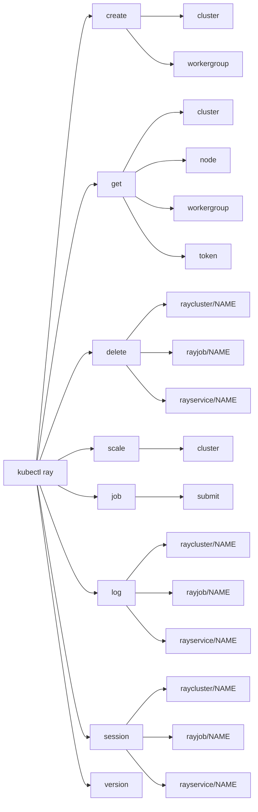
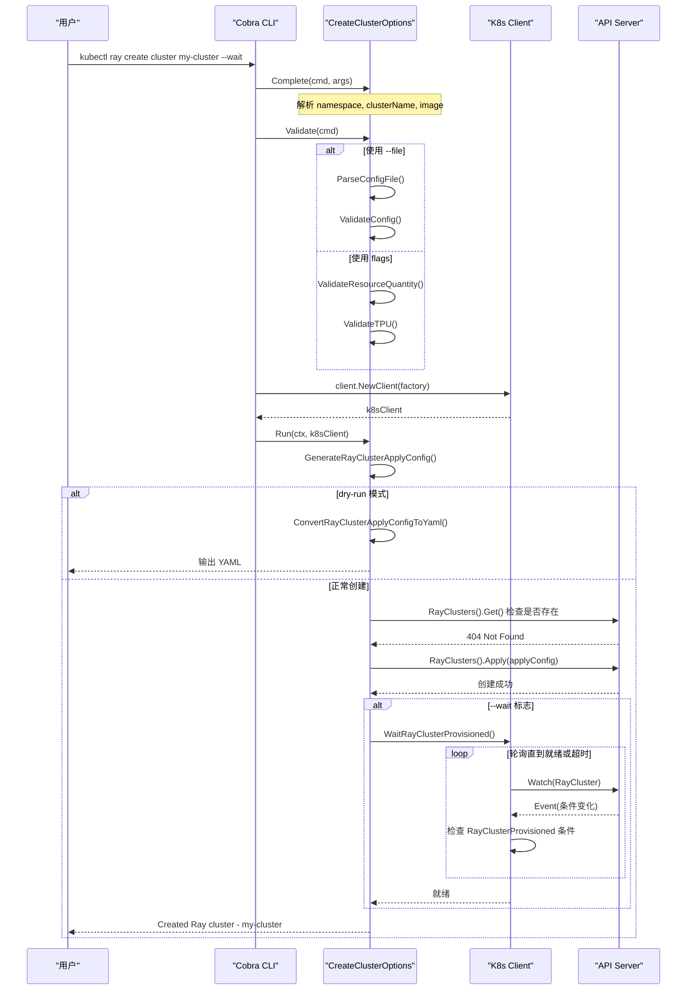

## 前置知识

阅读本文前，建议读者具备以下基础知识:

- 了解 kubectl 插件机制（PATH 发现与命名约定）
- 熟悉 Go 语言基础与 Cobra CLI 框架
- 了解 client-go 与 Kubernetes API 交互模式
- 了解 KubeRay CRD（RayCluster、RayJob、RayService）基本概念

---

## 目录

1. [插件安装与使用](#1-插件安装与使用)
2. [命令体系](#2-命令体系)
3. [实现原理](#3-实现原理)
4. [客户端工具类](#4-客户端工具类)
5. [核心命令执行流程](#5-核心命令执行流程)
6. [总结](#6-总结)

---

## 1. 插件安装与使用

### 1.1 安装方式

kubectl Ray 插件提供两种主要安装方式:

**方式一 - Go Install（推荐开发者使用）**

```bash
go install github.com/ray-project/kuberay/kubectl-plugin/cmd/kubectl-ray@latest
```

该命令会将编译产物 `kubectl-ray` 安装到 `$GOPATH/bin` 目录下。确保该目录在 `$PATH` 中即可使用。

**方式二 - 下载预编译二进制文件**

从 [KubeRay Releases](https://github.com/ray-project/kuberay/releases) 下载对应平台的二进制文件，放置于 `$PATH` 中任一目录:

```bash
# 示例 - Linux amd64
curl -LO https://github.com/ray-project/kuberay/releases/download/v1.3.0/kubectl-ray_v1.3.0_linux_amd64.tar.gz
tar -xzf kubectl-ray_v1.3.0_linux_amd64.tar.gz
chmod +x kubectl-ray
mv kubectl-ray /usr/local/bin/
```

### 1.2 kubectl 插件发现机制

kubectl 的插件发现基于 **PATH 查找 + 命名约定**。当用户执行 `kubectl ray <subcommand>` 时，kubectl 按如下逻辑运作:

1. kubectl 解析第一个非内置子命令（此处为 `ray`）
2. 在 `$PATH` 中查找名为 `kubectl-ray` 的可执行文件
3. 找到后，将剩余参数原样传递给该可执行文件
4. `kubectl-ray` 的退出码作为整体命令的退出码返回

> **关键约定**: 可执行文件名中的连字符 `-` 对应命令层级的空格。例如 `kubectl-ray` 对应 `kubectl ray`。

### 1.3 命令语法概览

```bash
kubectl ray <command> [subcommand] [flags]

# 全局 flags（继承自 kubectl）
  --namespace / -n    指定命名空间
  --context           指定 kubeconfig context
  --kubeconfig        指定 kubeconfig 文件路径
```

验证安装:

```bash
# 查看插件版本与 KubeRay Operator 版本
kubectl ray version

# 查看帮助信息
kubectl ray --help
```

---

## 2. 命令体系

kubectl Ray 插件基于 Cobra 框架构建了完整的命令层级。以下是全部命令的详细解析。

### 2.1 命令层级总览



### 2.2 create - 创建资源

**源码目录**: `kubectl-plugin/pkg/cmd/create/`

#### 2.2.1 kubectl ray create cluster

创建 RayCluster 资源，支持两种模式: 命令行 flags 指定参数或 YAML 配置文件。

```bash
# 使用默认值创建集群
kubectl ray create cluster sample-cluster

# 通过 flags 指定详细配置
kubectl ray create cluster sample-cluster \
  --ray-version 2.52.0 \
  --image rayproject/ray:2.52.0 \
  --head-cpu 2 --head-memory 4Gi \
  --worker-replicas 3 --worker-cpu 2 --worker-memory 4Gi

# 通过 YAML 配置文件创建
kubectl ray create cluster sample-cluster --file ray-cluster-config.yaml

# Dry-run 模式 - 仅输出 YAML 不实际创建
kubectl ray create cluster sample-cluster --dry-run

# 等待集群就绪
kubectl ray create cluster sample-cluster --wait --timeout 5m
```

**核心 flags 一览**:

| Flag | 默认值 | 说明 |
|------|--------|------|
| `--ray-version` | `2.52.0` | Ray 版本 |
| `--image` | `rayproject/ray:2.52.0` | 容器镜像 |
| `--head-cpu` | `2` | Head 节点 CPU |
| `--head-memory` | `4Gi` | Head 节点内存 |
| `--head-gpu` | `0` | Head 节点 GPU |
| `--worker-replicas` | `1` | Worker 副本数 |
| `--worker-cpu` | `2` | Worker CPU |
| `--worker-memory` | `4Gi` | Worker 内存 |
| `--worker-gpu` | `0` | Worker GPU |
| `--worker-tpu` | `0` | Worker TPU |
| `--autoscaler` | 无 | 自动扩缩器版本（v1/v2） |
| `--labels` | 无 | K8s 标签 |
| `--annotations` | 无 | K8s 注解 |
| `--file` | 无 | YAML 配置文件路径 |
| `--dry-run` | `false` | 仅输出 YAML |
| `--wait` | `false` | 等待集群就绪 |
| `--timeout` | `5m` | `--wait` 超时时间 |

> **源码参考**: `kubectl-plugin/pkg/cmd/create/create_cluster.go` 中的 `CreateClusterOptions` 结构体和 `NewCreateClusterCommand` 函数。

#### 2.2.2 kubectl ray create workergroup

向已存在的 RayCluster 添加新的 Worker Group。

```bash
# 使用默认值添加 Worker Group
kubectl ray create workergroup my-group --ray-cluster sample-cluster

# 指定详细配置
kubectl ray create workergroup gpu-group \
  --ray-cluster sample-cluster \
  --worker-cpu 4 --worker-memory 8Gi --worker-gpu 1 \
  --worker-replicas 2

# 添加 TPU Worker Group
kubectl ray create workergroup tpu-group \
  --ray-cluster sample-cluster \
  --worker-tpu 1 \
  --worker-node-selectors cloud.google.com/gke-tpu-accelerator=tpu-v5-lite-podslice,cloud.google.com/gke-tpu-topology=1x1
```

**执行逻辑**: 先通过 `RayClient().RayV1().RayClusters().Get()` 获取现有 RayCluster，然后在其 `Spec.WorkerGroupSpecs` 列表中追加新的 WorkerGroupSpec，最后通过 `Update()` 写回 API Server。

> **源码参考**: `kubectl-plugin/pkg/cmd/create/create_workergroup.go` 中的 `Run` 方法。

### 2.3 get - 查询资源

**源码目录**: `kubectl-plugin/pkg/cmd/get/`

#### 2.3.1 kubectl ray get cluster

列出 RayCluster 资源及其状态信息。

```bash
# 列出当前命名空间下的所有集群
kubectl ray get cluster

# 查看指定集群
kubectl ray get cluster my-cluster

# 跨所有命名空间列出
kubectl ray get cluster --all-namespaces
```

**输出表格字段**:

| 字段 | 说明 |
|------|------|
| Name | 集群名称 |
| Namespace | 命名空间 |
| Desired Workers | 期望 Worker 数量 |
| Available Workers | 可用 Worker 数量 |
| CPUs | 集群总 CPU |
| GPUs | 集群总 GPU |
| TPUs | 集群总 TPU |
| Memory | 集群总内存 |
| Condition | 最相关的状态条件 |
| Status | 集群状态 |
| Age | 创建时长 |

**Condition 字段优先级**: 插件通过 `RelevantRayClusterCondition()` 函数按以下优先级展示最重要的条件:

```
RayClusterProvisioned > HeadPodReady > RayClusterReplicaFailure > Suspended > Suspending
```

> **源码参考**: `kubectl-plugin/pkg/util/conditions.go`

#### 2.3.2 kubectl ray get node

列出 Ray 集群中的所有节点（Pod）及其资源信息。

```bash
# 列出当前命名空间下所有 Ray 节点
kubectl ray get node

# 按集群筛选
kubectl ray get node --ray-cluster my-cluster

# 查看特定节点
kubectl ray get node my-pod-name --ray-cluster my-cluster
```

**工作原理**: 通过 Kubernetes Pod API 使用标签选择器（`ray.io/is-ray-node=yes`、`ray.io/cluster=<name>`）筛选 Pod，并从 Pod 的容器 Resources 中提取 CPU/GPU/TPU/Memory 信息。

#### 2.3.3 kubectl ray get workergroup

列出 Worker Group 及其详细的副本与资源统计。

```bash
# 列出所有 Worker Group
kubectl ray get workergroup

# 按集群筛选
kubectl ray get workergroup --ray-cluster my-cluster

# 查看特定 Worker Group
kubectl ray get workergroup my-group --ray-cluster my-cluster
```

**输出表格字段**: Name、Min、Max、Replicas（ready/desired）、CPUs、GPUs、TPUs、Memory、Cluster。

**资源计算逻辑**: 插件会从 WorkerGroupSpec 的 PodTemplate 中提取每个容器的 Resource Requests（优先）和 Limits，然后乘以副本数得到总资源量。

> **源码参考**: `kubectl-plugin/pkg/cmd/get/get_workergroup.go` 中的 `calculateDesiredResourcesForWorkerGroup()` 与 `calculatePodResource()` 函数。

#### 2.3.4 kubectl ray get token

获取 Ray 集群的认证 Token。

```bash
kubectl ray get token my-cluster
```

**前提条件**: 集群必须配置了 `AuthOptions` 且模式为 `AuthModeToken`。插件会从对应的 Kubernetes Secret 中读取 `auth_token` 字段值。

### 2.4 delete - 删除资源

**源码目录**: `kubectl-plugin/pkg/cmd/delete/`

```bash
# 删除 RayCluster（默认类型）
kubectl ray delete sample-raycluster

# 显式指定资源类型
kubectl ray delete raycluster/sample-raycluster

# 删除 RayJob
kubectl ray delete rayjob/sample-rayjob

# 删除 RayService
kubectl ray delete rayservice/sample-rayservice

# 非交互式删除（跳过确认提示）
kubectl ray delete sample-raycluster -y
```

**资源类型解析**: 插件通过 `/` 分隔符判断资源类型。无 `/` 时默认按 RayCluster 处理；有 `/` 时根据前缀（`raycluster`、`rayjob`、`rayservice`）路由到对应的 API 调用。

**交互式确认**: 默认情况下删除操作会列出待删除资源并要求用户输入 `y/yes` 确认。使用 `-y` 标志可跳过确认。

> **源码参考**: `kubectl-plugin/pkg/cmd/delete/delete.go` 中的 `deleteResource()` 函数。

### 2.5 scale - 扩缩容

**源码目录**: `kubectl-plugin/pkg/cmd/scale/`

```bash
# 扩缩指定 Worker Group 的副本数
kubectl ray scale cluster my-cluster --worker-group my-group --replicas 5

# 调整最大副本数上限
kubectl ray scale cluster my-cluster --worker-group my-group --max-replicas 10

# 同时调整 min、max 和 replicas
kubectl ray scale cluster my-cluster --worker-group my-group \
  --replicas 5 --min-replicas 3 --max-replicas 7
```

**验证逻辑**: 插件在 `Validate()` 阶段执行多重校验:
- 至少指定 `--replicas`、`--min-replicas`、`--max-replicas` 中的一个
- 所有值必须为非负整数
- `min-replicas` 不能大于 `max-replicas`
- `replicas` 必须在 `[min-replicas, max-replicas]` 范围内

**执行逻辑**: 获取 RayCluster -> 定位目标 Worker Group -> 修改对应字段 -> 通过 `Update()` API 写回。只有实际发生变更时才调用 API。

> **源码参考**: `kubectl-plugin/pkg/cmd/scale/scale_cluster.go`

### 2.6 job - 作业管理

**源码目录**: `kubectl-plugin/pkg/cmd/job/`

```bash
# 通过 YAML 文件提交 Ray Job
kubectl ray job submit -f rayjob.yaml --working-dir /path/to/dir -- python my_script.py

# 自动生成 RayJob CR 并提交
kubectl ray job submit --name my-job \
  --working-dir /path/to/dir \
  --head-cpu 2 --head-memory 4Gi \
  --worker-replicas 3 --worker-cpu 2 --worker-memory 4Gi \
  -- python my_script.py

# Dry-run 模式
kubectl ray job submit --dry-run --name my-job \
  --working-dir /path/to/dir -- python my_script.py

# 提交后不等待结果
kubectl ray job submit -f rayjob.yaml --working-dir /path/to/dir \
  --no-wait -- python my_script.py

# 使用自定义 Ray Dashboard 地址（跳过端口转发）
kubectl ray job submit -f rayjob.yaml \
  --address http://ray.example.com \
  --working-dir /path/to/dir -- python my_script.py
```

**提交流程**: 这是插件中最复杂的命令，完整流程包括:

1. **创建 RayJob CR** - 通过 YAML 或自动生成的方式在 K8s 中创建 RayJob 资源
2. **等待 RayCluster 就绪** - 轮询检查集群状态直到 Ready 或超时（120 秒）
3. **建立端口转发** - 若未指定 `--address`，自动对 Ray Dashboard Service（端口 8265）执行 port-forward
4. **执行 ray job submit** - 组装 `ray job submit` CLI 命令并通过 `os/exec` 执行
5. **监控作业状态** - 通过 Watch API 监听 RayJob 状态变化直至终态

**Submission ID 生成**: 当用户未指定 `--submission-id` 时，插件使用密码学安全的随机数生成器生成 16 位随机 ID，格式为 `raysubmit_<random>`，与 Ray Python SDK 保持一致。

> **源码参考**: `kubectl-plugin/pkg/cmd/job/job_submit.go`

### 2.7 log - 日志收集

**源码目录**: `kubectl-plugin/pkg/cmd/log/`

```bash
# 下载 Ray 集群所有节点的日志
kubectl ray log my-raycluster

# 仅下载 Head 节点日志
kubectl ray log my-raycluster --node-type head

# 仅下载 Worker 节点日志
kubectl ray log my-raycluster --node-type worker

# 指定输出目录
kubectl ray log my-raycluster --out-dir /path/to/logs

# 下载 RayJob 关联集群的日志
kubectl ray log rayjob/my-rayjob

# 下载 RayService 关联集群的日志
kubectl ray log rayservice/my-rayservice
```

**日志收集机制**: 插件采用双层日志收集策略:

1. **容器标准输出日志** - 通过 K8s Pod Log API (`GetLogs`) 获取容器 stdout 日志
2. **Ray 内部日志文件** - 通过 Pod Exec API 远程执行 `tar` 命令，将 `/tmp/ray/session_latest/logs/` 目录打包传输到本地，再解压保存

**输出目录结构**:

```
<output-dir>/
  <pod-name-1>/
    stdout.log
    <ray-log-files...>
  <pod-name-2>/
    stdout.log
    <ray-log-files...>
```

> **源码参考**: `kubectl-plugin/pkg/cmd/log/log.go`

### 2.8 session - 端口转发会话

**源码目录**: `kubectl-plugin/pkg/cmd/session/`

```bash
# 转发 RayCluster 端口
kubectl ray session my-raycluster

# 转发 RayJob 相关端口
kubectl ray session rayjob/my-rayjob

# 转发 RayService 相关端口
kubectl ray session rayservice/my-rayservice
```

**端口转发规则**: 根据资源类型转发不同端口:

| 资源类型 | 转发端口 |
|----------|----------|
| RayCluster | Dashboard(8265) + Client(10001) |
| RayJob | Dashboard(8265) |
| RayService | Dashboard(8265) + Serve(8000) |

**自动重连**: session 命令内置了自动重连机制。当端口转发断开时，会在 3 秒后自动重试，直到命令被用户手动终止。

> **源码参考**: `kubectl-plugin/pkg/cmd/session/session.go`

### 2.9 version - 版本信息

**源码目录**: `kubectl-plugin/pkg/cmd/version/`

```bash
kubectl ray version
# 输出示例:
# kubectl ray plugin version: v1.3.0
# KubeRay operator version: v1.3.0
```

**实现细节**: 插件版本通过编译期 `-ldflags` 注入 `Version` 变量。若为开发版本，则从 Go 的 `debug.BuildInfo` 中提取 VCS revision 和 build time。KubeRay Operator 版本则通过查询集群中带有 `app.kubernetes.io/name in (kuberay-operator,kuberay)` 标签的 Deployment，解析其容器镜像 tag 获得。

> **源码参考**: `kubectl-plugin/pkg/cmd/version/version.go`

---

## 3. 实现原理

### 3.1 整体架构

kubectl Ray 插件的架构基于以下核心组件:

| 组件 | 用途 | 来源 |
|------|------|------|
| Cobra | CLI 命令框架 | `github.com/spf13/cobra` |
| client-go | Kubernetes API 客户端 | `k8s.io/client-go` |
| cli-runtime | kubeconfig 解析、表格输出等 | `k8s.io/cli-runtime` |
| kubectl | Factory 模式、命令工具类 | `k8s.io/kubectl` |
| Ray client | Ray CRD 类型化客户端 | `kuberay/ray-operator/pkg/client` |

### 3.2 入口与命令注册

插件的入口文件为 `kubectl-plugin/cmd/kubectl-ray.go`:

```go
// kubectl-plugin/cmd/kubectl-ray.go
func main() {
    flags := flag.NewFlagSet("kubectl-ray", flag.ExitOnError)
    flag.CommandLine = flags
    ioStreams := genericiooptions.IOStreams{
        In: os.Stdin, Out: os.Stdout, ErrOut: os.Stderr,
    }
    root := cmd.NewRayCommand(ioStreams)
    if err := root.Execute(); err != nil {
        os.Exit(1)
    }
}
```

根命令的构建在 `kubectl-plugin/pkg/cmd/ray.go` 中完成。核心设计要点:

```go
// kubectl-plugin/pkg/cmd/ray.go
func NewRayCommand(streams genericiooptions.IOStreams) *cobra.Command {
    // 1. 创建根命令
    cmd := &cobra.Command{
        Use:  "ray",
        Long: "Manage Ray resources on Kubernetes",
    }

    // 2. 初始化 kubeconfig 标志 - 复用 kubectl 的配置逻辑
    configFlags := genericclioptions.NewConfigFlags(true)
    configFlags.AddFlags(cmd.PersistentFlags())

    // 3. 创建资源工厂 - 封装所有 K8s 客户端创建逻辑
    cmdFactory := cmdutil.NewFactory(configFlags)

    // 4. 注册所有子命令
    cmd.AddCommand(get.NewGetCommand(cmdFactory, streams))
    cmd.AddCommand(session.NewSessionCommand(cmdFactory, streams))
    cmd.AddCommand(log.NewClusterLogCommand(cmdFactory, streams))
    cmd.AddCommand(job.NewJobCommand(cmdFactory, streams))
    cmd.AddCommand(version.NewVersionCommand(cmdFactory, streams))
    cmd.AddCommand(create.NewCreateCommand(cmdFactory, streams))
    cmd.AddCommand(kubectlraydelete.NewDeleteCommand(cmdFactory, streams))
    cmd.AddCommand(scale.NewScaleCommand(cmdFactory, streams))

    return cmd
}
```

**关键设计决策**:

- **`genericclioptions.NewConfigFlags(true)`**: 参数 `true` 表示启用 `--namespace` 标志。ConfigFlags 自动处理 kubeconfig 文件加载、context 切换、命名空间解析等所有标准 kubectl 行为。
- **`cmdutil.NewFactory(configFlags)`**: Factory 模式将客户端创建、REST config 构建、资源发现等能力集中管理，所有子命令共享同一 Factory 实例。

### 3.3 命令统一模式 - Complete/Validate/Run

每个命令都遵循 **Options + Complete + Validate + Run** 模式:

```go
// 典型的命令执行流程
RunE: func(cmd *cobra.Command, args []string) error {
    // 阶段一: 参数补全 - 解析 flags、args、环境变量
    if err := options.Complete(cmd, args); err != nil {
        return err
    }
    // 阶段二: 参数校验 - 验证参数合法性
    if err := options.Validate(cmd); err != nil {
        return err
    }
    // 阶段三: 创建客户端
    k8sClient, err := client.NewClient(cmdFactory)
    if err != nil {
        return fmt.Errorf("failed to create client: %w", err)
    }
    // 阶段四: 执行业务逻辑
    return options.Run(cmd.Context(), k8sClient)
}
```

这种模式的优势:
- **职责分离**: 参数收集、校验、执行各自独立
- **易于测试**: 每个阶段可独立单元测试
- **一致性**: 所有命令遵循相同模式，降低维护成本

### 3.4 表格输出格式化

插件使用 `k8s.io/cli-runtime/pkg/printers.TablePrinter` 进行表格渲染，与 `kubectl get` 的输出风格保持一致:

```go
// kubectl-plugin/pkg/cmd/get/get_cluster.go
func printClusters(rayclusterList *rayv1.RayClusterList, output io.Writer) error {
    resultTablePrinter := printers.NewTablePrinter(printers.PrintOptions{})

    resTable := &v1.Table{
        ColumnDefinitions: []v1.TableColumnDefinition{
            {Name: "Name", Type: "string"},
            {Name: "Namespace", Type: "string"},
            {Name: "Desired Workers", Type: "string"},
            // ... 更多列定义
        },
    }

    for _, raycluster := range rayclusterList.Items {
        resTable.Rows = append(resTable.Rows, v1.TableRow{
            Cells: []any{
                raycluster.GetName(),
                raycluster.GetNamespace(),
                raycluster.Status.DesiredWorkerReplicas,
                // ... 更多字段
            },
        })
    }

    return resultTablePrinter.PrintObj(resTable, output)
}
```

### 3.5 Shell 补全机制

插件为每个命令注册了 Shell 补全函数，支持 Bash、Zsh、Fish 等 Shell 的 Tab 补全:

```go
// 资源名称补全 - 复用 kubectl 的补全基础设施
ValidArgsFunction: completion.RayClusterCompletionFunc(cmdFactory)

// Flag 值补全
cmd.RegisterFlagCompletionFunc("ray-cluster",
    completion.RayClusterCompletionFunc(cmdFactory))

// 自定义补全（如 WorkerGroup 名称）
func WorkerGroupCompletionFunc(f cmdutil.Factory) ... {
    // 查询 API Server 获取实际的 WorkerGroup 名称列表
    rayClusterList, err := k8sClient.RayClient().RayV1().
        RayClusters(namespace).List(...)
    for _, rayCluster := range rayClusterList.Items {
        for _, spec := range rayCluster.Spec.WorkerGroupSpecs {
            comps = append(comps, spec.GroupName)
        }
    }
}
```

---

## 4. 客户端工具类

### 4.1 Client 接口

**源码位置**: `kubectl-plugin/pkg/util/client/client.go`

```go
type Client interface {
    KubernetesClient() kubernetes.Interface
    RayClient() rayclient.Interface
    GetRayHeadSvcName(ctx context.Context, namespace string,
        resourceType util.ResourceType, name string) (string, error)
    GetKubeRayOperatorVersion(ctx context.Context) (string, error)
    WaitRayClusterProvisioned(ctx context.Context, namespace, name string,
        timeout time.Duration) error
}
```

**Client 接口设计要点**:

- **双客户端**: 封装了标准 `kubernetes.Interface`（用于 Pod、Service 等原生资源）和 `rayclient.Interface`（用于 RayCluster、RayJob 等 CRD）
- **Factory 模式**: 通过 `cmdutil.Factory` 创建，自动获取 REST Config
- **可测试性**: 接口抽象允许注入 mock 客户端

**创建逻辑**:

```go
func NewClient(factory cmdutil.Factory) (Client, error) {
    kubeClient, err := factory.KubernetesClientSet()
    restConfig, err := factory.ToRESTConfig()
    rayClient, err := rayclient.NewForConfig(restConfig)
    return &k8sClient{kubeClient, rayClient}, nil
}
```

**GetRayHeadSvcName 的多类型路由**: 该方法根据资源类型执行不同逻辑:

- `RayCluster` -> 直接从 `status.head.serviceName` 获取
- `RayJob` -> 从 `status.rayClusterStatus.head.serviceName` 获取
- `RayService` -> 从 `status.activeServiceStatus.rayClusterStatus.head.serviceName` 获取

### 4.2 资源类型枚举

**源码位置**: `kubectl-plugin/pkg/util/types.go`

```go
type ResourceType string

const (
    RayCluster ResourceType = "raycluster"
    RayJob     ResourceType = "rayjob"
    RayService ResourceType = "rayservice"
)
```

`ResourceType` 在 `delete`、`log`、`session` 等多个命令中用于统一的资源类型路由。用户输入格式为 `TYPE/NAME`（如 `rayjob/my-job`），插件通过 `/` 分隔后匹配这些常量。

### 4.3 输入验证

**源码位置**: `kubectl-plugin/pkg/util/validation.go`

```go
// 资源量验证 - 复用 K8s 的 resource.ParseQuantity
func ValidateResourceQuantity(value string, name string) error {
    q, err := resource.ParseQuantity(value)
    if q.Sign() < 0 {
        return fmt.Errorf("%s cannot be negative", name)
    }
    return nil
}

// TPU 配置验证 - 确保 TPU 相关的 NodeSelector 已设置
func ValidateTPU(tpu *string, numOfHosts *int32,
    nodeSelector map[string]string) error {
    // 验证 numOfHosts != 0
    // 验证 cloud.google.com/gke-tpu-accelerator 已设置
    // 验证 cloud.google.com/gke-tpu-topology 已设置
}
```

### 4.4 Shell 补全辅助

**源码位置**: `kubectl-plugin/pkg/util/completion/completion.go`

提供了多种补全函数工厂:

| 函数 | 补全内容 |
|------|----------|
| `RayClusterCompletionFunc` | RayCluster 资源名称 |
| `RayJobCompletionFunc` | RayJob 资源名称 |
| `RayServiceCompletionFunc` | RayService 资源名称 |
| `RayClusterResourceNameCompletionFunc` | RayCluster 名称 + 资源类型前缀 |
| `WorkerGroupCompletionFunc` | WorkerGroup 名称 |
| `NodeCompletionFunc` | Ray 节点（Pod）名称 |

### 4.5 YAML 生成工具

**源码位置**: `kubectl-plugin/pkg/util/generation/generation.go`

核心结构体 `RayClusterConfig` 支持从 YAML 配置文件解析或命令行参数构造:

```go
type RayClusterConfig struct {
    Namespace      *string           `yaml:"namespace,omitempty"`
    Name           *string           `yaml:"name,omitempty"`
    Labels         map[string]string `yaml:"labels,omitempty"`
    Annotations    map[string]string `yaml:"annotations,omitempty"`
    RayVersion     *string           `yaml:"ray-version,omitempty"`
    Image          *string           `yaml:"image,omitempty"`
    ServiceAccount *string           `yaml:"service-account,omitempty"`
    Head           *Head             `yaml:"head,omitempty"`
    GKE            *GKE              `yaml:"gke,omitempty"`
    Autoscaler     *Autoscaler       `yaml:"autoscaler,omitempty"`
    WorkerGroups   []WorkerGroup     `yaml:"worker-groups,omitempty"`
}
```

**关键方法**:

| 方法 | 功能 |
|------|------|
| `GenerateRayClusterApplyConfig()` | 从 Config 生成 RayCluster Apply Configuration |
| `GenerateRayJobApplyConfig()` | 从 RayJobYamlObject 生成 RayJob Apply Configuration |
| `ParseConfigFile()` | 解析 YAML 配置文件 |
| `ValidateConfig()` | 校验配置合法性 |
| `ConvertRayClusterApplyConfigToYaml()` | 将 Apply Config 转换为 YAML 字符串 |

### 4.6 常量定义

**源码位置**: `kubectl-plugin/pkg/util/constant.go`

```go
const (
    RayVersion = "2.52.0"
    RayImage   = "rayproject/ray:" + RayVersion

    // K8s 标签键
    RayClusterLabelKey   = "ray.io/cluster"
    RayIsRayNodeLabelKey = "ray.io/is-ray-node"
    RayNodeGroupLabelKey = "ray.io/group"
    RayNodeTypeLabelKey  = "ray.io/node-type"

    // 加速器资源名
    ResourceNvidiaGPU = "nvidia.com/gpu"
    ResourceGoogleTPU = "google.com/tpu"

    // Field Manager 标识
    FieldManager = "ray-kubectl-plugin"
)
```

`FieldManager` 常量用于 Server-Side Apply，确保插件创建的字段归属清晰，与 KubeRay Operator 的字段管理互不冲突。

---

## 5. 核心命令执行流程

### 5.1 kubectl ray create cluster 执行流程



### 5.2 资源操作与 K8s API 映射

```mermaid
flowchart TB
    subgraph commands["kubectl ray 命令"]
        create_cluster["create cluster"]
        create_wg["create workergroup"]
        get_cluster["get cluster"]
        get_node["get node"]
        get_wg["get workergroup"]
        get_token["get token"]
        delete_cmd["delete"]
        scale_cmd["scale cluster"]
        job_submit["job submit"]
        log_cmd["log"]
        session_cmd["session"]
        version_cmd["version"]
    end

    subgraph rayapi["Ray CRD API"]
        rc_apply["RayClusters.Apply()"]
        rc_get["RayClusters.Get()"]
        rc_list["RayClusters.List()"]
        rc_update["RayClusters.Update()"]
        rc_delete["RayClusters.Delete()"]
        rc_watch["RayClusters.Watch()"]
        rj_create["RayJobs.Create()"]
        rj_apply["RayJobs.Apply()"]
        rj_delete["RayJobs.Delete()"]
        rj_get["RayJobs.Get()"]
        rj_watch["RayJobs.Watch()"]
        rs_get["RayServices.Get()"]
        rs_delete["RayServices.Delete()"]
    end

    subgraph k8sapi["Kubernetes Core API"]
        pods_list["Pods.List()"]
        pods_getlogs["Pods.GetLogs()"]
        pods_exec["Pods.Exec()"]
        secret_get["Secrets.Get()"]
        deploy_list["Deployments.List()"]
    end

    create_cluster --> rc_apply
    create_wg --> rc_get
    create_wg --> rc_update
    get_cluster --> rc_list
    get_node --> pods_list
    get_wg --> rc_list
    get_wg --> pods_list
    get_token --> rc_get
    get_token --> secret_get
    delete_cmd --> rc_delete
    delete_cmd --> rj_delete
    delete_cmd --> rs_delete
    scale_cmd --> rc_get
    scale_cmd --> rc_update
    job_submit --> rj_create
    job_submit --> rj_apply
    job_submit --> rj_get
    job_submit --> rj_watch
    job_submit --> rc_get
    log_cmd --> pods_list
    log_cmd --> pods_getlogs
    log_cmd --> pods_exec
    log_cmd --> rj_get
    log_cmd --> rs_get
    session_cmd --> rc_get
    session_cmd --> rj_get
    session_cmd --> rs_get
    version_cmd --> deploy_list
```



### 5.3 关键技术实现细节

#### Server-Side Apply

`create cluster` 命令使用 **Server-Side Apply** 而非传统的 `Create` API:

```go
result, err := k8sClient.RayClient().RayV1().
    RayClusters(namespace).Apply(ctx, rayClusterac,
        metav1.ApplyOptions{FieldManager: util.FieldManager})
```

Server-Side Apply 的优势:
- 声明式语义 - 只描述期望状态，不需要完整对象
- 字段所有权管理 - 通过 `FieldManager` 追踪字段归属
- 冲突检测 - 多个管理者修改同一字段时自动告警

#### Port-Forward 机制

`job submit` 和 `session` 命令都涉及端口转发。`session` 使用外部 `kubectl port-forward` 命令:

```go
portforwardCmd := exec.CommandContext(ctx, "kubectl",
    "--context", options.currentContext,
    "port-forward", "-n", namespace,
    "service/"+svcName, "8265:8265", "10001:10001")
```

而 `job submit` 使用 kubectl 内部的 `portforward.NewCmdPortForward()` API，实现了进程内端口转发。

#### 远程日志收集

`log` 命令通过 SPDY Executor 实现远程文件传输:

```go
// 在 Pod 内执行 tar 命令打包日志
req := clientSet.KubernetesClient().CoreV1().RESTClient().
    Get().Resource("pods").Name(podName).
    SubResource("exec").
    VersionedParams(&corev1.PodExecOptions{
        Command: []string{"tar", "--warning=no-file-changed",
            "-cf", "-", "-C", "/tmp/ray/session_latest/logs/", "."},
        Stdout: true,
    }, clientgoscheme.ParameterCodec)

exec, _ := remotecommand.NewSPDYExecutor(restconfig, "POST", req.URL())
// 通过 pipe 接收 tar 流并本地解压
```

---

## 6. 总结

kubectl Ray 插件作为 KubeRay 生态的客户端工具，通过标准的 kubectl 插件机制为用户提供了管理 Ray 集群的完整能力。其核心设计特点包括:

- **标准化命令模式**: 所有命令遵循 Complete -> Validate -> Run 三阶段执行模式，保证一致性和可测试性
- **双客户端架构**: 同时封装 Kubernetes 原生客户端和 Ray CRD 类型化客户端，覆盖所有资源操作需求
- **声明式创建**: 使用 Server-Side Apply 替代传统 Create，与 Kubernetes 声明式管理理念一致
- **完整的 Shell 补全**: 基于实时 API 查询的动态补全，显著提升用户操作效率
- **可配置的资源生成**: 支持 flags 和 YAML 配置文件两种输入模式，兼顾交互式和自动化场景

### 源码结构速查

```
kubectl-plugin/
  cmd/
    kubectl-ray.go              # 入口 main 函数
  pkg/
    cmd/
      ray.go                    # 根命令注册
      create/
        create.go               # create 命令组
        create_cluster.go       # create cluster 命令
        create_workergroup.go   # create workergroup 命令
      get/
        get.go                  # get 命令组
        get_cluster.go          # get cluster 命令
        get_nodes.go            # get node 命令
        get_workergroup.go      # get workergroup 命令
        get_token.go            # get token 命令
      delete/
        delete.go               # delete 命令
      scale/
        scale.go                # scale 命令组
        scale_cluster.go        # scale cluster 命令
      job/
        job.go                  # job 命令组
        job_submit.go           # job submit 命令
      log/
        log.go                  # log 命令
      session/
        session.go              # session 命令
      version/
        version.go              # version 命令
    util/
      client/
        client.go               # K8s 客户端封装
      completion/
        completion.go           # Shell 补全辅助
      generation/
        generation.go           # YAML 生成工具
      conditions.go             # 状态条件处理
      constant.go               # 常量定义
      types.go                  # 资源类型枚举
      validation.go             # 输入验证
```

---

## 延伸阅读

- [kubectl 插件开发指南](https://kubernetes.io/docs/tasks/extend-kubectl/kubectl-plugins/) - Kubernetes 官方 kubectl 插件机制说明
- [Cobra CLI 框架文档](https://cobra.dev/) - Go 语言 CLI 框架，kubectl Ray 插件的命令行解析基础
- [client-go 官方文档](https://pkg.go.dev/k8s.io/client-go) - Kubernetes Go 客户端库，用于与 API Server 交互
- [KubeRay 是什么](../01-architecture-overview/01-what-is-kuberay.md) - KubeRay 项目整体介绍，了解 kubectl 插件在生态中的定位

---

## 下一篇

> **[7.4 - Helm Chart 部署指南](04-helm-charts.md)**
>
> 下一篇将深入分析 KubeRay 三套 Helm Chart 的内部结构、关键配置项以及高可用部署方案。
