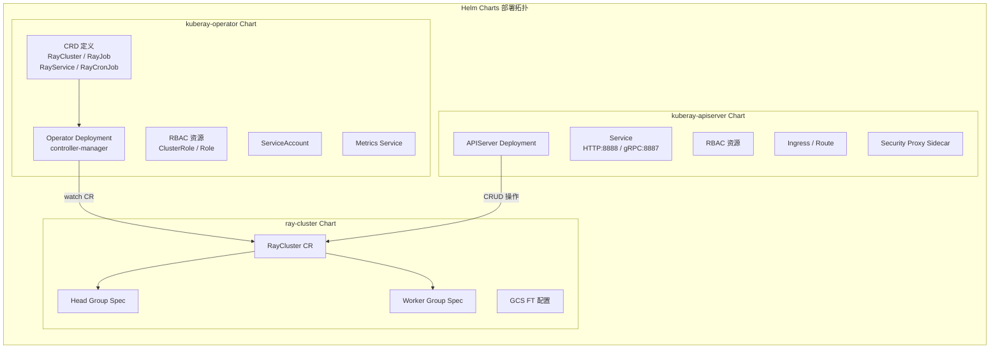
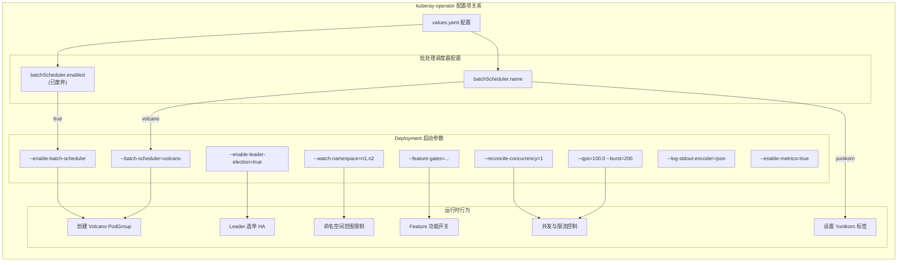
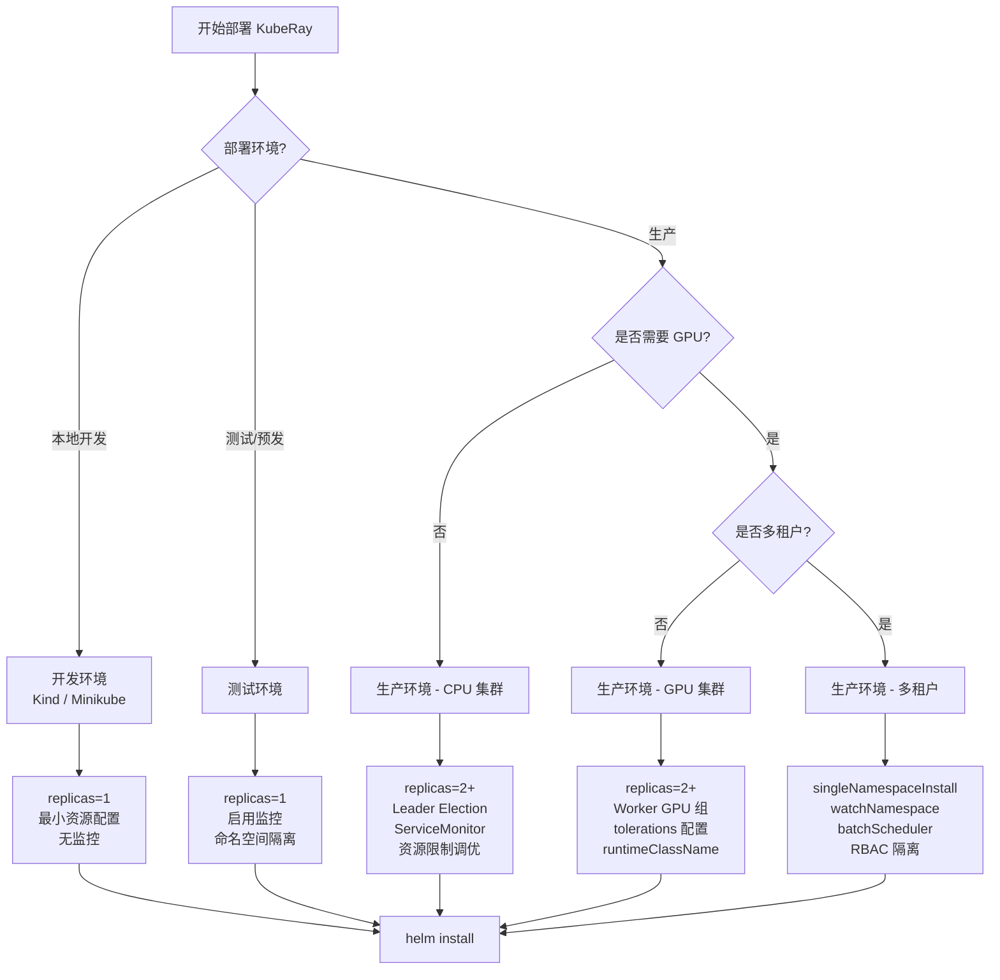

> 本文深入剖析 KubeRay 项目提供的三套 Helm Chart 的内部结构、配置项含义与生产级部署实践。通过对 `values.yaml` 与模板文件的逐项解析，帮助读者掌握从开发环境到生产环境的完整部署链路。

---

## 前置知识

| 知识领域 | 说明 |
|----------|------|
| Helm v3 基础 | 理解 Chart 结构、values.yaml、模板语法 |
| Kubernetes 基础 | 理解 Deployment、Service、RBAC、CRD 等核心概念 |
| KubeRay 架构概览 | 建议先阅读 [1.1 KubeRay 是什么](../01-architecture-overview/01-what-is-kuberay.md) |

---

## 目录

- [1. Chart 概览](#1-chart-概览)
- [2. kuberay-operator Chart 详解](#2-kuberay-operator-chart-详解)
- [3. kuberay-apiserver Chart 详解](#3-kuberay-apiserver-chart-详解)
- [4. ray-cluster Chart 详解](#4-ray-cluster-chart-详解)
- [5. 关键配置项详解](#5-关键配置项详解)
- [6. 高可用部署方案](#6-高可用部署方案)
- [7. 常见部署场景](#7-常见部署场景)

---

## 1. Chart 概览

KubeRay 在 `helm-chart/` 目录下提供了三套独立的 Helm Chart，各自承担不同的职责：

| Chart 名称 | 目录路径 | 版本 | 职责 |
|---|---|---|---|
| **kuberay-operator** | `helm-chart/kuberay-operator/` | 1.1.0 | 部署 Ray Operator（CRD 注册 + 控制器） |
| **kuberay-apiserver** | `helm-chart/kuberay-apiserver/` | 1.1.0 | 部署 APIServer（gRPC/REST 网关） |
| **ray-cluster** | `helm-chart/ray-cluster/` | 1.1.0 | 部署 Ray 集群模板（生成 RayCluster CR 实例） |

三者之间存在清晰的依赖关系和部署顺序：



> **部署顺序建议**: 先安装 `kuberay-operator`（注册 CRD + 启动控制器），再根据需要安装 `kuberay-apiserver`，最后通过 `ray-cluster` 或直接提交 YAML 来创建 Ray 集群。

### 1.1 前置条件

在使用 Helm Chart 部署之前，请确保满足以下环境要求：

- **Helm**: v3.x 或更高版本
- **Kubernetes**: >= 1.19（推荐 1.24+）
- **kubectl**: 已配置并连接到目标集群
- **权限**: 具备创建 CRD、ClusterRole 等集群级资源的权限（若非 `singleNamespaceInstall` 模式）

```bash
# 添加 KubeRay Helm 仓库
helm repo add kuberay https://ray-project.github.io/kuberay-helm/
helm repo update

# 查看可用版本
helm search repo kuberay
```

---

## 2. kuberay-operator Chart 详解

`kuberay-operator` 是最核心的 Chart，负责部署 KubeRay 控制器及其所需的全部 Kubernetes 资源。

### 2.1 模板文件结构

Chart 的模板文件位于 `helm-chart/kuberay-operator/templates/`：

| 模板文件 | 生成资源 | 说明 |
|---|---|---|
| `deployment.yaml` | Deployment | Operator Pod，运行 `/manager` 命令 |
| `serviceaccount.yaml` | ServiceAccount | Operator 使用的服务账户 |
| `role.yaml` | ClusterRole | 集群范围的 RBAC 权限（非 singleNamespace 模式） |
| `rolebinding.yaml` | ClusterRoleBinding | 绑定 ClusterRole 到 ServiceAccount |
| `multiple_namespaces_role.yaml` | Role（多个） | 命名空间范围的 RBAC（singleNamespace 模式） |
| `multiple_namespaces_rolebinding.yaml` | RoleBinding（多个） | 对应命名空间级 Role 的绑定 |
| `leader_election_role.yaml` | Role | Leader 选举所需的 ConfigMap/Lease 权限 |
| `leader_election_role_binding.yaml` | RoleBinding | 绑定 Leader 选举 Role |
| `service.yaml` | Service | 暴露 metrics 端口（默认 8080） |
| `servicemonitor.yaml` | ServiceMonitor | Prometheus 监控采集配置 |
| `configmap.yaml` | ConfigMap | 可选的配置文件（`configuration.enabled` 启用时） |
| `_helpers.tpl` | - | 模板辅助函数（命名、标签、校验逻辑） |

### 2.2 核心 values.yaml 配置项

以下对 `helm-chart/kuberay-operator/values.yaml` 中的关键配置项逐一解析：

#### 2.2.1 镜像与副本

```yaml
# 副本数 - 配合 leaderElectionEnabled 可实现高可用
replicas: 1

image:
  repository: quay.io/kuberay/operator  # 镜像仓库地址
  tag: nightly                           # 镜像标签
  pullPolicy: IfNotPresent               # 拉取策略
```

#### 2.2.2 日志配置

```yaml
logging:
  stdoutEncoder: json     # stdout 日志编码格式: json | console
  fileEncoder: json       # 文件日志编码格式: json | console
  baseDir: ""             # 日志文件目录（设置后启用文件日志）
  fileName: ""            # 日志文件名
  sizeLimit: ""           # EmptyDir 卷大小限制
```

> 当 `baseDir` 和 `fileName` 同时设置时，模板会自动创建 EmptyDir 卷并挂载到 Operator 容器，通过 `--log-file-path` 参数指定日志路径。

#### 2.2.3 批处理调度器

```yaml
batchScheduler:
  enabled: false    # 已废弃，向后兼容 Volcano
  name: ""          # 调度器名称: volcano | yunikorn | scheduler-plugins | kai-scheduler
```

支持的调度器及配置方式：

| 调度器 | 配置方式 | 所需 RBAC |
|---|---|---|
| Volcano | `name: volcano` | `scheduling.volcano.sh/podgroups` |
| Yunikorn | `name: yunikorn` | 无额外 CRD 权限 |
| Scheduler-Plugins | `name: scheduler-plugins` | `scheduling.x-k8s.io/podgroups` |
| Kai Scheduler | `name: kai-scheduler` | 视具体版本而定 |

> **注意**: `enabled` 和 `name` 不应同时设置。`enabled: true` 等价于 `name: volcano`，已被标记为废弃。

#### 2.2.4 配置中心（Configuration）

```yaml
configuration:
  enabled: false             # 启用后生成 ConfigMap 挂载到 /etc/kuberay
  defaultContainerEnvs: []   # 注入到所有 Ray 容器的默认环境变量
  headSidecarContainers: []  # 注入到所有 Head Pod 的 Sidecar 容器
  workerSidecarContainers: [] # 注入到所有 Worker Pod 的 Sidecar 容器
```

当 `configuration.enabled: true` 时，Helm 会生成 ConfigMap 并通过 `--config /etc/kuberay/config.yaml` 参数传入 Operator。此时命令行参数将被忽略，所有配置从 ConfigMap 读取。

对应的 ConfigMap 模板（`configmap.yaml`）生成内容示例：

```yaml
apiVersion: config.ray.io/v1alpha1
kind: Configuration
enableLeaderElection: true
enableMetrics: true
reconcileConcurrency: 1
qps: 100.0
burst: 200
defaultContainerEnvs:
- name: RAY_enable_open_telemetry
  value: "true"
```

#### 2.2.5 Feature Gates

```yaml
featureGates:
- name: RayClusterStatusConditions
  enabled: true
- name: RayJobDeletionPolicy
  enabled: false
- name: RayMultiHostIndexing
  enabled: false
- name: RayServiceIncrementalUpgrade
  enabled: false
```

Feature Gates 通过 `_helpers.tpl` 中的模板函数转换为命令行参数：

```go
// 模板函数 kuberay.featureGates 生成如下格式：
// --feature-gates=RayClusterStatusConditions=true,RayJobDeletionPolicy=false,...
```

> **源码参考**: `helm-chart/kuberay-operator/templates/_helpers.tpl` 第 62-71 行定义了 Feature Gates 的序列化逻辑。

#### 2.2.6 RBAC 与命名空间控制

```yaml
rbacEnable: true              # 是否创建 RBAC 资源
singleNamespaceInstall: false  # true 时使用 Role 替代 ClusterRole
crNamespacedRbacEnable: true   # 是否为每个 watchNamespace 创建 Role
# watchNamespace:              # 监听的命名空间列表
#   - n1
#   - n2
```

RBAC 资源生成的条件逻辑如下：

| `singleNamespaceInstall` | `rbacEnable` | 生成资源 |
|---|---|---|
| `false` | `true` | ClusterRole + ClusterRoleBinding |
| `true` | `true` | Role + RoleBinding（按 namespace 生成） |
| `*` | `false` | 不生成任何 RBAC 资源 |

#### 2.2.7 性能与高可用配置

```yaml
leaderElectionEnabled: true   # 启用 Leader 选举（多副本 HA）
reconcileConcurrency: 1       # 调谐并发数
kubeClient:
  qps: 100.0                  # API Server 请求 QPS
  burst: 200                  # API Server 请求突发上限

resources:
  limits:
    cpu: 100m
    memory: 512Mi             # 经验值：管理 500 个 Ray Pod 约需 500MB
```

#### 2.2.8 环境变量（功能开关）

Operator 支持通过环境变量控制运行时行为。以下是重要的环境变量及其含义：

```yaml
env:
# Init Container 注入（推荐保持 true）
# - name: ENABLE_INIT_CONTAINER_INJECTION
#   value: "true"

# Head Pod 使用 ClusterIP Service 替代 Headless Service
# - name: ENABLE_RAY_HEAD_CLUSTER_IP_SERVICE
#   value: "false"

# 自定义集群域名
# - name: CLUSTER_DOMAIN
#   value: "cluster.local"

# 启用零停机升级（适用于 GPU 资源不足的 LLM 场景）
# - name: ENABLE_ZERO_DOWNTIME
#   value: "true"

# 启用健康检查探针注入
# - name: ENABLE_PROBES_INJECTION
#   value: "true"

# GCS FT Redis 存储清理
# - name: ENABLE_GCS_FT_REDIS_CLEANUP
#   value: "true"
```

### 2.3 Deployment 模板解析

`deployment.yaml` 是核心模板，其生成逻辑涉及多层条件判断。以下是关键段落的解读：

```yaml
# 容器命令与参数构建流程：
command:
  - /manager          # operatorCommand 配置项
args:
  # 当 configuration.enabled=true 时：
  #   --config /etc/kuberay/config.yaml
  # 否则根据 values 逐一拼接参数：
  #   --enable-batch-scheduler (batchScheduler.enabled)
  #   --batch-scheduler=volcano (batchScheduler.name)
  #   --watch-namespace n1,n2 (watchNamespace 或 singleNamespace 推导)
  #   --log-file-path /var/log/kuberay/operator.log
  #   --log-stdout-encoder json
  #   --enable-leader-election=true
  #   --enable-metrics=true
  #   --reconcile-concurrency=1
  #   --qps=100.0
  #   --burst=200
  #   --feature-gates=RayClusterStatusConditions=true,...
```

> **源码参考**: `helm-chart/kuberay-operator/templates/deployment.yaml` 第 84-146 行实现了完整的参数构建流程，包含配置校验、条件拼接和 Feature Gates 序列化。

---

## 3. kuberay-apiserver Chart 详解

`kuberay-apiserver` Chart 部署 KubeRay 的 REST/gRPC API 网关，允许外部客户端通过 HTTP 或 gRPC 协议管理 Ray 资源。

### 3.1 模板文件结构

| 模板文件 | 生成资源 | 说明 |
|---|---|---|
| `deployment.yaml` | Deployment | APIServer Pod + 可选 Security Proxy Sidecar |
| `service.yaml` | Service | 暴露 HTTP(8888) 和 gRPC(8887) 端口 |
| `ingress.yaml` | Ingress | 外部 HTTP 访问入口 |
| `route.yaml` | Route | OpenShift 路由 |
| `rbac/*.yaml` | RBAC 资源 | ServiceAccount、Role/ClusterRole 及绑定 |

### 3.2 核心 values.yaml 配置项

#### 3.2.1 容器端口与服务

```yaml
containerPort:
- name: http
  containerPort: 8888      # HTTP/REST 端口
  protocol: TCP
- name: grpc
  containerPort: 8887      # gRPC 端口
  protocol: TCP

service:
  type: ClusterIP           # 服务类型: ClusterIP | NodePort | LoadBalancer
  ports:
  - name: http
    port: 8888
    targetPort: 8888
  - name: rpc
    port: 8887
    targetPort: 8887
```

#### 3.2.2 API 版本与 CORS

```yaml
enableAPIServerV2: true     # 启用 V2 API（与 V1 同端口提供）

cors:
  # allowOrigin: "*"        # 取消注释以启用 CORS
```

APIServer 的启动参数由模板动态构建：

```yaml
args:
  - "--enable-api-server-v2=true"
  - "--cors-allow-origin=*"       # 仅当 cors.allowOrigin 设置时
```

#### 3.2.3 安全代理（Security Proxy）

```yaml
security:
  proxy:
    repository: quay.io/kuberay/security-proxy
    tag: nightly
  env:
    HTTP_LOCAL_PORT: 8988         # 代理监听的 HTTP 端口
    GRPC_LOCAL_PORT: 8987         # 代理监听的 gRPC 端口
    SECURITY_TOKEN: "12345"       # 安全令牌
    SECURITY_PREFIX: "/"          # URL 前缀
    ENABLE_GRPC: "true"           # 启用 gRPC 代理
```

当 `security` 配置块存在时，模板会在 Deployment 中添加 `security-proxy-container` 作为 Sidecar，代理所有流量并执行令牌验证。

#### 3.2.4 外部访问

```yaml
# Kubernetes Ingress
ingress:
  enabled: false
  className: ""          # IngressClass 名称（K8s >= 1.18）
  annotations: {}
  tls: []

# OpenShift Route
route:
  enabled: false
  annotations: {}
```

> **注意**: Ingress 和 Route 互斥，且使用时服务类型应为 `ClusterIP`。

---

## 4. ray-cluster Chart 详解

`ray-cluster` Chart 生成 `RayCluster` CR 实例，由 `kuberay-operator` 负责调谐创建实际的 Ray 集群。

### 4.1 模板文件结构

该 Chart 结构简洁，核心只有一个模板：

| 模板文件 | 生成资源 | 说明 |
|---|---|---|
| `raycluster-cluster.yaml` | RayCluster | 完整的 RayCluster CR 定义 |
| `_helpers.tpl` | - | 名称和标签辅助函数 |

### 4.2 核心 values.yaml 配置项

#### 4.2.1 全局镜像配置

```yaml
image:
  repository: rayproject/ray    # Ray 镜像仓库
  tag: 2.52.0                   # Ray 版本
  pullPolicy: IfNotPresent
```

#### 4.2.2 GCS 容错配置

```yaml
gcsFaultTolerance:
  enabled: false
  # redisAddress: "redis:6379"
  # externalStorageNamespace: "my-raycluster-storage"
  # redisPassword:
  #   valueFrom:
  #     secretKeyRef:
  #       name: redis-password-secret
  #       key: password
```

启用后，模板会在 RayCluster CR 的 `spec.gcsFaultToleranceOptions` 中注入 Redis 连接配置，实现 GCS（Global Control Store）的容错恢复。

#### 4.2.3 公共环境变量

```yaml
common:
  containerEnv: []    # 注入到所有 Head 和 Worker 容器
```

> `common.containerEnv` 会与 `head.containerEnv` / `worker.containerEnv` 合并。模板中使用 `concat` 函数实现：`{{- with concat .Values.common.containerEnv .Values.head.containerEnv }}`

#### 4.2.4 Head 节点配置

```yaml
head:
  # enableInTreeAutoscaling: true   # 启用内置自动伸缩
  # rayVersion: 2.52.0              # 决定 autoscaler 镜像版本
  resources:
    limits:
      cpu: "1"
      memory: "2G"                   # Head 节点至少需要 2GB 内存
    requests:
      cpu: "1"
      memory: "2G"
  volumes:
    - name: log-volume
      emptyDir: {}
  volumeMounts:
    - mountPath: /tmp/ray
      name: log-volume
  # rayStartParams: {}              # 传递给 ray start 的参数
```

#### 4.2.5 Worker 节点组配置

```yaml
worker:
  # disabled: true           # 禁用默认 Worker 组
  groupName: workergroup
  replicas: 1                # 初始副本数
  minReplicas: 1             # 自动伸缩最小值
  maxReplicas: 3             # 自动伸缩最大值
  resources:
    limits:
      cpu: "1"
      memory: "1G"
    requests:
      cpu: "1"
      memory: "1G"
```

#### 4.2.6 额外 Worker 组

通过 `additionalWorkerGroups` 可以定义多个异构 Worker 组（如 GPU 组和 CPU 组）：

```yaml
additionalWorkerGroups:
  gpuGroup:                  # key 会作为 groupName
    disabled: false
    replicas: 1
    minReplicas: 0
    maxReplicas: 4
    resources:
      limits:
        cpu: "4"
        memory: "8G"
        nvidia.com/gpu: "1"
      requests:
        cpu: "4"
        memory: "8G"
        nvidia.com/gpu: "1"
```

> **源码参考**: `helm-chart/ray-cluster/templates/raycluster-cluster.yaml` 第 306-440 行通过 `range` 循环遍历 `additionalWorkerGroups` 生成多个 Worker Group Spec。

---

## 5. 关键配置项详解

### 5.1 Feature Gates 配置

Feature Gates 是 KubeRay 控制实验性功能的机制。在 Helm Chart 中通过 `featureGates` 列表配置：

```yaml
# helm-chart/kuberay-operator/values.yaml
featureGates:
- name: RayClusterStatusConditions
  enabled: true
- name: RayJobDeletionPolicy
  enabled: false
- name: RayMultiHostIndexing
  enabled: false
- name: RayServiceIncrementalUpgrade
  enabled: false
```

`_helpers.tpl` 中的模板函数将其转换为启动参数：

```go
// helm-chart/kuberay-operator/templates/_helpers.tpl 第 62-71 行
{{- define "kuberay.featureGates" -}}
{{- $features := "" }}
{{- range .Values.featureGates }}
  {{- $str := printf "%s=%t," .name .enabled }}
  {{- $features = print $features $str }}
{{- end }}
{{- with .Values.featureGates }}
--feature-gates={{ $features | trimSuffix "," }}
{{- end }}
{{- end }}
```

安装时通过 `--set` 覆盖：

```bash
helm install kuberay-operator kuberay/kuberay-operator \
  --set "featureGates[0].name=RayJobDeletionPolicy" \
  --set "featureGates[0].enabled=true"
```

### 5.2 批处理调度器集成



不同调度器的配置示例：

```bash
# Volcano
helm install kuberay-operator kuberay/kuberay-operator \
  --set batchScheduler.name=volcano

# Yunikorn
helm install kuberay-operator kuberay/kuberay-operator \
  --set batchScheduler.name=yunikorn

# Scheduler-Plugins (PodGroup)
helm install kuberay-operator kuberay/kuberay-operator \
  --set batchScheduler.name=scheduler-plugins

# Kai Scheduler
helm install kuberay-operator kuberay/kuberay-operator \
  --set batchScheduler.name=kai-scheduler
```

> 选择 `volcano` 或 `scheduler-plugins` 时，Helm 模板会自动在 ClusterRole/Role 中追加对应的 `podgroups` 资源权限。参见 `_helpers.tpl` 中 `role.consistentRules` 模板定义第 349-372 行的条件逻辑。

### 5.3 RBAC 模式详解

KubeRay Operator 支持两种 RBAC 模式：

**集群级模式**（默认）：

```bash
helm install kuberay-operator kuberay/kuberay-operator \
  --set rbacEnable=true \
  --set singleNamespaceInstall=false
```

生成 ClusterRole + ClusterRoleBinding，Operator 可管理所有命名空间的 Ray 资源。

**命名空间级模式**：

```bash
helm install kuberay-operator kuberay/kuberay-operator \
  --namespace ray-system \
  --set rbacEnable=true \
  --set singleNamespaceInstall=true \
  --set crNamespacedRbacEnable=true \
  --set "watchNamespace={ray-ns1,ray-ns2}"
```

此模式下，`multiple_namespaces_role.yaml` 模板会为 `watchNamespace` 列表中的每个命名空间生成独立的 Role 和 RoleBinding：

```yaml
# 对于 watchNamespace 中的每个命名空间，生成：
apiVersion: rbac.authorization.k8s.io/v1
kind: Role
metadata:
  name: kuberay-operator
  namespace: ray-ns1      # 遍历每个命名空间
rules:
  # ... 与 ClusterRole 相同的权限规则
```

### 5.4 Webhook 与 cert-manager 集成

对于需要准入 Webhook 的场景（如字段校验、默认值注入），需要配合 cert-manager 提供证书。虽然当前版本的 Helm Chart 未内置 Webhook 模板，但可通过自定义模板或 post-install hook 来实现：

```bash
# 确保 cert-manager 已安装
kubectl apply -f https://github.com/cert-manager/cert-manager/releases/download/v1.13.0/cert-manager.yaml

# 安装 operator 后手动配置 webhook
kubectl apply -f webhook-configuration.yaml
```

---

## 6. 高可用部署方案

### 6.1 多副本 Leader 选举

KubeRay Operator 原生支持通过 Kubernetes Lease 机制实现 Leader 选举：

```bash
helm install kuberay-operator kuberay/kuberay-operator \
  --set replicas=3 \
  --set leaderElectionEnabled=true
```

多副本部署时：
- 只有 Leader 实例执行调谐逻辑
- 其他副本处于热备状态
- Leader 失联后自动选举新 Leader
- Leader 选举使用 `coordination.k8s.io/leases` 资源

> Leader 选举的 RBAC 权限由 `leader_election_role.yaml` 模板保证，即使 `rbacEnable=false`，leader election 的 Role 仍会创建（前提是 `rbacEnable=true`）。

### 6.2 资源限制调优

根据管理的 Ray 集群规模调整 Operator 资源：

```yaml
# 小规模（< 100 Pod）
resources:
  limits:
    cpu: 100m
    memory: 256Mi

# 中等规模（100-500 Pod）
resources:
  limits:
    cpu: 500m
    memory: 512Mi

# 大规模（500+ Pod）
resources:
  limits:
    cpu: "1"
    memory: "1Gi"
  requests:
    cpu: 500m
    memory: 512Mi
```

同时需调整 API Server 限流参数以匹配集群规模：

```yaml
reconcileConcurrency: 4    # 增大并发数
kubeClient:
  qps: 200.0               # 提高 QPS
  burst: 400                # 提高突发上限
```

### 6.3 监控集成

启用 ServiceMonitor 以接入 Prometheus 监控：

```bash
helm install kuberay-operator kuberay/kuberay-operator \
  --set metrics.enabled=true \
  --set metrics.serviceMonitor.enabled=true \
  --set metrics.serviceMonitor.interval=30s \
  --set metrics.serviceMonitor.namespace=monitoring
```

生成的 ServiceMonitor 资源将采集 `/metrics` 端点的指标数据：

```yaml
# 由 servicemonitor.yaml 模板生成
apiVersion: monitoring.coreos.com/v1
kind: ServiceMonitor
spec:
  endpoints:
    - path: /metrics
      targetPort: http
      interval: 30s
      honorLabels: true
  selector:
    matchLabels:
      app.kubernetes.io/name: kuberay-operator
```

### 6.4 生产环境最佳实践清单

| 配置项 | 推荐值 | 原因 |
|---|---|---|
| `replicas` | 2-3 | 高可用 |
| `leaderElectionEnabled` | `true` | 多副本必需 |
| `resources.limits.memory` | >= 512Mi | 避免 OOM |
| `metrics.enabled` | `true` | 可观测性 |
| `securityContext.runAsNonRoot` | `true` | 安全加固 |
| `securityContext.readOnlyRootFilesystem` | `true` | 安全加固 |
| `priorityClassName` | `system-cluster-critical` | 防止被驱逐 |
| `reconcileConcurrency` | 2-4 | 根据负载调整 |

---

## 7. 常见部署场景

### 7.1 场景决策树



### 7.2 开发环境（Kind/Minikube）

最小化部署，快速验证功能：

```bash
# 创建 Kind 集群
kind create cluster --name ray-dev

# 安装 Operator（最小配置）
helm install kuberay-operator kuberay/kuberay-operator \
  --set replicas=1 \
  --set resources.limits.cpu=100m \
  --set resources.limits.memory=256Mi \
  --set leaderElectionEnabled=false \
  --set metrics.enabled=false

# 部署 Ray 集群（最小资源）
helm install ray-cluster kuberay/ray-cluster \
  --set head.resources.limits.cpu=500m \
  --set head.resources.limits.memory=1Gi \
  --set head.resources.requests.cpu=500m \
  --set head.resources.requests.memory=1Gi \
  --set worker.replicas=1 \
  --set worker.resources.limits.cpu=500m \
  --set worker.resources.limits.memory=512Mi \
  --set worker.resources.requests.cpu=500m \
  --set worker.resources.requests.memory=512Mi
```

### 7.3 生产环境 - 多命名空间 RBAC 隔离

```bash
# 创建命名空间
kubectl create namespace ray-system
kubectl create namespace ray-team-a
kubectl create namespace ray-team-b

# 安装 Operator（命名空间隔离模式）
helm install kuberay-operator kuberay/kuberay-operator \
  --namespace ray-system \
  --set replicas=2 \
  --set leaderElectionEnabled=true \
  --set singleNamespaceInstall=true \
  --set crNamespacedRbacEnable=true \
  --set "watchNamespace={ray-system,ray-team-a,ray-team-b}" \
  --set metrics.enabled=true \
  --set metrics.serviceMonitor.enabled=true \
  --set resources.limits.cpu=500m \
  --set resources.limits.memory=512Mi \
  --set resources.requests.cpu=200m \
  --set resources.requests.memory=256Mi

# 为 Team A 部署 Ray 集群
helm install ray-cluster-team-a kuberay/ray-cluster \
  --namespace ray-team-a \
  --set head.resources.limits.cpu=2 \
  --set head.resources.limits.memory=4Gi \
  --set worker.replicas=3 \
  --set worker.maxReplicas=10
```

### 7.4 GPU 集群部署

```bash
# 安装 Operator（启用批处理调度器）
helm install kuberay-operator kuberay/kuberay-operator \
  --set replicas=2 \
  --set leaderElectionEnabled=true \
  --set batchScheduler.name=volcano \
  --set metrics.enabled=true

# 部署带 GPU Worker 的 Ray 集群
helm install ray-gpu-cluster kuberay/ray-cluster \
  --set image.tag=2.52.0-py310-gpu \
  --set head.resources.limits.cpu=4 \
  --set head.resources.limits.memory=8Gi \
  --set head.resources.requests.cpu=4 \
  --set head.resources.requests.memory=8Gi \
  --set worker.groupName=cpu-workers \
  --set worker.replicas=2 \
  --set worker.resources.limits.cpu=4 \
  --set worker.resources.limits.memory=8Gi \
  --set worker.resources.requests.cpu=4 \
  --set worker.resources.requests.memory=8Gi \
  --set additionalWorkerGroups.gpuWorkers.disabled=false \
  --set additionalWorkerGroups.gpuWorkers.replicas=1 \
  --set additionalWorkerGroups.gpuWorkers.minReplicas=0 \
  --set additionalWorkerGroups.gpuWorkers.maxReplicas=4 \
  --set additionalWorkerGroups.gpuWorkers.resources.limits.cpu=8 \
  --set additionalWorkerGroups.gpuWorkers.resources.limits.memory=16Gi \
  --set "additionalWorkerGroups.gpuWorkers.resources.limits.nvidia\.com/gpu=1" \
  --set additionalWorkerGroups.gpuWorkers.resources.requests.cpu=8 \
  --set additionalWorkerGroups.gpuWorkers.resources.requests.memory=16Gi \
  --set "additionalWorkerGroups.gpuWorkers.resources.requests.nvidia\.com/gpu=1"
```

> **GPU 节点调度提示**: 使用 `tolerations` 和 `nodeSelector` 将 GPU Worker 调度到带有 GPU 的节点上，使用 `runtimeClassName` 指定 NVIDIA Container Runtime。

### 7.5 多租户 + 批处理调度器

```bash
# 安装 Operator（多租户 + Yunikorn）
helm install kuberay-operator kuberay/kuberay-operator \
  --namespace ray-system \
  --set replicas=3 \
  --set leaderElectionEnabled=true \
  --set batchScheduler.name=yunikorn \
  --set singleNamespaceInstall=true \
  --set crNamespacedRbacEnable=true \
  --set "watchNamespace={ray-system,tenant-a,tenant-b,tenant-c}" \
  --set reconcileConcurrency=4 \
  --set kubeClient.qps=200 \
  --set kubeClient.burst=400 \
  --set metrics.enabled=true \
  --set metrics.serviceMonitor.enabled=true \
  --set priorityClassName=system-cluster-critical

# 可选：部署 APIServer 供管理平台使用
helm install kuberay-apiserver kuberay/kuberay-apiserver \
  --namespace ray-system \
  --set enableAPIServerV2=true \
  --set ingress.enabled=true \
  --set "ingress.hosts[0].host=ray-api.example.com" \
  --set "ingress.hosts[0].paths[0].path=/" \
  --set "ingress.hosts[0].paths[0].pathType=Prefix"
```

### 7.6 GCS 容错（高可用 Ray 集群）

```bash
# 前提：已部署 Redis（如通过 Bitnami Helm Chart）
helm install redis oci://registry-1.docker.io/bitnamicharts/redis \
  --set auth.password=ray-redis-password

# 创建 Redis 密码 Secret
kubectl create secret generic redis-password-secret \
  --from-literal=password=ray-redis-password

# 部署启用 GCS FT 的 Ray 集群
helm install ray-ft-cluster kuberay/ray-cluster \
  --set gcsFaultTolerance.enabled=true \
  --set gcsFaultTolerance.redisAddress="redis-master:6379" \
  --set gcsFaultTolerance.redisPassword.valueFrom.secretKeyRef.name=redis-password-secret \
  --set gcsFaultTolerance.redisPassword.valueFrom.secretKeyRef.key=password \
  --set head.resources.limits.cpu=2 \
  --set head.resources.limits.memory=4Gi \
  --set worker.replicas=3
```

---

## 附录：配置参数速查表

### kuberay-operator

| 参数 | 默认值 | 说明 |
|---|---|---|
| `replicas` | `1` | Operator 副本数 |
| `image.repository` | `quay.io/kuberay/operator` | 镜像仓库 |
| `image.tag` | `nightly` | 镜像标签 |
| `logging.stdoutEncoder` | `json` | 标准输出日志格式 |
| `batchScheduler.name` | `""` | 批处理调度器名称 |
| `configuration.enabled` | `false` | 启用 ConfigMap 配置 |
| `featureGates` | 见 values.yaml | Feature Gate 列表 |
| `leaderElectionEnabled` | `true` | 启用 Leader 选举 |
| `reconcileConcurrency` | `1` | 调谐并发数 |
| `kubeClient.qps` | `100.0` | K8s API QPS |
| `kubeClient.burst` | `200` | K8s API 突发上限 |
| `rbacEnable` | `true` | 创建 RBAC 资源 |
| `singleNamespaceInstall` | `false` | 命名空间级安装 |
| `metrics.enabled` | `true` | 启用指标暴露 |
| `metrics.serviceMonitor.enabled` | `false` | 启用 ServiceMonitor |

### kuberay-apiserver

| 参数 | 默认值 | 说明 |
|---|---|---|
| `replicaCount` | `1` | APIServer 副本数 |
| `image.repository` | `quay.io/kuberay/apiserver` | 镜像仓库 |
| `enableAPIServerV2` | `true` | 启用 V2 API |
| `service.type` | `ClusterIP` | 服务类型 |
| `ingress.enabled` | `false` | 启用 Ingress |
| `rbacEnable` | `true` | 创建 RBAC 资源 |
| `security.proxy` | 见 values.yaml | 安全代理配置 |

### ray-cluster

| 参数 | 默认值 | 说明 |
|---|---|---|
| `image.repository` | `rayproject/ray` | Ray 镜像 |
| `image.tag` | `2.52.0` | Ray 版本 |
| `gcsFaultTolerance.enabled` | `false` | GCS 容错 |
| `head.resources` | CPU 1, Mem 2G | Head 节点资源 |
| `worker.groupName` | `workergroup` | Worker 组名 |
| `worker.replicas` | `1` | Worker 初始副本 |
| `worker.minReplicas` | `1` | 自动伸缩下限 |
| `worker.maxReplicas` | `3` | 自动伸缩上限 |
| `service.type` | `ClusterIP` | Head Service 类型 |

---

## 源码文件索引

| 文件路径 | 说明 |
|---|---|
| `helm-chart/kuberay-operator/Chart.yaml` | Operator Chart 元数据 |
| `helm-chart/kuberay-operator/values.yaml` | Operator 默认配置 |
| `helm-chart/kuberay-operator/templates/deployment.yaml` | Operator Deployment 模板 |
| `helm-chart/kuberay-operator/templates/_helpers.tpl` | 模板辅助函数（Feature Gates、校验） |
| `helm-chart/kuberay-operator/templates/configmap.yaml` | 可选 Configuration ConfigMap |
| `helm-chart/kuberay-operator/templates/role.yaml` | ClusterRole 模板 |
| `helm-chart/kuberay-operator/templates/multiple_namespaces_role.yaml` | 命名空间级 Role 模板 |
| `helm-chart/kuberay-operator/templates/leader_election_role.yaml` | Leader 选举 Role |
| `helm-chart/kuberay-operator/templates/servicemonitor.yaml` | Prometheus ServiceMonitor |
| `helm-chart/kuberay-apiserver/Chart.yaml` | APIServer Chart 元数据 |
| `helm-chart/kuberay-apiserver/values.yaml` | APIServer 默认配置 |
| `helm-chart/kuberay-apiserver/templates/deployment.yaml` | APIServer Deployment 模板 |
| `helm-chart/kuberay-apiserver/templates/ingress.yaml` | Ingress 模板 |
| `helm-chart/ray-cluster/Chart.yaml` | Ray Cluster Chart 元数据 |
| `helm-chart/ray-cluster/values.yaml` | Ray Cluster 默认配置 |
| `helm-chart/ray-cluster/templates/raycluster-cluster.yaml` | RayCluster CR 模板 |

---

## 延伸阅读

- [Helm 官方文档](https://helm.sh/docs/) - Helm v3 Chart 开发、模板语法与最佳实践
- [KubeRay Helm Chart 仓库](https://github.com/ray-project/kuberay-helm) - KubeRay 官方 Helm Chart 发布仓库与版本历史
- [Artifact Hub - KubeRay](https://artifacthub.io/packages/search?ts_query_web=kuberay) - KubeRay Helm Chart 在 Artifact Hub 上的发布页面
- [整体架构概览](../01-architecture-overview/02-overall-architecture.md) - KubeRay 整体架构设计，了解各组件如何协同工作

---

## 下一篇

> **[8.1 - RayCronJob 定时任务](../08-cronjob-and-observability/01-raycronjob-controller.md)**
>
> 下一篇将深入分析 RayCronJob Controller 的 Cron Schedule 解析、RayJob 创建机制以及与 Kubernetes CronJob 的对比。
