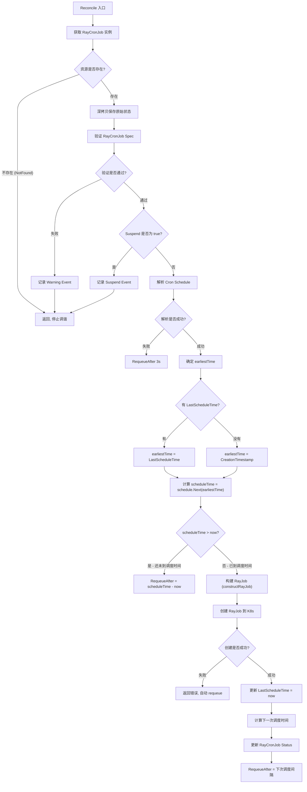
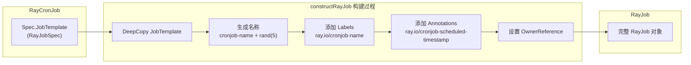
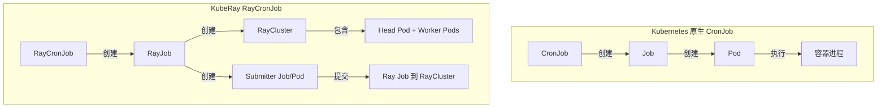
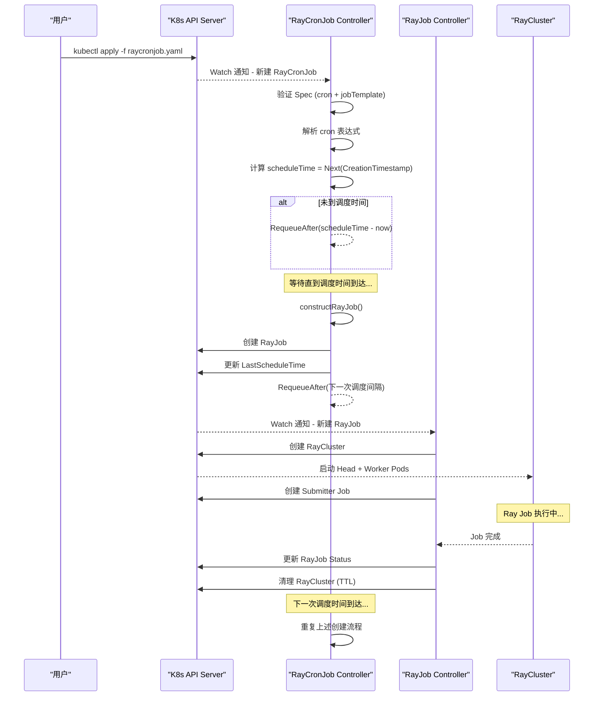

<p align="center">
  
</p>

---

## 前置知识

| 前置知识 | 说明 |
|---------|------|
| Kubernetes CronJob | 了解 K8s 原生 CronJob 的工作原理 |
| RayJob Controller | 理解 KubeRay 中 RayJob 的生命周期管理 |
| controller-runtime | 熟悉 `Reconcile` 模式与 `ctrl.Result` |
| Cron 表达式 | 了解标准五字段 cron 表达式语法 |

> RayCronJob 是 KubeRay v1.6 引入的 Alpha 特性，用于按照 cron 调度定期自动创建 RayJob 实例。它的设计理念类似于 Kubernetes 原生 CronJob 与 Job 的关系 -- RayCronJob 定期创建 RayJob，而 RayJob 负责管理 RayCluster 和 Ray 任务的执行。

---

## 1. RayCronJob Feature Gate

### 1.1 Feature Gate 注册

RayCronJob 功能通过 Kubernetes 标准的 Feature Gate 机制进行管控。Feature Gate 定义位于:

> **文件**: `ray-operator/pkg/features/features.go`

```go
const (
    // owner: @machichima
    // rep: N/A
    // alpha: v1.6
    //
    // Enables RayCronJob controller for scheduled RayJob execution.
    RayCronJob featuregate.Feature = "RayCronJob"
)

var defaultFeatureGates = map[featuregate.Feature]featuregate.FeatureSpec{
    // ... 其他 feature gates ...
    RayCronJob: {Default: false, PreRelease: featuregate.Alpha},
}
```

**关键要点**:

| 属性 | 值 |
|------|------|
| Feature 名称 | `RayCronJob` |
| 阶段 | Alpha |
| 默认值 | `false` (默认关闭) |
| 引入版本 | v1.6 |
| CRD 名称 | `raycronjobs.ray.io` |

### 1.2 启用方式

在部署 KubeRay Operator 时，通过 `--feature-gates` 参数启用:

```bash
# 通过命令行参数启用
--feature-gates=RayCronJob=true

# 如果使用 Helm 部署，可以在 values.yaml 中配置
featureGates:
  RayCronJob: true
```

### 1.3 控制器条件注册

在 Operator 入口文件 `main.go` (L295-L301) 中，RayCronJob 控制器的注册是有条件的:

> **文件**: `ray-operator/main.go` (L295-L301)

```go
if features.Enabled(features.RayCronJob) {
    setupLog.Info("RayCronJob feature gate is enabled, starting RayCronJob controller")
    exitOnError(ray.NewRayCronJobReconciler(mgr).SetupWithManager(mgr, config.ReconcileConcurrency),
        "unable to create controller", "controller", "RayCronJob")
} else {
    setupLog.Info("RayCronJob feature gate is disabled, skipping RayCronJob controller setup")
}
```

这种条件注册模式确保:
- 当 Feature Gate 未启用时，控制器不会启动，不会消耗任何资源
- 日志中会明确记录 Feature Gate 的状态，便于运维排查
- 即使集群中存在 RayCronJob CRD 资源，控制器也不会处理它们

---

## 2. CRD 定义与数据结构

> **文件**: `ray-operator/apis/ray/v1/raycronjob_types.go`

```go
type RayCronJobSpec struct {
    JobTemplate RayJobSpec `json:"jobTemplate"`       // RayJob 模板
    Schedule    string     `json:"schedule"`           // Cron 表达式
    Suspend     bool       `json:"suspend,omitempty"`  // 暂停调度开关
}

type RayCronJobStatus struct {
    LastScheduleTime *metav1.Time `json:"lastScheduleTime,omitempty"`
}
```

**Spec 字段**:

| 字段 | 类型 | 必填 | 说明 |
|------|------|------|------|
| `schedule` | `string` | 是 | 标准 cron 表达式 (五字段格式) |
| `jobTemplate` | `RayJobSpec` | 是 | RayJob 模板，定义每次调度创建的 RayJob 规格 |
| `suspend` | `bool` | 否 | 暂停调度开关，设为 `true` 时不再创建新的 RayJob |

**Status 字段**: `lastScheduleTime` (`*metav1.Time`) - 上一次成功调度的时间。

**kubectl 打印列** (通过 kubebuilder 注解):

```
NAME                SCHEDULE      LAST SCHEDULE          AGE    SUSPEND
raycronjob-sample   */5 * * * *   2024-01-01T00:05:00Z   10m    false
```

---

## 3. RayCronJobReconciler 结构体

### 3.1 结构体定义

> **文件**: `ray-operator/controllers/ray/raycronjob_controller.go` (L31-L36)

```go
type RayCronJobReconciler struct {
    client.Client
    Scheme   *runtime.Scheme
    Recorder record.EventRecorder
    clock    clock.Clock
}
```

| 字段 | 类型 | 说明 |
|------|------|------|
| `Client` | `client.Client` | controller-runtime 提供的 K8s API 客户端，用于 CRUD 操作 |
| `Scheme` | `*runtime.Scheme` | API 资源类型注册表，用于设置 OwnerReference |
| `Recorder` | `record.EventRecorder` | K8s Event 记录器，用于发布事件 |
| `clock` | `clock.Clock` | 时钟接口，生产环境使用 `RealClock`，测试环境可注入 `FakeClock` |

> **设计亮点**: `clock` 字段使用了 `k8s.io/utils/clock` 包的 `Clock` 接口，而非直接调用 `time.Now()`。这使得单元测试可以通过注入 `FakeClock` 来精确控制时间，实现确定性测试。

### 3.2 构造函数与 RBAC

构造函数 `NewRayCronJobReconciler(mgr)` 从 Manager 中获取所有依赖，使用 `RealClock` 作为默认时钟实现，事件记录器标识为 `"raycronjob-controller"`。

**RBAC 权限**:

| 资源 | 权限 | 说明 |
|------|------|------|
| `raycronjobs` | 全部 CRUD | 读取和更新 RayCronJob 对象 |
| `raycronjobs/status` | get, update, patch | 更新调度状态 |
| `rayjobs` | **create** | 仅创建新的 RayJob，不管理已有 RayJob |
| `events` | create, patch | 记录事件 |

> **注意**: 控制器对 RayJob 仅有 `create` 权限。一旦 RayJob 被创建，后续管理完全由 RayJob Controller 接管。

### 3.3 SetupWithManager

> **文件**: `ray-operator/controllers/ray/raycronjob_controller.go` (L180-L195)

| Watch 方式 | 资源 | 说明 |
|-----------|------|------|
| `For()` | `RayCronJob` | 主资源 - 监听 RayCronJob 的所有变更事件 |
| `Owns()` | `RayJob` | 子资源 - 监听由本 RayCronJob 拥有的 RayJob 变更 |

通过 `Owns(&rayv1.RayJob{})` 声明，当子 RayJob 发生变更时也会触发父 RayCronJob 的 Reconcile，为未来扩展（如追踪子 Job 状态、历史记录限制等）提供基础。

---

## 4. Reconcile 流程详解

### 4.1 流程总览

Reconcile 函数是 RayCronJob 控制器的核心逻辑，整体流程简洁而高效。

> **文件**: `ray-operator/controllers/ray/raycronjob_controller.go` (L59-L140)



### 4.2 逐步解析

#### 步骤 1 - 获取 RayCronJob 实例 (L62-L73)

```go
rayCronJobInstance := &rayv1.RayCronJob{}
if err := r.Get(ctx, request.NamespacedName, rayCronJobInstance); err != nil {
    if errors.IsNotFound(err) {
        logger.Info("RayCronJob resource not found.")
        return ctrl.Result{}, nil
    }
    logger.Error(err, "Failed to get RayCronJob")
    return ctrl.Result{RequeueAfter: RayCronJobDefaultRequeueDuration}, err
}
```

- 如果资源已被删除（`NotFound`），返回空 Result 停止调谐
- 其他错误时，3 秒后重新入队

#### 步骤 2 - 深拷贝与验证 (L76-L83)

```go
originalRayCronJobInstance := rayCronJobInstance.DeepCopy()

if err := utils.ValidateRayCronJobSpec(rayCronJobInstance); err != nil {
    r.Recorder.Eventf(rayCronJobInstance, corev1.EventTypeWarning, string(utils.InvalidRayCronJobSpec),
        "%s/%s: %v", rayCronJobInstance.Namespace, rayCronJobInstance.Name, err)
    return ctrl.Result{}, nil
}
```

- **深拷贝**: 保存原始状态用于后续 Status 更新的差异比较
- **验证**: 检查 cron 表达式合法性和 RayJob 模板有效性
- 验证失败时记录 Warning Event 但不返回错误（避免无限重试无效配置）

#### 步骤 3 - 检查暂停状态 (L86-L91)

```go
if rayCronJobInstance.Spec.Suspend {
    logger.V(1).Info("RayCronJob suspended, no new RayJobs will be created.")
    r.Recorder.Eventf(rayCronJobInstance, corev1.EventTypeNormal, string(utils.SuspendedRayCronJob),
        "RayCronJob suspended, no new RayJobs will be created")
    return ctrl.Result{}, nil
}
```

- 当 `Suspend` 为 `true` 时，不创建新 RayJob，也不设置 requeue
- 控制器完全停止对该 RayCronJob 的调度
- 当用户将 `Suspend` 改回 `false` 时，资源变更会自动触发新的 Reconcile

#### 步骤 4 - 解析 Cron 表达式 (L94-L99)

```go
schedule, err := cron.ParseStandard(rayCronJobInstance.Spec.Schedule)
if err != nil {
    logger.Error(err, "Failed to parse validated cron schedule")
    return ctrl.Result{RequeueAfter: RayCronJobDefaultRequeueDuration}, err
}
```

- 使用 `robfig/cron/v3` 库的 `ParseStandard()` 方法解析
- 虽然验证阶段已检查过，但这里再次解析作为防御性编程

#### 步骤 5 - 计算调度时间 (L101-L113)

```go
now := r.clock.Now()

earlistTime := rayCronJobInstance.CreationTimestamp.Time
if rayCronJobInstance.Status.LastScheduleTime != nil {
    earlistTime = rayCronJobInstance.Status.LastScheduleTime.Time
}

scheduleTime := schedule.Next(earlistTime)
if scheduleTime.After(now) {
    return ctrl.Result{RequeueAfter: scheduleTime.Sub(now)}, nil
}
```

**调度时间基准选择逻辑**:

| 场景 | `earliestTime` 值 | 说明 |
|------|-------------------|------|
| 首次调度 | `CreationTimestamp` | CronJob 刚创建，尚未调度过 |
| 后续调度 | `LastScheduleTime` | 基于上次调度时间计算下一次 |

- `schedule.Next(earliestTime)` 返回 `earliestTime` 之后的下一个调度时间点
- 如果调度时间尚未到达，设置精确的 `RequeueAfter` 等待

#### 步骤 6 - 创建 RayJob (L116-L124)

```go
rayJob, err := r.constructRayJob(rayCronJobInstance, scheduleTime)
if err != nil {
    return ctrl.Result{}, err
}
if err := r.Create(ctx, rayJob); err != nil {
    logger.Error(err, "Failed to create RayJob from RayCronJob")
    return ctrl.Result{}, err
}
```

#### 步骤 7 - 更新状态与重新入队 (L125-L139)

```go
rayCronJobInstance.Status.LastScheduleTime = &metav1.Time{Time: now}

nextScheduleTime := schedule.Next(now)
requeueAt := nextScheduleTime.Sub(now)

if err = r.updateRayCronJobStatus(ctx, originalRayCronJobInstance, rayCronJobInstance); err != nil {
    return ctrl.Result{RequeueAfter: RayCronJobDefaultRequeueDuration}, err
}

return ctrl.Result{RequeueAfter: requeueAt}, nil
```

- 将 `LastScheduleTime` 设为当前时间
- 计算下一次调度的等待时间
- 通过 `updateRayCronJobStatus` 仅在状态发生变化时更新

### 4.3 Status 更新策略

`updateRayCronJobStatus()` (L142-L154) 通过比较新旧 `LastScheduleTime` 来决定是否发起 API 调用。只有状态真正发生变化时才执行 `r.Status().Update()`，避免不必要的 API 请求。

---

## 5. constructRayJob 详解

### 5.1 函数实现

> **文件**: `ray-operator/controllers/ray/raycronjob_controller.go` (L156-L177)

```go
func (r *RayCronJobReconciler) constructRayJob(cronJob *rayv1.RayCronJob,
    expectedTimestamp time.Time) (*rayv1.RayJob, error) {
    rayJob := &rayv1.RayJob{
        ObjectMeta: metav1.ObjectMeta{
            Name:      fmt.Sprintf("%s-%s", cronJob.Name, rand.String(5)),
            Namespace: cronJob.Namespace,
            Labels: map[string]string{
                utils.RayCronJobNameLabelKey: cronJob.Name,
            },
            Annotations: map[string]string{
                utils.RayCronJobTimestampAnnotationKey: expectedTimestamp.UTC().Format(time.RFC3339),
            },
        },
        Spec: *cronJob.Spec.JobTemplate.DeepCopy(),
    }

    // Set the ownership in order to do the garbage collection by k8s.
    if err := ctrl.SetControllerReference(cronJob, rayJob, r.Scheme); err != nil {
        return nil, err
    }

    return rayJob, nil
}
```

### 5.2 命名规则

```
{raycronjob-name}-{random-5-char-suffix}
```

示例: 如果 RayCronJob 名称为 `daily-training`，则创建的 RayJob 可能名为 `daily-training-x7k9q`。

使用 `k8s.io/apimachinery/pkg/util/rand.String(5)` 生成 5 位随机后缀，确保名称唯一性。

### 5.3 元数据设置

| 元数据类型 | Key | Value | 用途 |
|-----------|-----|-------|------|
| Label | `ray.io/cronjob-name` | RayCronJob 的名称 | 关联追踪，便于查询某个 CronJob 创建的所有 RayJob |
| Annotation | `ray.io/cronjob-scheduled-timestamp` | 预期调度时间 (RFC3339 格式) | 记录该 RayJob 对应的调度时间点 |

这些元数据定义于常量文件中:

> **文件**: `ray-operator/controllers/ray/utils/constant.go` (L30-L31)

```go
RayCronJobNameLabelKey                   = "ray.io/cronjob-name"
RayCronJobTimestampAnnotationKey         = "ray.io/cronjob-scheduled-timestamp"
```

### 5.4 OwnerReference 与垃圾回收

通过 `ctrl.SetControllerReference(cronJob, rayJob, r.Scheme)` 在 RayJob 的 `ownerReferences` 中添加指向 RayCronJob 的引用（`controller: true`, `blockOwnerDeletion: true`）。

**垃圾回收效果**: 当 RayCronJob 被删除时，Kubernetes 的垃圾回收器会自动级联删除所有由它拥有的 RayJob 资源，而 RayJob Controller 又会进一步清理对应的 RayCluster。

### 5.5 RayJob 构建流程图



---

## 6. Cron Schedule 解析机制

RayCronJob 使用 `github.com/robfig/cron/v3` 库的 `ParseStandard()` 方法解析标准五字段 cron 表达式:

```
┌───────────── minute (0 - 59)
│ ┌───────────── hour (0 - 23)
│ │ ┌───────────── day of the month (1 - 31)
│ │ │ ┌───────────── month (1 - 12)
│ │ │ │ ┌───────────── day of the week (0 - 6, Sunday = 0)
│ │ │ │ │
│ │ │ │ │
* * * * *
```

### 6.1 常用表达式示例

| 表达式 | 含义 |
|--------|------|
| `* * * * *` | 每分钟执行 |
| `*/5 * * * *` | 每 5 分钟执行 |
| `0 * * * *` | 每小时整点执行 |
| `0 2 * * *` | 每天凌晨 2 点执行 |
| `0 0 * * 1` | 每周一午夜执行 |
| `0 0 1 * *` | 每月 1 号午夜执行 |
| `30 8 * * 1-5` | 工作日每天 8:30 执行 |

### 6.2 调度时间计算逻辑

```
schedule.Next(earliestTime) 的工作方式:

输入: earliestTime = 2024-01-01 00:02:00
Cron: */5 * * * *

计算: 从 00:02:00 之后, 下一个匹配 */5 的分钟时刻
输出: 2024-01-01 00:05:00
```

**边界场景处理**:

| 场景 | 行为 |
|------|------|
| 首次调度 & `CreationTimestamp` 恰好在调度时刻 | `Next()` 返回下一个匹配时刻，不包含当前时刻 |
| Operator 重启后恢复 | 基于 `LastScheduleTime` 计算，可能立即触发一次调度 |
| 调度时间已过（如 Operator 宕机期间） | `scheduleTime <= now` 条件满足，立即创建 RayJob |

---

## 7. 验证与事件机制

### 7.1 验证逻辑

> **文件**: `ray-operator/controllers/ray/utils/validation.go` (L684-L701)

`ValidateRayCronJobSpec()` 分两步验证:
1. **Cron 表达式验证** - 使用 `cron.ParseStandard()` 检查语法合法性
2. **RayJob 模板验证** - 复用 `ValidateRayJobSpec()` 检查内嵌的 RayJob 配置

验证失败时，Reconciler 记录 Warning Event 但不返回错误（避免对无效配置进行无限重试）。

### 7.2 事件类型

| 事件类型 | 级别 | 触发条件 |
|---------|------|---------|
| `InvalidRayCronJobSpec` | Warning | Spec 验证失败（非法 cron 表达式或无效 RayJob 模板） |
| `SuspendedRayCronJob` | Normal | `Suspend` 字段为 `true` 时每次 Reconcile 触发 |

可通过 `kubectl describe raycronjob <name>` 或 `kubectl get events --field-selector involvedObject.name=<name>` 查看。

---

## 8. 与 Kubernetes CronJob 的对比

### 8.1 架构对比



### 8.2 详细对比表

| 对比维度 | Kubernetes CronJob | KubeRay RayCronJob |
|---------|-------------------|-------------------|
| **调度目标** | 创建 Kubernetes Job (单 Pod) | 创建 RayJob (RayCluster + Submitter) |
| **计算资源** | 单个 Pod | 完整的 Ray 集群（Head + Workers） |
| **任务类型** | 任意容器化任务 | Ray 分布式任务（训练、推理、数据处理） |
| **Feature Gate** | 无，内置功能 | 需要显式启用 `RayCronJob=true` |
| **成熟度** | GA（稳定） | Alpha（实验性） |
| **Suspend** | 支持 | 支持 |
| **并发策略 (ConcurrencyPolicy)** | Allow / Forbid / Replace | 当前未实现，未来可能支持 |
| **历史记录限制** | `successfulJobsHistoryLimit` / `failedJobsHistoryLimit` | 当前未实现，通过 OwnerReference 级联管理 |
| **起始截止时间** | `startingDeadlineSeconds` | 当前未实现 |
| **清理机制** | Job TTL + History Limit | RayJob TTL (`ttlSecondsAfterFinished`) + OwnerReference GC |
| **子资源生命周期** | Job Controller 管理 Pod | RayJob Controller 管理 RayCluster |

### 8.3 关键差异

- **生命周期管理链路**: K8s CronJob 为 `CronJob -> Job -> Pod`（两层），RayCronJob 为 `RayCronJob -> RayJob -> RayCluster -> Pods`（三到四层）
- **清理策略**: K8s CronJob 通过 `successfulJobsHistoryLimit` / `failedJobsHistoryLimit` 清理历史 Job；RayCronJob 通过 OwnerReference 级联删除 + RayJob `ttlSecondsAfterFinished` TTL 机制清理

---

## 9. 使用示例

### 9.1 基本 RayCronJob 配置

> **完整示例参考**: `ray-operator/config/samples/ray-cronjob.sample.yaml`

```yaml
apiVersion: ray.io/v1
kind: RayCronJob
metadata:
  name: raycronjob-sample
spec:
  schedule: "* * * * *"       # Cron 调度表达式 - 每分钟执行
  # suspend: false            # 暂停调度开关 (可选, 默认 false)
  jobTemplate:
    entrypoint: python /home/ray/samples/sample_code.py
    shutdownAfterJobFinishes: true
    ttlSecondsAfterFinished: 600
    rayClusterSpec:
      rayVersion: '2.52.0'
      headGroupSpec:
        rayStartParams: {}
        template:
          spec:
            containers:
            - name: ray-head
              image: rayproject/ray:2.52.0
              resources:
                limits:
                  cpu: "1"
                  memory: "5Gi"
                requests:
                  cpu: "200m"
      workerGroupSpecs:
      - replicas: 1
        minReplicas: 1
        maxReplicas: 5
        groupName: small-group
        rayStartParams: {}
        template:
          spec:
            containers:
            - name: ray-worker
              image: rayproject/ray:2.52.0
              resources:
                limits:
                  cpu: "1"
```

### 9.2 常见使用场景

| 场景 | Schedule | Entrypoint 示例 | 说明 |
|------|----------|-----------------|------|
| 每日模型训练 | `0 2 * * *` | `python /app/train.py --epochs=10` | 凌晨 2 点触发，配合 GPU 资源 |
| 每小时数据处理 | `0 * * * *` | `python /app/etl_pipeline.py` | 每小时整点执行 ETL 流水线 |
| 每周模型评估 | `0 6 * * 1` | `python /app/evaluate.py --model=latest` | 周一早 6 点评估最新模型 |
| 每 5 分钟健康检查 | `*/5 * * * *` | `python /app/health_check.py` | 高频次轻量级检测 |

> **提示**: 所有场景建议设置 `shutdownAfterJobFinishes: true` 和合理的 `ttlSecondsAfterFinished`，确保 RayCluster 在任务完成后被及时清理。

### 9.3 操作命令

```bash
# 启用 Feature Gate 后部署 Operator
helm install kuberay-operator kuberay/kuberay-operator \
  --set featureGates.RayCronJob=true

# 创建 RayCronJob
kubectl apply -f raycronjob-sample.yaml

# 查看 RayCronJob 状态
kubectl get raycronjob

# 查看由 CronJob 创建的所有 RayJob
kubectl get rayjob -l ray.io/cronjob-name=raycronjob-sample

# 暂停调度
kubectl patch raycronjob raycronjob-sample --type=merge -p '{"spec":{"suspend":true}}'

# 恢复调度
kubectl patch raycronjob raycronjob-sample --type=merge -p '{"spec":{"suspend":false}}'

# 查看事件
kubectl describe raycronjob raycronjob-sample

# 删除 RayCronJob（会级联删除所有子 RayJob）
kubectl delete raycronjob raycronjob-sample
```

---

## 10. 单元测试与 E2E 测试

**单元测试** (`ray-operator/controllers/ray/raycronjob_controller_unit_test.go`):

| 测试名称 | 测试内容 |
|---------|---------|
| `TestRayCronJobReconcile_InvalidSchedule` | 非法 cron 表达式应记录 Warning Event 而不报错 |
| `TestRayCronJobReconcile_FirstSchedule` | 首次调度时基于 `CreationTimestamp` 计算下一次时间 |
| `TestRayCronJobReconcile_CreateRayJob` | 到达调度时间后应创建 RayJob 并更新 Status |
| `TestRayCronJobReconcile_Suspend` | `Suspend=true` 时不应创建 RayJob |
| `TestUpdateRayCronJobStatus` | Status 更新的差异比较逻辑 |

测试中通过 `clocktesting.NewFakeClock(fakeCurrTime)` 注入 `FakeClock`，实现对时间的精确控制。

**E2E 测试** (`ray-operator/test/e2eraycronjob/raycronjob_suspend_test.go`): 验证 Suspend 功能完整流程 -- 创建暂停的 CronJob、确认 130 秒内无 RayJob 创建、恢复后验证 RayJob 出现、最终清理。

---

## 11. 常见问题与调试

**RayCronJob 不触发调度 - 检查清单**:

| 检查项 | 命令 | 期望结果 |
|--------|------|---------|
| Feature Gate 是否启用 | 查看 Operator 启动日志 | `"RayCronJob feature gate is enabled"` |
| CRD 是否安装 | `kubectl get crd raycronjobs.ray.io` | CRD 存在 |
| Suspend 是否为 false | `kubectl get raycronjob -o yaml` | `spec.suspend: false` |
| Cron 表达式是否合法 | `kubectl describe raycronjob <name>` | 无 `InvalidRayCronJobSpec` 事件 |

**RayJob 创建后未执行**: RayCronJob 控制器仅负责创建 RayJob。如果 RayJob 创建成功但未正常执行，需要排查 RayJob Controller。

### 11.1 调度时间序列图

下面展示一个完整的 RayCronJob 调度周期中，各组件的交互时序:



---

## 总结

RayCronJob Controller 是 KubeRay 生态中一个简洁而实用的组件，其核心设计特点:

1. **Feature Gate 保护** - Alpha 阶段默认关闭，需要显式启用，降低了对已有系统的影响
2. **职责单一** - 仅负责按照 cron 调度创建 RayJob，不涉及 RayJob/RayCluster 的生命周期管理
3. **可测试性** - 通过 `clock.Clock` 接口实现时间抽象，支持确定性单元测试
4. **Kubernetes 原生** - 利用 OwnerReference 实现级联删除，利用 Labels/Annotations 实现关联查询
5. **精确重入队** - 通过精确计算 `RequeueAfter` 避免不必要的 Reconcile 循环

整个控制器仅 196 行代码，是学习 Kubernetes 控制器开发模式的优秀入门案例。

---

## 延伸阅读

- [Kubernetes CronJob 官方文档](https://kubernetes.io/docs/concepts/workloads/controllers/cron-jobs/) - Kubernetes 原生 CronJob 工作原理，RayCronJob 的设计灵感来源
- [robfig/cron 库文档](https://pkg.go.dev/github.com/robfig/cron/v3) - Go 语言 cron 表达式解析库，RayCronJob 使用的核心调度依赖
- [Ray Jobs 官方文档](https://docs.ray.io/en/latest/cluster/running-applications/job-submission/index.html) - Ray Job 提交与管理的完整参考
- [RayJob 生命周期](../03-rayjob-controller/01-rayjob-lifecycle.md) - 深入了解 RayJob 的状态机与生命周期管理，是理解 RayCronJob 创建的 RayJob 行为的基础

---

## 导航

| 方向 | 链接 |
|------|------|
| 上一篇 | 返回上级目录 |
| **下一篇** | [监控指标与可观测性 - Metrics and Monitoring](02-metrics-and-monitoring.md) |
