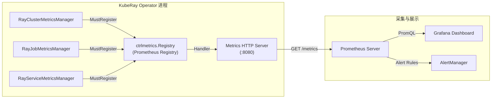
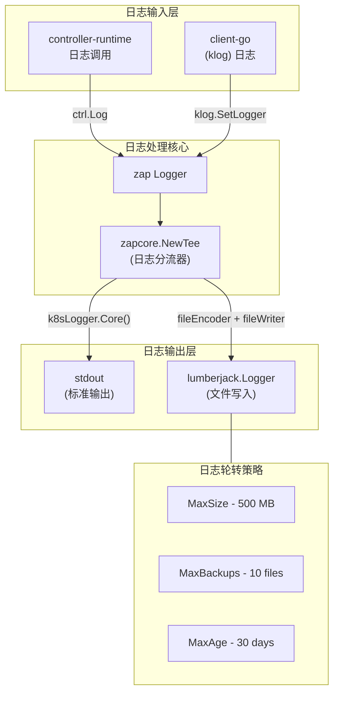
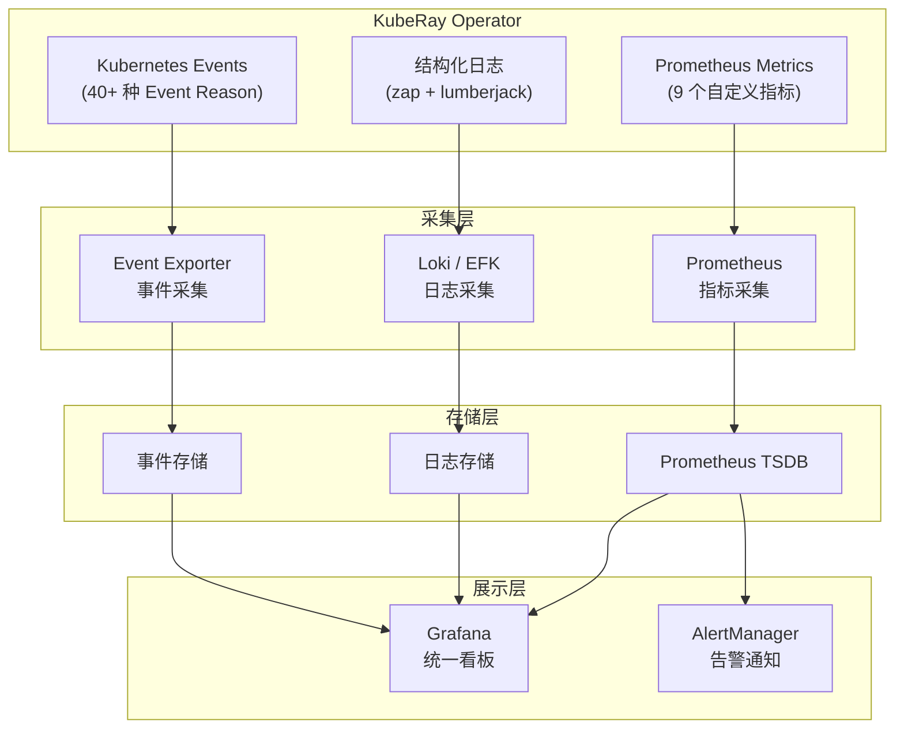

---

## 前置知识

在开始本文之前，请确保你已具备以下环境和知识储备：

| 条件 | 说明 | 最低版本 |
|------|------|----------|
| Go 开发环境 | 编译和运行 KubeRay Operator | Go 1.22+ |
| Kubernetes 集群 | Kind / Minikube / 生产集群均可 | v1.26+ |
| kubectl | 集群管理工具 | 与集群版本匹配 |
| Prometheus | 指标采集与存储 | v2.45+ |
| Grafana (可选) | 可视化面板 | v10.0+ |
| controller-runtime 基础 | 理解 Metrics Server、Registry 概念 | - |
| Prometheus client_golang 基础 | 理解 Collector 接口、Gauge/Counter 类型 | - |

---

## 目录

- [1. KubeRay Metrics 体系概览](#1-kuberay-metrics-体系概览)
- [2. RayClusterMetricsManager 详解](#2-rayclustermetricsmanager-详解)
- [3. RayJobMetricsManager 详解](#3-rayjobmetricsmanager-详解)
- [4. RayServiceMetricsManager 详解](#4-rayservicemetricsmanager-详解)
- [5. Metrics 注册与采集流程](#5-metrics-注册与采集流程)
- [6. Prometheus ServiceMonitor 配置](#6-prometheus-servicemonitor-配置)
- [7. 日志系统](#7-日志系统)
- [8. Kubernetes Events 体系](#8-kubernetes-events-体系)
- [9. 监控最佳实践](#9-监控最佳实践)
- [延伸阅读](#延伸阅读)

---

## 1. KubeRay Metrics 体系概览

KubeRay Operator 内置了一套基于 Prometheus 标准的指标暴露体系，为运维人员提供对 RayCluster、RayJob、RayService 三大核心资源的实时观测能力。

### 1.1 启用方式

指标功能默认关闭，需要在启动 Operator 时通过命令行参数显式开启：

```bash
# 通过 flag 启用 metrics
go run ./main.go --enable-metrics=true --metrics-addr=:8080
```

> **源码位置**: `ray-operator/main.go` L106
> ```go
> flag.BoolVar(&enableMetrics, "enable-metrics", false,
>     "Enable the emission of control plane metrics.")
> ```

关键启动参数一览：

| 参数 | 默认值 | 说明 |
|------|--------|------|
| `--enable-metrics` | `false` | 是否启用控制平面指标 |
| `--metrics-addr` | `:8080` | Metrics HTTP 端点绑定地址 |
| `--health-probe-bind-address` | `:8082` | 健康检查端点绑定地址 |

### 1.2 技术栈

KubeRay 的指标体系构建在以下技术栈之上：

| 组件 | 用途 |
|------|------|
| `prometheus/client_golang` | Prometheus Go 客户端，提供 Collector 接口、Gauge/Counter 等指标类型 |
| `controller-runtime/pkg/metrics` | controller-runtime 内置的 Metrics Registry |
| `controller-runtime/pkg/metrics/server` | Metrics HTTP Server，暴露 `/metrics` 端点 |

### 1.3 三大 MetricsManager

KubeRay 为每种核心 CRD 分别实现了独立的 MetricsManager：

| Manager | 文件 | 行数 | 对应资源 |
|---------|------|------|----------|
| `RayClusterMetricsManager` | `ray-operator/controllers/ray/metrics/ray_cluster_metrics.go` | 127 行 | RayCluster |
| `RayJobMetricsManager` | `ray-operator/controllers/ray/metrics/ray_job_metrics.go` | 116 行 | RayJob |
| `RayServiceMetricsManager` | `ray-operator/controllers/ray/metrics/ray_service_metrics.go` | 105 行 | RayService |

三者均实现了 `prometheus.Collector` 接口（`Describe` + `Collect` 方法），并在启动时注册到 controller-runtime 的全局 `ctrlmetrics.Registry`。

### 1.4 指标采集与暴露链路



**数据流说明**：

1. Operator 启动时创建三个 MetricsManager 并注册到 Registry
2. controller-runtime 的 Metrics Server 在 `:8080` 端口暴露 `/metrics` 端点
3. Prometheus 通过 ServiceMonitor 或静态配置定期抓取该端点
4. 每次抓取时，Registry 依次调用各 Manager 的 `Collect()` 方法
5. 各 Manager 通过 K8s client 实时 List 对应 CR，计算并返回指标
6. Grafana 从 Prometheus 查询数据进行可视化

---

## 2. RayClusterMetricsManager 详解

> **源码**: `ray-operator/controllers/ray/metrics/ray_cluster_metrics.go`

### 2.1 数据结构

```go
type RayClusterMetricsManager struct {
    rayClusterProvisionedDurationSeconds *prometheus.GaugeVec
    rayClusterInfo                       *prometheus.Desc
    rayClusterConditionProvisioned       *prometheus.Desc
    client                               client.Client
    log                                  logr.Logger
}
```

该结构体中：
- `rayClusterProvisionedDurationSeconds` 是一个 `GaugeVec`，支持通过 `WithLabelValues()` 动态写入值，也支持通过 `DeletePartialMatch()` 清理过期指标
- `rayClusterInfo` 和 `rayClusterConditionProvisioned` 是 `*prometheus.Desc`（描述符），在 `Collect()` 中通过 `MustNewConstMetric()` 动态生成指标值

### 2.2 暴露指标

#### (1) `kuberay_cluster_provisioned_duration_seconds`

| 属性 | 值 |
|------|-----|
| 类型 | Gauge |
| 标签 | `name`, `namespace`, `uid` |
| 含义 | RayCluster 从 `RayClusterProvisioned` 状态为 false（或未设置）到变为 true 的耗时（秒） |
| 写入时机 | 控制器调用 `ObserveRayClusterProvisionedDuration()` 时 |

```go
func (r *RayClusterMetricsManager) ObserveRayClusterProvisionedDuration(
    name, namespace string, uid types.UID, duration float64) {
    r.rayClusterProvisionedDurationSeconds.
        WithLabelValues(name, namespace, string(uid)).Set(duration)
}
```

#### (2) `kuberay_cluster_info`

| 属性 | 值 |
|------|-----|
| 类型 | Gauge (常量值 1) |
| 标签 | `name`, `namespace`, `uid`, `owner_kind` |
| 含义 | RayCluster 的元数据信息。`owner_kind` 表示该集群由哪种 CRD 创建 |
| `owner_kind` 取值 | `None`（直接创建）、`RayJob`、`RayService` |

```go
func (r *RayClusterMetricsManager) collectRayClusterInfo(
    cluster *rayv1.RayCluster, ch chan<- prometheus.Metric) {
    ownerKind := "None"
    if v, ok := cluster.Labels[utils.RayOriginatedFromCRDLabelKey]; ok {
        ownerKind = v
    }
    ch <- prometheus.MustNewConstMetric(
        r.rayClusterInfo, prometheus.GaugeValue, 1,
        cluster.Name, cluster.Namespace, string(cluster.UID), ownerKind,
    )
}
```

#### (3) `kuberay_cluster_condition_provisioned`

| 属性 | 值 |
|------|-----|
| 类型 | Gauge (常量值 1) |
| 标签 | `name`, `namespace`, `uid`, `condition` |
| 含义 | RayCluster 的 Provisioned 条件状态。`condition` 标签值为 `"true"` 或 `"false"` |

```go
func (r *RayClusterMetricsManager) collectRayClusterConditionProvisioned(
    cluster *rayv1.RayCluster, ch chan<- prometheus.Metric) {
    ch <- prometheus.MustNewConstMetric(
        r.rayClusterConditionProvisioned, prometheus.GaugeValue, 1,
        cluster.Name, cluster.Namespace, string(cluster.UID),
        strconv.FormatBool(meta.IsStatusConditionTrue(
            cluster.Status.Conditions,
            string(rayv1.RayClusterProvisioned))),
    )
}
```

### 2.3 采集逻辑

`Collect()` 方法在每次 Prometheus 抓取时被调用：

```go
func (r *RayClusterMetricsManager) Collect(ch chan<- prometheus.Metric) {
    // 1. 先输出 GaugeVec 中已记录的 provisioned duration 指标
    r.rayClusterProvisionedDurationSeconds.Collect(ch)

    // 2. 实时 List 所有 RayCluster，生成 info 和 condition 指标
    var rayClusterList rayv1.RayClusterList
    err := r.client.List(context.Background(), &rayClusterList)
    if err != nil {
        r.log.Error(err, "Failed to list RayClusters")
        return
    }
    for _, rayCluster := range rayClusterList.Items {
        r.collectRayClusterInfo(&rayCluster, ch)
        r.collectRayClusterConditionProvisioned(&rayCluster, ch)
    }
}
```

### 2.4 指标清理

当 RayCluster 被删除时，控制器调用 `DeleteRayClusterMetrics()` 清理对应的 provisioned duration 指标，防止过期数据残留：

```go
func (r *RayClusterMetricsManager) DeleteRayClusterMetrics(name, namespace string) {
    numCleanedUpMetrics := r.rayClusterProvisionedDurationSeconds.
        DeletePartialMatch(prometheus.Labels{"name": name, "namespace": namespace})
    r.log.Info("Cleaned up expired RayCluster metric",
        "name", name, "namespace", namespace,
        "numCleanedUpMetrics", numCleanedUpMetrics)
}
```

---

## 3. RayJobMetricsManager 详解

> **源码**: `ray-operator/controllers/ray/metrics/ray_job_metrics.go`

### 3.1 数据结构

```go
type RayJobMetricsManager struct {
    rayJobExecutionDurationSeconds *prometheus.GaugeVec
    rayJobInfo                     *prometheus.Desc
    rayJobDeploymentStatus         *prometheus.Desc
    client                         client.Client
    log                            logr.Logger
}
```

### 3.2 暴露指标

#### (1) `kuberay_job_execution_duration_seconds`

| 属性 | 值 |
|------|-----|
| 类型 | Gauge |
| 标签 | `name`, `namespace`, `uid`, `job_deployment_status`, `retry_count` |
| 含义 | 从 RayJob CR 的 `JobDeploymentStatus` 由 Initializing 转变为 Retrying 或终态（Complete/Failed）的耗时 |
| 写入时机 | 控制器调用 `ObserveRayJobExecutionDuration()` 时 |

```go
func (r *RayJobMetricsManager) ObserveRayJobExecutionDuration(
    name, namespace string, uid types.UID,
    jobDeploymentStatus rayv1.JobDeploymentStatus,
    retryCount int, duration float64) {
    r.rayJobExecutionDurationSeconds.
        WithLabelValues(name, namespace, string(uid),
            string(jobDeploymentStatus),
            strconv.Itoa(retryCount)).Set(duration)
}
```

> **注意**: `retry_count` 标签表示当前重试次数，仅在 `spec.backoffLimit` 启用时有意义。Retrying 状态表示 CR 此前失败并将进行重试。

#### (2) `kuberay_job_info`

| 属性 | 值 |
|------|-----|
| 类型 | Gauge (常量值 1) |
| 标签 | `name`, `namespace`, `uid` |
| 含义 | RayJob 的元数据信息 |

#### (3) `kuberay_job_deployment_status`

| 属性 | 值 |
|------|-----|
| 类型 | Gauge (常量值 1) |
| 标签 | `name`, `namespace`, `uid`, `deployment_status` |
| 含义 | RayJob 当前的部署状态。`deployment_status` 的值直接取自 `status.jobDeploymentStatus` 字段 |

```go
func (r *RayJobMetricsManager) collectRayJobDeploymentStatus(
    rayJob *rayv1.RayJob, ch chan<- prometheus.Metric) {
    ch <- prometheus.MustNewConstMetric(
        r.rayJobDeploymentStatus, prometheus.GaugeValue, 1,
        rayJob.Name, rayJob.Namespace, string(rayJob.UID),
        string(rayJob.Status.JobDeploymentStatus),
    )
}
```

### 3.3 采集与清理

采集逻辑与 RayClusterMetricsManager 类似 - 先输出 GaugeVec 已有数据，再实时 List 所有 RayJob 生成 info 和 status 指标。清理逻辑通过 `DeleteRayJobMetrics()` 按 `name` + `namespace` 部分匹配删除。

---

## 4. RayServiceMetricsManager 详解

> **源码**: `ray-operator/controllers/ray/metrics/ray_service_metrics.go`

### 4.1 数据结构

```go
type RayServiceMetricsManager struct {
    rayServiceInfo                       *prometheus.Desc
    rayServiceConditionReady             *prometheus.Desc
    rayServiceConditionUpgradeInProgress *prometheus.Desc
    client                               client.Client
    log                                  logr.Logger
}
```

与前两个 Manager 不同，RayServiceMetricsManager **没有** `GaugeVec` 字段 - 所有指标都是在 `Collect()` 时通过 `MustNewConstMetric()` 实时生成的。这意味着无需专门的清理方法。

### 4.2 暴露指标

#### (1) `kuberay_service_info`

| 属性 | 值 |
|------|-----|
| 类型 | Gauge (常量值 1) |
| 标签 | `name`, `namespace`, `uid` |
| 含义 | RayService 的元数据信息 |

#### (2) `kuberay_service_condition_ready`

| 属性 | 值 |
|------|-----|
| 类型 | Gauge (常量值 1) |
| 标签 | `name`, `namespace`, `uid`, `condition` |
| 含义 | RayService 是否就绪。Ready 意味着用户可以向底层集群发送请求且 Serve 端点数量大于 0 |

#### (3) `kuberay_service_condition_upgrade_in_progress`

| 属性 | 值 |
|------|-----|
| 类型 | Gauge (常量值 1) |
| 标签 | `name`, `namespace`, `uid`, `condition` |
| 含义 | RayService 是否正在执行零停机升级 |

```go
func (c *RayServiceMetricsManager) collectRayServiceConditionMetrics(
    service *rayv1.RayService, ch chan<- prometheus.Metric) {
    ready := meta.IsStatusConditionTrue(
        service.Status.Conditions, string(rayv1.RayServiceReady))
    ch <- prometheus.MustNewConstMetric(
        c.rayServiceConditionReady, prometheus.GaugeValue, 1,
        service.Name, service.Namespace, string(service.UID),
        strconv.FormatBool(ready),
    )
    upgradeInProgress := meta.IsStatusConditionTrue(
        service.Status.Conditions, string(rayv1.UpgradeInProgress))
    ch <- prometheus.MustNewConstMetric(
        c.rayServiceConditionUpgradeInProgress, prometheus.GaugeValue, 1,
        service.Name, service.Namespace, string(service.UID),
        strconv.FormatBool(upgradeInProgress),
    )
}
```

### 4.3 全部指标汇总表

下表汇总了 KubeRay Operator 暴露的全部 9 个自定义指标：

| 指标名称 | 类型 | 资源 | 标签 | 说明 |
|----------|------|------|------|------|
| `kuberay_cluster_provisioned_duration_seconds` | Gauge | RayCluster | name, namespace, uid | 集群供应耗时 |
| `kuberay_cluster_info` | Gauge | RayCluster | name, namespace, uid, owner_kind | 集群元数据 |
| `kuberay_cluster_condition_provisioned` | Gauge | RayCluster | name, namespace, uid, condition | 供应状态 |
| `kuberay_job_execution_duration_seconds` | Gauge | RayJob | name, namespace, uid, job_deployment_status, retry_count | 任务执行耗时 |
| `kuberay_job_info` | Gauge | RayJob | name, namespace, uid | 任务元数据 |
| `kuberay_job_deployment_status` | Gauge | RayJob | name, namespace, uid, deployment_status | 部署状态 |
| `kuberay_service_info` | Gauge | RayService | name, namespace, uid | 服务元数据 |
| `kuberay_service_condition_ready` | Gauge | RayService | name, namespace, uid, condition | 就绪状态 |
| `kuberay_service_condition_upgrade_in_progress` | Gauge | RayService | name, namespace, uid, condition | 升级进行中 |

---

## 5. Metrics 注册与采集流程

> **源码**: `ray-operator/main.go` L249-263

### 5.1 注册流程

在 `main()` 函数中，当 `config.EnableMetrics` 为 `true` 时，执行以下注册逻辑：

```go
var rayClusterMetricsManager *metrics.RayClusterMetricsManager
var rayJobMetricsManager *metrics.RayJobMetricsManager
var rayServiceMetricsManager *metrics.RayServiceMetricsManager

if config.EnableMetrics {
    mgrClient := mgr.GetClient()
    rayClusterMetricsManager = metrics.NewRayClusterMetricsManager(ctx, mgrClient)
    rayJobMetricsManager = metrics.NewRayJobMetricsManager(ctx, mgrClient)
    rayServiceMetricsManager = metrics.NewRayServiceMetricsManager(ctx, mgrClient)
    ctrlmetrics.Registry.MustRegister(
        rayClusterMetricsManager,
        rayJobMetricsManager,
        rayServiceMetricsManager,
    )
}
```

**关键细节**：

1. **`mgr.GetClient()`** - 获取带缓存的 K8s 客户端，各 Manager 在 `Collect()` 时通过此客户端 List CR
2. **`ctrlmetrics.Registry`** - controller-runtime 的全局 Prometheus Registry，内置了 Go runtime 指标和 controller-runtime 自身指标
3. **`MustRegister()`** - 如果注册失败（如指标名冲突），直接 panic，确保启动时即发现问题

### 5.2 Metrics Server 配置

```go
options := ctrl.Options{
    Metrics: metricsserver.Options{
        BindAddress: config.MetricsAddr,  // 默认 :8080
    },
    // ...
}
```

controller-runtime 的 Metrics Server 会：
- 在 `BindAddress` 上启动 HTTP 服务
- 注册 `/metrics` 路由，使用 `ctrlmetrics.Registry` 作为 Handler
- 支持 Prometheus 文本格式（text/plain）和 OpenMetrics 格式

### 5.3 采集时序

当 Prometheus 发起 `GET /metrics` 请求时，完整的采集时序如下：

1. Metrics HTTP Server 接收请求
2. Handler 遍历 Registry 中所有已注册的 Collector
3. 对每个 MetricsManager 依次调用 `Collect(ch)`
4. Manager 内部通过 `client.List()` 从 API Server（或 Informer 缓存）获取全量 CR 列表
5. 遍历 CR 列表，为每个 CR 生成对应的 `prometheus.Metric`，写入 channel
6. Handler 将所有指标序列化为 Prometheus 文本格式返回

> **性能考量**: 每次 scrape 都会触发一次 `client.List()` 操作。由于 controller-runtime 默认使用带缓存的客户端，List 操作实际上是从本地 Informer 缓存中读取，不会对 API Server 产生额外压力。

---

## 6. Prometheus ServiceMonitor 配置

### 6.1 基本 ServiceMonitor

如果集群中已安装 Prometheus Operator，可以通过 `ServiceMonitor` CRD 自动配置指标采集：

```yaml
apiVersion: monitoring.coreos.com/v1
kind: ServiceMonitor
metadata:
  name: kuberay-operator
  namespace: kuberay-system
  labels:
    app.kubernetes.io/name: kuberay-operator
spec:
  selector:
    matchLabels:
      app.kubernetes.io/name: kuberay-operator
  namespaceSelector:
    matchNames:
      - kuberay-system
  endpoints:
    - port: metrics        # 需与 Service 中端口名匹配
      interval: 30s        # 采集间隔
      scrapeTimeout: 10s   # 单次采集超时
      path: /metrics       # 指标端点路径
```

### 6.2 对应的 Service 配置

确保 Operator 的 Service 暴露了 metrics 端口：

```yaml
apiVersion: v1
kind: Service
metadata:
  name: kuberay-operator-metrics
  namespace: kuberay-system
  labels:
    app.kubernetes.io/name: kuberay-operator
spec:
  selector:
    app.kubernetes.io/name: kuberay-operator
  ports:
    - name: metrics
      port: 8080
      targetPort: 8080
      protocol: TCP
```

### 6.3 采集间隔建议

| 场景 | 建议间隔 | 理由 |
|------|----------|------|
| 开发/测试环境 | 15s | 快速观测变化，便于调试 |
| 生产环境 - 一般工作负载 | 30s | 平衡实时性与资源开销 |
| 生产环境 - 大规模集群（100+ CR） | 60s | 降低 List 操作频率，减少缓存压力 |

### 6.4 无 Prometheus Operator 时的静态配置

如果直接使用 Prometheus Server，在 `prometheus.yml` 中添加：

```yaml
scrape_configs:
  - job_name: 'kuberay-operator'
    kubernetes_sd_configs:
      - role: endpoints
        namespaces:
          names:
            - kuberay-system
    relabel_configs:
      - source_labels:
          - __meta_kubernetes_service_label_app_kubernetes_io_name
        regex: kuberay-operator
        action: keep
      - source_labels:
          - __meta_kubernetes_endpoint_port_name
        regex: metrics
        action: keep
    scrape_interval: 30s
    metrics_path: /metrics
```

---

## 7. 日志系统

> **源码**: `ray-operator/main.go` L110-178

KubeRay Operator 的日志系统基于 `zap` 构建，支持多输出目标和日志轮转，满足生产环境对日志管理的需求。

### 7.1 日志系统架构



### 7.2 相关启动参数

| 参数 | 默认值 | 说明 |
|------|--------|------|
| `--log-file-path` | `""` (空) | 日志文件路径。为空时仅输出到 stdout |
| `--log-file-encoder` | `json` | 文件日志编码格式，支持 `json` 或 `console` |
| `--log-stdout-encoder` | `json` | 标准输出编码格式，支持 `json` 或 `console` |

### 7.3 编码器配置

```go
// ray-operator/main.go L343-356
func newLogEncoder(encoderType string) (zapcore.Encoder, error) {
    pe := zap.NewProductionEncoderConfig()
    pe.EncodeTime = zapcore.ISO8601TimeEncoder  // ISO8601 时间格式

    if encoderType == "json" || encoderType == "" {
        return zapcore.NewJSONEncoder(pe), nil
    }
    if encoderType == "console" {
        return zapcore.NewConsoleEncoder(pe), nil
    }
    return nil, fmt.Errorf(
        "invalid encoder %q (must be 'json' or 'console')", encoderType)
}
```

**时间戳格式**: 无论 JSON 还是 Console 编码器，时间字段都使用 ISO8601 格式（如 `2024-01-15T10:30:45.123Z`），便于日志聚合系统解析。

### 7.4 Lumberjack 日志轮转

当 `--log-file-path` 非空时，启用文件日志写入与自动轮转：

```go
fileWriter := &lumberjack.Logger{
    Filename:   config.LogFile,
    MaxSize:    500, // megabytes - 单个文件最大 500MB
    MaxBackups: 10,  // files    - 最多保留 10 个备份文件
    MaxAge:     30,  // days     - 备份文件最多保留 30 天
}
```

| 参数 | 值 | 说明 |
|------|-----|------|
| `Filename` | 用户指定路径 | 日志文件的完整路径 |
| `MaxSize` | 500 MB | 单个日志文件达到此大小后触发轮转 |
| `MaxBackups` | 10 个 | 保留的旧日志文件最大数量 |
| `MaxAge` | 30 天 | 旧日志文件的最大保留天数 |

### 7.5 双输出 Tee 模式

当文件路径配置后，通过 `zapcore.NewTee()` 实现日志同时输出到 stdout 和文件：

```go
combineLogger := zap.New(zapcore.NewTee(
    k8sLogger.Core(),                                               // stdout
    zapcore.NewCore(fileEncoder, zapcore.AddSync(fileWriter), zap.InfoLevel), // file
)).WithOptions(zapOpts...)
combineLoggerR := zapr.NewLogger(combineLogger)

ctrl.SetLogger(combineLoggerR)  // 设置为 controller-runtime 默认 logger
klog.SetLogger(combineLoggerR)  // 同时接管 client-go 的 klog 输出
```

**关键点**：
- 文件写入仅记录 `InfoLevel` 及以上级别的日志
- `klog.SetLogger()` 确保 `client-go` 产生的日志也使用统一的 JSON/Console 格式输出，而非 klog 默认的非结构化格式
- `zapr.NewLogger()` 将 `zap.Logger` 适配为 `logr.Logger` 接口，供 controller-runtime 使用

### 7.6 日志输出示例

**JSON 格式** (默认):

```json
{
  "level": "info",
  "ts": "2024-01-15T10:30:45.123Z",
  "logger": "controllers.RayCluster",
  "msg": "Reconciling RayCluster",
  "name": "my-cluster",
  "namespace": "default"
}
```

**Console 格式**:

```
2024-01-15T10:30:45.123Z  info  controllers.RayCluster  Reconciling RayCluster  {"name": "my-cluster", "namespace": "default"}
```

---

## 8. Kubernetes Events 体系

KubeRay Operator 广泛使用 Kubernetes Events 机制来记录资源生命周期中的关键操作和异常情况。Events 是 Kubernetes 原生的审计和调试工具，用户可以通过 `kubectl describe` 直接查看。

### 8.1 EventRecorder 集成

每个控制器在初始化时都会创建自己的 `EventRecorder`：

```go
// RayCluster Controller
func NewReconciler(ctx context.Context, mgr manager.Manager,
    options RayClusterReconcilerOptions) *RayClusterReconciler {
    return &RayClusterReconciler{
        // ...
        Recorder: mgr.GetEventRecorderFor("raycluster-controller"),
    }
}

// RayJob Controller
func NewRayJobReconciler(ctx context.Context, mgr manager.Manager,
    options RayJobReconcilerOptions) *RayJobReconciler {
    return &RayJobReconciler{
        // ...
        Recorder: mgr.GetEventRecorderFor("rayjob-controller"),
    }
}
```

### 8.2 Event 类型与使用方式

KubeRay 使用两种标准 Event 类型：

| Event 类型 | 常量 | 使用场景 |
|-----------|------|----------|
| `Normal` | `corev1.EventTypeNormal` | 成功的操作（创建、删除、更新资源等） |
| `Warning` | `corev1.EventTypeWarning` | 失败的操作、无效的配置、异常状态 |

典型调用方式：

```go
// 成功事件
r.Recorder.Eventf(rayJobInstance, corev1.EventTypeNormal,
    string(utils.CreatedRayCluster),
    "Created RayCluster %s/%s", cluster.Namespace, cluster.Name)

// 失败事件
r.Recorder.Eventf(rayJobInstance, corev1.EventTypeWarning,
    string(utils.FailedToCreateRayCluster),
    "Failed to create RayCluster %s/%s: %v", cluster.Namespace, cluster.Name, err)
```

### 8.3 完整 Event 类型清单

> **源码**: `ray-operator/controllers/ray/utils/constant.go` L322-417

所有 Event Reason 类型定义为 `K8sEventType` 字符串类型：

#### RayCluster 相关 Events

| Reason | Event 类型 | 说明 |
|--------|-----------|------|
| `InvalidRayClusterStatus` | Warning | RayCluster Status 不合法 |
| `InvalidRayClusterSpec` | Warning | RayCluster Spec 不合法 |
| `InvalidRayClusterMetadata` | Warning | RayCluster Metadata 不合法 |

#### Head Pod 相关 Events

| Reason | Event 类型 | 说明 |
|--------|-----------|------|
| `CreatedHeadPod` | Normal | 成功创建 Head Pod |
| `FailedToCreateHeadPod` | Warning | 创建 Head Pod 失败 |
| `DeletedHeadPod` | Normal | 成功删除 Head Pod |
| `FailedToDeleteHeadPod` | Warning | 删除 Head Pod 失败 |

#### Worker Pod 相关 Events

| Reason | Event 类型 | 说明 |
|--------|-----------|------|
| `CreatedWorkerPod` | Normal | 成功创建 Worker Pod |
| `FailedToCreateWorkerPod` | Warning | 创建 Worker Pod 失败 |
| `DeletedWorkerPod` | Normal | 成功删除 Worker Pod |
| `FailedToDeleteWorkerPod` | Warning | 删除 Worker Pod 失败 |
| `FailedToDeleteWorkerPodCollection` | Warning | 批量删除 Worker Pod 失败 |

#### RayJob 相关 Events

| Reason | Event 类型 | 说明 |
|--------|-----------|------|
| `InvalidRayJobSpec` | Warning | RayJob Spec 不合法 |
| `InvalidRayJobMetadata` | Warning | RayJob Metadata 不合法 |
| `InvalidRayJobStatus` | Warning | RayJob Status 不合法 |
| `CreatedRayJobSubmitter` | Normal | 成功创建 Job Submitter |
| `DeletedRayJobSubmitter` | Normal | 成功删除 Job Submitter |
| `FailedToCreateRayJobSubmitter` | Warning | 创建 Job Submitter 失败 |
| `FailedToDeleteRayJobSubmitter` | Warning | 删除 Job Submitter 失败 |
| `CreatedRayCluster` | Normal | 成功创建 RayCluster |
| `UpdatedRayCluster` | Normal | 成功更新 RayCluster |
| `DeletedRayCluster` | Normal | 成功删除 RayCluster |
| `FailedToCreateRayCluster` | Warning | 创建 RayCluster 失败 |
| `FailedToDeleteRayCluster` | Warning | 删除 RayCluster 失败 |
| `FailedToUpdateRayCluster` | Warning | 更新 RayCluster 失败 |
| `RayClusterNotFound` | Warning | 未找到 clusterSelector 指定的 RayCluster |

#### RayCronJob 相关 Events

| Reason | Event 类型 | 说明 |
|--------|-----------|------|
| `InvalidRayCronJobSpec` | Warning | RayCronJob Spec 不合法 |
| `SuspendedRayCronJob` | Normal | RayCronJob 已暂停 |

#### RayService 相关 Events

| Reason | Event 类型 | 说明 |
|--------|-----------|------|
| `CreatedGateway` | Normal | 成功创建 Gateway |
| `CreatedHTTPRoute` | Normal | 成功创建 HTTPRoute |
| `InvalidRayServiceSpec` | Warning | RayService Spec 不合法 |
| `InvalidRayServiceMetadata` | Warning | RayService Metadata 不合法 |
| `RayServiceInitializingTimeout` | Warning | RayService 初始化超时 |
| `UpdatedHeadPodServeLabel` | Normal | 成功更新 Head Pod Serve 标签 |
| `UpdatedServeApplications` | Normal | 成功更新 Serve 应用 |
| `UpdatedServeTargetCapacity` | Normal | 成功更新目标容量 |
| `FailedToUpdateHeadPodServeLabel` | Warning | 更新 Head Pod Serve 标签失败 |
| `FailedToUpdateServeApplications` | Warning | 更新 Serve 应用失败 |
| `FailedToUpdateTargetCapacity` | Warning | 更新目标容量失败 |

#### 通用资源 Events

| Reason | Event 类型 | 说明 |
|--------|-----------|------|
| `DeletedPod` | Normal | 成功删除 Pod |
| `FailedToDeletePod` | Warning | 删除 Pod 失败 |
| `FailedToDeletePodCollection` | Warning | 批量删除 Pod 失败 |
| `CreatedIngress` | Normal | 成功创建 Ingress |
| `FailedToCreateIngress` | Warning | 创建 Ingress 失败 |
| `CreatedRoute` | Normal | 成功创建 Route (OpenShift) |
| `FailedToCreateRoute` | Warning | 创建 Route 失败 |
| `CreatedService` | Normal | 成功创建 Service |
| `UpdatedService` | Normal | 成功更新 Service |
| `FailedToCreateService` | Warning | 创建 Service 失败 |
| `FailedToUpdateService` | Warning | 更新 Service 失败 |
| `CreatedServiceAccount` | Normal | 成功创建 ServiceAccount |
| `FailedToCreateServiceAccount` | Warning | 创建 ServiceAccount 失败 |
| `AutoscalerServiceAccountNotFound` | Warning | 未找到 Autoscaler ServiceAccount |
| `CreatedRole` | Normal | 成功创建 Role |
| `FailedToCreateRole` | Warning | 创建 Role 失败 |
| `CreatedRoleBinding` | Normal | 成功创建 RoleBinding |
| `FailedToCreateRoleBinding` | Warning | 创建 RoleBinding 失败 |

### 8.4 通过 kubectl 查看 Events

```bash
# 查看特定 RayCluster 的 Events
kubectl describe raycluster my-cluster -n default

# 输出示例：
# Events:
#   Type     Reason           Age   From                      Message
#   ----     ------           ----  ----                      -------
#   Normal   CreatedHeadPod   2m    raycluster-controller     Created Head Pod my-cluster-head-xxxxx
#   Normal   CreatedWorkerPod 1m    raycluster-controller     Created Worker Pod my-cluster-worker-group-xxxxx
#   Warning  FailedToCreateWorkerPod 30s raycluster-controller Failed to create Worker Pod: ...

# 查看命名空间内所有 Warning Events
kubectl get events -n default --field-selector type=Warning

# 按时间排序查看所有 Events
kubectl get events -n default --sort-by='.lastTimestamp'
```

### 8.5 Events 作为调试和审计工具

| 用途 | 说明 |
|------|------|
| **问题诊断** | Warning Events 直接指向失败的操作和原因，是排障的第一入口 |
| **生命周期追踪** | Normal Events 记录了资源从创建到删除的关键操作序列 |
| **审计合规** | Events 提供了 "谁在什么时候对什么做了什么" 的操作审计记录 |
| **告警触发** | 可以通过事件监控工具（如 kubewatch、Event Exporter）将 Warning Events 转发到告警系统 |

> **注意**: Kubernetes Events 默认保留 1 小时。如需长期保留，建议使用 Event Exporter 将 Events 持久化到外部存储。

---

## 9. 监控最佳实践

### 9.1 可观测性全景架构



### 9.2 推荐 Grafana Dashboard

#### (1) RayCluster 概览面板

关键面板元素：

| 面板 | PromQL 查询 | 说明 |
|------|-------------|------|
| 集群总数 | `count(kuberay_cluster_info)` | 当前存活的 RayCluster 数量 |
| 已就绪集群数 | `count(kuberay_cluster_condition_provisioned{condition="true"})` | 已完成供应的集群数量 |
| 未就绪集群数 | `count(kuberay_cluster_condition_provisioned{condition="false"})` | 尚未完成供应的集群数量 |
| 平均供应耗时 | `avg(kuberay_cluster_provisioned_duration_seconds)` | 集群平均供应时间 |
| P99 供应耗时 | `histogram_quantile(0.99, kuberay_cluster_provisioned_duration_seconds)` | 供应时间的 P99 分位 |
| 按 owner_kind 分布 | `count by (owner_kind) (kuberay_cluster_info)` | 集群来源分布（直接创建 / RayJob / RayService） |

#### (2) RayJob 运行面板

| 面板 | PromQL 查询 | 说明 |
|------|-------------|------|
| 任务总数 | `count(kuberay_job_info)` | 当前存在的 RayJob 数量 |
| 按状态分布 | `count by (deployment_status) (kuberay_job_deployment_status)` | 各状态的任务数量 |
| 平均执行耗时 | `avg(kuberay_job_execution_duration_seconds)` | 任务平均执行时间 |
| 失败任务 | `kuberay_job_deployment_status{deployment_status="Failed"}` | 失败的任务列表 |
| 重试中任务 | `kuberay_job_execution_duration_seconds{job_deployment_status="Retrying"}` | 正在重试的任务 |

#### (3) RayService 健康面板

| 面板 | PromQL 查询 | 说明 |
|------|-------------|------|
| 服务总数 | `count(kuberay_service_info)` | 当前存在的 RayService 数量 |
| 就绪服务数 | `count(kuberay_service_condition_ready{condition="true"})` | 当前就绪的服务数量 |
| 升级中服务数 | `count(kuberay_service_condition_upgrade_in_progress{condition="true"})` | 正在执行升级的服务数量 |
| 未就绪服务 | `kuberay_service_condition_ready{condition="false"}` | 未就绪的服务列表 |

### 9.3 推荐告警规则

```yaml
apiVersion: monitoring.coreos.com/v1
kind: PrometheusRule
metadata:
  name: kuberay-alerts
  namespace: kuberay-system
spec:
  groups:
    - name: kuberay.rules
      rules:
        # 集群长时间未完成供应
        - alert: RayClusterProvisioningStuck
          expr: |
            kuberay_cluster_condition_provisioned{condition="false"} == 1
          for: 15m
          labels:
            severity: warning
          annotations:
            summary: "RayCluster {{ $labels.name }} 在 {{ $labels.namespace }} 命名空间中供应超过 15 分钟"
            description: "请检查 Head Pod 状态、资源配额以及节点资源是否充足。"

        # 集群供应耗时异常
        - alert: RayClusterSlowProvisioning
          expr: |
            kuberay_cluster_provisioned_duration_seconds > 600
          labels:
            severity: warning
          annotations:
            summary: "RayCluster {{ $labels.name }} 供应耗时超过 10 分钟"
            description: "供应耗时: {{ $value }} 秒。请排查节点调度和镜像拉取问题。"

        # RayJob 执行失败
        - alert: RayJobFailed
          expr: |
            kuberay_job_deployment_status{deployment_status="Failed"} == 1
          labels:
            severity: critical
          annotations:
            summary: "RayJob {{ $labels.name }} 在 {{ $labels.namespace }} 命名空间中执行失败"
            description: "请查看 RayJob 的日志和事件以了解失败原因。"

        # RayJob 执行超时
        - alert: RayJobExecutionTimeout
          expr: |
            kuberay_job_execution_duration_seconds{job_deployment_status!~"Complete|Failed"} > 3600
          labels:
            severity: warning
          annotations:
            summary: "RayJob {{ $labels.name }} 执行已超过 1 小时"
            description: "当前耗时: {{ $value }} 秒。请确认任务是否存在死锁或资源不足问题。"

        # RayService 未就绪
        - alert: RayServiceNotReady
          expr: |
            kuberay_service_condition_ready{condition="false"} == 1
          for: 10m
          labels:
            severity: critical
          annotations:
            summary: "RayService {{ $labels.name }} 已超过 10 分钟未就绪"
            description: "请检查底层 RayCluster 状态和 Serve 应用部署情况。"

        # RayService 升级卡住
        - alert: RayServiceUpgradeStuck
          expr: |
            kuberay_service_condition_upgrade_in_progress{condition="true"} == 1
          for: 30m
          labels:
            severity: warning
          annotations:
            summary: "RayService {{ $labels.name }} 的零停机升级已超过 30 分钟"
            description: "请检查新版 RayCluster 的供应状态和 Serve 应用健康状况。"
```

### 9.4 日志分析模式

#### 常见排障日志关键词

| 日志关键词 | 含义 | 建议操作 |
|-----------|------|----------|
| `Failed to list RayClusters` | Metrics 采集时无法列举 RayCluster | 检查 RBAC 权限和 API Server 连通性 |
| `Failed to list RayJob resources` | Metrics 采集时无法列举 RayJob | 同上 |
| `Failed to list RayServices` | Metrics 采集时无法列举 RayService | 同上 |
| `Cleaned up expired RayCluster metric` | 已清理过期集群指标 | 正常操作，表示集群已被删除 |
| `Cleaned up expired rayJob metric` | 已清理过期任务指标 | 正常操作，表示任务已被删除 |
| `Reconciling RayCluster` | 开始协调 RayCluster | 可用于追踪协调频率 |
| `Failed to create` | 资源创建失败 | 检查具体错误信息和 Events |
| `Failed to delete` | 资源删除失败 | 检查 Finalizer 和权限 |

#### 日志查询示例 (使用 Loki/LogQL)

```logql
# 查找所有错误日志
{namespace="kuberay-system"} |= "error"

# 查找特定 RayCluster 的协调日志
{namespace="kuberay-system"} | json | name="my-cluster"

# 查找所有失败的操作
{namespace="kuberay-system"} |= "Failed"

# 统计每分钟的错误数量
count_over_time({namespace="kuberay-system"} |= "error" [1m])
```

### 9.5 完整可观测性栈集成

推荐的可观测性栈组合：

```
Prometheus + Grafana + AlertManager + Loki + Event Exporter
```

各组件职责：

| 组件 | 职责 | 数据来源 |
|------|------|----------|
| **Prometheus** | 指标采集与存储、告警规则评估 | KubeRay `/metrics` 端点 |
| **Grafana** | 统一可视化面板、多数据源查询 | Prometheus + Loki |
| **AlertManager** | 告警去重、分组、路由、通知 | Prometheus 告警规则 |
| **Loki** | 日志聚合与查询 | Operator Pod stdout |
| **Event Exporter** | 将 K8s Events 持久化为日志/指标 | Kubernetes API Server |

部署建议：

```bash
# 1. 使用 kube-prometheus-stack Helm Chart 一键部署 Prometheus + Grafana + AlertManager
helm repo add prometheus-community https://prometheus-community.github.io/helm-charts
helm install kube-prometheus prometheus-community/kube-prometheus-stack \
  --namespace monitoring --create-namespace

# 2. 部署 Loki 用于日志采集
helm repo add grafana https://grafana.github.io/helm-charts
helm install loki grafana/loki-stack \
  --namespace monitoring \
  --set promtail.enabled=true

# 3. 部署 kubernetes-event-exporter 用于事件持久化
# 参考: https://github.com/resmoio/kubernetes-event-exporter
```

### 9.6 排障决策流程

当遇到 KubeRay 相关问题时，建议按照以下优先级进行排查：

1. **查看 Events** - `kubectl describe <resource>` 快速定位问题类型
2. **查看 Metrics** - Grafana 面板确认整体趋势和异常
3. **查看 Operator 日志** - `kubectl logs` 获取详细错误信息
4. **查看 Pod 状态** - `kubectl get pods` 确认工作负载状态
5. **查看 Ray Dashboard** - 确认 Ray 集群内部状态

---

## 延伸阅读

本文是 KubeRay 深度解析系列的最后一篇文章。以下资源可帮助你进一步深入学习：

### 系列文档回顾

| 章节 | 文档 | 主题 |
|------|------|------|
| 01 | [架构总览 - KubeRay 是什么](../01-architecture-overview/01-what-is-kuberay.md) | 项目简介与核心概念 |
| 01 | [架构总览 - 整体架构](../01-architecture-overview/02-overall-architecture.md) | 系统架构设计 |
| 01 | [架构总览 - CRD API 设计](../01-architecture-overview/03-crd-api-design.md) | 自定义资源定义 |
| 02 | [RayCluster - 协调循环](../02-raycluster-controller/01-reconciliation-loop.md) | RayCluster 控制器核心逻辑 |
| 02 | [RayCluster - Pod 协调](../02-raycluster-controller/02-pod-reconciliation.md) | Pod 生命周期管理 |
| 02 | [RayCluster - 状态计算](../02-raycluster-controller/03-status-calculation.md) | Status 字段计算逻辑 |
| 02 | [RayCluster - Debug 指南](../02-raycluster-controller/04-debug-guide-raycluster.md) | 代码链路调试 |
| 03 | [RayJob - 生命周期](../03-rayjob-controller/01-rayjob-lifecycle.md) | RayJob 状态机 |
| 03 | [RayJob - 删除策略](../03-rayjob-controller/02-deletion-strategy.md) | 资源清理机制 |
| 03 | [RayJob - Debug 指南](../03-rayjob-controller/03-debug-guide-rayjob.md) | 代码链路调试 |
| 04 | [RayService - 协调逻辑](../04-rayservice-controller/01-rayservice-reconciliation.md) | RayService 控制器核心逻辑 |
| 04 | [RayService - 零停机升级](../04-rayservice-controller/02-zero-downtime-upgrade.md) | 滚动升级机制 |
| 04 | [RayService - Debug 指南](../04-rayservice-controller/03-debug-guide-rayservice.md) | 代码链路调试 |
| 08 | **Metrics 与可观测性** (本文) | 监控体系深度解析 |

### 官方资源

- [KubeRay GitHub 仓库](https://github.com/ray-project/kuberay)
- [KubeRay 官方文档](https://docs.ray.io/en/latest/cluster/kubernetes/index.html)
- [Ray 官方文档](https://docs.ray.io/)

### Prometheus 生态

- [Prometheus 官方文档](https://prometheus.io/docs/introduction/overview/)
- [prometheus/client_golang](https://github.com/prometheus/client_golang) - Prometheus Go 客户端库
- [controller-runtime Metrics 文档](https://book.kubebuilder.io/reference/metrics.html)
- [Prometheus Operator / ServiceMonitor](https://github.com/prometheus-operator/prometheus-operator)

### 日志与可观测性

- [zap Logger](https://github.com/uber-go/zap) - 高性能结构化日志库
- [lumberjack](https://github.com/natefinish/lumberjack) - 日志文件轮转
- [Grafana Loki](https://grafana.com/oss/loki/) - 日志聚合系统
- [kubernetes-event-exporter](https://github.com/resmoio/kubernetes-event-exporter) - K8s 事件导出工具

### 源码直达

| 文件 | 说明 |
|------|------|
| [`ray-operator/controllers/ray/metrics/ray_cluster_metrics.go`](https://github.com/ray-project/kuberay/blob/master/ray-operator/controllers/ray/metrics/ray_cluster_metrics.go) | RayCluster 指标管理器 |
| [`ray-operator/controllers/ray/metrics/ray_job_metrics.go`](https://github.com/ray-project/kuberay/blob/master/ray-operator/controllers/ray/metrics/ray_job_metrics.go) | RayJob 指标管理器 |
| [`ray-operator/controllers/ray/metrics/ray_service_metrics.go`](https://github.com/ray-project/kuberay/blob/master/ray-operator/controllers/ray/metrics/ray_service_metrics.go) | RayService 指标管理器 |
| [`ray-operator/main.go`](https://github.com/ray-project/kuberay/blob/master/ray-operator/main.go) | Operator 入口 - 指标注册与日志配置 |
| [`ray-operator/controllers/ray/utils/constant.go`](https://github.com/ray-project/kuberay/blob/master/ray-operator/controllers/ray/utils/constant.go) | Event Reason 常量定义 |

---

> **恭喜你！** 你已完成 KubeRay 深度解析系列的全部文档阅读。如果在实际使用中有任何问题，欢迎在 [KubeRay GitHub Issues](https://github.com/ray-project/kuberay/issues) 中提问。
