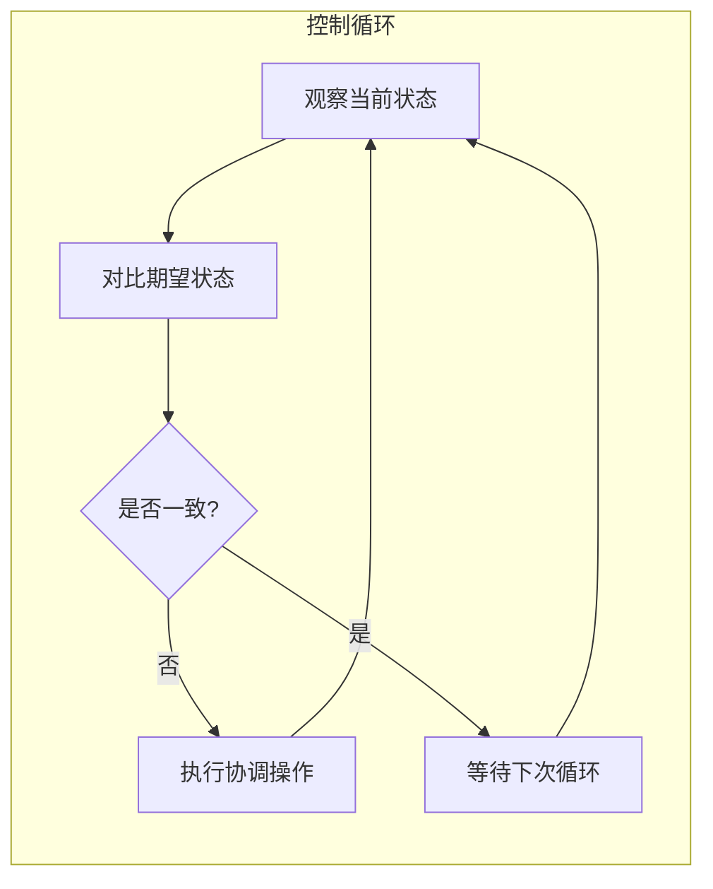
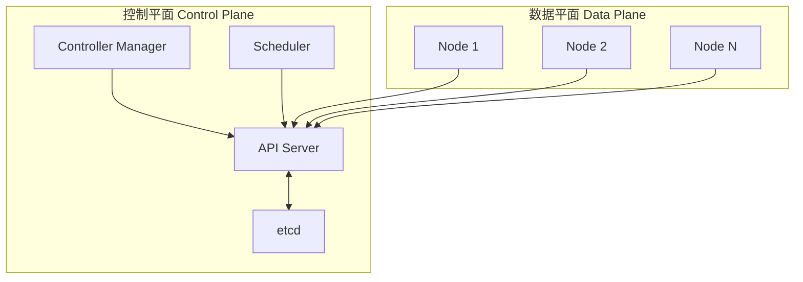
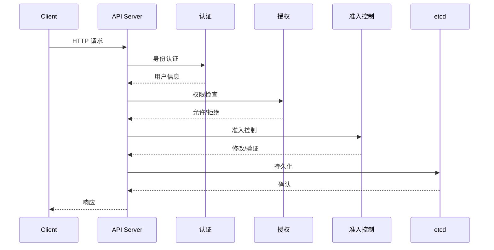
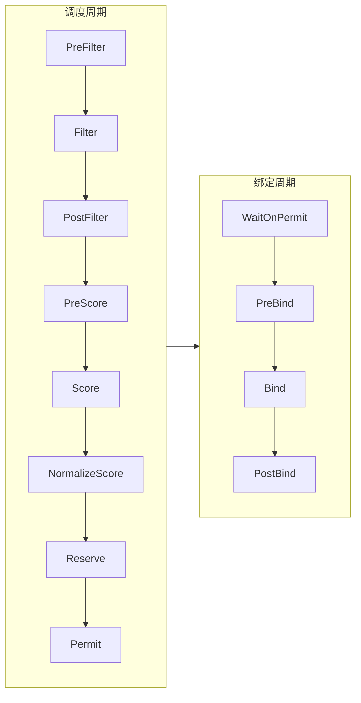
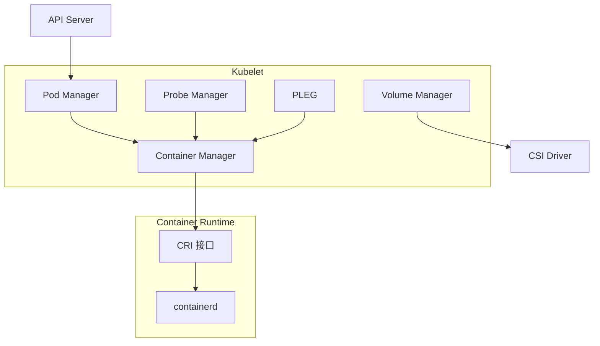
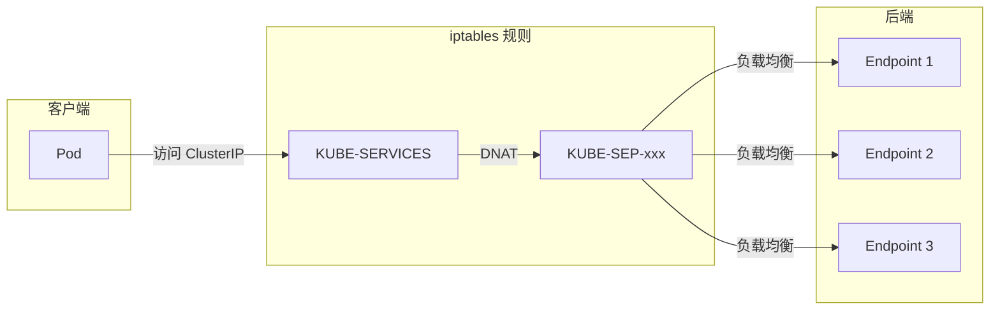
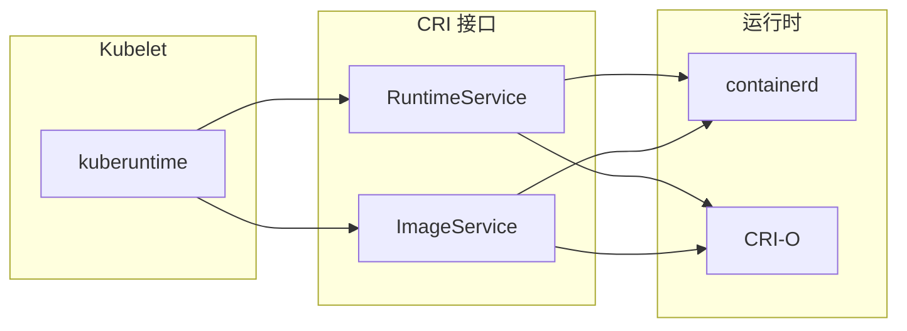
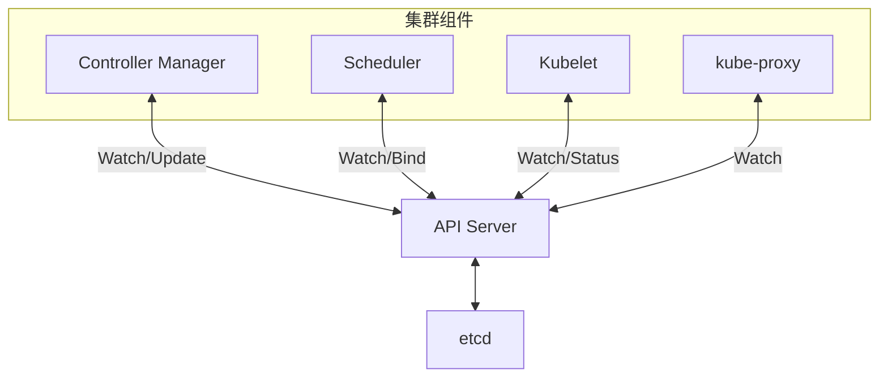
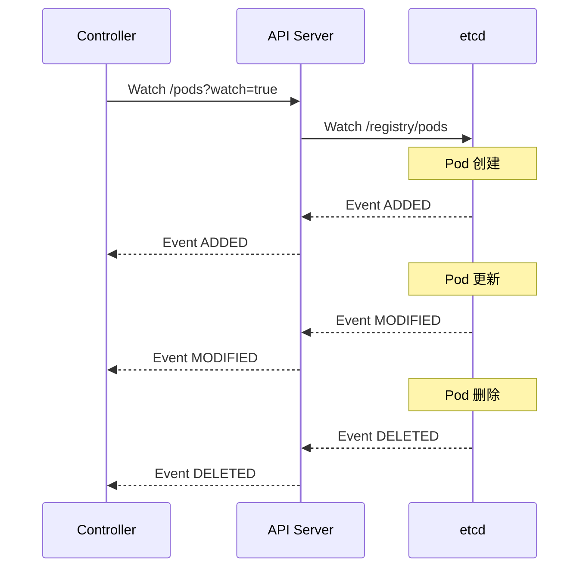
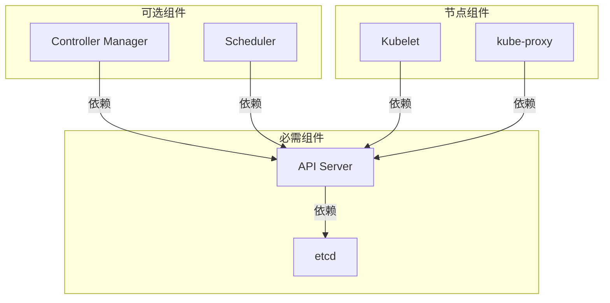

## 概述

Kubernetes 是一个分布式容器编排系统，采用主从架构设计，由控制平面 (Control Plane) 和数据平面 (Data Plane) 组成。本文深入分析 K8s 的架构设计理念和各组件的职责。

## 1. 设计哲学

### 1.1 声明式 API

Kubernetes 采用声明式 API 设计，用户描述期望的最终状态，系统自动执行必要的操作达到该状态：

```yaml
# 用户声明期望状态
apiVersion: apps/v1
kind: Deployment
metadata:
  name: nginx
spec:
  replicas: 3  # 期望 3 个副本
  selector:
    matchLabels:
      app: nginx
  template:
    metadata:
      labels:
        app: nginx
    spec:
      containers:
      - name: nginx
        image: nginx:1.21
```

声明式的优势：
- **幂等性**: 多次应用相同配置结果一致
- **自愈能力**: 系统持续向期望状态收敛
- **可审计**: 配置即文档，易于版本控制

### 1.2 控制循环模式

控制循环 (Control Loop) 是 K8s 的核心设计模式，每个控制器持续执行：

```
观察 (Observe) -> 对比 (Diff) -> 行动 (Act)
```



### 1.3 松耦合组件架构

各组件通过 API Server 进行通信，彼此解耦：
- 组件可独立升级和扩展
- 故障隔离，单组件故障不影响其他组件
- 支持插件化扩展

## 2. 控制平面组件

控制平面负责集群的全局决策和状态管理。



### 2.1 API Server

**职责**: 集群的统一入口，所有组件通过它进行通信。

**核心功能**:
- RESTful API 服务
- 认证 (Authentication)
- 授权 (Authorization)
- 准入控制 (Admission Control)
- 资源验证与持久化
- Watch 机制 - 事件通知

**代码入口**: `cmd/kube-apiserver/apiserver.go`

```go
// cmd/kube-apiserver/apiserver.go
func main() {
    command := app.NewAPIServerCommand()
    code := cli.Run(command)
    os.Exit(code)
}
```

**关键数据流**:



### 2.2 etcd

**职责**: 分布式键值存储，保存集群所有状态数据。

**核心特性**:
- 基于 Raft 协议的强一致性
- MVCC (多版本并发控制)
- Watch 机制支持
- 事务操作

**K8s 存储的数据**:
- 所有 API 资源对象 (Pod, Service, Deployment 等)
- 集群配置信息
- Secrets 和 ConfigMaps

**数据路径格式**:
```
/registry/{resource-type}/{namespace}/{name}
/registry/pods/default/nginx-xxx
/registry/deployments/kube-system/coredns
```

### 2.3 Controller Manager

**职责**: 运行各种控制器，确保集群状态符合期望。

**内置控制器** (35+):
| 控制器 | 职责 |
|--------|------|
| Deployment Controller | 管理 Deployment 和 ReplicaSet |
| ReplicaSet Controller | 维护 Pod 副本数量 |
| StatefulSet Controller | 管理有状态应用 |
| DaemonSet Controller | 确保每个节点运行指定 Pod |
| Job Controller | 管理批处理任务 |
| Endpoint Controller | 维护 Service 端点 |
| Namespace Controller | 处理命名空间删除 |
| GarbageCollector | 级联删除孤儿资源 |

**代码结构**: `pkg/controller/`

```
pkg/controller/
├── deployment/           # Deployment 控制器
├── replicaset/           # ReplicaSet 控制器
├── statefulset/          # StatefulSet 控制器
├── daemon/               # DaemonSet 控制器
├── job/                  # Job 控制器
├── cronjob/              # CronJob 控制器
├── endpoint/             # Endpoint 控制器
├── endpointslice/        # EndpointSlice 控制器
├── namespace/            # Namespace 控制器
├── garbagecollector/     # 垃圾回收控制器
└── ...
```

### 2.4 Scheduler

**职责**: 为新创建的 Pod 选择合适的 Node 运行。

**调度流程**:
1. **过滤 (Filter)**: 排除不满足条件的节点
2. **评分 (Score)**: 对剩余节点打分排序
3. **绑定 (Bind)**: 将 Pod 绑定到最优节点

**调度框架扩展点**:



**代码入口**: `pkg/scheduler/scheduler.go`

## 3. 数据平面组件

数据平面运行在每个 Worker 节点上，负责实际的容器运行和网络管理。

### 3.1 Kubelet

**职责**: 节点代理，管理 Pod 生命周期。

**核心功能**:
- Pod 生命周期管理
- 容器运行时交互 (CRI)
- 卷挂载管理
- 健康检查 (探针)
- 节点状态上报
- 资源监控

**架构图**:



**代码入口**: `cmd/kubelet/kubelet.go`

### 3.2 kube-proxy

**职责**: 实现 Service 的网络代理和负载均衡。

**代理模式**:
| 模式 | 实现 | 特点 |
|------|------|------|
| iptables | Netfilter | 成熟稳定，规则数量大时性能下降 |
| IPVS | LVS | 高性能，O(1) 复杂度 |
| nftables | nftables | 新一代，更现代的实现 |

**工作原理** (iptables 模式):



**代码入口**: `cmd/kube-proxy/proxy.go`

### 3.3 Container Runtime

**职责**: 实际运行容器的软件。

K8s 通过 CRI (Container Runtime Interface) 与容器运行时交互：



**CRI 接口定义**: `staging/src/k8s.io/cri-api/`

## 4. 组件通信机制

### 4.1 API Server 中心化通信

所有组件通过 API Server 通信，不直接相互调用：



### 4.2 Watch 机制

组件使用 Watch 机制监听资源变化：



### 4.3 组件间依赖关系



## 5. 代码结构概览

### 5.1 主要目录

```
kubernetes/
├── cmd/                        # 各组件入口
│   ├── kube-apiserver/         # API Server
│   ├── kube-controller-manager/# Controller Manager
│   ├── kube-scheduler/         # Scheduler
│   ├── kubelet/                # Kubelet
│   └── kube-proxy/             # kube-proxy
│
├── pkg/                        # 核心实现
│   ├── api/                    # API 定义
│   ├── apis/                   # API 组定义
│   ├── controller/             # 控制器实现
│   ├── scheduler/              # 调度器实现
│   ├── kubelet/                # Kubelet 实现
│   ├── proxy/                  # kube-proxy 实现
│   ├── volume/                 # 存储卷实现
│   └── registry/               # API 资源注册表
│
├── staging/src/k8s.io/         # 独立发布的库
│   ├── api/                    # API 类型定义
│   ├── apimachinery/           # API 机制
│   ├── apiserver/              # API Server 框架
│   ├── client-go/              # Go 客户端
│   ├── controller-manager/     # 控制器管理器框架
│   └── ...
│
├── vendor/                     # 依赖
├── hack/                       # 构建脚本
└── test/                       # 测试
```

### 5.2 关键代码路径

| 组件 | 入口文件 | 核心实现 |
|------|----------|----------|
| API Server | `cmd/kube-apiserver/apiserver.go` | `pkg/controlplane/`, `staging/src/k8s.io/apiserver/` |
| Controller Manager | `cmd/kube-controller-manager/controller-manager.go` | `pkg/controller/` |
| Scheduler | `cmd/kube-scheduler/scheduler.go` | `pkg/scheduler/` |
| Kubelet | `cmd/kubelet/kubelet.go` | `pkg/kubelet/` |
| kube-proxy | `cmd/kube-proxy/proxy.go` | `pkg/proxy/` |

## 6. 总结

Kubernetes 的架构设计体现了以下核心理念：

1. **声明式**: 用户描述期望状态，系统自动收敛
2. **控制循环**: 持续观察-对比-行动，保证最终一致性
3. **松耦合**: 组件通过 API Server 通信，独立演进
4. **可扩展**: 插件化设计，支持多种扩展机制
5. **高可用**: 控制平面可多副本部署，etcd 支持集群模式

理解这些设计理念是深入学习 Kubernetes 各组件实现的基础。

## 参考

- [Kubernetes 官方文档 - 架构](https://kubernetes.io/docs/concepts/architecture/)
- [Kubernetes 设计提案](https://github.com/kubernetes/design-proposals-archive)
- 源码: `cmd/`, `pkg/`, `staging/src/k8s.io/`
