## 概述

Kubernetes 通过一系列抽象资源对象来管理容器化应用。本文深入解析 Pod、工作负载、服务发现等核心概念及其实现原理。

## 1. Pod - 最小调度单元

### 1.1 Pod 概念

Pod 是 K8s 中最小的可部署单元，封装一个或多个容器：

```yaml
apiVersion: v1
kind: Pod
metadata:
  name: web-app
  namespace: default
  labels:
    app: web
spec:
  containers:
  - name: web
    image: nginx:1.21
    ports:
    - containerPort: 80
  - name: log-agent
    image: fluentd:latest
```

**Pod 的核心特性**:
- 共享网络命名空间 (同一 IP 地址)
- 共享存储卷
- 共享 IPC 命名空间
- 同一 Pod 内容器共同调度

### 1.2 Pod 生命周期

Pod 的生命周期由 Phase 字段表示：

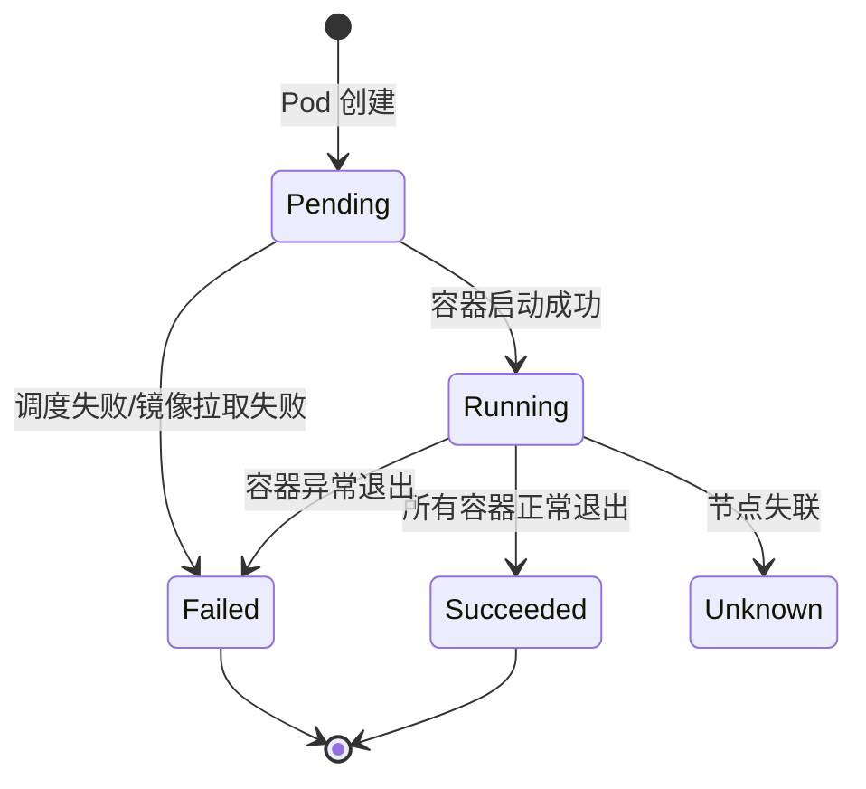

| Phase | 说明 |
|-------|------|
| Pending | Pod 已被接受，但容器未全部创建 |
| Running | Pod 已绑定到节点，所有容器已创建，至少一个在运行 |
| Succeeded | 所有容器成功终止，不会重启 |
| Failed | 所有容器已终止，至少一个失败退出 |
| Unknown | 无法获取 Pod 状态，通常是节点通信问题 |

### 1.3 容器状态

每个容器有独立的状态：

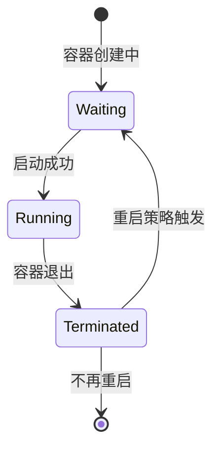

**状态详情** (`ContainerStatus`):

```go
// staging/src/k8s.io/api/core/v1/types.go
type ContainerStatus struct {
    Name         string
    State        ContainerState      // 当前状态
    LastTerminationState ContainerState // 上次终止状态
    Ready        bool
    RestartCount int32
    Image        string
    ImageID      string
    ContainerID  string
}

type ContainerState struct {
    Waiting    *ContainerStateWaiting
    Running    *ContainerStateRunning
    Terminated *ContainerStateTerminated
}
```

### 1.4 容器组合模式

**Sidecar 模式**: 辅助容器增强主容器功能

```yaml
apiVersion: v1
kind: Pod
metadata:
  name: web-with-sidecar
spec:
  containers:
  - name: web
    image: nginx
  - name: log-collector    # Sidecar: 日志收集
    image: fluentd
    volumeMounts:
    - name: logs
      mountPath: /var/log/nginx
  volumes:
  - name: logs
    emptyDir: {}
```

**Ambassador 模式**: 代理容器处理外部通信

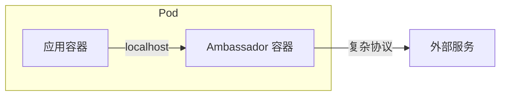

**Adapter 模式**: 适配容器标准化输出

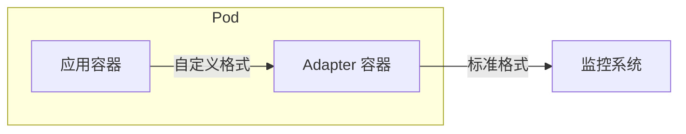

### 1.5 Pod 代码实现

**Pod 类型定义**: `staging/src/k8s.io/api/core/v1/types.go`

```go
type Pod struct {
    metav1.TypeMeta   `json:",inline"`
    metav1.ObjectMeta `json:"metadata,omitempty"`
    Spec              PodSpec   `json:"spec,omitempty"`
    Status            PodStatus `json:"status,omitempty"`
}

type PodSpec struct {
    Containers         []Container
    InitContainers     []Container
    Volumes            []Volume
    RestartPolicy      RestartPolicy
    NodeSelector       map[string]string
    ServiceAccountName string
    // ...
}
```

## 2. 工作负载资源

工作负载控制器管理 Pod 的创建、更新和删除。

### 2.1 Deployment

用于无状态应用的声明式更新。

```yaml
apiVersion: apps/v1
kind: Deployment
metadata:
  name: nginx-deployment
spec:
  replicas: 3
  selector:
    matchLabels:
      app: nginx
  strategy:
    type: RollingUpdate
    rollingUpdate:
      maxSurge: 1
      maxUnavailable: 0
  template:
    metadata:
      labels:
        app: nginx
    spec:
      containers:
      - name: nginx
        image: nginx:1.21
```

**Deployment 控制层次**:

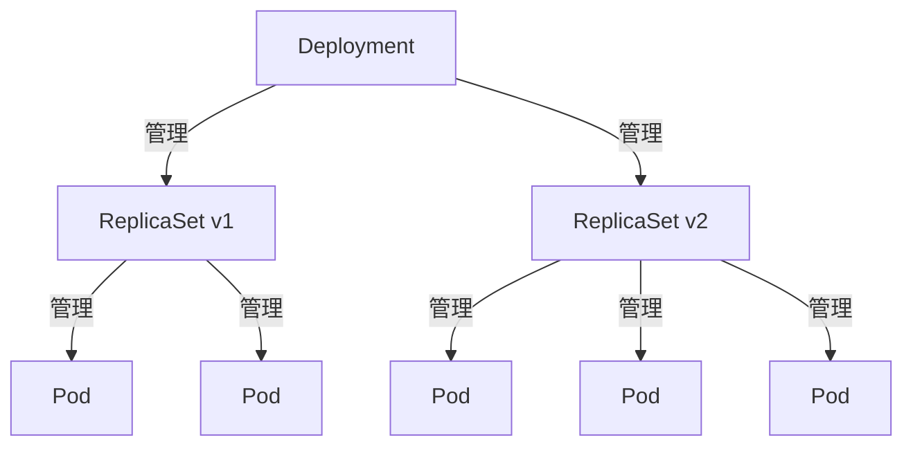

**代码位置**: `pkg/controller/deployment/`

### 2.2 StatefulSet

用于有状态应用，提供：
- 稳定的网络标识
- 有序部署和扩缩
- 持久存储

```yaml
apiVersion: apps/v1
kind: StatefulSet
metadata:
  name: mysql
spec:
  serviceName: mysql
  replicas: 3
  selector:
    matchLabels:
      app: mysql
  template:
    metadata:
      labels:
        app: mysql
    spec:
      containers:
      - name: mysql
        image: mysql:8.0
        volumeMounts:
        - name: data
          mountPath: /var/lib/mysql
  volumeClaimTemplates:
  - metadata:
      name: data
    spec:
      accessModes: ["ReadWriteOnce"]
      resources:
        requests:
          storage: 10Gi
```

**Pod 命名规则**:

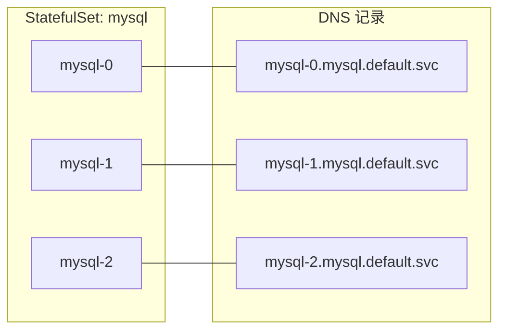

**代码位置**: `pkg/controller/statefulset/`

### 2.3 DaemonSet

确保每个节点运行一个 Pod 副本。

```yaml
apiVersion: apps/v1
kind: DaemonSet
metadata:
  name: node-exporter
spec:
  selector:
    matchLabels:
      app: node-exporter
  template:
    metadata:
      labels:
        app: node-exporter
    spec:
      containers:
      - name: node-exporter
        image: prom/node-exporter
      tolerations:
      - operator: Exists  # 容忍所有污点
```

**典型用例**:
- 日志收集 (Fluentd, Filebeat)
- 节点监控 (Node Exporter)
- 网络插件 (Calico, Cilium)
- 存储守护进程 (CSI Node)

**代码位置**: `pkg/controller/daemon/`

### 2.4 Job 和 CronJob

**Job**: 一次性任务

```yaml
apiVersion: batch/v1
kind: Job
metadata:
  name: data-migration
spec:
  completions: 10      # 需要成功完成的 Pod 数
  parallelism: 3       # 并行运行的 Pod 数
  backoffLimit: 4      # 失败重试次数
  template:
    spec:
      containers:
      - name: migrate
        image: migrate-tool
      restartPolicy: Never
```

**CronJob**: 定时任务

```yaml
apiVersion: batch/v1
kind: CronJob
metadata:
  name: backup
spec:
  schedule: "0 2 * * *"  # 每天凌晨 2 点
  concurrencyPolicy: Forbid
  jobTemplate:
    spec:
      template:
        spec:
          containers:
          - name: backup
            image: backup-tool
          restartPolicy: OnFailure
```

**代码位置**: `pkg/controller/job/`, `pkg/controller/cronjob/`

### 2.5 工作负载资源关系

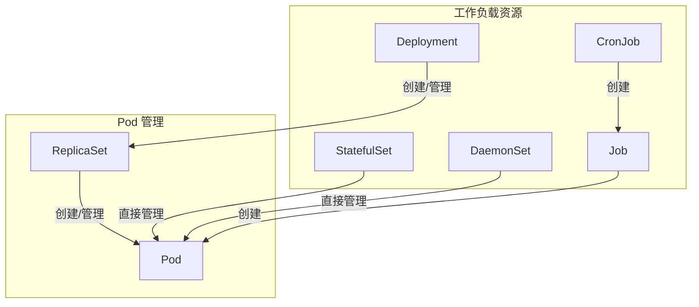

## 3. 服务发现与负载均衡

### 3.1 Service

Service 为一组 Pod 提供稳定的访问入口。

```yaml
apiVersion: v1
kind: Service
metadata:
  name: web-service
spec:
  type: ClusterIP
  selector:
    app: web
  ports:
  - port: 80
    targetPort: 8080
```

**Service 类型**:

| 类型 | 说明 | 使用场景 |
|------|------|----------|
| ClusterIP | 集群内部虚拟 IP | 内部服务通信 |
| NodePort | 每个节点开放固定端口 | 开发测试 |
| LoadBalancer | 云厂商负载均衡器 | 生产环境外部访问 |
| ExternalName | CNAME 记录 | 引用外部服务 |

**Service 流量路径**:

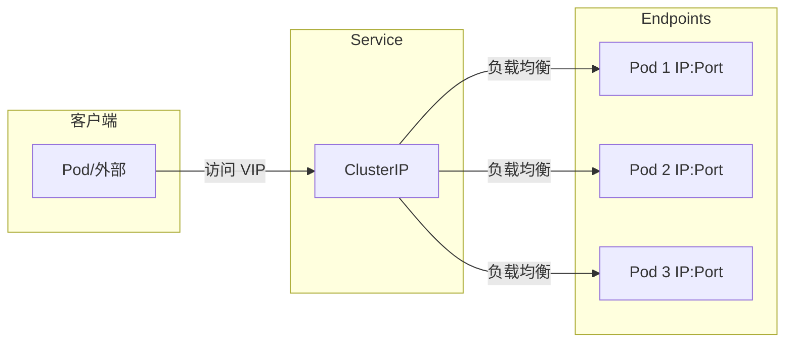

### 3.2 Endpoints 和 EndpointSlice

**Endpoints**: 传统端点发现

```yaml
apiVersion: v1
kind: Endpoints
metadata:
  name: web-service
subsets:
- addresses:
  - ip: 10.0.0.1
  - ip: 10.0.0.2
  ports:
  - port: 8080
```

**EndpointSlice**: 分片端点 (大规模优化)

```yaml
apiVersion: discovery.k8s.io/v1
kind: EndpointSlice
metadata:
  name: web-service-abc12
  labels:
    kubernetes.io/service-name: web-service
addressType: IPv4
ports:
- port: 8080
endpoints:
- addresses:
  - "10.0.0.1"
  conditions:
    ready: true
```

**EndpointSlice 优势**:
- 分片存储，减少单对象大小
- 增量更新，减少 Watch 流量
- 支持多地址类型 (IPv4, IPv6, FQDN)

### 3.3 Ingress

七层 HTTP 路由。

```yaml
apiVersion: networking.k8s.io/v1
kind: Ingress
metadata:
  name: web-ingress
spec:
  ingressClassName: nginx
  rules:
  - host: www.example.com
    http:
      paths:
      - path: /api
        pathType: Prefix
        backend:
          service:
            name: api-service
            port:
              number: 80
      - path: /
        pathType: Prefix
        backend:
          service:
            name: web-service
            port:
              number: 80
  tls:
  - hosts:
    - www.example.com
    secretName: tls-secret
```

**Ingress 流量路径**:

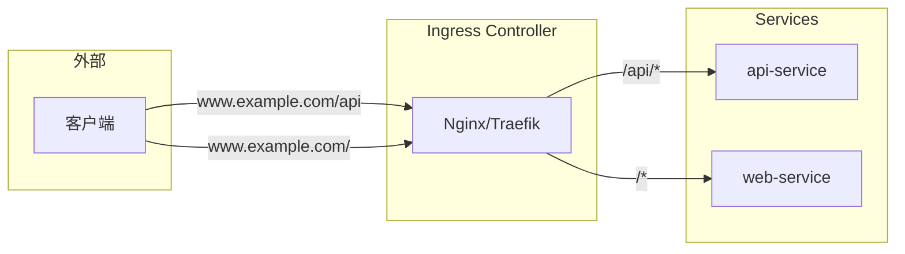

## 4. 配置与存储

### 4.1 ConfigMap

存储非敏感配置数据。

```yaml
apiVersion: v1
kind: ConfigMap
metadata:
  name: app-config
data:
  DATABASE_HOST: mysql.default.svc
  LOG_LEVEL: info
  config.yaml: |
    server:
      port: 8080
    database:
      pool_size: 10
```

**使用方式**:

```yaml
# 环境变量
env:
- name: DATABASE_HOST
  valueFrom:
    configMapKeyRef:
      name: app-config
      key: DATABASE_HOST

# 卷挂载
volumes:
- name: config
  configMap:
    name: app-config
```

### 4.2 Secret

存储敏感数据 (Base64 编码)。

```yaml
apiVersion: v1
kind: Secret
metadata:
  name: db-secret
type: Opaque
data:
  username: YWRtaW4=      # admin
  password: cGFzc3dvcmQ=  # password
```

**Secret 类型**:
| 类型 | 用途 |
|------|------|
| Opaque | 通用密钥 |
| kubernetes.io/tls | TLS 证书 |
| kubernetes.io/dockerconfigjson | 镜像仓库凭证 |
| kubernetes.io/service-account-token | SA Token |

### 4.3 PersistentVolume 和 PersistentVolumeClaim

**PersistentVolume (PV)**: 集群存储资源

```yaml
apiVersion: v1
kind: PersistentVolume
metadata:
  name: pv-data
spec:
  capacity:
    storage: 100Gi
  accessModes:
  - ReadWriteOnce
  persistentVolumeReclaimPolicy: Retain
  storageClassName: ssd
  csi:
    driver: pd.csi.storage.gke.io
    volumeHandle: projects/xxx/disks/data
```

**PersistentVolumeClaim (PVC)**: 存储请求

```yaml
apiVersion: v1
kind: PersistentVolumeClaim
metadata:
  name: data-pvc
spec:
  accessModes:
  - ReadWriteOnce
  resources:
    requests:
      storage: 50Gi
  storageClassName: ssd
```

**PV/PVC 绑定流程**:

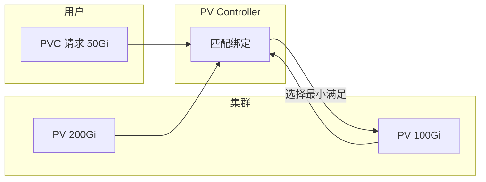

## 5. 资源模型设计

### 5.1 三段式结构

所有 K8s 资源遵循 `metadata/spec/status` 结构：

```go
type Pod struct {
    metav1.TypeMeta   `json:",inline"`      // apiVersion, kind
    metav1.ObjectMeta `json:"metadata"`     // name, namespace, labels...
    Spec              PodSpec   `json:"spec"`   // 用户期望状态
    Status            PodStatus `json:"status"` // 系统实际状态
}
```

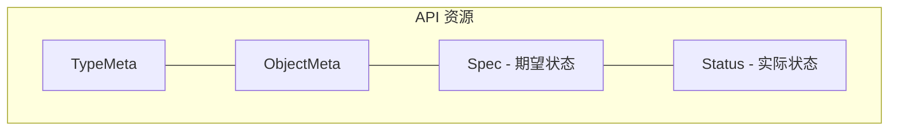

### 5.2 Label 与 Selector

**Label**: 附加到资源的键值对

```yaml
metadata:
  labels:
    app: web
    env: production
    version: v1.2.0
```

**Selector**: 基于 Label 选择资源

```yaml
# 等式选择
selector:
  matchLabels:
    app: web

# 集合选择
selector:
  matchExpressions:
  - key: env
    operator: In
    values: [production, staging]
  - key: version
    operator: NotIn
    values: [v1.0.0]
```

### 5.3 Annotation

存储非标识性元数据：

```yaml
metadata:
  annotations:
    kubernetes.io/ingress-class: nginx
    prometheus.io/scrape: "true"
    prometheus.io/port: "9090"
    description: "This is the main web application"
```

**Label vs Annotation**:
| 特性 | Label | Annotation |
|------|-------|------------|
| 用途 | 标识和选择 | 元数据存储 |
| 大小限制 | 63 字符 | 256KB |
| 索引 | 支持 | 不支持 |
| 选择器 | 支持 | 不支持 |

## 6. 总结

Kubernetes 的资源抽象层次：

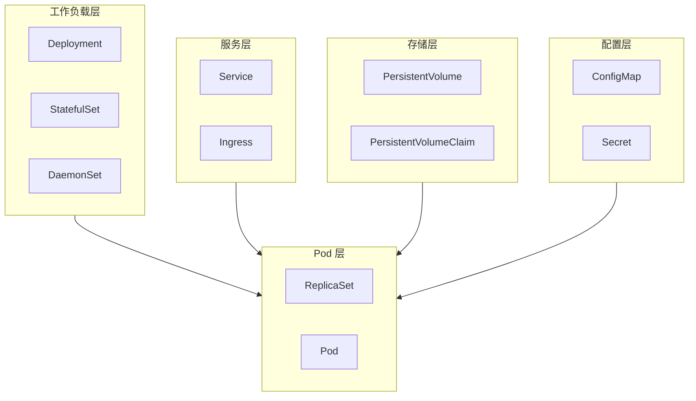

核心设计原则：
1. **分层抽象**: 从 Pod 到 Deployment 的层次结构
2. **关注点分离**: Spec 描述期望，Status 反映实际
3. **松耦合**: 通过 Label/Selector 建立资源关系
4. **声明式**: 用户声明目标状态，系统自动协调

## 参考

- [Kubernetes API 参考](https://kubernetes.io/docs/reference/kubernetes-api/)
- 源码: `staging/src/k8s.io/api/`
- 源码: `pkg/controller/`
