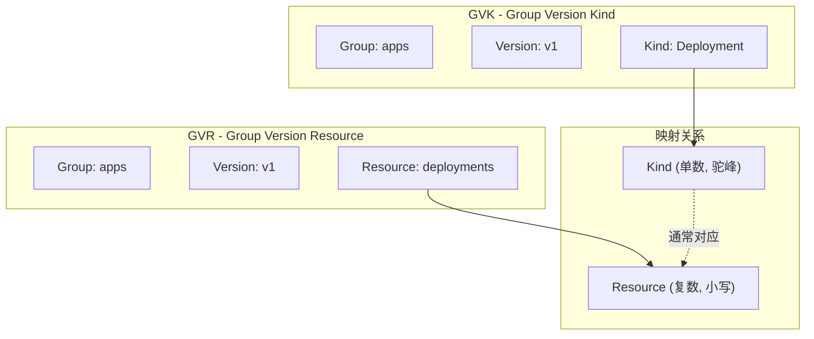
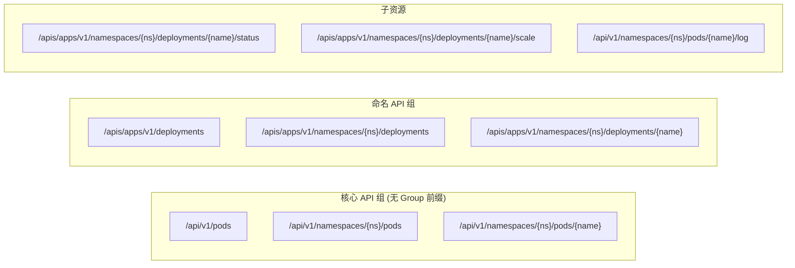
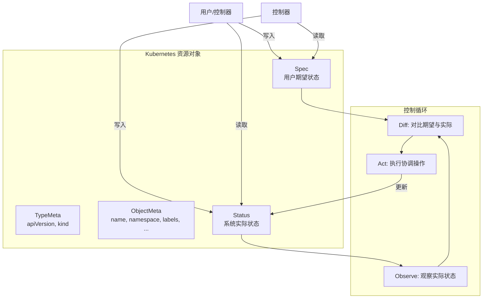
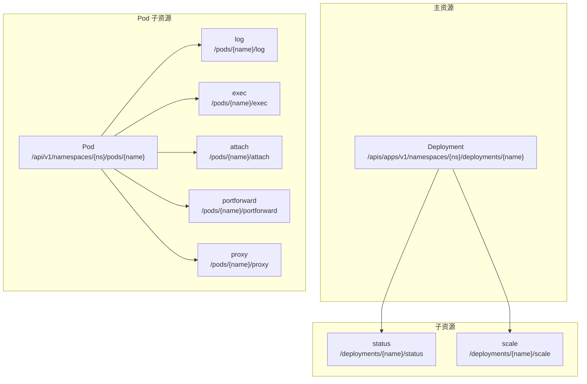
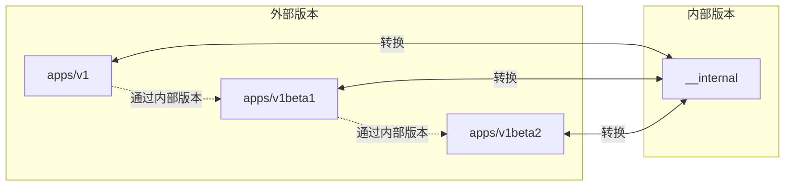
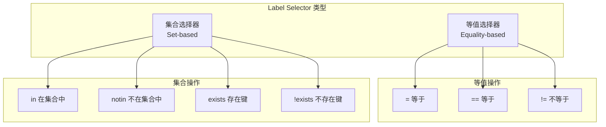

本文深入解析 Kubernetes API 的设计规范，包括版本管理策略、GVK/GVR 概念、资源结构设计以及序列化机制。

## 1. API 版本管理

### 1.1 版本演进策略

Kubernetes API 采用严格的版本管理策略，确保 API 的稳定性和向后兼容性：

```
┌─────────────────────────────────────────────────────────────────┐
│                     API 版本生命周期                             │
├─────────────────────────────────────────────────────────────────┤
│                                                                 │
│  Alpha (v1alpha1, v1alpha2, ...)                               │
│  ├── 默认禁用，需要通过 Feature Gate 启用                        │
│  ├── 可能存在 Bug，不保证稳定                                    │
│  ├── 可能随时被删除或修改，无需通知                              │
│  └── 仅推荐在测试集群中使用                                      │
│                                                                 │
│         ↓                                                       │
│                                                                 │
│  Beta (v1beta1, v1beta2, ...)                                  │
│  ├── 默认启用                                                    │
│  ├── 经过充分测试，功能基本稳定                                  │
│  ├── 细节可能变化，但会提供迁移指南                              │
│  └── 推荐用于非关键业务                                          │
│                                                                 │
│         ↓                                                       │
│                                                                 │
│  Stable (v1, v2, ...)                                          │
│  ├── 出现在多个后续版本中                                        │
│  ├── 保证向后兼容                                                │
│  ├── 废弃至少保留 3 个版本（约 9 个月）                          │
│  └── 推荐用于生产环境                                            │
│                                                                 │
└─────────────────────────────────────────────────────────────────┘
```

### 1.2 API 废弃策略

Kubernetes 遵循严格的 API 废弃策略：

| 版本类型 | 最小支持时间 | 废弃通知 | 迁移指南 |
|---------|-------------|---------|---------|
| Alpha | 无保证 | 可选 | 可选 |
| Beta | 9 个月或 3 个版本 | 必须 | 必须 |
| Stable | 12 个月或 3 个版本 | 必须 | 必须 |

### 1.3 Feature Gate 机制

Feature Gate 是 Kubernetes 控制特性启用/禁用的机制：

```go
// staging/src/k8s.io/component-base/featuregate/feature_gate.go

// Feature 表示一个特性门控
type Feature string

// FeatureSpec 描述一个特性的规格
type FeatureSpec struct {
    // Default 是特性的默认启用状态
    Default bool
    // LockToDefault 表示特性是否锁定为默认值
    LockToDefault bool
    // PreRelease 表示特性的预发布阶段
    PreRelease prerelease
    // Version 指定特性添加的版本
    Version *version.Version
}

// 特性预发布阶段
const (
    // Alpha 表示 Alpha 阶段特性
    Alpha = prerelease("ALPHA")
    // Beta 表示 Beta 阶段特性
    Beta = prerelease("BETA")
    // GA 表示正式发布的特性
    GA = prerelease("")
    // Deprecated 表示已废弃的特性
    Deprecated = prerelease("DEPRECATED")
)
```

Feature Gate 的使用示例：

```go
// pkg/features/kube_features.go

const (
    // DynamicResourceAllocation 启用动态资源分配
    DynamicResourceAllocation featuregate.Feature = "DynamicResourceAllocation"

    // PodSchedulingReadiness 启用 Pod 调度就绪检查
    PodSchedulingReadiness featuregate.Feature = "PodSchedulingReadiness"

    // ... 更多特性
)

// 特性默认值定义
var defaultKubernetesFeatureGates = map[featuregate.Feature]featuregate.FeatureSpec{
    DynamicResourceAllocation: {
        Default:    true,
        PreRelease: featuregate.Beta,
    },
    PodSchedulingReadiness: {
        Default:    true,
        PreRelease: featuregate.GA,
    },
    // ...
}
```

## 2. GVK 与 GVR

### 2.1 核心概念

GVK（Group-Version-Kind）和 GVR（Group-Version-Resource）是 Kubernetes API 的核心概念：



### 2.2 Group 分组

API Group 将相关的资源组织在一起：

| Group | 描述 | 示例资源 |
|-------|-----|---------|
| "" (core) | 核心 API 组 | Pod, Service, ConfigMap, Secret |
| apps | 应用工作负载 | Deployment, StatefulSet, DaemonSet |
| batch | 批处理任务 | Job, CronJob |
| networking.k8s.io | 网络相关 | Ingress, NetworkPolicy |
| storage.k8s.io | 存储相关 | StorageClass, CSIDriver |
| rbac.authorization.k8s.io | RBAC | Role, ClusterRole, RoleBinding |
| autoscaling | 自动扩缩容 | HorizontalPodAutoscaler |
| policy | 策略 | PodDisruptionBudget |

### 2.3 RESTful 路径映射

GVR 直接映射到 RESTful API 路径：



### 2.4 Scheme 注册机制

Scheme 是 Kubernetes 中管理类型注册的核心组件：

```go
// staging/src/k8s.io/apimachinery/pkg/runtime/scheme.go

// Scheme 定义了序列化和类型转换的规则
type Scheme struct {
    // gvkToType 从 GVK 到 Go 类型的映射
    gvkToType map[schema.GroupVersionKind]reflect.Type

    // typeToGVK 从 Go 类型到 GVK 的映射
    typeToGVK map[reflect.Type][]schema.GroupVersionKind

    // defaulterFuncs 默认值函数
    defaulterFuncs map[reflect.Type]func(interface{})

    // converter 类型转换器
    converter *conversion.Converter

    // ... 其他字段
}

// AddKnownTypes 注册已知类型
func (s *Scheme) AddKnownTypes(gv schema.GroupVersion, types ...Object) {
    for _, obj := range types {
        t := reflect.TypeOf(obj)
        if t.Kind() != reflect.Pointer {
            panic("All types must be pointers to structs.")
        }
        t = t.Elem()
        s.AddKnownTypeWithName(gv.WithKind(t.Name()), obj)
    }
}
```

类型注册示例：

```go
// staging/src/k8s.io/api/apps/v1/register.go

var (
    // SchemeBuilder 用于将类型注册到 Scheme
    SchemeBuilder = runtime.NewSchemeBuilder(addKnownTypes)
    AddToScheme   = SchemeBuilder.AddToScheme
)

// addKnownTypes 注册 apps/v1 组的类型
func addKnownTypes(scheme *runtime.Scheme) error {
    scheme.AddKnownTypes(SchemeGroupVersion,
        &Deployment{},
        &DeploymentList{},
        &StatefulSet{},
        &StatefulSetList{},
        &DaemonSet{},
        &DaemonSetList{},
        &ReplicaSet{},
        &ReplicaSetList{},
        &ControllerRevision{},
        &ControllerRevisionList{},
    )
    metav1.AddToGroupVersion(scheme, SchemeGroupVersion)
    return nil
}
```

## 3. API 资源结构

### 3.1 TypeMeta 类型元数据

TypeMeta 包含资源的类型信息：

```go
// staging/src/k8s.io/apimachinery/pkg/apis/meta/v1/types.go

// TypeMeta 描述 API 对象的类型
type TypeMeta struct {
    // Kind 是资源类型的字符串表示
    // 例如: "Pod", "Deployment", "Service"
    Kind string `json:"kind,omitempty"`

    // APIVersion 是资源的 API 版本
    // 格式: "group/version" 或 "version"（核心 API 组）
    // 例如: "apps/v1", "v1"
    APIVersion string `json:"apiVersion,omitempty"`
}
```

### 3.2 ObjectMeta 对象元数据

ObjectMeta 包含所有持久化资源的通用元数据：

```go
// staging/src/k8s.io/apimachinery/pkg/apis/meta/v1/types.go

// ObjectMeta 是所有持久化资源必须包含的元数据
type ObjectMeta struct {
    // Name 在命名空间内唯一标识此对象
    Name string `json:"name,omitempty"`

    // GenerateName 用于服务端名称生成
    GenerateName string `json:"generateName,omitempty"`

    // Namespace 定义资源所属的命名空间
    Namespace string `json:"namespace,omitempty"`

    // UID 是对象在时间和空间上的唯一标识
    UID types.UID `json:"uid,omitempty"`

    // ResourceVersion 用于乐观并发控制
    ResourceVersion string `json:"resourceVersion,omitempty"`

    // Generation 是期望状态的特定生成版本
    Generation int64 `json:"generation,omitempty"`

    // CreationTimestamp 是对象创建时间
    CreationTimestamp Time `json:"creationTimestamp,omitempty"`

    // DeletionTimestamp 表示对象被请求删除的时间
    DeletionTimestamp *Time `json:"deletionTimestamp,omitempty"`

    // DeletionGracePeriodSeconds 删除的优雅期限
    DeletionGracePeriodSeconds *int64 `json:"deletionGracePeriodSeconds,omitempty"`

    // Labels 是可用于组织和分类对象的键值对
    Labels map[string]string `json:"labels,omitempty"`

    // Annotations 是存储任意元数据的键值对
    Annotations map[string]string `json:"annotations,omitempty"`

    // OwnerReferences 列出此对象所依赖的对象
    OwnerReferences []OwnerReference `json:"ownerReferences,omitempty"`

    // Finalizers 在删除对象前必须为空
    Finalizers []string `json:"finalizers,omitempty"`

    // ManagedFields 用于服务器端 Apply
    ManagedFields []ManagedFieldsEntry `json:"managedFields,omitempty"`
}
```

### 3.3 Spec/Status 分离模式

Kubernetes API 采用 Spec/Status 分离的设计模式：



Spec 和 Status 的典型定义：

```go
// staging/src/k8s.io/api/apps/v1/types.go

// Deployment 使 Pod 和 ReplicaSet 实现声明式更新
type Deployment struct {
    metav1.TypeMeta   `json:",inline"`
    metav1.ObjectMeta `json:"metadata,omitempty"`

    // Spec 定义 Deployment 的期望行为
    Spec DeploymentSpec `json:"spec,omitempty"`

    // Status 是 Deployment 的最近观察状态
    Status DeploymentStatus `json:"status,omitempty"`
}

// DeploymentSpec 定义 Deployment 的期望状态
type DeploymentSpec struct {
    // Replicas 是期望的 Pod 副本数
    Replicas *int32 `json:"replicas,omitempty"`

    // Selector 是 Pod 的标签选择器
    Selector *metav1.LabelSelector `json:"selector"`

    // Template 是 Pod 模板
    Template corev1.PodTemplateSpec `json:"template"`

    // Strategy 是用于用新 Pod 替换旧 Pod 的部署策略
    Strategy DeploymentStrategy `json:"strategy,omitempty"`

    // ... 其他字段
}

// DeploymentStatus 是 Deployment 的最近观察状态
type DeploymentStatus struct {
    // ObservedGeneration 是 Deployment 控制器观察到的 generation
    ObservedGeneration int64 `json:"observedGeneration,omitempty"`

    // Replicas 是总的非终止 Pod 数量
    Replicas int32 `json:"replicas,omitempty"`

    // UpdatedReplicas 是已更新的非终止 Pod 数量
    UpdatedReplicas int32 `json:"updatedReplicas,omitempty"`

    // ReadyReplicas 是已就绪的 Pod 数量
    ReadyReplicas int32 `json:"readyReplicas,omitempty"`

    // AvailableReplicas 是可用的 Pod 数量
    AvailableReplicas int32 `json:"availableReplicas,omitempty"`

    // Conditions 表示 Deployment 的当前状态
    Conditions []DeploymentCondition `json:"conditions,omitempty"`

    // ... 其他字段
}
```

### 3.4 runtime.Object 接口

所有 Kubernetes API 对象都实现 runtime.Object 接口：

```go
// staging/src/k8s.io/apimachinery/pkg/runtime/interfaces.go

// Object 是所有 API 对象的基础接口
type Object interface {
    // GetObjectKind 返回对象的 schema
    GetObjectKind() schema.ObjectKind

    // DeepCopyObject 返回对象的深拷贝
    DeepCopyObject() Object
}

// schema.ObjectKind 接口
type ObjectKind interface {
    // SetGroupVersionKind 设置或清除对象的 GVK
    SetGroupVersionKind(kind GroupVersionKind)

    // GroupVersionKind 返回对象的 GVK，如果未知则返回空
    GroupVersionKind() GroupVersionKind
}
```

## 4. RESTful 设计

### 4.1 资源路径规范

Kubernetes API 遵循 RESTful 设计原则：

```
集群范围资源:
GET    /apis/{group}/{version}/{resource}           # List
POST   /apis/{group}/{version}/{resource}           # Create
GET    /apis/{group}/{version}/{resource}/{name}    # Get
PUT    /apis/{group}/{version}/{resource}/{name}    # Update
PATCH  /apis/{group}/{version}/{resource}/{name}    # Patch
DELETE /apis/{group}/{version}/{resource}/{name}    # Delete

命名空间范围资源:
GET    /apis/{group}/{version}/namespaces/{ns}/{resource}           # List
POST   /apis/{group}/{version}/namespaces/{ns}/{resource}           # Create
GET    /apis/{group}/{version}/namespaces/{ns}/{resource}/{name}    # Get
PUT    /apis/{group}/{version}/namespaces/{ns}/{resource}/{name}    # Update
PATCH  /apis/{group}/{version}/namespaces/{ns}/{resource}/{name}    # Patch
DELETE /apis/{group}/{version}/namespaces/{ns}/{resource}/{name}    # Delete

Watch 操作:
GET    /apis/{group}/{version}/{resource}?watch=true                # Watch All
GET    /apis/{group}/{version}/namespaces/{ns}/{resource}?watch=true # Watch in NS
```

### 4.2 CRUD 操作映射

| HTTP 方法 | 操作 | 描述 |
|----------|-----|-----|
| GET | List/Get | 获取资源列表或单个资源 |
| POST | Create | 创建新资源 |
| PUT | Update | 完全替换资源 |
| PATCH | Patch | 部分更新资源 |
| DELETE | Delete | 删除资源 |

### 4.3 Patch 策略

Kubernetes 支持多种 Patch 策略：

```go
// staging/src/k8s.io/apimachinery/pkg/types/patch.go

// PatchType 定义 Patch 的类型
type PatchType string

const (
    // JSONPatchType 是 RFC 6902 JSON Patch
    JSONPatchType PatchType = "application/json-patch+json"

    // MergePatchType 是 RFC 7386 JSON Merge Patch
    MergePatchType PatchType = "application/merge-patch+json"

    // StrategicMergePatchType 是 Kubernetes 特有的策略合并
    StrategicMergePatchType PatchType = "application/strategic-merge-patch+json"

    // ApplyPatchType 是服务器端 Apply
    ApplyPatchType PatchType = "application/apply-patch+yaml"
)
```

策略合并 Patch 示例：

```yaml
# 原始资源
apiVersion: v1
kind: Pod
metadata:
  name: my-pod
spec:
  containers:
  - name: nginx
    image: nginx:1.19
    ports:
    - containerPort: 80

# Strategic Merge Patch
spec:
  containers:
  - name: nginx
    image: nginx:1.20  # 更新镜像版本
  - name: sidecar      # 添加新容器
    image: busybox

# 结果：nginx 容器被更新，sidecar 容器被添加
```

### 4.4 Subresource 设计

子资源允许对资源的特定部分进行操作：



子资源的定义：

```go
// 子资源通过 Storage 接口实现
// staging/src/k8s.io/apiserver/pkg/registry/rest/rest.go

// Getter 是支持 Get 操作的资源
type Getter interface {
    Get(ctx context.Context, name string, options *metav1.GetOptions) (runtime.Object, error)
}

// Updater 是支持 Update 操作的资源
type Updater interface {
    Update(ctx context.Context, name string, objInfo UpdatedObjectInfo,
           createValidation ValidateObjectFunc, updateValidation ValidateObjectUpdateFunc,
           forceAllowCreate bool, options *metav1.UpdateOptions) (runtime.Object, bool, error)
}

// StatusUpdater 是支持 Status 子资源更新的资源
type StandardStorage interface {
    Getter
    Lister
    CreaterUpdater
    GracefulDeleter
    CollectionDeleter
    Watcher

    // Status 子资源
    StatusGetter
    StatusUpdater
}
```

## 5. 序列化与编解码

### 5.1 支持的序列化格式

Kubernetes 支持多种序列化格式：

| 格式 | Content-Type | 使用场景 |
|-----|-------------|---------|
| JSON | application/json | 默认格式，人类可读 |
| YAML | application/yaml | 配置文件，人类可读 |
| Protobuf | application/vnd.kubernetes.protobuf | 高性能，组件间通信 |

### 5.2 Codec 工厂

Codec 负责对象的编码和解码：

```go
// staging/src/k8s.io/apimachinery/pkg/runtime/serializer/codec_factory.go

// CodecFactory 提供编解码器的创建
type CodecFactory struct {
    scheme    *runtime.Scheme
    universal runtime.Decoder
    accepts   []runtime.SerializerInfo

    legacySerializer runtime.Serializer
}

// CodecForVersions 返回支持特定版本的编解码器
func (f CodecFactory) CodecForVersions(
    encoder runtime.Encoder,
    decoder runtime.Decoder,
    encode runtime.GroupVersioner,
    decode runtime.GroupVersioner,
) runtime.Codec {
    // ...
}

// Serializer 信息
type SerializerInfo struct {
    // MediaType 是 MIME 类型
    MediaType string

    // MediaTypeType 是 MIME 类型的类型部分
    MediaTypeType string

    // MediaTypeSubType 是 MIME 类型的子类型部分
    MediaTypeSubType string

    // EncodesAsText 表示序列化器是否输出文本
    EncodesAsText bool

    // Serializer 是实际的序列化器
    Serializer runtime.Serializer

    // PrettySerializer 是美化输出的序列化器
    PrettySerializer runtime.Serializer

    // StreamSerializer 用于 Watch 流
    StreamSerializer *StreamSerializerInfo
}
```

### 5.3 版本转换

Kubernetes 使用内部版本进行不同 API 版本间的转换：



转换函数注册：

```go
// pkg/apis/apps/v1/conversion.go

func init() {
    localSchemeBuilder.Register(RegisterConversions)
}

// RegisterConversions 注册转换函数
func RegisterConversions(s *runtime.Scheme) error {
    // 自动生成的转换函数
    if err := s.AddGeneratedConversionFunc(
        (*v1.Deployment)(nil),
        (*apps.Deployment)(nil),
        func(a, b interface{}, scope conversion.Scope) error {
            return Convert_v1_Deployment_To_apps_Deployment(
                a.(*v1.Deployment),
                b.(*apps.Deployment),
                scope,
            )
        }); err != nil {
        return err
    }

    // 手动编写的转换函数
    if err := s.AddConversionFunc(
        (*v1.DeploymentSpec)(nil),
        (*apps.DeploymentSpec)(nil),
        func(a, b interface{}, scope conversion.Scope) error {
            return Convert_v1_DeploymentSpec_To_apps_DeploymentSpec(
                a.(*v1.DeploymentSpec),
                b.(*apps.DeploymentSpec),
                scope,
            )
        }); err != nil {
        return err
    }

    return nil
}
```

### 5.4 默认值设置

默认值在反序列化时自动应用：

```go
// pkg/apis/apps/v1/defaults.go

func init() {
    localSchemeBuilder.Register(RegisterDefaults)
}

// SetDefaults_Deployment 设置 Deployment 的默认值
func SetDefaults_Deployment(obj *appsv1.Deployment) {
    // 默认副本数为 1
    if obj.Spec.Replicas == nil {
        obj.Spec.Replicas = new(int32)
        *obj.Spec.Replicas = 1
    }

    // 默认更新策略为 RollingUpdate
    if obj.Spec.Strategy.Type == "" {
        obj.Spec.Strategy.Type = appsv1.RollingUpdateDeploymentStrategyType
    }

    // RollingUpdate 策略的默认值
    if obj.Spec.Strategy.Type == appsv1.RollingUpdateDeploymentStrategyType {
        if obj.Spec.Strategy.RollingUpdate == nil {
            obj.Spec.Strategy.RollingUpdate = &appsv1.RollingUpdateDeployment{}
        }
        if obj.Spec.Strategy.RollingUpdate.MaxUnavailable == nil {
            maxUnavailable := intstr.FromString("25%")
            obj.Spec.Strategy.RollingUpdate.MaxUnavailable = &maxUnavailable
        }
        if obj.Spec.Strategy.RollingUpdate.MaxSurge == nil {
            maxSurge := intstr.FromString("25%")
            obj.Spec.Strategy.RollingUpdate.MaxSurge = &maxSurge
        }
    }

    // 默认 RevisionHistoryLimit 为 10
    if obj.Spec.RevisionHistoryLimit == nil {
        obj.Spec.RevisionHistoryLimit = new(int32)
        *obj.Spec.RevisionHistoryLimit = 10
    }

    // 默认 ProgressDeadlineSeconds 为 600
    if obj.Spec.ProgressDeadlineSeconds == nil {
        obj.Spec.ProgressDeadlineSeconds = new(int32)
        *obj.Spec.ProgressDeadlineSeconds = 600
    }
}
```

## 6. Label 与 Selector

### 6.1 Label 规范

Label 是附加到 Kubernetes 对象上的键值对：

```yaml
# Label 键的格式
# [前缀/]名称
# 前缀：可选，必须是 DNS 子域名，最多 253 字符
# 名称：必须，最多 63 字符，以字母数字开头和结尾

metadata:
  labels:
    # 无前缀
    app: nginx
    tier: frontend
    environment: production

    # 有前缀（推荐用于组织/工具）
    app.kubernetes.io/name: nginx
    app.kubernetes.io/version: "1.20"
    app.kubernetes.io/component: webserver
    helm.sh/chart: nginx-1.0.0
```

### 6.2 Selector 类型



Selector 使用示例：

```yaml
# 等值选择器
selector:
  matchLabels:
    app: nginx
    environment: production

# 集合选择器
selector:
  matchExpressions:
  - key: app
    operator: In
    values: ["nginx", "apache"]
  - key: environment
    operator: NotIn
    values: ["development"]
  - key: tier
    operator: Exists
  - key: deprecated
    operator: DoesNotExist
```

### 6.3 Annotation 使用场景

Annotation 用于存储非标识性的元数据：

```yaml
metadata:
  annotations:
    # 构建/发布信息
    kubernetes.io/change-cause: "Update to version 1.20"
    build.kubernetes.io/commit: "abc123"

    # 工具配置
    prometheus.io/scrape: "true"
    prometheus.io/port: "9090"
    nginx.ingress.kubernetes.io/rewrite-target: /

    # 调试信息
    kubectl.kubernetes.io/last-applied-configuration: |
      {"apiVersion":"v1","kind":"ConfigMap",...}

    # 资源配置
    scheduler.alpha.kubernetes.io/critical-pod: ""
```

## 7. 服务发现 API

### 7.1 API 发现端点

Kubernetes 提供 API 发现机制：

```
GET /api                           # 核心 API 版本
GET /apis                          # 所有 API 组
GET /apis/{group}                  # 特定组的版本
GET /apis/{group}/{version}        # 特定版本的资源
```

响应示例：

```json
// GET /apis
{
  "kind": "APIGroupList",
  "apiVersion": "v1",
  "groups": [
    {
      "name": "apps",
      "versions": [
        {
          "groupVersion": "apps/v1",
          "version": "v1"
        }
      ],
      "preferredVersion": {
        "groupVersion": "apps/v1",
        "version": "v1"
      }
    },
    // ... 更多组
  ]
}
```

### 7.2 OpenAPI 规范

API Server 提供 OpenAPI 规范：

```
GET /openapi/v2      # OpenAPI v2 规范
GET /openapi/v3      # OpenAPI v3 规范
GET /openapi/v3/apis/{group}/{version}  # 特定组的 OpenAPI v3
```

## 小结

本文详细介绍了 Kubernetes API 的设计规范：

1. **版本管理**：Alpha → Beta → Stable 的演进策略，确保 API 稳定性
2. **GVK/GVR**：Group-Version-Kind 和 Group-Version-Resource 是 API 寻址的核心概念
3. **资源结构**：TypeMeta + ObjectMeta + Spec + Status 的标准化结构
4. **RESTful 设计**：标准化的 URL 路径和 HTTP 方法映射
5. **序列化**：支持 JSON、YAML、Protobuf，通过 Scheme 管理类型注册和转换
6. **Label/Selector**：灵活的资源选择和过滤机制

理解这些设计规范是深入学习 Kubernetes 的基础，后续的控制器开发、Operator 实现都需要遵循这些规范。
