控制循环（Control Loop）是 Kubernetes 的核心设计模式，它使系统能够持续地将实际状态向期望状态收敛。本文深入解析控制循环的原理、实现机制和最佳实践。

## 1. 声明式 vs 命令式

### 1.1 两种范式对比

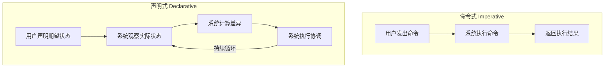

| 特性 | 命令式 | 声明式 |
|-----|-------|-------|
| 关注点 | 如何做（How） | 做什么（What） |
| 状态管理 | 用户负责 | 系统负责 |
| 错误恢复 | 用户处理 | 系统自动恢复 |
| 幂等性 | 需要显式实现 | 天然支持 |
| 示例 | `kubectl run nginx` | `kubectl apply -f deployment.yaml` |

### 1.2 声明式的优势

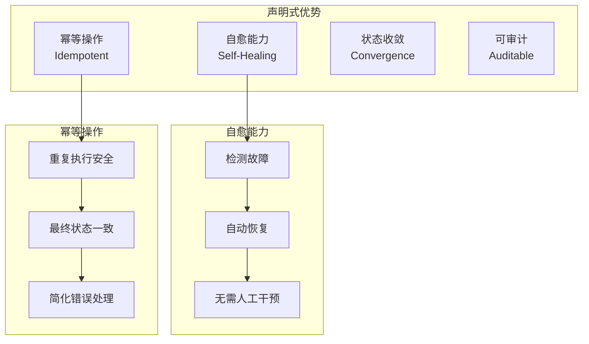

### 1.3 期望状态与实际状态

```yaml
# 期望状态 (Desired State) - 存储在 etcd 中
apiVersion: apps/v1
kind: Deployment
metadata:
  name: nginx
spec:
  replicas: 3  # 期望 3 个副本
  selector:
    matchLabels:
      app: nginx
  template:
    metadata:
      labels:
        app: nginx
    spec:
      containers:
      - name: nginx
        image: nginx:1.20

# 实际状态 (Actual State) - 通过观察集群获得
# - 当前只有 2 个 Pod 在运行
# - 1 个 Pod 由于节点故障而丢失

# 控制器行为：
# - 检测到差异：期望 3 个，实际 2 个
# - 创建 1 个新 Pod 以达到期望状态
```

## 2. Reconcile 模式

### 2.1 核心循环

Reconcile 是控制器的核心逻辑，不断将实际状态向期望状态收敛：

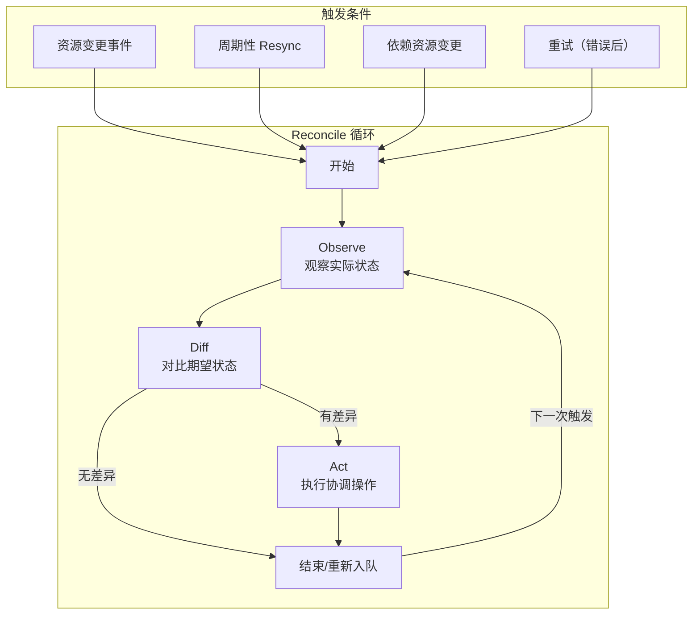

### 2.2 Reconcile 函数实现

```go
// 典型的 Reconcile 函数结构
func (r *DeploymentReconciler) Reconcile(
    ctx context.Context,
    req ctrl.Request,
) (ctrl.Result, error) {
    log := r.Log.WithValues("deployment", req.NamespacedName)

    // 1. 获取资源
    var deployment appsv1.Deployment
    if err := r.Get(ctx, req.NamespacedName, &deployment); err != nil {
        if errors.IsNotFound(err) {
            // 资源已删除，无需处理
            return ctrl.Result{}, nil
        }
        // 读取错误，重试
        return ctrl.Result{}, err
    }

    // 2. 检查是否正在删除
    if !deployment.DeletionTimestamp.IsZero() {
        return r.handleDeletion(ctx, &deployment)
    }

    // 3. 添加 Finalizer（如果需要）
    if !controllerutil.ContainsFinalizer(&deployment, finalizerName) {
        controllerutil.AddFinalizer(&deployment, finalizerName)
        if err := r.Update(ctx, &deployment); err != nil {
            return ctrl.Result{}, err
        }
    }

    // 4. 核心协调逻辑
    // 4.1 获取当前 ReplicaSet
    rsList, err := r.getReplicaSetsForDeployment(ctx, &deployment)
    if err != nil {
        return ctrl.Result{}, err
    }

    // 4.2 计算期望状态
    desiredRS := r.calculateDesiredReplicaSet(&deployment)

    // 4.3 执行协调
    if err := r.syncReplicaSet(ctx, &deployment, rsList, desiredRS); err != nil {
        return ctrl.Result{}, err
    }

    // 5. 更新状态
    if err := r.updateStatus(ctx, &deployment, rsList); err != nil {
        return ctrl.Result{}, err
    }

    // 6. 返回结果
    return ctrl.Result{
        // RequeueAfter: time.Minute, // 可选：定期重新入队
    }, nil
}
```

### 2.3 级联协调

多个控制器协同工作，形成级联协调：

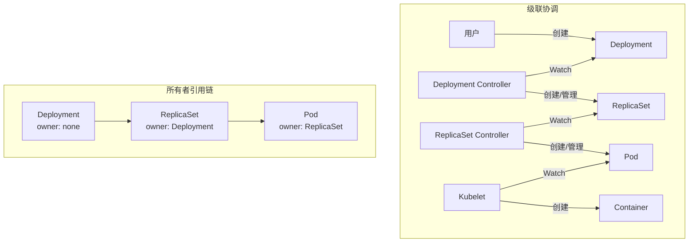

### 2.4 状态收敛

控制器通过不断的 Reconcile 使状态最终收敛：

```
时间 T0: 用户创建 Deployment (replicas=3)
         实际状态: 0 Pods
         期望状态: 3 Pods

时间 T1: Deployment Controller 创建 ReplicaSet
         实际状态: 0 Pods
         期望状态: 3 Pods

时间 T2: ReplicaSet Controller 创建 3 个 Pods
         实际状态: 3 Pods (Pending)
         期望状态: 3 Pods

时间 T3: Scheduler 调度 Pods 到节点
         实际状态: 3 Pods (Scheduled)
         期望状态: 3 Pods

时间 T4: Kubelet 启动容器
         实际状态: 3 Pods (Running)
         期望状态: 3 Pods
         ✓ 状态收敛完成
```

## 3. Level-Triggered vs Edge-Triggered

### 3.1 概念对比

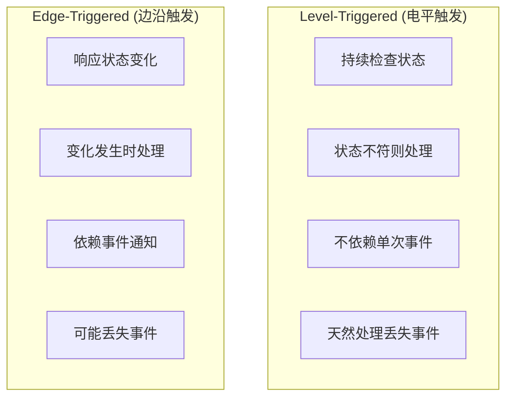

### 3.2 Kubernetes 的选择

Kubernetes 控制器采用 Level-Triggered 设计：

```go
// Level-Triggered 设计的关键特点

// 1. 不依赖事件顺序
func (c *Controller) syncHandler(key string) error {
    // 每次都完整计算期望状态，不依赖历史事件
    obj, exists, err := c.indexer.GetByKey(key)
    if err != nil || !exists {
        return nil
    }

    // 获取当前实际状态
    currentState := c.getCurrentState(obj)

    // 计算期望状态
    desiredState := c.calculateDesiredState(obj)

    // 协调差异
    return c.reconcile(currentState, desiredState)
}

// 2. 周期性 Resync 补偿丢失事件
informer := cache.NewSharedIndexInformer(
    &cache.ListWatch{...},
    &v1.Pod{},
    time.Hour, // Resync 周期：每小时重新同步一次
    cache.Indexers{},
)

// 3. 幂等性保证
func (c *Controller) ensurePodExists(desired *v1.Pod) error {
    existing, err := c.podLister.Pods(desired.Namespace).Get(desired.Name)
    if err == nil {
        // Pod 已存在，检查是否需要更新
        if reflect.DeepEqual(existing.Spec, desired.Spec) {
            return nil // 无需操作
        }
        return c.updatePod(existing, desired)
    }
    if errors.IsNotFound(err) {
        // Pod 不存在，创建
        return c.createPod(desired)
    }
    return err
}
```

### 3.3 事件驱动与周期同步

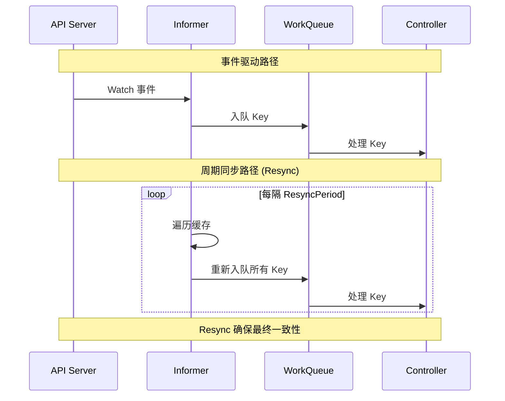

## 4. OwnerReference 与级联删除

### 4.1 OwnerReference 机制

OwnerReference 建立资源间的所有权关系：

```go
// staging/src/k8s.io/apimachinery/pkg/apis/meta/v1/types.go

// OwnerReference 包含让当前对象被另一个对象引用的足够信息
type OwnerReference struct {
    // APIVersion 是被引用资源的 API 版本
    APIVersion string `json:"apiVersion"`

    // Kind 是被引用资源的类型
    Kind string `json:"kind"`

    // Name 是被引用资源的名称
    Name string `json:"name"`

    // UID 是被引用资源的 UID
    UID types.UID `json:"uid"`

    // Controller 表示被引用资源是否是控制器
    // 一个对象最多有一个 controller=true 的 OwnerReference
    Controller *bool `json:"controller,omitempty"`

    // BlockOwnerDeletion 表示是否阻止所有者删除
    // 在 Foreground 删除策略中使用
    BlockOwnerDeletion *bool `json:"blockOwnerDeletion,omitempty"`
}
```

设置 OwnerReference 示例：

```go
// 创建 ReplicaSet 时设置 OwnerReference
func (dc *DeploymentController) createReplicaSet(
    deployment *appsv1.Deployment,
    rs *appsv1.ReplicaSet,
) error {
    // 设置所有者引用
    controllerRef := metav1.NewControllerRef(
        deployment,
        appsv1.SchemeGroupVersion.WithKind("Deployment"),
    )
    rs.OwnerReferences = append(rs.OwnerReferences, *controllerRef)

    _, err := dc.client.AppsV1().ReplicaSets(rs.Namespace).Create(
        context.TODO(),
        rs,
        metav1.CreateOptions{},
    )
    return err
}

// metav1.NewControllerRef 创建 OwnerReference
func NewControllerRef(owner Object, gvk schema.GroupVersionKind) *OwnerReference {
    blockOwnerDeletion := true
    isController := true
    return &OwnerReference{
        APIVersion:         gvk.GroupVersion().String(),
        Kind:               gvk.Kind,
        Name:               owner.GetName(),
        UID:                owner.GetUID(),
        BlockOwnerDeletion: &blockOwnerDeletion,
        Controller:         &isController,
    }
}
```

### 4.2 删除策略

Kubernetes 支持三种删除策略：

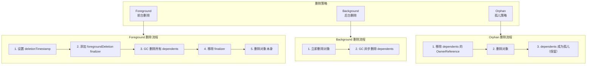

删除策略使用：

```go
// 使用不同的删除策略
func deleteDeployment(client kubernetes.Interface, namespace, name string) error {
    // Foreground 删除：先删除所有依赖资源
    propagationPolicy := metav1.DeletePropagationForeground

    // Background 删除：立即删除，异步清理依赖
    // propagationPolicy := metav1.DeletePropagationBackground

    // Orphan 删除：不删除依赖资源
    // propagationPolicy := metav1.DeletePropagationOrphan

    return client.AppsV1().Deployments(namespace).Delete(
        context.TODO(),
        name,
        metav1.DeleteOptions{
            PropagationPolicy: &propagationPolicy,
        },
    )
}
```

### 4.3 Garbage Collector

GC 控制器负责管理资源的级联删除：

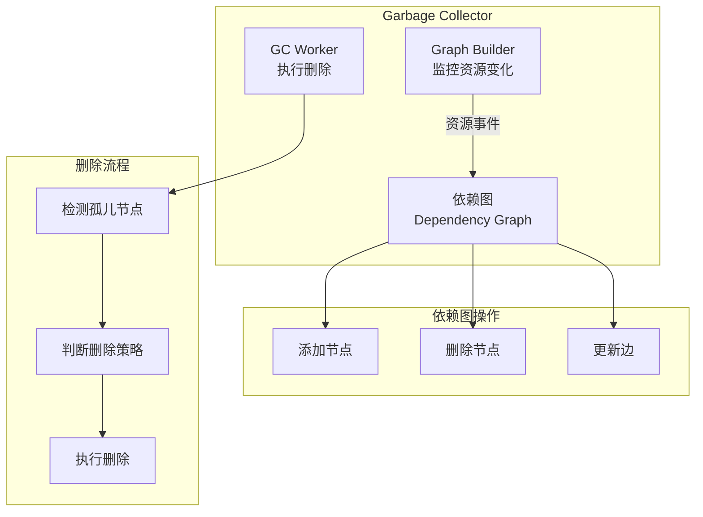

GC 控制器的核心结构：

```go
// pkg/controller/garbagecollector/garbagecollector.go

// GarbageCollector 运行 reflector 来监控托管 API 对象的变化，
// 并将依赖图与 API Server 状态同步
type GarbageCollector struct {
    // restMapper 用于资源发现
    restMapper meta.ResettableRESTMapper

    // metadataClient 用于读取/删除元数据
    metadataClient metadata.Interface

    // attemptToDelete 队列包含待删除的对象
    attemptToDelete workqueue.RateLimitingInterface

    // attemptToOrphan 队列包含待孤儿化的对象
    attemptToOrphan workqueue.RateLimitingInterface

    // dependencyGraphBuilder 构建和维护依赖图
    dependencyGraphBuilder *GraphBuilder

    // absentOwnerCache 缓存已确认不存在的所有者
    absentOwnerCache *ReferenceCache
}

// GraphBuilder 监控 API 对象并构建依赖图
type GraphBuilder struct {
    // uidToNode 存储 UID 到节点的映射
    uidToNode *concurrentUIDToNode

    // monitors 存储每种资源的监视器
    monitors monitors

    // graphChanges 接收图变更
    graphChanges workqueue.RateLimitingInterface
}

// node 表示依赖图中的一个对象
type node struct {
    identity objectReference

    // dependents 是依赖此对象的对象列表
    dependents map[*node]struct{}

    // owners 是此对象的所有者列表（来自 OwnerReferences）
    owners []metav1.OwnerReference

    // virtual 表示对象是否只存在于图中（尚未实际创建）
    virtual bool
}
```

## 5. Finalizer 机制

### 5.1 Finalizer 概念

Finalizer 是一种延迟删除机制，允许控制器在资源被删除前执行清理操作：

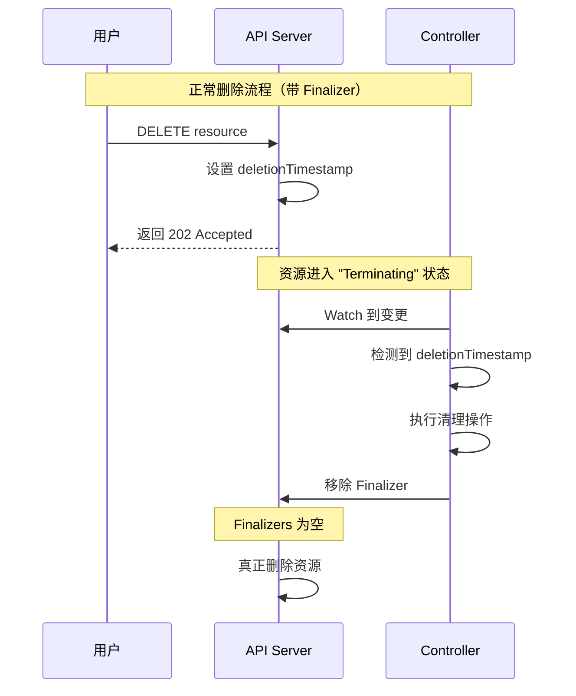

### 5.2 Finalizer 使用

```go
const myFinalizer = "mygroup.example.com/cleanup"

// 添加 Finalizer
func (r *Reconciler) addFinalizer(ctx context.Context, obj *MyResource) error {
    if controllerutil.ContainsFinalizer(obj, myFinalizer) {
        return nil
    }

    controllerutil.AddFinalizer(obj, myFinalizer)
    return r.Update(ctx, obj)
}

// 处理删除
func (r *Reconciler) handleDeletion(ctx context.Context, obj *MyResource) (ctrl.Result, error) {
    if !controllerutil.ContainsFinalizer(obj, myFinalizer) {
        return ctrl.Result{}, nil
    }

    // 执行清理操作
    if err := r.cleanup(ctx, obj); err != nil {
        // 清理失败，稍后重试
        return ctrl.Result{}, err
    }

    // 清理成功，移除 Finalizer
    controllerutil.RemoveFinalizer(obj, myFinalizer)
    if err := r.Update(ctx, obj); err != nil {
        return ctrl.Result{}, err
    }

    return ctrl.Result{}, nil
}

// 清理操作示例
func (r *Reconciler) cleanup(ctx context.Context, obj *MyResource) error {
    // 删除外部资源
    if err := r.deleteExternalResource(obj.Spec.ExternalID); err != nil {
        return err
    }

    // 清理其他依赖
    if err := r.cleanupDependencies(ctx, obj); err != nil {
        return err
    }

    return nil
}
```

### 5.3 常见 Finalizer

| Finalizer | 用途 |
|-----------|-----|
| `kubernetes.io/pv-protection` | 防止正在使用的 PV 被删除 |
| `kubernetes.io/pvc-protection` | 防止正在使用的 PVC 被删除 |
| `foregroundDeletion` | GC 使用，实现 Foreground 删除策略 |
| `orphan` | GC 使用，实现 Orphan 删除策略 |

## 6. 控制器设计模式

### 6.1 单资源控制器

最简单的控制器模式，监听一种资源：

```go
// 单资源控制器示例
type SimpleController struct {
    informer cache.SharedIndexInformer
    queue    workqueue.RateLimitingInterface
}

func NewSimpleController(informer cache.SharedIndexInformer) *SimpleController {
    c := &SimpleController{
        informer: informer,
        queue:    workqueue.NewRateLimitingQueue(workqueue.DefaultControllerRateLimiter()),
    }

    informer.AddEventHandler(cache.ResourceEventHandlerFuncs{
        AddFunc:    c.onAdd,
        UpdateFunc: c.onUpdate,
        DeleteFunc: c.onDelete,
    })

    return c
}

func (c *SimpleController) onAdd(obj interface{}) {
    key, err := cache.MetaNamespaceKeyFunc(obj)
    if err == nil {
        c.queue.Add(key)
    }
}
```

### 6.2 多资源协调器

监听多种相关资源，协调它们的关系：

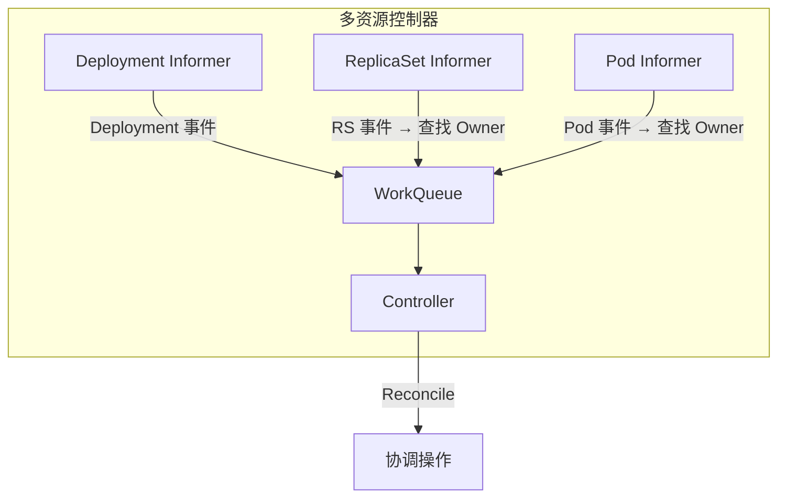

```go
// 多资源控制器示例
type DeploymentController struct {
    deploymentInformer cache.SharedIndexInformer
    rsInformer         cache.SharedIndexInformer
    podInformer        cache.SharedIndexInformer
    queue              workqueue.RateLimitingInterface
}

func (c *DeploymentController) setupInformers() {
    // Deployment 事件直接入队
    c.deploymentInformer.AddEventHandler(cache.ResourceEventHandlerFuncs{
        AddFunc:    c.enqueueDeployment,
        UpdateFunc: c.updateDeployment,
        DeleteFunc: c.enqueueDeployment,
    })

    // ReplicaSet 事件需要查找所属的 Deployment
    c.rsInformer.AddEventHandler(cache.ResourceEventHandlerFuncs{
        AddFunc:    c.addReplicaSet,
        UpdateFunc: c.updateReplicaSet,
        DeleteFunc: c.deleteReplicaSet,
    })

    // Pod 事件需要查找所属的 ReplicaSet，再查找 Deployment
    c.podInformer.AddEventHandler(cache.ResourceEventHandlerFuncs{
        AddFunc:    c.addPod,
        UpdateFunc: c.updatePod,
        DeleteFunc: c.deletePod,
    })
}

func (c *DeploymentController) addReplicaSet(obj interface{}) {
    rs := obj.(*appsv1.ReplicaSet)
    // 找到控制此 ReplicaSet 的 Deployment
    if controllerRef := metav1.GetControllerOf(rs); controllerRef != nil {
        deployment := c.resolveControllerRef(rs.Namespace, controllerRef)
        if deployment != nil {
            c.enqueueDeployment(deployment)
        }
    }
}
```

### 6.3 状态机控制器

处理具有复杂状态转换的资源：

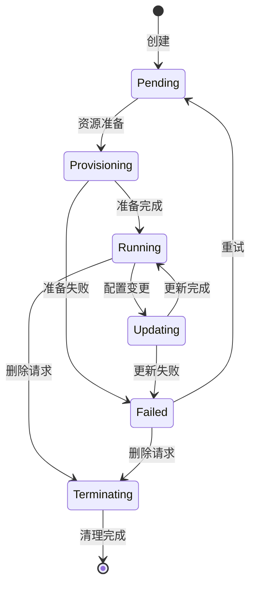

```go
// 状态机控制器示例
type StateMachineController struct {
    // ...
}

func (c *StateMachineController) Reconcile(ctx context.Context, req ctrl.Request) (ctrl.Result, error) {
    var resource MyResource
    if err := c.Get(ctx, req.NamespacedName, &resource); err != nil {
        return ctrl.Result{}, client.IgnoreNotFound(err)
    }

    // 根据当前状态执行不同的协调逻辑
    switch resource.Status.Phase {
    case PhasePending:
        return c.reconcilePending(ctx, &resource)
    case PhaseProvisioning:
        return c.reconcileProvisioning(ctx, &resource)
    case PhaseRunning:
        return c.reconcileRunning(ctx, &resource)
    case PhaseUpdating:
        return c.reconcileUpdating(ctx, &resource)
    case PhaseFailed:
        return c.reconcileFailed(ctx, &resource)
    case PhaseTerminating:
        return c.reconcileTerminating(ctx, &resource)
    default:
        return ctrl.Result{}, fmt.Errorf("unknown phase: %s", resource.Status.Phase)
    }
}

func (c *StateMachineController) reconcilePending(ctx context.Context, r *MyResource) (ctrl.Result, error) {
    // 检查前置条件
    if !c.checkPrerequisites(r) {
        return ctrl.Result{RequeueAfter: time.Second * 30}, nil
    }

    // 转换到 Provisioning 状态
    r.Status.Phase = PhaseProvisioning
    if err := c.Status().Update(ctx, r); err != nil {
        return ctrl.Result{}, err
    }

    return ctrl.Result{Requeue: true}, nil
}
```

## 7. 最佳实践

### 7.1 幂等性

确保 Reconcile 操作可以安全地重复执行：

```go
// 幂等性示例：创建或更新 ConfigMap
func (r *Reconciler) ensureConfigMap(ctx context.Context, owner *MyResource) error {
    desired := r.buildDesiredConfigMap(owner)

    existing := &corev1.ConfigMap{}
    err := r.Get(ctx, client.ObjectKeyFromObject(desired), existing)

    if errors.IsNotFound(err) {
        // 不存在，创建
        return r.Create(ctx, desired)
    }
    if err != nil {
        return err
    }

    // 已存在，检查是否需要更新
    if reflect.DeepEqual(existing.Data, desired.Data) {
        return nil // 无需更新
    }

    // 需要更新
    existing.Data = desired.Data
    return r.Update(ctx, existing)
}
```

### 7.2 错误处理与重试

合理处理错误，使用指数退避重试：

```go
func (r *Reconciler) Reconcile(ctx context.Context, req ctrl.Request) (ctrl.Result, error) {
    // ... reconcile 逻辑 ...

    // 临时错误：返回 error 触发重试
    if isTemporaryError(err) {
        return ctrl.Result{}, err // controller-runtime 会自动退避重试
    }

    // 需要稍后重试
    if needsRetryLater(resource) {
        return ctrl.Result{RequeueAfter: time.Minute}, nil
    }

    // 永久错误：记录并停止重试
    if isPermanentError(err) {
        r.recorder.Event(resource, corev1.EventTypeWarning, "Failed", err.Error())
        // 更新状态为失败
        resource.Status.Phase = PhaseFailed
        resource.Status.Message = err.Error()
        _ = r.Status().Update(ctx, resource)
        return ctrl.Result{}, nil // 不返回 error，不重试
    }

    return ctrl.Result{}, nil
}
```

### 7.3 状态报告

及时更新资源状态，便于用户了解进度：

```go
// 更新状态和条件
func (r *Reconciler) updateStatus(ctx context.Context, resource *MyResource, phase string, condition metav1.Condition) error {
    // 设置 ObservedGeneration
    resource.Status.ObservedGeneration = resource.Generation

    // 设置阶段
    resource.Status.Phase = phase

    // 设置条件
    meta.SetStatusCondition(&resource.Status.Conditions, condition)

    return r.Status().Update(ctx, resource)
}

// 使用标准条件类型
func (r *Reconciler) setReadyCondition(resource *MyResource, ready bool, reason, message string) {
    status := metav1.ConditionFalse
    if ready {
        status = metav1.ConditionTrue
    }

    meta.SetStatusCondition(&resource.Status.Conditions, metav1.Condition{
        Type:               "Ready",
        Status:             status,
        ObservedGeneration: resource.Generation,
        LastTransitionTime: metav1.Now(),
        Reason:             reason,
        Message:            message,
    })
}
```

### 7.4 事件记录

记录重要事件便于问题排查：

```go
// 使用 Event Recorder
type Reconciler struct {
    client.Client
    recorder record.EventRecorder
}

func (r *Reconciler) Reconcile(ctx context.Context, req ctrl.Request) (ctrl.Result, error) {
    var resource MyResource
    if err := r.Get(ctx, req.NamespacedName, &resource); err != nil {
        return ctrl.Result{}, client.IgnoreNotFound(err)
    }

    // 记录正常事件
    r.recorder.Event(&resource, corev1.EventTypeNormal, "Reconciling", "Starting reconciliation")

    // 执行操作
    if err := r.doSomething(&resource); err != nil {
        // 记录警告事件
        r.recorder.Eventf(&resource, corev1.EventTypeWarning, "Failed",
            "Operation failed: %v", err)
        return ctrl.Result{}, err
    }

    // 记录成功事件
    r.recorder.Event(&resource, corev1.EventTypeNormal, "Reconciled", "Successfully reconciled")

    return ctrl.Result{}, nil
}
```

## 小结

控制循环是 Kubernetes 的核心设计模式：

1. **声明式设计**：用户只需声明期望状态，系统自动协调
2. **Reconcile 模式**：观察-对比-行动的循环，持续收敛状态
3. **Level-Triggered**：基于状态而非事件，天然处理事件丢失
4. **级联删除**：通过 OwnerReference 建立所有权关系
5. **Finalizer**：确保资源删除前完成必要的清理
6. **设计模式**：单资源、多资源协调、状态机等多种模式

理解控制循环模式是开发 Kubernetes 控制器和 Operator 的基础。在后续章节中，我们将深入分析各个内置控制器的具体实现。
