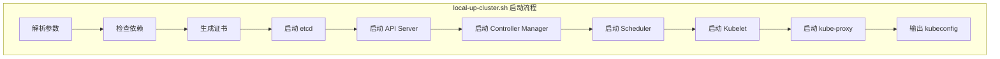
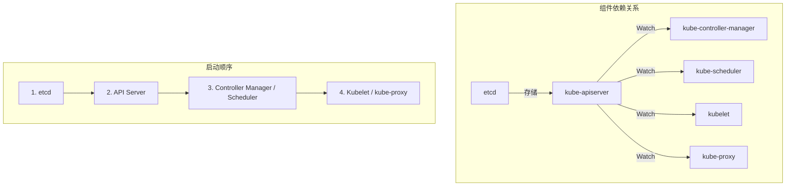

本文详细介绍如何使用 `local-up-cluster.sh` 脚本启动本地 Kubernetes 集群，进行组件调试和问题排查。

## 1. local-up-cluster.sh 解析

### 1.1 脚本概述

`hack/local-up-cluster.sh` 是 Kubernetes 官方提供的本地开发脚本，它可以在单机上启动完整的 Kubernetes 控制平面和节点组件。



### 1.2 脚本位置和参数

```bash
# 脚本位置
./hack/local-up-cluster.sh

# 查看帮助
./hack/local-up-cluster.sh --help
```

### 1.3 关键环境变量

```bash
# 容器运行时配置
export CONTAINER_RUNTIME_ENDPOINT="unix:///run/containerd/containerd.sock"
# 或使用 Docker
# export CONTAINER_RUNTIME_ENDPOINT="unix:///var/run/cri-dockerd.sock"

# 日志级别 (0-10, 数字越大越详细)
export LOG_LEVEL=4

# 启用特定功能
export FEATURE_GATES="DynamicResourceAllocation=true"

# API Server 相关
export API_HOST=127.0.0.1
export API_SECURE_PORT=6443
export API_PORT=8080
export INSECURE_SCHEDULER=false
export INSECURE_CONTROLLER_MANAGER=false

# 网络配置
export SERVICE_CLUSTER_IP_RANGE="10.0.0.0/24"
export CLUSTER_CIDR="10.1.0.0/16"
export FIRST_SERVICE_CLUSTER_IP="10.0.0.1"
export DNS_SERVER_IP="10.0.0.10"
export DNS_DOMAIN="cluster.local"

# 存储配置
export ETCD_HOST=127.0.0.1
export ETCD_PORT=2379

# 认证授权
export AUTHORIZATION_MODE="RBAC"
export ENABLE_ADMISSION_PLUGINS="NamespaceLifecycle,LimitRanger,ServiceAccount"

# Kubelet 配置
export KUBELET_HOST=127.0.0.1
export HOSTNAME_OVERRIDE=127.0.0.1

# 控制器配置
export CLOUD_PROVIDER=""
export CLOUD_CONFIG=""

# 调试选项
export ALLOW_PRIVILEGED=true
export ENABLE_DAEMON=false
```

### 1.4 脚本关键逻辑

```bash
# hack/local-up-cluster.sh 核心逻辑摘要

# 1. 定义常量和默认值
ETCD_VERSION=${ETCD_VERSION:-"3.5.12-0"}
KUBE_ROOT=$(dirname "${BASH_SOURCE[0]}")/..

# 2. 检查必要的二进制文件
function kube::util::test-cmd() {
    command -v "$1" >/dev/null 2>&1
}

# 3. 启动 etcd
function start_etcd() {
    ETCD_LOGFILE=${LOG_DIR}/etcd.log
    kube::etcd::start
}

# 4. 启动 API Server
function start_apiserver() {
    APISERVER_LOG=${LOG_DIR}/kube-apiserver.log

    ${CONTROLPLANE_SUDO} "${KUBE_OUTPUT_HOSTBIN}/kube-apiserver" \
        --authorization-mode="${AUTHORIZATION_MODE}" \
        --etcd-servers="http://${ETCD_HOST}:${ETCD_PORT}" \
        --service-cluster-ip-range="${SERVICE_CLUSTER_IP_RANGE}" \
        --secure-port="${API_SECURE_PORT}" \
        --tls-cert-file="${CERT_DIR}/serving-kube-apiserver.crt" \
        --tls-private-key-file="${CERT_DIR}/serving-kube-apiserver.key" \
        --client-ca-file="${CERT_DIR}/client-ca.crt" \
        --service-account-issuer="https://kubernetes.default.svc" \
        --service-account-key-file="${CERT_DIR}/service-account.pub" \
        --service-account-signing-key-file="${CERT_DIR}/service-account.key" \
        --v="${LOG_LEVEL}" \
        >"${APISERVER_LOG}" 2>&1 &
    APISERVER_PID=$!
}

# 5. 启动其他组件...
```

## 2. 单组件启动模式

### 2.1 仅启动 API Server

当只需要调试 API Server 时：

```bash
# 1. 首先启动 etcd
etcd --data-dir=/tmp/etcd-data \
     --listen-client-urls=http://127.0.0.1:2379 \
     --advertise-client-urls=http://127.0.0.1:2379 &

# 2. 生成证书 (使用脚本)
./hack/generate-internal-groups.sh

# 3. 手动启动 API Server
./_output/bin/kube-apiserver \
    --etcd-servers=http://127.0.0.1:2379 \
    --service-cluster-ip-range=10.0.0.0/24 \
    --secure-port=6443 \
    --authorization-mode=RBAC \
    --client-ca-file=/var/run/kubernetes/client-ca.crt \
    --tls-cert-file=/var/run/kubernetes/serving-kube-apiserver.crt \
    --tls-private-key-file=/var/run/kubernetes/serving-kube-apiserver.key \
    --service-account-issuer=https://kubernetes.default.svc \
    --service-account-key-file=/var/run/kubernetes/service-account.pub \
    --service-account-signing-key-file=/var/run/kubernetes/service-account.key \
    --v=4
```

### 2.2 仅启动 Controller Manager

```bash
# 前提：API Server 已运行

./_output/bin/kube-controller-manager \
    --kubeconfig=/var/run/kubernetes/controller.kubeconfig \
    --leader-elect=false \
    --controllers=deployment,replicaset,statefulset \
    --service-account-private-key-file=/var/run/kubernetes/service-account.key \
    --root-ca-file=/var/run/kubernetes/server-ca.crt \
    --v=4
```

### 2.3 仅启动 Scheduler

```bash
# 前提：API Server 已运行

./_output/bin/kube-scheduler \
    --kubeconfig=/var/run/kubernetes/scheduler.kubeconfig \
    --leader-elect=false \
    --v=4
```

### 2.4 组件间依赖处理



## 3. 日志与输出

### 3.1 日志级别控制

Kubernetes 使用 klog 进行日志记录，支持多个日志级别：

| 级别 | 描述 | 使用场景 |
|-----|-----|---------|
| 0 | 最小日志 | 生产环境 |
| 1 | 正常操作日志 | 生产环境 |
| 2 | 稳定状态信息 | 一般调试 |
| 3 | 扩展信息 | 调试 |
| 4 | 调试级别信息 | 开发调试 |
| 5 | Trace 级别 | 详细跟踪 |
| 6+ | 非常详细的 Trace | 深度调试 |

```bash
# 全局日志级别
./_output/bin/kube-apiserver --v=4 ...

# 针对特定模块的日志级别
./_output/bin/kube-controller-manager \
    --v=2 \
    --vmodule=deployment_controller=5,replica_set=4 \
    ...
```

### 3.2 结构化日志

Kubernetes 1.19+ 支持结构化日志：

```bash
# 启用结构化日志格式
./_output/bin/kube-apiserver \
    --logging-format=json \
    ...

# 日志输出示例
{
    "ts": "2024-01-15T10:30:00.000Z",
    "msg": "Starting kube-apiserver",
    "v": 0,
    "logger": "apiserver"
}
```

### 3.3 日志文件位置

使用 `local-up-cluster.sh` 时，日志默认输出到：

```bash
# 日志目录
/tmp/kube-log/

# 各组件日志
/tmp/kube-log/kube-apiserver.log
/tmp/kube-log/kube-controller-manager.log
/tmp/kube-log/kube-scheduler.log
/tmp/kube-log/kubelet.log
/tmp/kube-log/kube-proxy.log
/tmp/kube-log/etcd.log

# 查看实时日志
tail -f /tmp/kube-log/kube-apiserver.log

# 搜索特定内容
grep -i "error" /tmp/kube-log/kube-controller-manager.log
```

## 4. 证书与认证

### 4.1 自签名证书生成

`local-up-cluster.sh` 自动生成所需的证书：

```bash
# 证书目录
/var/run/kubernetes/

# 生成的证书文件
├── client-ca.crt                    # 客户端 CA 证书
├── client-ca.key                    # 客户端 CA 私钥
├── server-ca.crt                    # 服务端 CA 证书
├── server-ca.key                    # 服务端 CA 私钥
├── serving-kube-apiserver.crt       # API Server 服务证书
├── serving-kube-apiserver.key       # API Server 服务私钥
├── service-account.key              # ServiceAccount 签名私钥
├── service-account.pub              # ServiceAccount 验证公钥
├── admin.kubeconfig                 # 管理员 kubeconfig
├── controller.kubeconfig            # Controller Manager kubeconfig
└── scheduler.kubeconfig             # Scheduler kubeconfig
```

### 4.2 手动生成证书

```bash
# 使用 cfssl 生成证书
# 安装 cfssl
go install github.com/cloudflare/cfssl/cmd/cfssl@latest
go install github.com/cloudflare/cfssl/cmd/cfssljson@latest

# CA 配置
cat > ca-config.json << EOF
{
    "signing": {
        "default": {
            "expiry": "8760h"
        },
        "profiles": {
            "kubernetes": {
                "expiry": "8760h",
                "usages": [
                    "signing",
                    "key encipherment",
                    "server auth",
                    "client auth"
                ]
            }
        }
    }
}
EOF

# CA CSR
cat > ca-csr.json << EOF
{
    "CN": "kubernetes",
    "key": {
        "algo": "rsa",
        "size": 2048
    },
    "names": [
        {
            "O": "Kubernetes",
            "OU": "CA"
        }
    ]
}
EOF

# 生成 CA
cfssl gencert -initca ca-csr.json | cfssljson -bare ca
```

### 4.3 kubeconfig 配置

```yaml
# /var/run/kubernetes/admin.kubeconfig
apiVersion: v1
kind: Config
clusters:
- cluster:
    certificate-authority: /var/run/kubernetes/server-ca.crt
    server: https://127.0.0.1:6443
  name: local
contexts:
- context:
    cluster: local
    user: admin
  name: local
current-context: local
users:
- name: admin
  user:
    client-certificate: /var/run/kubernetes/client-admin.crt
    client-key: /var/run/kubernetes/client-admin.key
```

### 4.4 ServiceAccount Token

```bash
# 查看 ServiceAccount Token
kubectl get secret -n kube-system

# 创建测试用 ServiceAccount
kubectl create serviceaccount test-sa

# 获取 Token (Kubernetes 1.24+)
kubectl create token test-sa

# 使用 Token 访问 API
curl -k -H "Authorization: Bearer $TOKEN" \
    https://127.0.0.1:6443/api/v1/namespaces
```

## 5. 网络配置

### 5.1 网络参数

```bash
# Service 网络
export SERVICE_CLUSTER_IP_RANGE="10.0.0.0/24"
export FIRST_SERVICE_CLUSTER_IP="10.0.0.1"

# Pod 网络
export CLUSTER_CIDR="10.1.0.0/16"

# DNS
export DNS_SERVER_IP="10.0.0.10"
export DNS_DOMAIN="cluster.local"
```

### 5.2 CNI 插件配置

```bash
# CNI 配置目录
/etc/cni/net.d/

# 简单的 bridge CNI 配置
cat > /etc/cni/net.d/10-bridge.conf << EOF
{
    "cniVersion": "0.4.0",
    "name": "bridge",
    "type": "bridge",
    "bridge": "cni0",
    "isGateway": true,
    "ipMasq": true,
    "ipam": {
        "type": "host-local",
        "subnet": "10.1.0.0/16",
        "routes": [
            { "dst": "0.0.0.0/0" }
        ]
    }
}
EOF

# loopback CNI 配置
cat > /etc/cni/net.d/99-loopback.conf << EOF
{
    "cniVersion": "0.4.0",
    "name": "lo",
    "type": "loopback"
}
EOF
```

### 5.3 网络调试

```bash
# 检查 Pod 网络
kubectl run test --image=busybox --rm -it --restart=Never -- sh
# 在 Pod 中
ip addr
ip route
cat /etc/resolv.conf

# 检查 Service 网络
kubectl get svc
iptables -t nat -L KUBE-SERVICES -n

# 检查 DNS
kubectl run test --image=busybox --rm -it --restart=Never -- \
    nslookup kubernetes.default.svc.cluster.local
```

## 6. 完整启动示例

### 6.1 最小化启动

```bash
# 清理旧进程
pkill -f kube-apiserver || true
pkill -f kube-controller-manager || true
pkill -f kube-scheduler || true
pkill -f kubelet || true
pkill -f etcd || true

# 设置环境变量
export CONTAINER_RUNTIME_ENDPOINT="unix:///run/containerd/containerd.sock"
export LOG_LEVEL=4
export ALLOW_PRIVILEGED=true

# 启动集群
./hack/local-up-cluster.sh

# 在另一个终端
export KUBECONFIG=/var/run/kubernetes/admin.kubeconfig
kubectl get nodes
kubectl get componentstatuses
```

### 6.2 调试模式启动

```bash
# 带详细日志启动
export LOG_LEVEL=6
export KUBE_VERBOSE=6

# 启用 Feature Gates
export FEATURE_GATES="DynamicResourceAllocation=true,PodSchedulingReadiness=true"

# 启动
./hack/local-up-cluster.sh

# 观察特定组件日志
tail -f /tmp/kube-log/kube-controller-manager.log | grep -i deployment
```

### 6.3 常见问题排查

```bash
# 问题：etcd 无法启动
# 检查 etcd 数据目录
rm -rf /tmp/etcd-data
# 或检查端口占用
lsof -i :2379

# 问题：API Server 无法启动
# 检查证书
openssl x509 -in /var/run/kubernetes/serving-kube-apiserver.crt -text -noout
# 检查 etcd 连接
curl http://127.0.0.1:2379/health

# 问题：Kubelet 无法启动
# 检查容器运行时
crictl info
# 检查 cgroup
cat /proc/cgroups

# 问题：网络不通
# 检查 CNI
ls /etc/cni/net.d/
# 检查 iptables
iptables -t nat -L -n
```

## 小结

本文介绍了使用 `local-up-cluster.sh` 进行本地开发调试的完整流程：

1. **脚本解析**：理解脚本的环境变量和启动逻辑
2. **单组件模式**：独立启动特定组件进行针对性调试
3. **日志配置**：控制日志级别和输出位置
4. **证书认证**：理解证书体系和 kubeconfig 配置
5. **网络配置**：配置 Service CIDR、Pod CIDR 和 CNI

下一篇文章将介绍使用 Delve 调试器进行代码级调试。
