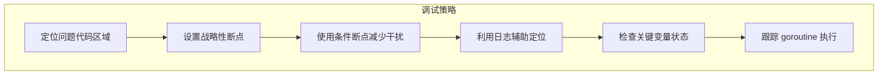

Delve 是 Go 语言的专业调试器，本文详细介绍如何使用 Delve 调试 Kubernetes 组件。

## 1. Delve 安装与配置

### 1.1 安装 Delve

```bash
# 使用 go install 安装
go install github.com/go-delve/delve/cmd/dlv@latest

# 验证安装
dlv version
# 输出: Delve Debugger Version: x.x.x

# macOS 额外配置 (如需)
# 允许调试器访问进程
sudo /usr/sbin/DevToolsSecurity -enable
```

### 1.2 编译带调试符号的二进制

```bash
# 使用 DBG=1 构建
make DBG=1 WHAT=cmd/kube-apiserver
make DBG=1 WHAT=cmd/kube-controller-manager
make DBG=1 WHAT=cmd/kube-scheduler
make DBG=1 WHAT=cmd/kubelet

# 手动构建带调试符号
go build -gcflags="all=-N -l" -o kube-apiserver ./cmd/kube-apiserver

# 验证调试符号
file _output/bin/kube-apiserver
# 应该显示 "with debug_info" 或类似信息
```

### 1.3 Delve 常用命令

| 命令 | 缩写 | 描述 |
|-----|-----|-----|
| `break` | `b` | 设置断点 |
| `continue` | `c` | 继续执行 |
| `next` | `n` | 单步执行 (不进入函数) |
| `step` | `s` | 单步执行 (进入函数) |
| `stepout` | `so` | 执行到函数返回 |
| `print` | `p` | 打印变量值 |
| `locals` | | 显示所有局部变量 |
| `args` | | 显示函数参数 |
| `goroutines` | `grs` | 列出所有 goroutine |
| `goroutine` | `gr` | 切换到指定 goroutine |
| `stack` | `bt` | 显示调用栈 |
| `list` | `l` | 显示源代码 |
| `breakpoints` | `bp` | 列出所有断点 |
| `clear` | | 清除断点 |
| `quit` | `q` | 退出调试器 |

## 2. 本地调试

### 2.1 启动调试

```bash
# 方式一：启动时调试
dlv debug ./cmd/kube-apiserver -- \
    --etcd-servers=http://127.0.0.1:2379 \
    --service-cluster-ip-range=10.0.0.0/24 \
    --secure-port=6443 \
    --v=2

# 方式二：调试已编译的二进制
dlv exec ./_output/bin/kube-apiserver -- \
    --etcd-servers=http://127.0.0.1:2379 \
    --service-cluster-ip-range=10.0.0.0/24

# 方式三：附加到运行中的进程
# 首先找到进程 ID
pgrep -f kube-apiserver
# 然后附加
dlv attach <pid>
```

### 2.2 设置断点

```bash
# 在 Delve 中设置断点

# 按函数名
(dlv) b main.main
(dlv) b k8s.io/kubernetes/pkg/controller/deployment.(*DeploymentController).syncDeployment

# 按文件和行号
(dlv) b pkg/controller/deployment/deployment_controller.go:100

# 按正则表达式
(dlv) break /syncDeployment/

# 条件断点
(dlv) b pkg/controller/deployment/deployment_controller.go:100
(dlv) cond 1 deployment.Name == "nginx"

# 查看断点
(dlv) breakpoints

# 清除断点
(dlv) clear 1
(dlv) clearall
```

### 2.3 调试示例：Deployment Controller

```bash
# 1. 构建带调试符号的 Controller Manager
make DBG=1 WHAT=cmd/kube-controller-manager

# 2. 确保 API Server 运行中
kubectl cluster-info

# 3. 启动调试
dlv exec ./_output/bin/kube-controller-manager -- \
    --kubeconfig=$HOME/.kube/config \
    --leader-elect=false \
    --controllers=deployment \
    --v=4

# 4. 设置断点
(dlv) b k8s.io/kubernetes/pkg/controller/deployment.(*DeploymentController).syncDeployment

# 5. 继续执行
(dlv) c

# 6. 在另一个终端创建 Deployment 触发断点
kubectl create deployment nginx --image=nginx

# 7. 断点触发后，检查变量
(dlv) args
(dlv) locals
(dlv) p deployment
(dlv) p deployment.Spec.Replicas
```

## 3. 远程调试

### 3.1 headless 模式

```bash
# 在远程服务器上启动 headless 调试器
dlv exec --headless --listen=:2345 --api-version=2 --accept-multiclient \
    ./_output/bin/kube-controller-manager -- \
    --kubeconfig=/etc/kubernetes/admin.conf \
    --leader-elect=false \
    --v=4

# 在本地连接
dlv connect 192.168.1.100:2345
```

### 3.2 SSH 端口转发

```bash
# 建立 SSH 隧道
ssh -L 2345:localhost:2345 user@remote-server

# 在远程服务器启动调试器
dlv exec --headless --listen=:2345 --api-version=2 \
    ./kube-controller-manager -- --kubeconfig=...

# 在本地连接
dlv connect localhost:2345
```

### 3.3 容器内调试

```bash
# Dockerfile 中添加 delve
FROM golang:1.25 AS builder
RUN go install github.com/go-delve/delve/cmd/dlv@latest

FROM debian:stable-slim
COPY --from=builder /go/bin/dlv /usr/local/bin/
COPY kube-apiserver /usr/local/bin/

# 运行时命令
CMD ["dlv", "--listen=:2345", "--headless=true", "--api-version=2", \
     "--accept-multiclient", "exec", "/usr/local/bin/kube-apiserver", "--", \
     "--etcd-servers=..."]
```

```yaml
# Kubernetes Pod 配置
apiVersion: v1
kind: Pod
metadata:
  name: debug-apiserver
spec:
  containers:
  - name: apiserver
    image: k8s.gcr.io/kube-apiserver:debug
    ports:
    - containerPort: 2345
      name: delve
    securityContext:
      capabilities:
        add: ["SYS_PTRACE"]
```

## 4. 调试技巧

### 4.1 条件断点

```bash
# 设置断点
(dlv) b pkg/controller/deployment/deployment_controller.go:150

# 添加条件
(dlv) cond 1 deployment.Namespace == "default"
(dlv) cond 1 len(deployment.Spec.Template.Spec.Containers) > 1

# 查看断点条件
(dlv) breakpoints

# 修改条件
(dlv) cond 1 deployment.Name == "nginx"

# 移除条件
(dlv) cond 1
```

### 4.2 监视变量

```bash
# 打印变量
(dlv) p deployment
(dlv) p deployment.Spec
(dlv) p *deployment.Spec.Replicas

# 打印指针内容
(dlv) p *deployment

# 打印数组/切片
(dlv) p pods
(dlv) p pods[0]
(dlv) p pods[:3]

# 打印 map
(dlv) p labels
(dlv) p labels["app"]

# 格式化输出
(dlv) p fmt.Sprintf("%+v", deployment)

# 设置显示选项
(dlv) config max-string-len 1000
(dlv) config max-array-values 100
```

### 4.3 调用栈分析

```bash
# 查看调用栈
(dlv) stack
0  0x0000000001234567 in k8s.io/kubernetes/pkg/controller/deployment.(*DeploymentController).syncDeployment
   at ./pkg/controller/deployment/deployment_controller.go:150
1  0x0000000001234568 in k8s.io/kubernetes/pkg/controller/deployment.(*DeploymentController).processNextWorkItem
   at ./pkg/controller/deployment/deployment_controller.go:120
2  ...

# 查看特定帧
(dlv) frame 1

# 切换帧并查看变量
(dlv) frame 1
(dlv) locals

# 查看更多帧
(dlv) stack 20

# 向上/向下移动帧
(dlv) up
(dlv) down
```

### 4.4 Goroutine 调试

```bash
# 列出所有 goroutine
(dlv) goroutines
  Goroutine 1 - User: ./pkg/controller/deployment/deployment_controller.go:150 syncDeployment (0x1234567)
  Goroutine 2 - User: ./staging/src/k8s.io/client-go/tools/cache/reflector.go:200 ListAndWatch (0x2345678)
  ...

# 筛选 goroutine
(dlv) goroutines -group go
(dlv) goroutines -group user

# 切换到指定 goroutine
(dlv) goroutine 2

# 查看特定 goroutine 的栈
(dlv) goroutine 2 stack

# 在所有 goroutine 中搜索特定函数
(dlv) goroutines -exec "stack" | grep syncDeployment
```

### 4.5 内存检查

```bash
# 查看内存地址
(dlv) x -fmt hex -count 16 0x1234567

# 查看字符串的底层数组
(dlv) p (*reflect.StringHeader)(unsafe.Pointer(&s))

# 查看 slice 的底层数组
(dlv) p (*reflect.SliceHeader)(unsafe.Pointer(&pods))
```

## 5. 常见调试场景

### 5.1 API 请求处理

调试 API Server 处理请求的过程：

```bash
# 设置断点
(dlv) b staging/src/k8s.io/apiserver/pkg/endpoints/handlers/create.go:CreateResource

# 或者更具体的位置
(dlv) b staging/src/k8s.io/apiserver/pkg/server/handler.go:ServeHTTP

# 触发请求
kubectl create deployment test --image=nginx

# 断点触发后
(dlv) args
(dlv) p r.URL.Path
(dlv) p r.Method
```

### 5.2 控制器 Reconcile

调试控制器的协调逻辑：

```bash
# Deployment Controller
(dlv) b pkg/controller/deployment.(*DeploymentController).syncDeployment
(dlv) b pkg/controller/deployment.(*DeploymentController).getNewReplicaSet

# ReplicaSet Controller
(dlv) b pkg/controller/replicaset.(*ReplicaSetController).syncReplicaSet
(dlv) b pkg/controller/replicaset.(*ReplicaSetController).manageReplicas

# 继续执行并触发事件
(dlv) c

# kubectl 操作触发
kubectl scale deployment nginx --replicas=5
```

### 5.3 调度决策

调试 Scheduler 的调度决策：

```bash
# 调度主循环
(dlv) b pkg/scheduler.(*Scheduler).scheduleOne

# Filter 阶段
(dlv) b pkg/scheduler/framework/runtime.(*frameworkImpl).RunFilterPlugins

# Score 阶段
(dlv) b pkg/scheduler/framework/runtime.(*frameworkImpl).RunScorePlugins

# 绑定阶段
(dlv) b pkg/scheduler/framework/runtime.(*frameworkImpl).RunBindPlugins
```

### 5.4 Informer 同步

调试 client-go Informer 机制：

```bash
# Reflector ListAndWatch
(dlv) b staging/src/k8s.io/client-go/tools/cache.(*Reflector).ListAndWatch

# DeltaFIFO
(dlv) b staging/src/k8s.io/client-go/tools/cache.(*DeltaFIFO).Pop

# SharedInformer 事件处理
(dlv) b staging/src/k8s.io/client-go/tools/cache.(*sharedIndexInformer).HandleDeltas
```

## 6. VSCode/GoLand 集成

### 6.1 VSCode launch.json

```json
{
    "version": "0.2.0",
    "configurations": [
        {
            "name": "Debug API Server",
            "type": "go",
            "request": "launch",
            "mode": "debug",
            "program": "${workspaceFolder}/cmd/kube-apiserver",
            "args": [
                "--etcd-servers=http://127.0.0.1:2379",
                "--service-cluster-ip-range=10.0.0.0/24",
                "--secure-port=6443",
                "--authorization-mode=RBAC",
                "--v=4"
            ],
            "env": {
                "KUBERNETES_SERVICE_HOST": "",
                "KUBERNETES_SERVICE_PORT": ""
            },
            "showLog": true
        },
        {
            "name": "Debug Controller Manager",
            "type": "go",
            "request": "launch",
            "mode": "debug",
            "program": "${workspaceFolder}/cmd/kube-controller-manager",
            "args": [
                "--kubeconfig=${env:HOME}/.kube/config",
                "--leader-elect=false",
                "--controllers=deployment,replicaset",
                "--v=4"
            ]
        },
        {
            "name": "Debug Scheduler",
            "type": "go",
            "request": "launch",
            "mode": "debug",
            "program": "${workspaceFolder}/cmd/kube-scheduler",
            "args": [
                "--kubeconfig=${env:HOME}/.kube/config",
                "--leader-elect=false",
                "--v=4"
            ]
        },
        {
            "name": "Attach to Process",
            "type": "go",
            "request": "attach",
            "mode": "local",
            "processId": "${command:pickProcess}"
        },
        {
            "name": "Remote Debug",
            "type": "go",
            "request": "attach",
            "mode": "remote",
            "remotePath": "${workspaceFolder}",
            "port": 2345,
            "host": "127.0.0.1"
        },
        {
            "name": "Debug Unit Test",
            "type": "go",
            "request": "launch",
            "mode": "test",
            "program": "${fileDirname}",
            "args": [
                "-test.v",
                "-test.run",
                "TestSyncDeployment"
            ]
        }
    ]
}
```

### 6.2 GoLand 运行配置

1. **创建 Go Build 配置**：
   - Run → Edit Configurations → + → Go Build
   - Name: Debug kube-apiserver
   - Run kind: Package
   - Package path: `k8s.io/kubernetes/cmd/kube-apiserver`
   - Program arguments: `--etcd-servers=http://127.0.0.1:2379 --v=4`

2. **设置调试选项**：
   - 勾选 "Build with race detector" (可选)
   - 取消 "Run after build"

3. **启动调试**：
   - 点击 Debug 按钮或按 Shift+F9

### 6.3 调试快捷键

| 操作 | VSCode | GoLand |
|-----|--------|--------|
| 开始/继续调试 | F5 | Shift+F9 / F9 |
| 停止调试 | Shift+F5 | Ctrl+F2 |
| 单步跳过 | F10 | F8 |
| 单步进入 | F11 | F7 |
| 单步跳出 | Shift+F11 | Shift+F8 |
| 切换断点 | F9 | Ctrl+F8 |
| 显示变量值 | 悬停 | 悬停 / Ctrl+点击 |

## 7. 调试最佳实践

### 7.1 调试策略



### 7.2 常见问题解决

```bash
# 问题：断点不触发
# 检查编译是否包含调试符号
file _output/bin/kube-apiserver

# 重新编译
make DBG=1 WHAT=cmd/kube-apiserver

# 问题：变量显示 optimized away
# 使用 -gcflags="all=-N -l" 禁用优化
go build -gcflags="all=-N -l" ./cmd/kube-apiserver

# 问题：无法附加到进程 (macOS)
sudo /usr/sbin/DevToolsSecurity -enable

# 问题：Delve 版本不兼容
go install github.com/go-delve/delve/cmd/dlv@latest
```

## 小结

本文详细介绍了使用 Delve 调试 Kubernetes 组件的方法：

1. **安装配置**：安装 Delve、编译调试符号
2. **本地调试**：启动调试、附加进程、设置断点
3. **远程调试**：headless 模式、SSH 隧道、容器内调试
4. **调试技巧**：条件断点、goroutine 调试、调用栈分析
5. **常见场景**：API 请求、控制器协调、调度决策、Informer 同步
6. **IDE 集成**：VSCode 和 GoLand 配置

掌握 Delve 调试器是深入理解 Kubernetes 源码的重要技能，下一篇文章将专注于 API Server 的调试。
