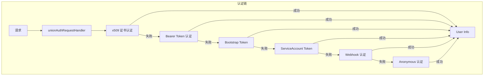
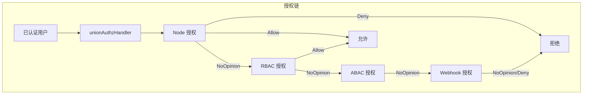
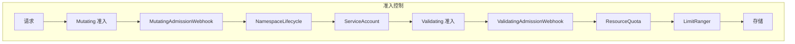
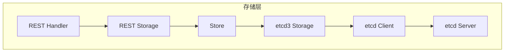

本文详细介绍 API Server 的调试方法，包括请求处理、认证授权、准入控制和存储操作等关键链路的调试技巧。

## 1. 请求入口追踪

### 1.1 HTTP Handler 链

API Server 使用分层的 Handler 链处理请求：

```mermaid
graph TB
    subgraph handler_chain["HTTP Handler 链"]
        REQ["HTTP 请求"]
        H1["WithRequestInfo<br/>解析请求信息"]
        H2["WithPanicRecovery<br/>恐慌恢复"]
        H3["WithAudit<br/>审计日志"]
        H4["WithAuthentication<br/>认证"]
        H5["WithCORS<br/>跨域处理"]
        H6["WithAuthorization<br/>授权"]
        H7["WithImpersonation<br/>模拟用户"]
        H8["WithMaxInFlightLimit<br/>请求限流"]
        H9["WithAdmission<br/>准入控制"]
        H10["RESTStorage Handler<br/>存储操作"]
        RESP["HTTP 响应"]
    end

    REQ --> H1 --> H2 --> H3 --> H4 --> H5 --> H6 --> H7 --> H8 --> H9 --> H10 --> RESP
```



### 1.2 关键断点位置

```bash
# Handler 链入口
(dlv) b staging/src/k8s.io/apiserver/pkg/server/handler.go:ServeHTTP

# 请求信息解析
(dlv) b staging/src/k8s.io/apiserver/pkg/endpoints/filters/requestinfo.go:WithRequestInfo

# Director 路由
(dlv) b staging/src/k8s.io/apiserver/pkg/server/genericapiserver.go:installAPIResources
```

### 1.3 调试示例：追踪 Pod 创建请求

```bash
# 1. 启动调试
dlv exec ./_output/bin/kube-apiserver -- \
    --etcd-servers=http://127.0.0.1:2379 \
    --v=4

# 2. 设置断点
(dlv) b staging/src/k8s.io/apiserver/pkg/endpoints/handlers/create.go:CreateResource

# 3. 继续执行
(dlv) c

# 4. 在另一个终端创建 Pod
kubectl run nginx --image=nginx

# 5. 断点触发后检查
(dlv) args
(dlv) p scope.Name
(dlv) p r.URL.Path
```

### 1.4 路由匹配调试

```bash
# 查看注册的 API 路由
(dlv) b staging/src/k8s.io/apiserver/pkg/endpoints/installer.go:registerResourceHandlers

# 查看路由表
(dlv) p a.Actions

# 检查特定资源的路由
(dlv) cond 1 resource == "pods"
```

## 2. 认证链路调试

### 2.1 认证框架



### 2.2 认证断点

```bash
# 认证主入口
(dlv) b staging/src/k8s.io/apiserver/pkg/endpoints/filters/authentication.go:withAuthentication

# 联合认证器
(dlv) b staging/src/k8s.io/apiserver/pkg/authentication/request/union/union.go:AuthenticateRequest

# X509 证书认证
(dlv) b staging/src/k8s.io/apiserver/pkg/authentication/request/x509/x509.go:AuthenticateRequest

# Bearer Token 认证
(dlv) b staging/src/k8s.io/apiserver/pkg/authentication/request/bearertoken/bearertoken.go:AuthenticateRequest

# ServiceAccount Token 认证
(dlv) b staging/src/k8s.io/apiserver/pkg/authentication/serviceaccount/lookup.go:AuthenticateToken
```

### 2.3 调试示例：Token 验证

```bash
# 1. 设置断点
(dlv) b staging/src/k8s.io/apiserver/pkg/authentication/request/bearertoken/bearertoken.go:AuthenticateRequest

# 2. 继续执行
(dlv) c

# 3. 使用 Token 发起请求
TOKEN=$(kubectl create token default)
curl -k -H "Authorization: Bearer $TOKEN" https://localhost:6443/api/v1/namespaces

# 4. 检查 Token 内容
(dlv) p token[:50]  # 打印前50个字符

# 5. 检查认证结果
(dlv) n  # 单步执行
(dlv) p resp
(dlv) p resp.User
```

### 2.4 检查认证用户信息

```bash
# 获取认证后的用户信息
(dlv) b staging/src/k8s.io/apiserver/pkg/endpoints/filters/authentication.go:56

# 断点触发后
(dlv) p req.Context().Value(request.userKey)
(dlv) p user.GetName()
(dlv) p user.GetGroups()
```

## 3. 授权链路调试

### 3.1 授权框架



### 3.2 授权断点

```bash
# 授权主入口
(dlv) b staging/src/k8s.io/apiserver/pkg/endpoints/filters/authorization.go:withAuthorization

# 联合授权器
(dlv) b staging/src/k8s.io/apiserver/pkg/authorization/union/union.go:Authorize

# RBAC 授权
(dlv) b plugin/pkg/auth/authorizer/rbac/rbac.go:Authorize
(dlv) b staging/src/k8s.io/apiserver/pkg/authorization/authorizerfactory/rbac.go:Authorize

# 规则匹配
(dlv) b staging/src/k8s.io/apiserver/pkg/authorization/authorizer/interfaces.go
```

### 3.3 调试示例：RBAC 授权

```bash
# 1. 设置 RBAC 授权断点
(dlv) b plugin/pkg/auth/authorizer/rbac/rbac.go:Authorize

# 2. 继续执行
(dlv) c

# 3. 发起请求
kubectl get pods -n kube-system

# 4. 检查授权属性
(dlv) p a.GetUser().GetName()
(dlv) p a.GetVerb()
(dlv) p a.GetResource()
(dlv) p a.GetNamespace()

# 5. 检查规则匹配
(dlv) b staging/src/k8s.io/apiserver/pkg/authorization/authorizer/rbac.go:visitRules
(dlv) c
(dlv) p rules
```

### 3.4 授权缓存调试

```bash
# 授权缓存
(dlv) b staging/src/k8s.io/apiserver/pkg/authorization/union/union.go:Authorize

# 检查缓存命中
(dlv) p r.cachedAuthorizer
```

## 4. 准入控制链路调试

### 4.1 准入控制流程



### 4.2 准入断点

```bash
# 准入控制主入口
(dlv) b staging/src/k8s.io/apiserver/pkg/admission/handler.go:Admit
(dlv) b staging/src/k8s.io/apiserver/pkg/admission/handler.go:Validate

# Mutating 准入
(dlv) b plugin/pkg/admission/namespace/lifecycle/admission.go:Admit
(dlv) b plugin/pkg/admission/serviceaccount/admission.go:Admit

# Validating 准入
(dlv) b plugin/pkg/admission/resourcequota/admission.go:Validate
(dlv) b plugin/pkg/admission/limitranger/admission.go:Validate

# Webhook 准入
(dlv) b staging/src/k8s.io/apiserver/pkg/admission/plugin/webhook/generic/webhook.go:Dispatch
```

### 4.3 调试示例：ResourceQuota 验证

```bash
# 1. 创建 ResourceQuota
kubectl create quota test-quota --hard=pods=2 -n default

# 2. 设置断点
(dlv) b plugin/pkg/admission/resourcequota/admission.go:Validate

# 3. 继续执行
(dlv) c

# 4. 创建 Pod 触发验证
kubectl run nginx1 --image=nginx
kubectl run nginx2 --image=nginx
kubectl run nginx3 --image=nginx  # 这个应该被拒绝

# 5. 检查配额检查
(dlv) p a.GetResource()
(dlv) p quota
```

### 4.4 Webhook 调试

```bash
# Webhook 调用
(dlv) b staging/src/k8s.io/apiserver/pkg/admission/plugin/webhook/generic/webhook.go:callHook

# 断点触发后
(dlv) p hook.GetName()
(dlv) p hook.GetURL()

# 查看 Webhook 响应
(dlv) n
(dlv) p result
```

## 5. 存储操作调试

### 5.1 存储层架构



### 5.2 存储断点

```bash
# REST Storage 接口
(dlv) b staging/src/k8s.io/apiserver/pkg/registry/generic/registry/store.go:Create
(dlv) b staging/src/k8s.io/apiserver/pkg/registry/generic/registry/store.go:Update
(dlv) b staging/src/k8s.io/apiserver/pkg/registry/generic/registry/store.go:Delete
(dlv) b staging/src/k8s.io/apiserver/pkg/registry/generic/registry/store.go:Get

# etcd3 存储
(dlv) b staging/src/k8s.io/apiserver/pkg/storage/etcd3/store.go:Create
(dlv) b staging/src/k8s.io/apiserver/pkg/storage/etcd3/store.go:Update
(dlv) b staging/src/k8s.io/apiserver/pkg/storage/etcd3/store.go:Delete
(dlv) b staging/src/k8s.io/apiserver/pkg/storage/etcd3/store.go:Get
```

### 5.3 调试示例：Pod 创建存储

```bash
# 1. 设置断点
(dlv) b staging/src/k8s.io/apiserver/pkg/storage/etcd3/store.go:Create

# 2. 继续执行
(dlv) c

# 3. 创建 Pod
kubectl run nginx --image=nginx

# 4. 检查存储键
(dlv) p key
# 输出类似: "/registry/pods/default/nginx"

# 5. 检查存储值
(dlv) p out
```

### 5.4 Watch 调试

```bash
# Watch 建立
(dlv) b staging/src/k8s.io/apiserver/pkg/storage/etcd3/watcher.go:Watch

# 事件处理
(dlv) b staging/src/k8s.io/apiserver/pkg/storage/etcd3/watcher.go:processEvent

# Watch 缓存
(dlv) b staging/src/k8s.io/apiserver/pkg/storage/cacher/cacher.go:Watch
```

### 5.5 事务调试

```bash
# 乐观锁更新
(dlv) b staging/src/k8s.io/apiserver/pkg/storage/etcd3/store.go:GuaranteedUpdate

# 断点触发后
(dlv) p key
(dlv) p preconditions
(dlv) p origState.Meta.ResourceVersion
```

## 6. 调试工具

### 6.1 日志增强

```bash
# 启动时设置高日志级别
./_output/bin/kube-apiserver \
    --v=6 \
    --vmodule=handlers=8,storage=7 \
    ...

# 动态调整日志级别 (需要启用 profiling)
curl -X PUT localhost:6443/debug/pprof/profile?seconds=30
```

### 6.2 审计日志

```yaml
# 审计策略配置
apiVersion: audit.k8s.io/v1
kind: Policy
rules:
- level: RequestResponse
  verbs: ["create", "update", "patch", "delete"]
  resources:
  - group: ""
    resources: ["pods"]
```

```bash
# 启用审计
./_output/bin/kube-apiserver \
    --audit-policy-file=audit-policy.yaml \
    --audit-log-path=/var/log/kubernetes/audit.log \
    ...
```

### 6.3 请求追踪

```bash
# 使用 kubectl 查看详细请求
kubectl get pods -v=9

# 使用 curl 发送请求并查看响应头
curl -k -v https://localhost:6443/api/v1/pods

# 查看 X-Kubernetes-Pf-* 头部
# 这些头部包含请求处理的性能信息
```

### 6.4 pprof 分析

```bash
# CPU 分析
go tool pprof http://localhost:6443/debug/pprof/profile?seconds=30

# 内存分析
go tool pprof http://localhost:6443/debug/pprof/heap

# Goroutine 分析
go tool pprof http://localhost:6443/debug/pprof/goroutine

# 在 pprof 中查看
(pprof) top 10
(pprof) list functionName
(pprof) web
```

## 7. 常见问题调试

### 7.1 401 Unauthorized

```bash
# 检查认证配置
(dlv) b staging/src/k8s.io/apiserver/pkg/endpoints/filters/authentication.go:withAuthentication

# 检查 Token 验证
(dlv) b staging/src/k8s.io/apiserver/pkg/authentication/request/bearertoken/bearertoken.go:AuthenticateRequest

# 查看认证结果
(dlv) p ok
(dlv) p err
```

### 7.2 403 Forbidden

```bash
# 检查授权决策
(dlv) b plugin/pkg/auth/authorizer/rbac/rbac.go:Authorize

# 查看授权属性
(dlv) p a.GetVerb()
(dlv) p a.GetResource()
(dlv) p a.GetNamespace()

# 查看决策结果
(dlv) p decision
(dlv) p reason
```

### 7.3 409 Conflict

```bash
# 检查版本冲突
(dlv) b staging/src/k8s.io/apiserver/pkg/storage/etcd3/store.go:GuaranteedUpdate

# 检查 ResourceVersion
(dlv) p preconditions.ResourceVersion
(dlv) p origState.Meta.ResourceVersion
```

### 7.4 etcd 连接问题

```bash
# 检查 etcd 连接
(dlv) b staging/src/k8s.io/apiserver/pkg/storage/etcd3/store.go:newStore

# 查看连接配置
(dlv) p cfg

# 检查连接错误
(dlv) b go.etcd.io/etcd/client/v3.(*Client).Dial
```

## 小结

本文详细介绍了 API Server 各关键链路的调试方法：

1. **请求入口**：HTTP Handler 链的调试和请求追踪
2. **认证链路**：各种认证方式的断点设置和验证
3. **授权链路**：RBAC 授权的规则匹配调试
4. **准入控制**：Mutating 和 Validating 准入的调试
5. **存储操作**：etcd 存储层的读写调试
6. **调试工具**：日志、审计、pprof 等辅助工具

掌握这些调试技巧可以帮助深入理解 API Server 的工作原理，快速定位和解决问题。
