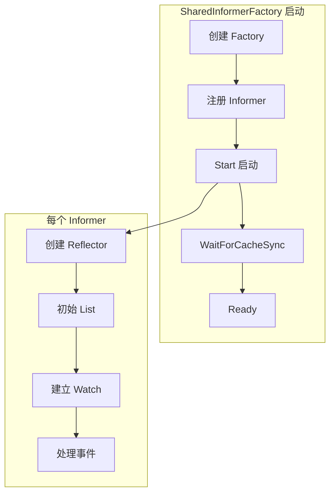
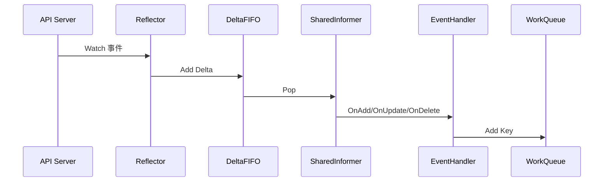
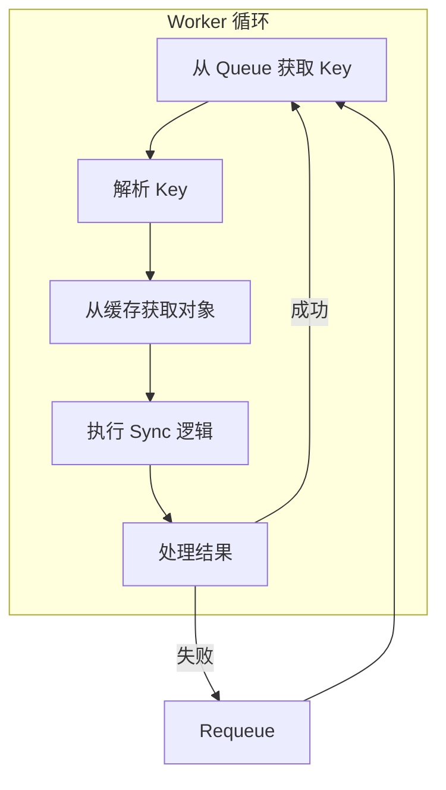

本文详细介绍 Kubernetes 控制器的调试方法，包括 Informer 机制、事件处理、WorkQueue 以及常见问题的排查。

## 1. Informer 启动追踪

### 1.1 SharedInformerFactory 初始化



### 1.2 关键断点位置

```bash
# Factory 创建
(dlv) b staging/src/k8s.io/client-go/informers/factory.go:NewSharedInformerFactory

# Informer 注册
(dlv) b staging/src/k8s.io/client-go/informers/factory.go:InformerFor

# 启动 Informers
(dlv) b staging/src/k8s.io/client-go/informers/factory.go:Start

# 等待缓存同步
(dlv) b staging/src/k8s.io/client-go/tools/cache/shared_informer.go:WaitForCacheSync
```

### 1.3 调试示例：Deployment Controller 启动

```bash
# 1. 启动 Controller Manager 调试
dlv exec ./_output/bin/kube-controller-manager -- \
    --kubeconfig=$HOME/.kube/config \
    --leader-elect=false \
    --controllers=deployment \
    --v=4

# 2. 设置断点
(dlv) b pkg/controller/deployment.NewDeploymentController

# 3. 继续执行
(dlv) c

# 4. 检查 Informer 创建
(dlv) p dInformer
(dlv) p rsInformer
(dlv) p podInformer
```

### 1.4 Reflector 调试

```bash
# Reflector 创建
(dlv) b staging/src/k8s.io/client-go/tools/cache/reflector.go:NewReflector

# ListAndWatch 主循环
(dlv) b staging/src/k8s.io/client-go/tools/cache/reflector.go:ListAndWatch

# 初始 List
(dlv) b staging/src/k8s.io/client-go/tools/cache/reflector.go:list

# Watch 连接
(dlv) b staging/src/k8s.io/client-go/tools/cache/reflector.go:watch
```

## 2. 事件处理追踪

### 2.1 EventHandler 调用流程



### 2.2 EventHandler 断点

```bash
# ResourceEventHandlerFuncs
(dlv) b staging/src/k8s.io/client-go/tools/cache/shared_informer.go:OnAdd
(dlv) b staging/src/k8s.io/client-go/tools/cache/shared_informer.go:OnUpdate
(dlv) b staging/src/k8s.io/client-go/tools/cache/shared_informer.go:OnDelete

# Deployment Controller 事件处理
(dlv) b pkg/controller/deployment/deployment_controller.go:addDeployment
(dlv) b pkg/controller/deployment/deployment_controller.go:updateDeployment
(dlv) b pkg/controller/deployment/deployment_controller.go:deleteDeployment

# ReplicaSet 事件处理
(dlv) b pkg/controller/deployment/deployment_controller.go:addReplicaSet
(dlv) b pkg/controller/deployment/deployment_controller.go:updateReplicaSet
(dlv) b pkg/controller/deployment/deployment_controller.go:deleteReplicaSet
```

### 2.3 调试示例：追踪 Deployment 更新

```bash
# 1. 设置断点
(dlv) b pkg/controller/deployment/deployment_controller.go:updateDeployment

# 2. 继续执行
(dlv) c

# 3. 更新 Deployment
kubectl set image deployment/nginx nginx=nginx:1.21

# 4. 断点触发后检查
(dlv) p old.(*v1.Deployment).Spec.Template.Spec.Containers[0].Image
(dlv) p cur.(*v1.Deployment).Spec.Template.Spec.Containers[0].Image
```

### 2.4 WorkQueue 入队

```bash
# 入队操作
(dlv) b staging/src/k8s.io/client-go/util/workqueue/queue.go:Add

# 检查入队的 key
(dlv) p item
```

## 3. Reconcile 触发调试

### 3.1 Worker 处理流程



### 3.2 Worker 断点

```bash
# Worker 主循环
(dlv) b pkg/controller/deployment/deployment_controller.go:worker

# 处理单个 Key
(dlv) b pkg/controller/deployment/deployment_controller.go:processNextWorkItem

# 同步逻辑
(dlv) b pkg/controller/deployment/deployment_controller.go:syncDeployment
```

### 3.3 调试示例：Deployment 同步

```bash
# 1. 设置 syncDeployment 断点
(dlv) b pkg/controller/deployment/deployment_controller.go:syncDeployment

# 2. 继续执行
(dlv) c

# 3. 创建或更新 Deployment 触发
kubectl create deployment nginx --image=nginx

# 4. 断点触发后
(dlv) p key
(dlv) p deployment.Name
(dlv) p deployment.Spec.Replicas

# 5. 单步执行查看逻辑
(dlv) n
```

### 3.4 追踪 ReplicaSet 操作

```bash
# ReplicaSet 获取
(dlv) b pkg/controller/deployment/deployment_controller.go:getReplicaSetsForDeployment

# 新 ReplicaSet 计算
(dlv) b pkg/controller/deployment/sync.go:getNewReplicaSet

# 扩缩容操作
(dlv) b pkg/controller/deployment/sync.go:scale

# 断点触发后
(dlv) p rsList
(dlv) p newRS
```

## 4. 常见问题调试

### 4.1 Informer 不同步

```bash
# 检查 Informer 是否已同步
(dlv) b staging/src/k8s.io/client-go/tools/cache/shared_informer.go:HasSynced

# 检查同步状态
(dlv) p s.controller.HasSynced()

# 检查 Reflector 状态
(dlv) b staging/src/k8s.io/client-go/tools/cache/reflector.go:ListAndWatch
(dlv) p r.lastSyncResourceVersion
```

常见原因：
- API Server 不可达
- 权限不足（RBAC）
- 网络问题

### 4.2 事件丢失排查

```bash
# 检查 DeltaFIFO
(dlv) b staging/src/k8s.io/client-go/tools/cache/delta_fifo.go:queueActionLocked

# 检查是否被合并
(dlv) p f.items[id]

# 检查 Watch 重连
(dlv) b staging/src/k8s.io/client-go/tools/cache/reflector.go:watchHandler
(dlv) p err
```

### 4.3 死锁检测

```bash
# 查看所有 goroutine
(dlv) goroutines

# 查找阻塞的 goroutine
(dlv) goroutines -group go

# 检查特定 goroutine 的堆栈
(dlv) goroutine 10 stack

# 查找 mutex 等待
(dlv) goroutines | grep "sync.Mutex"
```

### 4.4 内存泄漏

```bash
# 使用 pprof 分析
go tool pprof http://localhost:10252/debug/pprof/heap

# 在 pprof 中
(pprof) top
(pprof) list NewDeploymentController
```

## 5. 性能分析

### 5.1 pprof 使用

```bash
# CPU 分析
go tool pprof http://localhost:10252/debug/pprof/profile?seconds=30

# 内存分析
go tool pprof http://localhost:10252/debug/pprof/heap

# Goroutine 分析
curl http://localhost:10252/debug/pprof/goroutine?debug=2 > goroutines.txt
```

### 5.2 Goroutine 泄漏检测

```bash
# 定期采样 goroutine 数量
while true; do
    curl -s http://localhost:10252/debug/pprof/goroutine?debug=1 | head -1
    sleep 60
done

# 对比两次采样
curl http://localhost:10252/debug/pprof/goroutine?debug=2 > before.txt
# 等待一段时间
curl http://localhost:10252/debug/pprof/goroutine?debug=2 > after.txt
diff before.txt after.txt
```

### 5.3 WorkQueue 监控

```bash
# 设置断点查看队列状态
(dlv) b staging/src/k8s.io/client-go/util/workqueue/queue.go:Len

# 检查队列深度
(dlv) p q.queue.Len()
(dlv) p q.dirty.Len()
(dlv) p q.processing.Len()
```

## 6. 日志增强

### 6.1 结构化日志

```bash
# Controller Manager 启动时设置日志级别
./_output/bin/kube-controller-manager \
    --v=4 \
    --vmodule=deployment_controller=6,replica_set=5 \
    ...

# 使用 JSON 格式
./_output/bin/kube-controller-manager \
    --logging-format=json \
    --v=4 \
    ...
```

### 6.2 Trace 日志

```bash
# 启用 Trace 日志
./_output/bin/kube-controller-manager \
    --v=6 \
    ...

# 日志示例
I0115 10:30:00.000000   12345 deployment_controller.go:150] "Syncing deployment" deployment="default/nginx"
I0115 10:30:00.001000   12345 deployment_controller.go:200] "Found ReplicaSets" count=2 deployment="default/nginx"
```

### 6.3 自定义日志

```go
// 在代码中添加调试日志
import "k8s.io/klog/v2"

func (dc *DeploymentController) syncDeployment(key string) error {
    klog.V(4).InfoS("Starting syncDeployment", "key", key)

    // ... 逻辑

    klog.V(4).InfoS("Finished syncDeployment", "key", key, "duration", time.Since(startTime))
    return nil
}
```

## 7. 特定控制器调试

### 7.1 ReplicaSet Controller

```bash
# 同步入口
(dlv) b pkg/controller/replicaset/replica_set.go:syncReplicaSet

# Pod 创建
(dlv) b pkg/controller/replicaset/replica_set.go:manageReplicas

# 检查副本计算
(dlv) p diff
(dlv) p burstReplicas
```

### 7.2 StatefulSet Controller

```bash
# 同步入口
(dlv) b pkg/controller/statefulset/stateful_set.go:sync

# Pod 管理
(dlv) b pkg/controller/statefulset/stateful_pod_control.go:CreateStatefulPod
(dlv) b pkg/controller/statefulset/stateful_pod_control.go:UpdateStatefulPod
(dlv) b pkg/controller/statefulset/stateful_pod_control.go:DeleteStatefulPod

# 有序操作
(dlv) p monotonic
```

### 7.3 Job Controller

```bash
# 同步入口
(dlv) b pkg/controller/job/job_controller.go:syncJob

# Pod 创建
(dlv) b pkg/controller/job/job_controller.go:manageJob

# 完成检查
(dlv) p succeeded
(dlv) p failed
```

### 7.4 Namespace Controller

```bash
# 删除流程
(dlv) b pkg/controller/namespace/namespace_controller.go:syncNamespaceFromKey

# 资源清理
(dlv) b pkg/controller/namespace/deletion/namespaced_resources_deleter.go:Delete
```

## 8. 调试清单

### 8.1 启动问题检查清单

| 检查项 | 命令/断点 | 预期结果 |
|-------|----------|---------|
| API Server 连接 | `kubectl cluster-info` | 返回集群信息 |
| Informer 创建 | 断点 `NewSharedInformerFactory` | Factory 成功创建 |
| 缓存同步 | 断点 `WaitForCacheSync` | 返回 true |
| Worker 启动 | 断点 `worker` | 进入 worker 循环 |

### 8.2 运行时问题检查清单

| 问题 | 检查方法 |
|-----|---------|
| 事件未处理 | 检查 WorkQueue 是否有积压 |
| 重复处理 | 检查 Reconcile 幂等性 |
| 状态不更新 | 检查 Status 更新调用 |
| 资源未创建 | 检查 OwnerReference 设置 |

## 小结

本文介绍了控制器调试的关键技术：

1. **Informer 启动**：Factory、Reflector、缓存同步的调试
2. **事件处理**：EventHandler、DeltaFIFO、WorkQueue 的调试
3. **Reconcile 触发**：Worker 循环、同步逻辑的调试
4. **常见问题**：Informer 不同步、事件丢失、死锁、内存泄漏
5. **性能分析**：pprof、goroutine 分析
6. **日志增强**：结构化日志、Trace 日志

掌握这些技巧可以有效地调试和排查控制器问题。下一篇文章将介绍 Kubelet 的调试方法。
