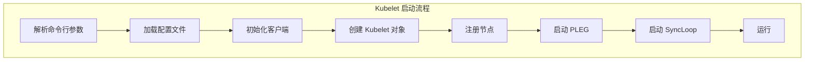
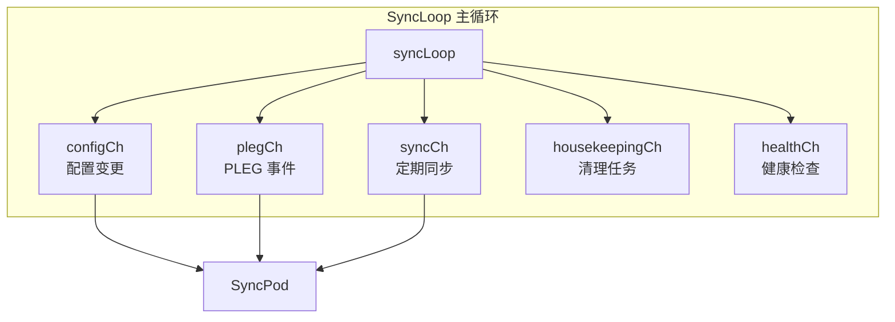
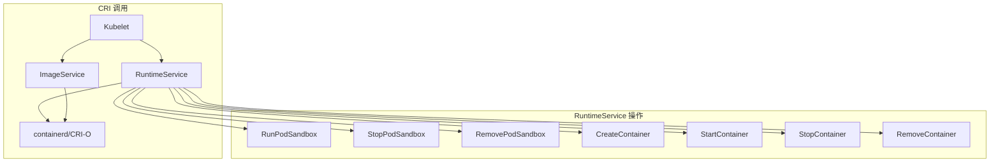
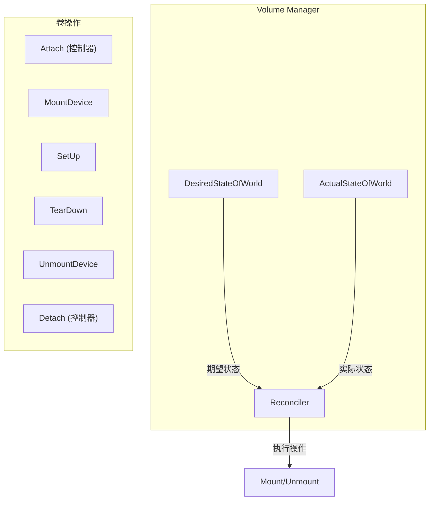
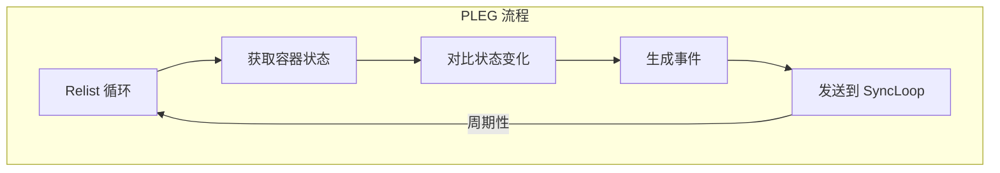

本文详细介绍 Kubelet 的调试方法，包括启动流程、Pod 同步、CRI 调用、Volume 挂载和探针检查等关键链路。

## 1. Kubelet 启动追踪

### 1.1 启动流程概览



### 1.2 关键断点

```bash
# main 入口
(dlv) b cmd/kubelet/kubelet.go:main

# 参数解析
(dlv) b cmd/kubelet/app/server.go:NewKubeletCommand

# Kubelet 创建
(dlv) b cmd/kubelet/app/server.go:createAndInitKubelet

# 运行
(dlv) b cmd/kubelet/app/server.go:Run
(dlv) b pkg/kubelet/kubelet.go:Run
```

### 1.3 调试示例：启动过程

```bash
# 1. 构建带调试符号的 Kubelet
make DBG=1 WHAT=cmd/kubelet

# 2. 启动调试 (需要 root 权限)
sudo dlv exec ./_output/bin/kubelet -- \
    --kubeconfig=/etc/kubernetes/kubelet.conf \
    --config=/var/lib/kubelet/config.yaml \
    --container-runtime-endpoint=unix:///run/containerd/containerd.sock \
    --v=4

# 3. 设置断点
(dlv) b pkg/kubelet/kubelet.go:NewMainKubelet

# 4. 继续执行
(dlv) c

# 5. 检查初始化参数
(dlv) p kubeCfg
(dlv) p nodeName
```

### 1.4 组件初始化

```bash
# Pod Manager 初始化
(dlv) b pkg/kubelet/pod/pod_manager.go:NewBasicPodManager

# Container Manager 初始化
(dlv) b pkg/kubelet/cm/container_manager_linux.go:NewContainerManager

# Volume Manager 初始化
(dlv) b pkg/kubelet/volumemanager/volume_manager.go:NewVolumeManager

# Probe Manager 初始化
(dlv) b pkg/kubelet/prober/prober_manager.go:NewManager
```

## 2. Pod 同步调试

### 2.1 SyncLoop 流程



### 2.2 SyncLoop 断点

```bash
# SyncLoop 入口
(dlv) b pkg/kubelet/kubelet.go:syncLoop

# 事件分发
(dlv) b pkg/kubelet/kubelet.go:syncLoopIteration

# Pod 同步
(dlv) b pkg/kubelet/kubelet.go:SyncPod
(dlv) b pkg/kubelet/kubelet.go:syncPod
```

### 2.3 调试示例：Pod 创建

```bash
# 1. 设置 syncPod 断点
(dlv) b pkg/kubelet/kubelet.go:syncPod

# 2. 继续执行
(dlv) c

# 3. 创建 Pod
kubectl run nginx --image=nginx

# 4. 断点触发后
(dlv) p pod.Name
(dlv) p pod.Namespace
(dlv) p updateType

# 5. 查看 Pod 状态
(dlv) n
(dlv) p apiPodStatus
```

### 2.4 SyncPod 详细流程

```bash
# 计算 Pod 操作
(dlv) b pkg/kubelet/kubelet.go:computePodActions

# Sandbox 创建
(dlv) b pkg/kubelet/kuberuntime/kuberuntime_sandbox.go:createPodSandbox

# 容器创建
(dlv) b pkg/kubelet/kuberuntime/kuberuntime_container.go:startContainer

# 断点触发后
(dlv) p changes
(dlv) p changes.ContainersToStart
```

## 3. CRI 调用追踪

### 3.1 CRI 接口



### 3.2 CRI 断点

```bash
# RuntimeService 接口
(dlv) b pkg/kubelet/cri/remote/remote_runtime.go:RunPodSandbox
(dlv) b pkg/kubelet/cri/remote/remote_runtime.go:CreateContainer
(dlv) b pkg/kubelet/cri/remote/remote_runtime.go:StartContainer
(dlv) b pkg/kubelet/cri/remote/remote_runtime.go:StopContainer

# ImageService 接口
(dlv) b pkg/kubelet/cri/remote/remote_image.go:PullImage
(dlv) b pkg/kubelet/cri/remote/remote_image.go:ListImages
```

### 3.3 调试示例：容器创建

```bash
# 1. 设置断点
(dlv) b pkg/kubelet/cri/remote/remote_runtime.go:CreateContainer

# 2. 继续执行
(dlv) c

# 3. 创建 Pod
kubectl run nginx --image=nginx

# 4. 断点触发后
(dlv) p podSandboxID
(dlv) p config.Metadata.Name
(dlv) p config.Image.Image
```

### 3.4 gRPC 调用日志

```bash
# 启用 CRI 调试日志
sudo kubelet \
    --container-runtime-endpoint=unix:///run/containerd/containerd.sock \
    --v=6 \
    ...

# 日志示例
I0115 10:30:00.000000   12345 remote_runtime.go:100] "RunPodSandbox" podSandboxId="abc123"
I0115 10:30:00.100000   12345 remote_runtime.go:200] "CreateContainer" containerId="def456"
```

## 4. Volume 挂载调试

### 4.1 Volume Manager 流程



### 4.2 Volume Manager 断点

```bash
# Volume Manager 入口
(dlv) b pkg/kubelet/volumemanager/volume_manager.go:Run

# 期望状态计算
(dlv) b pkg/kubelet/volumemanager/populator/desired_state_of_world_populator.go:populatorLoopFunc

# Reconciler 循环
(dlv) b pkg/kubelet/volumemanager/reconciler/reconciler.go:reconcile

# Mount 操作
(dlv) b pkg/kubelet/volumemanager/reconciler/reconciler.go:mountAttachedVolumes
```

### 4.3 调试示例：PVC 挂载

```bash
# 1. 设置断点
(dlv) b pkg/kubelet/volumemanager/reconciler/reconciler.go:mountAttachedVolumes

# 2. 创建带 PVC 的 Pod
kubectl apply -f - <<EOF
apiVersion: v1
kind: Pod
metadata:
  name: test-pod
spec:
  containers:
  - name: test
    image: nginx
    volumeMounts:
    - name: data
      mountPath: /data
  volumes:
  - name: data
    persistentVolumeClaim:
      claimName: test-pvc
EOF

# 3. 断点触发后
(dlv) p volumeToMount
(dlv) p volumeToMount.VolumeName
(dlv) p volumeToMount.PodName
```

### 4.4 CSI 调用追踪

```bash
# CSI NodeStageVolume
(dlv) b pkg/volume/csi/csi_mounter.go:SetUpAt

# CSI NodePublishVolume
(dlv) b pkg/volume/csi/csi_mounter.go:SetUp

# 断点触发后
(dlv) p c.volumeID
(dlv) p c.targetPath
```

## 5. 探针调试

### 5.1 探针类型

| 探针类型 | 触发条件 | 失败后果 |
|---------|---------|---------|
| LivenessProbe | 容器运行后 | 重启容器 |
| ReadinessProbe | 容器运行后 | 从 Service 移除 |
| StartupProbe | 容器启动时 | 阻止其他探针 |

### 5.2 Probe Manager 断点

```bash
# Probe Manager 入口
(dlv) b pkg/kubelet/prober/prober_manager.go:AddPod

# Worker 循环
(dlv) b pkg/kubelet/prober/worker.go:run

# 探针执行
(dlv) b pkg/kubelet/prober/prober.go:probe

# HTTP 探针
(dlv) b pkg/kubelet/prober/prober.go:httpProbe

# TCP 探针
(dlv) b pkg/kubelet/prober/prober.go:tcpProbe

# Exec 探针
(dlv) b pkg/kubelet/prober/prober.go:execProbe
```

### 5.3 调试示例：Liveness 探针

```bash
# 1. 设置断点
(dlv) b pkg/kubelet/prober/prober.go:probe

# 2. 创建带探针的 Pod
kubectl apply -f - <<EOF
apiVersion: v1
kind: Pod
metadata:
  name: liveness-test
spec:
  containers:
  - name: test
    image: nginx
    livenessProbe:
      httpGet:
        path: /
        port: 80
      initialDelaySeconds: 3
      periodSeconds: 3
EOF

# 3. 断点触发后
(dlv) p probeType
(dlv) p container.Name
(dlv) p p.HTTPGet

# 4. 查看探针结果
(dlv) n
(dlv) p result
```

### 5.4 探针失败处理

```bash
# 状态更新
(dlv) b pkg/kubelet/prober/worker.go:handleProbe

# 容器重启决策
(dlv) b pkg/kubelet/kuberuntime/kuberuntime_container.go:computePodActions

# 断点触发后检查
(dlv) p result
(dlv) p w.resultManager.updates
```

## 6. PLEG 调试

### 6.1 PLEG 概述

PLEG (Pod Lifecycle Event Generator) 负责监控 Pod 生命周期变化：



### 6.2 PLEG 断点

```bash
# PLEG 入口
(dlv) b pkg/kubelet/pleg/generic.go:Start

# Relist 循环
(dlv) b pkg/kubelet/pleg/generic.go:Relist

# 事件生成
(dlv) b pkg/kubelet/pleg/generic.go:generateEvents

# Healthy 检查
(dlv) b pkg/kubelet/pleg/generic.go:Healthy
```

### 6.3 调试示例：PLEG 事件

```bash
# 1. 设置断点
(dlv) b pkg/kubelet/pleg/generic.go:generateEvents

# 2. 创建 Pod 触发事件
kubectl run nginx --image=nginx

# 3. 断点触发后
(dlv) p id
(dlv) p cState
(dlv) p oldState

# 4. 查看生成的事件
(dlv) p events
```

## 7. 常见问题调试

### 7.1 Pod 一直 Pending

```bash
# 检查节点状态
kubectl describe node <node-name>

# 调试 Kubelet 日志
journalctl -u kubelet -f | grep -i error

# 设置断点检查
(dlv) b pkg/kubelet/kubelet.go:syncPod
(dlv) p pod.Status.Conditions
```

### 7.2 容器 CrashLoopBackOff

```bash
# 检查容器退出原因
(dlv) b pkg/kubelet/kuberuntime/kuberuntime_container.go:computePodActions
(dlv) p changes.ContainersToStart

# 检查探针结果
(dlv) b pkg/kubelet/prober/worker.go:handleProbe
(dlv) p result
```

### 7.3 Volume 挂载失败

```bash
# 检查 Volume Manager 日志
journalctl -u kubelet -f | grep -i volume

# 设置断点
(dlv) b pkg/kubelet/volumemanager/reconciler/reconciler.go:mountAttachedVolumes
(dlv) p err
```

### 7.4 镜像拉取失败

```bash
# 检查镜像拉取
(dlv) b pkg/kubelet/cri/remote/remote_image.go:PullImage
(dlv) p image
(dlv) p err

# 使用 crictl 调试
crictl pull nginx
crictl images
```

## 8. 性能分析

### 8.1 pprof 端点

```bash
# CPU 分析
curl http://localhost:10250/debug/pprof/profile?seconds=30 > cpu.prof
go tool pprof cpu.prof

# 内存分析
curl http://localhost:10250/debug/pprof/heap > heap.prof
go tool pprof heap.prof

# Goroutine 分析
curl http://localhost:10250/debug/pprof/goroutine?debug=2 > goroutines.txt
```

### 8.2 指标分析

```bash
# 获取 Kubelet 指标
curl http://localhost:10255/metrics

# 关键指标
# kubelet_pod_worker_duration_seconds_bucket
# kubelet_cgroup_manager_duration_seconds_bucket
# kubelet_pleg_relist_duration_seconds_bucket
```

### 8.3 日志级别调整

```bash
# 启动时设置
kubelet --v=4 --vmodule=kubelet=5,volume*=6

# 动态调整 (需要启用)
curl -X PUT "http://localhost:10250/debug/flags/v" -d "6"
```

## 小结

本文介绍了 Kubelet 调试的关键技术：

1. **启动追踪**：参数解析、组件初始化、节点注册
2. **Pod 同步**：SyncLoop、SyncPod、容器操作
3. **CRI 调用**：RuntimeService、ImageService 的调试
4. **Volume 挂载**：Volume Manager、CSI 调用
5. **探针调试**：Liveness、Readiness、Startup 探针
6. **PLEG 调试**：Pod 生命周期事件监控

掌握这些技巧可以有效地排查 Kubelet 相关问题。下一篇文章将介绍 E2E 测试。
