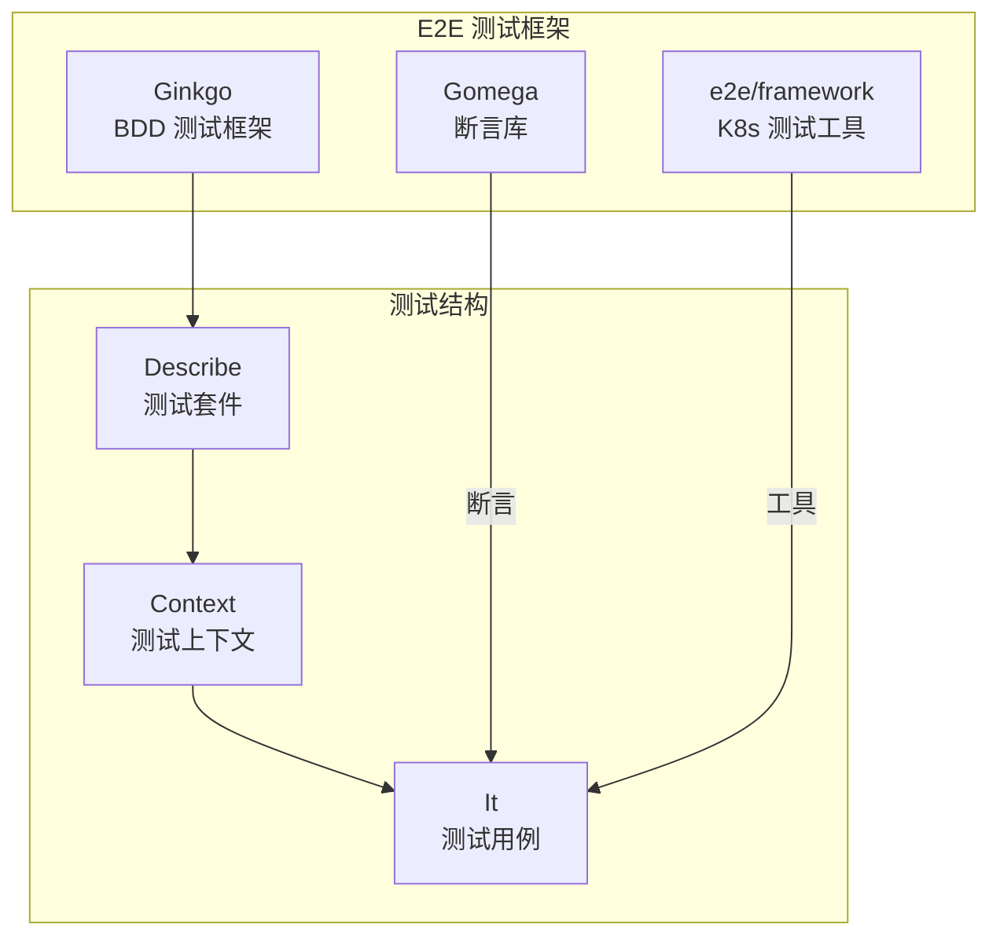

本文详细介绍 Kubernetes E2E（端到端）测试的框架、用例编写和调试方法。

## 1. E2E 测试框架

### 1.1 框架概述

Kubernetes E2E 测试使用 Ginkgo/Gomega 测试框架：



### 1.2 测试目录结构

```
test/e2e/
├── e2e.go                 # 入口文件
├── e2e_test.go            # 测试主文件
├── framework/             # 测试框架
│   ├── framework.go       # Framework 核心
│   ├── pod/               # Pod 相关工具
│   ├── service/           # Service 相关工具
│   └── ...
├── apps/                  # 应用测试
│   ├── deployment.go
│   ├── statefulset.go
│   └── ...
├── network/               # 网络测试
├── storage/               # 存储测试
├── scheduling/            # 调度测试
└── ...
```

### 1.3 构建 E2E 测试

```bash
# 构建 E2E 测试二进制
make WHAT=test/e2e/e2e.test

# 或者使用 go build
go test -c -o e2e.test ./test/e2e

# 构建 ginkgo CLI
go install github.com/onsi/ginkgo/v2/ginkgo@latest
```

## 2. 测试用例编写

### 2.1 基本结构

```go
package apps

import (
    "context"
    "time"

    "github.com/onsi/ginkgo/v2"
    "github.com/onsi/gomega"
    appsv1 "k8s.io/api/apps/v1"
    v1 "k8s.io/api/core/v1"
    metav1 "k8s.io/apimachinery/pkg/apis/meta/v1"
    "k8s.io/kubernetes/test/e2e/framework"
    e2edeployment "k8s.io/kubernetes/test/e2e/framework/deployment"
)

var _ = ginkgo.Describe("[sig-apps] Deployment", func() {
    f := framework.NewDefaultFramework("deployment")

    // 在每个测试前执行
    ginkgo.BeforeEach(func() {
        // 设置测试环境
    })

    // 在每个测试后执行
    ginkgo.AfterEach(func() {
        // 清理资源
    })

    ginkgo.Context("when creating a Deployment", func() {
        ginkgo.It("should create pods matching the replicas", func() {
            // 测试逻辑
            deployment := &appsv1.Deployment{
                ObjectMeta: metav1.ObjectMeta{
                    Name:      "test-deployment",
                    Namespace: f.Namespace.Name,
                },
                Spec: appsv1.DeploymentSpec{
                    Replicas: int32Ptr(3),
                    Selector: &metav1.LabelSelector{
                        MatchLabels: map[string]string{"app": "test"},
                    },
                    Template: v1.PodTemplateSpec{
                        ObjectMeta: metav1.ObjectMeta{
                            Labels: map[string]string{"app": "test"},
                        },
                        Spec: v1.PodSpec{
                            Containers: []v1.Container{
                                {
                                    Name:  "nginx",
                                    Image: "nginx:1.19",
                                },
                            },
                        },
                    },
                },
            }

            // 创建 Deployment
            _, err := f.ClientSet.AppsV1().Deployments(f.Namespace.Name).Create(
                context.TODO(),
                deployment,
                metav1.CreateOptions{},
            )
            gomega.Expect(err).NotTo(gomega.HaveOccurred())

            // 等待 Deployment 就绪
            err = e2edeployment.WaitForDeploymentComplete(f.ClientSet, deployment)
            gomega.Expect(err).NotTo(gomega.HaveOccurred())

            // 验证 Pod 数量
            pods, err := f.ClientSet.CoreV1().Pods(f.Namespace.Name).List(
                context.TODO(),
                metav1.ListOptions{LabelSelector: "app=test"},
            )
            gomega.Expect(err).NotTo(gomega.HaveOccurred())
            gomega.Expect(len(pods.Items)).To(gomega.Equal(3))
        })
    })
})

func int32Ptr(i int32) *int32 { return &i }
```

### 2.2 使用 Framework

```go
// Framework 提供了常用的测试工具
f := framework.NewDefaultFramework("test-name")

// 获取客户端
clientSet := f.ClientSet
dynamicClient := f.DynamicClient

// 获取命名空间（每个测试自动创建）
namespace := f.Namespace.Name

// 创建 Pod
pod := f.PodClient().Create(&v1.Pod{...})

// 等待 Pod 就绪
err := e2epod.WaitForPodRunningInNamespace(f.ClientSet, pod)

// 执行 Pod 命令
stdout, stderr, err := e2epod.ExecCommandInContainerWithFullOutput(
    f.ClientSet,
    f.Namespace.Name,
    podName,
    containerName,
    []string{"sh", "-c", "echo hello"},
)
```

### 2.3 Describe/It 结构

```go
var _ = ginkgo.Describe("Feature", func() {
    // 顶级描述

    ginkgo.Context("when condition A", func() {
        // 子上下文

        ginkgo.It("should do X", func() {
            // 具体测试
        })

        ginkgo.It("should do Y", func() {
            // 另一个测试
        })
    })

    ginkgo.Context("when condition B", func() {
        ginkgo.BeforeEach(func() {
            // 每个测试前的设置
        })

        ginkgo.It("should do Z", func() {
            // 测试
        })
    })
})
```

### 2.4 测试标签

```go
// 使用标签分类测试
var _ = ginkgo.Describe("[sig-apps] Deployment", func() {
    // 运行: --ginkgo.focus="sig-apps"
})

var _ = ginkgo.Describe("[Feature:Foo] My Feature", func() {
    // 运行: --ginkgo.focus="Feature:Foo"
})

// 标记为慢速测试
var _ = ginkgo.Describe("[Slow] Large Scale Test", func() {
    // 默认跳过，除非指定 --ginkgo.focus="Slow"
})

// 标记为串行测试（不能并行）
var _ = ginkgo.Describe("[Serial] Exclusive Resource Test", func() {
    // 必须串行运行
})

// 标记为破坏性测试
var _ = ginkgo.Describe("[Disruptive] Node Restart Test", func() {
    // 会影响集群状态
})
```

## 3. 测试环境管理

### 3.1 集群准备

```bash
# 使用 kind 创建集群
kind create cluster --name e2e-test

# 或使用已有集群
export KUBECONFIG=~/.kube/config

# 检查集群状态
kubectl cluster-info
kubectl get nodes
```

### 3.2 运行 E2E 测试

```bash
# 运行所有测试
./_output/bin/e2e.test \
    --provider=local \
    --kubeconfig=$HOME/.kube/config

# 运行特定测试
./_output/bin/e2e.test \
    --provider=local \
    --kubeconfig=$HOME/.kube/config \
    --ginkgo.focus="Deployment"

# 跳过某些测试
./_output/bin/e2e.test \
    --provider=local \
    --kubeconfig=$HOME/.kube/config \
    --ginkgo.skip="Slow|Serial|Disruptive"

# 并行运行
./_output/bin/e2e.test \
    --provider=local \
    --kubeconfig=$HOME/.kube/config \
    --ginkgo.nodes=4
```

### 3.3 资源清理

```go
// 使用 defer 确保清理
ginkgo.It("test with cleanup", func() {
    pod := createPod()
    defer deletePod(pod)

    // 测试逻辑
})

// 使用 AfterEach 统一清理
ginkgo.AfterEach(func() {
    // 清理所有测试资源
    cleanupTestResources(f)
})

// 使用 DeferCleanup（Ginkgo v2）
ginkgo.It("test with deferred cleanup", func() {
    pod := createPod()
    ginkgo.DeferCleanup(func() {
        deletePod(pod)
    })

    // 测试逻辑
})
```

## 4. 常用测试模式

### 4.1 等待资源就绪

```go
// 等待 Pod 运行
err := e2epod.WaitForPodRunningInNamespace(f.ClientSet, pod)
gomega.Expect(err).NotTo(gomega.HaveOccurred())

// 等待 Pod 条件
err = e2epod.WaitForPodCondition(
    f.ClientSet,
    namespace,
    podName,
    "Ready",
    timeout,
    func(pod *v1.Pod) (bool, error) {
        for _, c := range pod.Status.Conditions {
            if c.Type == v1.PodReady && c.Status == v1.ConditionTrue {
                return true, nil
            }
        }
        return false, nil
    },
)

// 等待 Deployment 完成
err = e2edeployment.WaitForDeploymentComplete(f.ClientSet, deployment)

// 通用等待
gomega.Eventually(func() bool {
    pod, err := f.ClientSet.CoreV1().Pods(namespace).Get(
        context.TODO(),
        podName,
        metav1.GetOptions{},
    )
    if err != nil {
        return false
    }
    return pod.Status.Phase == v1.PodRunning
}, timeout, interval).Should(gomega.BeTrue())
```

### 4.2 事件验证

```go
// 等待并验证事件
ginkgo.It("should emit events", func() {
    // 创建资源触发事件

    // 等待事件
    gomega.Eventually(func() bool {
        events, err := f.ClientSet.CoreV1().Events(namespace).List(
            context.TODO(),
            metav1.ListOptions{
                FieldSelector: fmt.Sprintf("involvedObject.name=%s", podName),
            },
        )
        if err != nil {
            return false
        }
        for _, event := range events.Items {
            if event.Reason == "Started" {
                return true
            }
        }
        return false
    }, timeout, interval).Should(gomega.BeTrue())
})
```

### 4.3 日志验证

```go
// 验证容器日志
ginkgo.It("should output expected logs", func() {
    // 等待 Pod 运行
    err := e2epod.WaitForPodRunningInNamespace(f.ClientSet, pod)
    gomega.Expect(err).NotTo(gomega.HaveOccurred())

    // 获取日志
    logs, err := e2epod.GetPodLogs(f.ClientSet, namespace, podName, containerName)
    gomega.Expect(err).NotTo(gomega.HaveOccurred())

    // 验证日志内容
    gomega.Expect(logs).To(gomega.ContainSubstring("expected message"))
})
```

### 4.4 网络连接测试

```go
// 测试 Service 连通性
ginkgo.It("should be reachable via Service", func() {
    // 创建 Deployment 和 Service

    // 创建测试 Pod
    testPod := f.PodClient().CreateSync(&v1.Pod{
        ObjectMeta: metav1.ObjectMeta{
            Name: "test-client",
        },
        Spec: v1.PodSpec{
            Containers: []v1.Container{
                {
                    Name:    "curl",
                    Image:   "curlimages/curl:latest",
                    Command: []string{"sleep", "3600"},
                },
            },
        },
    })

    // 执行 curl 测试
    cmd := []string{"curl", "-s", fmt.Sprintf("http://%s:%d", serviceName, port)}
    stdout, stderr, err := e2epod.ExecCommandInContainerWithFullOutput(
        f.ClientSet, namespace, testPod.Name, "curl", cmd,
    )
    gomega.Expect(err).NotTo(gomega.HaveOccurred())
    gomega.Expect(stdout).To(gomega.ContainSubstring("Welcome to nginx"))
})
```

## 5. 调试失败用例

### 5.1 查看详细输出

```bash
# 详细输出
./_output/bin/e2e.test \
    --provider=local \
    --kubeconfig=$HOME/.kube/config \
    --ginkgo.v \
    --ginkgo.focus="failing test"

# 非常详细输出
./_output/bin/e2e.test \
    --provider=local \
    --kubeconfig=$HOME/.kube/config \
    --ginkgo.vv \
    -v=6
```

### 5.2 日志收集

```bash
# 测试失败时自动收集日志
./_output/bin/e2e.test \
    --provider=local \
    --kubeconfig=$HOME/.kube/config \
    --dump-logs-on-failure \
    --report-dir=/tmp/e2e-logs
```

### 5.3 保留失败环境

```go
// 测试失败时保留资源用于调试
ginkgo.AfterEach(func() {
    if ginkgo.CurrentSpecReport().Failed() {
        framework.Logf("Test failed, preserving namespace %s for debugging", f.Namespace.Name)
        return
    }
    // 正常清理
})
```

### 5.4 添加调试日志

```go
ginkgo.It("debug test", func() {
    framework.Logf("Step 1: Creating deployment")
    // ...

    framework.Logf("Step 2: Waiting for pods")
    // ...

    // 打印资源状态
    pods, _ := f.ClientSet.CoreV1().Pods(namespace).List(
        context.TODO(),
        metav1.ListOptions{},
    )
    for _, pod := range pods.Items {
        framework.Logf("Pod %s: phase=%s", pod.Name, pod.Status.Phase)
        for _, c := range pod.Status.ContainerStatuses {
            framework.Logf("  Container %s: ready=%v", c.Name, c.Ready)
        }
    }
})
```

### 5.5 重现问题

```bash
# 只运行失败的测试
./_output/bin/e2e.test \
    --provider=local \
    --kubeconfig=$HOME/.kube/config \
    --ginkgo.focus="exact test name"

# 多次运行以复现间歇性问题
./_output/bin/e2e.test \
    --provider=local \
    --kubeconfig=$HOME/.kube/config \
    --ginkgo.focus="flaky test" \
    --ginkgo.repeat=10
```

## 6. 高级测试技巧

### 6.1 自定义 Matcher

```go
// 自定义 Gomega Matcher
func BeRunning() types.GomegaMatcher {
    return &beRunningMatcher{}
}

type beRunningMatcher struct{}

func (m *beRunningMatcher) Match(actual interface{}) (bool, error) {
    pod, ok := actual.(*v1.Pod)
    if !ok {
        return false, fmt.Errorf("expected *v1.Pod, got %T", actual)
    }
    return pod.Status.Phase == v1.PodRunning, nil
}

func (m *beRunningMatcher) FailureMessage(actual interface{}) string {
    pod := actual.(*v1.Pod)
    return fmt.Sprintf("expected pod %s to be Running, but was %s",
        pod.Name, pod.Status.Phase)
}

func (m *beRunningMatcher) NegatedFailureMessage(actual interface{}) string {
    pod := actual.(*v1.Pod)
    return fmt.Sprintf("expected pod %s not to be Running", pod.Name)
}

// 使用
gomega.Expect(pod).To(BeRunning())
```

### 6.2 并行测试隔离

```go
// 使用唯一名称避免冲突
func uniqueName(base string) string {
    return fmt.Sprintf("%s-%s", base, framework.RandomSuffix())
}

// 使用独立命名空间
ginkgo.It("parallel safe test", func() {
    name := uniqueName("test-deployment")
    deployment := createDeployment(f.Namespace.Name, name)
    // ...
})
```

### 6.3 条件跳过

```go
ginkgo.It("requires feature X", func() {
    // 检查集群是否支持该功能
    if !framework.ProviderIs("gce", "aws") {
        ginkgo.Skip("requires cloud provider")
    }

    // 检查功能门控
    if !framework.TestContext.FeatureGates["FeatureX"] {
        ginkgo.Skip("requires FeatureX feature gate")
    }

    // 测试逻辑
})
```

## 7. CI 集成

### 7.1 GitHub Actions 示例

```yaml
name: E2E Tests

on:
  push:
    branches: [master]
  pull_request:
    branches: [master]

jobs:
  e2e:
    runs-on: ubuntu-latest
    steps:
    - uses: actions/checkout@v3

    - name: Set up Go
      uses: actions/setup-go@v4
      with:
        go-version: '1.25'

    - name: Create kind cluster
      uses: helm/kind-action@v1.8.0

    - name: Build e2e tests
      run: make WHAT=test/e2e/e2e.test

    - name: Run e2e tests
      run: |
        ./_output/bin/e2e.test \
          --provider=local \
          --kubeconfig=$HOME/.kube/config \
          --ginkgo.focus="[Conformance]" \
          --ginkgo.skip="[Slow]|[Serial]" \
          --ginkgo.nodes=4

    - name: Upload test results
      if: always()
      uses: actions/upload-artifact@v3
      with:
        name: e2e-results
        path: /tmp/e2e-logs/
```

### 7.2 测试报告生成

```bash
# JUnit 格式报告
./_output/bin/e2e.test \
    --provider=local \
    --kubeconfig=$HOME/.kube/config \
    --ginkgo.junit-report=junit.xml

# JSON 格式报告
./_output/bin/e2e.test \
    --provider=local \
    --kubeconfig=$HOME/.kube/config \
    --ginkgo.json-report=report.json
```

## 小结

本文介绍了 Kubernetes E2E 测试的完整流程：

1. **测试框架**：Ginkgo/Gomega、测试结构、标签系统
2. **用例编写**：Describe/It 结构、Framework 使用、断言方法
3. **环境管理**：集群准备、测试运行、资源清理
4. **测试模式**：等待就绪、事件验证、日志检查、网络测试
5. **调试方法**：详细输出、日志收集、问题重现
6. **高级技巧**：自定义 Matcher、并行隔离、条件跳过
7. **CI 集成**：GitHub Actions、测试报告

掌握 E2E 测试是保证 Kubernetes 代码质量的重要技能。
