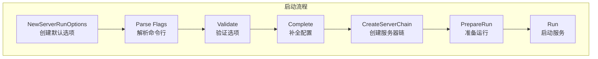
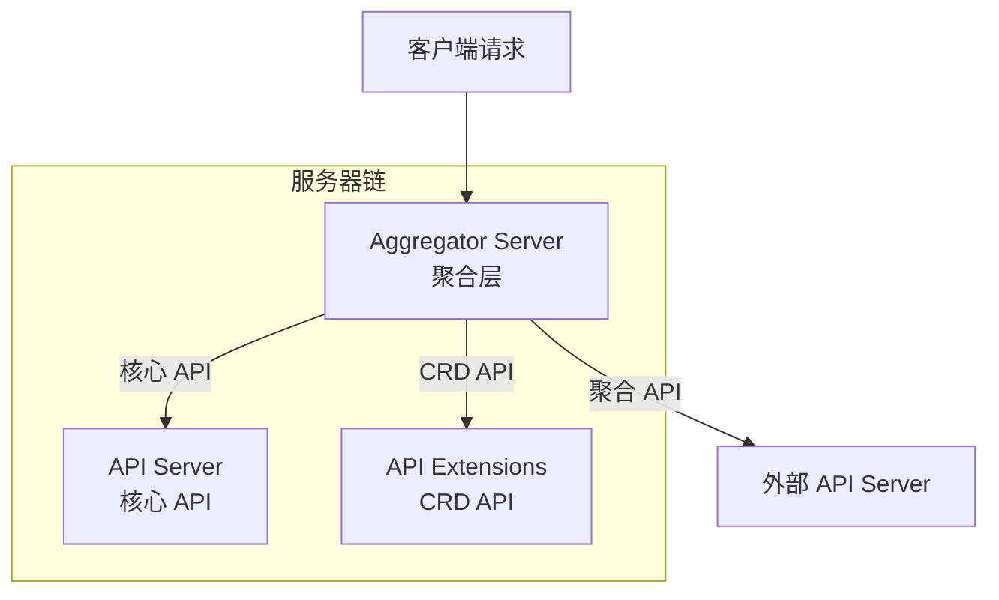
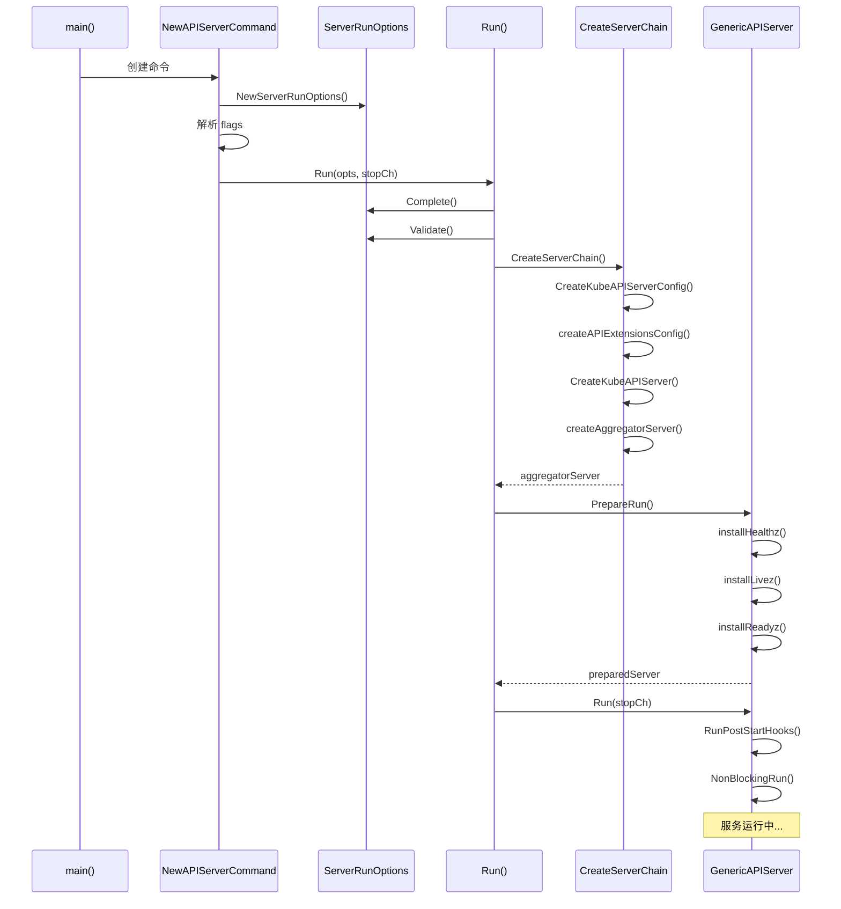

本文深入分析 kube-apiserver 的启动流程，包括命令解析、配置构建、组件初始化和服务启动等关键阶段。

## 1. 入口与命令解析

### 1.1 main 入口

API Server 的入口位于 `cmd/kube-apiserver/apiserver.go`：

```go
// cmd/kube-apiserver/apiserver.go

func main() {
    command := app.NewAPIServerCommand()
    code := cli.Run(command)
    os.Exit(code)
}
```

### 1.2 Cobra 命令框架

API Server 使用 Cobra 框架处理命令行参数：

```go
// cmd/kube-apiserver/app/server.go

// NewAPIServerCommand 创建 API Server 命令
func NewAPIServerCommand() *cobra.Command {
    s := options.NewServerRunOptions()

    cmd := &cobra.Command{
        Use: "kube-apiserver",
        Long: `The Kubernetes API server validates and configures data
for the api objects which include pods, services, replicationcontrollers, and
others. The API Server services REST operations and provides the frontend to the
cluster's shared state through which all other components interact.`,

        // 停止解析未知的 flags
        DisableFlagParsing: true,
        RunE: func(cmd *cobra.Command, args []string) error {
            // 解析命令行参数
            if err := s.Flags().Parse(args); err != nil {
                return err
            }

            // 验证参数
            if errs := s.Validate(); len(errs) != 0 {
                return utilerrors.NewAggregate(errs)
            }

            // 运行 API Server
            return Run(s, genericapiserver.SetupSignalHandler())
        },
        Args: func(cmd *cobra.Command, args []string) error {
            for _, arg := range args {
                if len(arg) > 0 {
                    return fmt.Errorf("%q does not take any arguments, got %q", cmd.CommandPath(), args)
                }
            }
            return nil
        },
    }

    // 添加 flags
    s.AddFlags(cmd.Flags())

    return cmd
}
```

### 1.3 ServerRunOptions

ServerRunOptions 包含所有 API Server 的配置选项：

```go
// cmd/kube-apiserver/app/options/options.go

// ServerRunOptions 运行 API Server 的选项
type ServerRunOptions struct {
    // 通用服务器选项
    GenericServerRunOptions *genericoptions.ServerRunOptions

    // etcd 选项
    Etcd *genericoptions.EtcdOptions

    // 安全服务选项
    SecureServing *genericoptions.SecureServingOptionsWithLoopback

    // 认证选项
    Authentication *kubeoptions.BuiltInAuthenticationOptions

    // 授权选项
    Authorization *kubeoptions.BuiltInAuthorizationOptions

    // 准入控制选项
    Admission *kubeoptions.AdmissionOptions

    // API 启用选项
    APIEnablement *genericoptions.APIEnablementOptions

    // 审计选项
    Audit *genericoptions.AuditOptions

    // 特性门控
    FeatureGates genericoptions.FeatureGateOptions

    // 更多选项...
    AllowPrivileged           bool
    MaxConnectionBytesPerSec  int64
    ServiceClusterIPRanges    string
    ServiceNodePortRange      string
    // ...
}
```

## 2. 配置构建

### 2.1 启动流程概览



### 2.2 Run 函数

```go
// cmd/kube-apiserver/app/server.go

// Run 运行指定的 API Server
func Run(opts *options.ServerRunOptions, stopCh <-chan struct{}) error {
    // 1. 完成配置
    completedOptions, err := opts.Complete()
    if err != nil {
        return err
    }

    // 2. 验证完成后的配置
    if errs := completedOptions.Validate(); len(errs) != 0 {
        return utilerrors.NewAggregate(errs)
    }

    // 3. 创建服务器链
    server, err := CreateServerChain(completedOptions, stopCh)
    if err != nil {
        return err
    }

    // 4. 准备运行
    prepared, err := server.PrepareRun()
    if err != nil {
        return err
    }

    // 5. 运行
    return prepared.Run(stopCh)
}
```

### 2.3 配置完成

```go
// cmd/kube-apiserver/app/options/options.go

// Complete 将 ServerRunOptions 转换为完成后的选项
func (s *ServerRunOptions) Complete() (CompletedServerRunOptions, error) {
    var options CompletedServerRunOptions

    // 完成通用选项
    if err := s.GenericServerRunOptions.Complete(); err != nil {
        return options, err
    }

    // 完成 etcd 选项
    if err := s.Etcd.Complete(s.StorageConfig); err != nil {
        return options, err
    }

    // 完成认证选项
    if err := s.Authentication.Complete(); err != nil {
        return options, err
    }

    // 完成授权选项
    if err := s.Authorization.Complete(); err != nil {
        return options, err
    }

    // 设置默认值
    if s.ServiceClusterIPRanges == "" {
        s.ServiceClusterIPRanges = "10.0.0.0/24"
    }

    // ... 更多完成逻辑

    options.ServerRunOptions = s
    return options, nil
}
```

## 3. Server 初始化

### 3.1 CreateServerChain

API Server 由多个服务器组成链式结构：



```go
// cmd/kube-apiserver/app/server.go

// CreateServerChain 创建连接的 API Server
func CreateServerChain(
    opts CompletedServerRunOptions,
    stopCh <-chan struct{},
) (*aggregatorapiserver.APIAggregator, error) {
    // 1. 创建 Kubecontrollermanager.Config
    kubeAPIServerConfig, serviceResolver, pluginInitializer, err :=
        CreateKubeAPIServerConfig(opts)
    if err != nil {
        return nil, err
    }

    // 2. 创建 API Extensions Server Config (CRD)
    apiExtensionsConfig, err := createAPIExtensionsConfig(
        *kubeAPIServerConfig.GenericConfig,
        kubeAPIServerConfig.ExtraConfig.VersionedInformers,
        pluginInitializer,
        opts.CompletedServerRunOptions,
        opts.MasterCount,
        serviceResolver,
        webhook.NewDefaultAuthenticationInfoResolverWrapper(
            kubeAPIServerConfig.ExtraConfig.ProxyTransport,
            kubeAPIServerConfig.GenericConfig.EgressSelector,
            kubeAPIServerConfig.GenericConfig.LoopbackClientConfig,
        ),
    )
    if err != nil {
        return nil, err
    }

    // 3. 创建 API Server（Core APIs）
    apiServer, err := CreateKubeAPIServer(
        kubeAPIServerConfig,
        apiExtensionsServer.GenericAPIServer,
    )
    if err != nil {
        return nil, err
    }

    // 4. 创建聚合服务器
    aggregatorConfig, err := createAggregatorConfig(
        *kubeAPIServerConfig.GenericConfig,
        opts.CompletedServerRunOptions,
        kubeAPIServerConfig.ExtraConfig.VersionedInformers,
        serviceResolver,
        kubeAPIServerConfig.ExtraConfig.ProxyTransport,
        pluginInitializer,
    )
    if err != nil {
        return nil, err
    }

    aggregatorServer, err := createAggregatorServer(
        aggregatorConfig,
        apiServer.GenericAPIServer,
        apiExtensionsServer.Informers,
    )
    if err != nil {
        return nil, err
    }

    return aggregatorServer, nil
}
```

### 3.2 GenericAPIServer 创建

```go
// staging/src/k8s.io/apiserver/pkg/server/genericapiserver.go

// GenericAPIServer 包含 API Server 的通用功能
type GenericAPIServer struct {
    // Handler 是 HTTP 处理器链
    Handler *APIServerHandler

    // SecureServingInfo 安全服务配置
    SecureServingInfo *SecureServingInfo

    // Serializer 序列化器
    Serializer runtime.NegotiatedSerializer

    // OpenAPIVersionedService OpenAPI 服务
    OpenAPIVersionedService *handler.OpenAPIService

    // 存储后端工厂
    StorageFactory storage.StorageFactory

    // RESTOptionsGetter 获取 REST 选项
    RESTOptionsGetter genericregistry.RESTOptionsGetter

    // 准入控制
    AdmissionControl admission.Interface

    // 认证器
    Authenticator authenticator.Request

    // 授权器
    Authorizer authorizer.Authorizer

    // 更多字段...
}
```

### 3.3 API 注册

```go
// pkg/controlplane/instance.go

// Instance 是控制平面的 API Server
type Instance struct {
    GenericAPIServer *genericapiserver.GenericAPIServer
}

// New 创建新的 Instance
func (c completedConfig) New(delegationTarget genericapiserver.DelegationTarget) (*Instance, error) {
    // 创建 GenericAPIServer
    s, err := c.GenericConfig.New("kube-apiserver", delegationTarget)
    if err != nil {
        return nil, err
    }

    // 创建 Instance
    m := &Instance{
        GenericAPIServer: s,
    }

    // 安装遗留 API (core/v1)
    if err := m.InstallLegacyAPI(&c, c.GenericConfig.RESTOptionsGetter); err != nil {
        return nil, err
    }

    // 安装 API 组
    if err := m.InstallAPIs(c.ExtraConfig.APIResourceConfigSource,
        c.GenericConfig.RESTOptionsGetter,
        restStorageProviders...); err != nil {
        return nil, err
    }

    return m, nil
}
```

## 4. 存储后端初始化

### 4.1 etcd 客户端创建

```go
// staging/src/k8s.io/apiserver/pkg/storage/storagebackend/factory/etcd3.go

// Create 创建 etcd3 存储
func Create(c storagebackend.ConfigForResource, newFunc func() runtime.Object) (storage.Interface, DestroyFunc, error) {
    // 创建 etcd 客户端
    client, err := newETCD3Client(c.Transport)
    if err != nil {
        return nil, nil, err
    }

    // 创建存储
    store := etcd3.New(
        client,
        c.Codec,
        newFunc,
        c.Prefix,
        c.GroupResource,
        transformer,
        c.Paging,
        c.LeaseManagerConfig,
    )

    return store, func() { client.Close() }, nil
}
```

### 4.2 存储工厂

```go
// staging/src/k8s.io/apiserver/pkg/server/options/etcd.go

// NewStorageFactoryConfig 创建存储工厂配置
func (s *EtcdOptions) NewStorageFactoryConfig() *StorageFactoryConfig {
    return &StorageFactoryConfig{
        StorageConfig:    s.StorageConfig,
        DefaultMediaType: s.DefaultStorageMediaType,
        ResourceEncodingConfig: NewDefaultResourceEncodingConfig(
            legacyscheme.Scheme,
        ),
    }
}

// CreateRESTOptionsGetter 创建 REST 选项获取器
func (c *StorageFactoryConfig) CreateRESTOptionsGetter(
    storageFactory storage.StorageFactory,
) generic.RESTOptionsGetter {
    return &StorageFactoryRestOptionsFactory{
        Options:        *c,
        StorageFactory: storageFactory,
    }
}
```

## 5. 认证/授权初始化

### 5.1 认证器链构建

```go
// cmd/kube-apiserver/app/options/authentication.go

// ApplyTo 将认证选项应用到 AuthenticationInfo
func (o *BuiltInAuthenticationOptions) ApplyTo(
    authInfo *genericapiserver.AuthenticationInfo,
    secureServing *genericapiserver.SecureServingInfo,
    openAPIConfig *openapicommon.Config,
) error {
    authenticatorConfig := authenticator.Config{
        Anonymous:      o.Anonymous,
        BootstrapToken: o.BootstrapToken.Enabled,
    }

    // 配置 X509 认证
    if o.ClientCert != nil {
        authenticatorConfig.ClientCAContentProvider = o.ClientCert.CAContentProvider
    }

    // 配置 OIDC 认证
    if o.OIDC != nil {
        authenticatorConfig.OIDCIssuerURL = o.OIDC.IssuerURL
        authenticatorConfig.OIDCClientID = o.OIDC.ClientID
        // ...
    }

    // 配置 Webhook 认证
    if o.WebHook != nil {
        authenticatorConfig.WebhookTokenAuthnConfigFile = o.WebHook.ConfigFile
        // ...
    }

    // 创建认证器
    authInfo.Authenticator, authInfo.SecurityDefinitions, err =
        authenticatorConfig.New()

    return err
}
```

### 5.2 授权器链构建

```go
// cmd/kube-apiserver/app/options/authorization.go

// ApplyTo 将授权选项应用到 GenericConfig
func (o *BuiltInAuthorizationOptions) ApplyTo(
    c *genericapiserver.Config,
    versionedInformerFactory versionedinformers.SharedInformerFactory,
) error {
    var authorizers []authorizer.Authorizer
    var ruleResolvers []authorizer.RuleResolver

    for _, authorizationMode := range o.Modes {
        switch authorizationMode {
        case authzmodes.ModeNode:
            // 添加 Node 授权器
            graph := node.NewGraph()
            nodeAuthorizer := node.NewAuthorizer(graph, o.NodeAuthorizer)
            authorizers = append(authorizers, nodeAuthorizer)
            ruleResolvers = append(ruleResolvers, nodeAuthorizer)

        case authzmodes.ModeRBAC:
            // 添加 RBAC 授权器
            rbacAuthorizer := rbac.New(
                &rbac.RoleGetter{Lister: versionedInformerFactory.Rbac().V1().Roles().Lister()},
                &rbac.RoleBindingLister{Lister: versionedInformerFactory.Rbac().V1().RoleBindings().Lister()},
                &rbac.ClusterRoleGetter{Lister: versionedInformerFactory.Rbac().V1().ClusterRoles().Lister()},
                &rbac.ClusterRoleBindingLister{Lister: versionedInformerFactory.Rbac().V1().ClusterRoleBindings().Lister()},
            )
            authorizers = append(authorizers, rbacAuthorizer)
            ruleResolvers = append(ruleResolvers, rbacAuthorizer)

        case authzmodes.ModeWebhook:
            // 添加 Webhook 授权器
            webhookAuthorizer, err := authzwebhook.NewFromInterface(
                o.WebhookConfigFile,
                o.WebhookVersion,
                o.WebhookCacheTTL,
                o.WebhookRetryBackoff,
            )
            if err != nil {
                return err
            }
            authorizers = append(authorizers, webhookAuthorizer)
            ruleResolvers = append(ruleResolvers, webhookAuthorizer)

        // 更多授权模式...
        }
    }

    c.Authorization.Authorizer = union.New(authorizers...)
    c.RuleResolver = union.NewRuleResolvers(ruleResolvers...)

    return nil
}
```

## 6. 服务启动

### 6.1 PrepareRun

```go
// staging/src/k8s.io/apiserver/pkg/server/genericapiserver.go

// PrepareRun 执行启动前的准备工作
func (s *GenericAPIServer) PrepareRun() preparedGenericAPIServer {
    // 安装健康检查端点
    s.installHealthz()

    // 安装存活探针端点
    s.installLivez()

    // 安装就绪探针端点
    s.installReadyz()

    // 设置 OpenAPI 路由
    if s.openAPIConfig != nil {
        if s.OpenAPIVersionedService != nil {
            s.OpenAPIVersionedService.RegisterOpenAPIVersionedService(
                "/openapi/v2",
                s.Handler.GoRestfulContainer,
            )
        }
    }

    return preparedGenericAPIServer{s}
}
```

### 6.2 Run

```go
// staging/src/k8s.io/apiserver/pkg/server/genericapiserver.go

// Run 启动安全的 HTTP 服务器
func (s preparedGenericAPIServer) Run(stopCh <-chan struct{}) error {
    // 启动审计后端
    if s.AuditBackend != nil {
        if err := s.AuditBackend.Run(stopCh); err != nil {
            return err
        }
    }

    // 启动 PostStartHook
    s.RunPostStartHooks(stopCh)

    // 准备关闭 channel
    delayedStopCh := s.lifecycleSignals.AfterShutdownDelayDuration
    shutdownInitiatedCh := s.lifecycleSignals.ShutdownInitiated

    // 启动安全服务
    stoppedCh, listenerStoppedCh, err := s.NonBlockingRun(stopCh, shutdownInitiatedCh)
    if err != nil {
        return err
    }

    // 等待关闭
    <-stopCh

    // 执行优雅关闭
    err = s.RunPreShutdownHooks()
    if err != nil {
        return err
    }

    <-delayedStopCh
    <-listenerStoppedCh
    <-stoppedCh

    return nil
}
```

### 6.3 HTTPS 服务

```go
// staging/src/k8s.io/apiserver/pkg/server/secure_serving.go

// Serve 在给定的监听器上提供 HTTPS 服务
func (s *SecureServingInfo) Serve(
    handler http.Handler,
    shutdownTimeout time.Duration,
    stopCh <-chan struct{},
) (<-chan struct{}, <-chan struct{}, error) {
    // 创建 HTTPS 服务器
    secureServer := &http.Server{
        Addr:           s.Listener.Addr().String(),
        Handler:        handler,
        MaxHeaderBytes: 1 << 20,
        TLSConfig: &tls.Config{
            NameToCertificate: s.SNICerts,
            GetCertificate:    s.GetCertificate,
            // ...
        },
    }

    // 启动服务
    go func() {
        if err := secureServer.ServeTLS(s.Listener, "", ""); err != nil {
            if err != http.ErrServerClosed {
                klog.ErrorS(err, "Server TLS error")
            }
        }
    }()

    // 优雅关闭处理
    go func() {
        <-stopCh
        ctx, cancel := context.WithTimeout(context.Background(), shutdownTimeout)
        defer cancel()
        secureServer.Shutdown(ctx)
    }()

    return stoppedCh, listenerStoppedCh, nil
}
```

## 7. 启动时序图



## 小结

本文详细分析了 API Server 的启动流程：

1. **入口与命令解析**：使用 Cobra 框架，ServerRunOptions 包含所有配置
2. **配置构建**：Complete 补全配置、Validate 验证配置
3. **Server 初始化**：创建服务器链（Aggregator → API → Extensions）
4. **存储后端**：创建 etcd 客户端、存储工厂
5. **认证/授权**：构建认证器链、授权器链
6. **服务启动**：PrepareRun 准备、Run 启动 HTTPS 服务

理解启动流程是深入研究 API Server 其他机制的基础，下一篇将介绍请求的完整生命周期。
