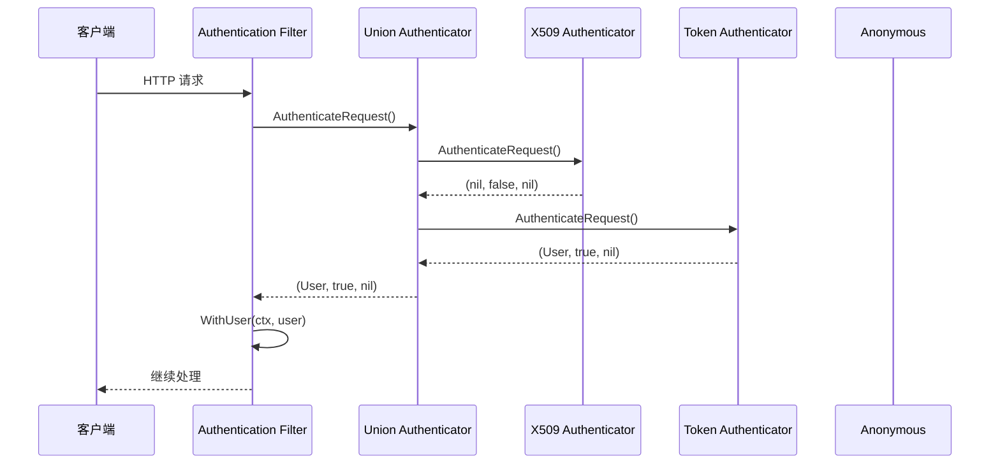
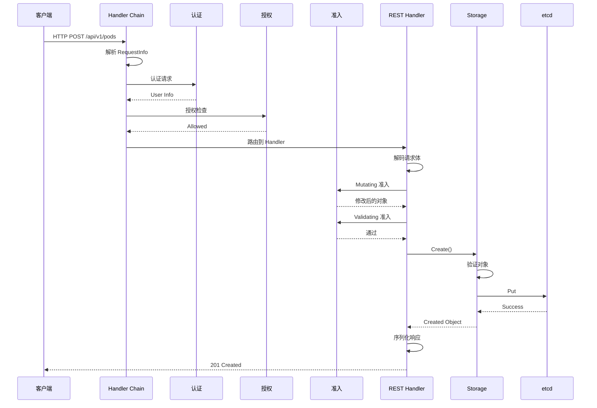

本文深入分析 API Server 处理请求的完整生命周期，从接收 HTTP 请求到返回响应的每个阶段。

## 1. HTTP 处理链

### 1.1 处理链概览

API Server 使用分层的 Handler 链处理请求：

```mermaid
graph TB
    subgraph chain["Handler 处理链"]
        REQ["HTTP 请求"]
        H1["Panic Recovery<br/>恐慌恢复"]
        H2["Request Info<br/>请求信息解析"]
        H3["Audit<br/>审计日志"]
        H4["Authentication<br/>认证"]
        H5["CORS<br/>跨域处理"]
        H6["Timeout<br/>超时控制"]
        H7["Authorization<br/>授权"]
        H8["Impersonation<br/>用户模拟"]
        H9["Flow Control<br/>流量控制"]
        H10["Admission<br/>准入控制"]
        H11["REST Handler<br/>业务处理"]
        RESP["HTTP 响应"]
    end

    REQ --> H1 --> H2 --> H3 --> H4 --> H5 --> H6 --> H7 --> H8 --> H9 --> H10 --> H11 --> RESP
```



### 1.2 Handler 链构建

```go
// staging/src/k8s.io/apiserver/pkg/server/config.go

// BuildHandlerChainFunc 是构建 handler 链的函数类型
type BuildHandlerChainFunc func(apiHandler http.Handler, c *Config) http.Handler

// DefaultBuildHandlerChain 构建默认的 handler 链
func DefaultBuildHandlerChain(apiHandler http.Handler, c *Config) http.Handler {
    handler := apiHandler

    // 从内到外构建 handler 链

    // 流量控制
    handler = genericfilters.WithPriorityAndFairness(handler, c.LongRunningFunc, c.MaxRequestsInFlight)

    // 最大请求数限制
    handler = genericfilters.WithMaxInFlightLimit(handler, c.MaxRequestsInFlight, c.MaxMutatingRequestsInFlight, c.LongRunningFunc)

    // 用户模拟
    handler = genericapifilters.WithImpersonation(handler, c.Authorization.Authorizer, c.Serializer)

    // 审计（后处理）
    handler = genericapifilters.WithAudit(handler, c.AuditBackend, c.AuditPolicyRuleEvaluator, c.LongRunningFunc)

    // 授权
    handler = genericapifilters.WithAuthorization(handler, c.Authorization.Authorizer, c.Serializer)

    // CORS
    handler = genericfilters.WithCORS(handler, c.CorsAllowedOriginList, nil, nil, nil, "true")

    // 超时
    handler = genericfilters.WithTimeoutForNonLongRunningRequests(handler, c.LongRunningFunc)

    // 审计（前处理）
    handler = genericapifilters.WithAuditInit(handler)

    // 认证
    handler = genericapifilters.WithAuthentication(handler, c.Authentication.Authenticator, c.Authentication.FailedAuthenticationAudit, c.Authentication.APIAudiences)

    // 请求信息
    handler = genericapifilters.WithRequestInfo(handler, c.RequestInfoResolver)

    // 缓存控制
    handler = genericfilters.WithCacheControl(handler)

    // 恐慌恢复
    handler = genericfilters.WithPanicRecovery(handler, c.RequestInfoResolver)

    // HTTP 请求日志
    handler = genericapifilters.WithRequestReceivedTimestamp(handler)
    handler = genericapifilters.WithMuxAndDiscoveryComplete(handler, c.MuxAndDiscoveryCompleteSignals)
    handler = genericfilters.WithWaitGroup(handler, c.LongRunningFunc, c.NonLongRunningRequestWaitGroup)

    return handler
}
```

### 1.3 Director 路由

```go
// staging/src/k8s.io/apiserver/pkg/server/handler.go

// APIServerHandler 包含 API Server 的主要 handler 逻辑
type APIServerHandler struct {
    // FullHandlerChain 是完整的 handler 链
    FullHandlerChain http.Handler

    // GoRestfulContainer 处理通过 go-restful 注册的路由
    GoRestfulContainer *restful.Container

    // NonGoRestfulMux 处理非 go-restful 路由
    NonGoRestfulMux *mux.PathRecorderMux

    // Director 是路由选择器
    Director http.Handler
}

// ServeHTTP 实现 http.Handler 接口
func (a *APIServerHandler) ServeHTTP(w http.ResponseWriter, r *http.Request) {
    a.FullHandlerChain.ServeHTTP(w, r)
}
```

## 2. 请求上下文

### 2.1 context.Context 传递

```go
// staging/src/k8s.io/apiserver/pkg/endpoints/request/context.go

// 上下文键定义
type key int

const (
    namespaceKey key = iota
    userKey
    auditKey
    requestInfoKey
)

// WithNamespace 返回带命名空间的 context
func WithNamespace(parent context.Context, namespace string) context.Context {
    return WithValue(parent, namespaceKey, namespace)
}

// NamespaceFrom 从 context 获取命名空间
func NamespaceFrom(ctx context.Context) (string, bool) {
    namespace, ok := ctx.Value(namespaceKey).(string)
    return namespace, ok
}

// WithUser 返回带用户信息的 context
func WithUser(parent context.Context, user user.Info) context.Context {
    return WithValue(parent, userKey, user)
}

// UserFrom 从 context 获取用户信息
func UserFrom(ctx context.Context) (user.Info, bool) {
    user, ok := ctx.Value(userKey).(user.Info)
    return user, ok
}
```

### 2.2 RequestInfo 解析

```go
// staging/src/k8s.io/apiserver/pkg/endpoints/request/requestinfo.go

// RequestInfo 包含请求的关键信息
type RequestInfo struct {
    // IsResourceRequest 表示是否是资源请求
    IsResourceRequest bool

    // Path 是请求路径
    Path string

    // Verb 是请求动作（get, list, create, update, patch, delete, watch 等）
    Verb string

    // APIPrefix 是 API 前缀（api 或 apis）
    APIPrefix string

    // APIGroup 是 API 组
    APIGroup string

    // APIVersion 是 API 版本
    APIVersion string

    // Namespace 是命名空间
    Namespace string

    // Resource 是资源名称
    Resource string

    // Subresource 是子资源名称
    Subresource string

    // Name 是资源实例名称
    Name string

    // Parts 是 URL 路径的各部分
    Parts []string
}

// NewRequestInfo 从 HTTP 请求解析 RequestInfo
func (r *RequestInfoFactory) NewRequestInfo(req *http.Request) (*RequestInfo, error) {
    requestInfo := &RequestInfo{
        IsResourceRequest: false,
        Path:              req.URL.Path,
        Verb:              strings.ToLower(req.Method),
    }

    currentParts := splitPath(req.URL.Path)
    if len(currentParts) < 3 {
        return requestInfo, nil
    }

    // 解析 API 前缀
    if !r.APIPrefixes.Has(currentParts[0]) {
        return requestInfo, nil
    }
    requestInfo.APIPrefix = currentParts[0]
    currentParts = currentParts[1:]

    // 解析 API 组和版本
    if requestInfo.APIPrefix == "api" {
        // 核心组: /api/v1/...
        requestInfo.APIVersion = currentParts[0]
        currentParts = currentParts[1:]
    } else {
        // 命名组: /apis/group/version/...
        requestInfo.APIGroup = currentParts[0]
        requestInfo.APIVersion = currentParts[1]
        currentParts = currentParts[2:]
    }

    requestInfo.IsResourceRequest = true

    // 解析命名空间和资源
    switch {
    case len(currentParts) >= 3 && currentParts[0] == "namespaces":
        requestInfo.Namespace = currentParts[1]
        requestInfo.Resource = currentParts[2]
        currentParts = currentParts[3:]
    default:
        requestInfo.Resource = currentParts[0]
        currentParts = currentParts[1:]
    }

    // 解析资源名称和子资源
    if len(currentParts) >= 1 {
        requestInfo.Name = currentParts[0]
        currentParts = currentParts[1:]
    }
    if len(currentParts) >= 1 {
        requestInfo.Subresource = currentParts[0]
    }

    // 映射 HTTP 方法到 Verb
    requestInfo.Verb = r.requestVerb(req, requestInfo)

    return requestInfo, nil
}
```

## 3. 请求阶段

### 3.1 认证阶段



```go
// staging/src/k8s.io/apiserver/pkg/endpoints/filters/authentication.go

// WithAuthentication 创建认证 filter
func WithAuthentication(
    handler http.Handler,
    auth authenticator.Request,
    failed http.Handler,
    apiAuds authenticator.Audiences,
) http.Handler {
    return http.HandlerFunc(func(w http.ResponseWriter, req *http.Request) {
        // 执行认证
        resp, ok, err := auth.AuthenticateRequest(req)
        if err != nil || !ok {
            // 认证失败
            if err != nil {
                klog.ErrorS(err, "Unable to authenticate the request")
            }
            failed.ServeHTTP(w, req)
            return
        }

        // 认证成功，将用户信息添加到 context
        req = req.WithContext(request.WithUser(req.Context(), resp.User))

        // 继续处理
        handler.ServeHTTP(w, req)
    })
}
```

### 3.2 授权阶段

```go
// staging/src/k8s.io/apiserver/pkg/endpoints/filters/authorization.go

// WithAuthorization 创建授权 filter
func WithAuthorization(
    handler http.Handler,
    a authorizer.Authorizer,
    s runtime.NegotiatedSerializer,
) http.Handler {
    return http.HandlerFunc(func(w http.ResponseWriter, req *http.Request) {
        ctx := req.Context()
        requestInfo, found := request.RequestInfoFrom(ctx)
        if !found {
            responsewriters.InternalError(w, req, errors.New("no RequestInfo found"))
            return
        }

        // 构建授权属性
        attributes := authorizer.AttributesRecord{
            User:            request.UserFrom(ctx),
            Verb:            requestInfo.Verb,
            Namespace:       requestInfo.Namespace,
            APIGroup:        requestInfo.APIGroup,
            APIVersion:      requestInfo.APIVersion,
            Resource:        requestInfo.Resource,
            Subresource:     requestInfo.Subresource,
            Name:            requestInfo.Name,
            ResourceRequest: requestInfo.IsResourceRequest,
            Path:            requestInfo.Path,
        }

        // 执行授权
        authorized, reason, err := a.Authorize(ctx, attributes)
        if authorized == authorizer.DecisionAllow {
            // 授权通过
            handler.ServeHTTP(w, req)
            return
        }

        // 授权拒绝
        klog.V(4).InfoS("Forbidden", "user", attributes.GetUser().GetName(),
            "verb", attributes.GetVerb(), "resource", attributes.GetResource())

        responsewriters.Forbidden(ctx, attributes, w, req, reason, s)
    })
}
```

### 3.3 准入阶段

```go
// staging/src/k8s.io/apiserver/pkg/endpoints/handlers/create.go

// CreateResource 返回创建资源的 handler
func CreateResource(r rest.Creater, ...) http.HandlerFunc {
    return func(w http.ResponseWriter, req *http.Request) {
        // 解码请求体
        obj, gvk, err := decoder.Decode(body, nil, defaultGVK)
        if err != nil {
            // ...
            return
        }

        // 执行 Mutating 准入
        if mutatingAdmission, ok := admit.(admission.MutationInterface); ok {
            if err := mutatingAdmission.Admit(ctx, admission.NewAttributesRecord(
                obj, nil, gvk, namespace, name, resource, subresource, operation, ...,
            ), objectInterfaces); err != nil {
                // ...
                return
            }
        }

        // 执行 Validating 准入
        if validatingAdmission, ok := admit.(admission.ValidationInterface); ok {
            if err := validatingAdmission.Validate(ctx, admission.NewAttributesRecord(
                obj, nil, gvk, namespace, name, resource, subresource, operation, ...,
            ), objectInterfaces); err != nil {
                // ...
                return
            }
        }

        // 执行创建
        result, err := r.Create(ctx, name, obj, rest.ValidateAllObjectFunc, options)
        // ...
    }
}
```

### 3.4 验证阶段

```go
// staging/src/k8s.io/apiserver/pkg/registry/rest/create.go

// BeforeCreate 在创建前验证对象
func BeforeCreate(strategy RESTCreateStrategy, ctx context.Context, obj runtime.Object) error {
    // 生成名称（如果使用 generateName）
    objectMeta, err := meta.Accessor(obj)
    if err != nil {
        return err
    }
    if len(objectMeta.GetName()) == 0 && len(objectMeta.GetGenerateName()) > 0 {
        objectMeta.SetName(strategy.GenerateName(objectMeta.GetGenerateName()))
    }

    // 准备对象
    strategy.PrepareForCreate(ctx, obj)

    // 验证名称
    if errs := path.ValidatePathSegmentName(objectMeta.GetName(), false); len(errs) != 0 {
        return errors.NewBadRequest(fmt.Sprintf("invalid name: %s", strings.Join(errs, ", ")))
    }

    // 验证对象
    if errs := strategy.Validate(ctx, obj); len(errs) > 0 {
        return errors.NewInvalid(strategy.Kind, objectMeta.GetName(), errs)
    }

    // 规范化对象
    strategy.Canonicalize(obj)

    return nil
}
```

### 3.5 持久化阶段

```go
// staging/src/k8s.io/apiserver/pkg/registry/generic/registry/store.go

// Create 创建资源
func (e *Store) Create(ctx context.Context, obj runtime.Object, ...) (runtime.Object, error) {
    // 验证
    if err := rest.BeforeCreate(e.CreateStrategy, ctx, obj); err != nil {
        return nil, err
    }

    // 获取名称
    name, err := e.ObjectNameFunc(obj)
    if err != nil {
        return nil, err
    }

    // 构建存储 key
    key, err := e.KeyFunc(ctx, name)
    if err != nil {
        return nil, err
    }

    // 存储到 etcd
    out := e.NewFunc()
    if err := e.Storage.Create(ctx, key, obj, out, ttl, dryrun.IsDryRun(options.DryRun)); err != nil {
        return nil, err
    }

    // 触发 AfterCreate hook
    if e.AfterCreate != nil {
        e.AfterCreate(out, options)
    }

    return out, nil
}
```

## 4. 响应处理

### 4.1 序列化

```go
// staging/src/k8s.io/apiserver/pkg/endpoints/handlers/responsewriters/writers.go

// WriteObjectNegotiated 使用内容协商写入对象
func WriteObjectNegotiated(
    s runtime.NegotiatedSerializer,
    restrictions negotiation.EndpointRestrictions,
    gv schema.GroupVersion,
    w http.ResponseWriter,
    req *http.Request,
    statusCode int,
    object runtime.Object,
) {
    // 内容协商
    serializer, err := negotiation.NegotiateOutputSerializer(req, s, restrictions)
    if err != nil {
        status := ErrorToAPIStatus(err)
        WriteRawJSON(int(status.Code), status, w)
        return
    }

    // 设置 Content-Type
    w.Header().Set("Content-Type", serializer.MediaType)
    w.WriteHeader(statusCode)

    // 编码并写入
    encoder := s.EncoderForVersion(serializer.Serializer, gv)
    if err := encoder.Encode(object, w); err != nil {
        klog.ErrorS(err, "Error writing response")
    }
}
```

### 4.2 错误处理

```go
// staging/src/k8s.io/apiserver/pkg/endpoints/handlers/responsewriters/errors.go

// ErrorToAPIStatus 将错误转换为 API Status
func ErrorToAPIStatus(err error) *metav1.Status {
    switch t := err.(type) {
    case *errors.StatusError:
        return &t.ErrStatus
    case errors.APIStatus:
        return t.Status()
    default:
        return &metav1.Status{
            TypeMeta: metav1.TypeMeta{
                Kind:       "Status",
                APIVersion: "v1",
            },
            Status:  metav1.StatusFailure,
            Code:    int32(http.StatusInternalServerError),
            Reason:  metav1.StatusReasonUnknown,
            Message: err.Error(),
        }
    }
}

// InternalError 返回内部错误
func InternalError(w http.ResponseWriter, req *http.Request, err error) {
    status := ErrorToAPIStatus(err)
    status.Code = http.StatusInternalServerError
    status.Reason = metav1.StatusReasonInternalError
    WriteRawJSON(http.StatusInternalServerError, status, w)
}
```

## 5. 超时与取消

### 5.1 请求超时控制

```go
// staging/src/k8s.io/apiserver/pkg/server/filters/timeout.go

// WithTimeoutForNonLongRunningRequests 为非长连接请求添加超时
func WithTimeoutForNonLongRunningRequests(
    handler http.Handler,
    longRunning apirequest.LongRunningRequestCheck,
) http.Handler {
    return http.HandlerFunc(func(w http.ResponseWriter, req *http.Request) {
        ctx := req.Context()
        requestInfo, ok := apirequest.RequestInfoFrom(ctx)
        if !ok {
            handleError(w, req, errors.New("no RequestInfo found"))
            return
        }

        // 长连接请求不设置超时
        if longRunning(req, requestInfo) {
            handler.ServeHTTP(w, req)
            return
        }

        // 设置超时
        ctx, cancel := context.WithTimeout(ctx, timeout)
        defer cancel()

        req = req.WithContext(ctx)

        // 使用超时 writer
        tw := &timeoutWriter{
            w:   w,
            h:   make(http.Header),
            req: req,
        }

        // 并发执行处理
        done := make(chan struct{})
        go func() {
            defer close(done)
            handler.ServeHTTP(tw, req)
        }()

        select {
        case <-done:
            // 正常完成
            tw.writeLocked()
        case <-ctx.Done():
            // 超时
            tw.timeout()
        }
    })
}
```

### 5.2 优雅取消

```go
// staging/src/k8s.io/apiserver/pkg/endpoints/handlers/watch.go

// Watch 处理 watch 请求
func (r *REST) Watch(ctx context.Context, ...) (watch.Interface, error) {
    // 创建 watch
    w, err := r.store.Watch(ctx, options)
    if err != nil {
        return nil, err
    }

    // 监听 context 取消
    go func() {
        <-ctx.Done()
        w.Stop()
    }()

    return w, nil
}
```

## 6. 长连接处理

### 6.1 Watch 请求

```go
// staging/src/k8s.io/apiserver/pkg/endpoints/handlers/watch.go

// ServeWatch 处理 watch 响应
func ServeWatch(
    watcher watch.Interface,
    scope *RequestScope,
    mediaTypeOptions negotiation.MediaTypeOptions,
    req *http.Request,
    w http.ResponseWriter,
    timeout time.Duration,
) {
    // 设置响应头
    w.Header().Set("Content-Type", mediaTypeOptions.MediaType)
    w.Header().Set("Transfer-Encoding", "chunked")
    w.WriteHeader(http.StatusOK)

    // 获取 flusher
    flusher, ok := w.(http.Flusher)
    if !ok {
        // 不支持 flush
        return
    }

    // 创建编码器
    encoder := scope.Serializer.EncoderForVersion(...)

    // 处理事件
    ch := watcher.ResultChan()
    for {
        select {
        case event, ok := <-ch:
            if !ok {
                // watch 已关闭
                return
            }

            // 编码事件
            obj := &metav1.WatchEvent{
                Type:   string(event.Type),
                Object: runtime.RawExtension{Object: event.Object},
            }

            if err := encoder.Encode(obj, w); err != nil {
                klog.ErrorS(err, "Error encoding watch event")
                return
            }

            // 刷新
            flusher.Flush()

        case <-req.Context().Done():
            // 请求取消
            return

        case <-time.After(timeout):
            // 超时
            return
        }
    }
}
```

### 6.2 Exec/Attach 请求

```go
// pkg/kubelet/server/remotecommand/httpstream.go

// ServeExec 处理 exec 请求
func ServeExec(
    w http.ResponseWriter,
    req *http.Request,
    executor Executor,
    streamCreationTimeout time.Duration,
    supportedProtocols []string,
) {
    // 升级到 SPDY 或 WebSocket
    ctx, ok := createStreams(req, w, supportedProtocols, streamCreationTimeout)
    if !ok {
        return
    }
    defer ctx.conn.Close()

    // 执行命令
    err := executor.ExecInContainer(
        ctx.containerID,
        ctx.command,
        ctx.stdinStream,
        ctx.stdoutStream,
        ctx.stderrStream,
        ctx.tty,
        ctx.resizeStream,
        ctx.timeout,
    )
    if err != nil {
        ctx.writeStatus(err)
    }
}
```

## 7. 请求处理时序



## 小结

本文详细分析了 API Server 请求的完整生命周期：

1. **HTTP 处理链**：分层的 Handler 链，从外到内依次处理
2. **请求上下文**：使用 context.Context 传递用户信息、请求信息等
3. **请求阶段**：认证 → 授权 → 准入 → 验证 → 持久化
4. **响应处理**：内容协商、序列化、错误处理
5. **超时与取消**：请求超时控制、优雅取消
6. **长连接处理**：Watch、Exec/Attach 等特殊请求

理解请求生命周期是深入分析 API Server 各个子系统的基础。
