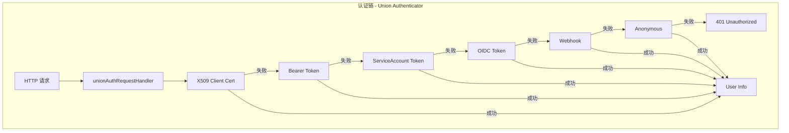
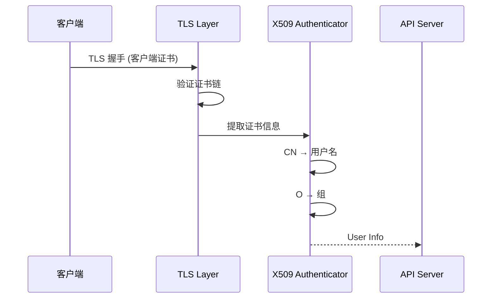
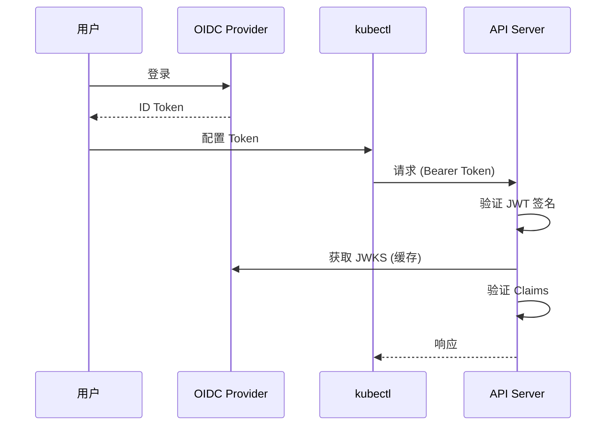
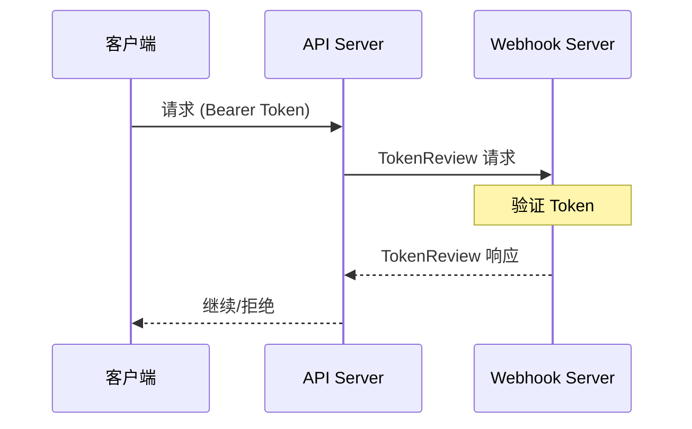

本文深入分析 API Server 的认证机制，包括认证框架、各种认证方式的实现原理以及认证链的工作流程。

## 1. 认证框架

### 1.1 Authenticator 接口

```go
// staging/src/k8s.io/apiserver/pkg/authentication/authenticator/interfaces.go

// Request 是认证请求的接口
type Request interface {
    // AuthenticateRequest 从 HTTP 请求中认证用户
    AuthenticateRequest(req *http.Request) (*Response, bool, error)
}

// Token 是认证 token 的接口
type Token interface {
    // AuthenticateToken 从 token 中认证用户
    AuthenticateToken(ctx context.Context, token string) (*Response, bool, error)
}

// Response 是认证响应
type Response struct {
    // User 是认证后的用户信息
    User user.Info

    // Audiences 是 token 的受众
    Audiences Audiences
}
```

### 1.2 User 接口

```go
// staging/src/k8s.io/apiserver/pkg/authentication/user/user.go

// Info 描述认证后的用户
type Info interface {
    // GetName 返回用户名
    GetName() string

    // GetUID 返回用户的唯一标识
    GetUID() string

    // GetGroups 返回用户所属的组
    GetGroups() []string

    // GetExtra 返回额外信息
    GetExtra() map[string][]string
}

// DefaultInfo 是 Info 的默认实现
type DefaultInfo struct {
    Name   string
    UID    string
    Groups []string
    Extra  map[string][]string
}
```

### 1.3 认证链



```go
// staging/src/k8s.io/apiserver/pkg/authentication/request/union/union.go

// unionAuthRequestHandler 是多个认证器的联合
type unionAuthRequestHandler struct {
    Handlers []authenticator.Request
}

// AuthenticateRequest 依次尝试每个认证器
func (authHandler *unionAuthRequestHandler) AuthenticateRequest(req *http.Request) (*authenticator.Response, bool, error) {
    var errlist []error
    for _, handler := range authHandler.Handlers {
        resp, ok, err := handler.AuthenticateRequest(req)
        if err != nil {
            errlist = append(errlist, err)
            continue
        }
        if ok {
            return resp, true, nil
        }
    }

    return nil, false, utilerrors.NewAggregate(errlist)
}
```

## 2. X509 客户端证书

### 2.1 工作原理



### 2.2 实现代码

```go
// staging/src/k8s.io/apiserver/pkg/authentication/request/x509/x509.go

// Authenticator 实现 X509 认证
type Authenticator struct {
    opts   x509.VerifyOptions
    user   UserConversion
}

// AuthenticateRequest 从客户端证书认证用户
func (a *Authenticator) AuthenticateRequest(req *http.Request) (*authenticator.Response, bool, error) {
    // 检查是否有客户端证书
    if req.TLS == nil || len(req.TLS.PeerCertificates) == 0 {
        return nil, false, nil
    }

    // 获取客户端证书链
    chains, err := req.TLS.PeerCertificates[0].Verify(a.opts)
    if err != nil {
        return nil, false, nil
    }

    // 转换为用户信息
    var errlist []error
    for _, chain := range chains {
        user, ok, err := a.user.User(chain)
        if err != nil {
            errlist = append(errlist, err)
            continue
        }
        if ok {
            return &authenticator.Response{User: user}, true, nil
        }
    }

    return nil, false, utilerrors.NewAggregate(errlist)
}

// CommonNameUserConversion 从 CN 和 O 提取用户信息
type CommonNameUserConversion struct{}

func (CommonNameUserConversion) User(chain []*x509.Certificate) (*authenticator.Response, bool, error) {
    if len(chain) == 0 {
        return nil, false, nil
    }

    cert := chain[0]
    user := &user.DefaultInfo{
        Name:   cert.Subject.CommonName,        // CN → 用户名
        Groups: cert.Subject.Organization,       // O → 组
    }

    return &authenticator.Response{User: user}, true, nil
}
```

### 2.3 配置示例

```bash
# API Server 配置
kube-apiserver \
    --client-ca-file=/etc/kubernetes/pki/ca.crt \
    ...

# 证书示例（CN=admin, O=system:masters）
openssl req -new -key admin.key -out admin.csr \
    -subj "/CN=admin/O=system:masters"

openssl x509 -req -in admin.csr \
    -CA /etc/kubernetes/pki/ca.crt \
    -CAkey /etc/kubernetes/pki/ca.key \
    -CAcreateserial -out admin.crt -days 365
```

## 3. Bearer Token

### 3.1 Token 认证流程

```go
// staging/src/k8s.io/apiserver/pkg/authentication/request/bearertoken/bearertoken.go

// Authenticator 实现 Bearer Token 认证
type Authenticator struct {
    auth authenticator.Token
}

// AuthenticateRequest 从 Authorization 头认证用户
func (a *Authenticator) AuthenticateRequest(req *http.Request) (*authenticator.Response, bool, error) {
    // 从 Authorization 头获取 token
    auth := strings.TrimSpace(req.Header.Get("Authorization"))
    if auth == "" {
        return nil, false, nil
    }

    parts := strings.SplitN(auth, " ", 3)
    if len(parts) < 2 || strings.ToLower(parts[0]) != "bearer" {
        return nil, false, nil
    }

    token := parts[1]
    if len(token) == 0 {
        return nil, false, nil
    }

    // 验证 token
    return a.auth.AuthenticateToken(req.Context(), token)
}
```

### 3.2 ServiceAccount Token

```go
// pkg/serviceaccount/jwt.go

// jwtTokenAuthenticator 验证 ServiceAccount JWT
type jwtTokenAuthenticator struct {
    issuers    []string
    publicKeys []interface{}
    validator  Validator
}

// AuthenticateToken 验证 JWT token
func (j *jwtTokenAuthenticator) AuthenticateToken(ctx context.Context, tokenData string) (*authenticator.Response, bool, error) {
    // 解析 JWT
    tok, err := jwt.ParseSigned(tokenData)
    if err != nil {
        return nil, false, nil
    }

    // 验证签名并获取 claims
    var claims jwt.Claims
    var privateClaims privateClaims
    if err := tok.Claims(j.publicKeys, &claims, &privateClaims); err != nil {
        return nil, false, nil
    }

    // 验证 issuer
    if !j.isValidIssuer(claims.Issuer) {
        return nil, false, nil
    }

    // 验证过期时间
    if claims.Expiry != nil && claims.Expiry.Time().Before(time.Now()) {
        return nil, false, nil
    }

    // 构建用户信息
    sa := &v1.ServiceAccount{}
    sa.Namespace = privateClaims.Kubernetes.Namespace
    sa.Name = privateClaims.Kubernetes.ServiceAccount.Name

    user := &user.DefaultInfo{
        Name: apiserverserviceaccount.MakeUsername(sa.Namespace, sa.Name),
        UID:  string(privateClaims.Kubernetes.ServiceAccount.UID),
        Groups: []string{
            user.AllAuthenticated,
            apiserverserviceaccount.MakeGroupNames(sa.Namespace)...,
        },
    }

    return &authenticator.Response{User: user}, true, nil
}
```

### 3.3 Bootstrap Token

```go
// plugin/pkg/auth/authenticator/token/bootstrap/bootstrap.go

// TokenAuthenticator 验证 bootstrap token
type TokenAuthenticator struct {
    client          clientset.Interface
    secretNamespace string
}

// AuthenticateToken 验证 bootstrap token
func (t *TokenAuthenticator) AuthenticateToken(ctx context.Context, token string) (*authenticator.Response, bool, error) {
    // 解析 token ID 和 secret
    tokenID, tokenSecret, err := bootstraputil.ParseToken(token)
    if err != nil {
        return nil, false, nil
    }

    // 获取对应的 Secret
    secretName := bootstraputil.BootstrapTokenSecretName(tokenID)
    secret, err := t.client.CoreV1().Secrets(t.secretNamespace).Get(ctx, secretName, metav1.GetOptions{})
    if err != nil {
        return nil, false, nil
    }

    // 验证 token
    if subtle.ConstantTimeCompare([]byte(string(secret.Data[bootstrapapi.BootstrapTokenSecretKey])), []byte(tokenSecret)) != 1 {
        return nil, false, nil
    }

    // 检查 token 是否过期
    if isExpired(secret) {
        return nil, false, nil
    }

    // 构建用户信息
    user := &user.DefaultInfo{
        Name:   bootstrapapi.BootstrapUserPrefix + tokenID,
        Groups: getGroups(secret),
    }

    return &authenticator.Response{User: user}, true, nil
}
```

## 4. OIDC 认证

### 4.1 OIDC 流程



### 4.2 OIDC 认证器

```go
// staging/src/k8s.io/apiserver/plugin/pkg/authenticator/token/oidc/oidc.go

// Authenticator 实现 OIDC 认证
type Authenticator struct {
    issuerURL      string
    clientID       string
    usernameClaim  string
    usernamePrefix string
    groupsClaim    string
    groupsPrefix   string
    verifier       *oidc.IDTokenVerifier
}

// AuthenticateToken 验证 OIDC token
func (a *Authenticator) AuthenticateToken(ctx context.Context, token string) (*authenticator.Response, bool, error) {
    // 验证 token
    idToken, err := a.verifier.Verify(ctx, token)
    if err != nil {
        return nil, false, nil
    }

    // 解析 claims
    var claims struct {
        Subject  string   `json:"sub"`
        Username string   `json:"preferred_username"`
        Email    string   `json:"email"`
        Groups   []string `json:"groups"`
    }
    if err := idToken.Claims(&claims); err != nil {
        return nil, false, err
    }

    // 获取用户名
    var username string
    switch a.usernameClaim {
    case "email":
        username = claims.Email
    case "sub":
        username = claims.Subject
    default:
        username = claims.Username
    }

    if a.usernamePrefix != "" {
        username = a.usernamePrefix + username
    }

    // 获取组
    var groups []string
    for _, group := range claims.Groups {
        if a.groupsPrefix != "" {
            groups = append(groups, a.groupsPrefix+group)
        } else {
            groups = append(groups, group)
        }
    }

    return &authenticator.Response{
        User: &user.DefaultInfo{
            Name:   username,
            Groups: groups,
        },
    }, true, nil
}
```

### 4.3 配置示例

```bash
kube-apiserver \
    --oidc-issuer-url=https://accounts.google.com \
    --oidc-client-id=kubernetes \
    --oidc-username-claim=email \
    --oidc-username-prefix="oidc:" \
    --oidc-groups-claim=groups \
    --oidc-groups-prefix="oidc:" \
    ...
```

## 5. Webhook 认证

### 5.1 Webhook 流程



### 5.2 Webhook 认证器

```go
// staging/src/k8s.io/apiserver/plugin/pkg/authenticator/token/webhook/webhook.go

// WebhookTokenAuthenticator 调用 webhook 认证
type WebhookTokenAuthenticator struct {
    tokenReview          authenticationclient.TokenReviewInterface
    retryBackoff         wait.Backoff
    implicitAuds         authenticator.Audiences
    requestTimeout       time.Duration
}

// AuthenticateToken 通过 webhook 验证 token
func (w *WebhookTokenAuthenticator) AuthenticateToken(ctx context.Context, token string) (*authenticator.Response, bool, error) {
    // 构建 TokenReview 请求
    review := &authenticationv1.TokenReview{
        Spec: authenticationv1.TokenReviewSpec{
            Token:     token,
            Audiences: w.implicitAuds,
        },
    }

    // 调用 webhook
    var result *authenticationv1.TokenReview
    err := wait.ExponentialBackoff(w.retryBackoff, func() (bool, error) {
        var err error
        result, err = w.tokenReview.Create(ctx, review, metav1.CreateOptions{})
        if err != nil {
            return false, nil // 重试
        }
        return true, nil
    })

    if err != nil {
        return nil, false, err
    }

    // 检查认证结果
    if !result.Status.Authenticated {
        return nil, false, nil
    }

    // 构建用户信息
    user := &user.DefaultInfo{
        Name:   result.Status.User.Username,
        UID:    result.Status.User.UID,
        Groups: result.Status.User.Groups,
        Extra:  convertExtra(result.Status.User.Extra),
    }

    return &authenticator.Response{User: user}, true, nil
}
```

### 5.3 TokenReview API

```go
// staging/src/k8s.io/api/authentication/v1/types.go

// TokenReview 请求 token 认证
type TokenReview struct {
    metav1.TypeMeta   `json:",inline"`
    metav1.ObjectMeta `json:"metadata,omitempty"`

    // Spec 是 token 信息
    Spec TokenReviewSpec `json:"spec"`

    // Status 是认证结果
    Status TokenReviewStatus `json:"status,omitempty"`
}

// TokenReviewSpec 包含要认证的 token
type TokenReviewSpec struct {
    // Token 是要认证的 token
    Token string `json:"token,omitempty"`

    // Audiences 是期望的受众
    Audiences []string `json:"audiences,omitempty"`
}

// TokenReviewStatus 是认证结果
type TokenReviewStatus struct {
    // Authenticated 表示是否认证成功
    Authenticated bool `json:"authenticated,omitempty"`

    // User 是认证后的用户信息
    User UserInfo `json:"user,omitempty"`

    // Error 是认证错误信息
    Error string `json:"error,omitempty"`
}
```

## 6. 匿名访问

### 6.1 匿名认证器

```go
// staging/src/k8s.io/apiserver/pkg/authentication/request/anonymous/anonymous.go

// Authenticator 实现匿名认证
type Authenticator struct{}

// AuthenticateRequest 返回匿名用户
func (a *Authenticator) AuthenticateRequest(req *http.Request) (*authenticator.Response, bool, error) {
    return &authenticator.Response{
        User: &user.DefaultInfo{
            Name:   user.Anonymous,
            Groups: []string{user.AllUnauthenticated},
        },
    }, true, nil
}
```

### 6.2 系统组件认证

系统组件使用特殊的用户名和组：

| 用户名 | 组 | 用途 |
|-------|-----|-----|
| `system:kube-scheduler` | `system:kube-scheduler` | Scheduler |
| `system:kube-controller-manager` | `system:kube-controller-manager` | Controller Manager |
| `system:node:<nodeName>` | `system:nodes` | Kubelet |
| `system:kube-proxy` | `system:node-proxier` | kube-proxy |

## 7. 认证配置

### 7.1 完整配置示例

```go
// pkg/kubeapiserver/authenticator/config.go

// Config 包含认证配置
type Config struct {
    // Anonymous 允许匿名访问
    Anonymous bool

    // BasicAuth 启用基本认证（已弃用）
    BasicAuth *BasicAuthFile

    // BootstrapToken 启用 bootstrap token
    BootstrapToken bool

    // ClientCAContentProvider 提供客户端 CA
    ClientCAContentProvider dynamiccertificates.CAContentProvider

    // OIDCIssuerURL 是 OIDC provider URL
    OIDCIssuerURL string
    OIDCClientID  string
    // ...

    // RequestHeaderConfig 用于代理认证
    RequestHeaderConfig *authenticatorfactory.RequestHeaderConfig

    // ServiceAccountLookup 查找 ServiceAccount
    ServiceAccountLookup bool

    // TokenAuthFile 静态 token 文件
    TokenAuthFile string

    // WebhookTokenAuthnConfigFile webhook 配置
    WebhookTokenAuthnConfigFile string
    // ...
}

// New 创建认证器
func (config Config) New() (authenticator.Request, *spec.SecurityDefinitions, error) {
    var authenticators []authenticator.Request
    var tokenAuthenticators []authenticator.Token

    // 1. 请求头认证（代理）
    if config.RequestHeaderConfig != nil {
        requestHeaderAuthenticator := headerrequest.NewDynamicVerifyOptionsSecure(...)
        authenticators = append(authenticators, requestHeaderAuthenticator)
    }

    // 2. X509 客户端证书
    if config.ClientCAContentProvider != nil {
        certAuth := x509.NewDynamic(...)
        authenticators = append(authenticators, certAuth)
    }

    // 3. Bearer Token 认证器
    // 3.1 静态 Token 文件
    if config.TokenAuthFile != "" {
        tokenAuthenticators = append(tokenAuthenticators, tokenfile.New(config.TokenAuthFile))
    }

    // 3.2 ServiceAccount Token
    if config.ServiceAccountLookup {
        tokenAuthenticators = append(tokenAuthenticators, serviceaccounttoken.NewValidator(...))
    }

    // 3.3 Bootstrap Token
    if config.BootstrapToken {
        tokenAuthenticators = append(tokenAuthenticators, bootstrap.NewTokenAuthenticator(...))
    }

    // 3.4 OIDC
    if config.OIDCIssuerURL != "" {
        oidcAuth, err := oidc.New(...)
        tokenAuthenticators = append(tokenAuthenticators, oidcAuth)
    }

    // 3.5 Webhook
    if config.WebhookTokenAuthnConfigFile != "" {
        webhookAuth, err := webhook.New(...)
        tokenAuthenticators = append(tokenAuthenticators, webhookAuth)
    }

    // 组合 Token 认证器
    if len(tokenAuthenticators) > 0 {
        tokenAuth := tokenunion.New(tokenAuthenticators...)
        authenticators = append(authenticators, bearertoken.New(tokenAuth))
    }

    // 4. 匿名认证
    if config.Anonymous {
        authenticators = append(authenticators, anonymous.NewAuthenticator())
    }

    // 组合所有认证器
    return union.New(authenticators...), securityDefinitions, nil
}
```

## 小结

本文详细分析了 API Server 的认证机制：

1. **认证框架**：Authenticator 接口、User 接口、认证链
2. **X509 认证**：客户端证书认证，CN→用户名，O→组
3. **Bearer Token**：ServiceAccount Token、Bootstrap Token、静态 Token
4. **OIDC 认证**：与 OIDC Provider 集成，JWT 验证
5. **Webhook 认证**：通过外部服务认证
6. **匿名访问**：未认证请求的处理

认证是 API Server 安全的第一道防线，下一篇将介绍授权机制。
