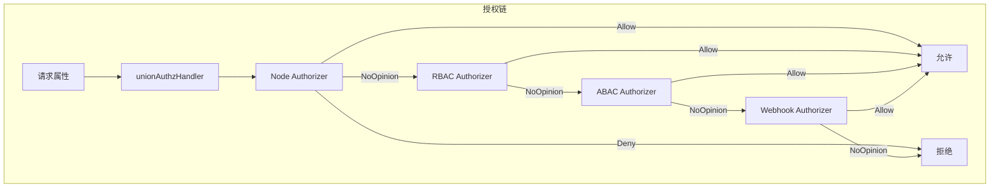
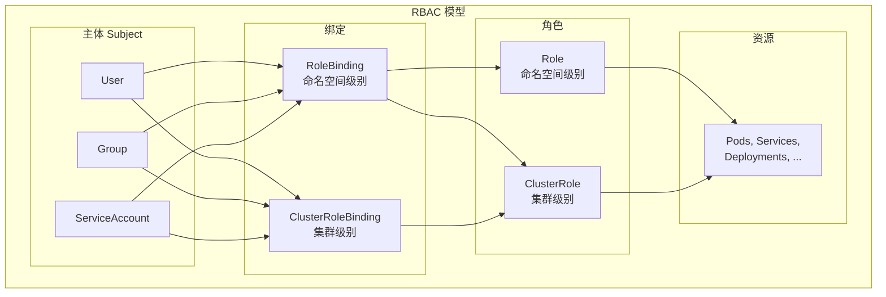
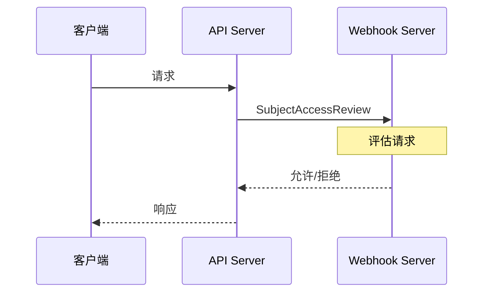

本文深入分析 API Server 的授权机制，包括授权框架、RBAC 实现、Node 授权以及 Webhook 授权等。

## 1. 授权框架

### 1.1 Authorizer 接口

```go
// staging/src/k8s.io/apiserver/pkg/authorization/authorizer/interfaces.go

// Authorizer 是授权决策接口
type Authorizer interface {
    // Authorize 对给定的属性做出授权决策
    Authorize(ctx context.Context, a Attributes) (Decision, string, error)
}

// Decision 是授权决策结果
type Decision int

const (
    // DecisionDeny 拒绝访问
    DecisionDeny Decision = iota
    // DecisionAllow 允许访问
    DecisionAllow
    // DecisionNoOpinion 不做决策，交给下一个授权器
    DecisionNoOpinion
)

// Attributes 是授权属性
type Attributes interface {
    // 用户信息
    GetUser() user.Info

    // 请求动作
    GetVerb() string

    // 是否是资源请求
    IsResourceRequest() bool

    // 非资源请求的路径
    GetPath() string

    // 资源请求的信息
    GetNamespace() string
    GetResource() string
    GetSubresource() string
    GetName() string
    GetAPIGroup() string
    GetAPIVersion() string
}
```

### 1.2 授权链



```go
// staging/src/k8s.io/apiserver/pkg/authorization/union/union.go

// unionAuthzHandler 组合多个授权器
type unionAuthzHandler []authorizer.Authorizer

// Authorize 依次调用每个授权器
func (authzHandler unionAuthzHandler) Authorize(ctx context.Context, a authorizer.Attributes) (authorizer.Decision, string, error) {
    var (
        errlist    []error
        reasonlist []string
    )

    for _, handler := range authzHandler {
        decision, reason, err := handler.Authorize(ctx, a)

        switch decision {
        case authorizer.DecisionAllow:
            // 允许，直接返回
            return authorizer.DecisionAllow, reason, nil
        case authorizer.DecisionDeny:
            // 拒绝，直接返回
            return authorizer.DecisionDeny, reason, nil
        case authorizer.DecisionNoOpinion:
            // 不做决策，继续下一个
            if reason != "" {
                reasonlist = append(reasonlist, reason)
            }
        }

        if err != nil {
            errlist = append(errlist, err)
        }
    }

    // 所有授权器都不做决策，默认拒绝
    return authorizer.DecisionNoOpinion, strings.Join(reasonlist, "\n"), utilerrors.NewAggregate(errlist)
}
```

## 2. RBAC 授权

### 2.1 RBAC 模型



### 2.2 RBAC 资源定义

```go
// staging/src/k8s.io/api/rbac/v1/types.go

// Role 是命名空间级别的角色
type Role struct {
    metav1.TypeMeta   `json:",inline"`
    metav1.ObjectMeta `json:"metadata,omitempty"`

    // Rules 是权限规则列表
    Rules []PolicyRule `json:"rules"`
}

// ClusterRole 是集群级别的角色
type ClusterRole struct {
    metav1.TypeMeta   `json:",inline"`
    metav1.ObjectMeta `json:"metadata,omitempty"`

    // Rules 是权限规则列表
    Rules []PolicyRule `json:"rules"`

    // AggregationRule 聚合规则
    AggregationRule *AggregationRule `json:"aggregationRule,omitempty"`
}

// PolicyRule 是单条权限规则
type PolicyRule struct {
    // Verbs 是允许的操作
    Verbs []string `json:"verbs"`

    // APIGroups 是资源所属的 API 组
    APIGroups []string `json:"apiGroups,omitempty"`

    // Resources 是资源类型
    Resources []string `json:"resources,omitempty"`

    // ResourceNames 是具体的资源名称
    ResourceNames []string `json:"resourceNames,omitempty"`

    // NonResourceURLs 是非资源 URL
    NonResourceURLs []string `json:"nonResourceURLs,omitempty"`
}

// RoleBinding 将角色绑定到主体
type RoleBinding struct {
    metav1.TypeMeta   `json:",inline"`
    metav1.ObjectMeta `json:"metadata,omitempty"`

    // Subjects 是绑定的主体
    Subjects []Subject `json:"subjects,omitempty"`

    // RoleRef 是绑定的角色
    RoleRef RoleRef `json:"roleRef"`
}

// Subject 是主体
type Subject struct {
    // Kind 是主体类型: User, Group, ServiceAccount
    Kind string `json:"kind"`

    // APIGroup 是主体的 API 组
    APIGroup string `json:"apiGroup,omitempty"`

    // Name 是主体名称
    Name string `json:"name"`

    // Namespace 是 ServiceAccount 的命名空间
    Namespace string `json:"namespace,omitempty"`
}
```

### 2.3 RBAC 授权器

```go
// plugin/pkg/auth/authorizer/rbac/rbac.go

// RBACAuthorizer 实现 RBAC 授权
type RBACAuthorizer struct {
    authorizationRuleResolver *rbacregistryvalidation.DefaultRuleResolver
}

// Authorize 执行 RBAC 授权
func (r *RBACAuthorizer) Authorize(ctx context.Context, requestAttributes authorizer.Attributes) (authorizer.Decision, string, error) {
    ruleCheckingVisitor := &authorizingVisitor{requestAttributes: requestAttributes}

    // 遍历规则
    r.authorizationRuleResolver.VisitRulesFor(
        requestAttributes.GetUser(),
        requestAttributes.GetNamespace(),
        ruleCheckingVisitor.visit,
    )

    if ruleCheckingVisitor.allowed {
        return authorizer.DecisionAllow, ruleCheckingVisitor.reason, nil
    }

    return authorizer.DecisionNoOpinion, ruleCheckingVisitor.reason, nil
}

// authorizingVisitor 访问规则并判断是否授权
type authorizingVisitor struct {
    requestAttributes authorizer.Attributes
    allowed           bool
    reason            string
}

func (v *authorizingVisitor) visit(source fmt.Stringer, rule *rbacv1.PolicyRule, err error) bool {
    if err != nil {
        return true // 继续遍历
    }

    // 检查规则是否匹配
    if RuleAllows(v.requestAttributes, rule) {
        v.allowed = true
        v.reason = fmt.Sprintf("RBAC: allowed by %s", source.String())
        return false // 停止遍历
    }

    return true // 继续遍历
}
```

### 2.4 规则匹配

```go
// plugin/pkg/auth/authorizer/rbac/rbac.go

// RuleAllows 检查规则是否允许请求
func RuleAllows(requestAttributes authorizer.Attributes, rule *rbacv1.PolicyRule) bool {
    if requestAttributes.IsResourceRequest() {
        // 资源请求
        combinedResource := requestAttributes.GetResource()
        if len(requestAttributes.GetSubresource()) > 0 {
            combinedResource = requestAttributes.GetResource() + "/" + requestAttributes.GetSubresource()
        }

        return VerbMatches(rule, requestAttributes.GetVerb()) &&
            APIGroupMatches(rule, requestAttributes.GetAPIGroup()) &&
            ResourceMatches(rule, combinedResource, requestAttributes.GetSubresource()) &&
            ResourceNameMatches(rule, requestAttributes.GetName())
    }

    // 非资源请求
    return VerbMatches(rule, requestAttributes.GetVerb()) &&
        NonResourceURLMatches(rule, requestAttributes.GetPath())
}

// VerbMatches 检查动作是否匹配
func VerbMatches(rule *rbacv1.PolicyRule, requestVerb string) bool {
    for _, verb := range rule.Verbs {
        if verb == rbacv1.VerbAll || verb == requestVerb {
            return true
        }
    }
    return false
}

// APIGroupMatches 检查 API 组是否匹配
func APIGroupMatches(rule *rbacv1.PolicyRule, requestAPIGroup string) bool {
    for _, group := range rule.APIGroups {
        if group == rbacv1.APIGroupAll || group == requestAPIGroup {
            return true
        }
    }
    return false
}

// ResourceMatches 检查资源是否匹配
func ResourceMatches(rule *rbacv1.PolicyRule, combinedResource, subresource string) bool {
    for _, resource := range rule.Resources {
        if resource == rbacv1.ResourceAll ||
            resource == combinedResource ||
            resource == "*" {
            return true
        }
    }
    return false
}
```

### 2.5 RBAC 示例

```yaml
# Role 示例
apiVersion: rbac.authorization.k8s.io/v1
kind: Role
metadata:
  namespace: default
  name: pod-reader
rules:
- apiGroups: [""]
  resources: ["pods"]
  verbs: ["get", "watch", "list"]
- apiGroups: [""]
  resources: ["pods/log"]
  verbs: ["get"]

---
# RoleBinding 示例
apiVersion: rbac.authorization.k8s.io/v1
kind: RoleBinding
metadata:
  name: read-pods
  namespace: default
subjects:
- kind: User
  name: jane
  apiGroup: rbac.authorization.k8s.io
- kind: ServiceAccount
  name: default
  namespace: default
roleRef:
  kind: Role
  name: pod-reader
  apiGroup: rbac.authorization.k8s.io

---
# ClusterRole 示例
apiVersion: rbac.authorization.k8s.io/v1
kind: ClusterRole
metadata:
  name: secret-reader
rules:
- apiGroups: [""]
  resources: ["secrets"]
  verbs: ["get", "watch", "list"]

---
# ClusterRoleBinding 示例
apiVersion: rbac.authorization.k8s.io/v1
kind: ClusterRoleBinding
metadata:
  name: read-secrets-global
subjects:
- kind: Group
  name: managers
  apiGroup: rbac.authorization.k8s.io
roleRef:
  kind: ClusterRole
  name: secret-reader
  apiGroup: rbac.authorization.k8s.io
```

## 3. Node 授权

### 3.1 Node 授权器

Node 授权器限制 Kubelet 只能访问与其节点相关的资源：

```go
// plugin/pkg/auth/authorizer/node/node_authorizer.go

// NodeAuthorizer 实现 Node 授权
type NodeAuthorizer struct {
    graph      *Graph
    identifier nodeidentifier.NodeIdentifier
}

// Authorize 执行 Node 授权
func (r *NodeAuthorizer) Authorize(ctx context.Context, attrs authorizer.Attributes) (authorizer.Decision, string, error) {
    // 检查是否是节点用户
    nodeName, isNode := r.identifier.NodeIdentity(attrs.GetUser())
    if !isNode {
        return authorizer.DecisionNoOpinion, "", nil
    }

    // 检查请求的资源
    if attrs.IsResourceRequest() {
        return r.authorizeResourceRequest(nodeName, attrs)
    }

    // 非资源请求
    return r.authorizeNonResourceRequest(nodeName, attrs)
}

// authorizeResourceRequest 授权资源请求
func (r *NodeAuthorizer) authorizeResourceRequest(nodeName string, attrs authorizer.Attributes) (authorizer.Decision, string, error) {
    switch attrs.GetResource() {
    case "nodes":
        return r.authorizeReadNamespacedObject(nodeName, nodeVertexType, attrs)
    case "pods":
        return r.authorizePodRequest(nodeName, attrs)
    case "secrets", "configmaps", "persistentvolumeclaims":
        return r.authorizeReadNamespacedObject(nodeName, attrs.GetResource(), attrs)
    // ... 更多资源
    }

    return authorizer.DecisionNoOpinion, "", nil
}
```

### 3.2 Node 权限范围

| 资源 | 允许的操作 | 条件 |
|-----|----------|-----|
| nodes | get | 仅限自己的节点 |
| nodes/status | update | 仅限自己的节点 |
| pods | get, list, watch | 绑定到该节点的 Pod |
| secrets | get | Pod 引用的 Secret |
| configmaps | get | Pod 引用的 ConfigMap |
| pvc | get | Pod 引用的 PVC |
| pv | get | PVC 绑定的 PV |
| events | create, patch, update | 与节点或 Pod 相关 |

## 4. Webhook 授权

### 4.1 Webhook 流程



### 4.2 Webhook 授权器

```go
// staging/src/k8s.io/apiserver/plugin/pkg/authorizer/webhook/webhook.go

// WebhookAuthorizer 调用 webhook 授权
type WebhookAuthorizer struct {
    subjectAccessReview authorizationclient.SubjectAccessReviewInterface
    responseCache       *cache.LRUExpireCache
    authorizedTTL       time.Duration
    unauthorizedTTL     time.Duration
}

// Authorize 通过 webhook 授权
func (w *WebhookAuthorizer) Authorize(ctx context.Context, attr authorizer.Attributes) (authorizer.Decision, string, error) {
    // 检查缓存
    if decision, reason, ok := w.checkCache(attr); ok {
        return decision, reason, nil
    }

    // 构建 SubjectAccessReview
    r := &authorizationv1.SubjectAccessReview{
        Spec: authorizationv1.SubjectAccessReviewSpec{
            User:   attr.GetUser().GetName(),
            UID:    attr.GetUser().GetUID(),
            Groups: attr.GetUser().GetGroups(),
            Extra:  convertExtra(attr.GetUser().GetExtra()),
        },
    }

    if attr.IsResourceRequest() {
        r.Spec.ResourceAttributes = &authorizationv1.ResourceAttributes{
            Namespace:   attr.GetNamespace(),
            Verb:        attr.GetVerb(),
            Group:       attr.GetAPIGroup(),
            Version:     attr.GetAPIVersion(),
            Resource:    attr.GetResource(),
            Subresource: attr.GetSubresource(),
            Name:        attr.GetName(),
        }
    } else {
        r.Spec.NonResourceAttributes = &authorizationv1.NonResourceAttributes{
            Path: attr.GetPath(),
            Verb: attr.GetVerb(),
        }
    }

    // 调用 webhook
    result, err := w.subjectAccessReview.Create(ctx, r, metav1.CreateOptions{})
    if err != nil {
        return authorizer.DecisionNoOpinion, "", err
    }

    // 缓存结果
    if result.Status.Allowed {
        w.responseCache.Add(cacheKey(attr), true, w.authorizedTTL)
        return authorizer.DecisionAllow, result.Status.Reason, nil
    }

    w.responseCache.Add(cacheKey(attr), false, w.unauthorizedTTL)
    return authorizer.DecisionNoOpinion, result.Status.Reason, nil
}
```

### 4.3 SubjectAccessReview API

```go
// staging/src/k8s.io/api/authorization/v1/types.go

// SubjectAccessReview 请求授权检查
type SubjectAccessReview struct {
    metav1.TypeMeta   `json:",inline"`
    metav1.ObjectMeta `json:"metadata,omitempty"`

    Spec   SubjectAccessReviewSpec   `json:"spec"`
    Status SubjectAccessReviewStatus `json:"status,omitempty"`
}

// SubjectAccessReviewSpec 包含要检查的授权信息
type SubjectAccessReviewSpec struct {
    // ResourceAttributes 资源请求属性
    ResourceAttributes *ResourceAttributes `json:"resourceAttributes,omitempty"`

    // NonResourceAttributes 非资源请求属性
    NonResourceAttributes *NonResourceAttributes `json:"nonResourceAttributes,omitempty"`

    // User 是要检查的用户
    User string `json:"user,omitempty"`

    // Groups 是用户的组
    Groups []string `json:"groups,omitempty"`

    // Extra 是额外信息
    Extra map[string]ExtraValue `json:"extra,omitempty"`

    // UID 是用户的 UID
    UID string `json:"uid,omitempty"`
}

// SubjectAccessReviewStatus 是授权结果
type SubjectAccessReviewStatus struct {
    // Allowed 是否允许
    Allowed bool `json:"allowed"`

    // Denied 是否明确拒绝
    Denied bool `json:"denied,omitempty"`

    // Reason 是决策原因
    Reason string `json:"reason,omitempty"`

    // EvaluationError 是评估错误
    EvaluationError string `json:"evaluationError,omitempty"`
}
```

## 5. ABAC 授权

### 5.1 ABAC 策略

ABAC（Attribute-Based Access Control）使用策略文件：

```json
// abac-policy.jsonl
{"apiVersion": "abac.authorization.kubernetes.io/v1beta1", "kind": "Policy", "spec": {"user": "alice", "namespace": "*", "resource": "*", "apiGroup": "*"}}
{"apiVersion": "abac.authorization.kubernetes.io/v1beta1", "kind": "Policy", "spec": {"user": "bob", "namespace": "projectCaribou", "resource": "*", "apiGroup": "*"}}
{"apiVersion": "abac.authorization.kubernetes.io/v1beta1", "kind": "Policy", "spec": {"group": "system:authenticated", "nonResourcePath": "/healthz", "readonly": true}}
```

### 5.2 ABAC 授权器

```go
// pkg/auth/authorizer/abac/abac.go

// PolicyList 是 ABAC 策略列表
type PolicyList struct {
    Items []api.Policy
}

// Authorize 执行 ABAC 授权
func (pl PolicyList) Authorize(ctx context.Context, a authorizer.Attributes) (authorizer.Decision, string, error) {
    for _, p := range pl.Items {
        if matches(p, a) {
            return authorizer.DecisionAllow, "", nil
        }
    }
    return authorizer.DecisionNoOpinion, "No policy matched.", nil
}

// matches 检查策略是否匹配请求
func matches(p api.Policy, a authorizer.Attributes) bool {
    // 检查用户
    if p.Spec.User != "*" && p.Spec.User != a.GetUser().GetName() {
        return false
    }

    // 检查组
    if p.Spec.Group != "" {
        found := false
        for _, group := range a.GetUser().GetGroups() {
            if p.Spec.Group == group {
                found = true
                break
            }
        }
        if !found {
            return false
        }
    }

    // 检查命名空间
    if p.Spec.Namespace != "*" && p.Spec.Namespace != a.GetNamespace() {
        return false
    }

    // 检查资源
    if p.Spec.Resource != "*" && p.Spec.Resource != a.GetResource() {
        return false
    }

    // 检查 API 组
    if p.Spec.APIGroup != "*" && p.Spec.APIGroup != a.GetAPIGroup() {
        return false
    }

    // 检查只读
    if p.Spec.Readonly && !isReadOnlyVerb(a.GetVerb()) {
        return false
    }

    return true
}
```

## 6. 授权缓存

### 6.1 缓存实现

```go
// staging/src/k8s.io/apiserver/pkg/authorization/authorizerfactory/delegating.go

// NewDelegatingAuthorizer 创建带缓存的授权器
func NewDelegatingAuthorizer(config Config) (authorizer.Authorizer, error) {
    // 创建缓存
    cache := cache.NewLRUExpireCache(1024)

    return &cachingAuthorizer{
        authorizer: config.Authorizer,
        cache:      cache,
        ttl:        config.CacheTTL,
    }, nil
}

// cachingAuthorizer 带缓存的授权器
type cachingAuthorizer struct {
    authorizer authorizer.Authorizer
    cache      *cache.LRUExpireCache
    ttl        time.Duration
}

// Authorize 带缓存的授权
func (a *cachingAuthorizer) Authorize(ctx context.Context, attrs authorizer.Attributes) (authorizer.Decision, string, error) {
    // 生成缓存 key
    key := cacheKey(attrs)

    // 检查缓存
    if cached, ok := a.cache.Get(key); ok {
        decision := cached.(authorizer.Decision)
        return decision, "cached", nil
    }

    // 调用实际授权器
    decision, reason, err := a.authorizer.Authorize(ctx, attrs)
    if err != nil {
        return decision, reason, err
    }

    // 缓存结果
    a.cache.Add(key, decision, a.ttl)

    return decision, reason, nil
}
```

## 7. 授权配置

### 7.1 命令行参数

```bash
kube-apiserver \
    --authorization-mode=Node,RBAC,Webhook \
    --authorization-webhook-config-file=/etc/kubernetes/webhook-authz-config.yaml \
    --authorization-webhook-cache-authorized-ttl=5m \
    --authorization-webhook-cache-unauthorized-ttl=30s \
    ...
```

### 7.2 授权模式

| 模式 | 描述 |
|-----|-----|
| AlwaysAllow | 允许所有请求（仅用于测试） |
| AlwaysDeny | 拒绝所有请求（仅用于测试） |
| Node | Kubelet 节点授权 |
| RBAC | 基于角色的访问控制 |
| ABAC | 基于属性的访问控制 |
| Webhook | 外部 Webhook 授权 |

## 小结

本文详细分析了 API Server 的授权机制：

1. **授权框架**：Authorizer 接口、授权链、决策类型
2. **RBAC 授权**：Role、ClusterRole、RoleBinding、规则匹配
3. **Node 授权**：限制 Kubelet 访问范围
4. **Webhook 授权**：通过外部服务授权
5. **ABAC 授权**：基于策略文件的授权
6. **授权缓存**：提高授权性能

授权是 API Server 安全的第二道防线，下一篇将介绍准入控制机制。
