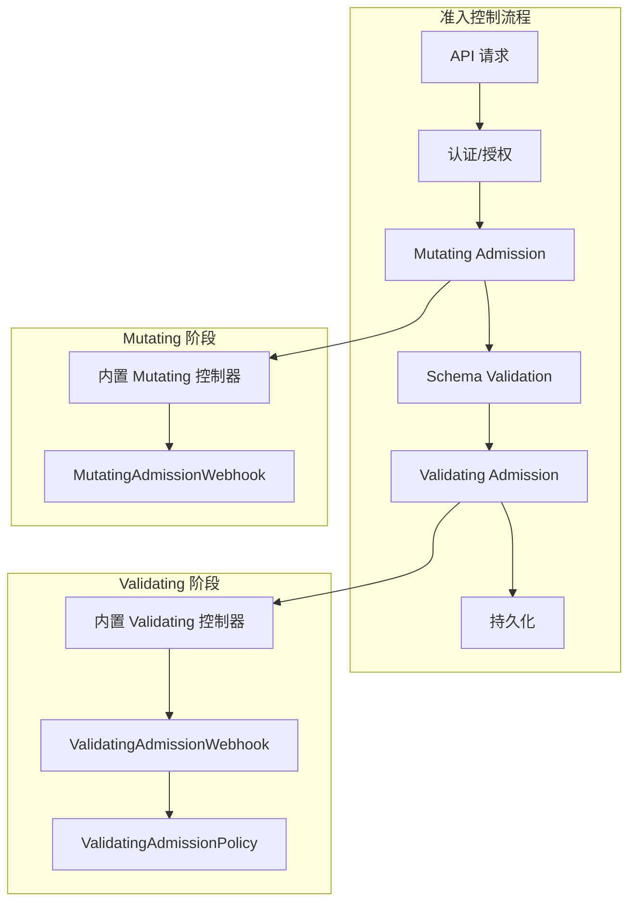

本文深入分析 API Server 的准入控制机制，包括准入控制框架、内置准入控制器、Webhook 准入以及 ValidatingAdmissionPolicy。

## 1. 准入控制框架

### 1.1 准入控制流程



### 1.2 AdmissionController 接口

```go
// staging/src/k8s.io/apiserver/pkg/admission/interfaces.go

// Interface 是准入控制器的基础接口
type Interface interface {
    // Handles 返回是否处理该操作
    Handles(operation Operation) bool
}

// MutationInterface 是 Mutating 准入控制器接口
type MutationInterface interface {
    Interface

    // Admit 执行 Mutating 准入
    Admit(ctx context.Context, a Attributes, o ObjectInterfaces) error
}

// ValidationInterface 是 Validating 准入控制器接口
type ValidationInterface interface {
    Interface

    // Validate 执行 Validating 准入
    Validate(ctx context.Context, a Attributes, o ObjectInterfaces) error
}

// Operation 是操作类型
type Operation string

const (
    Create  Operation = "CREATE"
    Update  Operation = "UPDATE"
    Delete  Operation = "DELETE"
    Connect Operation = "CONNECT"
)
```

### 1.3 Attributes 属性

```go
// staging/src/k8s.io/apiserver/pkg/admission/attributes.go

// Attributes 包含准入请求的属性
type Attributes interface {
    // GetName 返回资源名称
    GetName() string

    // GetNamespace 返回命名空间
    GetNamespace() string

    // GetResource 返回资源类型
    GetResource() schema.GroupVersionResource

    // GetSubresource 返回子资源
    GetSubresource() string

    // GetOperation 返回操作类型
    GetOperation() Operation

    // GetObject 返回请求中的对象
    GetObject() runtime.Object

    // GetOldObject 返回旧对象（Update 时）
    GetOldObject() runtime.Object

    // GetKind 返回 Kind
    GetKind() schema.GroupVersionKind

    // GetUserInfo 返回用户信息
    GetUserInfo() user.Info

    // GetDryRun 返回是否是 dry-run
    GetDryRun() bool
}
```

### 1.4 准入链

```go
// staging/src/k8s.io/apiserver/pkg/admission/chain.go

// chainAdmissionHandler 是准入控制器链
type chainAdmissionHandler []Interface

// Admit 依次调用 Mutating 准入
func (admissionHandler chainAdmissionHandler) Admit(ctx context.Context, a Attributes, o ObjectInterfaces) error {
    for _, handler := range admissionHandler {
        if !handler.Handles(a.GetOperation()) {
            continue
        }
        if mutator, ok := handler.(MutationInterface); ok {
            if err := mutator.Admit(ctx, a, o); err != nil {
                return err
            }
        }
    }
    return nil
}

// Validate 依次调用 Validating 准入
func (admissionHandler chainAdmissionHandler) Validate(ctx context.Context, a Attributes, o ObjectInterfaces) error {
    for _, handler := range admissionHandler {
        if !handler.Handles(a.GetOperation()) {
            continue
        }
        if validator, ok := handler.(ValidationInterface); ok {
            if err := validator.Validate(ctx, a, o); err != nil {
                return err
            }
        }
    }
    return nil
}
```

## 2. 内置准入控制器

### 2.1 控制器列表

| 控制器 | 类型 | 描述 |
|-------|-----|-----|
| NamespaceLifecycle | Validating | 防止在终止的命名空间创建资源 |
| LimitRanger | Mutating/Validating | 应用和验证资源限制 |
| ServiceAccount | Mutating | 自动注入 ServiceAccount |
| ResourceQuota | Validating | 验证资源配额 |
| PodSecurity | Validating | 验证 Pod 安全标准 |
| DefaultStorageClass | Mutating | 设置默认 StorageClass |
| MutatingAdmissionWebhook | Mutating | 调用外部 Webhook |
| ValidatingAdmissionWebhook | Validating | 调用外部 Webhook |

### 2.2 NamespaceLifecycle

```go
// plugin/pkg/admission/namespace/lifecycle/admission.go

// Lifecycle 确保命名空间生命周期
type Lifecycle struct {
    *admission.Handler
    client             kubernetes.Interface
    immortalNamespaces sets.String
}

// Validate 验证命名空间状态
func (l *Lifecycle) Validate(ctx context.Context, a admission.Attributes, o admission.ObjectInterfaces) error {
    // 跳过非命名空间资源
    if len(a.GetNamespace()) == 0 || a.GetKind().GroupKind() == api.Kind("Namespace") {
        return nil
    }

    // 检查命名空间是否存在
    namespace, err := l.client.CoreV1().Namespaces().Get(ctx, a.GetNamespace(), metav1.GetOptions{})
    if err != nil {
        if errors.IsNotFound(err) {
            return admission.NewForbidden(a, fmt.Errorf("namespace %s does not exist", a.GetNamespace()))
        }
        return err
    }

    // 检查命名空间是否正在终止
    if namespace.Status.Phase == api.NamespaceTerminating {
        return admission.NewForbidden(a, fmt.Errorf("namespace %s is terminating", a.GetNamespace()))
    }

    return nil
}
```

### 2.3 LimitRanger

```go
// plugin/pkg/admission/limitranger/admission.go

// LimitRanger 应用资源限制
type LimitRanger struct {
    *admission.Handler
    client  kubernetes.Interface
    actions []LimitRangerAction
}

// Admit 应用默认限制
func (l *LimitRanger) Admit(ctx context.Context, a admission.Attributes, o admission.ObjectInterfaces) error {
    if a.GetSubresource() != "" {
        return nil
    }

    // 获取命名空间的 LimitRange
    limitRanges, err := l.GetLimitRanges(a.GetNamespace())
    if err != nil {
        return err
    }

    // 应用限制
    for _, action := range l.actions {
        if action.MutateLimit != nil {
            if err := action.MutateLimit(limitRanges, a.GetObject()); err != nil {
                return admission.NewForbidden(a, err)
            }
        }
    }

    return nil
}

// Validate 验证资源限制
func (l *LimitRanger) Validate(ctx context.Context, a admission.Attributes, o admission.ObjectInterfaces) error {
    // 获取 LimitRange
    limitRanges, err := l.GetLimitRanges(a.GetNamespace())
    if err != nil {
        return err
    }

    // 验证限制
    for _, action := range l.actions {
        if action.ValidateLimit != nil {
            if err := action.ValidateLimit(limitRanges, a.GetObject()); err != nil {
                return admission.NewForbidden(a, err)
            }
        }
    }

    return nil
}
```

### 2.4 ResourceQuota

```go
// plugin/pkg/admission/resourcequota/admission.go

// QuotaAdmission 验证资源配额
type QuotaAdmission struct {
    *admission.Handler
    evaluator   Evaluator
    quotaLister listers.ResourceQuotaLister
}

// Validate 验证配额
func (a *QuotaAdmission) Validate(ctx context.Context, attr admission.Attributes, o admission.ObjectInterfaces) error {
    // 获取命名空间的配额
    quotas, err := a.quotaLister.ResourceQuotas(attr.GetNamespace()).List(labels.Everything())
    if err != nil {
        return err
    }
    if len(quotas) == 0 {
        return nil
    }

    // 计算请求的资源使用
    requested, err := a.evaluator.Evaluate(attr)
    if err != nil {
        return err
    }

    // 检查是否超出配额
    for _, quota := range quotas {
        for resourceName, requested := range requested {
            limit, found := quota.Status.Hard[resourceName]
            if !found {
                continue
            }
            used := quota.Status.Used[resourceName]
            newUsage := used.DeepCopy()
            newUsage.Add(requested)

            if newUsage.Cmp(limit) > 0 {
                return admission.NewForbidden(attr,
                    fmt.Errorf("exceeded quota: %s, requested: %s=%s, used: %s=%s, limited: %s=%s",
                        quota.Name, resourceName, &requested, resourceName, &used, resourceName, &limit))
            }
        }
    }

    return nil
}
```

## 3. Webhook 准入

### 3.1 Webhook 配置

```yaml
# MutatingWebhookConfiguration
apiVersion: admissionregistration.k8s.io/v1
kind: MutatingWebhookConfiguration
metadata:
  name: example-mutating-webhook
webhooks:
- name: example.mutating.webhook.io
  clientConfig:
    service:
      name: webhook-service
      namespace: default
      path: /mutate
    caBundle: <base64-encoded-ca-cert>
  rules:
  - operations: ["CREATE", "UPDATE"]
    apiGroups: [""]
    apiVersions: ["v1"]
    resources: ["pods"]
  admissionReviewVersions: ["v1", "v1beta1"]
  sideEffects: None
  failurePolicy: Fail
  matchPolicy: Equivalent
  namespaceSelector:
    matchLabels:
      environment: production

---
# ValidatingWebhookConfiguration
apiVersion: admissionregistration.k8s.io/v1
kind: ValidatingWebhookConfiguration
metadata:
  name: example-validating-webhook
webhooks:
- name: example.validating.webhook.io
  clientConfig:
    url: "https://webhook.example.com/validate"
    caBundle: <base64-encoded-ca-cert>
  rules:
  - operations: ["CREATE"]
    apiGroups: ["apps"]
    apiVersions: ["v1"]
    resources: ["deployments"]
  admissionReviewVersions: ["v1"]
  sideEffects: None
  failurePolicy: Ignore
  timeoutSeconds: 5
```

### 3.2 Webhook 调用

```go
// staging/src/k8s.io/apiserver/pkg/admission/plugin/webhook/generic/webhook.go

// Webhook 实现 Webhook 准入
type Webhook struct {
    handler         *admission.Handler
    hookClient      webhookutil.ClientManager
    namespaceMatcher *namespace.Matcher
}

// Dispatch 调用 Webhook
func (a *Webhook) Dispatch(ctx context.Context, attr admission.Attributes, o admission.ObjectInterfaces) error {
    // 获取匹配的 Webhook
    hooks := a.GetMatchingHooks(attr)
    if len(hooks) == 0 {
        return nil
    }

    // 并行调用 Webhook
    var wg sync.WaitGroup
    errCh := make(chan error, len(hooks))

    for _, hook := range hooks {
        wg.Add(1)
        go func(h *admissionregistrationv1.Webhook) {
            defer wg.Done()
            if err := a.callHook(ctx, h, attr, o); err != nil {
                errCh <- err
            }
        }(hook)
    }

    wg.Wait()
    close(errCh)

    // 收集错误
    var errs []error
    for err := range errCh {
        errs = append(errs, err)
    }

    return utilerrors.NewAggregate(errs)
}

// callHook 调用单个 Webhook
func (a *Webhook) callHook(ctx context.Context, hook *admissionregistrationv1.Webhook, attr admission.Attributes, o admission.ObjectInterfaces) error {
    // 构建 AdmissionReview
    request, err := CreateAdmissionReview(attr, hook)
    if err != nil {
        return err
    }

    // 调用 Webhook
    client, err := a.hookClient.HookClient(hook)
    if err != nil {
        return err
    }

    ctx, cancel := context.WithTimeout(ctx, time.Duration(*hook.TimeoutSeconds)*time.Second)
    defer cancel()

    response, err := client.Post().Body(request).Do(ctx).Raw()
    if err != nil {
        // 根据 failurePolicy 处理
        if *hook.FailurePolicy == admissionregistrationv1.Ignore {
            return nil
        }
        return err
    }

    // 解析响应
    review := &admissionv1.AdmissionReview{}
    if err := json.Unmarshal(response, review); err != nil {
        return err
    }

    // 处理响应
    if !review.Response.Allowed {
        return admission.NewForbidden(attr, fmt.Errorf("webhook %s denied the request: %s",
            hook.Name, review.Response.Result.Message))
    }

    // 应用 Patch（Mutating）
    if len(review.Response.Patch) > 0 {
        if err := applyPatch(attr, review.Response.Patch, review.Response.PatchType); err != nil {
            return err
        }
    }

    return nil
}
```

### 3.3 AdmissionReview API

```go
// staging/src/k8s.io/api/admission/v1/types.go

// AdmissionReview 是 Webhook 请求/响应
type AdmissionReview struct {
    metav1.TypeMeta `json:",inline"`

    // Request 是准入请求
    Request *AdmissionRequest `json:"request,omitempty"`

    // Response 是准入响应
    Response *AdmissionResponse `json:"response,omitempty"`
}

// AdmissionRequest 包含准入请求信息
type AdmissionRequest struct {
    // UID 是请求的唯一标识
    UID types.UID `json:"uid"`

    // Kind 是对象的 GVK
    Kind metav1.GroupVersionKind `json:"kind"`

    // Resource 是资源的 GVR
    Resource metav1.GroupVersionResource `json:"resource"`

    // SubResource 是子资源
    SubResource string `json:"subResource,omitempty"`

    // RequestKind 是请求的原始 GVK
    RequestKind *metav1.GroupVersionKind `json:"requestKind,omitempty"`

    // RequestResource 是请求的原始 GVR
    RequestResource *metav1.GroupVersionResource `json:"requestResource,omitempty"`

    // Name 是对象名称
    Name string `json:"name,omitempty"`

    // Namespace 是命名空间
    Namespace string `json:"namespace,omitempty"`

    // Operation 是操作类型
    Operation Operation `json:"operation"`

    // UserInfo 是请求者信息
    UserInfo authenticationv1.UserInfo `json:"userInfo"`

    // Object 是请求的对象
    Object runtime.RawExtension `json:"object,omitempty"`

    // OldObject 是旧对象（Update 时）
    OldObject runtime.RawExtension `json:"oldObject,omitempty"`

    // DryRun 是否是 dry-run
    DryRun *bool `json:"dryRun,omitempty"`

    // Options 是请求选项
    Options runtime.RawExtension `json:"options,omitempty"`
}

// AdmissionResponse 是准入响应
type AdmissionResponse struct {
    // UID 是对应请求的 UID
    UID types.UID `json:"uid"`

    // Allowed 是否允许
    Allowed bool `json:"allowed"`

    // Status 是拒绝原因
    Status *metav1.Status `json:"status,omitempty"`

    // Patch 是要应用的 JSON Patch
    Patch []byte `json:"patch,omitempty"`

    // PatchType 是 Patch 类型
    PatchType *PatchType `json:"patchType,omitempty"`

    // AuditAnnotations 是审计注解
    AuditAnnotations map[string]string `json:"auditAnnotations,omitempty"`

    // Warnings 是警告信息
    Warnings []string `json:"warnings,omitempty"`
}
```

## 4. ValidatingAdmissionPolicy

### 4.1 概述

ValidatingAdmissionPolicy 使用 CEL（Common Expression Language）实现声明式验证：

```yaml
apiVersion: admissionregistration.k8s.io/v1
kind: ValidatingAdmissionPolicy
metadata:
  name: "demo-policy.example.com"
spec:
  failurePolicy: Fail
  matchConstraints:
    resourceRules:
    - apiGroups:   ["apps"]
      apiVersions: ["v1"]
      operations:  ["CREATE", "UPDATE"]
      resources:   ["deployments"]
  validations:
  - expression: "object.spec.replicas <= 5"
    message: "replicas must be no greater than 5"
  - expression: "object.spec.template.spec.containers.all(c, c.resources.limits.memory != null)"
    message: "all containers must have memory limits"

---
apiVersion: admissionregistration.k8s.io/v1
kind: ValidatingAdmissionPolicyBinding
metadata:
  name: "demo-binding"
spec:
  policyName: "demo-policy.example.com"
  validationActions: [Deny]
  matchResources:
    namespaceSelector:
      matchLabels:
        environment: production
```

### 4.2 CEL 表达式

```go
// staging/src/k8s.io/apiserver/pkg/admission/plugin/cel/compile.go

// CEL 表达式变量
// object    - 请求的对象
// oldObject - 旧对象（Update 时）
// request   - 请求信息
// params    - 参数对象
// namespaceObject - 命名空间对象

// 常用 CEL 表达式示例
expressions := []string{
    // 检查标签
    `"app" in object.metadata.labels`,

    // 检查注解
    `object.metadata.annotations.get("example.com/managed", "") == "true"`,

    // 检查容器镜像
    `object.spec.template.spec.containers.all(c, c.image.startsWith("registry.example.com/"))`,

    // 检查资源限制
    `object.spec.template.spec.containers.all(c, c.resources.limits.cpu != null)`,

    // 检查 Pod 安全
    `!object.spec.template.spec.hostNetwork`,
    `object.spec.template.spec.securityContext.runAsNonRoot == true`,

    // 比较新旧对象
    `object.spec.replicas >= oldObject.spec.replicas`,

    // 检查用户
    `request.userInfo.username.startsWith("system:")`,
}
```

### 4.3 Policy 验证器

```go
// staging/src/k8s.io/apiserver/pkg/admission/plugin/validatingadmissionpolicy/validator.go

// Validator 执行 CEL 验证
type Validator struct {
    celPrograms []cel.Program
}

// Validate 执行验证
func (v *Validator) Validate(ctx context.Context, attr admission.Attributes) ([]PolicyDecision, error) {
    // 构建 CEL 变量
    vars := map[string]interface{}{
        "object":    attr.GetObject(),
        "oldObject": attr.GetOldObject(),
        "request": map[string]interface{}{
            "userInfo": map[string]interface{}{
                "username": attr.GetUserInfo().GetName(),
                "groups":   attr.GetUserInfo().GetGroups(),
            },
            "operation": string(attr.GetOperation()),
            "namespace": attr.GetNamespace(),
            "name":      attr.GetName(),
        },
    }

    // 执行每个验证表达式
    var decisions []PolicyDecision
    for i, program := range v.celPrograms {
        result, _, err := program.Eval(vars)
        if err != nil {
            return nil, err
        }

        if !result.Value().(bool) {
            decisions = append(decisions, PolicyDecision{
                Action:     ActionDeny,
                Message:    v.validations[i].Message,
                Expression: v.validations[i].Expression,
            })
        }
    }

    return decisions, nil
}
```

## 5. 准入控制配置

### 5.1 启用准入控制器

```bash
kube-apiserver \
    --enable-admission-plugins=NamespaceLifecycle,LimitRanger,ServiceAccount,\
DefaultStorageClass,ResourceQuota,PodSecurity,\
MutatingAdmissionWebhook,ValidatingAdmissionWebhook \
    --disable-admission-plugins=PodSecurityPolicy \
    ...
```

### 5.2 准入控制器顺序

```go
// plugin/pkg/admission/plugins.go

// 推荐的准入控制器顺序
var AllOrderedPlugins = []string{
    // Mutating（按顺序执行）
    lifecycle.PluginName,                    // NamespaceLifecycle
    initialization.PluginName,               // NamespaceAutoProvision
    limitranger.PluginName,                  // LimitRanger
    serviceaccount.PluginName,               // ServiceAccount
    noderestriction.PluginName,              // NodeRestriction
    podtolerationrestriction.PluginName,     // PodTolerationRestriction
    // ...

    // Mutating Webhook
    mutatingwebhook.PluginName,

    // Validating（按顺序执行）
    validatingwebhook.PluginName,
    resourcequota.PluginName,                // ResourceQuota
}
```

## 6. 最佳实践

### 6.1 Webhook 开发

```go
// 示例 Webhook 服务器
func handleMutate(w http.ResponseWriter, r *http.Request) {
    // 解析请求
    var review admissionv1.AdmissionReview
    if err := json.NewDecoder(r.Body).Decode(&review); err != nil {
        http.Error(w, err.Error(), http.StatusBadRequest)
        return
    }

    // 执行 Mutating 逻辑
    response := admissionv1.AdmissionResponse{
        UID:     review.Request.UID,
        Allowed: true,
    }

    // 添加 Patch
    patch := []map[string]interface{}{
        {
            "op":    "add",
            "path":  "/metadata/labels/mutated",
            "value": "true",
        },
    }
    patchBytes, _ := json.Marshal(patch)
    patchType := admissionv1.PatchTypeJSONPatch
    response.Patch = patchBytes
    response.PatchType = &patchType

    // 返回响应
    review.Response = &response
    json.NewEncoder(w).Encode(review)
}
```

### 6.2 性能优化

- 使用 `namespaceSelector` 和 `objectSelector` 减少 Webhook 调用
- 设置合适的 `timeoutSeconds`
- 考虑使用 `failurePolicy: Ignore` 避免阻塞
- 实现高可用的 Webhook 服务

## 小结

本文详细分析了 API Server 的准入控制机制：

1. **准入控制框架**：MutationInterface、ValidationInterface、准入链
2. **内置准入控制器**：NamespaceLifecycle、LimitRanger、ResourceQuota 等
3. **Webhook 准入**：MutatingAdmissionWebhook、ValidatingAdmissionWebhook
4. **ValidatingAdmissionPolicy**：基于 CEL 的声明式验证
5. **配置与最佳实践**：控制器顺序、性能优化

准入控制是 API Server 安全的第三道防线，下一篇将介绍存储层实现。
