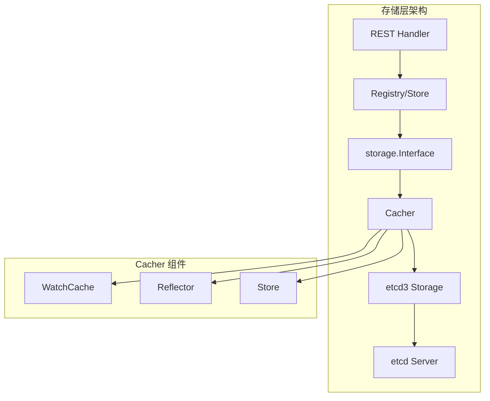
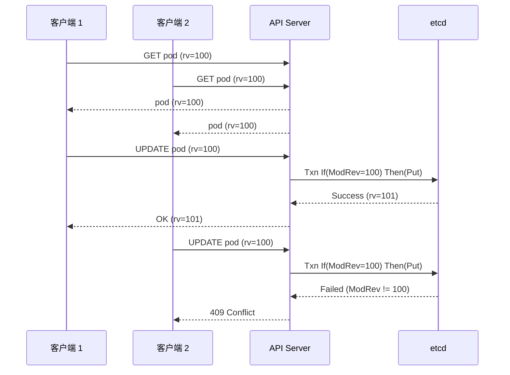
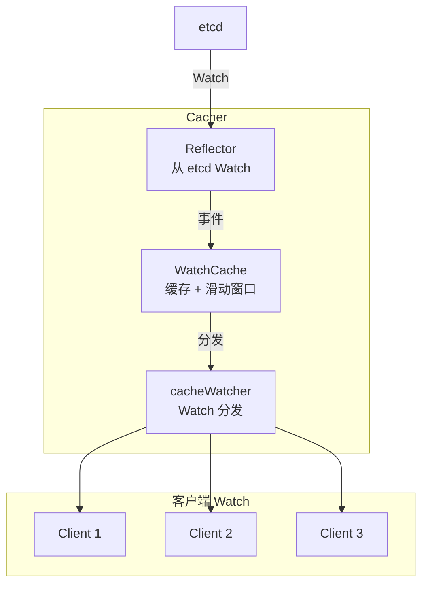
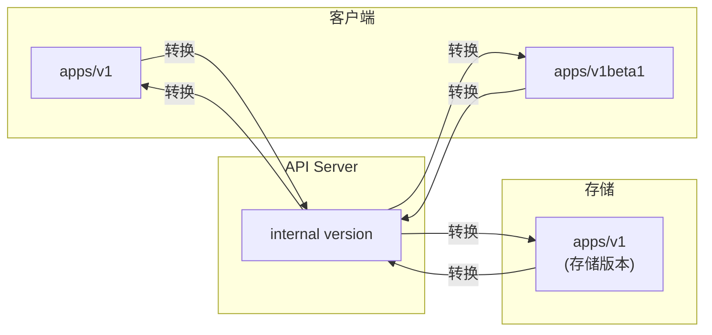

本文深入分析 API Server 的存储层实现，包括存储抽象、etcd3 存储、事务操作、Watch 缓存等核心机制。

## 1. 存储抽象

### 1.1 storage.Interface

```go
// staging/src/k8s.io/apiserver/pkg/storage/interfaces.go

// Interface 是存储后端的抽象接口
type Interface interface {
    // Versioner 返回版本管理器
    Versioner() Versioner

    // Create 创建资源
    Create(ctx context.Context, key string, obj, out runtime.Object, ttl uint64) error

    // Delete 删除资源
    Delete(ctx context.Context, key string, out runtime.Object, preconditions *Preconditions,
           validateDeletion ValidateObjectFunc, cachedExistingObject runtime.Object) error

    // Watch 监听资源变化
    Watch(ctx context.Context, key string, opts ListOptions) (watch.Interface, error)

    // Get 获取单个资源
    Get(ctx context.Context, key string, opts GetOptions, objPtr runtime.Object) error

    // GetList 获取资源列表
    GetList(ctx context.Context, key string, opts ListOptions, listObj runtime.Object) error

    // GuaranteedUpdate 保证更新（乐观锁）
    GuaranteedUpdate(ctx context.Context, key string, destination runtime.Object,
                     ignoreNotFound bool, preconditions *Preconditions,
                     tryUpdate UpdateFunc, cachedExistingObject runtime.Object) error

    // Count 统计资源数量
    Count(key string) (int64, error)
}

// Versioner 管理资源版本
type Versioner interface {
    // UpdateObject 更新对象的 ResourceVersion
    UpdateObject(obj runtime.Object, resourceVersion uint64) error

    // UpdateList 更新列表的 ResourceVersion
    UpdateList(obj runtime.Object, resourceVersion uint64, nextKey string, count *int64) error

    // PrepareObjectForStorage 准备对象用于存储
    PrepareObjectForStorage(obj runtime.Object) error

    // ObjectResourceVersion 获取对象的 ResourceVersion
    ObjectResourceVersion(obj runtime.Object) (uint64, error)

    // ParseResourceVersion 解析 ResourceVersion 字符串
    ParseResourceVersion(resourceVersion string) (uint64, error)
}
```

### 1.2 存储层架构



### 1.3 存储工厂

```go
// staging/src/k8s.io/apiserver/pkg/server/storage/storage_factory.go

// StorageFactory 创建存储后端
type StorageFactory interface {
    // NewConfig 返回指定资源的存储配置
    NewConfig(groupResource schema.GroupResource) (*storagebackend.ConfigForResource, error)

    // ResourcePrefix 返回资源的存储前缀
    ResourcePrefix(groupResource schema.GroupResource) string

    // Backends 返回所有后端
    Backends() []Backend
}

// DefaultStorageFactory 是默认的存储工厂
type DefaultStorageFactory struct {
    // StorageConfig 是通用存储配置
    StorageConfig storagebackend.Config

    // Overrides 是特定资源的配置覆盖
    Overrides map[schema.GroupResource]groupResourceOverrides

    // DefaultMediaType 是默认的媒体类型
    DefaultMediaType string

    // ResourceEncodingConfig 是资源编码配置
    ResourceEncodingConfig ResourceEncodingConfig
}
```

## 2. etcd3 存储实现

### 2.1 Store 结构

```go
// staging/src/k8s.io/apiserver/pkg/storage/etcd3/store.go

// store 实现 storage.Interface
type store struct {
    // client 是 etcd 客户端
    client *clientv3.Client

    // codec 是编解码器
    codec runtime.Codec

    // versioner 是版本管理器
    versioner storage.Versioner

    // transformer 是数据转换器（加密）
    transformer value.Transformer

    // pathPrefix 是存储路径前缀
    pathPrefix string

    // groupResource 是资源组
    groupResource schema.GroupResource

    // watcher 是 Watch 管理器
    watcher *watcher

    // pagingEnabled 是否启用分页
    pagingEnabled bool

    // leaseManager 管理 TTL
    leaseManager *leaseManager
}

// New 创建 etcd3 存储
func New(c *clientv3.Client, codec runtime.Codec, newFunc func() runtime.Object,
         prefix string, groupResource schema.GroupResource, transformer value.Transformer,
         pagingEnabled bool, leaseManagerConfig LeaseManagerConfig) storage.Interface {
    return newStore(c, codec, newFunc, prefix, groupResource, transformer, pagingEnabled, leaseManagerConfig)
}
```

### 2.2 Key 编码规则

```go
// etcd 键格式
// /registry/<resource>/<namespace>/<name>
// 或
// /registry/<resource>/<name> （集群范围资源）

// 示例:
// Pod:         /registry/pods/default/nginx
// Deployment:  /registry/deployments/kube-system/coredns
// Node:        /registry/minions/worker-1 （节点使用 minions）
// Namespace:   /registry/namespaces/default

// staging/src/k8s.io/apiserver/pkg/registry/generic/registry/store.go

// KeyRootFunc 返回资源的根键
func (e *Store) KeyRootFunc(ctx context.Context) string {
    prefix := "/" + e.ResourcePrefix
    ns, ok := request.NamespaceFrom(ctx)
    if ok && len(ns) > 0 {
        return prefix + "/" + ns
    }
    return prefix
}

// KeyFunc 返回资源的完整键
func (e *Store) KeyFunc(ctx context.Context, name string) (string, error) {
    return e.KeyRootFunc(ctx) + "/" + name, nil
}
```

### 2.3 Create 操作

```go
// staging/src/k8s.io/apiserver/pkg/storage/etcd3/store.go

// Create 创建资源
func (s *store) Create(ctx context.Context, key string, obj, out runtime.Object, ttl uint64) error {
    // 准备对象
    if err := s.versioner.PrepareObjectForStorage(obj); err != nil {
        return err
    }

    // 编码对象
    data, err := runtime.Encode(s.codec, obj)
    if err != nil {
        return err
    }

    // 转换数据（加密）
    data, err = s.transformer.TransformToStorage(ctx, data, authenticatedDataString(key))
    if err != nil {
        return err
    }

    // 获取租约（TTL）
    var opts []clientv3.OpOption
    if ttl != 0 {
        leaseID, err := s.leaseManager.GetLease(ctx, int64(ttl))
        if err != nil {
            return err
        }
        opts = append(opts, clientv3.WithLease(leaseID))
    }

    // 执行事务（仅当键不存在时创建）
    txnResp, err := s.client.KV.Txn(ctx).
        If(clientv3.Compare(clientv3.ModRevision(key), "=", 0)).
        Then(clientv3.OpPut(key, string(data), opts...)).
        Commit()

    if err != nil {
        return err
    }
    if !txnResp.Succeeded {
        return storage.NewKeyExistsError(key, 0)
    }

    // 解码返回对象
    if out != nil {
        putResp := txnResp.Responses[0].GetResponsePut()
        return decode(s.codec, s.versioner, data, out, putResp.Header.Revision)
    }
    return nil
}
```

### 2.4 Get 操作

```go
// staging/src/k8s.io/apiserver/pkg/storage/etcd3/store.go

// Get 获取单个资源
func (s *store) Get(ctx context.Context, key string, opts storage.GetOptions, out runtime.Object) error {
    // 执行 Get
    getResp, err := s.client.KV.Get(ctx, key)
    if err != nil {
        return err
    }

    if len(getResp.Kvs) == 0 {
        if opts.IgnoreNotFound {
            return runtime.SetZeroValue(out)
        }
        return storage.NewKeyNotFoundError(key, 0)
    }

    kv := getResp.Kvs[0]

    // 转换数据（解密）
    data, _, err := s.transformer.TransformFromStorage(ctx, kv.Value, authenticatedDataString(key))
    if err != nil {
        return err
    }

    // 解码
    return decode(s.codec, s.versioner, data, out, kv.ModRevision)
}
```

### 2.5 GuaranteedUpdate 操作

```go
// staging/src/k8s.io/apiserver/pkg/storage/etcd3/store.go

// GuaranteedUpdate 使用乐观锁更新
func (s *store) GuaranteedUpdate(ctx context.Context, key string, destination runtime.Object,
    ignoreNotFound bool, preconditions *storage.Preconditions,
    tryUpdate storage.UpdateFunc, cachedExistingObject runtime.Object) error {

    for {
        // 获取当前对象
        origState, err := s.getState(ctx, key, destination, ignoreNotFound)
        if err != nil {
            return err
        }

        // 检查前置条件
        if preconditions != nil {
            if err := preconditions.Check(key, origState.obj); err != nil {
                return err
            }
        }

        // 调用更新函数
        ret, ttl, err := tryUpdate(origState.obj, storage.ResponseMeta{
            ResourceVersion: origState.rev,
        })
        if err != nil {
            if err == storage.ErrNoUpdate {
                return nil
            }
            return err
        }

        // 准备对象
        if err := s.versioner.PrepareObjectForStorage(ret); err != nil {
            return err
        }

        // 编码
        data, err := runtime.Encode(s.codec, ret)
        if err != nil {
            return err
        }

        // 转换（加密）
        data, err = s.transformer.TransformToStorage(ctx, data, authenticatedDataString(key))
        if err != nil {
            return err
        }

        // 执行条件更新
        txnResp, err := s.client.KV.Txn(ctx).
            If(clientv3.Compare(clientv3.ModRevision(key), "=", origState.rev)).
            Then(clientv3.OpPut(key, string(data), opts...)).
            Commit()

        if err != nil {
            return err
        }

        if txnResp.Succeeded {
            // 更新成功
            putResp := txnResp.Responses[0].GetResponsePut()
            return decode(s.codec, s.versioner, data, destination, putResp.Header.Revision)
        }

        // 版本冲突，重试
    }
}
```

## 3. 事务操作

### 3.1 乐观锁



### 3.2 Preconditions

```go
// staging/src/k8s.io/apiserver/pkg/storage/interfaces.go

// Preconditions 是更新前置条件
type Preconditions struct {
    // UID 如果设置，必须匹配
    UID *types.UID

    // ResourceVersion 如果设置，必须匹配
    ResourceVersion *string
}

// Check 检查前置条件
func (p *Preconditions) Check(key string, obj runtime.Object) error {
    if p == nil {
        return nil
    }

    objMeta, err := meta.Accessor(obj)
    if err != nil {
        return err
    }

    if p.UID != nil && *p.UID != objMeta.GetUID() {
        return storage.NewInvalidObjError(key, fmt.Sprintf(
            "Precondition failed: UID in precondition: %v, UID in object meta: %v",
            *p.UID, objMeta.GetUID()))
    }

    if p.ResourceVersion != nil && *p.ResourceVersion != objMeta.GetResourceVersion() {
        return storage.NewInvalidObjError(key, fmt.Sprintf(
            "Precondition failed: ResourceVersion in precondition: %v, ResourceVersion in object meta: %v",
            *p.ResourceVersion, objMeta.GetResourceVersion()))
    }

    return nil
}
```

## 4. Watch 实现

### 4.1 Watcher 结构

```go
// staging/src/k8s.io/apiserver/pkg/storage/etcd3/watcher.go

// watcher 实现 Watch 功能
type watcher struct {
    client *clientv3.Client
    codec  runtime.Codec
    versioner storage.Versioner
    transformer value.Transformer
}

// Watch 创建 Watch
func (w *watcher) Watch(ctx context.Context, key string, rev int64, pred storage.SelectionPredicate) (watch.Interface, error) {
    return w.watch(ctx, key, rev, pred, false)
}

func (w *watcher) watch(ctx context.Context, key string, rev int64, pred storage.SelectionPredicate, recursive bool) (watch.Interface, error) {
    // 创建 watchChan
    wc := &watchChan{
        watcher:     w,
        key:         key,
        initialRev:  rev,
        recursive:   recursive,
        pred:        pred,
        incomingEventChan: make(chan *event, 100),
        resultChan:        make(chan watch.Event, 100),
        errChan:           make(chan error, 1),
    }

    // 启动处理协程
    go wc.run(ctx)

    return wc, nil
}
```

### 4.2 事件处理

```go
// staging/src/k8s.io/apiserver/pkg/storage/etcd3/watcher.go

// run 运行 Watch 循环
func (wc *watchChan) run(ctx context.Context) {
    defer close(wc.resultChan)

    // 创建 etcd Watch
    opts := []clientv3.OpOption{
        clientv3.WithRev(wc.initialRev + 1),
        clientv3.WithPrevKV(),
    }
    if wc.recursive {
        opts = append(opts, clientv3.WithPrefix())
    }

    watchChan := wc.watcher.client.Watch(ctx, wc.key, opts...)

    // 处理事件
    for {
        select {
        case watchResp, ok := <-watchChan:
            if !ok {
                return
            }
            if err := watchResp.Err(); err != nil {
                wc.errChan <- err
                return
            }
            for _, e := range watchResp.Events {
                wc.processEvent(e)
            }

        case <-ctx.Done():
            return
        }
    }
}

// processEvent 处理单个事件
func (wc *watchChan) processEvent(e *clientv3.Event) {
    var event watch.Event

    // 确定事件类型
    switch e.Type {
    case clientv3.EventTypePut:
        if e.IsCreate() {
            event.Type = watch.Added
        } else {
            event.Type = watch.Modified
        }
    case clientv3.EventTypeDelete:
        event.Type = watch.Deleted
    }

    // 解码对象
    obj, err := wc.decodeEvent(e)
    if err != nil {
        wc.sendError(err)
        return
    }

    // 过滤
    if !wc.pred.Matches(obj) {
        return
    }

    event.Object = obj
    wc.resultChan <- event
}
```

## 5. Cacher

### 5.1 Cacher 架构



### 5.2 WatchCache

```go
// staging/src/k8s.io/apiserver/pkg/storage/cacher/watch_cache.go

// watchCache 缓存对象和事件
type watchCache struct {
    // store 是对象存储
    store cache.Store

    // cache 是事件滑动窗口
    cache      []*watchCacheEvent
    startIndex int
    endIndex   int

    // resourceVersion 是当前版本
    resourceVersion uint64

    // eventHandler 处理事件
    eventHandler func(*watchCacheEvent)

    // clock 用于时间
    clock clock.Clock

    // capacity 是窗口容量
    capacity int
}

// Add 添加事件
func (w *watchCache) Add(obj interface{}) error {
    event := &watchCacheEvent{
        Type:            watch.Added,
        Object:          obj.(runtime.Object),
        ResourceVersion: w.resourceVersion + 1,
    }

    w.updateCache(event)
    w.resourceVersion++

    if w.eventHandler != nil {
        w.eventHandler(event)
    }

    return w.store.Add(obj)
}
```

### 5.3 Cacher 实现

```go
// staging/src/k8s.io/apiserver/pkg/storage/cacher/cacher.go

// Cacher 是带缓存的存储
type Cacher struct {
    // storage 是底层存储
    storage storage.Interface

    // watchCache 是 Watch 缓存
    watchCache *watchCache

    // reflector 从 etcd 同步数据
    reflector *cache.Reflector

    // watchers 是活跃的 Watch
    watchers indexedWatchers

    // incoming 是新事件通道
    incoming chan watchCacheEvent

    // resourceVersion 是当前版本
    resourceVersion uint64
}

// Watch 创建带缓存的 Watch
func (c *Cacher) Watch(ctx context.Context, key string, opts storage.ListOptions) (watch.Interface, error) {
    // 检查 resourceVersion
    requestedWatchRV, err := c.versioner.ParseResourceVersion(opts.ResourceVersion)
    if err != nil {
        return nil, err
    }

    // 创建 cacheWatcher
    watcher := newCacheWatcher(
        opts.ResourceVersion,
        filterFunction(key, opts.Predicate),
        forgetWatcher(c, c.watcherIdx),
        c.versioner,
    )

    // 注册 watcher
    c.watcherIdx++
    c.watchers.addWatcher(watcher, c.watcherIdx, key)

    // 初始化事件
    go c.dispatchInitialEventsToWatcher(watcher, requestedWatchRV)

    return watcher, nil
}

// dispatchEvent 分发事件到所有 watcher
func (c *Cacher) dispatchEvent(event *watchCacheEvent) {
    c.watchers.Lock()
    defer c.watchers.Unlock()

    for _, watcher := range c.watchers.allWatchers {
        watcher.add(event, c.timer)
    }
}
```

## 6. 分页与过滤

### 6.1 分页查询

```go
// staging/src/k8s.io/apiserver/pkg/storage/etcd3/store.go

// GetList 获取列表（支持分页）
func (s *store) GetList(ctx context.Context, key string, opts storage.ListOptions, listObj runtime.Object) error {
    // 构建 etcd 查询选项
    options := []clientv3.OpOption{
        clientv3.WithPrefix(),
        clientv3.WithLimit(opts.Limit),
    }

    // 处理 Continue Token
    if len(opts.Continue) > 0 {
        continueKey, err := decodeContinue(opts.Continue, key)
        if err != nil {
            return err
        }
        options = append(options, clientv3.WithRange(clientv3.GetPrefixRangeEnd(continueKey)))
    }

    // 执行查询
    getResp, err := s.client.KV.Get(ctx, key, options...)
    if err != nil {
        return err
    }

    // 解码结果
    items := make([]runtime.Object, 0, len(getResp.Kvs))
    for _, kv := range getResp.Kvs {
        data, _, err := s.transformer.TransformFromStorage(ctx, kv.Value, authenticatedDataString(string(kv.Key)))
        if err != nil {
            return err
        }

        obj, err := runtime.Decode(s.codec, data)
        if err != nil {
            return err
        }

        // 应用谓词过滤
        if opts.Predicate.Matches(obj) {
            items = append(items, obj)
        }
    }

    // 设置 Continue Token
    if getResp.More {
        lastKey := string(getResp.Kvs[len(getResp.Kvs)-1].Key)
        continueToken := encodeContinue(lastKey, key, getResp.Header.Revision)
        // 设置到 listObj...
    }

    return meta.SetList(listObj, items)
}
```

### 6.2 字段选择器

```go
// staging/src/k8s.io/apiserver/pkg/storage/selection_predicate.go

// SelectionPredicate 是选择谓词
type SelectionPredicate struct {
    // Label 是标签选择器
    Label labels.Selector

    // Field 是字段选择器
    Field fields.Selector

    // Limit 是返回的最大数量
    Limit int64

    // Continue 是分页 token
    Continue string

    // GetAttrs 获取对象的属性用于匹配
    GetAttrs AttrFunc
}

// Matches 检查对象是否匹配
func (s *SelectionPredicate) Matches(obj runtime.Object) bool {
    if s.Empty() {
        return true
    }

    labels, fields, err := s.GetAttrs(obj)
    if err != nil {
        return false
    }

    return s.Label.Matches(labels) && s.Field.Matches(fields)
}
```

## 7. 存储版本转换

### 7.1 版本转换流程



### 7.2 编解码配置

```go
// staging/src/k8s.io/apiserver/pkg/server/storage/storage_factory.go

// ResourceEncodingConfig 配置资源的存储版本
type ResourceEncodingConfig interface {
    // StorageEncodingFor 返回资源的存储版本
    StorageEncodingFor(schema.GroupResource) (schema.GroupVersion, error)

    // InMemoryEncodingFor 返回资源的内存版本
    InMemoryEncodingFor(schema.GroupResource) (schema.GroupVersion, error)
}

// DefaultResourceEncodingConfig 是默认配置
type DefaultResourceEncodingConfig struct {
    scheme  *runtime.Scheme
    storage map[schema.GroupResource]schema.GroupVersion
}
```

## 小结

本文详细分析了 API Server 的存储层实现：

1. **存储抽象**：storage.Interface 接口、存储工厂
2. **etcd3 存储**：键编码规则、CRUD 操作实现
3. **事务操作**：乐观锁、Preconditions
4. **Watch 实现**：Watcher、事件处理
5. **Cacher**：WatchCache、事件分发、多路复用
6. **分页与过滤**：Continue Token、字段选择器
7. **版本转换**：内部版本、存储版本

存储层是 API Server 的核心组件，下一篇将详细介绍 Watch 机制。
