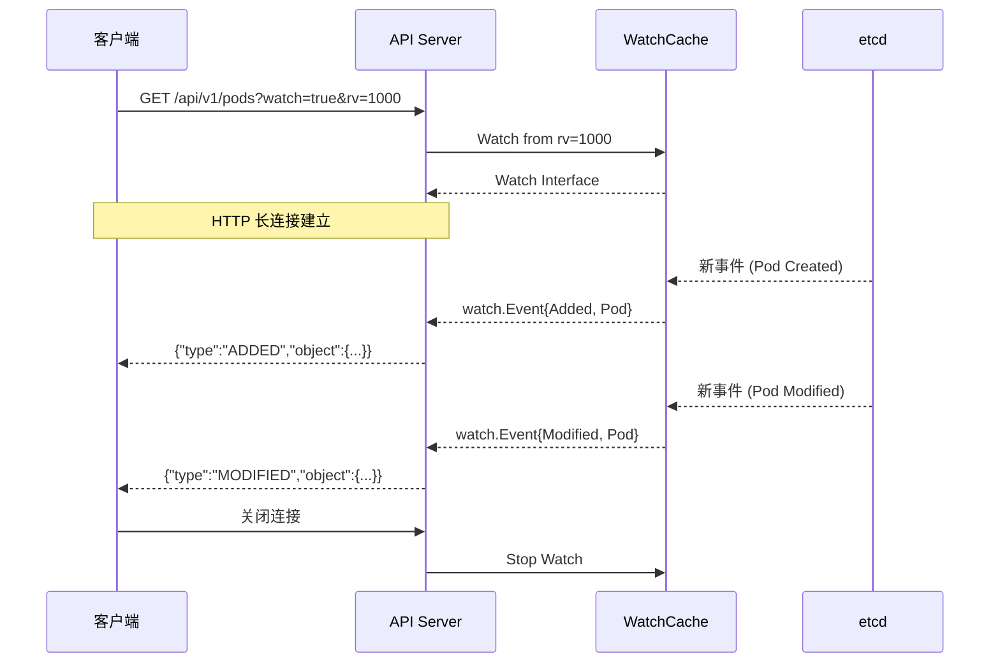
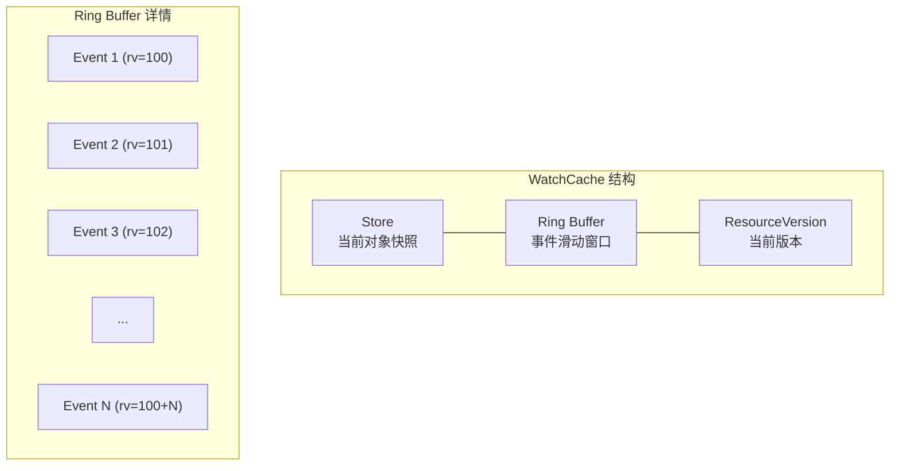
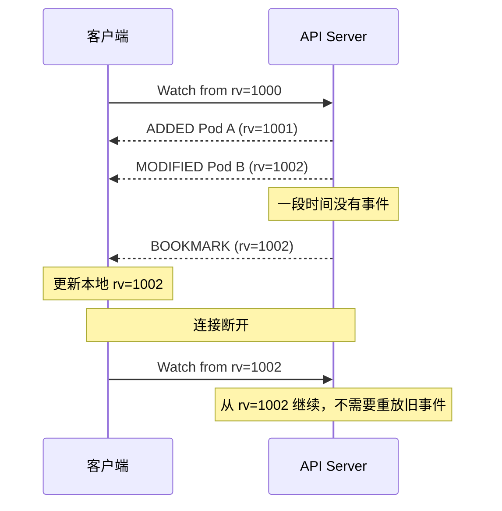

本文深入分析 API Server 的 Watch 机制，包括 Watch 原理、WatchCache、Bookmark 事件以及性能优化等。

## 1. Watch 原理

### 1.1 Watch 概述

Watch 是 Kubernetes 实现事件驱动的核心机制，允许客户端实时监听资源变化：



### 1.2 ResourceVersion 语义

ResourceVersion (RV) 是 Kubernetes 实现 Watch 的关键：

| RV 值 | List 行为 | Watch 行为 |
|------|----------|-----------|
| 未设置 | 从 etcd 读取最新数据 | 从最新版本开始 Watch |
| "0" | 从缓存读取，可能过期 | 从缓存中任意版本开始 |
| 具体值 | 从该版本读取（可能 410 Gone） | 从该版本之后开始 Watch |

### 1.3 事件类型

```go
// staging/src/k8s.io/apimachinery/pkg/watch/watch.go

// EventType 定义 Watch 事件类型
type EventType string

const (
    Added    EventType = "ADDED"     // 资源被创建
    Modified EventType = "MODIFIED"  // 资源被修改
    Deleted  EventType = "DELETED"   // 资源被删除
    Bookmark EventType = "BOOKMARK"  // 进度标记
    Error    EventType = "ERROR"     // 错误事件
)

// Event 是 Watch 返回的事件
type Event struct {
    Type EventType

    // Object 是变化的对象
    // 对于 Added/Modified/Deleted: 是完整对象
    // 对于 Bookmark: 是只有 ResourceVersion 的对象
    // 对于 Error: 是 Status 对象
    Object runtime.Object
}
```

## 2. WatchCache

### 2.1 WatchCache 结构



```go
// staging/src/k8s.io/apiserver/pkg/storage/cacher/watch_cache.go

// watchCache 缓存对象和事件历史
type watchCache struct {
    sync.RWMutex

    // store 存储当前所有对象
    store cache.Store

    // cache 是事件环形缓冲区
    cache      []*watchCacheEvent
    startIndex int
    endIndex   int
    capacity   int

    // resourceVersion 是缓存中的最新版本
    resourceVersion uint64

    // eventHandler 处理新事件
    eventHandler func(*watchCacheEvent)

    // onReplace 在完全替换时调用
    onReplace func()

    // onEvent 在每个事件时调用
    onEvent func(*watchCacheEvent)
}

// watchCacheEvent 是缓存的事件
type watchCacheEvent struct {
    Type             watch.EventType
    Object           runtime.Object
    PrevObject       runtime.Object
    Key              string
    ResourceVersion  uint64
    RecordTime       time.Time
}
```

### 2.2 事件入队

```go
// staging/src/k8s.io/apiserver/pkg/storage/cacher/watch_cache.go

// processEvent 处理来自 Reflector 的事件
func (w *watchCache) processEvent(event watch.Event) error {
    w.Lock()
    defer w.Unlock()

    obj := event.Object.(runtime.Object)
    key, err := w.keyFunc(obj)
    if err != nil {
        return err
    }

    // 获取 ResourceVersion
    rv, err := w.versioner.ObjectResourceVersion(obj)
    if err != nil {
        return err
    }

    // 创建缓存事件
    watchCacheEvent := &watchCacheEvent{
        Type:            event.Type,
        Object:          obj,
        ResourceVersion: rv,
        RecordTime:      w.clock.Now(),
        Key:             key,
    }

    // 获取旧对象
    if event.Type == watch.Modified || event.Type == watch.Deleted {
        if old, exists, _ := w.store.Get(obj); exists {
            watchCacheEvent.PrevObject = old.(runtime.Object)
        }
    }

    // 更新环形缓冲区
    w.updateCache(watchCacheEvent)

    // 更新 Store
    switch event.Type {
    case watch.Added:
        w.store.Add(obj)
    case watch.Modified:
        w.store.Update(obj)
    case watch.Deleted:
        w.store.Delete(obj)
    }

    // 更新版本
    w.resourceVersion = rv

    // 触发事件处理器
    if w.eventHandler != nil {
        w.eventHandler(watchCacheEvent)
    }

    return nil
}

// updateCache 更新环形缓冲区
func (w *watchCache) updateCache(event *watchCacheEvent) {
    if w.endIndex == w.startIndex+w.capacity {
        // 缓冲区满，移除最旧的
        w.startIndex++
    }
    w.cache[w.endIndex%w.capacity] = event
    w.endIndex++
}
```

### 2.3 从缓存开始 Watch

```go
// staging/src/k8s.io/apiserver/pkg/storage/cacher/watch_cache.go

// GetAllEventsSince 获取指定版本以来的所有事件
func (w *watchCache) GetAllEventsSince(resourceVersion uint64) ([]*watchCacheEvent, error) {
    w.RLock()
    defer w.RUnlock()

    // 检查版本是否在缓存范围内
    oldest := w.cache[w.startIndex%w.capacity]
    if oldest == nil || resourceVersion < oldest.ResourceVersion-1 {
        // 版本太旧，不在缓存中
        return nil, errors.NewResourceExpired(fmt.Sprintf(
            "too old resource version: %d (%d)", resourceVersion, oldest.ResourceVersion))
    }

    // 收集事件
    var events []*watchCacheEvent
    for i := w.startIndex; i < w.endIndex; i++ {
        event := w.cache[i%w.capacity]
        if event.ResourceVersion > resourceVersion {
            events = append(events, event)
        }
    }

    return events, nil
}
```

## 3. Cacher 分发

### 3.1 cacheWatcher

```go
// staging/src/k8s.io/apiserver/pkg/storage/cacher/cacher.go

// cacheWatcher 是单个 Watch 客户端
type cacheWatcher struct {
    // input 是事件输入通道
    input chan *watchCacheEvent

    // result 是结果输出通道
    result chan watch.Event

    // done 是关闭信号
    done chan struct{}

    // filter 是事件过滤器
    filter filterWithAttrsFunc

    // stopped 标记是否已停止
    stopped bool

    // forget 是停止时的回调
    forget func()

    // versioner 管理版本
    versioner storage.Versioner
}

// ResultChan 返回事件通道
func (c *cacheWatcher) ResultChan() <-chan watch.Event {
    return c.result
}

// Stop 停止 Watch
func (c *cacheWatcher) Stop() {
    c.forget()
    close(c.done)
}

// process 处理事件
func (c *cacheWatcher) process(ctx context.Context, initEvents []*watchCacheEvent, resourceVersion uint64) {
    defer close(c.result)

    // 发送初始事件
    for _, event := range initEvents {
        if !c.sendWatchCacheEvent(event) {
            return
        }
    }

    // 处理后续事件
    for {
        select {
        case event, ok := <-c.input:
            if !ok {
                return
            }
            if !c.sendWatchCacheEvent(event) {
                return
            }
        case <-ctx.Done():
            return
        case <-c.done:
            return
        }
    }
}

// sendWatchCacheEvent 发送事件
func (c *cacheWatcher) sendWatchCacheEvent(event *watchCacheEvent) bool {
    // 应用过滤器
    if !c.filter(event.Key, event.Object, event.PrevObject) {
        return true
    }

    // 转换为 watch.Event
    watchEvent := watch.Event{
        Type:   event.Type,
        Object: event.Object,
    }

    select {
    case c.result <- watchEvent:
        return true
    case <-c.done:
        return false
    }
}
```

### 3.2 事件分发

```go
// staging/src/k8s.io/apiserver/pkg/storage/cacher/cacher.go

// dispatchEvents 分发事件到所有 watcher
func (c *Cacher) dispatchEvents() {
    for {
        select {
        case event, ok := <-c.incoming:
            if !ok {
                return
            }
            c.dispatchEvent(&event)
        case <-c.stopCh:
            return
        }
    }
}

// dispatchEvent 分发单个事件
func (c *Cacher) dispatchEvent(event *watchCacheEvent) {
    c.Lock()
    defer c.Unlock()

    // 分发到所有匹配的 watcher
    for _, watcher := range c.watchers.allWatchers {
        watcher.add(event)
    }

    // 分发到按 key 索引的 watcher
    for _, watcher := range c.watchers.valueWatchers[event.Key] {
        watcher.add(event)
    }
}
```

## 4. Bookmark 事件

### 4.1 Bookmark 概述

Bookmark 事件用于：
- 通知客户端当前的 ResourceVersion
- 允许客户端更新本地 ResourceVersion 而不丢失事件
- 在 Watch 重连时减少需要回放的事件



### 4.2 Bookmark 实现

```go
// staging/src/k8s.io/apiserver/pkg/storage/cacher/cacher.go

// startDispatchingBookmarkEvents 启动 Bookmark 分发
func (c *Cacher) startDispatchingBookmarkEvents(ctx context.Context) {
    // Bookmark 间隔
    bookmarkFrequency := time.Minute

    go func() {
        ticker := time.NewTicker(bookmarkFrequency)
        defer ticker.Stop()

        for {
            select {
            case <-ticker.C:
                c.dispatchBookmarkEvents()
            case <-ctx.Done():
                return
            case <-c.stopCh:
                return
            }
        }
    }()
}

// dispatchBookmarkEvents 分发 Bookmark 事件
func (c *Cacher) dispatchBookmarkEvents() {
    c.Lock()
    defer c.Unlock()

    // 获取当前版本
    rv := c.watchCache.resourceVersion

    // 创建 Bookmark 事件
    bookmarkEvent := &watchCacheEvent{
        Type:            watch.Bookmark,
        ResourceVersion: rv,
        Object:          c.newFunc(),
    }

    // 设置 ResourceVersion
    c.versioner.UpdateObject(bookmarkEvent.Object, rv)

    // 分发到所有支持 Bookmark 的 watcher
    for _, watcher := range c.watchers.allWatchers {
        if watcher.allowWatchBookmarks {
            watcher.add(bookmarkEvent)
        }
    }
}
```

### 4.3 客户端处理

```go
// 客户端处理 Bookmark
func handleWatch(watcher watch.Interface) {
    for event := range watcher.ResultChan() {
        switch event.Type {
        case watch.Added, watch.Modified, watch.Deleted:
            // 处理资源事件
            handleResourceEvent(event)
        case watch.Bookmark:
            // 更新本地 ResourceVersion
            obj := event.Object
            rv, _ := meta.NewAccessor().ResourceVersion(obj)
            updateLocalResourceVersion(rv)
        case watch.Error:
            // 处理错误
            handleError(event)
        }
    }
}
```

## 5. Watch 客户端

### 5.1 Retry 策略

```go
// staging/src/k8s.io/client-go/tools/cache/reflector.go

// watchHandler 处理 Watch 响应
func (r *Reflector) watchHandler(start time.Time, w watch.Interface, resourceVersion *string, ...) error {
    // 处理事件
    for {
        select {
        case event, ok := <-w.ResultChan():
            if !ok {
                // Watch 关闭
                return nil
            }

            switch event.Type {
            case watch.Added:
                err := r.store.Add(event.Object)
            case watch.Modified:
                err := r.store.Update(event.Object)
            case watch.Deleted:
                err := r.store.Delete(event.Object)
            case watch.Bookmark:
                // 更新 ResourceVersion
            case watch.Error:
                return apierrors.FromObject(event.Object)
            }

            // 更新 ResourceVersion
            *resourceVersion = newResourceVersion
        case <-stopCh:
            return errorStopRequested
        }
    }
}

// ListAndWatch 主循环
func (r *Reflector) ListAndWatch(stopCh <-chan struct{}) error {
    // 初始 List
    if err := r.list(stopCh); err != nil {
        return err
    }

    for {
        // 创建 Watch
        w, err := r.listerWatcher.Watch(options)
        if err != nil {
            // 等待后重试
            time.Sleep(time.Second)
            continue
        }

        // 处理 Watch
        if err := r.watchHandler(start, w, &resourceVersion, ...); err != nil {
            if err == errorStopRequested {
                return nil
            }
            // 等待后重试
            time.Sleep(time.Second)
            continue
        }
    }
}
```

### 5.2 ResourceVersion 处理

```go
// 处理不同的 ResourceVersion 错误
func handleWatchError(err error) (shouldRetry bool, delay time.Duration) {
    switch {
    case apierrors.IsResourceExpired(err):
        // 410 Gone: ResourceVersion 太旧
        // 重新 List 获取最新数据
        return true, 0

    case apierrors.IsTooManyRequests(err):
        // 429 Too Many Requests: 限流
        // 使用退避延迟
        return true, getRetryAfterSeconds(err)

    case apierrors.IsInternalError(err):
        // 500 Internal Error: 服务器错误
        // 使用退避延迟
        return true, time.Second

    default:
        // 其他错误，使用默认退避
        return true, time.Second
    }
}
```

## 6. 性能考量

### 6.1 连接数限制

```go
// staging/src/k8s.io/apiserver/pkg/storage/cacher/cacher.go

// 限制同时 Watch 的数量
const (
    // 每个资源类型的最大 Watch 数
    defaultMaxWatchers = 100000
)

// registerWatcher 注册新的 watcher
func (c *Cacher) registerWatcher(w *cacheWatcher) error {
    c.Lock()
    defer c.Unlock()

    if len(c.watchers.allWatchers) >= defaultMaxWatchers {
        return fmt.Errorf("too many watchers")
    }

    c.watchers.addWatcher(w)
    return nil
}
```

### 6.2 事件缓冲

```go
// 事件通道缓冲配置
const (
    // 输入通道缓冲大小
    incomingBufSize = 1000

    // 输出通道缓冲大小
    outgoingBufSize = 1000
)

// cacheWatcher 使用缓冲通道
type cacheWatcher struct {
    input  chan *watchCacheEvent // 缓冲输入
    result chan watch.Event      // 缓冲输出
}
```

### 6.3 压缩传输

```go
// Watch 响应使用 chunked 编码
// 支持 gzip 压缩

func ServeWatch(w http.ResponseWriter, req *http.Request, ...) {
    // 设置响应头
    w.Header().Set("Content-Type", mediaType)
    w.Header().Set("Transfer-Encoding", "chunked")

    // 检查是否支持压缩
    if strings.Contains(req.Header.Get("Accept-Encoding"), "gzip") {
        w.Header().Set("Content-Encoding", "gzip")
        gw := gzip.NewWriter(w)
        defer gw.Close()
        // 使用 gzip writer
    }

    // 发送事件
    flusher := w.(http.Flusher)
    for event := range watcher.ResultChan() {
        if err := encoder.Encode(event, w); err != nil {
            return
        }
        flusher.Flush()
    }
}
```

### 6.4 监控指标

```go
// Watch 相关指标
var (
    watchCacheCapacity = prometheus.NewGaugeVec(
        prometheus.GaugeOpts{
            Name: "apiserver_watch_cache_capacity",
            Help: "Capacity of watch cache by resource type.",
        },
        []string{"resource"},
    )

    watchCacheSize = prometheus.NewGaugeVec(
        prometheus.GaugeOpts{
            Name: "apiserver_watch_cache_events_dispatched_total",
            Help: "Total number of events dispatched.",
        },
        []string{"resource"},
    )

    watcherCount = prometheus.NewGaugeVec(
        prometheus.GaugeOpts{
            Name: "apiserver_watchers_count",
            Help: "Number of active watchers by resource.",
        },
        []string{"resource"},
    )
)
```

## 7. 常见问题

### 7.1 410 Gone

```
Error from server: Watch error: resourceVersion "xxx" too old
```

原因：请求的 ResourceVersion 已不在 WatchCache 中

解决：重新 List 获取最新数据，然后从新的 RV 开始 Watch

### 7.2 Watch 断开重连

```go
// 最佳实践：使用 SharedInformer
informer := cache.NewSharedIndexInformer(
    &cache.ListWatch{
        ListFunc: func(options metav1.ListOptions) (runtime.Object, error) {
            return client.CoreV1().Pods(namespace).List(ctx, options)
        },
        WatchFunc: func(options metav1.ListOptions) (watch.Interface, error) {
            return client.CoreV1().Pods(namespace).Watch(ctx, options)
        },
    },
    &v1.Pod{},
    resyncPeriod,
    cache.Indexers{},
)

// SharedInformer 自动处理重连和 ResourceVersion
```

## 小结

本文详细分析了 API Server 的 Watch 机制：

1. **Watch 原理**：长连接、ResourceVersion 语义、事件类型
2. **WatchCache**：环形缓冲区、事件存储、版本管理
3. **Cacher 分发**：cacheWatcher、事件过滤、多路复用
4. **Bookmark 事件**：进度通知、减少重放
5. **客户端处理**：Retry 策略、ResourceVersion 处理
6. **性能优化**：连接限制、缓冲、压缩

Watch 机制是 Kubernetes 事件驱动架构的基础，下一篇将介绍 API 聚合。
