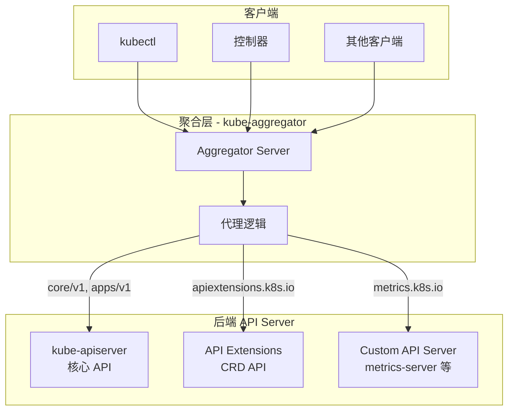

本文深入分析 API Server 的聚合层，包括 APIService 注册、CRD 机制、扩展 API Server 以及服务发现。

## 1. 聚合层架构

### 1.1 架构概览



### 1.2 服务器链

```go
// cmd/kube-apiserver/app/server.go

// CreateServerChain 创建 API Server 链
func CreateServerChain(completedOptions completedServerRunOptions, stopCh <-chan struct{}) (*aggregatorapiserver.APIAggregator, error) {
    // 1. 创建 API Extensions Server (处理 CRD)
    apiExtensionsServer, err := createAPIExtensionsServer(apiExtensionsConfig, genericapiserver.NewEmptyDelegate())
    if err != nil {
        return nil, err
    }

    // 2. 创建 kube-apiserver (核心 API)
    kubeAPIServer, err := CreateKubeAPIServer(kubeAPIServerConfig, apiExtensionsServer.GenericAPIServer)
    if err != nil {
        return nil, err
    }

    // 3. 创建聚合服务器 (入口)
    aggregatorServer, err := createAggregatorServer(aggregatorConfig, kubeAPIServer.GenericAPIServer, apiExtensionsServer.Informers)
    if err != nil {
        return nil, err
    }

    return aggregatorServer, nil
}
```

### 1.3 请求路由

```go
// staging/src/k8s.io/kube-aggregator/pkg/apiserver/handler_proxy.go

// proxyHandler 代理请求到后端 API Server
type proxyHandler struct {
    // localDelegate 是本地处理器
    localDelegate http.Handler

    // serviceResolver 解析服务地址
    serviceResolver ServiceResolver

    // proxyTransport 是代理传输
    proxyTransport http.RoundTripper
}

// ServeHTTP 处理请求
func (r *proxyHandler) ServeHTTP(w http.ResponseWriter, req *http.Request) {
    // 获取 APIService
    apiService, err := r.getAPIServiceFromRequest(req)
    if err != nil {
        r.localDelegate.ServeHTTP(w, req)
        return
    }

    // 检查是否是本地服务
    if apiService.Spec.Service == nil {
        r.localDelegate.ServeHTTP(w, req)
        return
    }

    // 代理到外部服务
    r.proxyToService(w, req, apiService)
}

// proxyToService 代理请求到服务
func (r *proxyHandler) proxyToService(w http.ResponseWriter, req *http.Request, apiService *apiregistration.APIService) {
    // 解析服务地址
    serviceURL, err := r.serviceResolver.ResolveEndpoint(
        apiService.Spec.Service.Namespace,
        apiService.Spec.Service.Name,
        apiService.Spec.Service.Port,
    )
    if err != nil {
        http.Error(w, err.Error(), http.StatusServiceUnavailable)
        return
    }

    // 创建代理
    proxy := httputil.NewSingleHostReverseProxy(serviceURL)
    proxy.Transport = r.proxyTransport
    proxy.FlushInterval = -1

    // 执行代理
    proxy.ServeHTTP(w, req)
}
```

## 2. APIService 注册

### 2.1 APIService 资源

```go
// staging/src/k8s.io/kube-aggregator/pkg/apis/apiregistration/v1/types.go

// APIService 表示一个 API 服务
type APIService struct {
    metav1.TypeMeta   `json:",inline"`
    metav1.ObjectMeta `json:"metadata,omitempty"`

    Spec   APIServiceSpec   `json:"spec,omitempty"`
    Status APIServiceStatus `json:"status,omitempty"`
}

// APIServiceSpec 定义 APIService 的规格
type APIServiceSpec struct {
    // Service 是提供此 API 的服务
    // nil 表示由 kube-apiserver 本地处理
    Service *ServiceReference `json:"service,omitempty"`

    // Group 是 API 组名
    Group string `json:"group,omitempty"`

    // Version 是 API 版本
    Version string `json:"version,omitempty"`

    // InsecureSkipTLSVerify 是否跳过 TLS 验证
    InsecureSkipTLSVerify bool `json:"insecureSkipTLSVerify,omitempty"`

    // CABundle 是用于验证服务证书的 CA 证书
    CABundle []byte `json:"caBundle,omitempty"`

    // GroupPriorityMinimum 是组优先级
    GroupPriorityMinimum int32 `json:"groupPriorityMinimum"`

    // VersionPriority 是版本优先级
    VersionPriority int32 `json:"versionPriority"`
}

// APIServiceStatus 是 APIService 的状态
type APIServiceStatus struct {
    // Conditions 是当前状态
    Conditions []APIServiceCondition `json:"conditions,omitempty"`
}
```

### 2.2 APIService 示例

```yaml
# metrics-server APIService
apiVersion: apiregistration.k8s.io/v1
kind: APIService
metadata:
  name: v1beta1.metrics.k8s.io
spec:
  service:
    name: metrics-server
    namespace: kube-system
    port: 443
  group: metrics.k8s.io
  version: v1beta1
  insecureSkipTLSVerify: true
  groupPriorityMinimum: 100
  versionPriority: 100

---
# 本地处理的 APIService (kube-apiserver)
apiVersion: apiregistration.k8s.io/v1
kind: APIService
metadata:
  name: v1.apps
spec:
  group: apps
  version: v1
  groupPriorityMinimum: 17800
  versionPriority: 15
  # service 为空表示本地处理
```

### 2.3 可用性检查

```go
// staging/src/k8s.io/kube-aggregator/pkg/controllers/status/available_controller.go

// AvailableConditionController 检查 APIService 可用性
type AvailableConditionController struct {
    apiServiceClient apiregistrationclient.APIServicesGetter
    apiServiceLister listers.APIServiceLister
    serviceClient    v1listers.ServiceLister
    endpointsLister  v1listers.EndpointsLister
}

// sync 同步单个 APIService 的状态
func (c *AvailableConditionController) sync(key string) error {
    apiService, err := c.apiServiceLister.Get(key)
    if err != nil {
        return err
    }

    // 检查可用性
    availableCondition := c.checkAvailability(apiService)

    // 更新状态
    apiService = apiService.DeepCopy()
    apiServiceStatus := apiregistration.APIServiceStatus{
        Conditions: []apiregistration.APIServiceCondition{availableCondition},
    }
    _, err = c.apiServiceClient.APIServices().UpdateStatus(context.TODO(), apiService, metav1.UpdateOptions{})
    return err
}

// checkAvailability 检查 APIService 是否可用
func (c *AvailableConditionController) checkAvailability(apiService *apiregistration.APIService) apiregistration.APIServiceCondition {
    // 本地服务总是可用
    if apiService.Spec.Service == nil {
        return apiregistration.APIServiceCondition{
            Type:    apiregistration.Available,
            Status:  apiregistration.ConditionTrue,
            Reason:  "Local",
            Message: "Local APIServices are always available",
        }
    }

    // 检查 Service 是否存在
    service, err := c.serviceClient.Services(apiService.Spec.Service.Namespace).Get(apiService.Spec.Service.Name)
    if err != nil {
        return apiregistration.APIServiceCondition{
            Type:    apiregistration.Available,
            Status:  apiregistration.ConditionFalse,
            Reason:  "ServiceNotFound",
            Message: fmt.Sprintf("service/%s in %q is not present", apiService.Spec.Service.Name, apiService.Spec.Service.Namespace),
        }
    }

    // 检查 Endpoints
    endpoints, err := c.endpointsLister.Endpoints(apiService.Spec.Service.Namespace).Get(apiService.Spec.Service.Name)
    if err != nil || len(endpoints.Subsets) == 0 {
        return apiregistration.APIServiceCondition{
            Type:    apiregistration.Available,
            Status:  apiregistration.ConditionFalse,
            Reason:  "EndpointsNotFound",
            Message: "no endpoints available",
        }
    }

    // 可用
    return apiregistration.APIServiceCondition{
        Type:    apiregistration.Available,
        Status:  apiregistration.ConditionTrue,
        Reason:  "Passed",
        Message: "all checks passed",
    }
}
```

## 3. CRD 机制

### 3.1 CustomResourceDefinition

```go
// staging/src/k8s.io/apiextensions-apiserver/pkg/apis/apiextensions/v1/types.go

// CustomResourceDefinition 定义自定义资源
type CustomResourceDefinition struct {
    metav1.TypeMeta   `json:",inline"`
    metav1.ObjectMeta `json:"metadata,omitempty"`

    Spec   CustomResourceDefinitionSpec   `json:"spec"`
    Status CustomResourceDefinitionStatus `json:"status,omitempty"`
}

// CustomResourceDefinitionSpec 定义 CRD 的规格
type CustomResourceDefinitionSpec struct {
    // Group 是 API 组
    Group string `json:"group"`

    // Names 定义资源名称
    Names CustomResourceDefinitionNames `json:"names"`

    // Scope 是资源范围 (Namespaced/Cluster)
    Scope ResourceScope `json:"scope"`

    // Versions 是支持的版本列表
    Versions []CustomResourceDefinitionVersion `json:"versions"`

    // Conversion 定义版本转换策略
    Conversion *CustomResourceConversion `json:"conversion,omitempty"`

    // PreserveUnknownFields 是否保留未知字段
    PreserveUnknownFields bool `json:"preserveUnknownFields,omitempty"`
}

// CustomResourceDefinitionVersion 定义单个版本
type CustomResourceDefinitionVersion struct {
    // Name 是版本名称
    Name string `json:"name"`

    // Served 是否通过 API 提供服务
    Served bool `json:"served"`

    // Storage 是否是存储版本
    Storage bool `json:"storage"`

    // Schema 是 OpenAPI v3 模式
    Schema *CustomResourceValidation `json:"schema,omitempty"`

    // Subresources 定义子资源
    Subresources *CustomResourceSubresources `json:"subresources,omitempty"`

    // AdditionalPrinterColumns 定义额外的打印列
    AdditionalPrinterColumns []CustomResourceColumnDefinition `json:"additionalPrinterColumns,omitempty"`
}
```

### 3.2 CRD 示例

```yaml
apiVersion: apiextensions.k8s.io/v1
kind: CustomResourceDefinition
metadata:
  name: crontabs.stable.example.com
spec:
  group: stable.example.com
  names:
    plural: crontabs
    singular: crontab
    kind: CronTab
    shortNames:
    - ct
  scope: Namespaced
  versions:
  - name: v1
    served: true
    storage: true
    schema:
      openAPIV3Schema:
        type: object
        properties:
          spec:
            type: object
            properties:
              cronSpec:
                type: string
                pattern: '^(\d+|\*)(/\d+)?(\s+(\d+|\*)(/\d+)?){4}$'
              image:
                type: string
              replicas:
                type: integer
                minimum: 1
                maximum: 10
            required:
            - cronSpec
            - image
          status:
            type: object
            properties:
              replicas:
                type: integer
    subresources:
      status: {}
      scale:
        specReplicasPath: .spec.replicas
        statusReplicasPath: .status.replicas
    additionalPrinterColumns:
    - name: Spec
      type: string
      jsonPath: .spec.cronSpec
    - name: Replicas
      type: integer
      jsonPath: .spec.replicas
    - name: Age
      type: date
      jsonPath: .metadata.creationTimestamp
```

### 3.3 CRD 控制器

```go
// staging/src/k8s.io/apiextensions-apiserver/pkg/controller/establish/establishing_controller.go

// EstablishingController 建立 CRD
type EstablishingController struct {
    crdClient client.CustomResourceDefinitionsGetter
    crdLister listers.CustomResourceDefinitionLister
}

// sync 同步 CRD 状态
func (c *EstablishingController) sync(key string) error {
    crd, err := c.crdLister.Get(key)
    if err != nil {
        return err
    }

    // 检查是否需要建立
    if !apiextensions.IsCRDConditionTrue(crd, apiextensions.NamesAccepted) {
        return nil
    }

    if apiextensions.IsCRDConditionTrue(crd, apiextensions.Established) {
        return nil
    }

    // 设置 Established 条件
    crd = crd.DeepCopy()
    apiextensions.SetCRDCondition(crd, apiextensions.CustomResourceDefinitionCondition{
        Type:    apiextensions.Established,
        Status:  apiextensions.ConditionTrue,
        Reason:  "InitialNamesAccepted",
        Message: "the initial names have been accepted",
    })

    _, err = c.crdClient.CustomResourceDefinitions().UpdateStatus(context.TODO(), crd, metav1.UpdateOptions{})
    return err
}
```

### 3.4 动态存储

```go
// staging/src/k8s.io/apiextensions-apiserver/pkg/registry/customresource/strategy.go

// customResourceStrategy 实现 CR 的存储策略
type customResourceStrategy struct {
    runtime.ObjectTyper
    names.NameGenerator

    // 验证函数
    validator customResourceValidator

    // 结构化模式
    structuralSchema *structuralschema.Structural

    // 状态策略
    status *apiextensions.CustomResourceSubresourceStatus

    // 规模策略
    scale *apiextensions.CustomResourceSubresourceScale
}

// PrepareForCreate 创建前准备
func (s *customResourceStrategy) PrepareForCreate(ctx context.Context, obj runtime.Object) {
    // 清除状态（如果不支持状态子资源）
    if s.status == nil {
        unstructured := obj.(*unstructured.Unstructured)
        unstructured.SetUnstructuredContent(
            removeStatus(unstructured.UnstructuredContent()),
        )
    }
}

// Validate 验证对象
func (s *customResourceStrategy) Validate(ctx context.Context, obj runtime.Object) field.ErrorList {
    return s.validator.ValidateCreate(ctx, obj)
}
```

## 4. 扩展 API Server

### 4.1 开发框架

```go
// 使用 apiserver-builder 或 apiserver-runtime 开发扩展 API Server

// 示例：metrics-server
// staging/src/k8s.io/metrics/pkg/apiserver/apiserver.go

// MetricsServer 是 metrics API 服务器
type MetricsServer struct {
    GenericAPIServer *genericapiserver.GenericAPIServer
}

// InstallAPIs 安装 API 组
func (s *MetricsServer) InstallAPIs() error {
    // 安装 metrics API
    metricsAPIGroup := genericapiserver.NewDefaultAPIGroupInfo(
        metrics.GroupName,
        Scheme,
        metav1.ParameterCodec,
        Codecs,
    )

    // 注册 storage
    metricsAPIGroup.VersionedResourcesStorageMap["v1beta1"] = map[string]rest.Storage{
        "nodes": nodeMetricsStorage,
        "pods":  podMetricsStorage,
    }

    return s.GenericAPIServer.InstallAPIGroup(&metricsAPIGroup)
}
```

### 4.2 认证代理

```go
// 扩展 API Server 使用代理认证
// 从请求头获取用户信息

// API Server 配置
kube-apiserver \
    --requestheader-client-ca-file=/path/to/ca.crt \
    --requestheader-allowed-names=front-proxy-client \
    --requestheader-extra-headers-prefix=X-Remote-Extra- \
    --requestheader-group-headers=X-Remote-Group \
    --requestheader-username-headers=X-Remote-User \
    --proxy-client-cert-file=/path/to/client.crt \
    --proxy-client-key-file=/path/to/client.key

// 扩展 API Server 使用这些头部获取认证用户
func WithProxyAuthentication(handler http.Handler, requestHeaderConfig *authenticatorfactory.RequestHeaderConfig) http.Handler {
    return http.HandlerFunc(func(w http.ResponseWriter, req *http.Request) {
        // 从请求头获取用户信息
        username := req.Header.Get("X-Remote-User")
        groups := req.Header["X-Remote-Group"]
        extra := getExtraHeaders(req.Header, "X-Remote-Extra-")

        user := &user.DefaultInfo{
            Name:   username,
            Groups: groups,
            Extra:  extra,
        }

        // 添加到 context
        req = req.WithContext(request.WithUser(req.Context(), user))
        handler.ServeHTTP(w, req)
    })
}
```

## 5. 服务发现

### 5.1 API 发现端点

```go
// /apis 端点返回所有 API 组
// /apis/{group} 返回指定组的版本
// /apis/{group}/{version} 返回指定版本的资源

// staging/src/k8s.io/apiserver/pkg/endpoints/discovery/aggregated/handler.go

// rootAPIsHandler 处理 /apis 请求
type rootAPIsHandler struct {
    apiGroups []metav1.APIGroup
}

func (s *rootAPIsHandler) ServeHTTP(w http.ResponseWriter, req *http.Request) {
    // 返回 APIGroupList
    groupList := &metav1.APIGroupList{
        Groups: s.apiGroups,
    }

    responsewriters.WriteObjectNegotiated(
        s.serializer,
        negotiation.DefaultEndpointRestrictions,
        schema.GroupVersion{},
        w, req,
        http.StatusOK,
        groupList,
    )
}
```

### 5.2 版本协商

```go
// staging/src/k8s.io/apiserver/pkg/endpoints/discovery/version.go

// 获取 API 组的首选版本
func PreferredVersion(group metav1.APIGroup) metav1.GroupVersionForDiscovery {
    if len(group.Versions) == 0 {
        return metav1.GroupVersionForDiscovery{}
    }

    // 返回首选版本或第一个版本
    if group.PreferredVersion.Version != "" {
        return group.PreferredVersion
    }
    return group.Versions[0]
}
```

### 5.3 资源发现

```yaml
# GET /apis/apps/v1 响应示例
apiVersion: v1
kind: APIResourceList
groupVersion: apps/v1
resources:
- name: deployments
  singularName: deployment
  namespaced: true
  kind: Deployment
  verbs: ["create", "delete", "get", "list", "patch", "update", "watch"]
  shortNames: ["deploy"]
  categories: ["all"]
  storageVersionHash: "..."
- name: deployments/status
  singularName: ""
  namespaced: true
  kind: Deployment
  verbs: ["get", "patch", "update"]
- name: deployments/scale
  singularName: ""
  namespaced: true
  kind: Scale
  group: autoscaling
  version: v1
  verbs: ["get", "patch", "update"]
```

## 6. 优先级控制

### 6.1 组优先级

```go
// APIService 优先级决定 API 组的排序
// GroupPriorityMinimum: 组的最小优先级（值越大优先级越高）
// VersionPriority: 版本的优先级

// 优先级排序规则:
// 1. GroupPriorityMinimum 高的组排在前面
// 2. 同一组内，VersionPriority 高的版本排在前面

// 常见组的优先级
var defaultPriorities = map[string]int32{
    "": 18000,           // core
    "extensions": 17900, // extensions
    "apps": 17800,       // apps
    "events.k8s.io": 17700,
    "authentication.k8s.io": 17600,
    "authorization.k8s.io": 17500,
    // ...
}
```

### 6.2 冲突解决

```go
// staging/src/k8s.io/kube-aggregator/pkg/apis/apiregistration/helpers.go

// SortedByGroupAndVersion 按组和版本排序 APIServices
func SortedByGroupAndVersion(apiServices []*APIService) [][]*APIService {
    // 按组分组
    byGroup := map[string][]*APIService{}
    for _, apiService := range apiServices {
        group := apiService.Spec.Group
        byGroup[group] = append(byGroup[group], apiService)
    }

    // 组排序（按 GroupPriorityMinimum）
    groupNames := make([]string, 0, len(byGroup))
    for groupName := range byGroup {
        groupNames = append(groupNames, groupName)
    }
    sort.Slice(groupNames, func(i, j int) bool {
        return byGroup[groupNames[i]][0].Spec.GroupPriorityMinimum >
               byGroup[groupNames[j]][0].Spec.GroupPriorityMinimum
    })

    // 版本排序（按 VersionPriority）
    result := make([][]*APIService, 0, len(groupNames))
    for _, groupName := range groupNames {
        versions := byGroup[groupName]
        sort.Slice(versions, func(i, j int) bool {
            return versions[i].Spec.VersionPriority > versions[j].Spec.VersionPriority
        })
        result = append(result, versions)
    }

    return result
}
```

## 小结

本文详细分析了 API Server 的聚合层：

1. **聚合层架构**：服务器链、请求路由
2. **APIService 注册**：资源定义、可用性检查
3. **CRD 机制**：CustomResourceDefinition、动态存储
4. **扩展 API Server**：开发框架、认证代理
5. **服务发现**：API 发现端点、版本协商
6. **优先级控制**：组优先级、冲突解决

聚合层使 Kubernetes API 可以灵活扩展，是构建 Operator 和自定义控制器的基础。
