本文详细介绍 etcd 的整体架构，包括 Raft 共识协议、存储引擎、网络通信等核心组件。

## 1. etcd 概述

### 1.1 什么是 etcd

etcd 是一个分布式、可靠的键值存储系统，主要用于存储分布式系统中的关键数据：

```
核心特性:
├── 强一致性 (Raft 协议)
├── 高可用 (多节点集群)
├── 可靠性 (数据持久化)
├── Watch 支持 (事件驱动)
└── 简单 API (gRPC/HTTP)
```

### 1.2 Kubernetes 中的角色

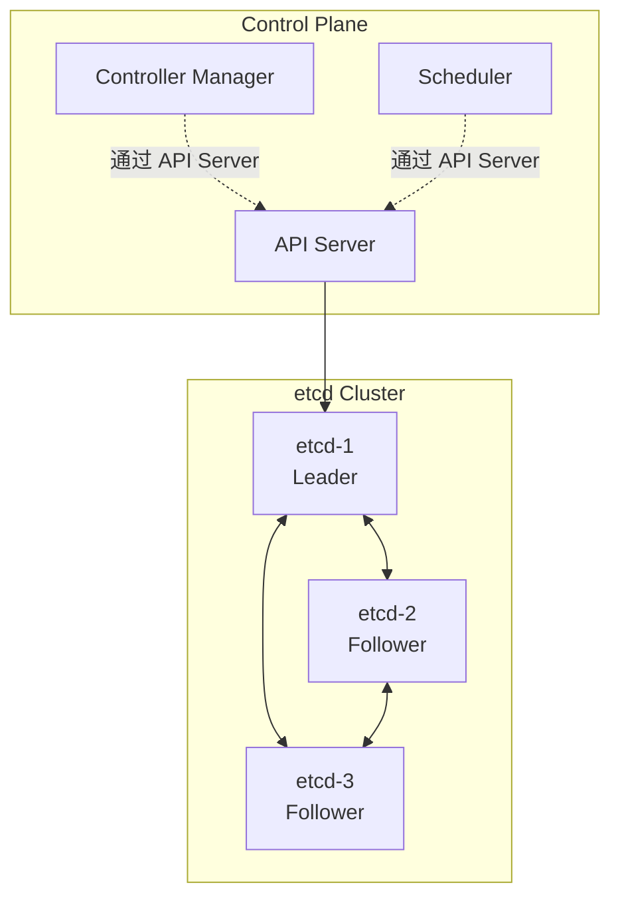

etcd 在 Kubernetes 中的作用：

| 功能 | 说明 |
|-----|------|
| 状态存储 | 存储所有集群资源对象 |
| 配置中心 | 存储集群配置信息 |
| 服务发现 | 支持 Watch 机制实现服务发现 |
| 分布式锁 | Leader Election 等协调功能 |

### 1.3 版本演进

```
etcd 版本历史:
├── etcd v2
│   ├── 内存存储
│   ├── HTTP API
│   └── 已废弃
├── etcd v3
│   ├── BoltDB 存储
│   ├── gRPC API
│   ├── MVCC 支持
│   └── Kubernetes 使用
└── etcd v3.5+
    ├── 性能优化
    ├── 更好的 Watch 支持
    └── 下载阈值降低
```

## 2. 整体架构

### 2.1 架构组件

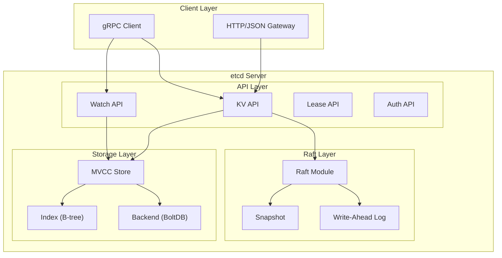

### 2.2 核心组件职责

```go
// etcd 服务器核心结构
// server/etcdserver/server.go

type EtcdServer struct {
    // Raft 相关
    r            raftNode          // Raft 节点

    // 存储相关
    kv           mvcc.WatchableKV  // MVCC 存储
    lessor       lease.Lessor      // 租约管理

    // API 相关
    be           backend.Backend   // 存储后端

    // 集群相关
    cluster      *membership.RaftCluster

    // 认证相关
    authStore    auth.AuthStore

    // Watch 相关
    watchHub     *mvcc.WatchHub
}
```

## 3. Raft 共识协议

### 3.1 Raft 基础概念

Raft 是一种分布式共识算法，确保集群中所有节点对数据达成一致：

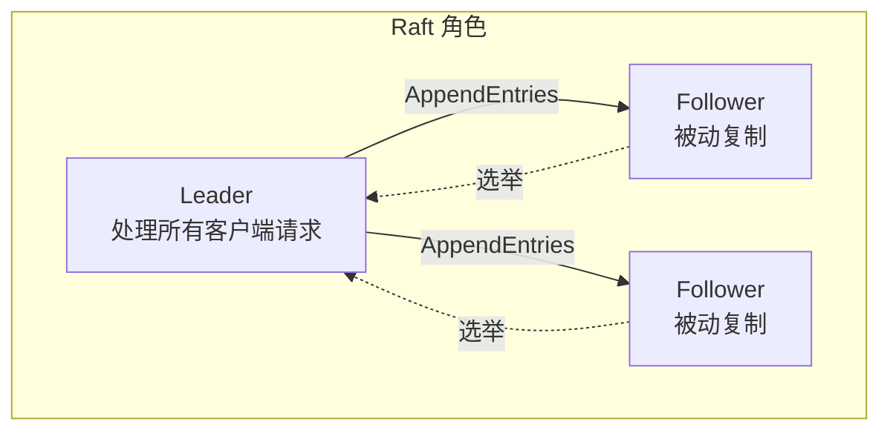

### 3.2 节点状态转换

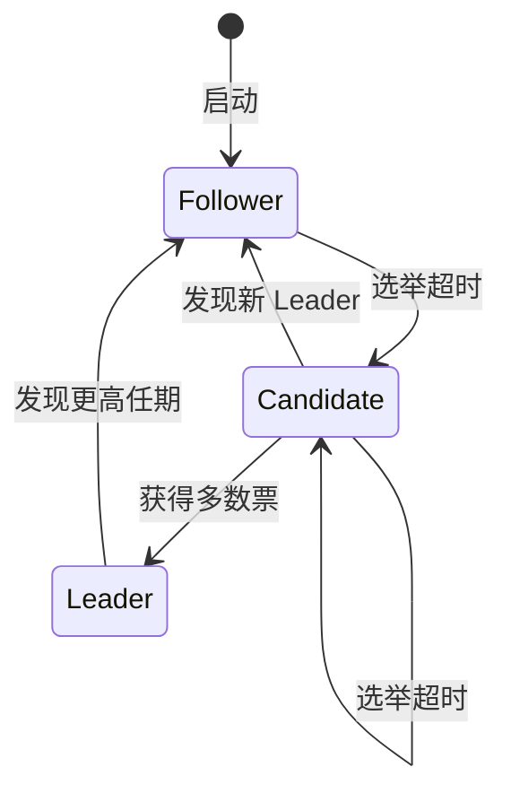

### 3.3 Leader 选举

```go
// Raft 选举实现
// server/etcdserver/raft.go

func (r *raftNode) start(rh *raftReadyHandler) {
    for {
        select {
        case <-r.ticker.C:
            r.tick()
        case rd := <-r.Ready():
            // 处理 Raft Ready 消息
            r.processReady(rd)
        }
    }
}

// 选举超时触发
func (r *raft) tickElection() {
    r.electionElapsed++
    if r.electionElapsed >= r.randomizedElectionTimeout {
        r.electionElapsed = 0
        r.Step(pb.Message{Type: pb.MsgHup})
    }
}

// 开始选举
func (r *raft) campaign(t CampaignType) {
    // 转为 Candidate
    r.becomeCandidate()

    // 向所有节点发送投票请求
    for id := range r.prs.Voters {
        if id == r.id {
            continue
        }
        r.send(pb.Message{
            Type: pb.MsgVote,
            To:   id,
            Term: r.Term,
        })
    }
}
```

### 3.4 日志复制

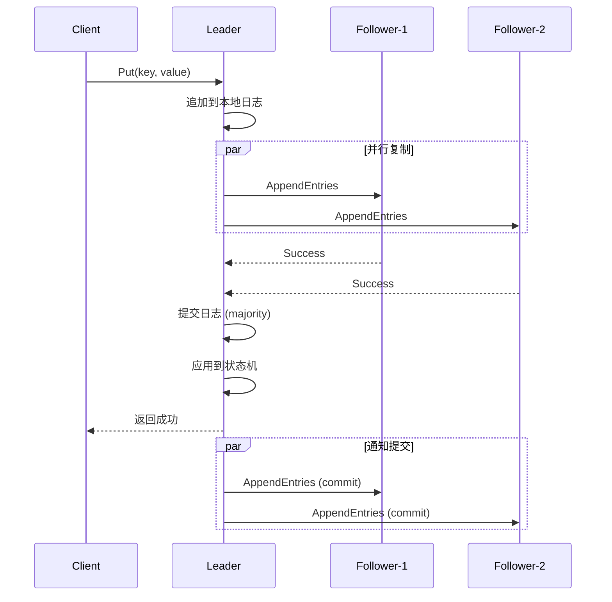

### 3.5 日志条目结构

```go
// Raft 日志条目
// raft/raftpb/raft.pb.go

type Entry struct {
    Term  uint64    // 任期号
    Index uint64    // 日志索引
    Type  EntryType // 类型 (Normal/Config)
    Data  []byte    // 数据
}

// 日志类型
const (
    EntryNormal     EntryType = 0  // 普通数据
    EntryConfChange EntryType = 1  // 配置变更
)
```

## 4. 存储引擎

### 4.1 存储架构

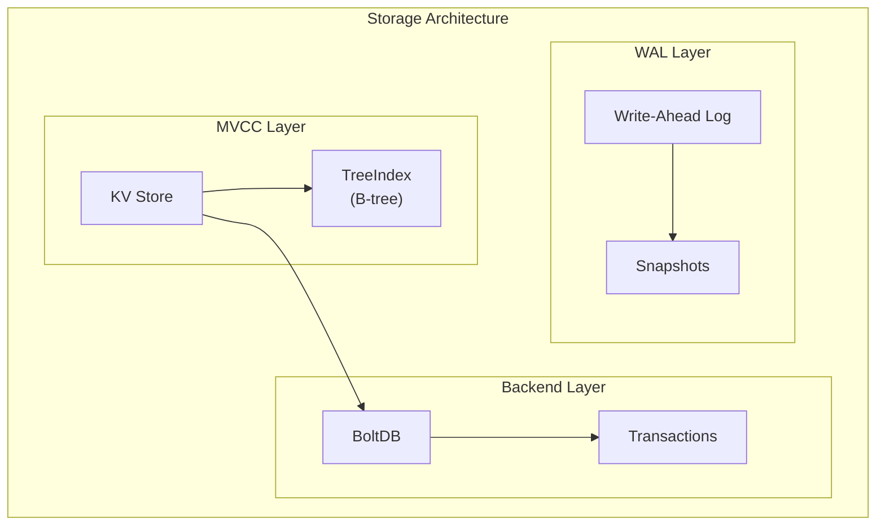

### 4.2 BoltDB 存储

BoltDB 是 etcd 的持久化存储后端：

```go
// BoltDB Backend
// server/storage/backend/backend.go

type backend struct {
    db *bolt.DB

    // Bucket 组织
    // key bucket:    存储 key-value 数据
    // meta bucket:   存储元数据
    // lease bucket:  存储租约数据
    // auth buckets:  存储认证数据
}

// Bucket 结构
var (
    keyBucketName  = []byte("key")
    metaBucketName = []byte("meta")
)

// 写入操作
func (b *backend) put(bucket, key, value []byte) {
    b.batchTx.Lock()
    defer b.batchTx.Unlock()

    b.batchTx.UnsafePut(bucket, key, value)
}
```

### 4.3 B-tree 索引

```go
// TreeIndex - 内存中的 B-tree 索引
// server/storage/mvcc/index.go

type treeIndex struct {
    sync.RWMutex
    tree *btree.BTree  // Google btree 实现
}

type keyIndex struct {
    key         []byte
    modified    revision   // 最后修改版本
    generations []generation
}

type generation struct {
    ver     int64      // 版本号
    created revision   // 创建版本
    revs    []revision // 版本历史
}

// 查找 Key
func (ti *treeIndex) Get(key []byte, rev int64) (rev int64, err error) {
    ti.RLock()
    defer ti.RUnlock()

    item := ti.tree.Get(key)
    if item == nil {
        return 0, ErrKeyNotFound
    }

    return item.(*keyIndex).get(rev)
}
```

### 4.4 数据布局

```
BoltDB 数据布局:
├── key bucket
│   ├── {revision} -> {key, value, create_rev, mod_rev, version}
│   └── ...
├── meta bucket
│   ├── consistentIndex -> {uint64}
│   ├── scheduledCompact -> {revision}
│   └── finishedCompact -> {revision}
├── lease bucket
│   ├── {leaseID} -> {TTL, remaining}
│   └── ...
└── auth buckets
    ├── authUsers
    ├── authRoles
    └── authEnabled
```

## 5. Write-Ahead Log (WAL)

### 5.1 WAL 概述

WAL 确保数据持久性和恢复能力：

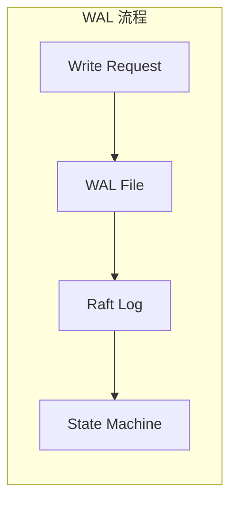

### 5.2 WAL 结构

```go
// WAL 实现
// server/storage/wal/wal.go

type WAL struct {
    dir string         // WAL 目录

    // 元数据
    metadata []byte
    state    raftpb.HardState

    // 文件管理
    locks  []*fileutil.LockedFile
    fp     *filePipeline

    // 编码器
    encoder *encoder
}

// WAL 记录类型
const (
    metadataType int64 = iota + 1
    entryType
    stateType
    crcType
    snapshotType
)

// 写入 Entry
func (w *WAL) Save(st raftpb.HardState, ents []raftpb.Entry) error {
    w.mu.Lock()
    defer w.mu.Unlock()

    // 写入 Entries
    for i := range ents {
        if err := w.saveEntry(&ents[i]); err != nil {
            return err
        }
    }

    // 写入 HardState
    if err := w.saveState(&st); err != nil {
        return err
    }

    // 同步到磁盘
    return w.sync()
}
```

### 5.3 WAL 文件格式

```
WAL 文件格式:
┌─────────────────────────────────┐
│          Record Header          │
├─────────────────────────────────┤
│  Type (8 bytes)                 │
│  CRC (4 bytes)                  │
│  Data Length (4 bytes)          │
├─────────────────────────────────┤
│          Record Data            │
├─────────────────────────────────┤
│              ...                │
└─────────────────────────────────┘

文件命名: {seq}-{index}.wal
例如: 0000000000000001-0000000000000001.wal
```

### 5.4 Snapshot 机制

```go
// Snapshot 管理
// server/etcdserver/snapshot.go

type snapshotManager struct {
    dir    string
    snap   *snap.Snapshotter
}

// 创建快照
func (s *EtcdServer) snapshot(snapi uint64) {
    // 获取当前状态
    clone := s.kv.Clone()

    // 序列化存储状态
    d, err := clone.SaveSnapshotNowAndClose()
    if err != nil {
        return
    }

    // 创建 Raft snapshot
    snapshot := raftpb.Snapshot{
        Metadata: raftpb.SnapshotMetadata{
            Index: snapi,
            Term:  s.Term(),
        },
        Data: d,
    }

    // 保存到磁盘
    s.r.transport.Snapshot(snapshot)
}
```

## 6. 网络层

### 6.1 通信架构

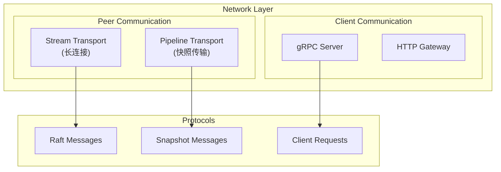

### 6.2 Peer 通信

```go
// Peer Transport
// server/etcdserver/api/rafthttp/transport.go

type Transport struct {
    // TLS 配置
    TLSInfo transport.TLSInfo

    // Peer 管理
    peers   map[types.ID]Peer

    // 消息处理
    Raft    Raft

    // 集群信息
    ClusterID types.ID
    ID        types.ID
}

// 发送消息
func (t *Transport) Send(msgs []raftpb.Message) {
    for _, m := range msgs {
        if m.To == 0 {
            continue
        }

        to := types.ID(m.To)
        p, ok := t.peers[to]
        if !ok {
            continue
        }

        // 根据消息类型选择传输方式
        if isMsgSnap(m) {
            p.sendSnap(m)
        } else {
            p.send(m)
        }
    }
}
```

### 6.3 gRPC API

```protobuf
// etcd gRPC API
// api/etcdserverpb/rpc.proto

service KV {
    rpc Range(RangeRequest) returns (RangeResponse);
    rpc Put(PutRequest) returns (PutResponse);
    rpc DeleteRange(DeleteRangeRequest) returns (DeleteRangeResponse);
    rpc Txn(TxnRequest) returns (TxnResponse);
    rpc Compact(CompactionRequest) returns (CompactionResponse);
}

service Watch {
    rpc Watch(stream WatchRequest) returns (stream WatchResponse);
}

service Lease {
    rpc LeaseGrant(LeaseGrantRequest) returns (LeaseGrantResponse);
    rpc LeaseRevoke(LeaseRevokeRequest) returns (LeaseRevokeResponse);
    rpc LeaseKeepAlive(stream LeaseKeepAliveRequest)
        returns (stream LeaseKeepAliveResponse);
}
```

## 7. 集群管理

### 7.1 集群拓扑

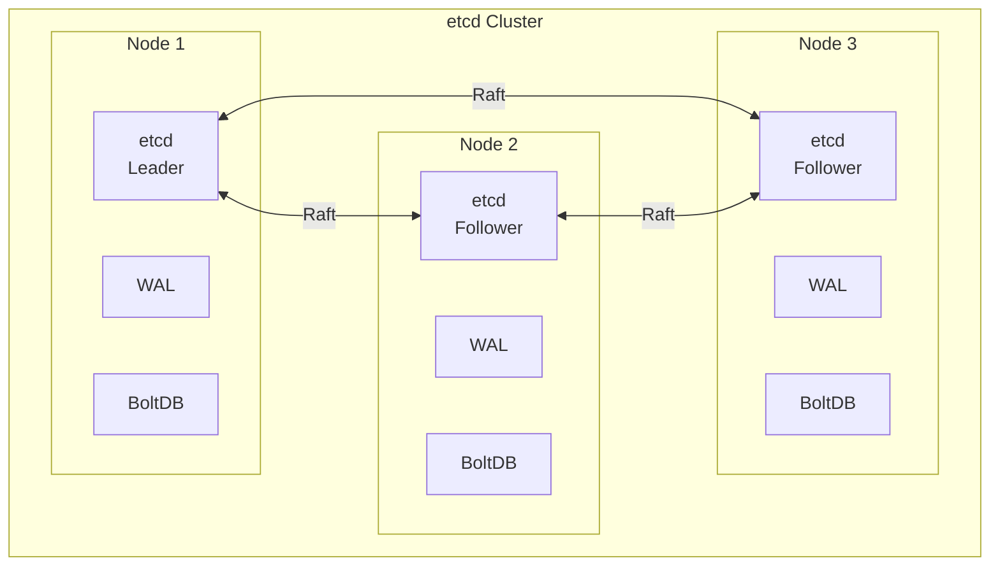

### 7.2 成员管理

```go
// 集群成员管理
// server/etcdserver/api/membership/cluster.go

type RaftCluster struct {
    cid types.ID                  // 集群 ID
    members map[types.ID]*Member  // 成员列表
    removed map[types.ID]bool     // 已移除成员
}

type Member struct {
    ID         types.ID
    RaftAttributes
    Attributes
}

type RaftAttributes struct {
    PeerURLs []string  // Peer 通信地址
}

type Attributes struct {
    Name       string
    ClientURLs []string  // Client 通信地址
}

// 添加成员
func (c *RaftCluster) AddMember(m *Member) {
    c.Lock()
    defer c.Unlock()
    c.members[m.ID] = m
}

// 移除成员
func (c *RaftCluster) RemoveMember(id types.ID) {
    c.Lock()
    defer c.Unlock()
    delete(c.members, id)
    c.removed[id] = true
}
```

### 7.3 集群配置变更

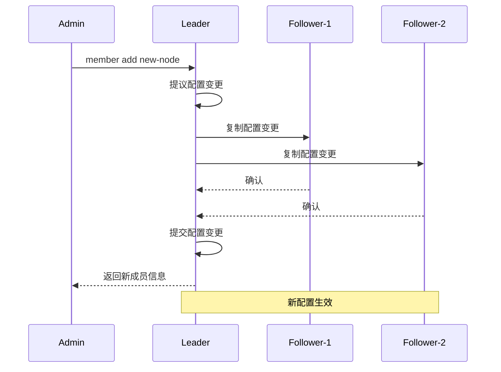

## 8. 数据一致性保证

### 8.1 一致性级别

etcd 提供线性一致性 (Linearizability)：

```go
// 线性读实现
// server/etcdserver/v3_server.go

func (s *EtcdServer) Range(ctx context.Context, r *pb.RangeRequest) (*pb.RangeResponse, error) {
    // 如果需要线性读
    if !r.Serializable {
        // 确认 Leader 身份
        if err := s.linearizableReadNotify(ctx); err != nil {
            return nil, err
        }
    }

    // 从 MVCC 存储读取
    return s.applyV3.Range(ctx, r)
}

// 线性读确认
func (s *EtcdServer) linearizableReadNotify(ctx context.Context) error {
    // 通过 ReadIndex 协议确认
    s.readMu.Lock()
    nc := s.readNotifier
    s.readMu.Unlock()

    // 等待确认
    select {
    case <-nc.c:
        return nc.err
    case <-ctx.Done():
        return ctx.Err()
    }
}
```

### 8.2 ReadIndex 协议

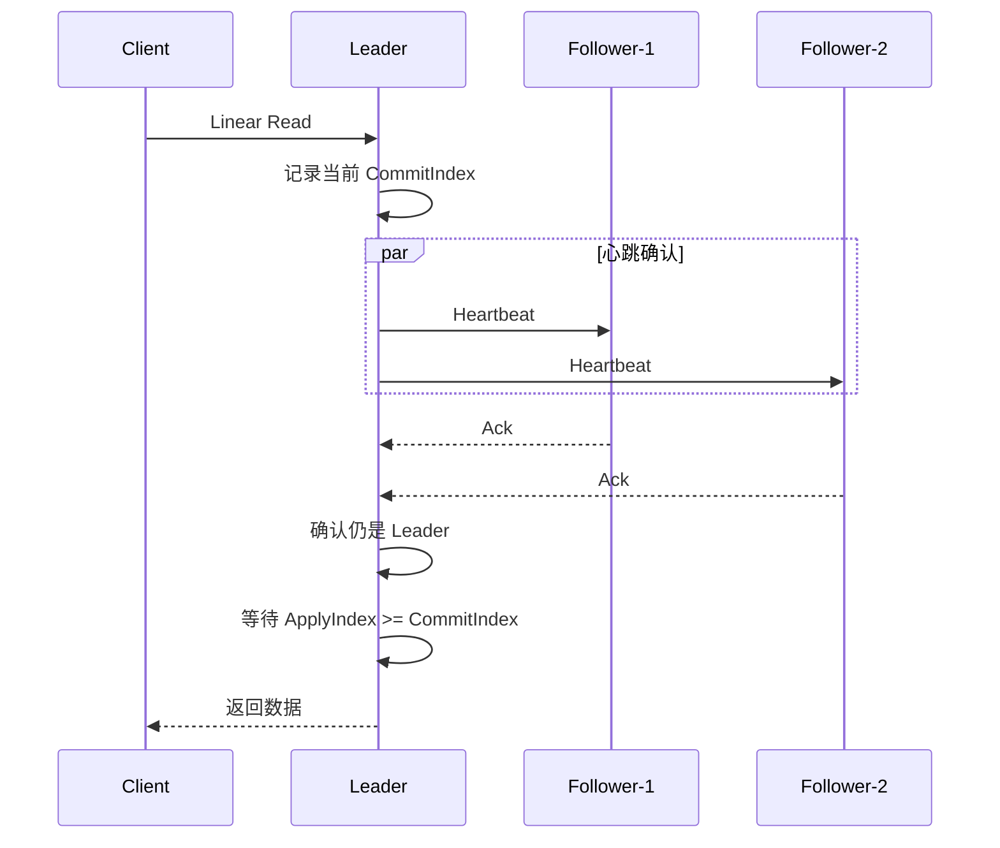

### 8.3 事务支持

```go
// Mini-Transaction
// server/etcdserver/apply.go

type TxnRequest struct {
    Compare  []*Compare   // 条件
    Success  []*RequestOp // 条件满足时执行
    Failure  []*RequestOp // 条件不满足时执行
}

// 执行事务
func (a *applierV3backend) Txn(ctx context.Context, rt *pb.TxnRequest) (*pb.TxnResponse, error) {
    // 检查条件
    ok := true
    for _, c := range rt.Compare {
        if !a.checkCompare(c) {
            ok = false
            break
        }
    }

    // 执行操作
    var ops []*pb.RequestOp
    if ok {
        ops = rt.Success
    } else {
        ops = rt.Failure
    }

    // 应用操作
    for _, op := range ops {
        a.applyOp(ctx, op)
    }

    return resp, nil
}
```

## 9. 性能特性

### 9.1 性能指标

| 指标 | 典型值 | 说明 |
|-----|-------|------|
| 写入延迟 | 1-10ms | 取决于网络和磁盘 |
| 读取延迟 | <1ms | 本地缓存命中 |
| 写入吞吐 | 10k-30k QPS | 取决于硬件配置 |
| 读取吞吐 | 50k+ QPS | 可水平扩展 |

### 9.2 性能影响因素

```
性能影响因素:
├── 硬件
│   ├── SSD (关键)
│   ├── 内存
│   └── 网络延迟
├── 配置
│   ├── Snapshot 频率
│   ├── 心跳间隔
│   └── 选举超时
├── 负载
│   ├── Key 数量
│   ├── Value 大小
│   └── Watch 数量
└── 网络
    ├── 节点间延迟
    └── 带宽
```

### 9.3 资源消耗

```go
// 资源限制配置
// server/embed/config.go

type Config struct {
    // 存储限制
    QuotaBackendBytes int64  // 存储配额 (默认 2GB)

    // 快照配置
    SnapshotCount uint64     // 快照触发阈值 (默认 100000)

    // 请求限制
    MaxRequestBytes uint     // 最大请求大小 (默认 1.5MB)

    // Watch 限制
    MaxWatchersPerWatch uint // 每个 Watch 的最大 Watcher 数
}
```

## 小结

本文介绍了 etcd 的整体架构：

1. **Raft 共识**：Leader 选举、日志复制、成员变更
2. **存储引擎**：BoltDB 持久化、B-tree 索引、MVCC 支持
3. **WAL 机制**：Write-Ahead Log 确保持久性
4. **网络通信**：gRPC API、Peer 通信
5. **集群管理**：成员管理、配置变更
6. **一致性保证**：线性一致性、ReadIndex 协议

下一篇将详细介绍 etcd 的数据模型和 MVCC 实现。
