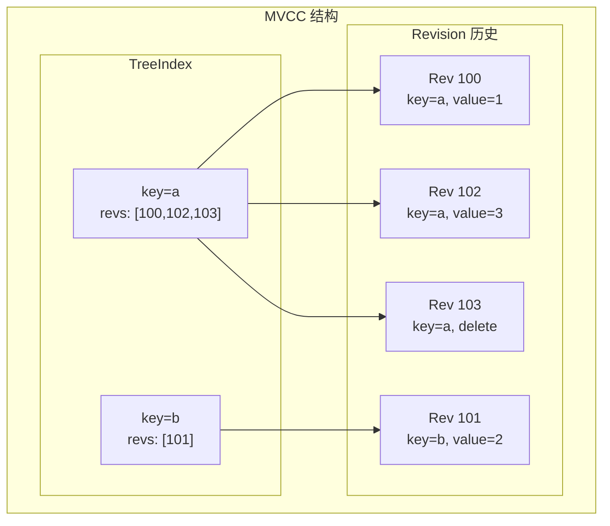
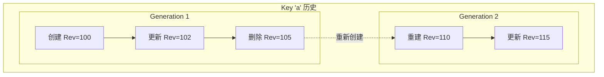
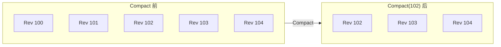
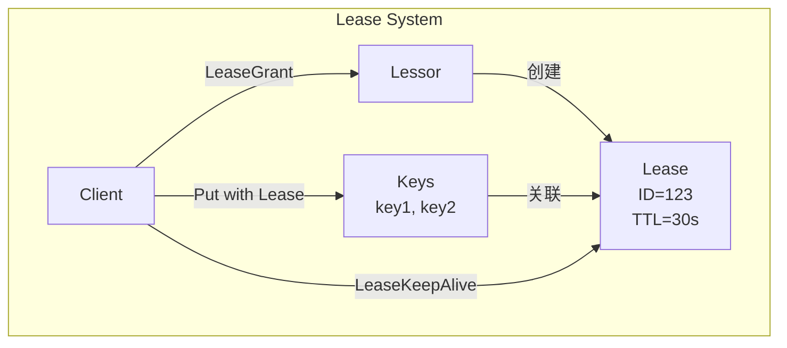
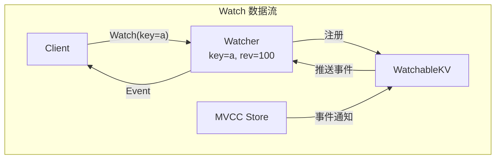

本文详细介绍 etcd 的数据模型，包括键值模型、MVCC 实现、事务语义和 Lease 机制。

## 1. 键值模型

### 1.1 扁平命名空间

etcd 使用扁平的键值命名空间，所有键都在同一个命名空间中：

```
键空间结构:
/
├── /registry/pods/default/nginx
├── /registry/pods/default/redis
├── /registry/services/default/kubernetes
├── /registry/deployments/default/web
└── ...

特点:
├── 扁平结构 (非层级)
├── 字节序列键值
├── 按字典序排序
└── 支持前缀查询
```

### 1.2 键值结构

```go
// 键值对内部表示
// server/storage/mvcc/kv.go

type KeyValue struct {
    Key            []byte // 键
    CreateRevision int64  // 创建版本
    ModRevision    int64  // 最后修改版本
    Version        int64  // 键的版本号
    Value          []byte // 值
    Lease          int64  // 关联的租约 ID
}

// 存储格式示例
// Key:   "/registry/pods/default/nginx"
// Value: <Pod 的 Protobuf 编码>
// CreateRevision: 100
// ModRevision: 150
// Version: 3
// Lease: 0 (无租约)
```

### 1.3 前缀查询

```go
// 前缀查询实现
// server/storage/mvcc/kvstore_txn.go

func (tw *storeTxnWrite) Range(key, end []byte, ro RangeOptions) (*RangeResult, error) {
    // 获取 revision 范围内的所有键值
    revs, vs := tw.s.kvindex.Revisions(key, end, ro.Rev)

    // 从存储中读取值
    kvs := make([]KeyValue, len(revs))
    for i, rev := range revs {
        kvs[i] = tw.read(rev)
    }

    return &RangeResult{KVs: kvs, Rev: ro.Rev}, nil
}

// 使用示例
// 查询所有 Pod: key="/registry/pods/", end="/registry/pods0"
// end 使用 "0" 是因为 "0" > "/"，可以匹配所有以 "/registry/pods/" 开头的键
```

## 2. MVCC 实现

### 2.1 MVCC 概述

MVCC (Multi-Version Concurrency Control) 允许同一键存在多个版本：



### 2.2 Revision 结构

```go
// Revision 定义
// server/storage/mvcc/revision.go

type revision struct {
    main int64 // 主版本号 (全局递增)
    sub  int64 // 子版本号 (事务内递增)
}

// 示例:
// 事务1: Put(a,1), Put(b,2)
//   a -> revision{main:100, sub:0}
//   b -> revision{main:100, sub:1}
// 事务2: Put(a,3)
//   a -> revision{main:101, sub:0}

// Revision 编码
func (a revision) Bytes() []byte {
    b := make([]byte, 17)
    binary.BigEndian.PutUint64(b[0:8], uint64(a.main))
    b[8] = '_'
    binary.BigEndian.PutUint64(b[9:17], uint64(a.sub))
    return b
}
```

### 2.3 TreeIndex 实现

```go
// TreeIndex - 内存 B-tree 索引
// server/storage/mvcc/index.go

type treeIndex struct {
    sync.RWMutex
    tree *btree.BTree
}

// keyIndex 存储单个 key 的所有版本信息
type keyIndex struct {
    key         []byte
    modified    revision     // 最后修改版本
    generations []generation // 版本代
}

// generation 表示一次创建到删除的生命周期
type generation struct {
    ver     int64      // 当前代的版本数
    created revision   // 创建版本
    revs    []revision // 所有修改版本
}

// 查找指定版本的 revision
func (ki *keyIndex) get(atRev int64) (modified, created revision, ver int64, err error) {
    if ki.isEmpty() {
        return revision{}, revision{}, 0, ErrRevisionNotFound
    }

    // 查找对应版本的 generation
    g := ki.findGeneration(atRev)
    if g == nil {
        return revision{}, revision{}, 0, ErrRevisionNotFound
    }

    // 二分查找具体版本
    n := g.walk(func(rev revision) bool {
        return rev.main > atRev
    })

    if n != -1 {
        return g.revs[n], g.created, g.ver - int64(len(g.revs)-n-1), nil
    }

    return revision{}, revision{}, 0, ErrRevisionNotFound
}
```

### 2.4 版本历史管理



### 2.5 BoltDB 存储布局

```go
// Backend 存储
// server/storage/mvcc/kvstore.go

type store struct {
    b       backend.Backend
    kvindex index

    // 当前 revision
    currentRev int64

    // Compact 进度
    compactMainRev int64
}

// 键值对在 BoltDB 中的存储
// Bucket: "key"
// Key:    revision.Bytes()  (如 "0000000000000100_0")
// Value:  KeyValue 的 Protobuf 编码

func (s *store) Put(key, value []byte, lease lease.LeaseID) (rev int64) {
    // 1. 分配新 revision
    rev = s.currentRev + 1

    // 2. 创建 KeyValue
    kv := &KeyValue{
        Key:            key,
        Value:          value,
        CreateRevision: rev, // 如果是新键
        ModRevision:    rev,
        Version:        1,   // 如果是新键
        Lease:          int64(lease),
    }

    // 3. 更新索引
    s.kvindex.Put(key, revision{main: rev})

    // 4. 写入 BoltDB
    ibytes := revision{main: rev}.Bytes()
    d, _ := kv.Marshal()
    s.b.BatchTx().UnsafePut(keyBucketName, ibytes, d)

    s.currentRev = rev
    return rev
}
```

## 3. Compact 操作

### 3.1 Compact 原理

Compact 清理指定 revision 之前的历史版本，回收存储空间：



### 3.2 Compact 实现

```go
// Compact 实现
// server/storage/mvcc/kvstore_compaction.go

func (s *store) Compact(rev int64) (<-chan struct{}, error) {
    s.mu.Lock()

    // 检查 revision 有效性
    if rev <= s.compactMainRev {
        return nil, ErrCompacted
    }
    if rev > s.currentRev {
        return nil, ErrFutureRev
    }

    s.compactMainRev = rev
    s.mu.Unlock()

    // 异步执行 compact
    return s.scheduleCompaction(rev), nil
}

func (s *store) scheduleCompaction(rev int64) <-chan struct{} {
    ch := make(chan struct{})

    go func() {
        defer close(ch)

        // 遍历索引，清理旧版本
        s.kvindex.Compact(rev)

        // 清理 BoltDB 中的旧数据
        s.compactKvs(rev)
    }()

    return ch
}

// 清理索引中的旧版本
func (ti *treeIndex) Compact(rev int64) map[revision]struct{} {
    ti.Lock()
    defer ti.Unlock()

    keep := make(map[revision]struct{})

    ti.tree.Ascend(func(i btree.Item) bool {
        ki := i.(*keyIndex)
        ki.compact(rev, keep)
        return true
    })

    return keep
}
```

### 3.3 Auto Compaction

```go
// 自动 Compaction 配置
// server/embed/config.go

type Config struct {
    // 自动 compact 模式
    // "periodic" - 按时间周期
    // "revision" - 按版本数量
    AutoCompactionMode string

    // 保留周期/版本数
    AutoCompactionRetention string
}

// Periodic Compaction (每小时保留)
// 配置: --auto-compaction-mode=periodic --auto-compaction-retention=1h

// Revision Compaction (保留最近 1000 个版本)
// 配置: --auto-compaction-mode=revision --auto-compaction-retention=1000
```

## 4. 事务语义

### 4.1 Mini-Transaction

etcd 支持 Mini-Transaction (STM)：

```go
// TxnRequest 结构
// api/etcdserverpb/rpc.proto

type TxnRequest struct {
    Compare  []*Compare   // IF 条件
    Success  []*RequestOp // THEN 操作
    Failure  []*RequestOp // ELSE 操作
}

// Compare 条件
type Compare struct {
    Result CompareResult // EQUAL, GREATER, LESS, NOT_EQUAL
    Target CompareTarget // VERSION, CREATE, MOD, VALUE
    Key    []byte
    // 比较目标值
    oneof TargetUnion {
        Version     int64
        CreateRevision int64
        ModRevision    int64
        Value          []byte
    }
}

// 使用示例: CAS (Compare-And-Swap)
txn := client.Txn(ctx)
txn.If(
    clientv3.Compare(clientv3.Value("key"), "=", "old_value"),
).Then(
    clientv3.OpPut("key", "new_value"),
).Else(
    clientv3.OpGet("key"),
)
resp, err := txn.Commit()
```

### 4.2 事务执行

```go
// 事务执行
// server/etcdserver/apply.go

func (a *applierV3backend) Txn(ctx context.Context, r *pb.TxnRequest) (*pb.TxnResponse, error) {
    // 1. 评估所有比较条件
    success := true
    for _, c := range r.Compare {
        if !a.compare(c) {
            success = false
            break
        }
    }

    // 2. 选择执行分支
    var ops []*pb.RequestOp
    if success {
        ops = r.Success
    } else {
        ops = r.Failure
    }

    // 3. 执行所有操作 (原子性)
    responses := make([]*pb.ResponseOp, len(ops))
    for i, op := range ops {
        switch op.Request.(type) {
        case *pb.RequestOp_RequestPut:
            responses[i] = a.applyPut(op.GetRequestPut())
        case *pb.RequestOp_RequestRange:
            responses[i] = a.applyRange(op.GetRequestRange())
        case *pb.RequestOp_RequestDeleteRange:
            responses[i] = a.applyDelete(op.GetRequestDeleteRange())
        }
    }

    return &pb.TxnResponse{
        Succeeded: success,
        Responses: responses,
    }, nil
}
```

### 4.3 事务隔离级别

```
etcd 事务特性:
├── 原子性 (Atomicity)
│   └── 事务内所有操作要么全部成功，要么全部失败
├── 一致性 (Consistency)
│   └── 通过 Raft 协议保证
├── 隔离性 (Isolation)
│   └── 串行化隔离 (Serializable)
└── 持久性 (Durability)
    └── 通过 WAL 和多副本保证
```

## 5. Lease 机制

### 5.1 Lease 概述

Lease 提供键的生存时间 (TTL) 管理：



### 5.2 Lease 实现

```go
// Lease 结构
// server/lease/lessor.go

type Lease struct {
    ID           LeaseID
    ttl          int64          // 生存时间 (秒)
    remainingTTL int64          // 剩余时间
    expiryTime   time.Time      // 过期时间
    itemSet      map[LeaseItem]struct{} // 关联的键
    revokec      chan struct{}
}

// Lessor 管理器
type lessor struct {
    mu sync.RWMutex

    // Lease 存储
    leaseMap map[LeaseID]*Lease

    // 过期检查
    leaseExpiredNotifier *LeaseExpiredNotifier

    // 最小堆 (按过期时间排序)
    leaseHeap LeaseQueue
}

// 创建 Lease
func (le *lessor) Grant(id LeaseID, ttl int64) (*Lease, error) {
    le.mu.Lock()
    defer le.mu.Unlock()

    l := &Lease{
        ID:         id,
        ttl:        ttl,
        expiryTime: time.Now().Add(time.Duration(ttl) * time.Second),
        itemSet:    make(map[LeaseItem]struct{}),
    }

    le.leaseMap[id] = l
    le.leaseHeap.Push(l)

    // 持久化
    le.persist(l)

    return l, nil
}
```

### 5.3 Lease 续约

```go
// KeepAlive 实现
// server/lease/lessor.go

func (le *lessor) Renew(id LeaseID) (int64, error) {
    le.mu.Lock()
    defer le.mu.Unlock()

    l, ok := le.leaseMap[id]
    if !ok {
        return -1, ErrLeaseNotFound
    }

    // 更新过期时间
    l.expiryTime = time.Now().Add(time.Duration(l.ttl) * time.Second)

    // 更新最小堆
    le.leaseHeap.Update(l)

    return l.ttl, nil
}

// 客户端保持活跃
func (c *Client) KeepAlive(ctx context.Context, id LeaseID) (<-chan *LeaseKeepAliveResponse, error) {
    ch := make(chan *LeaseKeepAliveResponse)

    go func() {
        ticker := time.NewTicker(time.Duration(ttl/3) * time.Second)
        defer ticker.Stop()

        for {
            select {
            case <-ticker.C:
                resp, err := c.Lease.KeepAliveOnce(ctx, id)
                if err != nil {
                    close(ch)
                    return
                }
                ch <- resp
            case <-ctx.Done():
                close(ch)
                return
            }
        }
    }()

    return ch, nil
}
```

### 5.4 Lease 过期处理

```go
// 过期检查
// server/lease/lessor.go

func (le *lessor) runLoop() {
    defer close(le.doneC)

    for {
        select {
        case <-time.After(500 * time.Millisecond):
            le.revokeExpiredLeases()
        case <-le.stopC:
            return
        }
    }
}

func (le *lessor) revokeExpiredLeases() {
    le.mu.Lock()

    // 获取所有过期的 Lease
    leases := le.findExpiredLeases()

    le.mu.Unlock()

    // 撤销过期 Lease
    for _, l := range leases {
        le.Revoke(l.ID)
    }
}

// Lease 撤销
func (le *lessor) Revoke(id LeaseID) error {
    le.mu.Lock()
    l := le.leaseMap[id]
    if l == nil {
        le.mu.Unlock()
        return ErrLeaseNotFound
    }

    // 获取关联的键
    keys := l.Keys()
    le.mu.Unlock()

    // 删除所有关联的键
    for _, key := range keys {
        le.kv.Delete(key)
    }

    // 移除 Lease
    le.mu.Lock()
    delete(le.leaseMap, id)
    le.mu.Unlock()

    return nil
}
```

### 5.5 Lease 使用示例

```go
// Lease 使用示例
func leaseExample(client *clientv3.Client) {
    ctx := context.Background()

    // 1. 创建 Lease
    lease, err := client.Grant(ctx, 30) // 30 秒 TTL
    if err != nil {
        log.Fatal(err)
    }

    // 2. 使用 Lease 设置键
    _, err = client.Put(ctx, "key", "value", clientv3.WithLease(lease.ID))
    if err != nil {
        log.Fatal(err)
    }

    // 3. 保持 Lease 活跃
    ch, err := client.KeepAlive(ctx, lease.ID)
    if err != nil {
        log.Fatal(err)
    }

    // 4. 处理续约响应
    for resp := range ch {
        fmt.Printf("Lease renewed, TTL: %d\n", resp.TTL)
    }

    // Lease 过期后，key 会被自动删除
}
```

## 6. Watch 数据流

### 6.1 Watch 与 MVCC

Watch 利用 MVCC 的版本历史实现事件推送：



### 6.2 事件生成

```go
// 事件结构
// api/mvccpb/kv.proto

type Event struct {
    Type   EventType // PUT 或 DELETE
    Kv     *KeyValue // 当前值
    PrevKv *KeyValue // 前一个值 (可选)
}

type EventType int32

const (
    PUT    EventType = 0
    DELETE EventType = 1
)

// 写入时生成事件
func (tw *storeTxnWrite) Put(key, value []byte, lease lease.LeaseID) int64 {
    rev := tw.s.currentRev + 1

    // 创建事件
    ev := mvccpb.Event{
        Type: mvccpb.PUT,
        Kv: &mvccpb.KeyValue{
            Key:            key,
            Value:          value,
            CreateRevision: rev,
            ModRevision:    rev,
        },
    }

    // 通知 Watcher
    tw.s.watchStream.notify(ev)

    return rev
}
```

## 7. 数据编码

### 7.1 键编码

```go
// Kubernetes 资源键编码
// staging/src/k8s.io/apiserver/pkg/storage/etcd3/store.go

// 资源路径格式: /registry/<resource>/<namespace>/<name>
// 例如:
// /registry/pods/default/nginx
// /registry/services/kube-system/kube-dns
// /registry/nodes/node-1 (非命名空间资源)

func (s *store) key(ctx context.Context, key string) string {
    return path.Join(s.pathPrefix, key)
}

// 前缀编码 (用于 Range 查询)
func (s *store) prepareKey(key string) (string, error) {
    if len(key) == 0 {
        return "", fmt.Errorf("key is empty")
    }
    return s.pathPrefix + key, nil
}
```

### 7.2 值编码

```go
// 值的 Protobuf 编码
// staging/src/k8s.io/apiserver/pkg/storage/value/transformer.go

type Transformer interface {
    TransformFromStorage(ctx context.Context, data []byte, dataCtx Context) ([]byte, bool, error)
    TransformToStorage(ctx context.Context, data []byte, dataCtx Context) ([]byte, error)
}

// 存储时编码
func (s *store) Create(ctx context.Context, key string, obj runtime.Object) error {
    // 1. 序列化为 Protobuf
    data, err := runtime.Encode(s.codec, obj)

    // 2. 可选: 加密转换
    if s.transformer != nil {
        data, err = s.transformer.TransformToStorage(ctx, data, key)
    }

    // 3. 写入 etcd
    return s.client.Put(ctx, s.key(key), string(data))
}
```

## 小结

本文介绍了 etcd 的数据模型：

1. **键值模型**：扁平命名空间、字节序列键值、前缀查询
2. **MVCC 实现**：Revision 机制、TreeIndex 索引、版本历史
3. **Compact 操作**：历史版本清理、自动 Compact
4. **事务语义**：Mini-Transaction、原子操作、串行化隔离
5. **Lease 机制**：TTL 管理、自动续约、过期处理
6. **数据编码**：键路径编码、Protobuf 序列化

下一篇将介绍 Kubernetes 与 etcd 的集成实现。
