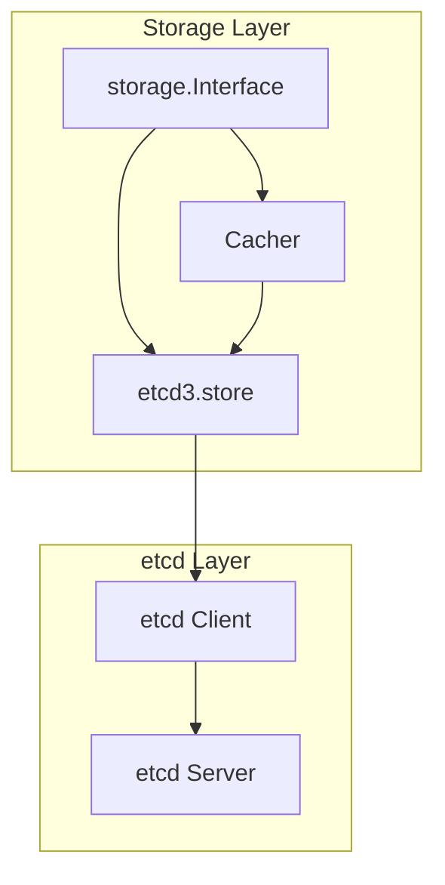
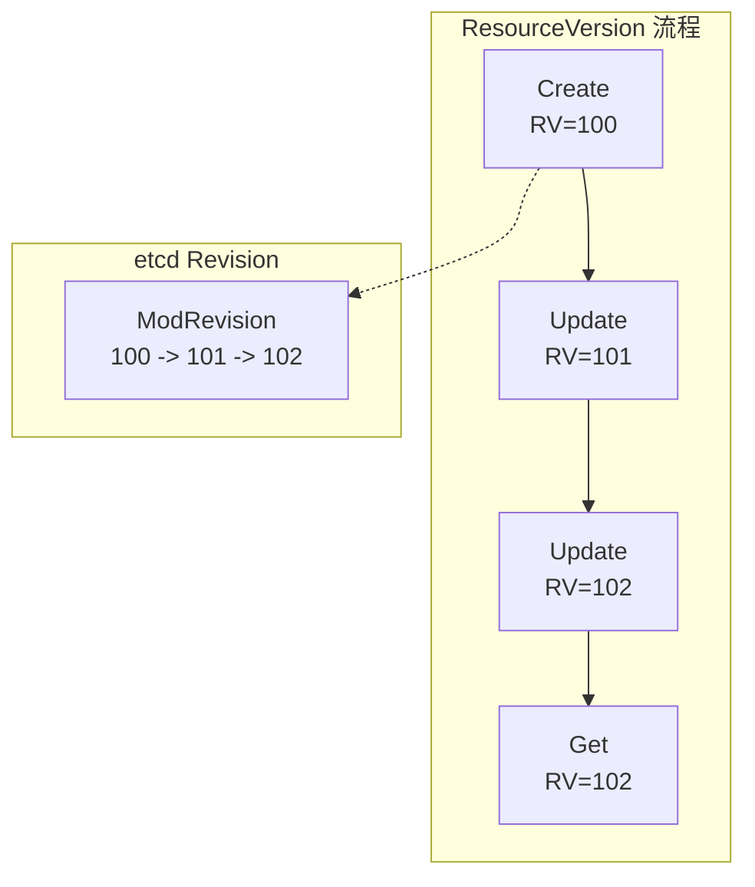
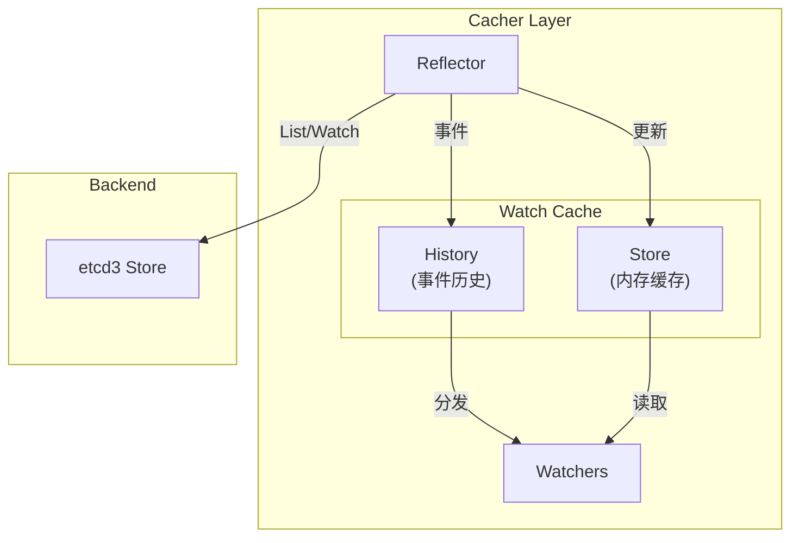

本文详细介绍 Kubernetes 如何与 etcd 集成，包括存储层抽象、资源存储、Watch 集成和一致性保证。

## 1. 存储层抽象

### 1.1 Storage Interface

Kubernetes 通过 `storage.Interface` 抽象存储层：

```go
// 存储接口定义
// staging/src/k8s.io/apiserver/pkg/storage/interfaces.go

type Interface interface {
    // 版本控制
    Versioner() Versioner

    // CRUD 操作
    Create(ctx context.Context, key string, obj, out runtime.Object, ttl uint64) error
    Delete(ctx context.Context, key string, out runtime.Object, preconditions *Preconditions) error
    Watch(ctx context.Context, key string, opts ListOptions) (watch.Interface, error)
    Get(ctx context.Context, key string, opts GetOptions, out runtime.Object) error
    GetList(ctx context.Context, key string, opts ListOptions, listObj runtime.Object) error
    GuaranteedUpdate(ctx context.Context, key string, destination runtime.Object, ...) error

    // 计数
    Count(key string) (int64, error)

    // 请求监视进度
    RequestWatchProgress(ctx context.Context) error
}
```

### 1.2 etcd3 存储实现



```go
// etcd3 存储实现
// staging/src/k8s.io/apiserver/pkg/storage/etcd3/store.go

type store struct {
    client        *clientv3.Client
    codec         runtime.Codec
    versioner     storage.Versioner
    transformer   value.Transformer
    pathPrefix    string
    groupResource schema.GroupResource
    watcher       *watcher
    leaseManager  *leaseManager
}

// 创建存储实例
func New(c *clientv3.Client, codec runtime.Codec, prefix string, ...) storage.Interface {
    return &store{
        client:        c,
        codec:         codec,
        versioner:     storage.APIObjectVersioner{},
        transformer:   transformer,
        pathPrefix:    path.Join("/", prefix),
        groupResource: groupResource,
        watcher:       newWatcher(c, codec, ...),
        leaseManager:  newDefaultLeaseManager(c, ...),
    }
}
```

### 1.3 键编码规则

```go
// 资源路径编码
// staging/src/k8s.io/apiserver/pkg/storage/etcd3/store.go

// 键路径格式
// /<pathPrefix>/<resource>/<namespace>/<name>
//
// 示例:
// /registry/pods/default/nginx
// /registry/deployments/kube-system/coredns
// /registry/nodes/node-1 (集群级资源)

func (s *store) key(key string) string {
    return path.Join(s.pathPrefix, key)
}

// 前缀查询的 end key
func (s *store) getEndKey(key string) string {
    // 通过在最后一个字符加1来获取范围结束
    key = s.key(key)
    return clientv3.GetPrefixRangeEnd(key)
}

// Kubernetes 资源存储路径示例
pathPrefixes := map[string]string{
    "pods":        "/registry/pods",
    "services":    "/registry/services",
    "secrets":     "/registry/secrets",
    "configmaps":  "/registry/configmaps",
    "deployments": "/registry/deployments",
    "nodes":       "/registry/nodes",
    "namespaces":  "/registry/namespaces",
}
```

## 2. CRUD 操作实现

### 2.1 Create 操作

```go
// Create 实现
// staging/src/k8s.io/apiserver/pkg/storage/etcd3/store.go

func (s *store) Create(ctx context.Context, key string, obj, out runtime.Object, ttl uint64) error {
    // 1. 设置版本信息
    if version, err := s.versioner.ObjectResourceVersion(obj); err == nil && version != 0 {
        return errors.New("resourceVersion should not be set on objects to be created")
    }

    // 2. 序列化对象
    data, err := runtime.Encode(s.codec, obj)
    if err != nil {
        return err
    }

    // 3. 可选加密
    if s.transformer != nil {
        data, err = s.transformer.TransformToStorage(ctx, data, authenticatedDataString(key))
        if err != nil {
            return storage.NewInternalError(err.Error())
        }
    }

    // 4. 构建事务 (确保键不存在)
    key = s.key(key)
    opts, err := s.ttlOpts(ctx, int64(ttl))
    if err != nil {
        return err
    }

    txn := s.client.KV.Txn(ctx).If(
        notFound(key),
    ).Then(
        clientv3.OpPut(key, string(data), opts...),
    )

    // 5. 执行事务
    txnResp, err := txn.Commit()
    if err != nil {
        return err
    }

    if !txnResp.Succeeded {
        return storage.NewKeyExistsError(key, 0)
    }

    // 6. 设置返回对象的 ResourceVersion
    if out != nil {
        putResp := txnResp.Responses[0].GetResponsePut()
        return decode(s.codec, s.versioner, data, out, putResp.Header.Revision)
    }

    return nil
}
```

### 2.2 Get 操作

```go
// Get 实现
// staging/src/k8s.io/apiserver/pkg/storage/etcd3/store.go

func (s *store) Get(ctx context.Context, key string, opts storage.GetOptions, out runtime.Object) error {
    key = s.key(key)

    // 构建 Get 选项
    getOpts := []clientv3.OpOption{}
    if opts.ResourceVersion != "" {
        rv, err := s.versioner.ParseResourceVersion(opts.ResourceVersion)
        if err != nil {
            return err
        }
        getOpts = append(getOpts, clientv3.WithRev(int64(rv)))
    }

    // 执行 Get
    getResp, err := s.client.KV.Get(ctx, key, getOpts...)
    if err != nil {
        return err
    }

    if len(getResp.Kvs) == 0 {
        if opts.IgnoreNotFound {
            return runtime.SetZeroValue(out)
        }
        return storage.NewKeyNotFoundError(key, 0)
    }

    // 解码
    kv := getResp.Kvs[0]
    data := kv.Value

    // 可选解密
    if s.transformer != nil {
        data, _, err = s.transformer.TransformFromStorage(ctx, data, authenticatedDataString(key))
        if err != nil {
            return storage.NewInternalError(err.Error())
        }
    }

    return decode(s.codec, s.versioner, data, out, kv.ModRevision)
}
```

### 2.3 List 操作

```go
// GetList 实现
// staging/src/k8s.io/apiserver/pkg/storage/etcd3/store.go

func (s *store) GetList(ctx context.Context, key string, opts storage.ListOptions, listObj runtime.Object) error {
    listPtr, err := meta.GetItemsPtr(listObj)
    if err != nil {
        return err
    }
    v, err := conversion.EnforcePtr(listPtr)
    if err != nil {
        return err
    }

    key = s.key(key)

    // 构建查询选项
    var paging bool
    options := []clientv3.OpOption{
        clientv3.WithPrefix(),
        clientv3.WithSerializable(),
    }

    // 分页支持
    if opts.Limit > 0 {
        paging = true
        options = append(options, clientv3.WithLimit(opts.Limit))
    }

    // Continue Token 支持
    if len(opts.Continue) > 0 {
        startKey, rv, err := decodeContinue(opts.Continue, s.pathPrefix)
        if err != nil {
            return err
        }
        key = startKey
        options = append(options, clientv3.WithRev(rv))
    }

    // 执行 Range 查询
    getResp, err := s.client.KV.Get(ctx, key, options...)
    if err != nil {
        return err
    }

    // 解码结果
    for _, kv := range getResp.Kvs {
        data := kv.Value
        if s.transformer != nil {
            data, _, err = s.transformer.TransformFromStorage(ctx, data, authenticatedDataString(string(kv.Key)))
            if err != nil {
                continue
            }
        }

        obj, _, err := s.codec.Decode(data, nil, reflect.New(v.Type().Elem()).Interface().(runtime.Object))
        if err != nil {
            continue
        }

        v.Set(reflect.Append(v, reflect.ValueOf(obj).Elem()))
    }

    // 设置 Continue Token
    if paging && getResp.More {
        // 计算下一个 Continue Token
        lastKey := string(getResp.Kvs[len(getResp.Kvs)-1].Key)
        continueToken := encodeContinue(lastKey, s.pathPrefix, getResp.Header.Revision)
        // 设置到 ListMeta
    }

    return nil
}
```

### 2.4 Update 操作

```go
// GuaranteedUpdate 实现 (乐观锁更新)
// staging/src/k8s.io/apiserver/pkg/storage/etcd3/store.go

func (s *store) GuaranteedUpdate(
    ctx context.Context,
    key string,
    destination runtime.Object,
    ignoreNotFound bool,
    preconditions *storage.Preconditions,
    tryUpdate storage.UpdateFunc,
    cachedExistingObject runtime.Object,
) error {
    key = s.key(key)

    for {
        // 1. 获取当前值
        getResp, err := s.client.KV.Get(ctx, key)
        if err != nil {
            return err
        }

        var origState *objState
        if len(getResp.Kvs) > 0 {
            origState, err = s.getState(ctx, getResp.Kvs[0], key)
            if err != nil {
                return err
            }
        }

        // 2. 检查前置条件
        if preconditions != nil {
            if err := preconditions.Check(key, origState.obj); err != nil {
                return err
            }
        }

        // 3. 调用更新函数
        ret, _, err := tryUpdate(origState.obj, storage.ResponseMeta{
            ResourceVersion: origState.rev,
        })
        if err != nil {
            return err
        }

        // 4. 序列化新值
        data, err := runtime.Encode(s.codec, ret)
        if err != nil {
            return err
        }

        // 5. 使用 CAS 更新 (Compare-And-Swap)
        txn := s.client.KV.Txn(ctx).If(
            clientv3.Compare(clientv3.ModRevision(key), "=", origState.rev),
        ).Then(
            clientv3.OpPut(key, string(data)),
        )

        txnResp, err := txn.Commit()
        if err != nil {
            return err
        }

        // 6. 如果冲突则重试
        if !txnResp.Succeeded {
            continue
        }

        // 7. 返回更新后的对象
        putResp := txnResp.Responses[0].GetResponsePut()
        return decode(s.codec, s.versioner, data, destination, putResp.Header.Revision)
    }
}
```

### 2.5 Delete 操作

```go
// Delete 实现
// staging/src/k8s.io/apiserver/pkg/storage/etcd3/store.go

func (s *store) Delete(
    ctx context.Context,
    key string,
    out runtime.Object,
    preconditions *storage.Preconditions,
    validateDeletion storage.ValidateObjectFunc,
    cachedExistingObject runtime.Object,
) error {
    key = s.key(key)

    // 1. 获取当前对象
    getResp, err := s.client.KV.Get(ctx, key)
    if err != nil {
        return err
    }

    if len(getResp.Kvs) == 0 {
        return storage.NewKeyNotFoundError(key, 0)
    }

    origState, err := s.getState(ctx, getResp.Kvs[0], key)
    if err != nil {
        return err
    }

    // 2. 检查前置条件
    if preconditions != nil {
        if err := preconditions.Check(key, origState.obj); err != nil {
            return err
        }
    }

    // 3. 验证删除
    if validateDeletion != nil {
        if err := validateDeletion(ctx, origState.obj); err != nil {
            return err
        }
    }

    // 4. 执行删除 (CAS)
    txn := s.client.KV.Txn(ctx).If(
        clientv3.Compare(clientv3.ModRevision(key), "=", origState.rev),
    ).Then(
        clientv3.OpDelete(key),
    )

    txnResp, err := txn.Commit()
    if err != nil {
        return err
    }

    if !txnResp.Succeeded {
        return storage.NewResourceVersionConflictsError(key, 0)
    }

    // 5. 返回删除的对象
    return decode(s.codec, s.versioner, origState.data, out, origState.rev)
}
```

## 3. ResourceVersion 机制

### 3.1 ResourceVersion 概述

ResourceVersion 是 Kubernetes 中用于乐观并发控制的版本号：



### 3.2 版本号转换

```go
// Versioner 接口
// staging/src/k8s.io/apiserver/pkg/storage/interfaces.go

type Versioner interface {
    // 更新对象的版本
    UpdateObject(obj runtime.Object, resourceVersion uint64) error

    // 更新列表的版本
    UpdateList(obj runtime.Object, resourceVersion uint64, nextKey string, count *int64) error

    // 准备对象用于存储
    PrepareObjectForStorage(obj runtime.Object) error

    // 获取对象版本
    ObjectResourceVersion(obj runtime.Object) (uint64, error)

    // 解析版本字符串
    ParseResourceVersion(resourceVersion string) (uint64, error)
}

// APIObjectVersioner 实现
// staging/src/k8s.io/apiserver/pkg/storage/api_object_versioner.go

type APIObjectVersioner struct{}

func (a APIObjectVersioner) UpdateObject(obj runtime.Object, resourceVersion uint64) error {
    accessor, err := meta.Accessor(obj)
    if err != nil {
        return err
    }
    accessor.SetResourceVersion(strconv.FormatUint(resourceVersion, 10))
    return nil
}

func (a APIObjectVersioner) ObjectResourceVersion(obj runtime.Object) (uint64, error) {
    accessor, err := meta.Accessor(obj)
    if err != nil {
        return 0, err
    }
    version := accessor.GetResourceVersion()
    if version == "" {
        return 0, nil
    }
    return strconv.ParseUint(version, 10, 64)
}
```

### 3.3 冲突处理

```go
// 冲突检测与重试
// 示例: 更新 Deployment

func updateDeployment(ctx context.Context, client kubernetes.Interface) error {
    retryErr := retry.RetryOnConflict(retry.DefaultRetry, func() error {
        // 1. 获取当前版本
        deployment, err := client.AppsV1().Deployments("default").Get(ctx, "nginx", metav1.GetOptions{})
        if err != nil {
            return err
        }

        // 2. 修改
        deployment.Spec.Replicas = pointer.Int32(3)

        // 3. 更新 (带 ResourceVersion)
        _, err = client.AppsV1().Deployments("default").Update(ctx, deployment, metav1.UpdateOptions{})
        return err
    })

    return retryErr
}

// 冲突错误
// staging/src/k8s.io/apiserver/pkg/storage/errors.go

func NewResourceVersionConflictsError(key string, rv int64) error {
    return &StorageError{
        Code: ErrCodeResourceVersionConflicts,
        Key:  key,
        ResourceVersion: rv,
    }
}
```

## 4. Watch 集成

### 4.1 Watch 实现

```go
// Watch 实现
// staging/src/k8s.io/apiserver/pkg/storage/etcd3/watcher.go

type watcher struct {
    client    *clientv3.Client
    codec     runtime.Codec
    versioner storage.Versioner
    transformer value.Transformer
}

func (w *watcher) Watch(ctx context.Context, key string, rev int64, ...) (watch.Interface, error) {
    key = w.prepareKey(key)

    // 创建 Watch 通道
    wc := clientv3.NewWatcher(w.client)

    // Watch 选项
    opts := []clientv3.OpOption{
        clientv3.WithRev(rev),
        clientv3.WithPrevKV(),
        clientv3.WithProgressNotify(),
    }

    if recursive {
        opts = append(opts, clientv3.WithPrefix())
    }

    // 启动 Watch
    watchChan := wc.Watch(ctx, key, opts...)

    // 创建 K8s Watch 接口
    return newEtcdWatcher(rev, w.codec, w.versioner, w.transformer, watchChan), nil
}
```

### 4.2 事件转换

```go
// 事件转换
// staging/src/k8s.io/apiserver/pkg/storage/etcd3/watcher.go

type etcdWatcher struct {
    codec       runtime.Codec
    versioner   storage.Versioner
    transformer value.Transformer

    resultChan chan watch.Event
    errChan    chan error
}

func (ew *etcdWatcher) run(watchChan clientv3.WatchChan) {
    for watchResp := range watchChan {
        for _, event := range watchResp.Events {
            e, err := ew.parseEvent(event)
            if err != nil {
                ew.errChan <- err
                continue
            }
            ew.resultChan <- *e
        }
    }
}

func (ew *etcdWatcher) parseEvent(e *clientv3.Event) (*watch.Event, error) {
    var eventType watch.EventType
    var obj runtime.Object

    switch e.Type {
    case clientv3.EventTypePut:
        if e.IsCreate() {
            eventType = watch.Added
        } else {
            eventType = watch.Modified
        }
        // 解码当前值
        obj, err = ew.decodeObject(e.Kv.Value, e.Kv.ModRevision)

    case clientv3.EventTypeDelete:
        eventType = watch.Deleted
        // 使用前一个值 (PrevKv)
        obj, err = ew.decodeObject(e.PrevKv.Value, e.Kv.ModRevision)
    }

    return &watch.Event{
        Type:   eventType,
        Object: obj,
    }, nil
}
```

### 4.3 Bookmark 事件

```go
// Bookmark 事件处理
// staging/src/k8s.io/apiserver/pkg/storage/etcd3/watcher.go

func (ew *etcdWatcher) processProgressNotify(resp clientv3.WatchResponse) {
    if !resp.IsProgressNotify() {
        return
    }

    // 创建 Bookmark 事件
    event := &watch.Event{
        Type: watch.Bookmark,
        Object: &metav1.Status{
            TypeMeta: metav1.TypeMeta{
                Kind:       "Status",
                APIVersion: "v1",
            },
            Metadata: metav1.ListMeta{
                ResourceVersion: strconv.FormatInt(resp.Header.Revision, 10),
            },
        },
    }

    ew.resultChan <- *event
}
```

## 5. Cacher 层

### 5.1 Cacher 架构



### 5.2 Cacher 实现

```go
// Cacher 结构
// staging/src/k8s.io/apiserver/pkg/storage/cacher/cacher.go

type Cacher struct {
    // 后端存储
    storage storage.Interface

    // 对象类型
    objectType reflect.Type

    // 缓存
    watchCache *watchCache

    // Reflector
    reflector *cache.Reflector

    // Watcher 管理
    watcherIdx int
    watchers   indexedWatchers

    // 就绪状态
    ready *ready
}

// 创建 Cacher
func NewCacherFromConfig(config Config) (*Cacher, error) {
    cacher := &Cacher{
        storage:    config.Storage,
        objectType: config.Type,
        ready:      newReady(),
    }

    // 创建 Watch Cache
    cacher.watchCache = newWatchCache(
        config.CacheCapacity,
        config.GetAttrsFunc,
        config.Versioner,
    )

    // 创建 Reflector
    listerWatcher := NewListerWatcher(config.Storage, config.ResourcePrefix, config.NewListFunc)
    cacher.reflector = cache.NewReflector(listerWatcher, cacher.objectType, cacher.watchCache, 0)

    // 启动 Reflector
    go cacher.reflector.Run(wait.NeverStop)

    return cacher, nil
}
```

### 5.3 Watch Cache

```go
// Watch Cache 结构
// staging/src/k8s.io/apiserver/pkg/storage/cacher/watch_cache.go

type watchCache struct {
    sync.RWMutex

    // 条件变量
    cond *sync.Cond

    // 当前版本
    resourceVersion uint64

    // 内存存储
    store cache.Indexer

    // 事件历史环形缓冲
    cache      []*watchCacheEvent
    startIndex int
    endIndex   int
    capacity   int
}

type watchCacheEvent struct {
    Type            watch.EventType
    Object          runtime.Object
    ObjFields       fields.Set
    ObjLabels       labels.Set
    PrevObject      runtime.Object
    PrevObjFields   fields.Set
    PrevObjLabels   labels.Set
    Key             string
    ResourceVersion uint64
}

// 添加事件到缓存
func (w *watchCache) Add(obj interface{}) error {
    w.Lock()
    defer w.Unlock()

    object, rv := w.objectVersioner.ObjectResourceVersion(obj.(runtime.Object))

    // 更新内存存储
    w.store.Add(obj)

    // 添加到事件历史
    event := &watchCacheEvent{
        Type:            watch.Added,
        Object:          object,
        ResourceVersion: rv,
    }
    w.updateCache(event)

    // 通知 Watcher
    w.cond.Broadcast()

    return nil
}
```

### 5.4 缓存读取

```go
// 从缓存读取
// staging/src/k8s.io/apiserver/pkg/storage/cacher/cacher.go

func (c *Cacher) Get(ctx context.Context, key string, opts storage.GetOptions, out runtime.Object) error {
    // 等待缓存就绪
    if err := c.ready.wait(); err != nil {
        return err
    }

    // 从缓存读取
    obj, exists, err := c.watchCache.store.GetByKey(key)
    if err != nil {
        return err
    }
    if !exists {
        if opts.IgnoreNotFound {
            return runtime.SetZeroValue(out)
        }
        return storage.NewKeyNotFoundError(key, 0)
    }

    // 检查 ResourceVersion
    if opts.ResourceVersion != "" {
        // 验证版本要求
    }

    // 深拷贝返回
    objCopy := obj.(runtime.Object).DeepCopyObject()
    return c.versioner.UpdateObject(objCopy, c.watchCache.resourceVersion)
}
```

## 6. 数据编码

### 6.1 Protobuf 编码

```go
// Protobuf 序列化
// staging/src/k8s.io/apimachinery/pkg/runtime/serializer/protobuf/protobuf.go

type Serializer struct {
    creater runtime.ObjectCreater
    typer   runtime.ObjectTyper
}

func (s *Serializer) Encode(obj runtime.Object, w io.Writer) error {
    // 获取 Protobuf marshaler
    pb, ok := obj.(proto.Marshaler)
    if !ok {
        return fmt.Errorf("object does not implement proto.Marshaler")
    }

    // 序列化
    data, err := pb.Marshal()
    if err != nil {
        return err
    }

    // 写入
    _, err = w.Write(data)
    return err
}

func (s *Serializer) Decode(data []byte, defaults *schema.GroupVersionKind, into runtime.Object) (runtime.Object, *schema.GroupVersionKind, error) {
    // 获取 Protobuf unmarshaler
    pb, ok := into.(proto.Unmarshaler)
    if !ok {
        return nil, nil, fmt.Errorf("object does not implement proto.Unmarshaler")
    }

    // 反序列化
    if err := pb.Unmarshal(data); err != nil {
        return nil, nil, err
    }

    return into, defaults, nil
}
```

### 6.2 加密转换

```go
// 加密转换器
// staging/src/k8s.io/apiserver/pkg/storage/value/encrypt/aes/aes.go

type transformer struct {
    block cipher.Block
}

func (t *transformer) TransformToStorage(ctx context.Context, data []byte, dataCtx value.Context) ([]byte, error) {
    // 生成随机 IV
    iv := make([]byte, aes.BlockSize)
    if _, err := rand.Read(iv); err != nil {
        return nil, err
    }

    // AES-GCM 加密
    aead, _ := cipher.NewGCM(t.block)
    ciphertext := aead.Seal(nil, iv, data, []byte(dataCtx.AuthenticatedData()))

    // 返回: IV + ciphertext
    return append(iv, ciphertext...), nil
}

func (t *transformer) TransformFromStorage(ctx context.Context, data []byte, dataCtx value.Context) ([]byte, bool, error) {
    if len(data) < aes.BlockSize {
        return nil, false, fmt.Errorf("data too short")
    }

    // 分离 IV 和密文
    iv := data[:aes.BlockSize]
    ciphertext := data[aes.BlockSize:]

    // AES-GCM 解密
    aead, _ := cipher.NewGCM(t.block)
    plaintext, err := aead.Open(nil, iv, ciphertext, []byte(dataCtx.AuthenticatedData()))

    return plaintext, true, err
}
```

## 7. 客户端配置

### 7.1 etcd 客户端配置

```go
// etcd 客户端配置
// staging/src/k8s.io/apiserver/pkg/storage/storagebackend/factory/etcd3.go

type TransportConfig struct {
    // TLS 配置
    CertFile       string
    KeyFile        string
    TrustedCAFile  string

    // 服务器地址
    ServerList     []string

    // 超时配置
    DialTimeout    time.Duration
    ReadTimeout    time.Duration
}

func newETCD3Client(c TransportConfig) (*clientv3.Client, error) {
    tlsConfig, err := c.TLSConfig()
    if err != nil {
        return nil, err
    }

    cfg := clientv3.Config{
        Endpoints:   c.ServerList,
        DialTimeout: c.DialTimeout,
        TLS:         tlsConfig,
    }

    return clientv3.New(cfg)
}
```

### 7.2 健康检查

```go
// etcd 健康检查
// staging/src/k8s.io/apiserver/pkg/storage/storagebackend/factory/etcd3.go

type etcdHealthChecker struct {
    client *clientv3.Client
}

func (h *etcdHealthChecker) Check(ctx context.Context) error {
    ctx, cancel := context.WithTimeout(ctx, 2*time.Second)
    defer cancel()

    // 执行一个简单的 Get 操作来检查连接
    _, err := h.client.Get(ctx, "health")
    if err != nil {
        return fmt.Errorf("etcd health check failed: %v", err)
    }

    return nil
}
```

## 小结

本文介绍了 Kubernetes 与 etcd 的集成：

1. **存储层抽象**：storage.Interface、etcd3 实现、键编码规则
2. **CRUD 操作**：Create、Get、List、Update、Delete 的实现
3. **ResourceVersion**：乐观锁机制、版本号转换、冲突处理
4. **Watch 集成**：事件转换、Bookmark 支持
5. **Cacher 层**：Watch Cache、内存缓存、事件历史
6. **数据编码**：Protobuf 序列化、加密转换

下一篇将详细介绍 etcd 的 Watch 实现细节。
