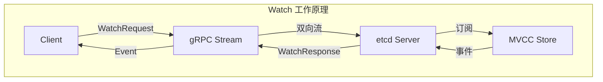
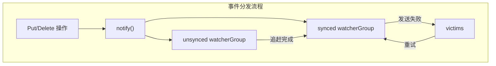
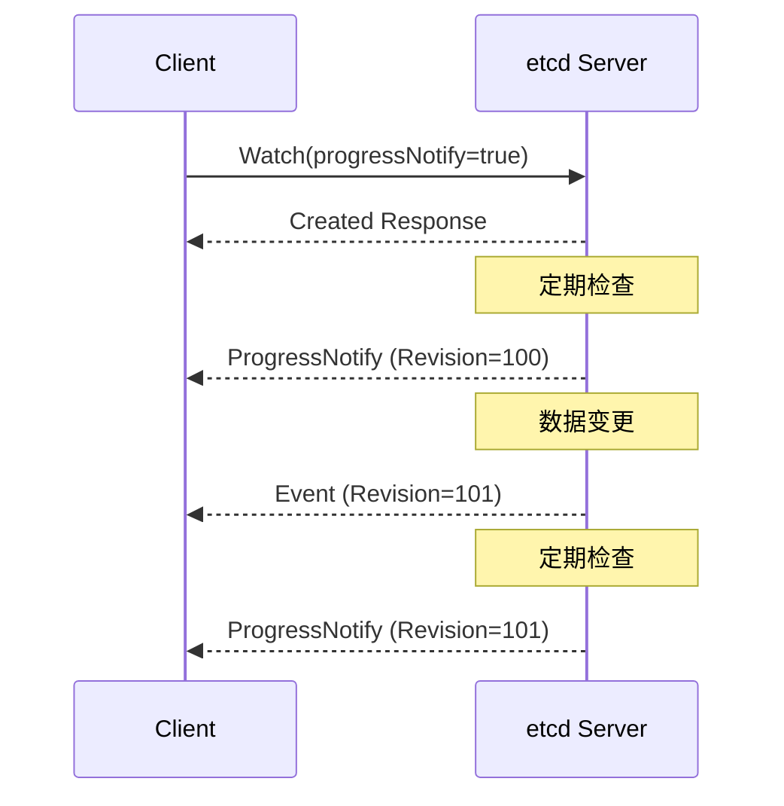

本文详细介绍 etcd Watch 机制的实现，包括服务端架构、客户端实现、进度通知和性能优化。

## 1. Watch 概述

### 1.1 Watch 原理

Watch 是 etcd 提供的核心功能，允许客户端监听键的变化：



### 1.2 Watch API

```protobuf
// Watch gRPC API
// api/etcdserverpb/rpc.proto

service Watch {
    // 双向流式 RPC
    rpc Watch(stream WatchRequest) returns (stream WatchResponse);
}

message WatchRequest {
    oneof request_union {
        WatchCreateRequest create_request = 1;
        WatchCancelRequest cancel_request = 2;
        WatchProgressRequest progress_request = 3;
    }
}

message WatchCreateRequest {
    bytes key = 1;              // 起始键
    bytes range_end = 2;        // 范围结束
    int64 start_revision = 3;   // 起始版本
    bool progress_notify = 4;   // 是否发送进度通知
    repeated FilterType filters = 5;  // 事件过滤
    bool prev_kv = 6;          // 是否返回前一个值
    int64 watch_id = 7;        // Watch ID (用于复用)
    bool fragment = 8;         // 是否分片
}

message WatchResponse {
    ResponseHeader header = 1;
    int64 watch_id = 2;
    bool created = 3;          // Watch 是否创建成功
    bool canceled = 4;         // Watch 是否取消
    int64 compact_revision = 5;// 压缩版本 (如果 Watch 失败)
    string cancel_reason = 6;
    bool fragment = 7;
    repeated Event events = 11;
}
```

## 2. 服务端实现

### 2.1 WatchableKV 接口

```go
// WatchableKV 接口
// server/storage/mvcc/watchable_store.go

type WatchableKV interface {
    KV
    Watchable
}

type Watchable interface {
    // 创建新的 Watch 流
    NewWatchStream() WatchStream
}

type WatchStream interface {
    // 创建 Watcher
    Watch(id WatchID, key, end []byte, startRev int64, fcs ...FilterFunc) (WatchID, error)

    // 取消 Watcher
    Cancel(id WatchID) error

    // 获取事件通道
    Chan() <-chan WatchResponse

    // 请求进度通知
    RequestProgress(id WatchID)

    // 关闭流
    Close()
}

type WatchResponse struct {
    WatchID     WatchID
    Events      []Event
    Revision    int64
    CompactRevision int64
}
```

### 2.2 Watchable Store 结构

```go
// WatchableStore 实现
// server/storage/mvcc/watchable_store.go

type watchableStore struct {
    *store

    mu sync.RWMutex

    // 未同步的 Watcher (等待历史事件)
    unsynced watcherGroup

    // 已同步的 Watcher (实时事件)
    synced   watcherGroup

    // 存储所有 Watcher
    watchers map[WatchID]*watcher

    // 进度通知的 Watcher
    progressWatchers map[WatchID]*watcher

    // 受害者 Watcher (等待重试)
    victims  []watcherBatch
    victimc  chan struct{}

    // 存储事件通知通道
    stopc    chan struct{}
    wg       sync.WaitGroup
}

// watcher 结构
type watcher struct {
    key, end []byte       // Watch 的键范围
    victim   bool
    compacted bool

    // 发送通道
    ch       chan<- WatchResponse

    // 最小版本
    minRev   int64

    // Watch ID
    id       WatchID

    // 过滤器
    fcs      []FilterFunc

    // 是否返回前值
    prevKV   bool
}
```

### 2.3 事件分发



```go
// 事件通知
// server/storage/mvcc/watchable_store.go

func (s *watchableStore) notify(rev int64, evs []Event) {
    var victims watcherBatch

    // 向已同步的 Watcher 发送事件
    for w, eb := range newWatcherBatch(&s.synced, evs) {
        if eb.revs != 1 {
            continue
        }

        w.minRev = rev + 1
        if !w.send(WatchResponse{WatchID: w.id, Events: eb.evs, Revision: rev}) {
            // 发送失败，加入受害者列表
            w.victim = true
            victims = append(victims, w)
        }
    }

    // 保存受害者
    s.addVictim(victims)
}

// watcher 发送事件
func (w *watcher) send(wr WatchResponse) bool {
    // 应用过滤器
    if len(w.fcs) != 0 {
        wr.Events = w.filter(wr.Events)
        if len(wr.Events) == 0 {
            return true
        }
    }

    select {
    case w.ch <- wr:
        return true
    default:
        return false
    }
}
```

### 2.4 Sync Loop

```go
// 同步循环
// server/storage/mvcc/watchable_store.go

func (s *watchableStore) syncWatchersLoop() {
    defer s.wg.Done()

    for {
        s.mu.RLock()
        st := time.Now()
        lastUnsyncedWatchers := s.unsynced.size()
        s.mu.RUnlock()

        // 同步未同步的 Watcher
        unsyncedWatchers := 0
        if lastUnsyncedWatchers > 0 {
            unsyncedWatchers = s.syncWatchers()
        }

        // 重试受害者
        s.mu.Lock()
        if len(s.victims) > 0 {
            s.moveVictims()
        }
        s.mu.Unlock()

        // 根据负载调整等待时间
        if unsyncedWatchers != 0 && lastUnsyncedWatchers > unsyncedWatchers {
            continue
        }

        select {
        case <-s.victimc:
        case <-time.After(100 * time.Millisecond):
        case <-s.stopc:
            return
        }
    }
}

// 同步 Watcher
func (s *watchableStore) syncWatchers() int {
    s.mu.Lock()
    defer s.mu.Unlock()

    // 获取需要同步的 Watcher
    curRev := s.store.currentRev
    compactionRev := s.store.compactMainRev

    // 按最小版本分组
    wg, minRev := s.unsynced.chooseN(maxSyncWatchers)
    if len(wg) == 0 {
        return 0
    }

    // 检查是否已压缩
    if minRev < compactionRev {
        // 取消这些 Watcher
        for _, w := range wg {
            w.compacted = true
            w.send(WatchResponse{CompactRevision: compactionRev})
        }
        return 0
    }

    // 获取历史事件
    tx := s.store.b.ReadTx()
    tx.RLock()
    evs, nextRev := s.store.getEventsAfter(minRev, curRev)
    tx.RUnlock()

    // 发送历史事件
    for _, w := range wg {
        // 过滤事件
        var es []Event
        for _, ev := range evs {
            if w.matchKey(ev.Kv.Key) && ev.Kv.ModRevision >= w.minRev {
                es = append(es, ev)
            }
        }

        // 发送
        if len(es) > 0 {
            w.send(WatchResponse{WatchID: w.id, Events: es, Revision: nextRev - 1})
        }

        w.minRev = nextRev
    }

    // 移动到已同步组
    for _, w := range wg {
        s.unsynced.delete(w)
        s.synced.add(w)
    }

    return len(wg)
}
```

## 3. 客户端实现

### 3.1 Watcher 接口

```go
// Watcher 客户端接口
// client/v3/watch.go

type Watcher interface {
    // 创建 Watch
    Watch(ctx context.Context, key string, opts ...OpOption) WatchChan

    // 请求进度通知
    RequestProgress(ctx context.Context) error

    // 关闭
    Close() error
}

type WatchChan <-chan WatchResponse

type WatchResponse struct {
    Header pb.ResponseHeader
    Events []*Event

    // CompactRevision 如果 Watch 因压缩而取消
    CompactRevision int64

    // Canceled 如果 Watch 被取消
    Canceled bool

    // Created 如果是创建响应
    Created bool

    // 错误
    closeErr error
}
```

### 3.2 Watcher 实现

```go
// Watcher 实现
// client/v3/watch.go

type watcher struct {
    remote   pb.WatchClient
    callOpts []grpc.CallOption

    mu sync.RWMutex

    // 活跃的 stream
    streams map[string]*watchGrpcStream
}

func (w *watcher) Watch(ctx context.Context, key string, opts ...OpOption) WatchChan {
    op := OpWatch(key, opts...)

    // 获取或创建 stream
    ws := w.getWatchStream(ctx)

    // 创建 Watch 请求
    wr := &watchRequest{
        ctx:            ctx,
        key:            op.key,
        end:            op.end,
        rev:            op.rev,
        progressNotify: op.progressNotify,
        prevKV:         op.prevKV,
        retc:           make(chan chan WatchResponse, 1),
    }

    // 发送请求
    select {
    case ws.reqc <- wr:
        ret := <-wr.retc
        return ret
    case <-ctx.Done():
        return nil
    }
}
```

### 3.3 gRPC Stream 管理

```go
// watchGrpcStream 管理单个 gRPC 流
// client/v3/watch.go

type watchGrpcStream struct {
    owner    *watcher
    remote   pb.WatchClient
    callOpts []grpc.CallOption

    ctx    context.Context
    cancel context.CancelFunc

    // 活跃的 Watcher
    substreams map[int64]*watcherStream

    // 恢复中的 Watcher
    resuming []*watcherStream

    // 请求通道
    reqc  chan watchStreamRequest
    respc chan *pb.WatchResponse

    // 关闭通道
    donec chan struct{}
}

func (w *watchGrpcStream) run() {
    for {
        select {
        case req := <-w.reqc:
            switch r := req.(type) {
            case *watchRequest:
                w.handleWatchRequest(r)
            case *progressRequest:
                w.handleProgressRequest(r)
            }

        case resp := <-w.respc:
            w.dispatchEvent(resp)

        case <-w.ctx.Done():
            return
        }
    }
}

// 分发事件
func (w *watchGrpcStream) dispatchEvent(resp *pb.WatchResponse) {
    // 查找目标 substream
    ws, ok := w.substreams[resp.WatchId]
    if !ok {
        return
    }

    // 转换事件
    wr := WatchResponse{
        Header:          *resp.Header,
        CompactRevision: resp.CompactRevision,
        Created:         resp.Created,
        Canceled:        resp.Canceled,
    }

    for _, ev := range resp.Events {
        wr.Events = append(wr.Events, (*Event)(ev))
    }

    // 发送到用户通道
    select {
    case ws.recvc <- wr:
    case <-ws.donec:
    }
}
```

### 3.4 自动重连

```go
// 自动重连逻辑
// client/v3/watch.go

func (w *watchGrpcStream) openWatchClient() (pb.Watch_WatchClient, error) {
    for {
        // 尝试建立连接
        wc, err := w.remote.Watch(w.ctx, w.callOpts...)
        if err == nil {
            return wc, nil
        }

        // 检查是否应该重试
        if !isHaltErr(w.ctx, err) {
            return nil, err
        }

        // 等待后重试
        select {
        case <-time.After(time.Second):
        case <-w.ctx.Done():
            return nil, w.ctx.Err()
        }
    }
}

// 恢复 Watch
func (w *watchGrpcStream) resumeWatchers(wc pb.Watch_WatchClient) {
    for _, ws := range w.resuming {
        // 发送恢复请求
        req := &pb.WatchRequest{
            RequestUnion: &pb.WatchRequest_CreateRequest{
                CreateRequest: &pb.WatchCreateRequest{
                    Key:           ws.key,
                    RangeEnd:      ws.end,
                    StartRevision: ws.rev,
                    PrevKv:        ws.prevKV,
                    WatchId:       ws.id,
                },
            },
        }

        if err := wc.Send(req); err != nil {
            continue
        }

        // 等待响应
        resp, err := wc.Recv()
        if err != nil {
            continue
        }

        if resp.WatchId != ws.id {
            ws.id = resp.WatchId
        }

        w.substreams[ws.id] = ws
    }

    w.resuming = nil
}
```

## 4. 进度通知

### 4.1 ProgressNotify 机制

进度通知允许客户端获取当前的 Revision：



### 4.2 实现细节

```go
// 进度通知处理
// server/storage/mvcc/watchable_store.go

func (s *watchableStore) progress(w *watcher) {
    s.mu.RLock()
    defer s.mu.RUnlock()

    if w.minRev > s.store.currentRev {
        return
    }

    // 发送进度通知
    w.send(WatchResponse{
        WatchID:  w.id,
        Revision: s.store.currentRev,
    })
}

// 定期触发进度通知
func (s *watchableStore) syncVictimsLoop() {
    defer s.wg.Done()

    timer := time.NewTicker(10 * time.Minute)
    defer timer.Stop()

    for {
        select {
        case <-timer.C:
            s.mu.RLock()
            for _, w := range s.progressWatchers {
                s.progress(w)
            }
            s.mu.RUnlock()
        case <-s.stopc:
            return
        }
    }
}
```

### 4.3 客户端使用

```go
// 请求进度通知
// client/v3/watch.go

func (w *watcher) RequestProgress(ctx context.Context) error {
    w.mu.Lock()
    defer w.mu.Unlock()

    // 向所有 stream 发送进度请求
    for _, ws := range w.streams {
        select {
        case ws.reqc <- &progressRequest{}:
        case <-ctx.Done():
            return ctx.Err()
        }
    }

    return nil
}

// 使用示例
func watchWithProgress(client *clientv3.Client) {
    ctx := context.Background()

    // 创建带进度通知的 Watch
    ch := client.Watch(ctx, "key", clientv3.WithProgressNotify())

    // 定期请求进度
    go func() {
        ticker := time.NewTicker(30 * time.Second)
        defer ticker.Stop()

        for range ticker.C {
            client.RequestProgress(ctx)
        }
    }()

    // 处理事件
    for resp := range ch {
        if resp.IsProgressNotify() {
            fmt.Printf("Progress: revision=%d\n", resp.Header.Revision)
            continue
        }

        for _, ev := range resp.Events {
            fmt.Printf("Event: %s %s\n", ev.Type, ev.Kv.Key)
        }
    }
}
```

## 5. Watch 过滤

### 5.1 过滤器类型

```go
// 过滤器定义
// api/etcdserverpb/rpc.proto

enum FilterType {
    NOPUT = 0;    // 过滤 PUT 事件
    NODELETE = 1; // 过滤 DELETE 事件
}

// 过滤函数
// server/storage/mvcc/watchable_store.go

type FilterFunc func(e Event) bool

// 内置过滤器
var (
    noPutFilterFunc = func(e Event) bool {
        return e.Type == mvccpb.DELETE
    }

    noDeleteFilterFunc = func(e Event) bool {
        return e.Type == mvccpb.PUT
    }
)
```

### 5.2 过滤实现

```go
// 事件过滤
// server/storage/mvcc/watchable_store.go

func (w *watcher) filter(evs []Event) []Event {
    if len(w.fcs) == 0 {
        return evs
    }

    filtered := make([]Event, 0, len(evs))
    for _, ev := range evs {
        pass := true
        for _, fc := range w.fcs {
            if !fc(ev) {
                pass = false
                break
            }
        }
        if pass {
            filtered = append(filtered, ev)
        }
    }

    return filtered
}

// 客户端使用过滤器
func watchWithFilter(client *clientv3.Client) {
    ctx := context.Background()

    // 只监听 PUT 事件
    ch := client.Watch(ctx, "key",
        clientv3.WithFilterDelete(), // 过滤 DELETE
    )

    // 只监听 DELETE 事件
    ch2 := client.Watch(ctx, "key",
        clientv3.WithFilterPut(), // 过滤 PUT
    )
}
```

## 6. Watch 分片

### 6.1 大事件分片

当单个事件过大时，etcd 会将其分片传输：

```go
// 分片配置
// server/etcdserver/api/v3rpc/watch.go

const maxWatchResponseBytes = 1.5 * 1024 * 1024 // 1.5MB

// 分片发送
func (ws *watchServer) sendLoop() {
    for {
        select {
        case wresp := <-ws.ch:
            // 检查是否需要分片
            if wresp.Size() > maxWatchResponseBytes {
                ws.sendFragmented(wresp)
            } else {
                ws.send(wresp)
            }
        case <-ws.closec:
            return
        }
    }
}

func (ws *watchServer) sendFragmented(wr *pb.WatchResponse) {
    events := wr.Events
    wr.Events = nil

    for i := 0; i < len(events); {
        // 计算本批次可以发送的事件数
        batchSize := 0
        batchEvents := make([]*mvccpb.Event, 0)

        for ; i < len(events); i++ {
            eventSize := events[i].Size()
            if batchSize+eventSize > maxWatchResponseBytes && len(batchEvents) > 0 {
                break
            }
            batchSize += eventSize
            batchEvents = append(batchEvents, events[i])
        }

        // 发送分片
        fragmentedResp := &pb.WatchResponse{
            Header:   wr.Header,
            WatchId:  wr.WatchId,
            Events:   batchEvents,
            Fragment: i < len(events), // 还有更多分片
        }

        ws.send(fragmentedResp)
    }
}
```

### 6.2 客户端重组

```go
// 分片重组
// client/v3/watch.go

type watcherStream struct {
    // 分片缓冲
    buf []*pb.WatchResponse
}

func (ws *watcherStream) recvResponse(wr *pb.WatchResponse) {
    if wr.Fragment {
        // 缓存分片
        ws.buf = append(ws.buf, wr)
        return
    }

    // 检查是否有缓存的分片
    if len(ws.buf) > 0 {
        // 重组所有分片
        ws.buf = append(ws.buf, wr)
        wr = ws.mergeFragments()
        ws.buf = nil
    }

    // 发送完整响应
    ws.recvc <- ws.convertResponse(wr)
}

func (ws *watcherStream) mergeFragments() *pb.WatchResponse {
    merged := &pb.WatchResponse{
        Header:  ws.buf[0].Header,
        WatchId: ws.buf[0].WatchId,
    }

    for _, frag := range ws.buf {
        merged.Events = append(merged.Events, frag.Events...)
    }

    // 更新 Header
    merged.Header = ws.buf[len(ws.buf)-1].Header

    return merged
}
```

## 7. 性能优化

### 7.1 Watcher 合并

```go
// Watcher 分组
// server/storage/mvcc/watcher_group.go

type watcherGroup struct {
    // 按键分组
    keyWatchers watcherSetByKey

    // 范围 Watcher
    ranges adt.IntervalTree

    // 所有 Watcher
    watchers watcherSet
}

// 按键分组优化事件分发
func (wg *watcherGroup) notify(ev Event) watcherBatch {
    wb := make(watcherBatch)

    // 精确匹配
    wg.keyWatchers[string(ev.Kv.Key)].walk(func(w *watcher) {
        wb.add(w, ev)
    })

    // 范围匹配
    wg.ranges.Visit(adt.NewStringAffinePoint(string(ev.Kv.Key)), func(n *adt.IntervalNode) bool {
        n.Value.(*watcher).notify(ev)
        return true
    })

    return wb
}
```

### 7.2 批量发送

```go
// 批量发送优化
// server/storage/mvcc/watchable_store.go

type watcherBatch map[*watcher]eventBatch

type eventBatch struct {
    evs  []Event
    revs int
}

func (wb watcherBatch) add(w *watcher, ev Event) {
    eb := wb[w]
    eb.evs = append(eb.evs, ev)
    eb.revs++
    wb[w] = eb
}

// 批量发送到单个 Watcher
func (w *watcher) sendBatch(eb eventBatch) bool {
    wr := WatchResponse{
        WatchID:  w.id,
        Events:   eb.evs,
        Revision: eb.evs[len(eb.evs)-1].Kv.ModRevision,
    }

    select {
    case w.ch <- wr:
        return true
    default:
        return false
    }
}
```

### 7.3 内存优化

```go
// 限制 Watch 数量
// server/embed/config.go

type Config struct {
    // 最大 Watch 数量
    MaxWatchersPerWatch uint
}

// 清理不活跃的 Watcher
func (s *watchableStore) cleanupWatchers() {
    s.mu.Lock()
    defer s.mu.Unlock()

    for id, w := range s.watchers {
        // 检查 Watcher 是否仍然活跃
        if w.isInactive() {
            delete(s.watchers, id)
            s.synced.delete(w)
            s.unsynced.delete(w)
        }
    }
}
```

### 7.4 连接复用

```go
// 单连接多 Watch
// client/v3/watch.go

// 所有 Watch 共享同一个 gRPC stream
func (w *watcher) newWatcherGrpcStream(ctx context.Context) *watchGrpcStream {
    return &watchGrpcStream{
        owner:      w,
        remote:     w.remote,
        substreams: make(map[int64]*watcherStream),
        // 所有 Watch 请求通过同一个通道
        reqc: make(chan watchStreamRequest),
    }
}

// 复用策略
func (w *watcher) getWatchStream(ctx context.Context) *watchGrpcStream {
    w.mu.Lock()
    defer w.mu.Unlock()

    // 查找现有的可用 stream
    for _, ws := range w.streams {
        if ws.isAvailable() {
            return ws
        }
    }

    // 创建新的 stream
    ws := w.newWatcherGrpcStream(ctx)
    w.streams[ws.id] = ws
    go ws.run()

    return ws
}
```

## 小结

本文介绍了 etcd Watch 的实现细节：

1. **服务端架构**：WatchableKV、Watcher 管理、事件分发
2. **Sync Loop**：未同步 Watcher 追赶、受害者重试
3. **客户端实现**：gRPC Stream 管理、自动重连、恢复机制
4. **进度通知**：ProgressNotify、同步点确认
5. **Watch 过滤**：事件过滤器、分片传输
6. **性能优化**：Watcher 合并、批量发送、连接复用

下一篇将介绍 etcd 的性能调优。
