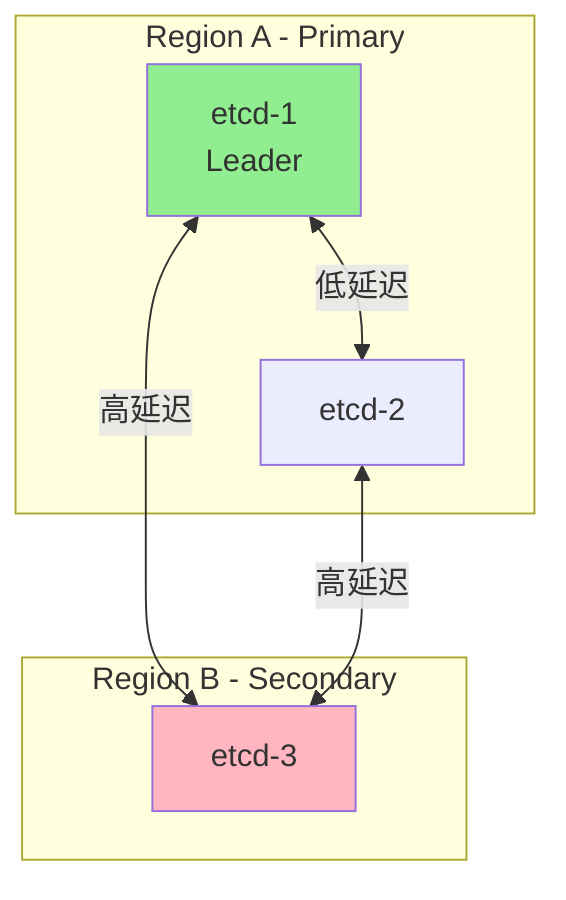

本文详细介绍 etcd 的性能调优方法，包括硬件配置、参数优化、存储优化和监控指标。

## 1. 硬件配置

### 1.1 硬件要求

```
etcd 硬件推荐:
├── 存储
│   ├── SSD (必需)
│   ├── 顺序写性能 > 50MB/s
│   └── fsync 延迟 < 10ms
├── 内存
│   ├── 小型集群: 8GB
│   ├── 中型集群: 16GB
│   └── 大型集群: 32GB+
├── CPU
│   ├── 小型集群: 2-4 核
│   └── 大型集群: 8+ 核
└── 网络
    ├── 节点间延迟 < 10ms
    └── 带宽 > 1Gbps
```

### 1.2 存储性能测试

```bash
# 测试磁盘顺序写性能
fio --rw=write --ioengine=sync --fdatasync=1 --directory=/var/lib/etcd \
    --size=22m --bs=2300 --name=etcd_perf

# 测试 fsync 延迟
# 期望值: 99th 延迟 < 10ms
dd if=/dev/zero of=/var/lib/etcd/test bs=512 count=1000 oflag=dsync
```

### 1.3 网络延迟测试

```bash
# 测试节点间延迟
ping -c 100 etcd-node-2

# 期望值:
# - 同机房: < 1ms
# - 跨机房: < 10ms
# - 跨区域: 不推荐 (> 50ms)
```

## 2. 关键参数

### 2.1 Raft 参数

```yaml
# etcd 配置文件示例
# /etc/etcd/etcd.conf.yaml

# 心跳间隔 (毫秒)
# 默认: 100ms
# 推荐: 根据网络延迟调整
heartbeat-interval: 100

# 选举超时 (毫秒)
# 默认: 1000ms
# 推荐: heartbeat-interval 的 10 倍
election-timeout: 1000
```

| 参数 | 默认值 | 推荐值 | 说明 |
|-----|-------|-------|------|
| heartbeat-interval | 100ms | 100-500ms | 心跳间隔 |
| election-timeout | 1000ms | 1000-5000ms | 选举超时 |
| snapshot-count | 100000 | 10000-100000 | 快照触发阈值 |

### 2.2 存储参数

```yaml
# 存储配额 (字节)
# 默认: 2GB
# 推荐: 根据数据量调整，最大 8GB
quota-backend-bytes: 8589934592

# 自动压缩模式
# periodic: 按时间周期
# revision: 按版本数量
auto-compaction-mode: periodic

# 自动压缩保留
# periodic 模式: 保留时间 (如 "1h")
# revision 模式: 保留版本数
auto-compaction-retention: "1h"

# 后端批量提交间隔 (毫秒)
# 更小的值提高一致性，但降低吞吐量
backend-batch-interval: 100

# 后端批量限制
backend-batch-limit: 10000
```

### 2.3 网络参数

```yaml
# 最大请求大小 (字节)
# 默认: 1.5MB
max-request-bytes: 1572864

# gRPC 保活参数
# grpc-keepalive-min-time: 服务端允许的最小保活间隔
# grpc-keepalive-interval: 客户端保活间隔
# grpc-keepalive-timeout: 保活超时
```

### 2.4 Kubernetes 特定优化

```go
// API Server 的 etcd 配置
// staging/src/k8s.io/apiserver/pkg/storage/storagebackend/config.go

type TransportConfig struct {
    // etcd 服务器列表
    ServerList []string

    // TLS 配置
    CertFile   string
    KeyFile    string
    CAFile     string

    // 连接池大小
    // 推荐: CPU 核数 * 2
    MaxIdleConns int

    // 单个请求超时
    // 推荐: 较短超时以快速失败
    RequestTimeout time.Duration

    // Watch 缓存大小
    // staging/src/k8s.io/apiserver/pkg/storage/cacher/cacher.go
    CacheCapacity int
}

// 推荐配置
config := &TransportConfig{
    MaxIdleConns:   100,
    RequestTimeout: 30 * time.Second,
    CacheCapacity:  1000,
}
```

## 3. 存储优化

### 3.1 碎片整理

```bash
# 检查碎片率
etcdctl endpoint status --write-out=table

# 输出示例:
# +------------------------+------------------+---------+---------+-----------+
# |       ENDPOINT         |        ID        | VERSION | DB SIZE | IS LEADER |
# +------------------------+------------------+---------+---------+-----------+
# | https://etcd-1:2379    | 8e9e05c52164694d | 3.5.0   | 1.2 GB  |    true   |
# +------------------------+------------------+---------+---------+-----------+

# 如果 "DB SIZE" 远大于实际数据量，需要碎片整理
etcdctl defrag --endpoints=https://etcd-1:2379,https://etcd-2:2379,https://etcd-3:2379
```

### 3.2 Compaction 策略

```bash
# 手动 Compaction
# 1. 获取当前 revision
rev=$(etcdctl endpoint status --write-out="json" | jq -r '.[0].Status.header.revision')

# 2. 执行 compaction
etcdctl compaction $rev

# 自动 Compaction 配置
# etcd 启动参数
etcd --auto-compaction-mode=periodic \
     --auto-compaction-retention=1h
```

### 3.3 配额管理

```bash
# 检查配额使用
etcdctl endpoint status --write-out=table

# 报警检查
etcdctl alarm list

# 如果触发配额报警:
# 1. 压缩历史版本
etcdctl compaction <revision>

# 2. 碎片整理
etcdctl defrag

# 3. 解除报警
etcdctl alarm disarm

# 增加配额 (需要重启)
etcd --quota-backend-bytes=8589934592
```

### 3.4 快照管理

```bash
# 创建快照
etcdctl snapshot save /backup/etcd-snapshot.db

# 检查快照
etcdctl snapshot status /backup/etcd-snapshot.db --write-out=table

# 定期快照脚本
#!/bin/bash
BACKUP_DIR=/backup/etcd
DATE=$(date +%Y%m%d_%H%M%S)
etcdctl snapshot save ${BACKUP_DIR}/snapshot_${DATE}.db
# 保留最近 7 天
find ${BACKUP_DIR} -name "snapshot_*.db" -mtime +7 -delete
```

## 4. 客户端优化

### 4.1 连接池配置

```go
// etcd 客户端连接池
// client/v3/config.go

type Config struct {
    Endpoints   []string
    DialTimeout time.Duration

    // 连接池大小
    MaxCallSendMsgSize int
    MaxCallRecvMsgSize int

    // 自动同步端点
    AutoSyncInterval time.Duration

    // 重试策略
    // client/v3/retry_interceptor.go
}

// 推荐配置
cfg := clientv3.Config{
    Endpoints:   []string{"etcd-1:2379", "etcd-2:2379", "etcd-3:2379"},
    DialTimeout: 5 * time.Second,

    // 自动同步端点列表 (应对集群变更)
    AutoSyncInterval: 30 * time.Second,
}
```

### 4.2 批量操作

```go
// 使用事务进行批量操作
func batchPut(client *clientv3.Client, kvs map[string]string) error {
    ops := make([]clientv3.Op, 0, len(kvs))
    for k, v := range kvs {
        ops = append(ops, clientv3.OpPut(k, v))
    }

    // 使用事务
    _, err := client.Txn(context.Background()).
        Then(ops...).
        Commit()

    return err
}

// 分批处理大量操作
func batchPutLarge(client *clientv3.Client, kvs map[string]string) error {
    const batchSize = 100

    keys := make([]string, 0, len(kvs))
    for k := range kvs {
        keys = append(keys, k)
    }

    for i := 0; i < len(keys); i += batchSize {
        end := i + batchSize
        if end > len(keys) {
            end = len(keys)
        }

        batch := make(map[string]string)
        for _, k := range keys[i:end] {
            batch[k] = kvs[k]
        }

        if err := batchPut(client, batch); err != nil {
            return err
        }
    }

    return nil
}
```

### 4.3 Watch 优化

```go
// Watch 优化最佳实践
func optimizedWatch(client *clientv3.Client, prefix string) {
    ctx := context.Background()

    // 1. 使用前缀 Watch
    ch := client.Watch(ctx, prefix,
        clientv3.WithPrefix(),
        clientv3.WithProgressNotify(), // 启用进度通知
        clientv3.WithPrevKV(),         // 需要时才启用
    )

    // 2. 批量处理事件
    eventBatch := make([]*clientv3.Event, 0, 100)
    ticker := time.NewTicker(100 * time.Millisecond)

    for {
        select {
        case resp := <-ch:
            if resp.Err() != nil {
                // 处理错误
                continue
            }

            if resp.IsProgressNotify() {
                // 处理进度通知
                continue
            }

            eventBatch = append(eventBatch, resp.Events...)

        case <-ticker.C:
            if len(eventBatch) > 0 {
                processEvents(eventBatch)
                eventBatch = eventBatch[:0]
            }
        }
    }
}
```

### 4.4 重试策略

```go
// 带重试的操作
func putWithRetry(client *clientv3.Client, key, value string) error {
    backoff := wait.Backoff{
        Duration: 100 * time.Millisecond,
        Factor:   2,
        Jitter:   0.1,
        Steps:    5,
        Cap:      5 * time.Second,
    }

    return wait.ExponentialBackoff(backoff, func() (bool, error) {
        ctx, cancel := context.WithTimeout(context.Background(), 2*time.Second)
        defer cancel()

        _, err := client.Put(ctx, key, value)
        if err != nil {
            // 检查是否可重试
            if isRetryable(err) {
                return false, nil // 继续重试
            }
            return false, err // 不可恢复的错误
        }

        return true, nil // 成功
    })
}

func isRetryable(err error) bool {
    // 超时、连接错误等可重试
    return err == context.DeadlineExceeded ||
           status.Code(err) == codes.Unavailable
}
```

## 5. 集群优化

### 5.1 节点数量选择

```
集群规模建议:
├── 3 节点
│   ├── 容忍 1 节点故障
│   └── 适用: 小型生产环境
├── 5 节点
│   ├── 容忍 2 节点故障
│   └── 适用: 中大型生产环境
└── 7 节点 (不推荐更多)
    ├── 容忍 3 节点故障
    └── 注意: 写入延迟增加
```

### 5.2 Learner 节点

```bash
# 添加 Learner 节点 (不参与投票)
etcdctl member add etcd-learner \
    --peer-urls=https://etcd-learner:2380 \
    --learner

# Learner 节点启动
etcd --name etcd-learner \
    --initial-cluster-state existing \
    ...

# 检查同步状态后，提升为正式成员
etcdctl member promote <learner-member-id>
```

### 5.3 跨区域部署



```yaml
# 跨区域配置建议
# Region A (主区域): 2 节点
# Region B (备区域): 1 节点

# 优化心跳和选举超时以适应跨区域延迟
heartbeat-interval: 300    # 增加心跳间隔
election-timeout: 3000     # 增加选举超时
```

## 6. 监控指标

### 6.1 关键指标

```bash
# Prometheus 指标端点
curl http://etcd:2379/metrics

# 关键指标列表
```

| 指标 | 说明 | 告警阈值 |
|-----|------|---------|
| etcd_server_has_leader | 是否有 Leader | = 0 |
| etcd_server_leader_changes_seen_total | Leader 切换次数 | > 3/hour |
| etcd_disk_wal_fsync_duration_seconds | WAL fsync 延迟 | p99 > 10ms |
| etcd_disk_backend_commit_duration_seconds | 后端提交延迟 | p99 > 25ms |
| etcd_server_proposals_failed_total | 失败的提案数 | > 0 |
| etcd_network_peer_round_trip_time_seconds | 节点间 RTT | p99 > 50ms |
| etcd_mvcc_db_total_size_in_bytes | 数据库大小 | > quota * 0.8 |

### 6.2 Prometheus 告警规则

```yaml
# etcd 告警规则
groups:
- name: etcd
  rules:
  - alert: EtcdNoLeader
    expr: etcd_server_has_leader == 0
    for: 1m
    labels:
      severity: critical
    annotations:
      summary: "etcd 集群没有 Leader"

  - alert: EtcdHighFsyncLatency
    expr: histogram_quantile(0.99, rate(etcd_disk_wal_fsync_duration_seconds_bucket[5m])) > 0.01
    for: 5m
    labels:
      severity: warning
    annotations:
      summary: "etcd WAL fsync 延迟过高"

  - alert: EtcdHighCommitLatency
    expr: histogram_quantile(0.99, rate(etcd_disk_backend_commit_duration_seconds_bucket[5m])) > 0.025
    for: 5m
    labels:
      severity: warning
    annotations:
      summary: "etcd 后端提交延迟过高"

  - alert: EtcdQuotaNearLimit
    expr: etcd_mvcc_db_total_size_in_bytes / etcd_server_quota_backend_bytes > 0.8
    for: 5m
    labels:
      severity: warning
    annotations:
      summary: "etcd 存储配额即将用尽"

  - alert: EtcdMemberUnhealthy
    expr: etcd_server_health_failures > 0
    for: 3m
    labels:
      severity: warning
    annotations:
      summary: "etcd 成员健康检查失败"
```

### 6.3 Grafana 仪表盘

```json
{
  "title": "etcd Overview",
  "panels": [
    {
      "title": "Leader",
      "targets": [{
        "expr": "etcd_server_is_leader"
      }]
    },
    {
      "title": "DB Size",
      "targets": [{
        "expr": "etcd_mvcc_db_total_size_in_bytes"
      }]
    },
    {
      "title": "WAL Fsync Latency",
      "targets": [{
        "expr": "histogram_quantile(0.99, rate(etcd_disk_wal_fsync_duration_seconds_bucket[5m]))"
      }]
    },
    {
      "title": "Client Traffic In",
      "targets": [{
        "expr": "rate(etcd_network_client_grpc_received_bytes_total[5m])"
      }]
    },
    {
      "title": "Proposals",
      "targets": [
        {"expr": "rate(etcd_server_proposals_committed_total[5m])", "legendFormat": "committed"},
        {"expr": "rate(etcd_server_proposals_applied_total[5m])", "legendFormat": "applied"},
        {"expr": "rate(etcd_server_proposals_failed_total[5m])", "legendFormat": "failed"}
      ]
    }
  ]
}
```

## 7. 性能测试

### 7.1 基准测试工具

```bash
# 使用 etcd 自带的基准测试工具
# 写入测试
etcd-benchmark put \
    --endpoints=https://etcd-1:2379 \
    --total=100000 \
    --clients=100 \
    --conns=100 \
    --key-size=8 \
    --val-size=256

# 读取测试
etcd-benchmark range \
    --endpoints=https://etcd-1:2379 \
    --total=100000 \
    --clients=100 \
    --conns=100

# 混合负载测试
etcd-benchmark mixed \
    --endpoints=https://etcd-1:2379 \
    --total=100000 \
    --clients=100 \
    --ratio=0.9  # 90% 读，10% 写
```

### 7.2 预期性能

```
典型性能参考 (3节点SSD):
├── 写入
│   ├── 延迟: p50=2ms, p99=10ms
│   └── 吞吐: 10,000-30,000 QPS
├── 读取 (缓存命中)
│   ├── 延迟: p50=0.5ms, p99=2ms
│   └── 吞吐: 50,000+ QPS
└── Watch
    └── 事件吞吐: 100,000+ events/s
```

### 7.3 压力测试脚本

```bash
#!/bin/bash
# etcd 压力测试脚本

ENDPOINTS="https://etcd-1:2379,https://etcd-2:2379,https://etcd-3:2379"
TOTAL=100000
CLIENTS=100

echo "=== Write Performance ==="
etcd-benchmark put \
    --endpoints=$ENDPOINTS \
    --total=$TOTAL \
    --clients=$CLIENTS \
    --key-size=8 \
    --val-size=256

echo "=== Read Performance ==="
etcd-benchmark range \
    --endpoints=$ENDPOINTS \
    --total=$TOTAL \
    --clients=$CLIENTS

echo "=== Watch Performance ==="
etcd-benchmark watch \
    --endpoints=$ENDPOINTS \
    --total=$TOTAL \
    --clients=$CLIENTS

echo "=== Cluster Status ==="
etcdctl endpoint status --endpoints=$ENDPOINTS --write-out=table
```

## 小结

本文介绍了 etcd 性能调优的关键方面：

1. **硬件配置**：SSD 存储、内存规划、网络延迟
2. **关键参数**：Raft 参数、存储参数、网络参数
3. **存储优化**：碎片整理、Compaction、配额管理
4. **客户端优化**：连接池、批量操作、重试策略
5. **集群优化**：节点数量、Learner 节点、跨区域部署
6. **监控指标**：关键指标、告警规则、仪表盘
7. **性能测试**：基准测试、预期性能

下一篇将介绍 etcd 的备份与恢复。
